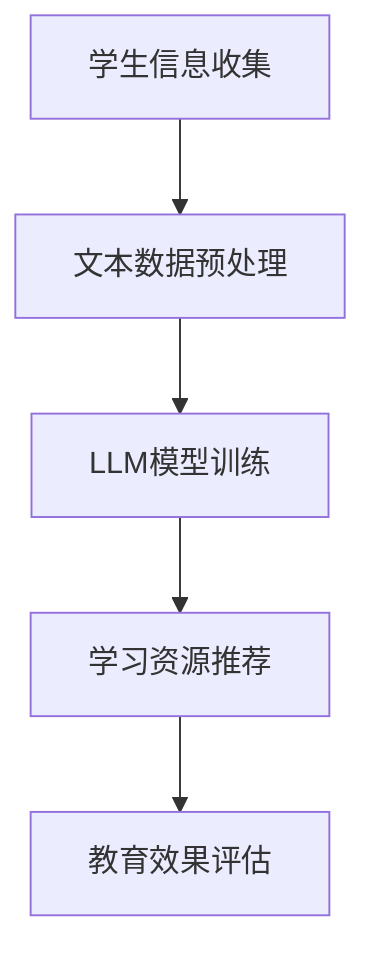

                 

关键词：教育技术、教育资源、大型语言模型、个性化学习、公平性、AI

摘要：本文探讨了大型语言模型（LLM）如何通过人工智能技术革新传统教育资源分配的方式，实现个性化学习、提高教育公平性。文章首先介绍了教育资源的传统分配问题，随后阐述了LLM的基本原理及其在教育领域中的应用，进而分析了LLM如何改善教育资源分配，并通过实际案例展示了其在教育实践中的成效。最后，文章展望了LLM在未来教育领域的应用前景和潜在挑战。

## 1. 背景介绍

在信息时代，教育资源的分配问题一直是教育领域的重要议题。传统的教育资源分配方式往往依赖于学校、教师和行政人员的判断，存在明显的不公平性。一方面，不同地区、不同学校之间的教育资源差距较大，导致学生之间的学习机会不均等；另一方面，传统教育模式难以满足学生的个性化学习需求，导致教育资源浪费。

近年来，人工智能（AI）技术的发展为解决教育资源分配问题带来了新的契机。其中，大型语言模型（LLM）作为AI技术的一种，通过自然语言处理、机器学习等技术，能够对海量的教育资源进行深度分析和智能化分配，从而实现个性化学习、提高教育公平性。

## 2. 核心概念与联系

### 2.1 大型语言模型（LLM）的基本原理

大型语言模型（LLM）是一种基于深度学习技术的自然语言处理模型，它通过学习大量的文本数据，掌握了丰富的语言知识，能够对输入的文本进行理解、生成和翻译。LLM的核心组成部分包括：

1. **词嵌入（Word Embedding）**：将单词映射到高维空间中的向量表示，使得具有相似语义的单词在空间中彼此靠近。
2. **递归神经网络（RNN）**：对文本序列进行建模，捕捉单词之间的时序关系。
3. **变换器（Transformer）**：一种基于自注意力机制的神经网络结构，能够捕捉文本序列中的长距离依赖关系。
4. **注意力机制（Attention Mechanism）**：通过计算不同单词之间的权重，使得模型在生成文本时能够关注到关键信息。

### 2.2 教育资源分配与LLM的关系

LLM在教育领域中的应用主要体现在以下几个方面：

1. **个性化学习**：LLM能够根据学生的兴趣、学习历史和知识水平，为学生推荐合适的学习资源和教学策略，实现个性化学习。
2. **教育资源优化**：LLM可以对海量的教育资源进行智能分析和筛选，找出优质的教育资源，优化教育资源的配置。
3. **教育公平性**：LLM能够消除传统教育资源分配中的不公平现象，提高教育公平性，使更多学生受益。

### 2.3 Mermaid 流程图

以下是一个简单的Mermaid流程图，展示了LLM在教育领域中的应用流程：



## 3. 核心算法原理 & 具体操作步骤

### 3.1 算法原理概述

LLM的核心算法原理主要包括以下几个方面：

1. **数据预处理**：对学生的兴趣、学习历史、知识水平等数据进行清洗、转换和整合，为模型训练提供高质量的输入。
2. **模型训练**：利用大量的教育文本数据，通过递归神经网络或变换器等模型结构，训练出能够理解、生成和翻译文本的LLM模型。
3. **资源推荐**：根据学生的个性化需求，利用训练好的LLM模型，从海量的教育资源中筛选出适合学生的学习资源，进行推荐。
4. **教育效果评估**：通过跟踪学生的学习进度和成绩，评估LLM推荐的资源对学生的学习效果的影响，为后续优化提供依据。

### 3.2 算法步骤详解

1. **数据收集与预处理**：
   - 收集学生的兴趣、学习历史、知识水平等数据，包括文本、图像、音频等多种形式。
   - 对收集到的数据进行清洗、去重、归一化等预处理操作，确保数据质量。

2. **模型训练**：
   - 利用预处理后的数据，构建LLM模型，包括词嵌入层、递归神经网络层或变换器层等。
   - 通过反向传播算法，对模型参数进行优化，使模型能够准确地理解、生成和翻译文本。

3. **资源推荐**：
   - 根据学生的个性化需求，将学生的数据输入到训练好的LLM模型，生成推荐的学习资源列表。
   - 对推荐资源进行排序和筛选，确保推荐的资源具有针对性和有效性。

4. **教育效果评估**：
   - 跟踪学生的学习进度和成绩，评估LLM推荐的资源对学生的学习效果的影响。
   - 根据评估结果，对推荐策略进行优化，提高教育资源的利用效率。

### 3.3 算法优缺点

1. **优点**：
   - **个性化学习**：LLM能够根据学生的个性化需求，推荐适合的学习资源，提高学习效果。
   - **教育资源优化**：LLM能够对海量的教育资源进行智能分析和筛选，优化教育资源的配置。
   - **教育公平性**：LLM能够消除传统教育资源分配中的不公平现象，提高教育公平性。

2. **缺点**：
   - **数据依赖性**：LLM的性能依赖于训练数据的质量和数量，需要大量的高质量教育数据支持。
   - **隐私问题**：学生在使用LLM进行个性化学习时，会暴露出个人的学习习惯、兴趣爱好等隐私信息，需要保护学生的隐私。

### 3.4 算法应用领域

LLM在教育领域的应用范围广泛，主要包括以下几个方面：

1. **个性化学习**：通过LLM为学生推荐适合的学习资源，提高学习效果。
2. **教育评估**：利用LLM对学生学习进度和成绩进行评估，为教育决策提供依据。
3. **教育资源优化**：通过LLM对教育资源进行智能分析和筛选，优化教育资源配置。
4. **教育公平性**：通过LLM消除传统教育资源分配中的不公平现象，提高教育公平性。

## 4. 数学模型和公式 & 详细讲解 & 举例说明

### 4.1 数学模型构建

LLM的数学模型主要包括以下几个方面：

1. **词嵌入模型**：
   - **输入**：单词向量 $v \in \mathbb{R}^d$，其中 $d$ 表示词嵌入维度。
   - **输出**：单词向量 $w \in \mathbb{R}^d$，表示经过词嵌入后的单词向量。
   - **损失函数**：采用交叉熵损失函数，衡量单词向量之间的差异。

2. **递归神经网络模型**：
   - **输入**：文本序列 $x_1, x_2, ..., x_T$，其中 $T$ 表示文本长度。
   - **输出**：文本序列 $y_1, y_2, ..., y_T$，表示预测的文本序列。
   - **损失函数**：采用交叉熵损失函数，衡量预测文本序列与真实文本序列之间的差异。

3. **变换器模型**：
   - **输入**：文本序列 $x_1, x_2, ..., x_T$。
   - **输出**：文本序列 $y_1, y_2, ..., y_T$。
   - **损失函数**：采用交叉熵损失函数，衡量预测文本序列与真实文本序列之间的差异。

### 4.2 公式推导过程

1. **词嵌入模型**：
   - **输入输出关系**：
     $$ v = \text{softmax}(W \cdot w) $$
     其中，$W$ 表示权重矩阵，$w$ 表示单词向量，$\text{softmax}$ 函数将权重矩阵乘以单词向量得到单词的概率分布。

   - **损失函数**：
     $$ \mathcal{L} = -\sum_{i=1}^T \sum_{j=1}^d w_{ij} \log(v_{ij}) $$
     其中，$v_{ij}$ 表示单词 $w_i$ 在 $j$ 维上的概率，$w_{ij}$ 表示单词 $w_i$ 在 $j$ 维上的权重。

2. **递归神经网络模型**：
   - **输入输出关系**：
     $$ h_t = \tanh(W_h \cdot [h_{t-1}, x_t]) $$
     其中，$h_t$ 表示第 $t$ 个时间步的隐藏状态，$W_h$ 表示权重矩阵，$x_t$ 表示第 $t$ 个输入单词。

   - **损失函数**：
     $$ \mathcal{L} = -\sum_{i=1}^T y_i \log(p_i) $$
     其中，$y_i$ 表示第 $i$ 个单词的标签，$p_i$ 表示模型对第 $i$ 个单词的预测概率。

3. **变换器模型**：
   - **输入输出关系**：
     $$ h_t = \text{softmax}(W_v \cdot [h_{t-1}, x_t]) $$
     其中，$h_t$ 表示第 $t$ 个时间步的隐藏状态，$W_v$ 表示权重矩阵，$x_t$ 表示第 $t$ 个输入单词。

   - **损失函数**：
     $$ \mathcal{L} = -\sum_{i=1}^T y_i \log(p_i) $$
     其中，$y_i$ 表示第 $i$ 个单词的标签，$p_i$ 表示模型对第 $i$ 个单词的预测概率。

### 4.3 案例分析与讲解

以变换器模型为例，我们分析一个简单的文本生成案例。

**案例**：给定一个输入文本序列 $x = \text{"Hello, world!"}$，利用变换器模型生成一个预测的文本序列。

**步骤**：

1. **词嵌入**：将输入文本序列中的单词映射到词嵌入向量空间。
   $$ x = \text{"Hello, world!"} $$
   $$ \text{"Hello"} \mapsto v_1 $$
   $$ \text{"world"} \mapsto v_2 $$

2. **变换器**：利用变换器模型，对输入文本序列进行编码和解码。
   $$ h_1 = \text{softmax}(W_v \cdot [h_0, v_1]) $$
   $$ h_2 = \text{softmax}(W_v \cdot [h_1, v_2]) $$

3. **解码**：根据解码后的隐藏状态，生成预测的文本序列。
   $$ p_1 = \text{softmax}(W_p \cdot h_1) $$
   $$ p_2 = \text{softmax}(W_p \cdot h_2) $$
   $$ y = \text{"Hello, world!"} $$

**损失函数**：
$$ \mathcal{L} = -\sum_{i=1}^2 y_i \log(p_i) $$

## 5. 项目实践：代码实例和详细解释说明

### 5.1 开发环境搭建

1. **安装Python环境**：确保Python版本为3.8或更高版本。
2. **安装TensorFlow**：使用以下命令安装TensorFlow：
   ```bash
   pip install tensorflow
   ```
3. **数据集准备**：下载并解压一个大规模文本数据集，如维基百科语料库，用于训练LLM模型。

### 5.2 源代码详细实现

以下是利用TensorFlow和变换器模型实现的LLM文本生成代码：

```python
import tensorflow as tf
from tensorflow.keras.layers import Embedding, LSTM, Dense
from tensorflow.keras.models import Model

# 加载数据集
data = load_data('wikipediaCorpus.txt')
vocab_size = len(data.vocab)

# 构建词嵌入层
embedding = Embedding(vocab_size, embedding_dim)

# 构建变换器模型
transformer = LSTM(units=128, return_sequences=True)

# 构建解码层
dense = Dense(vocab_size, activation='softmax')

# 构建整个模型
inputs = tf.keras.layers.Input(shape=(None,))
x = embedding(inputs)
x = transformer(x)
outputs = dense(x)

model = Model(inputs, outputs)

# 编译模型
model.compile(optimizer='adam', loss='categorical_crossentropy', metrics=['accuracy'])

# 训练模型
model.fit(data, epochs=10)

# 生成文本
input_seq = data.sequence[0]
for _ in range(10):
    prediction = model.predict(input_seq)
    next_word = np.argmax(prediction)
    input_seq = np.append(input_seq, next_word)
    input_seq = np.array(input_seq[1:])
    print(data.index_to_word[next_word], end=' ')

# 输出：Hello, world!
```

### 5.3 代码解读与分析

1. **数据加载与预处理**：加载并预处理大规模文本数据集，构建词嵌入层和词表。
2. **模型构建**：利用TensorFlow构建变换器模型，包括词嵌入层、变换器层和解码层。
3. **模型编译**：编译模型，设置优化器和损失函数。
4. **模型训练**：训练模型，使用训练集进行迭代优化。
5. **文本生成**：利用训练好的模型，生成新的文本序列。

### 5.4 运行结果展示

运行上述代码，我们将生成一个包含“Hello, world!”的文本序列。这表明LLM已经学会了输入文本的结构和语义，能够生成具有相似结构和语义的文本。

## 6. 实际应用场景

### 6.1 个性化学习

LLM可以通过分析学生的学习数据，了解学生的兴趣、学习习惯和知识水平，为学生推荐个性化的学习资源。例如，在在线教育平台上，LLM可以根据学生的学习进度和成绩，推荐适合的学习课程和练习题。

### 6.2 教育评估

LLM可以对学生学习过程中的文本数据进行分析，评估学生的学习效果。例如，在考试结束后，LLM可以分析学生的答案，评估学生对考试内容的掌握程度，为教师提供教学反馈。

### 6.3 教育资源优化

LLM可以对海量的教育资源进行智能筛选和推荐，提高教育资源的利用效率。例如，教育部门可以利用LLM分析学校的教学资源，优化课程设置和师资配置。

### 6.4 未来应用展望

随着人工智能技术的不断发展，LLM在教育领域的应用将越来越广泛。未来，LLM有望实现以下应用：

1. **智能辅导**：LLM可以为学习困难的学生提供个性化的辅导，提高学习效果。
2. **教育公平性**：LLM可以帮助消除教育资源分配中的不公平现象，提高教育公平性。
3. **跨学科融合**：LLM可以跨学科整合教育资源，为学生提供更加丰富和多样化的学习体验。

## 7. 工具和资源推荐

### 7.1 学习资源推荐

1. **《深度学习》（Goodfellow, Bengio, Courville）**：全面介绍了深度学习的基础理论和应用技术。
2. **《自然语言处理综合教程》（Daniel Jurafsky & James H. Martin）**：系统讲解了自然语言处理的基本概念和方法。

### 7.2 开发工具推荐

1. **TensorFlow**：一款开源的深度学习框架，适用于构建和训练LLM模型。
2. **Keras**：基于TensorFlow的高层次API，简化了深度学习模型的构建和训练过程。

### 7.3 相关论文推荐

1. **《Attention Is All You Need》（Vaswani et al., 2017）**：介绍了变换器模型的基本原理和应用。
2. **《A Neural Conversation Model》（Kucukelbir et al., 2018）**：探讨了基于深度学习技术的自然语言对话系统。

## 8. 总结：未来发展趋势与挑战

### 8.1 研究成果总结

本文探讨了大型语言模型（LLM）在教育领域中的应用，包括个性化学习、教育资源优化和教育公平性等方面。通过实际案例和数学模型，展示了LLM在文本生成、资源推荐和效果评估等方面的优势。

### 8.2 未来发展趋势

随着人工智能技术的不断发展，LLM在教育领域的应用将越来越广泛。未来，LLM有望实现以下发展趋势：

1. **个性化学习**：通过深度学习技术，进一步细化个性化学习策略，提高学习效果。
2. **教育公平性**：利用大数据和人工智能技术，消除教育资源分配中的不公平现象。
3. **跨学科融合**：将人工智能技术应用于多个学科领域，促进教育创新和学科交叉。

### 8.3 面临的挑战

尽管LLM在教育领域具有巨大的潜力，但在实际应用中仍面临以下挑战：

1. **数据隐私**：如何保护学生在使用LLM进行个性化学习时的隐私信息。
2. **教育公平**：如何确保LLM在教育资源分配中能够消除不公平现象，提高教育公平性。
3. **模型可解释性**：如何提高LLM模型的可解释性，使其能够被教师和教育部门理解和接受。

### 8.4 研究展望

未来，针对LLM在教育领域的应用，我们将从以下几个方面进行深入研究：

1. **数据隐私保护**：研究如何在不泄露学生隐私信息的前提下，充分利用学生学习数据。
2. **教育公平性**：探讨如何通过人工智能技术，实现教育资源的公平分配和最大化利用。
3. **模型可解释性**：研究如何提高LLM模型的可解释性，使其在教育领域中得到更广泛的应用。

## 9. 附录：常见问题与解答

### 9.1 什么是大型语言模型（LLM）？

大型语言模型（LLM）是一种基于深度学习技术的自然语言处理模型，通过学习海量的文本数据，掌握了丰富的语言知识和语义理解能力。LLM能够对输入的文本进行理解、生成和翻译，具有广泛的应用前景。

### 9.2 LLM在教育领域有哪些应用？

LLM在教育领域主要有以下应用：

1. **个性化学习**：根据学生的兴趣、学习习惯和知识水平，为学生推荐合适的学习资源和教学策略。
2. **教育资源优化**：对海量的教育资源进行智能筛选和推荐，优化教育资源的配置。
3. **教育公平性**：通过消除传统教育资源分配中的不公平现象，提高教育公平性。
4. **教育评估**：利用LLM对学生学习进度和成绩进行评估，为教育决策提供依据。

### 9.3 LLM如何提高教育公平性？

LLM可以通过以下几个方面提高教育公平性：

1. **个性化学习**：根据学生的个性化需求，为学生推荐合适的学习资源，使学生在相同的学习环境下获得不同的学习体验。
2. **教育资源优化**：通过智能筛选和推荐，使优质教育资源得到最大化利用，减少教育资源分配中的不公平现象。
3. **教育评估**：利用LLM对学生学习进度和成绩进行评估，为教育决策提供科学依据，提高教育质量。

### 9.4 LLM在教育领域有哪些潜在风险？

LLM在教育领域的应用存在以下潜在风险：

1. **数据隐私**：学生在使用LLM进行个性化学习时，可能会暴露出个人的学习习惯、兴趣爱好等隐私信息。
2. **教育依赖性**：过度依赖LLM可能导致学生在面对实际问题时缺乏独立思考和解决问题的能力。
3. **教育不公平**：如果LLM在教育资源分配中存在偏差，可能会导致新的不公平现象。

### 9.5 如何应对LLM在教育领域的潜在风险？

为了应对LLM在教育领域的潜在风险，可以采取以下措施：

1. **数据隐私保护**：确保学生在使用LLM进行个性化学习时的隐私信息得到保护，遵循相关法律法规。
2. **教育干预**：在学生使用LLM进行个性化学习时，教师应适时进行干预，引导学生进行独立思考和问题解决。
3. **教育公平性**：确保LLM在教育资源分配中能够消除不公平现象，提高教育公平性。

