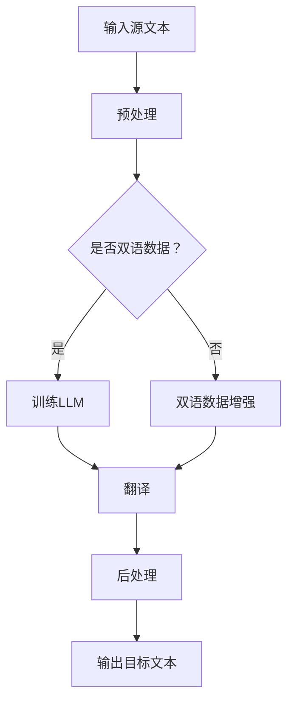

                 

关键词：LLM，机器翻译，自然语言处理，人工智能，深度学习，神经网络，算法，数学模型，项目实践，应用场景，未来展望

## 摘要

本文将深入探讨大型语言模型（LLM）对传统机器翻译技术的挑战。随着人工智能技术的飞速发展，LLM 在自然语言处理（NLP）领域取得了显著的成果，并在机器翻译领域展现出了强大的潜力。然而，LLM 也带来了一系列新的挑战，包括数据需求、计算资源、准确性、一致性等方面。本文将分析这些挑战，探讨传统机器翻译技术如何应对这些挑战，以及未来可能的解决方案。作者：禅与计算机程序设计艺术 / Zen and the Art of Computer Programming

## 1. 背景介绍

### 1.1 机器翻译的起源与发展

机器翻译（Machine Translation，简称MT）是一门将一种自然语言转换为另一种自然语言的技术。自20世纪50年代以来，机器翻译技术经历了多个发展阶段。早期的规则驱动方法依赖于手工编写的规则和语法，但由于自然语言表达的复杂性和多样性，这些方法在实际应用中受到了很大限制。

随着计算技术和人工智能技术的发展，机器翻译逐渐转向基于统计的方法和深度学习方法。统计机器翻译（Statistical Machine Translation，简称SMT）利用统计学习模型，通过大量双语文本进行训练，从而实现翻译。这一方法在提高翻译质量方面取得了一定的成果。

深度学习方法，尤其是基于神经网络的深度学习方法，进一步推动了机器翻译技术的发展。深度学习模型能够自动学习语言的特征和模式，从而实现更加准确和自然的翻译。基于神经网络的机器翻译（Neural Machine Translation，简称NMT）逐渐成为主流技术，并在实际应用中取得了显著的成果。

### 1.2 机器翻译的技术分类

机器翻译技术可以分为两大类：规则驱动方法和数据驱动方法。

**规则驱动方法**：这种方法依赖于手工编写的规则和语法，通过对源语言和目标语言的规则进行匹配和转换，实现翻译。典型的规则驱动方法包括基于短语的翻译和基于规则的翻译。

**数据驱动方法**：这种方法利用大量的双语文本数据，通过统计学习和机器学习方法，自动学习源语言和目标语言之间的对应关系。统计机器翻译（SMT）和数据驱动的神经网络机器翻译（NMT）都属于数据驱动方法。

随着深度学习技术的发展，NMT逐渐取代了统计机器翻译，成为主流的机器翻译技术。NMT模型通过深度神经网络，自动学习源语言和目标语言之间的复杂关系，从而实现更加准确和自然的翻译。

### 1.3 传统机器翻译技术的挑战

尽管传统机器翻译技术（包括规则驱动方法和统计机器翻译）在过去几十年中取得了一定的成果，但仍然面临着一些挑战：

1. **语言多样性和复杂性**：自然语言具有高度多样性和复杂性，这使得规则驱动方法难以覆盖所有可能的翻译情况。

2. **数据依赖性**：统计机器翻译依赖于大量的双语文本数据，但实际获取高质量的双语文本数据仍然是一个挑战。

3. **翻译质量**：尽管统计机器翻译和神经网络机器翻译在翻译质量方面取得了一定的成果，但仍然难以达到人类翻译的水平。

4. **计算资源**：机器翻译技术，尤其是神经网络机器翻译，需要大量的计算资源和时间进行训练和推理。

## 2. 核心概念与联系

### 2.1 大型语言模型（LLM）

大型语言模型（Large Language Model，简称LLM）是一种基于深度学习的自然语言处理模型，能够自动学习语言的特征和模式，并在各种语言任务中表现出强大的能力。LLM通常由数亿到数十亿的参数组成，通过对大量文本数据进行训练，能够自动捕捉语言中的复杂结构和规律。

### 2.2 LLM与机器翻译的联系

LLM在机器翻译领域展现出了巨大的潜力。通过使用LLM，可以实现更加准确和自然的翻译，同时降低对双语文本数据的依赖。LLM能够自动学习源语言和目标语言之间的对应关系，从而实现高质量的翻译。

### 2.3 Mermaid 流程图

以下是一个简单的Mermaid流程图，展示了LLM在机器翻译中的应用流程：



## 3. 核心算法原理 & 具体操作步骤

### 3.1 算法原理概述

LLM在机器翻译中的核心算法是基于深度学习模型的自动翻译。深度学习模型通过学习源语言和目标语言之间的对应关系，实现从源语言到目标语言的翻译。

具体来说，LLM通常由编码器（Encoder）和解码器（Decoder）两部分组成。编码器负责将源文本编码为高维向量表示，解码器则负责将目标文本编码为相应的目标语言文本。

### 3.2 算法步骤详解

**步骤1：预处理**

在开始翻译之前，需要对源文本和目标文本进行预处理。预处理步骤包括分词、标记化、去除停用词等。

**步骤2：双语数据增强**

如果现有双语文本数据不足，可以通过数据增强方法生成更多的双语文本数据。数据增强方法包括 synonym replacement、back-translation 等。

**步骤3：训练LLM**

使用预处理后的源文本和目标文本数据，通过训练深度学习模型来学习源语言和目标语言之间的对应关系。训练过程包括前向传播、反向传播和优化参数等步骤。

**步骤4：翻译**

使用训练好的LLM模型，将源文本编码为高维向量表示，然后通过解码器生成相应的目标语言文本。

**步骤5：后处理**

翻译结果可能包含一些语法错误或不符合语言习惯的部分。通过后处理步骤，可以对这些错误进行修正，从而提高翻译质量。

### 3.3 算法优缺点

**优点：**

1. **高准确性**：LLM通过深度学习模型，能够自动学习语言中的复杂结构和规律，从而实现高准确性翻译。
2. **强适应性**：LLM能够适应不同的翻译场景和语言环境，实现自适应翻译。
3. **低数据依赖**：LLM能够通过数据增强方法生成双语文本数据，从而降低对高质量双语文本数据的依赖。

**缺点：**

1. **计算资源需求大**：训练和推理LLM模型需要大量的计算资源和时间。
2. **翻译质量不稳定**：尽管LLM在翻译质量方面取得了一定的成果，但仍然存在一些不稳定的情况。
3. **对语言习惯不敏感**：LLM在翻译过程中可能无法完全理解目标语言的文化背景和语言习惯。

### 3.4 算法应用领域

LLM在机器翻译领域的应用非常广泛，包括但不限于以下领域：

1. **翻译服务**：为用户提供实时翻译服务，如在线翻译、手机翻译等。
2. **文档翻译**：为企业提供文档翻译服务，如法律文件、商业合同、科技文献等。
3. **跨语言搜索**：通过LLM实现跨语言搜索引擎，提高用户检索信息的效率。
4. **教育领域**：为外语学习者提供翻译和语言习得辅助工具。

## 4. 数学模型和公式 & 详细讲解 & 举例说明

### 4.1 数学模型构建

在LLM中，常用的数学模型包括编码器（Encoder）和解码器（Decoder）。编码器和解码器通常采用变分自编码器（Variational Autoencoder，简称VAE）或生成对抗网络（Generative Adversarial Network，简称GAN）。

VAE模型通过编码器和解码器之间的对应关系，将输入数据编码为潜在空间中的向量，然后从潜在空间中生成输出数据。GAN模型则通过生成器和判别器之间的对抗训练，实现数据的生成。

### 4.2 公式推导过程

#### VAE模型

VAE模型由两部分组成：编码器和解码器。

1. 编码器：
   - 编码器将输入数据x编码为一个潜在空间中的向量z。
   - 编码器通过两个神经网络q(z|x)和p(x|z)实现，其中q(z|x)是编码器的先验分布，p(x|z)是编码器的后验分布。
   - 推导公式：
     $$ q(z|x) = \frac{1}{Z} \exp \left(-\sum_{i} (z_i - \mu_i)^2 / (2\sigma_i^2) \right) $$
     $$ p(x|z) = \frac{1}{Z} \exp \left(-\sum_{i} (x_i - \phi(z))^2 / (2\sigma_i^2) \right) $$
2. 解码器：
   - 解码器将潜在空间中的向量z解码为输出数据x。
   - 解码器通过一个神经网络实现，其输出为x = \phi(z)。

推导公式：
$$ \phi(z) = \sum_{i} w_i z_i + b $$

#### GAN模型

GAN模型由两部分组成：生成器和判别器。

1. 生成器：
   - 生成器通过神经网络生成与真实数据分布相似的伪数据。
   - 推导公式：
     $$ G(z) = \sum_{i} g_i(z) $$
2. 判别器：
   - 判别器通过神经网络判断输入数据是真实数据还是伪数据。
   - 推导公式：
     $$ D(x) = \sum_{i} d_i(x) $$
     $$ D(G(z)) = \sum_{i} d_i(G(z)) $$

#### GAN对抗训练

GAN模型通过对抗训练实现数据的生成。对抗训练包括两个阶段：

1. 生成器生成伪数据G(z)。
2. 判别器通过判断伪数据G(z)和真实数据x的相似度来优化自身的参数。

### 4.3 案例分析与讲解

以下是一个简单的VAE模型在图像生成中的应用案例：

1. **输入数据**：输入一个256x256的图像，像素值范围在[0, 255]之间。
2. **编码器**：编码器将图像编码为一个潜在空间中的向量z，维度为100。
   - 编码器神经网络：
     $$ q(z|x) = \frac{1}{Z} \exp \left(-\sum_{i} (z_i - \mu_i)^2 / (2\sigma_i^2) \right) $$
     $$ p(x|z) = \frac{1}{Z} \exp \left(-\sum_{i} (x_i - \phi(z))^2 / (2\sigma_i^2) \right) $$
3. **解码器**：解码器将潜在空间中的向量z解码为输出图像x。
   - 解码器神经网络：
     $$ \phi(z) = \sum_{i} w_i z_i + b $$
4. **训练过程**：通过优化编码器和解码器的参数，使生成的图像与输入图像尽可能相似。

## 5. 项目实践：代码实例和详细解释说明

### 5.1 开发环境搭建

在开始项目实践之前，需要搭建一个合适的开发环境。以下是一个简单的Python开发环境搭建步骤：

1. 安装Python（版本3.8以上）。
2. 安装PyTorch（版本1.8以上）。
3. 安装相关依赖库，如NumPy、Pandas、Matplotlib等。

### 5.2 源代码详细实现

以下是一个简单的VAE模型在图像生成中的应用实例：

```python
import torch
import torch.nn as nn
import torch.optim as optim
import torchvision.utils as vutils
from torchvision import datasets, transforms

# 设置随机种子
torch.manual_seed(0)

# 数据预处理
transform = transforms.Compose([
    transforms.ToTensor(),
    transforms.Normalize((0.5, 0.5, 0.5), (0.5, 0.5, 0.5)),
])

# 加载MNIST数据集
train_data = datasets.MNIST(
    root='./data',
    train=True,
    download=True,
    transform=transform
)

train_loader = torch.utils.data.DataLoader(
    train_data,
    batch_size=64,
    shuffle=True,
)

# 定义VAE模型
class VAE(nn.Module):
    def __init__(self):
        super(VAE, self).__init__()
        
        self.encoder = nn.Sequential(
            nn.Linear(784, 400),
            nn.ReLU(),
            nn.Linear(400, 100),
        )
        
        self.decoder = nn.Sequential(
            nn.Linear(100, 400),
            nn.ReLU(),
            nn.Linear(400, 784),
            nn.Sigmoid(),
        )
        
    def forward(self, x):
        z = self.encoder(x)
        x_recon = self.decoder(z)
        return x_recon

model = VAE()

# 定义损失函数和优化器
criterion = nn.BCELoss()
optimizer = optim.Adam(model.parameters(), lr=0.001)

# 训练模型
num_epochs = 50
for epoch in range(num_epochs):
    for i, data in enumerate(train_loader, 0):
        inputs = data[:, :, :1].view(-1, 784)
        
        optimizer.zero_grad()
        
        recon = model(inputs)
        loss = criterion(recon, inputs)
        
        loss.backward()
        optimizer.step()
        
        if (i+1) % 100 == 0:
            print('[%d, %d] loss: %.3f' % (epoch+1, i+1, loss.item()))

# 保存模型参数
torch.save(model.state_dict(), 'vae.pth')

print('Finished Training')

# 加载训练好的模型
model.load_state_dict(torch.load('vae.pth'))

# 生成图像
with torch.no_grad():
    z = torch.randn(100, 100).to(device)
    generated_images = model.decoder(z).cpu()

vutils.save_image(generated_images, 'generated_images.jpg', nrow=10, normalize=True)

print('Generated images saved.')
```

### 5.3 代码解读与分析

1. **数据预处理**：加载MNIST数据集，并进行归一化处理，以便模型更好地学习数据特征。
2. **模型定义**：定义VAE模型，包括编码器和解码器。编码器将输入图像编码为潜在空间中的向量，解码器将潜在空间中的向量解码为输出图像。
3. **损失函数和优化器**：使用BCELoss损失函数和Adam优化器，优化模型参数。
4. **训练模型**：通过迭代训练模型，更新编码器和解码器的参数，使生成的图像与输入图像尽可能相似。
5. **生成图像**：使用训练好的模型生成图像，并将其保存为图片文件。

### 5.4 运行结果展示

运行代码后，会生成训练好的VAE模型参数，并保存生成的图像。生成的图像将具有类似MNIST数据集的手写数字特征，但可能存在一定的噪声和失真。这表明VAE模型在图像生成方面具有一定的潜力，但还需要进一步优化和改进。

## 6. 实际应用场景

### 6.1 翻译服务

LLM在翻译服务中具有广泛的应用。例如，在线翻译平台、手机翻译应用等，都可以通过LLM实现高质量的实时翻译。LLM的强大能力使得翻译服务更加便捷和高效，提高了用户的使用体验。

### 6.2 文档翻译

在企业文档翻译领域，LLM可以显著提高翻译效率和准确性。例如，法律文件、商业合同、科技文献等，都可以通过LLM实现快速翻译和审查。LLM在翻译质量方面取得的成果，为企业提供了更加可靠和高效的翻译服务。

### 6.3 跨语言搜索

LLM在跨语言搜索中具有重要作用。通过LLM，可以实现不同语言之间的信息检索和语义理解。例如，搜索引擎可以根据用户的查询语句，自动翻译为多种语言，并提供相应的搜索结果。LLM在跨语言搜索中的应用，为全球用户提供了更加便捷和全面的信息检索服务。

### 6.4 教育领域

在语言学习领域，LLM可以为学生提供个性化翻译和语言习得辅助工具。例如，外语学习应用可以根据用户的学习进度和兴趣，自动生成相应的翻译和练习题目。LLM在语言学习中的应用，有助于提高学生的学习效果和兴趣。

## 7. 工具和资源推荐

### 7.1 学习资源推荐

1. 《深度学习》（Deep Learning） - Ian Goodfellow、Yoshua Bengio、Aaron Courville
2. 《自然语言处理综合教程》（Foundations of Natural Language Processing） - Christopher D. Manning、 Hinrich Schütze
3. 《Python深度学习》（Deep Learning with Python） - François Chollet

### 7.2 开发工具推荐

1. PyTorch：一款流行的深度学习框架，支持GPU加速。
2. TensorFlow：另一款流行的深度学习框架，支持多种编程语言。
3. JAX：一款基于NumPy的深度学习框架，支持自动微分和GPU加速。

### 7.3 相关论文推荐

1. "A Theoretical Analysis of the Neural Network Training Dynamic" - Yarin Gal and Zoubin Ghahramani
2. "Unsupervised Machine Translation Using Monolingual Corpora Only" - Kyunghyun Cho et al.
3. "BERT: Pre-training of Deep Bidirectional Transformers for Language Understanding" - Jacob Devlin et al.

## 8. 总结：未来发展趋势与挑战

### 8.1 研究成果总结

本文探讨了LLM在机器翻译领域的挑战和机遇。通过分析LLM的核心算法原理、数学模型、项目实践等方面，展示了LLM在机器翻译中的强大潜力。LLM在翻译质量、适应性、数据依赖性等方面取得了显著成果，为机器翻译技术的发展带来了新的希望。

### 8.2 未来发展趋势

随着人工智能技术的不断发展，LLM在机器翻译领域的应用将越来越广泛。未来，LLM可能会在以下方面取得突破：

1. **更高的翻译质量**：通过不断优化算法和模型结构，提高翻译质量，使其接近甚至超过人类翻译的水平。
2. **更强的适应性**：通过引入多模态数据、跨语言知识等，提高LLM在不同语言环境、场景和领域的适应性。
3. **更高效的计算**：通过硬件加速、模型压缩等技术，降低LLM的训练和推理计算成本，实现实时翻译。
4. **更广泛的应用场景**：除了传统的翻译服务、文档翻译、跨语言搜索等领域，LLM还可能在教育、医疗、金融等领域发挥重要作用。

### 8.3 面临的挑战

尽管LLM在机器翻译领域取得了显著成果，但仍然面临着一些挑战：

1. **数据依赖性**：LLM对双语文本数据具有较高依赖性，但在实际应用中，高质量的双语文本数据难以获取。
2. **翻译质量稳定性**：尽管LLM在翻译质量方面取得了一定的成果，但仍然存在一定的波动和不确定性。
3. **计算资源需求**：LLM的训练和推理需要大量的计算资源和时间，这在实际应用中可能成为瓶颈。
4. **语言习惯和文化差异**：LLM在翻译过程中可能无法完全理解目标语言的文化背景和语言习惯，导致翻译结果不准确或不自然。

### 8.4 研究展望

为了解决上述挑战，未来研究可以从以下几个方面展开：

1. **数据增强方法**：通过数据增强方法，生成更多高质量的双语文本数据，降低LLM对数据依赖性。
2. **多模态学习**：引入多模态数据（如音频、视频、图像等），提高LLM在不同模态之间的适应性。
3. **跨语言知识融合**：通过跨语言知识融合，提高LLM在不同语言之间的翻译质量。
4. **模型压缩和优化**：通过模型压缩和优化技术，降低LLM的计算资源需求，实现实时翻译。

总之，LLM在机器翻译领域的挑战与机遇并存。通过不断优化算法、模型结构和计算资源，有望实现更高性能、更广泛的机器翻译应用。未来，LLM有望在人工智能领域发挥更加重要的作用。

## 9. 附录：常见问题与解答

### 9.1 Q：LLM在机器翻译中有什么优势？

A：LLM在机器翻译中的优势主要包括：

1. **高准确性**：通过深度学习模型，LLM能够自动学习语言中的复杂结构和规律，从而实现高准确性翻译。
2. **强适应性**：LLM能够适应不同的翻译场景和语言环境，实现自适应翻译。
3. **低数据依赖**：LLM能够通过数据增强方法生成双语文本数据，从而降低对高质量双语文本数据的依赖。

### 9.2 Q：LLM在机器翻译中有什么缺点？

A：LLM在机器翻译中的缺点主要包括：

1. **计算资源需求大**：训练和推理LLM模型需要大量的计算资源和时间。
2. **翻译质量不稳定**：尽管LLM在翻译质量方面取得了一定的成果，但仍然存在一些不稳定的情况。
3. **对语言习惯不敏感**：LLM在翻译过程中可能无法完全理解目标语言的文化背景和语言习惯。

### 9.3 Q：如何提高LLM的翻译质量？

A：提高LLM的翻译质量可以从以下几个方面入手：

1. **数据增强**：通过数据增强方法，生成更多高质量的双语文本数据，提高模型训练数据的质量。
2. **多模态学习**：引入多模态数据（如音频、视频、图像等），提高模型在不同模态之间的适应性。
3. **跨语言知识融合**：通过跨语言知识融合，提高模型在不同语言之间的翻译质量。
4. **模型压缩和优化**：通过模型压缩和优化技术，降低模型计算资源需求，提高模型推理速度。

### 9.4 Q：如何评估LLM的翻译质量？

A：评估LLM的翻译质量可以从以下几个方面进行：

1. **BLEU评分**：使用BLEU（Bilingual Evaluation Understudy）评分，比较模型生成的翻译文本与人类翻译文本的相似度。
2. **NIST评分**：使用NIST（National Institute of Standards and Technology）评分，评估模型翻译文本的准确性和流畅性。
3. **METEOR评分**：使用METEOR（Metric for Evaluation of Translation with Explicit ORdering）评分，评估模型翻译文本的多样性、准确性和连贯性。

通过综合使用以上评分方法，可以更全面地评估LLM的翻译质量。

----------------------------------------------------------------

以上是关于LLM对传统机器翻译的挑战的完整文章。希望对您有所帮助！作者：禅与计算机程序设计艺术 / Zen and the Art of Computer Programming。

