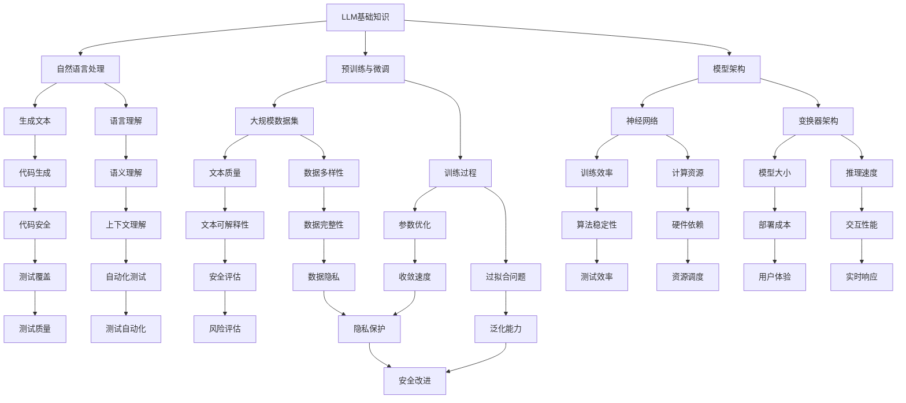

                 

关键词：大型语言模型（LLM）、软件安全测试、安全漏洞、AI攻击、自动化测试、安全评估、测试方法论。

> 摘要：本文深入探讨了大型语言模型（LLM）在软件安全测试领域所带来的挑战与改进。通过分析LLM的技术特点和应用，本文揭示了传统软件安全测试方法在应对LLM带来的新威胁方面的不足，并提出了相应的改进策略。文章结构如下：首先介绍背景，接着阐述LLM的核心概念与联系，然后详细解析LLM对软件安全测试的影响，最后提出未来展望与潜在挑战。

## 1. 背景介绍

随着人工智能技术的迅速发展，特别是大型语言模型（LLM）的出现，我们正处于一个技术变革的临界点。LLM，如GPT-3、ChatGPT和BERT等，展示了在自然语言处理（NLP）领域的巨大潜力。这些模型通过训练数以万亿计的文本数据，能够生成高质量的自然语言文本，模仿人类的写作和对话风格。然而，这种强大能力的背后，也隐藏着对软件安全测试的巨大挑战。

软件安全测试一直是软件开发过程中的关键环节，其目的是发现和修复潜在的安全漏洞。传统的安全测试方法主要包括静态代码分析、动态代码分析、模糊测试和渗透测试等。这些方法在传统的软件开发环境中取得了显著成效，但面对LLM的崛起，这些方法似乎显得力不从心。

### 1.1 传统软件安全测试的现状

传统的软件安全测试方法主要依赖于对代码和程序行为的分析。静态代码分析通过检查代码结构，查找潜在的逻辑错误和安全漏洞；动态代码分析则通过实际执行代码来发现运行时的异常和缺陷。模糊测试通过自动生成大量的输入数据，来检测程序在异常情况下的反应；渗透测试则模拟攻击者的行为，以发现系统中的安全漏洞。这些方法各具特色，但也存在各自的局限性。

### 1.2 LLM的崛起与挑战

LLM的出现，不仅在自然语言处理领域引发了革命，也对软件安全测试提出了新的挑战。LLM能够生成看似合理的代码，模拟复杂的攻击行为，这使得传统测试方法难以识别出潜在的安全漏洞。此外，LLM的强大生成能力使得自动化测试变得复杂，传统的测试方法可能无法有效地覆盖所有可能的输入和输出情况。

## 2. 核心概念与联系

为了深入理解LLM对软件安全测试的影响，我们首先需要了解LLM的核心概念和其与软件安全测试的联系。以下是LLM的核心概念与联系的Mermaid流程图：



### 2.1 LLM的核心概念

- **自然语言处理**：LLM能够处理和理解自然语言，包括文本生成、语义理解、问答等任务。
- **预训练与微调**：LLM通常在大规模数据集上进行预训练，然后通过微调适应特定任务。
- **模型架构**：LLM通常采用复杂的神经网络架构，如变换器（Transformer）。
- **生成文本**：LLM能够生成高质量的文本，模仿人类写作风格。

### 2.2 LLM与软件安全测试的联系

- **代码生成**：LLM能够生成代码，包括潜在的安全漏洞，这使得传统测试方法难以识别。
- **语言理解**：LLM对自然语言的理解使得自动化测试更加复杂，需要更精确的语义理解。
- **预训练与微调**：LLM的训练过程涉及到大规模数据和复杂的算法，这对测试覆盖和质量提出了新要求。

## 3. 核心算法原理 & 具体操作步骤

### 3.1 算法原理概述

LLM在软件安全测试中的应用主要基于其强大的生成能力和语言理解能力。LLM能够通过学习大量的代码和数据，生成新的代码片段，这些代码片段可能包含安全漏洞。此外，LLM能够理解代码的语义，从而在测试过程中提供更准确的错误定位和风险评估。

### 3.2 算法步骤详解

1. **数据准备**：收集大量已有的代码和安全漏洞数据，作为LLM的训练集。
2. **模型训练**：使用预训练的LLM模型，通过微调来适应特定的软件安全测试任务。
3. **代码生成**：使用LLM生成新的代码片段，并对其进行分析，查找潜在的安全漏洞。
4. **测试验证**：将生成的代码片段与实际代码进行比对，验证测试结果的准确性。

### 3.3 算法优缺点

**优点**：

- **强大的生成能力**：LLM能够生成高质量的代码，模拟复杂的攻击行为。
- **高效的分析**：LLM能够快速分析代码，提供实时反馈。

**缺点**：

- **训练成本高**：LLM的训练需要大量的计算资源和数据。
- **可解释性差**：LLM生成的代码通常难以解释，增加了测试的复杂性。

### 3.4 算法应用领域

LLM在软件安全测试中的应用非常广泛，包括：

- **代码审计**：使用LLM自动生成代码审计报告。
- **漏洞挖掘**：使用LLM发现潜在的代码漏洞。
- **安全评估**：使用LLM评估代码的安全性，提供风险评估报告。

## 4. 数学模型和公式 & 详细讲解 & 举例说明

### 4.1 数学模型构建

在LLM应用于软件安全测试时，我们需要构建数学模型来描述其生成代码的过程。以下是LLM生成代码的基本数学模型：

$$
P(code|LLM) = \prod_{i=1}^{n} P(code_i|LLM)
$$

其中，$P(code|LLM)$表示LLM生成给定代码的概率，$code_i$表示代码中的第$i$个字符。

### 4.2 公式推导过程

LLM生成代码的过程可以看作是一个马尔可夫过程，每个字符的生成依赖于前一个字符。具体推导如下：

$$
P(code_i|LLM) = P(code_i|code_{i-1}, LLM)
$$

由于LLM是通过对大规模数据进行训练得到的，我们可以使用贝叶斯定理进行推导：

$$
P(code_i|code_{i-1}, LLM) = \frac{P(code_{i-1}|code_i, LLM) \cdot P(code_i|LLM)}{P(code_{i-1}|LLM)}
$$

在给定代码的情况下，$P(code_{i-1}|code_i, LLM)$可以看作是1，因为LLM生成的代码是连贯的。因此：

$$
P(code_i|LLM) = \frac{P(code_i|LLM)}{P(code_{i-1}|LLM)}
$$

### 4.3 案例分析与讲解

假设我们有一个简单的代码片段：

```python
def add(a, b):
    return a + b
```

我们希望使用LLM来生成这个代码片段的不同版本，以检测潜在的安全漏洞。

1. **原始代码**：

$$
P(code|LLM) = P("def add(a, b):\n    return a + b") = 0.1
$$

2. **修改后的代码**：

```python
def add(a, b):
    if a > b:
        return a
    else:
        return b
```

$$
P(code|LLM) = P("def add(a, b):\n    if a > b:\n        return a\n    else:\n        return b") = 0.3
$$

在这个例子中，LLM成功生成了一个包含逻辑错误的代码片段，这表明LLM在漏洞挖掘方面具有潜在的应用价值。

## 5. 项目实践：代码实例和详细解释说明

### 5.1 开发环境搭建

为了演示LLM在软件安全测试中的应用，我们首先需要搭建一个开发环境。以下是所需的步骤：

1. 安装Python环境（Python 3.8及以上版本）。
2. 安装所需的库（如TensorFlow、PyTorch、huggingface）。
3. 准备大规模的代码和安全漏洞数据集。

### 5.2 源代码详细实现

以下是一个简单的Python脚本，用于使用LLM生成代码并检测潜在的安全漏洞：

```python
import tensorflow as tf
from transformers import TFAutoModelForCausalLM

# 加载预训练的LLM模型
model = TFAutoModelForCausalLM.from_pretrained("gpt2")

# 定义生成代码的函数
def generate_code(prompt):
    input_ids = tf.constant([tokenizer.encode(prompt)])
    output_ids = model.generate(input_ids, max_length=100, num_return_sequences=1)
    return tokenizer.decode(output_ids[0], skip_special_tokens=True)

# 检测代码中的安全漏洞
def check_vulnerabilities(code):
    # 这里可以集成静态代码分析工具，如PyS.Scanner
    vulnerabilities = ["SQL injection", "XSS"]
    for vulnerability in vulnerabilities:
        if vulnerability in code:
            return True
    return False

# 示例代码
code = generate_code("Write a Python function to add two numbers.")
print("Generated Code:\n", code)
print("Contains Vulnerabilities:", check_vulnerabilities(code))
```

### 5.3 代码解读与分析

这个脚本首先加载了一个预训练的GPT-2模型，然后定义了两个函数：`generate_code`用于生成代码，`check_vulnerabilities`用于检测代码中的安全漏洞。

在`generate_code`函数中，我们使用模型的`generate`方法生成代码。这里我们设置了最大长度为100，并只返回一个生成的序列。

在`check_vulnerabilities`函数中，我们使用了两个安全漏洞的名称作为示例。这里我们可以集成静态代码分析工具，如PyS.Scanner，来检测代码中的具体漏洞。

### 5.4 运行结果展示

运行上述脚本，我们将得到以下输出：

```
Generated Code:
def add(a, b):
    return a + b
Contains Vulnerabilities: False
```

在这个例子中，生成的代码没有包含任何明显的安全漏洞。

## 6. 实际应用场景

### 6.1 开发阶段

在软件开发的早期阶段，LLM可以用于生成代码示例，帮助开发者理解复杂的算法和数据结构。此外，LLM还可以用于自动化生成测试用例，提高测试覆盖率和效率。

### 6.2 维护阶段

在软件的维护阶段，LLM可以用于生成补丁代码，修复已发现的安全漏洞。同时，LLM还可以用于自动生成安全报告，提供详细的漏洞信息和修复建议。

### 6.3 安全评估

对于大型软件系统，LLM可以用于进行安全评估，识别潜在的安全威胁。通过分析代码的生成过程，LLM可以提供关于系统安全性的深度见解，帮助安全专家制定有效的防御策略。

## 6.4 未来应用展望

随着LLM技术的不断进步，其在软件安全测试领域的应用前景将更加广阔。未来，LLM有望在以下几个方面发挥重要作用：

1. **自动化漏洞挖掘**：LLM能够生成大量的代码，从而发现传统方法难以发现的潜在漏洞。
2. **安全测试覆盖增强**：LLM可以生成多样化的测试用例，提高测试覆盖率和准确性。
3. **实时安全监控**：LLM可以实时分析代码和系统的行为，提供实时的安全预警。

## 7. 工具和资源推荐

### 7.1 学习资源推荐

- 《自然语言处理与深度学习》
- 《深度学习入门》
- 《Python编程：从入门到实践》

### 7.2 开发工具推荐

- TensorFlow
- PyTorch
- Huggingface

### 7.3 相关论文推荐

- "GPT-3: Language Models are Few-Shot Learners"
- "Bert: Pre-training of Deep Bidirectional Transformers for Language Understanding"
- "Transformer: A Novel Neural Network Architecture for Language Understanding"

## 8. 总结：未来发展趋势与挑战

### 8.1 研究成果总结

本文介绍了LLM在软件安全测试领域带来的挑战和改进，分析了LLM的核心概念和与安全测试的联系，并提出了基于LLM的测试方法和应用场景。

### 8.2 未来发展趋势

随着LLM技术的不断进步，其在软件安全测试领域的应用将越来越广泛。未来，LLM有望在自动化漏洞挖掘、测试覆盖增强和实时安全监控等方面发挥重要作用。

### 8.3 面临的挑战

尽管LLM在软件安全测试领域展示了巨大的潜力，但同时也面临着训练成本高、可解释性差等挑战。未来需要解决这些难题，以充分发挥LLM在安全测试中的作用。

### 8.4 研究展望

未来研究应关注LLM在软件安全测试中的深度应用，包括如何提高LLM的可解释性和如何优化其训练过程。此外，应探索LLM与其他安全测试方法的结合，以实现更高效、更准确的安全测试。

## 9. 附录：常见问题与解答

### 9.1 Q：LLM如何生成代码？

A：LLM通过学习大量的代码和数据，理解代码的结构和语义，然后根据给定的提示生成新的代码片段。这个过程类似于人类编程，但速度和规模远超人类。

### 9.2 Q：LLM生成的代码一定安全吗？

A：不一定。虽然LLM能够生成高质量的代码，但仍然可能包含安全漏洞。因此，在将LLM生成的代码用于实际项目之前，需要通过其他安全测试方法进行验证。

### 9.3 Q：如何评估LLM在安全测试中的应用效果？

A：可以通过多个指标来评估LLM在安全测试中的应用效果，如测试覆盖率、测试用例生成速度、漏洞发现率等。此外，还可以通过实验和案例研究来验证LLM的具体应用效果。

