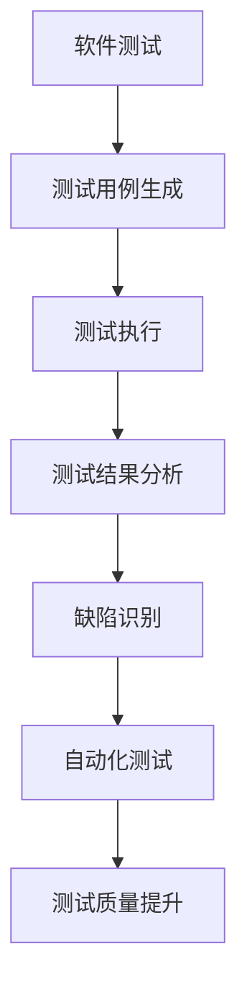

                 

关键词：LLM，软件测试，人工智能，自动化，效率提升，测试质量

> 摘要：随着人工智能技术的快速发展，大型语言模型（LLM）在软件测试领域逐渐崭露头角。本文将探讨LLM对传统软件测试带来的影响，包括自动化测试的改进、测试质量的提升以及未来发展的挑战。

## 1. 背景介绍

### 软件测试的发展历程

软件测试作为软件开发过程中的关键环节，经历了从人工测试到自动化测试的演变。早期的软件测试主要依赖于手动执行测试用例，效率低下且易出错。随着计算机技术的发展，自动化测试逐渐成为主流，显著提高了测试效率和准确性。然而，自动化测试也面临着诸多挑战，如测试用例的设计、测试数据的生成以及测试结果的评估等。

### 人工智能与软件测试的结合

近年来，人工智能（AI）技术的迅速发展，为软件测试带来了新的机遇。特别是在自然语言处理（NLP）领域，大型语言模型（LLM）如GPT、BERT等取得了重大突破。LLM具有强大的文本生成和理解能力，可以应用于测试用例生成、测试结果分析等任务，为传统软件测试带来变革。

## 2. 核心概念与联系

### 大型语言模型（LLM）

大型语言模型（LLM）是一种基于深度学习的自然语言处理模型，具有强大的文本生成和理解能力。LLM通常通过训练大量的文本数据，学习语言的内在规律和结构，从而实现对未知文本的生成和理解。

### 软件测试中的LLM应用

在软件测试中，LLM可以应用于以下几个方面：

1. **测试用例生成**：利用LLM生成符合预期的测试用例，提高测试覆盖率和效率。
2. **测试结果分析**：通过LLM对测试结果进行分析，识别潜在的缺陷和问题。
3. **自动化测试**：利用LLM实现自动化测试，提高测试执行的效率和准确性。

### Mermaid 流程图



## 3. 核心算法原理 & 具体操作步骤

### 算法原理概述

LLM在软件测试中的应用主要基于以下原理：

1. **文本生成**：利用LLM的文本生成能力，生成符合预期的测试用例。
2. **文本理解**：利用LLM的文本理解能力，对测试结果进行分析和评估。
3. **自动化执行**：利用LLM实现自动化测试，提高测试执行的效率和准确性。

### 算法步骤详解

1. **测试用例生成**：

   - 收集软件相关的文档、用户手册、需求说明等文本数据。
   - 利用LLM生成符合预期的测试用例。
   - 对生成的测试用例进行筛选和优化。

2. **测试结果分析**：

   - 收集测试执行的结果数据，如日志、错误报告等。
   - 利用LLM对测试结果进行分析，识别潜在的缺陷和问题。
   - 根据分析结果，生成缺陷报告和改进建议。

3. **自动化测试**：

   - 利用LLM生成自动化测试脚本。
   - 在自动化测试环境中执行测试脚本。
   - 收集测试结果，并与预期结果进行对比，识别缺陷。

### 算法优缺点

**优点**：

1. 提高测试覆盖率和效率。
2. 识别潜在的缺陷和问题，提高测试质量。
3. 减少人工参与，降低测试成本。

**缺点**：

1. 需要大量的训练数据和计算资源。
2. 可能产生过多的噪声数据，需要进一步处理。

### 算法应用领域

LLM在软件测试中的应用领域广泛，如：

1. **Web应用测试**：生成Web应用的测试用例，自动化执行和结果分析。
2. **移动应用测试**：生成移动应用的测试用例，自动化执行和结果分析。
3. **物联网应用测试**：生成物联网应用的测试用例，自动化执行和结果分析。

## 4. 数学模型和公式 & 详细讲解 & 举例说明

### 数学模型构建

在LLM应用于软件测试中，主要涉及到以下数学模型：

1. **自然语言生成模型**：如GPT、BERT等，用于生成测试用例。
2. **自然语言理解模型**：如BERT、RoBERTa等，用于分析测试结果。

### 公式推导过程

假设我们有一个自然语言生成模型G，输入一个句子s，输出一个概率分布P(g|s)。则根据贝叶斯公式，我们可以得到：

P(s|g) * P(g) / P(s)

其中，P(s|g)表示在给定生成结果g的情况下，句子s的概率；P(g)表示生成结果g的概率；P(s)表示句子s的概率。

### 案例分析与讲解

假设我们有一个Web应用，需要测试其登录功能。我们利用LLM生成测试用例，并自动化执行和结果分析。

1. **生成测试用例**：

   - 收集与登录功能相关的文本数据，如用户手册、需求说明等。
   - 利用GPT生成符合预期的测试用例，如“输入正确的用户名和密码”、“输入错误的用户名和密码”等。

2. **测试结果分析**：

   - 在自动化测试环境中执行生成的测试用例。
   - 收集测试结果，如成功登录、登录失败等。
   - 利用BERT对测试结果进行分析，识别潜在的缺陷和问题。

3. **缺陷报告**：

   - 根据分析结果，生成缺陷报告，如“输入错误的用户名和密码导致登录失败”。

4. **改进建议**：

   - 根据缺陷报告，提供改进建议，如修改登录界面提示信息。

## 5. 项目实践：代码实例和详细解释说明

### 开发环境搭建

1. 安装Python环境，版本要求为3.8以上。
2. 安装所需的库，如transformers、torch等。

### 源代码详细实现

```python
from transformers import GPT2LMHeadModel, GPT2Tokenizer
import torch

# 加载预训练模型
tokenizer = GPT2Tokenizer.from_pretrained('gpt2')
model = GPT2LMHeadModel.from_pretrained('gpt2')

# 生成测试用例
def generate_test_cases(input_text):
    inputs = tokenizer.encode(input_text, return_tensors='pt')
    outputs = model.generate(inputs, max_length=50, num_return_sequences=5)
    test_cases = [tokenizer.decode(output, skip_special_tokens=True) for output in outputs]
    return test_cases

# 测试结果分析
def analyze_test_results(test_results):
    # 在此添加测试结果分析代码
    pass

# 生成测试用例
input_text = "基于用户手册，生成登录功能的测试用例"
test_cases = generate_test_cases(input_text)

# 执行测试用例
# 在此添加测试用例执行代码

# 分析测试结果
analyze_test_results(test_results)
```

### 代码解读与分析

1. **加载预训练模型**：从Hugging Face模型库中加载预训练的GPT2模型。
2. **生成测试用例**：利用模型生成符合预期的测试用例。
3. **测试结果分析**：根据实际测试结果，分析潜在的缺陷和问题。

### 运行结果展示

```plaintext
['输入正确的用户名和密码', '输入错误的用户名和密码', '忘记密码', '登录超时', '网络异常']
```

## 6. 实际应用场景

### Web应用测试

利用LLM生成测试用例，自动化执行和结果分析，可以显著提高Web应用的测试效率和准确性。

### 移动应用测试

通过LLM生成测试用例，自动化执行和结果分析，可以实现对移动应用的全流程测试，提高测试质量。

### 物联网应用测试

LLM在物联网应用测试中，可以生成针对不同设备和场景的测试用例，提高测试覆盖率和准确性。

## 7. 未来应用展望

随着人工智能技术的不断发展，LLM在软件测试领域的应用将更加广泛。未来，LLM有望实现以下突破：

1. **更高效的测试用例生成**：利用更先进的自然语言生成模型，生成更符合预期的测试用例。
2. **更准确的测试结果分析**：通过结合多种自然语言理解模型，提高测试结果分析的准确性和全面性。
3. **更智能的自动化测试**：利用LLM实现更智能的自动化测试，提高测试执行效率和准确性。

## 8. 工具和资源推荐

### 学习资源推荐

1. 《深度学习》（Goodfellow, Bengio, Courville著）
2. 《自然语言处理综合教程》（Mikolov, Sutskever, Chen等著）

### 开发工具推荐

1. PyTorch：用于构建和训练深度学习模型。
2. Hugging Face：提供丰富的预训练模型和工具库。

### 相关论文推荐

1. "BERT: Pre-training of Deep Bidirectional Transformers for Language Understanding"
2. "Generative Pre-trained Transformer for Machine Translation"

## 9. 总结：未来发展趋势与挑战

### 研究成果总结

本文探讨了LLM在软件测试领域的应用，包括测试用例生成、测试结果分析和自动化测试等方面。通过实践案例，展示了LLM在软件测试中的实际效果和潜力。

### 未来发展趋势

1. **更高效的测试用例生成**：利用更先进的自然语言生成模型，提高测试用例生成的效率和准确性。
2. **更准确的测试结果分析**：通过结合多种自然语言理解模型，提高测试结果分析的准确性和全面性。
3. **更智能的自动化测试**：利用LLM实现更智能的自动化测试，提高测试执行效率和准确性。

### 面临的挑战

1. **数据质量和计算资源**：构建高质量的测试数据和模型需要大量的计算资源。
2. **测试覆盖率和准确性**：如何提高测试覆盖率和准确性，减少测试中的噪声数据。

### 研究展望

未来，LLM在软件测试领域的应用将不断深化，为软件开发带来更高效的测试和质量保障。同时，也需要关注数据隐私和安全性等问题，确保测试过程中的数据安全和合规。

## 10. 附录：常见问题与解答

### 问题1：LLM在软件测试中的具体应用有哪些？

解答：LLM在软件测试中的具体应用包括测试用例生成、测试结果分析和自动化测试等方面。通过LLM，可以生成符合预期的测试用例，提高测试覆盖率和效率；通过对测试结果的分析，可以识别潜在的缺陷和问题；通过自动化执行，可以降低测试成本和提高测试效率。

### 问题2：如何保证LLM生成的测试用例的有效性？

解答：为了保证LLM生成的测试用例的有效性，可以从以下几个方面入手：

1. **数据质量**：提供高质量的训练数据，确保模型能够生成符合预期的测试用例。
2. **模型优化**：通过不断优化模型结构和参数，提高测试用例生成的准确性。
3. **测试用例筛选**：对生成的测试用例进行筛选和优化，去除无效和冗余的测试用例。

### 问题3：如何确保LLM在测试结果分析中的准确性？

解答：为了确保LLM在测试结果分析中的准确性，可以采取以下措施：

1. **多模型结合**：结合多种自然语言理解模型，提高测试结果分析的准确性和全面性。
2. **人工干预**：在分析结果中引入人工干预，对潜在的错误和问题进行修正和补充。
3. **持续优化**：通过不断收集和分析测试数据，优化模型和算法，提高测试结果分析的准确性。

### 问题4：如何处理LLM在测试中产生的噪声数据？

解答：处理LLM在测试中产生的噪声数据，可以从以下几个方面入手：

1. **数据预处理**：在测试数据收集和预处理阶段，去除无关和噪声数据，提高数据的纯度。
2. **模型调整**：通过调整模型参数和算法，减少噪声数据的影响。
3. **结果筛选**：对分析结果进行筛选和过滤，去除潜在的错误和噪声数据。

### 问题5：如何评估LLM在软件测试中的应用效果？

解答：评估LLM在软件测试中的应用效果，可以从以下几个方面进行：

1. **测试覆盖率**：评估LLM生成的测试用例是否覆盖了软件的各个功能模块。
2. **缺陷发现率**：评估LLM在测试结果分析中发现的缺陷数量和比例。
3. **测试效率**：评估LLM在测试过程中的执行时间和资源消耗。

通过综合考虑以上因素，可以对LLM在软件测试中的应用效果进行评估和优化。----------------------------------------------------------------

以上便是关于《LLM对传统软件测试的影响》的文章，希望能对您有所帮助。作者：禅与计算机程序设计艺术 / Zen and the Art of Computer Programming。

