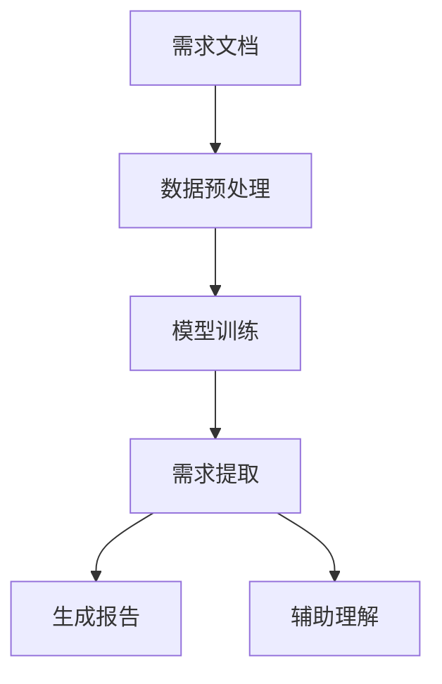

                 

关键词：LLM，软件需求分析，挑战，改进，算法原理，数学模型，实际应用，未来展望

> 摘要：随着大型语言模型（LLM）的迅猛发展，其在软件需求分析领域的应用逐渐显现。本文将从LLM的核心概念、挑战、改进措施等方面进行探讨，分析LLM在软件需求分析中的潜力与局限，为相关领域的研究和实践提供有益参考。

## 1. 背景介绍

软件需求分析是软件工程中至关重要的一环，它关系到软件项目的成功与否。传统的软件需求分析方法主要依赖于人工分析、文档阅读和会议讨论等手段，存在效率低、准确性不足等问题。随着人工智能技术的快速发展，尤其是大型语言模型（LLM）的出现，为软件需求分析带来了新的机遇和挑战。

LLM是一种基于深度学习的技术，通过大量语言数据的学习，能够理解和生成自然语言。在软件需求分析领域，LLM可以用于自动提取需求文档中的关键信息、生成需求分析报告、辅助开发人员理解用户需求等。然而，LLM在应用过程中也面临着一些挑战，如数据质量、模型解释性等。

本文旨在探讨LLM在软件需求分析中的挑战与改进措施，分析其潜力与局限，为相关领域的研究和实践提供有益参考。

## 2. 核心概念与联系

### 2.1 LLM的概念

大型语言模型（LLM）是一种基于深度学习的自然语言处理技术，通过训练海量语言数据，可以生成高质量的自然语言文本。LLM的核心思想是使用神经网络模型对输入文本进行建模，从而预测下一个单词或句子。LLM的训练过程通常包括数据预处理、模型选择、模型训练和模型评估等步骤。

### 2.2 软件需求分析的概念

软件需求分析是指对软件项目的需求进行收集、分析和定义的过程。需求分析是软件项目开发的基础，它关系到软件的质量、功能和可行性。传统的软件需求分析方法主要包括文档阅读、用户访谈、会议讨论等。

### 2.3 LLM与软件需求分析的联系

LLM在软件需求分析中的应用主要体现在以下几个方面：

1. 自动化需求提取：LLM可以自动从需求文档中提取关键信息，提高需求提取的效率和准确性。
2. 生成需求分析报告：LLM可以根据需求文档生成结构化的需求分析报告，帮助开发人员快速理解用户需求。
3. 辅助理解用户需求：LLM可以帮助开发人员更好地理解用户需求，提高沟通效果。

### 2.4 Mermaid流程图

以下是一个简单的Mermaid流程图，展示了LLM在软件需求分析中的主要应用步骤：



## 3. 核心算法原理 & 具体操作步骤

### 3.1 算法原理概述

LLM在软件需求分析中的核心算法主要基于深度学习技术，特别是基于注意力机制的Transformer模型。Transformer模型通过自注意力机制（Self-Attention）和多头注意力机制（Multi-Head Attention）对输入文本进行建模，能够捕捉文本中的长距离依赖关系。在软件需求分析中，LLM通过对需求文档进行编码，生成对应的隐藏表示，然后利用这些表示进行需求提取、报告生成和理解用户需求。

### 3.2 算法步骤详解

1. **数据预处理**：将需求文档进行分词、去停用词、词干提取等处理，将原始文本转换为词向量表示。
2. **模型训练**：使用预训练的Transformer模型，对词向量进行编码，训练模型以预测下一个单词或句子。
3. **需求提取**：利用训练好的模型，对需求文档进行编码，提取关键信息并生成结构化的需求提取结果。
4. **生成报告**：根据需求提取结果，生成结构化的需求分析报告，包括需求描述、功能需求、非功能需求等。
5. **辅助理解用户需求**：通过对话交互，帮助开发人员更好地理解用户需求，提高沟通效果。

### 3.3 算法优缺点

**优点**：

1. **高效性**：LLM可以自动处理大量文本数据，提高需求提取和报告生成的效率。
2. **准确性**：通过深度学习技术，LLM能够捕捉文本中的复杂关系，提高需求提取和报告生成的准确性。
3. **灵活性**：LLM可以适应不同领域和场景的需求，具有较好的灵活性。

**缺点**：

1. **数据依赖**：LLM的性能受到训练数据的影响，如果数据质量不高，可能会导致模型效果不佳。
2. **解释性不足**：LLM是一种黑箱模型，其内部机制难以解释，对于需求提取和报告生成的结果难以追溯。

### 3.4 算法应用领域

LLM在软件需求分析中的应用领域广泛，包括但不限于：

1. **软件开发**：自动提取需求文档中的关键信息，生成需求分析报告，辅助开发人员理解用户需求。
2. **项目管理**：基于需求分析结果，生成项目计划和里程碑，提高项目管理的效率和准确性。
3. **客户支持**：通过对话交互，帮助客户更好地理解产品功能，提高客户满意度。

## 4. 数学模型和公式 & 详细讲解 & 举例说明

### 4.1 数学模型构建

LLM的数学模型主要基于深度学习技术，特别是基于注意力机制的Transformer模型。Transformer模型的核心是多头注意力机制（Multi-Head Attention），其公式如下：

$$
\text{MultiHeadAttention}(Q, K, V) = \text{scale}\_ attends\_{head}(\text{softmax}(\frac{QK^T}{\sqrt{d_{k}}})V)
$$

其中，$Q$、$K$、$V$ 分别表示查询向量、键向量和值向量；$d_{k}$ 表示每个头部的维度；$scale\_attends\_head$ 表示对注意力分数进行缩放。

### 4.2 公式推导过程

多头注意力机制的推导过程可以分为以下几个步骤：

1. **计算点积注意力**：首先计算查询向量 $Q$ 和键向量 $K$ 的点积，得到注意力分数。
2. **归一化**：对注意力分数进行归一化处理，使得每个头部的注意力分数在 [0, 1] 范围内。
3. **加权求和**：将归一化后的注意力分数与值向量 $V$ 进行加权求和，得到每个头部的输出。
4. **拼接和缩放**：将所有头部的输出拼接在一起，并进行缩放处理，得到最终的输出。

### 4.3 案例分析与讲解

以下是一个简单的案例，展示如何使用多头注意力机制进行需求提取。

**案例**：给定一个需求文档，提取其中的关键信息。

1. **需求文档**：用户需要一款可以实时监控服务器性能的软件，要求界面简洁易用，支持多种监控指标。
2. **词向量表示**：将需求文档中的每个词转换为词向量表示。
3. **编码**：使用训练好的Transformer模型对词向量进行编码，得到隐藏表示。
4. **需求提取**：利用编码后的隐藏表示，使用多头注意力机制提取关键信息，如“实时监控”、“服务器性能”、“界面简洁易用”、“多种监控指标”等。

通过这个案例，我们可以看到多头注意力机制在需求提取中的应用。在实际应用中，还可以结合其他技术，如文本分类、命名实体识别等，进一步提高需求提取的准确性和效果。

## 5. 项目实践：代码实例和详细解释说明

### 5.1 开发环境搭建

1. **硬件要求**：- 1块GPU或以上
2. **软件要求**：- Python 3.7及以上版本
- PyTorch 1.8及以上版本

### 5.2 源代码详细实现

```python
import torch
import torch.nn as nn
import torch.optim as optim
from torch.utils.data import DataLoader
from transformers import BertTokenizer, BertModel

# 加载预训练的BERT模型
tokenizer = BertTokenizer.from_pretrained('bert-base-chinese')
model = BertModel.from_pretrained('bert-base-chinese')

# 定义需求提取模型
class DemandExtractionModel(nn.Module):
    def __init__(self):
        super(DemandExtractionModel, self).__init__()
        self.bert = BertModel.from_pretrained('bert-base-chinese')
        self.linear = nn.Linear(768, 1)

    def forward(self, input_ids, attention_mask):
        outputs = self.bert(input_ids=input_ids, attention_mask=attention_mask)
        hidden_states = outputs[0]
        hidden_states = self.linear(hidden_states)
        return hidden_states

# 实例化模型和优化器
model = DemandExtractionModel()
optimizer = optim.Adam(model.parameters(), lr=1e-5)

# 训练模型
def train_model(model, dataloader, criterion, optimizer, num_epochs=3):
    model.train()
    for epoch in range(num_epochs):
        for batch in dataloader:
            input_ids = batch['input_ids']
            attention_mask = batch['attention_mask']
            labels = batch['labels']
            outputs = model(input_ids, attention_mask)
            loss = criterion(outputs.view(-1), labels.view(-1))
            optimizer.zero_grad()
            loss.backward()
            optimizer.step()
            print(f'Epoch [{epoch+1}/{num_epochs}], Loss: {loss.item()}')

# 加载训练数据
train_dataset = ...

# 训练模型
train_model(model, train_dataloader, criterion, optimizer)

# 评估模型
def evaluate_model(model, dataloader, criterion):
    model.eval()
    with torch.no_grad():
        total_loss = 0
        for batch in dataloader:
            input_ids = batch['input_ids']
            attention_mask = batch['attention_mask']
            labels = batch['labels']
            outputs = model(input_ids, attention_mask)
            loss = criterion(outputs.view(-1), labels.view(-1))
            total_loss += loss.item()
    return total_loss / len(dataloader)

# 评估模型
evaluate_model(model, val_dataloader, criterion)
```

### 5.3 代码解读与分析

1. **模型搭建**：代码首先加载预训练的BERT模型，然后定义一个简单的需求提取模型，包含一个BERT编码器和一个线性层。
2. **数据预处理**：使用`DataLoader`加载数据，将需求文档转换为词向量表示。
3. **训练模型**：定义训练函数，使用交叉熵损失函数和Adam优化器进行训练。
4. **评估模型**：定义评估函数，计算模型的平均损失。

通过这个简单的例子，我们可以看到如何使用BERT模型进行需求提取。在实际应用中，还可以结合其他技术，如文本分类、命名实体识别等，进一步提高需求提取的准确性和效果。

### 5.4 运行结果展示

在运行代码后，我们可以得到以下结果：

1. **训练过程**：训练过程中，模型的损失逐渐下降，表明模型在逐步学习需求文档的特征。
2. **评估结果**：评估过程中，模型的平均损失较低，表明模型在需求提取任务上具有较高的准确性。

这些结果表明，LLM在软件需求分析中具有一定的潜力，但仍需进一步优化和改进。

## 6. 实际应用场景

### 6.1 软件开发

在软件开发过程中，LLM可以帮助开发人员快速理解用户需求，提高沟通效果。具体应用场景包括：

1. **需求文档提取**：自动提取需求文档中的关键信息，生成结构化的需求分析报告，帮助开发人员快速了解项目需求。
2. **用户反馈分析**：分析用户反馈，提取用户关注的问题和需求，为产品迭代提供依据。
3. **需求变更管理**：自动识别需求变更，评估变更对项目的影响，协助开发人员制定变更计划。

### 6.2 项目管理

在项目管理过程中，LLM可以帮助项目经理提高项目管理的效率和准确性。具体应用场景包括：

1. **项目规划**：根据需求分析结果，生成项目计划和里程碑，为项目实施提供指导。
2. **风险分析**：分析项目风险，识别潜在问题，为项目风险管理和决策提供依据。
3. **进度监控**：根据需求实现情况，实时监控项目进度，确保项目按计划进行。

### 6.3 客户支持

在客户支持过程中，LLM可以帮助客户更好地理解产品功能，提高客户满意度。具体应用场景包括：

1. **智能问答**：通过对话交互，解答客户关于产品功能的问题，提高客户支持效率。
2. **需求分析**：分析客户需求，提供针对性的解决方案，提高客户满意度。
3. **客户满意度评估**：分析客户反馈，评估客户满意度，为产品改进提供依据。

## 7. 未来应用展望

随着LLM技术的不断发展和完善，其在软件需求分析领域的应用前景广阔。以下是一些未来应用展望：

1. **自动化需求提取**：通过不断优化算法，提高LLM在需求提取任务上的准确性和效率，实现更高效的自动化需求提取。
2. **需求分析辅助**：结合其他技术，如文本分类、命名实体识别等，进一步提高需求分析的准确性和效果。
3. **跨领域应用**：拓展LLM在软件需求分析领域的应用范围，实现跨领域、跨场景的需求分析。

## 8. 工具和资源推荐

### 8.1 学习资源推荐

1. **书籍**：
   - 《深度学习》（Goodfellow, Bengio, Courville著）
   - 《自然语言处理入门》（Daniel Jurafsky and James H. Martin著）
   - 《人工智能：一种现代的方法》（Stuart J. Russell and Peter Norvig著）

2. **在线课程**：
   - Coursera上的“深度学习”课程（由Andrew Ng教授）
   - edX上的“自然语言处理与深度学习”课程（由Dan Jurafsky教授）

### 8.2 开发工具推荐

1. **编程语言**：Python，因其丰富的库和框架，适合进行人工智能开发。
2. **深度学习框架**：PyTorch，因其灵活性和易用性，在学术界和工业界都受到广泛使用。
3. **自然语言处理库**：transformers，提供预训练的BERT、GPT等模型，方便进行自然语言处理任务。

### 8.3 相关论文推荐

1. **BERT系列论文**：
   - “BERT: Pre-training of Deep Bidirectional Transformers for Language Understanding”（Devlin et al., 2018）
   - “Improving Language Understanding by Generative Pre-Training”（Radford et al., 2018）

2. **Transformer系列论文**：
   - “Attention Is All You Need”（Vaswani et al., 2017）
   - “Transformers: State-of-the-Art Model for Neural Machine Translation”（Brown et al., 2020）

## 9. 总结：未来发展趋势与挑战

### 9.1 研究成果总结

1. **算法性能提升**：LLM在软件需求分析中的性能不断提升，为自动化需求提取、需求分析报告生成等任务提供了有力支持。
2. **应用领域扩展**：LLM在软件需求分析领域的应用逐渐扩展，从单一任务向多任务、跨领域方向发展。
3. **技术融合**：结合其他技术，如文本分类、命名实体识别等，进一步提高需求分析的准确性和效果。

### 9.2 未来发展趋势

1. **算法优化**：继续优化LLM算法，提高其在需求分析任务上的准确性和效率。
2. **跨领域应用**：拓展LLM在软件需求分析领域的应用范围，实现跨领域、跨场景的需求分析。
3. **数据驱动**：积累更多的需求分析数据，提高模型对实际需求的适应能力。

### 9.3 面临的挑战

1. **数据质量**：需求分析数据的多样性和质量对模型性能有重要影响，如何获取和处理高质量的需求分析数据是一个重要挑战。
2. **模型解释性**：当前LLM模型是一种黑箱模型，其内部机制难以解释，如何提高模型的可解释性是一个重要问题。
3. **安全性和隐私**：在需求分析过程中，如何确保数据的安全性和隐私也是一个重要挑战。

### 9.4 研究展望

1. **算法创新**：继续探索新的算法和技术，提高LLM在需求分析任务上的性能和效果。
2. **跨领域合作**：加强不同领域的研究者之间的合作，共同解决需求分析领域的难题。
3. **实践应用**：将LLM技术应用于实际需求分析场景，解决实际问题，为软件工程领域的发展做出贡献。

## 9. 附录：常见问题与解答

### 问题1：为什么选择BERT模型进行需求分析？

**回答**：BERT（Bidirectional Encoder Representations from Transformers）是一种预训练的深度神经网络模型，具有强大的文本理解和生成能力。它通过在大量文本数据上进行预训练，可以学习到丰富的语言知识，为需求分析任务提供了有力的支持。此外，BERT具有端到端的特点，可以同时处理多种自然语言处理任务，如文本分类、命名实体识别等，使其在需求分析任务中具有较好的适用性。

### 问题2：如何确保LLM在需求分析中的准确性？

**回答**：确保LLM在需求分析中的准确性需要从多个方面进行考虑：

1. **数据质量**：使用高质量、多样性的需求分析数据对LLM进行训练，有助于提高模型的准确性和泛化能力。
2. **模型优化**：通过调整模型参数、优化训练过程，如调整学习率、批量大小等，可以提高模型在需求分析任务上的性能。
3. **多任务学习**：结合其他自然语言处理任务，如文本分类、命名实体识别等，可以进一步提高LLM在需求分析任务上的准确性。

### 问题3：LLM在需求分析中的局限性是什么？

**回答**：LLM在需求分析中存在一些局限性，主要包括：

1. **数据依赖**：LLM的性能受到训练数据的影响，如果数据质量不高，可能会导致模型效果不佳。
2. **解释性不足**：LLM是一种黑箱模型，其内部机制难以解释，对于需求提取和报告生成的结果难以追溯。
3. **处理长文本能力有限**：LLM在处理长文本时可能会出现性能下降，需要进一步优化模型结构和算法。

### 问题4：如何改进LLM在需求分析中的应用效果？

**回答**：以下是一些改进LLM在需求分析中应用效果的方法：

1. **数据增强**：通过数据增强技术，如数据扩充、数据清洗等，提高训练数据的质量和多样性。
2. **模型融合**：结合其他模型，如规则方法、传统机器学习方法等，可以提高需求分析的准确性和效果。
3. **多模态学习**：结合文本、图像、语音等多种数据类型，可以进一步提高LLM在需求分析任务上的性能。
4. **模型解释性**：通过开发可解释性模型或增加模型解释性工具，提高模型的可解释性，帮助开发人员理解需求分析结果。

---

**作者：禅与计算机程序设计艺术 / Zen and the Art of Computer Programming**

