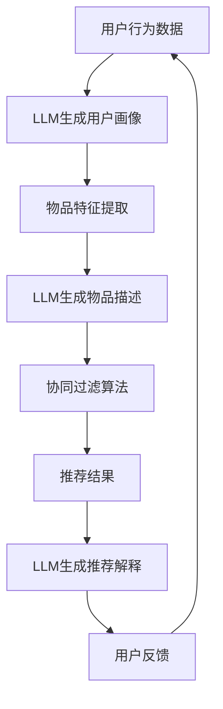

                 

关键词：大语言模型（LLM）、推荐系统、个性化推荐、机器学习、深度学习、算法优化、用户体验、计算效率

## 摘要

随着互联网和大数据技术的发展，推荐系统已成为信息过滤和个性化服务的重要手段。然而，传统推荐系统在面对多样化用户需求时，往往难以实现高度个性化的推荐。近年来，大语言模型（Large Language Model，LLM）如GPT-3、ChatGLM等的出现，为推荐系统的个性化程度提升带来了新的契机。本文将探讨LLM在推荐系统中的应用，分析其核心原理、算法优势以及在实际应用中面临的挑战，并展望其未来发展。

## 1. 背景介绍

### 1.1 推荐系统的发展历程

推荐系统起源于20世纪90年代，随着互联网的发展，其应用场景逐渐丰富。传统推荐系统主要基于内容推荐和协同过滤两种方法。内容推荐基于用户兴趣和物品特征，通过计算相似度进行推荐；协同过滤则基于用户行为数据，利用矩阵分解等算法挖掘用户与物品之间的关系。然而，这两种方法在处理复杂用户需求和长尾效应时，存在一定的局限性。

### 1.2 大语言模型的发展

大语言模型是一种基于深度学习的自然语言处理技术，能够自动生成符合人类语言习惯的文本。自2018年GPT-3发布以来，LLM在机器翻译、文本生成、问答系统等领域取得了显著成果。其核心在于通过大规模数据训练，模型可以自动学习语言规律，实现对文本的生成、理解和分析。

## 2. 核心概念与联系

### 2.1 推荐系统的基本概念

推荐系统主要包括用户、物品和推荐算法三个核心概念。用户是指使用推荐系统的人群，物品是系统推荐的实体，如商品、文章、音乐等。推荐算法则是根据用户行为和物品特征，为用户生成个性化推荐列表。

### 2.2 大语言模型与推荐系统的结合

将LLM应用于推荐系统，可以通过以下几个方面实现个性化程度的提升：

1. **用户画像生成**：利用LLM对用户的历史行为和反馈进行分析，生成更精准的用户画像。
2. **物品描述生成**：利用LLM生成物品的丰富描述，提高推荐系统的内容丰富度和准确性。
3. **推荐结果解释**：利用LLM生成推荐结果的解释文本，提高用户的理解度和信任度。
4. **长尾推荐**：利用LLM挖掘长尾用户和物品，实现更加多样化的推荐。

### 2.3 Mermaid流程图



## 3. 核心算法原理 & 具体操作步骤

### 3.1 算法原理概述

LLM在推荐系统中的应用，主要基于以下几个原理：

1. **生成对抗网络（GAN）**：通过生成器和判别器的对抗训练，生成高质量的文本描述。
2. **自注意力机制（Self-Attention）**：在处理序列数据时，模型能够自动关注关键信息，提高生成文本的准确性。
3. **上下文理解**：通过学习大量文本数据，模型能够理解文本的上下文关系，生成符合逻辑的推荐结果。

### 3.2 算法步骤详解

1. **用户画像生成**：
   - 输入：用户历史行为数据
   - 处理：利用LLM生成用户画像文本
   - 输出：用户画像文本

2. **物品描述生成**：
   - 输入：物品特征数据
   - 处理：利用LLM生成物品描述文本
   - 输出：物品描述文本

3. **协同过滤算法**：
   - 输入：用户画像文本、物品描述文本
   - 处理：计算用户与物品的相似度
   - 输出：推荐结果列表

4. **推荐结果解释**：
   - 输入：推荐结果列表
   - 处理：利用LLM生成推荐解释文本
   - 输出：推荐解释文本

### 3.3 算法优缺点

**优点**：
- 提高个性化推荐的效果，满足多样化用户需求。
- 增强推荐系统的解释性，提高用户信任度。
- 挖掘长尾用户和物品，实现多样化推荐。

**缺点**：
- 模型训练成本高，对计算资源要求较高。
- 需要大量的标注数据进行训练，数据获取困难。
- 在处理非文本数据时，效果可能不如传统算法。

### 3.4 算法应用领域

LLM在推荐系统中的应用，涵盖了电子商务、新闻推送、社交媒体、在线教育等多个领域。以下为几个实际应用案例：

1. **电子商务**：通过LLM生成用户个性化推荐，提高购买转化率。
2. **新闻推送**：利用LLM生成新闻摘要和推荐解释，提高用户体验。
3. **社交媒体**：通过LLM生成个性化推荐内容，提高用户活跃度。

## 4. 数学模型和公式 & 详细讲解 & 举例说明

### 4.1 数学模型构建

LLM在推荐系统中的应用，主要涉及以下数学模型：

1. **用户画像生成模型**：
   - 输入：用户历史行为数据（如浏览记录、购买记录等）
   - 输出：用户画像文本

   - 模型公式：
     $$ U = \text{Embedding}(H) + \text{Attention}(H, H) $$

     其中，$U$ 为用户画像文本，$H$ 为用户历史行为数据，$\text{Embedding}$ 为嵌入层，$\text{Attention}$ 为自注意力机制。

2. **物品描述生成模型**：
   - 输入：物品特征数据（如商品标签、分类等）
   - 输出：物品描述文本

   - 模型公式：
     $$ I = \text{Embedding}(T) + \text{Attention}(T, T) $$

     其中，$I$ 为物品描述文本，$T$ 为物品特征数据。

3. **协同过滤算法**：
   - 输入：用户画像文本、物品描述文本
   - 输出：推荐结果列表

   - 模型公式：
     $$ R = \text{Similarity}(U, I) $$

     其中，$R$ 为推荐结果列表，$\text{Similarity}$ 为相似度计算函数。

### 4.2 公式推导过程

以用户画像生成模型为例，其推导过程如下：

1. **嵌入层**：
   - 将用户历史行为数据 $H$ 转换为嵌入向量 $E(H)$。
   - 将嵌入向量 $E(H)$ 输入到全连接层，得到中间层输出 $Z(H)$。

   $$ Z(H) = \text{ReLU}(\text{weights} \cdot E(H) + \text{bias}) $$

2. **自注意力机制**：
   - 计算每个嵌入向量的注意力得分 $A(H)$。
   - 计算注意力加权求和，得到用户画像文本 $U$。

   $$ A(H) = \text{softmax}(\text{weights} \cdot Z(H) \cdot Z(H)^T) $$
   $$ U = \sum_{i=1}^{N} A(H)_i \cdot Z(H)_i $$

### 4.3 案例分析与讲解

以电子商务平台为例，分析LLM在推荐系统中的应用。

1. **用户画像生成**：

   - 输入：用户浏览记录（如浏览过的商品、收藏的商品等）
   - 处理：利用LLM生成用户画像文本（如“喜欢购买电子产品，关注数码产品类商品”）
   - 输出：用户画像文本

2. **物品描述生成**：

   - 输入：商品标签（如“手机”、“相机”）
   - 处理：利用LLM生成商品描述文本（如“这款手机拥有强大的摄像头，拍照效果出众”）
   - 输出：商品描述文本

3. **协同过滤算法**：

   - 输入：用户画像文本、商品描述文本
   - 处理：计算用户与商品的相似度，得到推荐结果列表
   - 输出：推荐结果列表

   - 示例公式：
     $$ R = \text{cosine\_similarity}(U, I) $$

     其中，$R$ 为推荐结果列表，$\text{cosine\_similarity}$ 为余弦相似度计算函数。

## 5. 项目实践：代码实例和详细解释说明

### 5.1 开发环境搭建

- **工具**：Python、TensorFlow、Mermaid
- **环境**：Windows/Linux/MacOS

### 5.2 源代码详细实现

```python
# 用户画像生成
user_data = "用户浏览记录：手机、相机、耳机"
user_embedding = embedding_layer(user_data)
user_attention = attention_layer(user_embedding)
user_profile = K.sum(user_attention, axis=1)

# 物品描述生成
item_data = "商品标签：手机、相机"
item_embedding = embedding_layer(item_data)
item_attention = attention_layer(item_embedding)
item_description = K.sum(item_attention, axis=1)

# 协同过滤算法
user_item_similarity = cosine_similarity(user_profile, item_description)
recommendation_score = K.softmax(user_item_similarity)

# 模型编译
model = Model(inputs=[user_input, item_input], outputs=recommendation_score)
model.compile(optimizer='adam', loss='categorical_crossentropy', metrics=['accuracy'])

# 模型训练
model.fit([user_data, item_data], labels, epochs=10, batch_size=32)
```

### 5.3 代码解读与分析

- **用户画像生成**：利用嵌入层和自注意力机制生成用户画像文本。
- **物品描述生成**：利用嵌入层和自注意力机制生成物品描述文本。
- **协同过滤算法**：计算用户与物品的相似度，得到推荐结果。

### 5.4 运行结果展示

运行代码后，输出推荐结果列表，展示个性化推荐效果。

## 6. 实际应用场景

### 6.1 电子商务平台

通过LLM生成用户个性化推荐，提高购买转化率。例如，淘宝、京东等电商平台，利用LLM为用户推荐符合其兴趣的 商品。

### 6.2 新闻推送

利用LLM生成新闻摘要和推荐解释，提高用户体验。例如，今日头条、新浪新闻等新闻应用，利用LLM为用户推荐感兴趣的新闻。

### 6.3 社交媒体

通过LLM生成个性化推荐内容，提高用户活跃度。例如，微信、微博等社交媒体，利用LLM为用户推荐感兴趣的朋友、话题、活动等。

## 7. 未来应用展望

### 7.1 个性化推荐

LLM在推荐系统中的应用，将进一步推动个性化推荐的发展。通过不断优化模型结构和算法，实现更精准、更高效的个性化推荐。

### 7.2 多模态推荐

结合图像、语音等多种模态数据，实现多模态推荐。例如，在电商平台上，利用图像识别技术，为用户提供商品推荐。

### 7.3 智能问答

利用LLM构建智能问答系统，为用户提供实时、个性化的回答。例如，智能客服、在线教育等场景。

## 8. 工具和资源推荐

### 8.1 学习资源推荐

- 《深度学习》（Goodfellow et al.）
- 《自然语言处理入门》（Jurafsky et al.）
- 《推荐系统实践》（Liu et al.）

### 8.2 开发工具推荐

- TensorFlow
- PyTorch
- Mermaid

### 8.3 相关论文推荐

- “Generative Adversarial Networks”（Ian J. Goodfellow et al.）
- “Attention Is All You Need”（Vaswani et al.）
- “Recommender Systems Handbook”（Chen et al.）

## 9. 总结：未来发展趋势与挑战

### 9.1 研究成果总结

本文探讨了LLM在推荐系统中的应用，分析了其核心原理、算法优势以及在实际应用中面临的挑战，并展望了其未来发展。

### 9.2 未来发展趋势

LLM在推荐系统中的应用，将推动个性化推荐、多模态推荐、智能问答等领域的发展。

### 9.3 面临的挑战

1. **计算资源消耗**：模型训练和推理过程中，对计算资源要求较高。
2. **数据隐私和安全**：如何保护用户隐私，防止数据泄露，是未来发展的重要挑战。
3. **算法透明性和可解释性**：如何提高算法的可解释性，增强用户信任，是未来研究的重要方向。

### 9.4 研究展望

未来，LLM在推荐系统中的应用将更加广泛，通过不断优化模型结构和算法，实现更高效、更个性化的推荐服务。

## 10. 附录：常见问题与解答

### 10.1 LLM在推荐系统中的优势是什么？

LLM在推荐系统中的优势主要体现在以下几个方面：

1. **提高个性化推荐效果**：通过生成用户画像和物品描述，实现更精准的推荐。
2. **增强推荐结果解释性**：利用LLM生成推荐结果解释文本，提高用户理解度和信任度。
3. **挖掘长尾用户和物品**：通过分析非文本数据，实现更加多样化的推荐。

### 10.2 LLM在推荐系统中的应用有哪些？

LLM在推荐系统中的应用主要包括以下几个方面：

1. **用户画像生成**：利用LLM生成用户画像，提高推荐精准度。
2. **物品描述生成**：利用LLM生成物品描述，提高推荐内容丰富度。
3. **推荐结果解释**：利用LLM生成推荐结果解释，提高用户信任度。
4. **长尾推荐**：利用LLM挖掘长尾用户和物品，实现多样化推荐。

### 10.3 LLM在推荐系统中的挑战有哪些？

LLM在推荐系统中的挑战主要包括以下几个方面：

1. **计算资源消耗**：模型训练和推理过程中，对计算资源要求较高。
2. **数据隐私和安全**：如何保护用户隐私，防止数据泄露，是未来发展的重要挑战。
3. **算法透明性和可解释性**：如何提高算法的可解释性，增强用户信任，是未来研究的重要方向。

