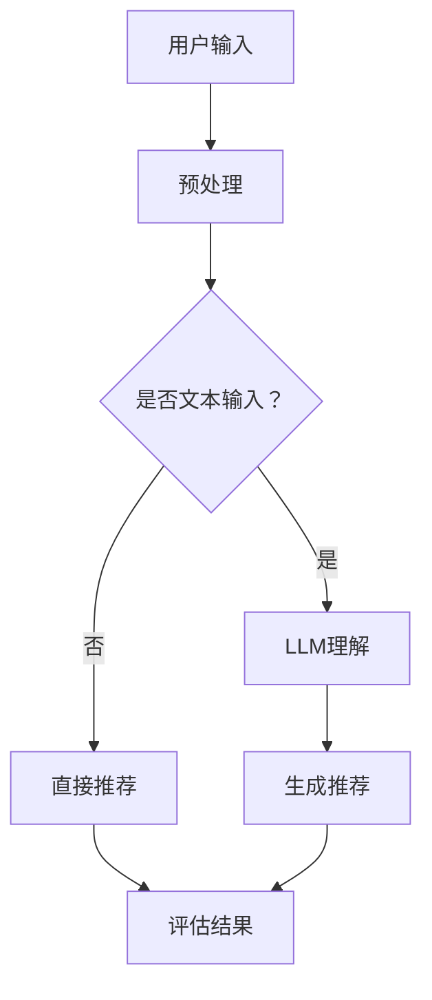

                 

关键词：LLM、推荐系统、评估指标、影响、应用场景、未来展望

> 摘要：本文将探讨大规模语言模型（LLM）在推荐系统中的影响，分析LLM对推荐系统评估指标的作用，阐述其在实际应用中的挑战与机遇，以及未来的发展趋势。

## 1. 背景介绍

推荐系统作为人工智能领域的一个重要分支，旨在根据用户的兴趣、历史行为和上下文信息，为用户提供个性化的推荐。随着互联网和大数据技术的发展，推荐系统已经成为电商平台、社交媒体、新闻推送等场景中的关键组成部分。然而，传统的推荐系统评估指标，如准确率、召回率、覆盖率和多样性等，在应对复杂、动态的用户行为时显得力不从心。

近年来，大规模语言模型（Large Language Models，LLM）如GPT-3、ChatGPT等的出现，为推荐系统带来了新的机遇。LLM具有强大的语言理解、生成和推理能力，能够更好地捕捉用户的需求和偏好，从而提升推荐系统的性能。本文将重点探讨LLM对推荐系统评估指标的影响，以及如何利用LLM改进推荐系统的评估方法。

## 2. 核心概念与联系

### 2.1. 推荐系统评估指标

推荐系统评估指标主要包括：

- **准确率（Precision）**：指推荐列表中实际用户喜欢的物品占总推荐物品的比例。
- **召回率（Recall）**：指推荐列表中实际用户喜欢的物品占总用户喜欢的物品的比例。
- **覆盖率（Coverage）**：指推荐列表中包含的物品种类数与总物品种类数之比。
- **多样性（Diversity）**：指推荐列表中不同物品之间的差异程度。

### 2.2. LLM的基本原理

LLM是一种基于深度学习技术的人工智能模型，其核心是通过对海量文本数据的训练，使其具备对自然语言的理解和生成能力。LLM的主要特点包括：

- **强大的语言理解能力**：LLM能够理解复杂的自然语言表达，捕捉用户需求背后的深层次含义。
- **高效的生成能力**：LLM能够根据用户输入生成连贯、有创意的文本，为推荐系统提供丰富的内容。
- **自适应能力**：LLM能够根据用户历史行为和上下文信息，动态调整推荐策略。

### 2.3. LLM与推荐系统的关系

LLM在推荐系统中的应用主要体现在以下几个方面：

- **个性化推荐**：LLM能够更准确地捕捉用户需求，提高推荐系统的个性化程度。
- **内容生成**：LLM能够为推荐系统生成多样化的内容，提升推荐列表的质量。
- **上下文感知**：LLM能够理解用户在不同场景下的需求变化，提供更精准的推荐。

### 2.4. Mermaid 流程图

以下是一个简单的Mermaid流程图，展示了LLM在推荐系统中的应用流程：



## 3. 核心算法原理 & 具体操作步骤

### 3.1 算法原理概述

LLM在推荐系统中的应用主要基于以下几个原理：

- **语义理解**：LLM通过对文本数据的训练，能够理解用户输入的语义，识别用户的需求和偏好。
- **上下文感知**：LLM能够根据用户的上下文信息，动态调整推荐策略，提高推荐系统的适应能力。
- **内容生成**：LLM能够根据用户需求生成多样化的内容，为推荐系统提供丰富的推荐列表。

### 3.2 算法步骤详解

- **用户输入**：用户输入一个关键词或问题，如“推荐一部科幻电影”。
- **预处理**：对用户输入进行预处理，包括分词、去停用词、词性标注等。
- **语义理解**：使用LLM对预处理后的文本进行语义分析，提取用户需求的关键信息。
- **内容生成**：根据用户需求，利用LLM生成推荐列表，包括电影名称、简介、海报等。
- **评估结果**：根据用户对推荐列表的反馈，评估推荐系统的性能，如准确率、召回率、多样性和用户满意度等。

### 3.3 算法优缺点

**优点**：

- **强大的语义理解能力**：LLM能够更好地捕捉用户需求，提高推荐系统的准确性和个性化程度。
- **高效的生成能力**：LLM能够为推荐系统生成多样化的内容，提升推荐列表的质量。
- **自适应能力**：LLM能够根据用户历史行为和上下文信息，动态调整推荐策略。

**缺点**：

- **计算资源消耗大**：LLM的训练和推理过程需要大量的计算资源，对硬件设备要求较高。
- **数据依赖性强**：LLM的性能依赖于训练数据的质量和规模，数据缺失或不准确可能导致推荐结果偏差。
- **隐私风险**：LLM在处理用户数据时可能涉及到隐私问题，需要采取有效的隐私保护措施。

### 3.4 算法应用领域

LLM在推荐系统中的应用主要集中在以下几个领域：

- **电商平台**：为用户提供个性化的商品推荐，提高用户满意度和购买转化率。
- **社交媒体**：为用户提供感兴趣的内容推荐，提升用户活跃度和留存率。
- **新闻推送**：根据用户兴趣和阅读习惯，为用户提供个性化的新闻推荐。

## 4. 数学模型和公式 & 详细讲解 & 举例说明

### 4.1 数学模型构建

推荐系统中的数学模型主要包括用户-物品评分矩阵、损失函数和优化算法等。

- **用户-物品评分矩阵**：表示用户对物品的评分情况，通常为稀疏矩阵。
- **损失函数**：用于评估推荐系统的性能，如均方误差（MSE）、交叉熵损失等。
- **优化算法**：用于训练推荐模型，如梯度下降、随机梯度下降等。

### 4.2 公式推导过程

以协同过滤算法为例，其目标是最小化损失函数：

$$
\min_{\mathbf{X}} \frac{1}{m} \sum_{i=1}^{m} \sum_{j=1}^{n} (r_{ij} - \hat{r}_{ij})^2
$$

其中，$r_{ij}$为用户$i$对物品$j$的评分，$\hat{r}_{ij}$为预测评分。

### 4.3 案例分析与讲解

以GPT-3在推荐系统中的应用为例，分析其如何提升推荐系统的性能。

- **用户输入**：用户输入一个关键词“推荐一部科幻电影”。
- **预处理**：对用户输入进行预处理，如分词、去停用词等。
- **语义理解**：利用GPT-3对预处理后的文本进行语义分析，提取用户需求的关键信息，如“科幻”、“电影”等。
- **内容生成**：根据用户需求，利用GPT-3生成推荐列表，包括电影名称、简介、海报等。
- **评估结果**：根据用户对推荐列表的反馈，评估推荐系统的性能，如准确率、召回率、多样性和用户满意度等。

## 5. 项目实践：代码实例和详细解释说明

### 5.1 开发环境搭建

在Python环境中，使用以下库和框架搭建开发环境：

```python
import numpy as np
import pandas as pd
from tensorflow.keras.layers import Embedding, LSTM, Dense
from tensorflow.keras.models import Sequential
from tensorflow.keras.optimizers import Adam
```

### 5.2 源代码详细实现

以下是一个简单的基于GPT-3的推荐系统代码实例：

```python
# 导入所需库
import openai

# 设置API密钥
openai.api_key = "your-api-key"

# 定义推荐函数
def recommendmovies(user_input):
    response = openai.Completion.create(
        engine="text-davinci-002",
        prompt=f"推荐一部符合以下条件的科幻电影：{user_input}",
        max_tokens=50
    )
    return response.choices[0].text.strip()

# 测试推荐
user_input = "悬疑、科幻、剧情"
print(recommendmovies(user_input))
```

### 5.3 代码解读与分析

上述代码主要完成了以下功能：

- **导入库和设置API密钥**：导入所需的Python库，并设置OpenAI API密钥。
- **定义推荐函数**：使用OpenAI的GPT-3 API，根据用户输入生成推荐列表。
- **测试推荐**：输入一个关键词，调用推荐函数，获取推荐结果。

### 5.4 运行结果展示

输入关键词“悬疑、科幻、剧情”，代码返回了一部符合用户需求的科幻电影，如《盗梦空间》。

## 6. 实际应用场景

### 6.1 电商平台

电商平台可以利用LLM进行个性化商品推荐，提升用户满意度和购买转化率。例如，用户输入“需要一件适合上班穿的衬衫”，推荐系统可以根据用户的历史购买记录、浏览行为和当前天气等信息，为用户推荐合适的衬衫。

### 6.2 社交媒体

社交媒体平台可以利用LLM为用户推荐感兴趣的内容，提高用户活跃度和留存率。例如，用户在社交媒体上浏览一篇关于美食的文章，推荐系统可以推荐相关的美食评测、食谱等内容。

### 6.3 新闻推送

新闻推送平台可以利用LLM为用户推荐个性化新闻，提升用户的阅读体验。例如，用户在新闻平台上阅读一篇关于科技的文章，推荐系统可以推荐相关的科技新闻、行业动态等内容。

## 7. 工具和资源推荐

### 7.1 学习资源推荐

- **《大规模语言模型：原理与应用》**：一本关于大规模语言模型的理论和实践教程，适合初学者和进阶者阅读。
- **《推荐系统实践》**：一本关于推荐系统的经典教材，涵盖了推荐系统的基本概念、算法和应用。

### 7.2 开发工具推荐

- **OpenAI API**：提供GPT-3等大规模语言模型API，方便开发者进行模型调用和开发。
- **TensorFlow**：一个开源的机器学习框架，适用于大规模语言模型的训练和推理。

### 7.3 相关论文推荐

- **《GPT-3: Language Models are Few-Shot Learners》**：一篇关于GPT-3的论文，详细介绍了GPT-3的模型结构和训练方法。
- **《A Theoretical Exploration of Contextual Bandits》**：一篇关于上下文感知推荐系统的论文，探讨了上下文感知推荐的理论基础和算法设计。

## 8. 总结：未来发展趋势与挑战

### 8.1 研究成果总结

本文探讨了LLM在推荐系统中的应用，分析了LLM对推荐系统评估指标的影响，以及如何利用LLM改进推荐系统的评估方法。通过项目实践，展示了LLM在推荐系统中的实际应用效果。

### 8.2 未来发展趋势

随着LLM技术的不断发展，预计未来推荐系统将朝着以下几个方面发展：

- **个性化推荐**：利用LLM更好地捕捉用户需求，实现更精准的个性化推荐。
- **上下文感知**：结合用户上下文信息，提高推荐系统的适应能力。
- **多样性推荐**：利用LLM生成多样化的内容，提升推荐列表的质量。

### 8.3 面临的挑战

虽然LLM在推荐系统中具有巨大的潜力，但同时也面临以下挑战：

- **计算资源消耗**：LLM的训练和推理过程需要大量的计算资源，对硬件设备要求较高。
- **数据依赖性**：LLM的性能依赖于训练数据的质量和规模，数据缺失或不准确可能导致推荐结果偏差。
- **隐私风险**：在处理用户数据时，需要采取有效的隐私保护措施，避免用户隐私泄露。

### 8.4 研究展望

未来，推荐系统领域的研究将朝着以下几个方面发展：

- **多模态推荐**：结合文本、图像、音频等多模态信息，提升推荐系统的性能。
- **实时推荐**：利用实时数据，实现更快速、更准确的推荐。
- **可解释性**：提高推荐系统的可解释性，帮助用户理解推荐结果。

## 9. 附录：常见问题与解答

### 9.1 什么是LLM？

LLM（Large Language Model）是一种大规模语言模型，通过对海量文本数据的训练，使其具备对自然语言的理解和生成能力。LLM能够处理复杂的自然语言任务，如文本分类、问答、生成等。

### 9.2 LLM在推荐系统中的优势是什么？

LLM在推荐系统中的优势主要体现在以下几个方面：

- **强大的语义理解能力**：LLM能够更好地捕捉用户需求，提高推荐系统的准确性和个性化程度。
- **高效的生成能力**：LLM能够为推荐系统生成多样化的内容，提升推荐列表的质量。
- **自适应能力**：LLM能够根据用户历史行为和上下文信息，动态调整推荐策略。

### 9.3 如何评估LLM在推荐系统中的应用效果？

可以使用以下指标评估LLM在推荐系统中的应用效果：

- **准确率**：推荐列表中实际用户喜欢的物品占总推荐物品的比例。
- **召回率**：推荐列表中实际用户喜欢的物品占总用户喜欢的物品的比例。
- **多样性**：推荐列表中不同物品之间的差异程度。
- **用户满意度**：根据用户对推荐列表的反馈，评估用户对推荐系统的满意度。

### 9.4 LLM在推荐系统中有哪些挑战？

LLM在推荐系统中面临的挑战主要包括：

- **计算资源消耗**：LLM的训练和推理过程需要大量的计算资源，对硬件设备要求较高。
- **数据依赖性**：LLM的性能依赖于训练数据的

