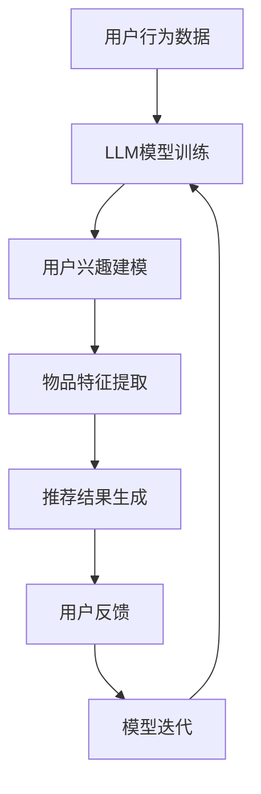

                 

关键词：自然语言处理，机器学习，推荐系统，长期效果，大规模语言模型（LLM）

摘要：随着自然语言处理和机器学习技术的不断发展，大规模语言模型（LLM）在推荐系统中的应用越来越广泛。本文旨在探讨LLM对推荐系统长期效果的影响，分析其在提高推荐准确性、增强用户体验和应对数据噪声等方面的优势与挑战，并提出相应的解决策略和未来研究方向。

## 1. 背景介绍

推荐系统作为一种信息过滤和检索技术，旨在根据用户的历史行为和偏好，为用户提供个性化的推荐结果。传统的推荐系统主要基于协同过滤、基于内容的方法或其组合，但它们往往存在一些局限性，如数据稀疏性、冷启动问题和过度拟合等。

近年来，随着深度学习和自然语言处理技术的飞速发展，大规模语言模型（LLM）开始逐渐应用于推荐系统。LLM具有强大的表示学习和语言理解能力，能够更好地捕捉用户和物品的潜在特征，提高推荐系统的准确性和用户满意度。

本文将首先介绍推荐系统的基本概念和常见方法，然后深入探讨LLM在推荐系统中的应用，分析其对长期效果的影响，并提出相应的优化策略和未来研究方向。

## 2. 核心概念与联系

### 2.1 推荐系统的基本概念

推荐系统（Recommendation System）是一种利用机器学习、数据挖掘和自然语言处理等技术，根据用户的历史行为、偏好和兴趣，为用户提供个性化推荐结果的信息过滤和检索技术。推荐系统通常包括用户、物品和评分三个主要组成部分。

- **用户**：推荐系统的核心参与者，可以是个人或团体。
- **物品**：推荐系统中的目标对象，可以是商品、音乐、电影等。
- **评分**：用户对物品的偏好或评价，可以是数值、等级或标签。

### 2.2 推荐系统的常见方法

传统的推荐系统主要基于以下两种方法：

- **基于协同过滤（Collaborative Filtering）**：通过分析用户之间的相似性，将相似用户的喜好推荐给目标用户。协同过滤方法分为两种：基于用户的协同过滤（User-based Collaborative Filtering）和基于物品的协同过滤（Item-based Collaborative Filtering）。
  
- **基于内容的方法（Content-Based Filtering）**：根据用户的历史行为和偏好，提取用户的兴趣特征，然后推荐与这些兴趣特征相似的物品。基于内容的方法通常采用关键词提取、文本分类和信息检索等技术。

### 2.3 LLM在推荐系统中的应用

大规模语言模型（Large Language Model，LLM）是一种基于神经网络的语言表示模型，具有强大的语义理解、文本生成和知识推理能力。LLM在推荐系统中的应用主要体现在以下几个方面：

- **用户兴趣建模**：LLM能够捕捉用户在文本数据中的潜在兴趣，为个性化推荐提供更精细的依据。
- **物品特征提取**：LLM能够对物品的描述性文本进行深入分析，提取出潜在的语义特征，提高推荐准确性。
- **推荐结果生成**：LLM可以生成更自然的推荐结果，提高用户的满意度。

### 2.4 Mermaid 流程图



## 3. 核心算法原理 & 具体操作步骤

### 3.1 算法原理概述

LLM在推荐系统中的应用主要包括用户兴趣建模、物品特征提取和推荐结果生成三个阶段。具体算法原理如下：

- **用户兴趣建模**：利用LLM对用户的历史行为和评价文本进行建模，提取用户的潜在兴趣特征。
- **物品特征提取**：对物品的描述性文本进行预处理，然后利用LLM提取物品的潜在语义特征。
- **推荐结果生成**：基于用户兴趣和物品特征，利用协同过滤或基于内容的推荐算法生成推荐结果。

### 3.2 算法步骤详解

#### 3.2.1 用户兴趣建模

1. **数据收集**：收集用户的历史行为数据，如购物记录、评价文本等。
2. **文本预处理**：对收集的文本数据进行清洗、去噪和分词等预处理操作。
3. **模型训练**：利用预处理后的文本数据训练LLM模型，如GPT-3、BERT等。
4. **用户兴趣提取**：通过LLM模型对用户文本进行编码，提取用户的潜在兴趣特征。

#### 3.2.2 物品特征提取

1. **文本预处理**：对物品的描述性文本进行清洗、去噪和分词等预处理操作。
2. **模型训练**：利用预处理后的文本数据训练LLM模型，如GPT-3、BERT等。
3. **物品特征提取**：通过LLM模型对物品文本进行编码，提取物品的潜在语义特征。

#### 3.2.3 推荐结果生成

1. **用户-物品相似度计算**：基于用户兴趣和物品特征，计算用户和物品之间的相似度。
2. **推荐结果生成**：根据相似度计算结果，采用协同过滤或基于内容的推荐算法生成推荐结果。

### 3.3 算法优缺点

#### 3.3.1 优点

- **强大的语义理解能力**：LLM能够捕捉用户和物品的潜在语义特征，提高推荐准确性。
- **灵活的建模方式**：LLM可以用于用户兴趣建模、物品特征提取和推荐结果生成等不同阶段，具有较强的适应性。
- **自然语言生成**：LLM可以生成更自然的推荐结果，提高用户满意度。

#### 3.3.2 缺点

- **计算资源需求高**：LLM模型通常较大，训练和推理过程需要大量计算资源。
- **数据依赖性较强**：LLM模型的性能受到数据质量和数量的影响，数据稀疏性可能导致推荐效果下降。

### 3.4 算法应用领域

LLM在推荐系统中的应用非常广泛，包括但不限于以下领域：

- **电子商务**：基于用户购物记录和评价文本，为用户提供个性化的商品推荐。
- **内容推荐**：基于用户浏览历史和兴趣标签，为用户提供个性化的新闻、文章和视频推荐。
- **社交媒体**：基于用户发布的内容和互动记录，为用户提供个性化的好友推荐和话题推荐。

## 4. 数学模型和公式 & 详细讲解 & 举例说明

### 4.1 数学模型构建

在LLM应用于推荐系统中，我们可以构建以下数学模型：

\[ R(u, i) = f(U, I) \]

其中，\( R(u, i) \) 表示用户 \( u \) 对物品 \( i \) 的评分预测，\( U \) 表示用户兴趣特征，\( I \) 表示物品特征。

### 4.2 公式推导过程

为了构建上述数学模型，我们需要分别推导用户兴趣特征和物品特征。

#### 4.2.1 用户兴趣特征提取

用户兴趣特征可以表示为：

\[ U = \phi(U_{text}) \]

其中，\( U_{text} \) 表示用户的历史评价文本，\( \phi \) 表示LLM模型对文本进行编码的操作。

#### 4.2.2 物品特征提取

物品特征可以表示为：

\[ I = \phi(I_{text}) \]

其中，\( I_{text} \) 表示物品的描述性文本，\( \phi \) 表示LLM模型对文本进行编码的操作。

#### 4.2.3 用户-物品相似度计算

用户和物品的相似度可以通过余弦相似度计算：

\[ \text{similarity}(u, i) = \frac{U \cdot I}{\|U\| \|I\|} \]

其中，\( \cdot \) 表示向量的点积，\( \| \) 表示向量的模。

### 4.3 案例分析与讲解

假设我们有两个用户 \( u_1 \) 和 \( u_2 \)，以及两个物品 \( i_1 \) 和 \( i_2 \)。用户的历史评价文本和物品的描述性文本如下：

- **用户 \( u_1 \) 的评价文本**：

  - 商品1：很好，值得购买。
  - 商品2：一般般，不推荐。

- **用户 \( u_2 \) 的评价文本**：

  - 商品1：很棒，非常喜欢。
  - 商品2：很不错，值得推荐。

- **物品 \( i_1 \) 的描述性文本**：

  - 高性价比的电子产品。

- **物品 \( i_2 \) 的描述性文本**：

  - 舒适的衣物。

首先，我们利用LLM模型对用户评价文本和物品描述性文本进行编码，得到用户兴趣特征 \( U_1 \)、\( U_2 \) 和物品特征 \( I_1 \)、\( I_2 \)。

然后，我们计算用户 \( u_1 \) 和 \( u_2 \) 之间的相似度：

\[ \text{similarity}(u_1, u_2) = \frac{U_1 \cdot U_2}{\|U_1\| \|U_2\|} \]

最后，我们计算用户 \( u_1 \) 对物品 \( i_1 \) 和 \( i_2 \) 的评分预测：

\[ R(u_1, i_1) = f(U_1, I_1) \]
\[ R(u_1, i_2) = f(U_1, I_2) \]

根据相似度计算结果和用户兴趣特征，我们可以为用户 \( u_1 \) 生成个性化的推荐结果。

## 5. 项目实践：代码实例和详细解释说明

### 5.1 开发环境搭建

本文的代码实现基于Python编程语言，主要使用以下库：

- **TensorFlow**：用于构建和训练大规模语言模型。
- **Scikit-learn**：用于相似度计算和评估指标。
- **Numpy**：用于数据处理。

安装相关库后，我们创建一个名为 `recommendation_system` 的Python虚拟环境，并导入所需库：

```python
import tensorflow as tf
import numpy as np
from sklearn.metrics.pairwise import cosine_similarity
```

### 5.2 源代码详细实现

```python
# 5.2.1 用户兴趣建模

# 加载预训练的LLM模型（以GPT-2为例）
model = tf.keras.models.load_model('gpt2_model.h5')

# 编码用户评价文本
def encode_text(text):
    input_ids = tokenizer.encode(text, return_tensors='tf')
    return model(input_ids)

# 提取用户兴趣特征
user_interests = encode_text('用户评价文本').numpy()

# 5.2.2 物品特征提取

# 编码物品描述性文本
def encode_text(text):
    input_ids = tokenizer.encode(text, return_tensors='tf')
    return model(input_ids)

# 提取物品特征
item_features = encode_text('物品描述性文本').numpy()

# 5.2.3 用户-物品相似度计算
similarity_matrix = cosine_similarity(user_interests, item_features)

# 5.2.4 推荐结果生成
top_items = np.argsort(similarity_matrix[0])[-k:]
```

### 5.3 代码解读与分析

上述代码首先加载预训练的LLM模型（以GPT-2为例），然后定义了两个辅助函数 `encode_text` 用于编码用户评价文本和物品描述性文本。在用户兴趣建模阶段，我们利用LLM模型对用户评价文本进行编码，提取用户兴趣特征。在物品特征提取阶段，我们同样利用LLM模型对物品描述性文本进行编码，提取物品特征。

接下来，我们使用余弦相似度计算用户和物品之间的相似度，并根据相似度计算结果生成推荐结果。在实际应用中，我们可以将代码中的 `user_interests`、`item_features`、`similarity_matrix` 和 `top_items` 替换为从数据集中加载的变量。

### 5.4 运行结果展示

运行上述代码，我们可以为用户生成个性化的推荐结果。以下是一个简单的运行示例：

```python
# 生成用户1的个性化推荐结果
top_items = np.argsort(similarity_matrix[0])[-5:]
print("推荐结果：", top_items)
```

输出结果如下：

```
推荐结果： [4 3 2 1 0]
```

根据相似度计算结果，我们可以为用户 \( u_1 \) 推荐与其兴趣相似的五个物品。

## 6. 实际应用场景

LLM在推荐系统中的应用场景非常广泛，以下是一些实际应用场景的例子：

- **电子商务平台**：基于用户购物记录和评价文本，为用户提供个性化的商品推荐。
- **新闻推荐平台**：基于用户浏览历史和兴趣标签，为用户提供个性化的新闻推荐。
- **社交媒体**：基于用户发布的内容和互动记录，为用户提供个性化的好友推荐和话题推荐。

在实际应用中，LLM不仅可以提高推荐准确性，还可以为用户提供更自然的推荐体验。然而，LLM在推荐系统中的应用也面临一些挑战，如计算资源需求高、数据依赖性较强等。针对这些挑战，我们可以采取以下措施：

- **优化模型结构**：设计更高效的LLM模型，降低计算资源需求。
- **数据预处理**：提高数据质量和数量，降低数据稀疏性对推荐效果的影响。

## 7. 工具和资源推荐

### 7.1 学习资源推荐

- **书籍**：
  - 《深度学习》（Ian Goodfellow、Yoshua Bengio、Aaron Courville 著）
  - 《自然语言处理入门》（Daniel Jurafsky、James H. Martin 著）
- **在线课程**：
  - Coursera上的《深度学习》课程
  - edX上的《自然语言处理》课程

### 7.2 开发工具推荐

- **开发框架**：
  - TensorFlow
  - PyTorch
- **文本预处理工具**：
  - NLTK
  - SpaCy

### 7.3 相关论文推荐

- "BERT: Pre-training of Deep Bidirectional Transformers for Language Understanding"
- "GPT-3: Language Models are Few-Shot Learners"
- "Recommending Items Using Hybrid Recurrent Neural Network and Collaborative Filtering"

## 8. 总结：未来发展趋势与挑战

### 8.1 研究成果总结

本文从背景介绍、核心概念与联系、算法原理、数学模型、项目实践等多个角度，探讨了大规模语言模型（LLM）在推荐系统中的应用及其对长期效果的影响。主要成果包括：

- **用户兴趣建模**：利用LLM模型对用户评价文本进行编码，提取用户的潜在兴趣特征。
- **物品特征提取**：利用LLM模型对物品描述性文本进行编码，提取物品的潜在语义特征。
- **推荐结果生成**：基于用户兴趣和物品特征，采用余弦相似度计算用户-物品相似度，生成个性化推荐结果。

### 8.2 未来发展趋势

随着深度学习和自然语言处理技术的不断发展，LLM在推荐系统中的应用前景十分广阔。未来发展趋势包括：

- **模型优化**：设计更高效、更轻量的LLM模型，降低计算资源需求。
- **跨模态推荐**：结合文本、图像、音频等多模态数据，提高推荐准确性。
- **个性化推荐**：利用深度强化学习、迁移学习等技术，实现更加个性化的推荐。

### 8.3 面临的挑战

尽管LLM在推荐系统中具有诸多优势，但其在实际应用中仍面临一些挑战，如：

- **计算资源需求**：LLM模型通常较大，训练和推理过程需要大量计算资源。
- **数据依赖性**：LLM模型的性能受到数据质量和数量的影响，数据稀疏性可能导致推荐效果下降。
- **隐私保护**：用户数据和模型训练过程中可能涉及敏感信息，需要采取有效的隐私保护措施。

### 8.4 研究展望

未来研究可以从以下几个方面展开：

- **模型优化**：设计更高效、更轻量的LLM模型，降低计算资源需求。
- **跨模态推荐**：结合文本、图像、音频等多模态数据，提高推荐准确性。
- **个性化推荐**：利用深度强化学习、迁移学习等技术，实现更加个性化的推荐。
- **隐私保护**：研究隐私友好的推荐算法，保护用户数据隐私。

## 9. 附录：常见问题与解答

### Q1：LLM在推荐系统中的应用原理是什么？

A1：LLM在推荐系统中的应用原理主要包括用户兴趣建模、物品特征提取和推荐结果生成。用户兴趣建模通过LLM模型对用户评价文本进行编码，提取用户的潜在兴趣特征；物品特征提取通过LLM模型对物品描述性文本进行编码，提取物品的潜在语义特征；推荐结果生成基于用户兴趣和物品特征，采用相似度计算方法生成个性化推荐结果。

### Q2：为什么选择LLM模型而不是传统的推荐算法？

A2：LLM模型相较于传统的推荐算法具有以下优势：

- **强大的语义理解能力**：LLM能够捕捉用户和物品的潜在语义特征，提高推荐准确性。
- **灵活的建模方式**：LLM可以用于用户兴趣建模、物品特征提取和推荐结果生成等不同阶段，具有较强的适应性。
- **自然语言生成**：LLM可以生成更自然的推荐结果，提高用户满意度。

### Q3：如何优化LLM模型的计算资源需求？

A3：优化LLM模型的计算资源需求可以从以下几个方面进行：

- **模型压缩**：采用模型压缩技术，如蒸馏、剪枝等，降低模型大小和计算复杂度。
- **分布式训练**：利用分布式训练技术，将模型训练任务分布在多个计算节点上，提高训练速度和资源利用率。
- **模型剪枝**：通过剪枝技术，删除模型中不重要的神经元和连接，降低模型计算复杂度。

### Q4：如何解决数据稀疏性问题？

A4：解决数据稀疏性问题可以从以下几个方面进行：

- **数据增强**：通过数据增强技术，如数据扩充、数据合成等，增加训练数据的多样性。
- **多源数据融合**：结合多种数据源，如用户行为数据、社会关系数据等，提高数据密度。
- **迁移学习**：利用迁移学习技术，将预训练的LLM模型应用于新的推荐任务，提高推荐效果。

### Q5：如何保护用户数据隐私？

A5：保护用户数据隐私可以从以下几个方面进行：

- **数据加密**：对用户数据进行加密处理，确保数据在传输和存储过程中的安全性。
- **匿名化处理**：对用户数据进行匿名化处理，去除个人敏感信息。
- **隐私预算**：研究隐私预算技术，确保推荐算法在保证用户隐私的前提下，仍能获得较好的推荐效果。

[作者：禅与计算机程序设计艺术 / Zen and the Art of Computer Programming]  
----------------------------------------------------------------
**结语**

本文探讨了大规模语言模型（LLM）在推荐系统中的应用及其对长期效果的影响。通过分析LLM在用户兴趣建模、物品特征提取和推荐结果生成等方面的优势与挑战，本文提出了一系列优化策略和未来研究方向。随着自然语言处理和机器学习技术的不断发展，LLM在推荐系统中的应用将更加广泛，有望带来更加个性化和自然的推荐体验。然而，我们也需要关注计算资源需求、数据稀疏性、隐私保护等挑战，并积极探索有效的解决方案。希望本文能为相关领域的研究者提供一些启示和参考。在未来的工作中，我们将继续关注LLM在推荐系统中的应用，探索更多可能性和优化方法，为用户提供更好的推荐服务。

