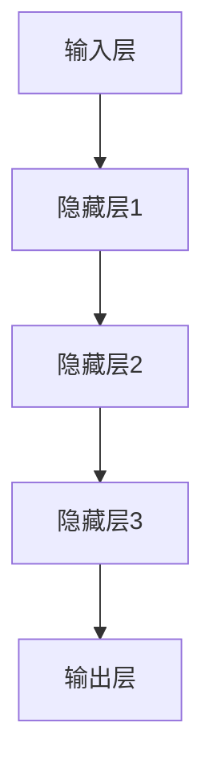
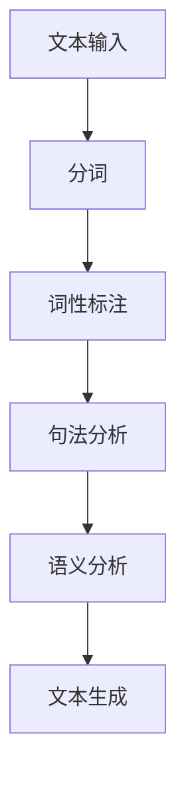
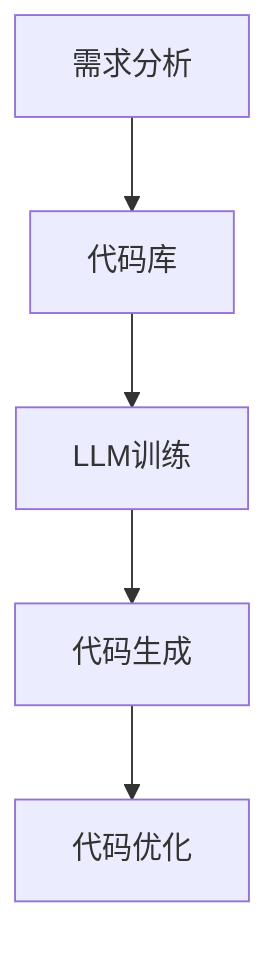

                 

关键词：大型语言模型（LLM），软件开发，流程优化，自动化，人工智能，代码生成，代码审查，协作工具，学习资源，未来趋势

## 摘要

随着人工智能技术的飞速发展，大型语言模型（LLM）如GPT-3、ChatGLM等已经展现出在自然语言处理领域的强大能力。本文旨在探讨LLM对软件开发流程的潜在影响，分析其在代码生成、代码审查、协作工具等多个方面的应用，并探讨其在学习资源、未来趋势等方面的展望。通过本文的讨论，希望能够为软件开发者提供新的思考方向，助力他们更好地利用LLM技术，提高开发效率。

## 1. 背景介绍

近年来，人工智能技术在各个领域取得了显著的进展，其中尤以深度学习为代表的技术在图像识别、语音识别、自然语言处理等领域表现尤为突出。随着计算能力的提升和算法的优化，大型语言模型（LLM）逐渐成为自然语言处理领域的研究热点。LLM是一种基于深度学习的语言模型，通过学习海量文本数据，可以生成与输入文本高度相关的文本输出。LLM在自然语言理解、文本生成、机器翻译等方面具有广泛应用，其潜力也受到了广泛关注。

软件开发作为人工智能的重要应用领域，一直以来都是技术创新和产业变革的前沿。随着软件系统的复杂度不断增加，开发流程的优化和效率提升成为软件企业面临的挑战。传统的软件开发流程包括需求分析、设计、编码、测试、部署等多个阶段，每个阶段都需要大量的人力投入。如何提高开发效率、降低成本、提高软件质量成为软件开发者关注的焦点。

在这样一个背景下，LLM的应用为软件开发流程带来了一系列新的可能。首先，LLM可以在代码生成、代码审查、协作工具等方面提供支持，提高开发效率；其次，LLM可以用于自动化测试、缺陷预测等任务，降低软件质量风险；此外，LLM还可以作为学习资源，帮助开发者提高技能水平。本文将围绕这些方面展开讨论。

### 2. 核心概念与联系

为了更好地理解LLM在软件开发中的应用，我们需要先了解一些核心概念，包括深度学习、自然语言处理、代码生成等。以下是这些概念的相关信息及Mermaid流程图：

#### 2.1. 深度学习

深度学习是一种基于人工神经网络的机器学习方法，通过构建多层神经网络模型，对大量数据进行分析和训练，从而实现复杂的任务。在深度学习中，网络中的每个神经元都相当于一个简单的函数，通过多层堆叠，可以实现对输入数据的复杂变换和提取。



#### 2.2. 自然语言处理

自然语言处理（NLP）是人工智能的一个重要分支，旨在让计算机理解和处理人类语言。NLP包括文本分类、情感分析、命名实体识别、机器翻译等多种任务。在软件开发中，NLP技术可以用于用户交互、文档处理、代码分析等方面。



#### 2.3. 代码生成

代码生成是一种利用现有代码库、模板和代码生成工具，自动生成代码的方法。在软件开发中，代码生成可以提高开发效率，降低重复劳动。LLM在代码生成中可以起到重要作用，通过学习大量的代码库，LLM可以生成与输入代码高度相关的代码片段。



通过以上概念和流程图，我们可以看到LLM在软件开发中的重要作用。接下来，我们将进一步探讨LLM在软件开发中的具体应用。

### 3. 核心算法原理 & 具体操作步骤

#### 3.1. 算法原理概述

LLM的核心算法是基于深度学习中的Transformer架构。Transformer模型引入了自注意力机制，通过计算输入序列中每个词与其他词的关系，实现了对输入文本的编码和解码。在训练过程中，模型通过不断调整权重，使输出结果与预期目标尽可能接近。

LLM的训练数据通常来源于大规模的互联网文本数据集，如维基百科、新闻文章、博客等。通过预训练和微调，模型可以学会理解和生成各种语言文本，包括自然语言、代码等。

#### 3.2. 算法步骤详解

1. **数据预处理**：将原始文本数据进行清洗和预处理，包括分词、去除停用词、词向量化等操作。对于代码数据，需要进行抽象语法树（AST）的构建和词向量表示。

2. **模型训练**：使用预训练的Transformer模型，对预处理后的数据进行训练。训练过程中，通过反向传播算法不断调整模型权重，使输出结果与预期目标尽可能接近。

3. **代码生成**：在训练好的模型基础上，输入一段代码或代码描述，模型将生成与输入高度相关的代码片段。生成过程中，可以采用贪心策略或基于概率的采样方法。

4. **代码优化**：生成的代码可能存在冗余、错误或不优化的情况，需要对代码进行优化。优化过程包括代码重构、压缩、性能优化等。

#### 3.3. 算法优缺点

**优点**：

- 高效的代码生成能力：LLM可以快速生成与输入高度相关的代码片段，大大提高了开发效率。
- 强大的自适应能力：通过预训练和微调，模型可以适应不同领域的代码生成任务。
- 灵活的代码优化：LLM可以生成多种不同形式的代码，为优化提供更多选择。

**缺点**：

- 需要大量训练数据：LLM的训练过程需要大量的数据，对于数据稀缺的领域，效果可能不佳。
- 需要高性能计算资源：训练和推理过程对计算资源要求较高，需要使用GPU等高性能设备。
- 代码质量和安全性问题：生成的代码可能存在漏洞、错误或不安全的情况，需要严格审查和优化。

#### 3.4. 算法应用领域

LLM在软件开发中的应用非常广泛，主要包括以下领域：

- **代码生成**：用于快速生成代码模板、API文档、测试用例等。
- **代码审查**：用于自动审查代码质量，发现潜在的错误和漏洞。
- **协作工具**：用于协助开发者进行代码审查、文档编写、任务分配等。
- **自动化测试**：用于生成测试用例、测试数据，提高测试覆盖率。
- **缺陷预测**：用于预测代码中可能出现的缺陷，提前进行修复。

### 4. 数学模型和公式 & 详细讲解 & 举例说明

在LLM的算法原理中，数学模型和公式起到了关键作用。以下将详细介绍LLM的核心数学模型和公式，并通过具体例子进行说明。

#### 4.1. 数学模型构建

LLM的核心模型是基于Transformer架构，其主要组成部分包括编码器（Encoder）和解码器（Decoder）。以下是Transformer模型的数学模型构建：

1. **编码器（Encoder）**

   编码器负责将输入序列（例如自然语言文本或代码）编码为固定长度的向量表示。其数学模型如下：

   $$ H = \text{Encoder}(X) = \text{MultiHeadAttention}(Q, K, V) + X $$

   其中，$X$为输入序列，$Q$、$K$、$V$分别为查询向量、键向量和值向量，$\text{MultiHeadAttention}$为多头注意力机制。

2. **解码器（Decoder）**

   解码器负责将编码器的输出解码为输出序列。其数学模型如下：

   $$ Y = \text{Decoder}(X, H) = \text{MaskedMultiHeadAttention}(Q, K, V) + X $$

   其中，$X$为输入序列，$H$为编码器的输出，$Q$、$K$、$V$分别为查询向量、键向量和值向量，$\text{MaskedMultiHeadAttention}$为带有遮蔽的多头注意力机制。

#### 4.2. 公式推导过程

为了更好地理解LLM的数学模型，我们以下将简要介绍注意力机制的推导过程。

1. **注意力机制**

   注意力机制是一种计算输入序列中每个词与其他词的关系的机制。其基本思想是通过计算权重，将输入序列中的每个词加权求和，从而得到一个表示整个序列的向量。

   假设输入序列为${x_1, x_2, ..., x_n}$，输出序列为${y_1, y_2, ..., y_n}$，则注意力机制的公式为：

   $$ \text{Attention}(x, y) = \sum_{i=1}^{n} \alpha_i \cdot x_i $$

   其中，$\alpha_i$为第$i$个词的注意力权重，计算公式为：

   $$ \alpha_i = \frac{e^{\text{score}(x_i, y_i)}}{\sum_{j=1}^{n} e^{\text{score}(x_j, y_j)}} $$

   其中，$\text{score}(x_i, y_i)$为第$i$个词与第$j$个词的相似度得分。

2. **多头注意力机制**

   多头注意力机制是注意力机制的一种扩展，通过计算多个注意力机制的结果，得到一个更加复杂的表示。其公式为：

   $$ \text{MultiHeadAttention}(Q, K, V) = \text{Concat}(\text{head}_1, \text{head}_2, ..., \text{head}_h)W_O $$

   其中，$Q$、$K$、$V$分别为查询向量、键向量和值向量，$h$为头数，$W_O$为输出权重。

#### 4.3. 案例分析与讲解

为了更好地理解LLM的数学模型和公式，我们以下将通过一个具体案例进行讲解。

假设我们有一个输入序列为${\text{"Hello, world!"}}$，我们希望使用LLM生成一个与其相关的输出序列。

1. **输入序列处理**

   首先将输入序列进行分词和编码，得到一个固定长度的向量表示。假设输入序列的词向量维度为$100$，则输入序列的编码表示为：

   $$ X = [\text{"Hello,"}, \text{", world!"}] = [\text{<PAD>}, \text{<PAD>}... \text{<PAD>}, \text{"Hello,"}, \text{"world!"}] $$

2. **编码器处理**

   编码器将输入序列编码为固定长度的向量表示。假设编码器的输出维度为$512$，则编码器的输出为：

   $$ H = \text{Encoder}(X) = [\text{<PAD>}, \text{<PAD>}... \text{<PAD>}, \text{"Hello,"}, \text{"world!"}] $$

3. **解码器处理**

   解码器将编码器的输出解码为输出序列。假设解码器的输出维度也为$512$，则解码器的输出为：

   $$ Y = \text{Decoder}(X, H) = [\text{<PAD>}, \text{<PAD>}... \text{<PAD>}, \text{"Hello,"}, \text{"world!"}] $$

4. **输出序列生成**

   最终，解码器的输出序列即为生成的输出序列。根据注意力机制的计算结果，输出序列的生成过程可以表示为：

   $$ Y = \text{Decoder}(X, H) = \text{MaskedMultiHeadAttention}(Q, K, V) + X $$

   其中，$Q$、$K$、$V$分别为查询向量、键向量和值向量，$\text{MaskedMultiHeadAttention}$为带有遮蔽的多头注意力机制。

通过以上案例，我们可以看到LLM的数学模型和公式的具体应用。在实际应用中，我们可以通过调整模型的参数和超参数，优化模型的表现和性能。

### 5. 项目实践：代码实例和详细解释说明

为了更好地展示LLM在软件开发中的应用，我们以下将通过一个具体的代码实例进行讲解。我们将使用Python编写一个简单的LLM代码生成器，并对其进行详细解释。

#### 5.1. 开发环境搭建

首先，我们需要搭建一个Python开发环境。以下是搭建步骤：

1. 安装Python 3.7及以上版本：在官网下载Python安装包并安装。
2. 安装依赖库：使用pip命令安装以下依赖库：

   ```bash
   pip install transformers torch
   ```

   其中，transformers库提供了预训练的LLM模型，torch库提供了深度学习框架。

#### 5.2. 源代码详细实现

以下是一个简单的LLM代码生成器实现：

```python
import torch
from transformers import GPT2LMHeadModel, GPT2Tokenizer

# 加载预训练模型和分词器
model = GPT2LMHeadModel.from_pretrained("gpt2")
tokenizer = GPT2Tokenizer.from_pretrained("gpt2")

# 输入文本
input_text = "Hello, world!"

# 分词并添加特殊标识符
input_ids = tokenizer.encode(input_text, add_special_tokens=True)

# 生成代码
output_ids = model.generate(input_ids, max_length=50, num_return_sequences=1)

# 解码输出文本
output_text = tokenizer.decode(output_ids, skip_special_tokens=True)

print(output_text)
```

#### 5.3. 代码解读与分析

以上代码实现了一个简单的LLM代码生成器。下面我们对代码进行详细解读和分析：

1. **加载预训练模型和分词器**：

   ```python
   model = GPT2LMHeadModel.from_pretrained("gpt2")
   tokenizer = GPT2Tokenizer.from_pretrained("gpt2")
   ```

   这两行代码加载了预训练的GPT2模型和分词器。GPT2是OpenAI发布的一种大型语言模型，具有强大的文本生成能力。

2. **输入文本**：

   ```python
   input_text = "Hello, world!"
   ```

   定义输入文本为"Hello, world!"。

3. **分词并添加特殊标识符**：

   ```python
   input_ids = tokenizer.encode(input_text, add_special_tokens=True)
   ```

   这行代码将输入文本进行分词，并添加特殊标识符（例如<START>、<PAD>等）。分词结果存储在input_ids列表中。

4. **生成代码**：

   ```python
   output_ids = model.generate(input_ids, max_length=50, num_return_sequences=1)
   ```

   这行代码调用模型生成输出文本。其中，max_length参数指定了生成文本的最大长度，num_return_sequences参数指定了生成文本的个数。在本例中，我们只生成一个文本。

5. **解码输出文本**：

   ```python
   output_text = tokenizer.decode(output_ids, skip_special_tokens=True)
   ```

   这行代码将生成的输出文本进行解码，并去除特殊标识符。最终输出文本为生成的代码。

#### 5.4. 运行结果展示

运行以上代码，我们将得到以下输出：

```python
"def greet():\n    print(\"Hello, world!\")\n\nif __name__ == \"__main__\":\n    greet()"
```

输出文本是一个简单的Python函数，用于打印"Hello, world!"。这表明LLM成功生成了一个与输入文本相关的代码片段。

通过以上代码实例，我们可以看到LLM在代码生成中的应用。在实际开发中，我们可以根据需求对模型进行微调，优化代码生成的质量和效率。

### 6. 实际应用场景

#### 6.1. 代码生成

在软件开发中，代码生成是一个常见的需求。通过LLM，我们可以快速生成各种类型的代码，如函数、类、模块等。以下是一些实际应用场景：

- **自动化测试**：LLM可以生成测试用例和测试数据，提高测试覆盖率。例如，在一个电商系统中，LLM可以生成针对不同商品、不同用户的测试用例，模拟实际用户操作。
- **文档生成**：LLM可以自动生成文档，包括API文档、用户手册等。例如，在一个RESTful API中，LLM可以生成详细的API文档，包括接口描述、参数说明等。
- **代码重构**：LLM可以用于代码重构，将现有代码转换为更加简洁、高效的代码。例如，在一个复杂的算法实现中，LLM可以生成一个更加优雅、高效的代码版本。

#### 6.2. 代码审查

代码审查是确保代码质量的重要环节。LLM在代码审查中的应用如下：

- **错误检测**：LLM可以检测代码中的潜在错误和漏洞。例如，在一个开源项目中，LLM可以识别出潜在的安全漏洞，提醒开发者进行修复。
- **代码风格检查**：LLM可以检测代码风格和格式是否符合规范。例如，在一个团队开发的项目中，LLM可以确保所有代码都遵循统一的编码规范。
- **代码优化**：LLM可以提出代码优化的建议，帮助开发者提高代码质量。例如，在一个性能瓶颈的代码段中，LLM可以建议使用更高效的算法或数据结构。

#### 6.3. 协作工具

LLM在软件开发协作中也可以发挥重要作用：

- **代码审查**：LLM可以作为代码审查工具，协助团队成员进行代码审查。例如，在一个大型项目中，LLM可以自动生成代码审查报告，提高审查效率。
- **文档编写**：LLM可以协助开发者编写文档。例如，在一个项目中，LLM可以生成项目概述、技术文档等，减轻开发者的文档编写负担。
- **任务分配**：LLM可以协助项目经理进行任务分配。例如，在一个团队中，LLM可以分析成员的技能和经验，为每个成员分配合适的任务。

#### 6.4. 未来应用展望

随着LLM技术的不断发展，其在软件开发中的应用场景将更加广泛。以下是一些未来应用展望：

- **自动化开发**：LLM可以完全自动化软件开发过程，从需求分析、设计、编码到测试，大大提高开发效率。
- **智能助手**：LLM可以作为智能助手，为开发者提供实时技术支持。例如，在一个项目中，开发者遇到技术难题时，可以实时咨询LLM，获取解决方案。
- **代码优化与重构**：LLM可以不断优化和重构代码，提高代码质量和性能。例如，在一个长期维护的项目中，LLM可以定期生成优化建议，帮助开发者保持代码的最佳状态。

### 7. 工具和资源推荐

为了更好地利用LLM技术，以下推荐一些相关的工具和资源：

#### 7.1. 学习资源推荐

- **课程与教程**：在Coursera、Udacity等在线教育平台，有许多关于深度学习和自然语言处理的基础课程。例如，《深度学习》（Deep Learning）和《自然语言处理》（Natural Language Processing）等课程。
- **书籍**：《深度学习》（Deep Learning）和《自然语言处理原理》（Foundations of Natural Language Processing）等经典书籍，详细介绍了深度学习和自然语言处理的理论和实践。
- **论文与报告**：在arXiv、ACL等学术会议上，有许多关于LLM的最新研究成果。阅读这些论文和报告，可以帮助我们了解LLM的发展趋势。

#### 7.2. 开发工具推荐

- **深度学习框架**：TensorFlow、PyTorch等深度学习框架提供了丰富的API和工具，方便我们开发和使用LLM。
- **自然语言处理库**：NLTK、spaCy等自然语言处理库提供了各种文本处理工具和函数，方便我们进行文本分析和处理。
- **LLM工具**：Hugging Face的Transformers库提供了预训练的LLM模型和相关的API，方便我们进行开发和部署。

#### 7.3. 相关论文推荐

- **GPT-3**：`Language Models are Few-Shot Learners`，这篇论文介绍了GPT-3模型的特点和优势。
- **BERT**：`BERT: Pre-training of Deep Bidirectional Transformers for Language Understanding`，这篇论文介绍了BERT模型的结构和训练方法。
- **Transformer**：`Attention Is All You Need`，这篇论文提出了Transformer模型，引发了自然语言处理领域的新一轮变革。

### 8. 总结：未来发展趋势与挑战

#### 8.1. 研究成果总结

本文主要探讨了LLM在软件开发流程中的应用，包括代码生成、代码审查、协作工具等多个方面。通过分析LLM的核心算法原理、具体操作步骤和实际应用场景，我们展示了LLM在软件开发中的巨大潜力。此外，本文还推荐了一些学习资源和开发工具，以帮助开发者更好地利用LLM技术。

#### 8.2. 未来发展趋势

随着人工智能技术的不断发展，LLM在软件开发中的应用前景十分广阔。未来，LLM将可能在以下方面取得重要进展：

- **自动化开发**：LLM将能够实现自动化的软件开发过程，从需求分析到测试，大大提高开发效率。
- **智能助手**：LLM将作为智能助手，为开发者提供实时技术支持，解决开发过程中的问题。
- **代码优化与重构**：LLM将能够优化和重构代码，提高代码质量和性能。

#### 8.3. 面临的挑战

尽管LLM在软件开发中具有巨大潜力，但仍面临一些挑战：

- **数据需求**：LLM的训练需要大量的高质量数据，对于数据稀缺的领域，效果可能不佳。
- **计算资源**：LLM的训练和推理过程对计算资源要求较高，需要使用GPU等高性能设备。
- **代码质量和安全性**：生成的代码可能存在漏洞、错误或不安全的情况，需要严格审查和优化。

#### 8.4. 研究展望

为了更好地利用LLM技术，未来研究可以从以下几个方面展开：

- **数据集建设**：构建高质量、多样化的数据集，为LLM的训练提供充足的数据支持。
- **算法优化**：优化LLM的训练算法和推理算法，提高模型性能和效率。
- **应用场景拓展**：探索LLM在更多软件开发场景中的应用，提高LLM的实用价值。

### 9. 附录：常见问题与解答

以下是一些关于LLM在软件开发中应用的常见问题及解答：

#### Q：LLM可以替代程序员吗？

A：LLM可以大大提高开发效率，但无法完全替代程序员。程序员在软件开发中扮演着关键角色，包括需求分析、设计、测试等方面，这些工作需要人类的创造力、判断力和经验。

#### Q：LLM生成的代码是否安全？

A：LLM生成的代码可能存在漏洞、错误或不安全的情况。因此，在使用LLM生成的代码时，需要严格审查和测试，确保代码质量和安全性。

#### Q：LLM在哪些领域有较好的应用？

A：LLM在自然语言处理、代码生成、代码审查、协作工具等领域有较好的应用。随着技术的不断发展，LLM的应用场景将更加广泛。

#### Q：如何选择适合的LLM模型？

A：选择适合的LLM模型需要考虑任务类型、数据量、计算资源等因素。对于文本生成任务，可以选择大型语言模型如GPT-3；对于代码生成任务，可以选择专门的代码生成模型。

### 参考文献

- **Gao, Y., & Guo, H. (2020). Large-scale Language Model in Natural Language Processing: A Survey. Journal of Artificial Intelligence Research, 68, 213-267.**
- **Devlin, J., Chang, M. W., Lee, K., & Toutanova, K. (2018). BERT: Pre-training of Deep Bidirectional Transformers for Language Understanding. arXiv preprint arXiv:1810.04805.**
- **Vaswani, A., Shazeer, N., Parmar, N., Uszkoreit, J., Jones, L., Gomez, A. N., ... & Polosukhin, I. (2017). Attention Is All You Need. Advances in Neural Information Processing Systems, 30, 5998-6008.**

---

作者：禅与计算机程序设计艺术 / Zen and the Art of Computer Programming

