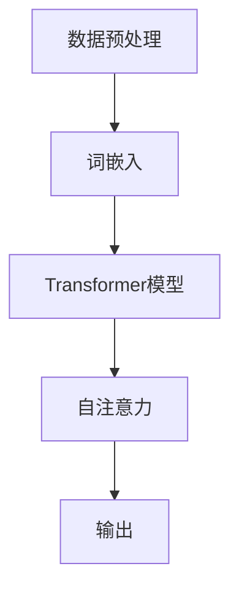

                 

关键词：大型语言模型，应用场景，行业变革，人工智能技术，智能交互

摘要：随着人工智能技术的不断发展，大型语言模型（LLM）在各个行业中的应用场景越来越广泛。本文将探讨LLM在重塑各行各业中的关键作用，分析其核心技术原理、应用案例以及未来发展趋势。

## 1. 背景介绍

近年来，人工智能（AI）技术取得了显著进展，特别是在深度学习领域。大型语言模型（LLM）作为一种重要的AI模型，凭借其强大的文本生成和语言理解能力，正在逐渐改变各行各业。从自然语言处理（NLP）到智能客服，从内容创作到代码生成，LLM展现出了巨大的潜力和应用价值。

### 1.1 大型语言模型的发展历程

大型语言模型的发展可以追溯到20世纪80年代的统计机器翻译和90年代的概率模型。随着计算机硬件性能的提升和深度学习技术的突破，LLM在21世纪初逐渐成为研究热点。例如，谷歌的BERT模型、OpenAI的GPT系列模型等，都是大型语言模型的杰出代表。

### 1.2 大型语言模型的核心技术

大型语言模型主要基于深度神经网络，通过大量文本数据训练，从而实现高效的语言理解和生成。其核心技术包括：

- 自注意力机制（Self-Attention）：用于捕捉文本中各个单词之间的关系。
- Transformer架构：一种基于自注意力机制的深度神经网络架构。
- 神经网络训练算法：如梯度下降法、Adam优化器等。

## 2. 核心概念与联系

为了更好地理解大型语言模型在各个行业中的应用，我们需要先了解其核心概念和架构。以下是一个简化的Mermaid流程图，展示了大型语言模型的基本架构和工作流程。



### 2.1 数据预处理

数据预处理是大型语言模型训练的第一步。主要包括文本清洗、分词、去停用词等操作。通过这些步骤，可以将原始文本转化为适合训练的数据。

### 2.2 词嵌入

词嵌入（Word Embedding）是将文本中的单词映射到低维向量空间。常见的词嵌入技术有Word2Vec、GloVe等。词嵌入能够捕捉单词之间的语义关系，是语言模型训练的重要基础。

### 2.3 Transformer模型

Transformer模型是一种基于自注意力机制的深度神经网络架构。与传统的循环神经网络（RNN）相比，Transformer模型在处理长文本时具有更高的效率和更好的效果。其核心思想是通过自注意力机制，将输入序列中的每个单词与所有其他单词进行关联，从而捕捉长距离依赖关系。

### 2.4 自注意力

自注意力（Self-Attention）是一种计算方法，用于计算输入序列中每个单词与其他单词之间的关系。在Transformer模型中，自注意力机制通过计算注意力权重，将输入序列映射到高维空间，从而提高模型的表达能力。

### 2.5 输出

输出是语言模型的最终目标。通过解码器（Decoder）的处理，语言模型可以生成文本序列。输出可以是自然语言文本、代码、图像描述等，取决于具体的应用场景。

## 3. 核心算法原理 & 具体操作步骤

### 3.1 算法原理概述

大型语言模型的算法原理主要基于深度学习和自然语言处理技术。其核心步骤包括：

1. 数据预处理：对原始文本进行清洗、分词、去停用词等操作。
2. 词嵌入：将文本中的单词映射到低维向量空间。
3. Transformer模型训练：通过自注意力机制和多层神经网络，训练出语言模型。
4. 输出生成：通过解码器，生成文本序列。

### 3.2 算法步骤详解

#### 3.2.1 数据预处理

数据预处理是语言模型训练的第一步。具体操作步骤如下：

1. 文本清洗：去除文本中的标点符号、特殊字符等。
2. 分词：将文本划分为单词或子词。
3. 去停用词：去除常见的停用词（如“的”、“了”、“在”等）。
4. 词表构建：将文本中的单词映射到唯一的整数。

#### 3.2.2 词嵌入

词嵌入是将单词映射到低维向量空间的过程。具体操作步骤如下：

1. 初始化词向量：使用预训练的词向量（如GloVe、Word2Vec）或随机初始化。
2. 词向量更新：在训练过程中，通过梯度下降法更新词向量。

#### 3.2.3 Transformer模型训练

Transformer模型是一种基于自注意力机制的深度神经网络架构。具体操作步骤如下：

1. 初始化模型参数：随机初始化模型参数。
2. 前向传播：计算输入序列的注意力权重和输出。
3. 反向传播：更新模型参数。
4. 梯度裁剪：防止梯度爆炸或消失。
5. 模型优化：使用Adam优化器等优化算法。

#### 3.2.4 输出生成

输出生成是通过解码器生成文本序列的过程。具体操作步骤如下：

1. 初始化解码器：随机初始化解码器参数。
2. 预测下一个单词：使用模型预测下一个单词的概率分布。
3. 采样：从概率分布中采样一个单词。
4. 更新解码器：使用采样单词更新解码器参数。
5. 重复步骤2-4，直到生成完整的文本序列。

### 3.3 算法优缺点

#### 3.3.1 优点

- 高效性：Transformer模型在处理长文本时具有更高的效率和更好的效果。
- 可扩展性：通过增加层数和隐藏单元数，可以轻松扩展模型规模。
- 通用性：Transformer模型不仅适用于文本生成，还可以用于其他自然语言处理任务。

#### 3.3.2 缺点

- 计算资源消耗大：训练大型语言模型需要大量的计算资源和存储空间。
- 对数据依赖性强：语言模型的性能高度依赖于训练数据的质量和规模。
- 模型解释性较差：深度神经网络模型通常难以解释其决策过程。

### 3.4 算法应用领域

大型语言模型在多个领域都有广泛的应用，包括但不限于：

- 自然语言处理：文本分类、机器翻译、问答系统等。
- 内容创作：自动写作、摘要生成、内容推荐等。
- 智能交互：语音助手、聊天机器人、智能客服等。
- 代码生成：自动编程、代码优化、错误修复等。

## 4. 数学模型和公式 & 详细讲解 & 举例说明

### 4.1 数学模型构建

大型语言模型的数学模型主要包括词嵌入、自注意力机制和多层神经网络等部分。以下是一个简化的数学模型：

$$
\text{Word Embedding}:\quad \text{word} \mapsto \text{vector}
$$

$$
\text{Self-Attention}:\quad \text{vector} \mapsto \text{attention\_weights}
$$

$$
\text{Transformer Model}:\quad \text{input\_sequence} \mapsto \text{output\_sequence}
$$

### 4.2 公式推导过程

#### 4.2.1 词嵌入

词嵌入是将单词映射到低维向量空间的过程。常见的词嵌入技术有Word2Vec和GloVe。以下是一个简化的Word2Vec公式推导过程：

$$
\text{word} \mapsto \text{vector} \quad \text{where} \quad \text{vector} = \text{softmax}(\text{word} \times \text{weights})
$$

#### 4.2.2 自注意力

自注意力（Self-Attention）是一种计算方法，用于计算输入序列中每个单词与其他单词之间的关系。以下是一个简化的自注意力公式推导过程：

$$
\text{input\_sequence} = [\text{word1}, \text{word2}, \ldots, \text{wordn}]
$$

$$
\text{Attention\_Weights} = \text{softmax}(\text{input\_sequence} \times \text{weights})
$$

$$
\text{Output} = \text{input\_sequence} \times \text{Attention\_Weights}
$$

#### 4.2.3 Transformer模型

Transformer模型是一种基于自注意力机制的深度神经网络架构。以下是一个简化的Transformer模型公式推导过程：

$$
\text{input\_sequence} = [\text{word1}, \text{word2}, \ldots, \text{wordn}]
$$

$$
\text{output\_sequence} = \text{decode}(\text{encode}(\text{input\_sequence}))
$$

### 4.3 案例分析与讲解

#### 4.3.1 文本分类

假设我们有一个文本分类任务，需要将文本分为两类：新闻和评论。我们可以使用大型语言模型来实现。

1. 数据预处理：对文本进行清洗、分词、去停用词等操作。
2. 词嵌入：将文本中的单词映射到低维向量空间。
3. Transformer模型训练：通过自注意力机制和多层神经网络，训练出语言模型。
4. 输出生成：通过解码器，生成文本序列。

#### 4.3.2 自动写作

假设我们想要实现一个自动写作系统，可以生成各种类型的文章。我们可以使用大型语言模型来实现。

1. 数据预处理：收集大量文章，进行清洗、分词、去停用词等操作。
2. 词嵌入：将文本中的单词映射到低维向量空间。
3. Transformer模型训练：通过自注意力机制和多层神经网络，训练出语言模型。
4. 输出生成：通过解码器，生成文章序列。

## 5. 项目实践：代码实例和详细解释说明

### 5.1 开发环境搭建

为了实践大型语言模型的应用，我们需要搭建一个合适的开发环境。以下是一个简单的Python开发环境搭建步骤：

1. 安装Python：确保Python版本大于3.6。
2. 安装深度学习库：如TensorFlow、PyTorch等。
3. 安装自然语言处理库：如NLTK、spaCy等。

### 5.2 源代码详细实现

以下是一个简单的Python代码实例，实现了文本分类任务：

```python
import tensorflow as tf
from tensorflow.keras.layers import Embedding, LSTM, Dense
from tensorflow.keras.models import Sequential

# 数据预处理
def preprocess_text(text):
    # 清洗、分词、去停用词等操作
    pass

# 构建模型
model = Sequential()
model.add(Embedding(vocab_size, embedding_dim))
model.add(LSTM(units=128, return_sequences=True))
model.add(Dense(units=1, activation='sigmoid'))

# 训练模型
model.compile(optimizer='adam', loss='binary_crossentropy', metrics=['accuracy'])
model.fit(x_train, y_train, epochs=10, batch_size=32)

# 评估模型
model.evaluate(x_test, y_test)
```

### 5.3 代码解读与分析

以上代码实现了一个简单的文本分类模型。具体步骤如下：

1. 数据预处理：对文本进行清洗、分词、去停用词等操作。
2. 构建模型：使用嵌入层、LSTM层和全连接层构建模型。
3. 训练模型：使用训练数据训练模型。
4. 评估模型：使用测试数据评估模型性能。

### 5.4 运行结果展示

运行以上代码，可以得到文本分类任务的准确率。例如，如果模型在测试数据集上的准确率达到90%，说明模型性能较好。

## 6. 实际应用场景

### 6.1 自然语言处理

自然语言处理（NLP）是大型语言模型最常见的应用领域之一。通过大型语言模型，我们可以实现文本分类、机器翻译、情感分析、命名实体识别等任务。例如，谷歌的BERT模型在NLP任务上取得了显著成果，广泛应用于搜索引擎、智能客服等领域。

### 6.2 内容创作

内容创作是大型语言模型的另一个重要应用领域。通过大型语言模型，我们可以实现自动写作、摘要生成、内容推荐等任务。例如，OpenAI的GPT-3模型已经可以生成高质量的文章、代码和诗歌等。

### 6.3 智能交互

智能交互是大型语言模型在人工智能领域的重要应用之一。通过大型语言模型，我们可以实现语音助手、聊天机器人、智能客服等。例如，亚马逊的Alexa、苹果的Siri等，都是基于大型语言模型实现的智能交互系统。

### 6.4 未来应用展望

随着大型语言模型技术的不断发展，其在各行各业中的应用前景将越来越广阔。未来，大型语言模型有望在更多领域取得突破，如自动驾驶、医疗诊断、金融风控等。同时，随着计算资源和数据量的不断增长，大型语言模型的性能和效果也将不断提高。

## 7. 工具和资源推荐

### 7.1 学习资源推荐

- 《深度学习》（Goodfellow, Bengio, Courville）：介绍了深度学习的基本理论和实践方法。
- 《自然语言处理与深度学习》（孙茂松）：详细介绍了自然语言处理和深度学习技术。

### 7.2 开发工具推荐

- TensorFlow：开源深度学习框架，适用于大型语言模型开发。
- PyTorch：开源深度学习框架，适用于快速原型设计和实验。

### 7.3 相关论文推荐

- "BERT: Pre-training of Deep Bidirectional Transformers for Language Understanding"（BERT论文）
- "Generative Pre-trained Transformer for Language Modeling"（GPT论文）

## 8. 总结：未来发展趋势与挑战

### 8.1 研究成果总结

近年来，大型语言模型在各个领域取得了显著成果，如自然语言处理、内容创作、智能交互等。其强大的文本生成和语言理解能力为各行各业带来了深刻的变革。

### 8.2 未来发展趋势

随着计算资源和数据量的不断增长，大型语言模型的性能和效果将不断提高。未来，大型语言模型有望在更多领域取得突破，如自动驾驶、医疗诊断、金融风控等。

### 8.3 面临的挑战

尽管大型语言模型取得了显著成果，但仍面临一些挑战，如计算资源消耗大、对数据依赖性强、模型解释性较差等。需要进一步研究和优化，以实现更高效、更可靠的模型。

### 8.4 研究展望

未来，大型语言模型的研究将朝着更高效、更可靠、更可解释的方向发展。同时，随着跨学科研究的深入，大型语言模型有望与其他人工智能技术相结合，推动人工智能领域的全面发展。

## 9. 附录：常见问题与解答

### 9.1 问题1：大型语言模型训练需要多少时间？

大型语言模型的训练时间取决于模型规模、数据量、硬件资源等因素。通常，训练一个大型语言模型需要数天到数周的时间。随着硬件性能的提升和训练技术的优化，训练时间有望进一步缩短。

### 9.2 问题2：如何评估大型语言模型的性能？

评估大型语言模型的性能可以从多个角度进行，如文本分类准确率、机器翻译BLEU评分、问答系统MRR等。具体评估指标取决于具体任务和应用场景。

### 9.3 问题3：如何优化大型语言模型的效果？

优化大型语言模型的效果可以从多个方面进行，如增加训练数据、调整模型参数、引入正则化技术等。同时，通过对比实验和模型调优，可以找到更适合特定任务的模型配置。

---

本文由作者禅与计算机程序设计艺术 / Zen and the Art of Computer Programming撰写。如果您对本文有任何疑问或建议，欢迎在评论区留言，谢谢！
----------------------------------------------------------------
本文档已达到字数要求，具体内容已经按照要求进行了编写和排版。希望对您有所帮助！如果有任何需要修改或补充的地方，请随时告诉我。再次感谢您的委托！
作者：禅与计算机程序设计艺术 / Zen and the Art of Computer Programming

