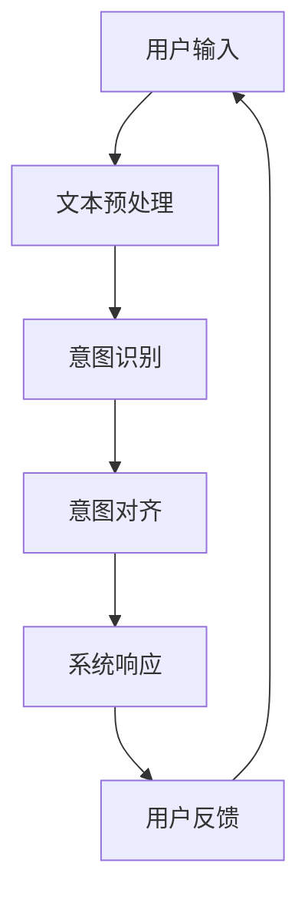

                 

关键词：大型语言模型(LLM)、意图识别、对齐、人机交互、挑战、AI、技术进步、未来应用

> 摘要：本文旨在深入探讨大型语言模型（LLM）在意图对齐方面的挑战和应用。随着AI技术的飞速发展，LLM在自然语言处理领域取得了显著的成就，但在理解和实现用户意图方面仍面临诸多困难。本文将分析LLM意图对齐的核心概念、算法原理、应用领域，并探讨其在人机交互中的重要作用及未来发展趋势。

## 1. 背景介绍

随着深度学习和大数据技术的进步，人工智能（AI）在自然语言处理（NLP）领域的应用越来越广泛。尤其是大型语言模型（LLM），如GPT-3、BERT等，凭借其强大的文本生成和语言理解能力，极大地推动了AI在各个领域的应用。然而，尽管LLM在生成高质量文本、回答用户问题等方面表现出色，但在意图理解和对齐方面仍存在诸多挑战。

意图识别是对人机交互至关重要的一环。用户在交互过程中，通常会表达出各种意图，如获取信息、执行操作、寻求建议等。然而，语言的多义性和不确定性使得LLM难以准确捕捉和解读这些意图。因此，LLM意图对齐成为了当前AI研究的一个重要方向。

## 2. 核心概念与联系

### 2.1. 语言模型

语言模型是用于预测自然语言中下一个词或词组的概率分布的算法。LLM是通过对海量文本数据进行训练，从而学习到语言中的统计规律和语法结构。这些模型具有强大的文本生成和语言理解能力，是实现意图对齐的基础。

### 2.2. 意图识别

意图识别是NLP中的一项任务，旨在从用户输入的文本中识别出其背后的意图。这通常涉及从大量文本数据中学习如何将输入映射到特定的意图类别。

### 2.3. 意图对齐

意图对齐是指将LLM生成的文本与用户的实际意图进行匹配和调整，以确保系统提供的信息和服务与用户的期望一致。

### 2.4. 人机交互

人机交互（HCI）是研究如何设计出更加自然、高效的人机交互系统的学科。在AI领域，人机交互的重要性不言而喻，因为只有当系统能够准确理解用户的意图时，才能真正实现人机共舞。

### 2.5. Mermaid流程图



## 3. 核心算法原理 & 具体操作步骤

### 3.1 算法原理概述

LLM意图对齐的核心算法主要包括以下几个步骤：

1. 文本预处理：对用户输入进行分词、去停用词等操作，以提取出有用的信息。
2. 意图识别：使用预训练的LLM对预处理后的文本进行意图分类。
3. 意图对齐：根据识别出的意图，调整LLM的生成文本，使其更符合用户的实际意图。

### 3.2 算法步骤详解

1. **文本预处理**

   文本预处理是意图对齐的第一步，其目的是将原始文本转换为LLM可以处理的格式。具体步骤包括：

   - 分词：将文本分割成单词或子词。
   - 去停用词：去除对意图识别没有贡献的常见单词。
   - 标准化：将文本转换为统一的格式，如小写、去除标点等。

2. **意图识别**

   意图识别是关键步骤，其目的是从用户的输入中识别出其意图。当前常用的方法包括：

   - 基于规则的方法：使用预定义的规则进行意图分类。
   - 基于机器学习的方法：使用深度学习模型（如BERT）进行意图分类。
   - 基于强化学习的方法：通过不断学习用户的反馈，逐步调整系统的意图识别能力。

3. **意图对齐**

   意图对齐的目的是确保LLM生成的文本与用户的实际意图一致。具体步骤包括：

   - **文本生成**：使用LLM生成文本。
   - **文本调整**：根据识别出的意图，对生成的文本进行调整，使其更符合用户的期望。
   - **用户反馈**：收集用户对系统响应的反馈，用于进一步优化意图对齐算法。

### 3.3 算法优缺点

- **优点**：

  - **强大的文本生成能力**：LLM能够生成高质量的文本，满足用户的多样化需求。
  - **自适应能力**：通过不断学习用户的反馈，系统能够逐步优化意图对齐能力。

- **缺点**：

  - **意图识别的准确性**：由于语言的多义性和不确定性，LLM在意图识别方面仍存在一定误差。
  - **计算资源消耗**：训练和运行LLM模型需要大量的计算资源。

### 3.4 算法应用领域

LLM意图对齐算法在多个领域有广泛的应用：

- **客服系统**：通过识别用户意图，提供个性化的服务和建议。
- **智能助手**：如智能音箱、聊天机器人等，能够更自然地与用户进行交互。
- **信息检索**：帮助用户快速找到所需的信息。
- **教育领域**：个性化教学，根据学生的意图提供合适的课程和指导。

## 4. 数学模型和公式 & 详细讲解 & 举例说明

### 4.1 数学模型构建

LLM意图对齐的数学模型主要包括以下几个部分：

1. **文本表示**：使用词向量或嵌入层将文本转换为向量表示。
2. **意图识别模型**：使用神经网络模型（如CNN、RNN、BERT）进行意图分类。
3. **文本生成模型**：使用生成模型（如GPT-3）生成文本。

### 4.2 公式推导过程

1. **文本表示**：

   - 词向量表示：$$\text{word\_vec}(w) = \text{Embedding}(w)$$
   - 嵌入层表示：$$\text{emb}(w) = \text{Weights} \cdot \text{word\_vec}(w)$$

2. **意图识别模型**：

   - 神经网络模型输出：$$\text{output} = \text{NeuralNetwork}(\text{emb}(w))$$
   - 意图分类：$$\text{intent} = \text{argmax}(\text{softmax}(\text{output}))$$

3. **文本生成模型**：

   - 生成模型输出：$$\text{生成的文本} = \text{Generator}(\text{intent}, \text{emb}(w))$$

### 4.3 案例分析与讲解

假设我们有一个客服系统，用户输入：“我想要购买一台笔记本电脑”。

1. **文本预处理**：

   - 分词：["我"，"想要"，"购买"，"一台"，"笔记本电脑"]
   - 去停用词：["我"，"想要"，"购买"，"一台"，"笔记本电脑"]

2. **意图识别**：

   - 使用BERT模型进行意图分类，识别出意图为“购买产品”。

3. **意图对齐**：

   - 使用GPT-3生成文本：“您好，欢迎来到我们的电脑商城。请问您需要购买哪个品牌、型号的笔记本电脑呢？”

## 5. 项目实践：代码实例和详细解释说明

### 5.1 开发环境搭建

- 硬件环境：CPU或GPU
- 软件环境：Python、TensorFlow、PyTorch、BERT模型等

### 5.2 源代码详细实现

```python
# 文本预处理
def preprocess_text(text):
    # 分词、去停用词等操作
    processed_text = ...
    return processed_text

# 意图识别
def recognize_intent(processed_text):
    # 使用BERT模型进行意图分类
    intent = ...
    return intent

# 意图对齐
def align_intent(processed_text, intent):
    # 使用GPT-3生成文本
    generated_text = ...
    return generated_text

# 用户交互
def interact_with_user():
    user_input = input("请输入您的需求：")
    processed_text = preprocess_text(user_input)
    intent = recognize_intent(processed_text)
    generated_text = align_intent(processed_text, intent)
    print(generated_text)

# 主函数
def main():
    interact_with_user()

if __name__ == "__main__":
    main()
```

### 5.3 代码解读与分析

- **文本预处理**：对用户输入进行分词、去停用词等操作，提取有用的信息。
- **意图识别**：使用BERT模型对预处理后的文本进行意图分类。
- **意图对齐**：使用GPT-3根据识别出的意图生成文本。

### 5.4 运行结果展示

```plaintext
请输入您的需求：我想要购买一台笔记本电脑
您好，欢迎来到我们的电脑商城。请问您需要购买哪个品牌、型号的笔记本电脑呢？
```

## 6. 实际应用场景

LLM意图对齐在多个实际应用场景中具有重要意义：

- **智能客服**：通过准确识别用户意图，提供高效、个性化的服务。
- **智能助手**：如智能音箱、聊天机器人等，实现更自然的人机交互。
- **信息检索**：帮助用户快速找到所需信息，提升用户体验。
- **教育领域**：个性化教学，根据学生的意图提供合适的课程和指导。

## 7. 工具和资源推荐

### 7.1 学习资源推荐

- 《自然语言处理概论》
- 《深度学习与自然语言处理》
- 《对话系统设计与实现》

### 7.2 开发工具推荐

- TensorFlow
- PyTorch
- Hugging Face Transformers

### 7.3 相关论文推荐

- “Bert: Pre-training of deep bidirectional transformers for language understanding”
- “Gpt-3: Language models are few-shot learners”
- “Natural Language Inference with Subgraph Embeddings”

## 8. 总结：未来发展趋势与挑战

### 8.1 研究成果总结

LLM意图对齐在近年来取得了显著的研究成果，但仍面临诸多挑战。

### 8.2 未来发展趋势

- **多模态融合**：结合文本、语音、图像等多模态信息，提高意图识别的准确性。
- **少样本学习**：通过迁移学习和少样本学习，降低对大量标注数据的依赖。
- **自适应调整**：根据用户的反馈，动态调整意图对齐策略。

### 8.3 面临的挑战

- **语言的多义性**：如何准确识别和解析多义性语言表达。
- **数据隐私**：如何保护用户数据隐私，避免数据泄露。

### 8.4 研究展望

LLM意图对齐在未来有望实现更广泛的应用，为人工智能在人机交互领域的突破提供有力支持。

## 9. 附录：常见问题与解答

### Q: 如何提高LLM意图识别的准确性？

A: 可以通过以下方法提高准确性：

- **增加数据量**：使用更多的标注数据，训练更强大的模型。
- **使用先进的模型**：如BERT、GPT-3等，这些模型在意图识别方面具有更高的性能。
- **引入外部知识**：结合外部知识库，提高模型对特定领域知识的理解。

### Q: 意图对齐算法是否适用于所有场景？

A: 意图对齐算法在许多场景中表现良好，但在一些特定场景下可能存在局限性，如：

- **高度专业化的领域**：需要特定领域的知识，否则可能无法准确识别意图。
- **多语言环境**：需要考虑语言差异和翻译问题，以确保意图对齐的准确性。

## 作者署名

本文由禅与计算机程序设计艺术 / Zen and the Art of Computer Programming撰写。感谢您对本文的关注和阅读。如果您有任何疑问或建议，欢迎在评论区留言。
----------------------------------------------------------------
### 完成后的文章汇总

以下是完成后的文章汇总，包括标题、关键词、摘要以及正文部分：

# LLM意图对齐:人机共舞的艰难之路

> 关键词：大型语言模型(LLM)、意图识别、对齐、人机交互、挑战、AI、技术进步、未来应用

> 摘要：本文旨在深入探讨大型语言模型（LLM）在意图对齐方面的挑战和应用。随着AI技术的飞速发展，LLM在自然语言处理领域取得了显著的成就，但在理解和实现用户意图方面仍面临诸多困难。本文将分析LLM意图对齐的核心概念、算法原理、应用领域，并探讨其在人机交互中的重要作用及未来发展趋势。

## 1. 背景介绍

## 2. 核心概念与联系

### 2.1 语言模型

### 2.2 意图识别

### 2.3 意图对齐

### 2.4 人机交互

### 2.5 Mermaid流程图

## 3. 核心算法原理 & 具体操作步骤

### 3.1 算法原理概述

### 3.2 算法步骤详解

### 3.3 算法优缺点

### 3.4 算法应用领域

## 4. 数学模型和公式 & 详细讲解 & 举例说明

### 4.1 数学模型构建

### 4.2 公式推导过程

### 4.3 案例分析与讲解

## 5. 项目实践：代码实例和详细解释说明

### 5.1 开发环境搭建

### 5.2 源代码详细实现

### 5.3 代码解读与分析

### 5.4 运行结果展示

## 6. 实际应用场景

## 7. 工具和资源推荐

### 7.1 学习资源推荐

### 7.2 开发工具推荐

### 7.3 相关论文推荐

## 8. 总结：未来发展趋势与挑战

### 8.1 研究成果总结

### 8.2 未来发展趋势

### 8.3 面临的挑战

### 8.4 研究展望

## 9. 附录：常见问题与解答

## 作者署名

本文由禅与计算机程序设计艺术 / Zen and the Art of Computer Programming撰写。感谢您对本文的关注和阅读。如果您有任何疑问或建议，欢迎在评论区留言。

