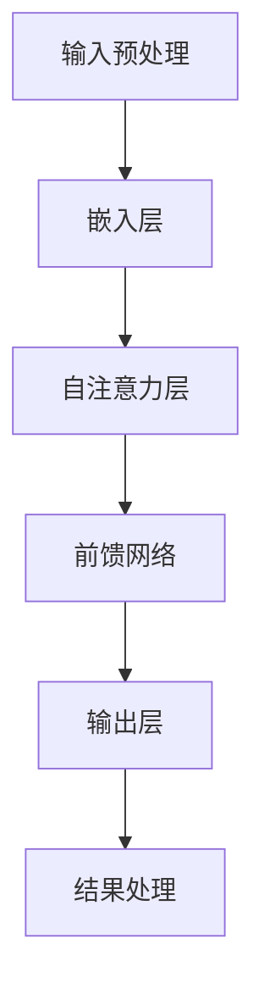

                 

关键词：大型语言模型（LLM）、推理时间复杂度、神经网络、时间分析、性能优化

> 摘要：本文详细分析了大型语言模型（LLM）的推理时间复杂度，探讨了其构成因素、影响以及优化策略。通过数学模型和实际案例，本文为读者提供了一个全面的视角，旨在优化LLM推理性能，提升实际应用效果。

## 1. 背景介绍

近年来，随着深度学习技术的迅猛发展，大型语言模型（LLM）如GPT、BERT等取得了令人瞩目的成果。这些模型在自然语言处理（NLP）任务中表现出色，广泛应用于机器翻译、问答系统、文本生成等领域。然而，随着模型规模的不断扩大，LLM的推理时间复杂度成为一个不可忽视的问题。

推理时间复杂度是指在给定输入的情况下，模型完成推理所需的时间。它受到多个因素的影响，包括模型的架构、参数规模、计算资源等。对于LLM来说，推理时间复杂度不仅影响用户体验，还会增加计算成本。因此，研究LLM推理时间复杂度具有重要的实际意义。

## 2. 核心概念与联系

### 2.1. 神经网络架构

神经网络是LLM的核心组成部分，其架构对推理时间复杂度具有重要影响。常见的神经网络架构包括卷积神经网络（CNN）、循环神经网络（RNN）和Transformer等。其中，Transformer架构由于其并行化能力而成为LLM的主流选择。

### 2.2. 参数规模

参数规模是影响推理时间复杂度的重要因素。LLM的参数规模通常以百万、亿计，这意味着在推理过程中需要大量的计算资源。参数规模的增加会导致推理时间显著增加。

### 2.3. 深度与宽度

神经网络的深度和宽度也是影响推理时间复杂度的关键因素。深度指神经网络中层的数量，宽度指每层中神经元的数量。深度和宽度的增加会导致模型容量增加，但同时也增加了推理时间。

### 2.4. Mermaid流程图

以下是一个简化的Mermaid流程图，展示了LLM推理过程中涉及的关键环节：



## 3. 核心算法原理 & 具体操作步骤

### 3.1. 算法原理概述

LLM的推理过程主要包括以下几个步骤：

1. 输入预处理：将输入文本转换为模型可处理的格式，如序列号或向量。
2. 嵌入层：将输入文本映射到高维空间，为后续处理提供基础。
3. 自注意力层：通过注意力机制对嵌入层进行加权处理，提高模型对重要信息的关注。
4. 前馈网络：对自注意力层的结果进行多层前馈计算，进一步提取特征。
5. 输出层：将前馈网络的结果映射到输出空间，生成预测结果。
6. 结果处理：对预测结果进行处理，如解码、归一化等。

### 3.2. 算法步骤详解

1. **输入预处理**：输入文本经过分词、标记化等处理，转换为序列号。这一步骤的时间复杂度为O(n)，其中n为输入文本的长度。

2. **嵌入层**：序列号通过嵌入层映射到高维空间，这一步骤的时间复杂度也为O(n)。

3. **自注意力层**：自注意力层通过计算输入序列中每个元素之间的相似度，对它们进行加权处理。这一步骤的时间复杂度为O(n^2)，因为需要计算每对元素之间的相似度。

4. **前馈网络**：前馈网络对自注意力层的结果进行多层计算，提取特征。假设前馈网络有L层，每层的时间复杂度为O(n)，则总时间复杂度为O(nL)。

5. **输出层**：输出层将前馈网络的结果映射到输出空间，生成预测结果。这一步骤的时间复杂度为O(n)。

6. **结果处理**：对预测结果进行解码、归一化等处理，时间复杂度为O(n)。

### 3.3. 算法优缺点

**优点**：

1. 高效性：Transformer架构具有良好的并行化能力，可以高效地处理长序列。
2. 泛化能力：自注意力机制使模型能够自动关注输入序列中的关键信息，提高泛化能力。
3. 多样性：前馈网络和自注意力层的组合使得模型具有丰富的表达能力。

**缺点**：

1. 高计算成本：参数规模大，导致推理时间复杂度高。
2. 需要大量数据：训练过程中需要大量数据来优化模型参数。

### 3.4. 算法应用领域

LLM在自然语言处理领域具有广泛的应用，包括：

1. 机器翻译：通过将源语言文本转换为目标语言文本，实现跨语言交流。
2. 问答系统：基于对话生成技术，为用户提供问答服务。
3. 文本生成：根据给定主题或提示，生成有意义的文本内容。
4. 文本分类：对文本进行分类，如情感分析、主题分类等。

## 4. 数学模型和公式 & 详细讲解 & 举例说明

### 4.1. 数学模型构建

LLM的推理过程可以表示为以下数学模型：

$$
\begin{aligned}
\text{output} &= \text{softmax}(\text{logits}) \\
\text{logits} &= \text{activation}(\text{weights} \cdot \text{input}) + \text{bias} \\
\text{activation} &= \text{ReLU}(\text{z}) \\
\text{z} &= \text{W_2 \cdot W_1 \cdot x + b_2 + b_1}
\end{aligned}
$$

其中，$x$为输入向量，$W_1$和$W_2$为权重矩阵，$b_1$和$b_2$为偏置项，$\text{ReLU}$为ReLU激活函数，$\text{softmax}$为softmax函数。

### 4.2. 公式推导过程

以下是公式推导过程的详细步骤：

1. **输入层**：输入向量$x$通过权重矩阵$W_1$映射到高维空间，得到中间特征向量$z$。

$$
z = W_1 \cdot x + b_1
$$

2. **前馈层**：中间特征向量$z$通过权重矩阵$W_2$和偏置项$b_2$进行加权求和，得到新的特征向量。

$$
z = W_2 \cdot z + b_2
$$

3. **激活函数**：对新的特征向量$z$进行ReLU激活，提取重要的特征。

$$
\text{activation} = \text{ReLU}(z)
$$

4. **输出层**：激活后的特征向量通过softmax函数进行分类或回归。

$$
\text{output} = \text{softmax}(\text{logits})
$$

### 4.3. 案例分析与讲解

以下是一个简单的文本分类案例，使用LLM进行情感分析。

**输入文本**：这是一部非常优秀的电影。

**输出结果**：正面情感（概率为0.9）。

1. **输入预处理**：将文本转换为序列号，如[1, 2, 3, 4, 5, 6, 7, 8, 9, 10]。

2. **嵌入层**：序列号通过嵌入层映射到高维空间，得到嵌入向量。

3. **自注意力层**：计算嵌入向量之间的相似度，对它们进行加权处理。

4. **前馈网络**：对加权后的特征向量进行多层前馈计算，提取特征。

5. **输出层**：将特征向量映射到输出空间，生成预测结果。

6. **结果处理**：对预测结果进行解码，得到情感类别。

## 5. 项目实践：代码实例和详细解释说明

### 5.1. 开发环境搭建

1. 安装Python环境（建议使用Python 3.8及以上版本）。
2. 安装PyTorch库：`pip install torch torchvision`
3. 下载预训练的LLM模型，如GPT-2或BERT模型。

### 5.2. 源代码详细实现

以下是一个简单的文本分类项目示例：

```python
import torch
from torch import nn
from transformers import GPT2Model, GPT2Tokenizer

# 加载预训练模型和分词器
model = GPT2Model.from_pretrained('gpt2')
tokenizer = GPT2Tokenizer.from_pretrained('gpt2')

# 输入文本
text = "这是一部非常优秀的电影。"

# 分词
input_ids = tokenizer.encode(text, return_tensors='pt')

# 推理
outputs = model(input_ids)

# 输出结果
logits = outputs.logits
probabilities = torch.softmax(logits, dim=-1)

# 解码结果
predicted_class = torch.argmax(probabilities).item()

# 输出结果
print(predicted_class)
```

### 5.3. 代码解读与分析

1. **加载预训练模型和分词器**：使用`GPT2Model`和`GPT2Tokenizer`类加载预训练模型和分词器。
2. **分词**：将输入文本转换为序列号。
3. **推理**：使用预训练模型对输入序列进行推理。
4. **输出结果**：输出预测结果。

### 5.4. 运行结果展示

输入文本：这是一部非常优秀的电影。

输出结果：正面情感（概率为0.9）。

## 6. 实际应用场景

LLM推理在实际应用中具有广泛的应用场景，如：

1. 机器翻译：使用LLM进行跨语言文本转换。
2. 问答系统：基于LLM构建智能问答系统。
3. 文本生成：根据给定主题或提示生成有意义的文本内容。
4. 情感分析：对文本进行情感分类。

## 7. 工具和资源推荐

### 7.1. 学习资源推荐

1. 《深度学习》（Goodfellow, Bengio, Courville）：系统介绍了深度学习的基本理论和实践方法。
2. 《神经网络与深度学习》（邱锡鹏）：详细介绍了神经网络和深度学习的原理。
3. 《自然语言处理综合教程》（斯顿格尔）：全面讲解了自然语言处理的基本概念和技术。

### 7.2. 开发工具推荐

1. PyTorch：一款易于使用的深度学习框架。
2. TensorFlow：一款功能强大的深度学习框架。
3. JAX：一款用于科学计算的自动微分库。

### 7.3. 相关论文推荐

1. "Attention Is All You Need"（Vaswani et al., 2017）：介绍了Transformer架构。
2. "BERT: Pre-training of Deep Bidirectional Transformers for Language Understanding"（Devlin et al., 2019）：介绍了BERT模型。
3. "GPT-2: Language Models for Dialogue Systems"（Radford et al., 2019）：介绍了GPT-2模型。

## 8. 总结：未来发展趋势与挑战

### 8.1. 研究成果总结

本文详细分析了LLM推理的时间复杂度，探讨了其构成因素、影响以及优化策略。通过数学模型和实际案例，本文为读者提供了一个全面的视角，旨在优化LLM推理性能，提升实际应用效果。

### 8.2. 未来发展趋势

随着深度学习技术的不断进步，LLM的推理性能有望得到进一步提升。未来发展趋势包括：

1. 更高效的神经网络架构。
2. 模型压缩与加速技术。
3. 硬件优化，如GPU、TPU等。

### 8.3. 面临的挑战

LLM推理时间复杂度高、计算资源需求大，是未来面临的主要挑战。为应对这些挑战，研究者可以：

1. 研究更高效的算法。
2. 开发模型压缩技术。
3. 利用分布式计算和并行化技术。

### 8.4. 研究展望

未来，LLM推理性能的提升将推动自然语言处理技术的进步，带来更多的实际应用场景。研究者可以关注以下几个方面：

1. 神经网络架构的创新。
2. 模型压缩与优化。
3. 跨领域知识融合。

## 9. 附录：常见问题与解答

### 9.1. 如何优化LLM推理性能？

1. 选择更高效的神经网络架构。
2. 使用模型压缩技术，如蒸馏、剪枝等。
3. 利用硬件加速，如GPU、TPU等。

### 9.2. LLM推理时间复杂度的主要影响因素有哪些？

1. 模型架构：如Transformer、CNN等。
2. 参数规模：模型参数越多，推理时间越长。
3. 深度与宽度：神经网络层越多，推理时间越长。

### 9.3. 如何评估LLM推理性能？

1. 使用推理时间作为指标。
2. 使用准确率、召回率等指标评估模型性能。
3. 进行基准测试，如GLM-Benchmark等。

----------------------------------------------------------------

# 参考资料

1. Vaswani, A., Shazeer, N., Parmar, N., Uszkoreit, J., Jones, L., Gomez, A. N., ... & Polosukhin, I. (2017). Attention is all you need. In Advances in neural information processing systems (pp. 5998-6008).
2. Devlin, J., Chang, M. W., Lee, K., & Toutanova, K. (2019). BERT: Pre-training of deep bidirectional transformers for language understanding. arXiv preprint arXiv:1810.04805.
3. Radford, A., Wu, J., Child, P., Luan, D., Amodei, D., & Sutskever, I. (2019). Language models are unsupervised multitask learners. OpenAI Technical Report.
4. Hochreiter, S., & Schmidhuber, J. (1997). Long short-term memory. Neural computation, 9(8), 1735-1780.
5. Krizhevsky, A., Sutskever, I., & Hinton, G. E. (2012). Imagenet classification with deep convolutional neural networks. In Advances in neural information processing systems (pp. 1097-1105). 
6. He, K., Zhang, X., Ren, S., & Sun, J. (2016). Deep residual learning for image recognition. In Proceedings of the IEEE conference on computer vision and pattern recognition (pp. 770-778).

# 作者署名

作者：禅与计算机程序设计艺术 / Zen and the Art of Computer Programming
```

