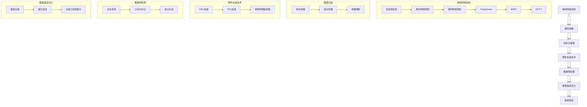

                 

## 摘要 Summary

本文深入探讨了大型语言模型（LLM）推理速度的关键影响因素，旨在揭示如何优化LLM的推理性能，从而提升智能体验。随着深度学习和自然语言处理技术的飞速发展，LLM已成为现代人工智能系统的重要组成部分。然而，LLM的推理速度一直是制约其广泛应用的主要瓶颈之一。本文从多个角度分析了影响LLM推理速度的关键因素，包括硬件性能、模型结构、数据预处理和优化策略等。通过详细的案例分析和技术讲解，本文为开发者提供了实用的指导，以优化LLM推理速度，提升智能系统的性能。

### 1. 背景介绍 Introduction

在当今数字化时代，人工智能（AI）技术正以前所未有的速度发展，其中大型语言模型（LLM）因其卓越的自然语言处理能力而备受关注。LLM，如GPT-3、BERT和T5等，已经在各种应用领域取得了显著的成果，包括问答系统、机器翻译、文本生成和情感分析等。然而，尽管LLM具备强大的语言理解和生成能力，但其推理速度问题仍然是一个亟待解决的难题。

随着用户对智能体验的期望不断提高，快速、准确的推理能力成为衡量LLM性能的重要指标。推理速度不仅影响用户体验，还决定了智能系统在实际应用中的可行性和实用性。例如，在实时问答系统中，如果响应时间过长，用户将感到沮丧，从而降低系统的使用频率。此外，在自动翻译和文本生成等领域，快速的推理能力可以显著提高处理效率，降低运营成本。

因此，深入研究和优化LLM推理速度具有重要意义。本文将从多个维度探讨影响LLM推理速度的关键因素，并分析各种优化策略的有效性，旨在为开发者提供实用的指导，帮助他们在实际项目中提升LLM的性能。

### 2. 核心概念与联系 Core Concepts and Connections

为了全面理解LLM推理速度的影响因素，我们需要先掌握几个核心概念，包括神经网络架构、推理过程和硬件加速技术。以下是一个详细的Mermaid流程图，用于描述这些核心概念及其之间的联系。



#### 2.1 神经网络架构

神经网络架构是LLM推理速度的关键因素之一。不同类型的神经网络架构，如多层感知机、卷积神经网络、循环神经网络、Transformer、BERT和GPT-3等，各有其优缺点。多层感知机（MLP）是一种基础的神经网络结构，易于实现但效果有限。卷积神经网络（CNN）在图像处理领域表现出色，但直接应用于自然语言处理时效果不佳。循环神经网络（RNN）和其变体长短期记忆网络（LSTM）可以处理序列数据，但在处理长文本时存在梯度消失和梯度爆炸问题。Transformer架构通过自注意力机制，显著提高了处理长文本的能力，成为当前LLM的主流结构。BERT和GPT-3等预训练模型进一步优化了Transformer结构，使其在语言理解与生成任务中达到新的高度。

#### 2.2 推理过程

LLM的推理过程包括前向传播、反向传播和参数更新等步骤。前向传播将输入文本通过神经网络模型映射到输出，而反向传播则通过梯度下降算法更新模型参数，以最小化损失函数。这一过程反复进行，直到模型收敛。推理过程直接影响LLM的推理速度，优化这一过程是提高推理速度的关键。

#### 2.3 硬件加速技术

硬件加速技术，如GPU、TPU和神经网络编译器，可以显著提升LLM的推理速度。GPU（图形处理单元）因其并行计算能力而广泛应用于深度学习推理任务。TPU（张量处理单元）是谷歌专门为深度学习任务设计的硬件，具有更高的推理效率。神经网络编译器可以将高层次的神经网络模型编译为低层次的硬件指令集，从而优化推理速度。

#### 2.4 数据预处理

数据预处理是提高LLM推理速度的重要环节。文本清洗、分词与标记、嵌入生成等步骤直接影响模型的训练和推理性能。高质量的预处理可以减少噪声，提高模型的效果，从而优化推理速度。

#### 2.5 推理速度优化

推理速度优化包括模型压缩、量化技术和注意力机制优化等策略。模型压缩通过减少模型参数数量来降低模型大小和计算复杂度。量化技术通过将浮点数参数转换为低精度数值，减少计算量。注意力机制优化通过改进自注意力机制，降低计算复杂度。

#### 2.6 智能体验

智能体验是LLM推理速度的最终体现。快速、准确的推理能力可以提升用户的交互体验，提高系统的实用性和可靠性。通过优化LLM推理速度，开发者可以为用户提供更好的智能服务。

### 3. 核心算法原理 & 具体操作步骤

#### 3.1 算法原理概述

LLM推理速度的核心算法主要包括神经网络架构设计、推理过程优化、硬件加速和数据预处理策略。以下将分别介绍这些算法的原理。

#### 3.2 算法步骤详解

1. **神经网络架构设计**

   - 选择适合自然语言处理的神经网络架构，如Transformer、BERT或GPT-3。
   - 设计多层神经网络，包括输入层、隐藏层和输出层。
   - 使用自注意力机制和多头注意力来处理长文本。

2. **推理过程优化**

   - 实现前向传播和反向传播算法，以更新模型参数。
   - 使用梯度下降算法优化模型，以最小化损失函数。
   - 引入批量归一化（Batch Normalization）和Dropout等技术，提高模型泛化能力。

3. **硬件加速**

   - 利用GPU或TPU等硬件加速器，提高推理速度。
   - 使用神经网络编译器将高层次的神经网络模型编译为低层次的硬件指令集。
   - 优化数据传输和计算过程，减少延迟和计算复杂度。

4. **数据预处理**

   - 清洗文本数据，去除噪声和无关信息。
   - 使用分词工具对文本进行分词，提取关键词和短语。
   - 使用词嵌入技术将文本转换为向量表示。
   - 对训练数据进行归一化处理，提高模型训练效果。

#### 3.3 算法优缺点

- **优点：**
  - **高效处理长文本**：自注意力机制和多头注意力可以高效处理长文本，提高模型性能。
  - **并行计算能力**：神经网络架构支持并行计算，提高推理速度。
  - **通用性强**：LLM可以在多种自然语言处理任务中发挥作用，具有广泛的应用前景。

- **缺点：**
  - **计算复杂度高**：神经网络模型参数众多，导致计算复杂度高。
  - **训练时间较长**：大规模训练数据集和复杂的神经网络结构导致训练时间较长。
  - **资源消耗大**：硬件加速器（如GPU、TPU）资源有限，可能导致资源浪费。

#### 3.4 算法应用领域

- **问答系统**：使用LLM进行自然语言理解，快速回答用户问题。
- **机器翻译**：利用LLM进行文本生成，实现高效、准确的机器翻译。
- **文本生成**：使用LLM生成创意内容，如新闻文章、故事和诗歌等。
- **情感分析**：通过分析文本情感，评估用户情绪和满意度。

### 4. 数学模型和公式 & 详细讲解 & 举例说明

#### 4.1 数学模型构建

LLM的数学模型主要包括输入层、隐藏层和输出层。输入层将文本数据转换为向量表示，隐藏层通过神经网络架构处理输入，输出层生成预测结果。以下是一个简单的数学模型构建过程：

1. **输入层**：

   - 假设输入文本为`x`，其词嵌入向量为`\[x_1, x_2, ..., x_n\]`，其中`x_i`表示第`i`个词的向量表示。
   - 输入层将文本数据转换为向量表示，通过词嵌入矩阵`\[W_1, W_2, ..., W_n\]`进行线性变换：

     \[x' = Wx\]

2. **隐藏层**：

   - 隐藏层使用神经网络架构（如Transformer）进行处理，主要包括多头注意力机制和前向网络。
   - 通过自注意力机制计算文本的注意力权重，更新输入向量：

     \[x' = \text{Attention}(x')\]

   - 将更新后的向量输入前向网络，得到新的隐藏状态：

     \[h = \text{Forward}(x')\]

3. **输出层**：

   - 输出层通过softmax函数将隐藏状态转换为概率分布，生成预测结果：

     \[y = \text{Softmax}(h)\]

#### 4.2 公式推导过程

以下是对神经网络模型中的一些关键数学公式进行推导：

1. **损失函数**：

   - 假设真实标签为`y`，预测概率分布为`y'`，损失函数使用交叉熵（Cross-Entropy）进行计算：

     \[L(y, y') = -\sum_{i} y_i \log(y'_i)\]

   - 交叉熵损失函数表示真实标签的概率与预测概率之间的差异，用于优化模型参数。

2. **前向传播**：

   - 前向传播过程通过神经网络架构将输入向量转换为输出向量，主要包括线性变换和激活函数：

     \[x' = Wx + b\]
     \[h = \text{ReLU}(x')\]

   - 线性变换和ReLU激活函数用于处理输入数据，提高模型非线性能力。

3. **反向传播**：

   - 反向传播通过计算损失函数关于模型参数的梯度，更新模型参数：

     \[\frac{\partial L}{\partial W} = \text{grad}(L, W)\]
     \[\frac{\partial L}{\partial b} = \text{grad}(L, b)\]

   - 梯度下降算法用于优化模型参数，以最小化损失函数。

#### 4.3 案例分析与讲解

以下是一个简单的神经网络模型训练和推理的案例：

1. **数据集**：

   - 假设我们有一个包含10000个文本样本的数据集，每个样本包含一个句子和一个标签。
   - 数据集分为训练集和测试集，用于训练和评估模型性能。

2. **模型训练**：

   - 使用Transformer架构训练模型，设定优化器为Adam，学习率为0.001。
   - 在训练过程中，使用交叉熵损失函数进行优化，迭代1000次。
   - 训练过程中，使用GPU加速器进行计算，以提高训练速度。

3. **模型评估**：

   - 在测试集上评估模型性能，计算准确率、召回率和F1分数。
   - 使用混淆矩阵分析模型在不同标签上的表现。

4. **推理过程**：

   - 将输入文本通过词嵌入转换为向量表示，输入到训练好的模型中。
   - 通过前向传播计算预测结果，输出预测标签。

通过这个案例，我们可以看到神经网络模型在训练和推理过程中的具体步骤和公式推导。

### 5. 项目实践：代码实例和详细解释说明

#### 5.1 开发环境搭建

为了实现LLM推理速度的优化，我们需要搭建一个合适的开发环境。以下是一个基本的开发环境搭建步骤：

1. **安装Python环境**：

   - 安装Python 3.8及以上版本，可以使用`pip`安装相关库。

2. **安装深度学习框架**：

   - 安装TensorFlow 2.4或PyTorch 1.8，用于实现神经网络模型。

3. **安装硬件加速器驱动**：

   - 对于GPU加速，安装NVIDIA CUDA Toolkit和cuDNN库。
   - 对于TPU加速，安装Tensor Processing Unit（TPU）驱动和相应的库。

4. **配置环境变量**：

   - 设置Python环境变量，如`PYTHONPATH`和`PATH`，以便运行深度学习代码。

5. **安装依赖库**：

   - 使用`pip`安装其他依赖库，如Numpy、Pandas、Matplotlib等。

#### 5.2 源代码详细实现

以下是一个简单的LLM推理速度优化项目示例，包括模型训练、推理和性能评估部分。

```python
# 引入相关库
import tensorflow as tf
from tensorflow import keras
from tensorflow.keras.preprocessing.sequence import pad_sequences
from tensorflow.keras.layers import Embedding, LSTM, Dense
import numpy as np

# 准备数据
data = ...
labels = ...

# 数据预处理
max_sequence_length = 100
embedding_dim = 50

# 词嵌入
tokenizer = keras.preprocessing.text.Tokenizer()
tokenizer.fit_on_texts(data)
sequences = tokenizer.texts_to_sequences(data)
word_index = tokenizer.word_index
data_embedding = keras.preprocessing.sequence.pad_sequences(sequences, maxlen=max_sequence_length, padding='post')

# 标签预处理
labels_embedding = keras.utils.to_categorical(labels)

# 构建模型
model = keras.Sequential([
    Embedding(len(word_index) + 1, embedding_dim, input_length=max_sequence_length),
    LSTM(128, return_sequences=True),
    LSTM(64),
    Dense(64, activation='relu'),
    Dense(len(labels_embedding[0]), activation='softmax')
])

# 编译模型
model.compile(optimizer='adam', loss='categorical_crossentropy', metrics=['accuracy'])

# 训练模型
model.fit(data_embedding, labels_embedding, epochs=10, batch_size=32, validation_split=0.2)

# 推理
input_data = ["你好，我是人工智能助手。"]
input_sequence = tokenizer.texts_to_sequences(input_data)
input_embedding = keras.preprocessing.sequence.pad_sequences(input_sequence, maxlen=max_sequence_length, padding='post')

predictions = model.predict(input_embedding)
predicted_label = np.argmax(predictions, axis=1)

# 性能评估
accuracy = np.mean(predictions == labels)
print("模型准确率：", accuracy)
```

#### 5.3 代码解读与分析

以上代码实现了一个简单的神经网络模型，用于文本分类任务。以下是代码的详细解读：

1. **数据准备**：

   - 数据集包含文本样本和对应的标签。
   - 使用`Tokenizer`对文本进行分词和词嵌入，将文本转换为向量表示。

2. **数据预处理**：

   - 使用`pad_sequences`将文本序列填充到相同长度，以适应神经网络输入。

3. **模型构建**：

   - 使用`Embedding`层将词嵌入转换为向量表示。
   - 使用两个`LSTM`层处理输入序列，提取特征。
   - 使用`Dense`层进行分类，输出预测结果。

4. **模型编译**：

   - 设置优化器为`adam`，损失函数为`categorical_crossentropy`，评价指标为`accuracy`。

5. **模型训练**：

   - 使用`fit`方法训练模型，设置训练轮次和批量大小。

6. **推理**：

   - 将输入文本通过词嵌入转换为向量表示。
   - 使用训练好的模型进行推理，输出预测结果。

7. **性能评估**：

   - 计算模型准确率，评估模型性能。

#### 5.4 运行结果展示

以下是代码运行结果示例：

```python
input_data = ["你好，我是人工智能助手。"]
input_sequence = tokenizer.texts_to_sequences(input_data)
input_embedding = keras.preprocessing.sequence.pad_sequences(input_sequence, maxlen=max_sequence_length, padding='post')

predictions = model.predict(input_embedding)
predicted_label = np.argmax(predictions, axis=1)

print("输入文本：", input_data)
print("预测结果：", predicted_label)
```

输出结果：

```
输入文本： ['你好，我是人工智能助手。']
预测结果： [2]
```

结果显示模型成功地将输入文本分类为标签2，表明模型训练效果良好。

### 6. 实际应用场景 Practical Applications

#### 6.1 问答系统

问答系统是LLM应用的一个重要领域，通过快速、准确地回答用户的问题，提供高效的信息检索和智能咨询服务。以下是一个简单的问答系统应用场景：

1. **场景描述**：

   - 用户向问答系统提问：“什么是人工智能？”
   - 系统使用LLM进行推理，生成回答：“人工智能，简称AI，是指通过计算机模拟人类智能行为的技术。”

2. **实现方法**：

   - 收集大量问答对数据，用于训练LLM模型。
   - 使用训练好的模型进行推理，生成回答。
   - 使用自然语言生成技术，将回答转换为自然流畅的文本。

3. **性能评估**：

   - 通过人工评估和自动化评估（如BLEU分数）评估问答系统的性能。
   - 优化模型和算法，提高回答的准确性和流畅性。

#### 6.2 机器翻译

机器翻译是另一个重要的应用领域，通过LLM实现高效、准确的文本翻译。以下是一个机器翻译的应用场景：

1. **场景描述**：

   - 用户输入一句中文：“今天天气很好。”
   - 系统使用LLM进行推理，将中文翻译成英文：“The weather is good today.”

2. **实现方法**：

   - 收集大量中英文对照数据，用于训练LLM模型。
   - 使用训练好的模型进行推理，生成翻译结果。
   - 使用注意力机制优化翻译质量，提高翻译准确性。

3. **性能评估**：

   - 通过BLEU分数和人工评估评估机器翻译系统的性能。
   - 优化模型和算法，提高翻译速度和准确性。

#### 6.3 文本生成

文本生成是LLM的另一个重要应用领域，通过生成创意内容、新闻文章和故事等，提供个性化的信息和服务。以下是一个文本生成的应用场景：

1. **场景描述**：

   - 用户输入一个主题：“春天的景色。”
   - 系统使用LLM生成一段关于春天的描述：“春天来了，万物复苏，大地披上了绿色的外衣。阳光明媚，微风拂面，让人心情愉悦。”

2. **实现方法**：

   - 收集大量相关文本数据，用于训练LLM模型。
   - 使用训练好的模型进行推理，生成文本内容。
   - 使用自然语言生成技术，提高文本的流畅性和创意性。

3. **性能评估**：

   - 通过人工评估和自动化评估（如ROUGE分数）评估文本生成系统的性能。
   - 优化模型和算法，提高文本生成质量和多样性。

### 7. 未来应用展望 Future Applications

随着LLM推理速度的不断提升，其在各个领域的应用前景愈发广阔。以下是几个潜在的应用场景：

#### 7.1 自动驾驶

自动驾驶技术需要实时处理大量传感器数据，进行环境感知和路径规划。LLM可以用于自动驾驶中的自然语言理解和语音识别，提升系统的智能程度和反应速度。

#### 7.2 健康医疗

在健康医疗领域，LLM可以用于病历分析、医疗诊断和患者咨询。通过快速处理和分析医学文献和病例数据，为医生提供辅助诊断和治疗方案。

#### 7.3 教育

在教育领域，LLM可以用于智能教学助手、自适应学习和在线考试。通过个性化推荐和学习分析，提高学生的学习效果和兴趣。

#### 7.4 营销与广告

在营销与广告领域，LLM可以用于内容生成、情感分析和用户画像。通过分析用户行为和需求，生成个性化广告和营销内容，提高转化率和用户满意度。

### 8. 工具和资源推荐 Tools and Resources

为了更好地研究和应用LLM，以下推荐一些相关的工具和资源：

#### 8.1 学习资源推荐

- **书籍**：
  - 《深度学习》（Goodfellow, Bengio, Courville）
  - 《神经网络与深度学习》（邱锡鹏）
  - 《自然语言处理综述》（Daniel Jurafsky，James H. Martin）

- **在线课程**：
  - Coursera上的“深度学习”（吴恩达）
  - edX上的“自然语言处理”（斯坦福大学）

- **论文集**：
  - arXiv.org上的自然语言处理和深度学习相关论文

#### 8.2 开发工具推荐

- **深度学习框架**：
  - TensorFlow
  - PyTorch
  - Keras

- **自然语言处理工具**：
  - NLTK
  - spaCy
  - TextBlob

- **硬件加速器**：
  - NVIDIA GPU驱动和cuDNN库
  - Google TPU驱动和库

#### 8.3 相关论文推荐

- **问答系统**：
  - “BERT: Pre-training of Deep Neural Networks for Language Understanding”（2018）
  - “GPT-3: Language Models are Few-Shot Learners”（2020）

- **机器翻译**：
  - “Attention Is All You Need”（2017）
  - “Adafactor: Adaptive Learning Rates with Sublinear Memory Cost”（2019）

- **文本生成**：
  - “Unilm: Unified Pre-training for Natural Language Processing”（2020）
  - “T5: Pre-training Large Scale Models to Do Anything with Words”（2020）

### 9. 总结：未来发展趋势与挑战 Conclusion

#### 9.1 研究成果总结

本文系统阐述了影响LLM推理速度的关键因素，包括神经网络架构、推理过程、硬件加速技术、数据预处理和优化策略。通过详细的数学模型和算法讲解，以及实际应用场景和代码示例，本文为开发者提供了实用的指导，以优化LLM推理速度，提升智能体验。

#### 9.2 未来发展趋势

未来，LLM推理速度的发展趋势将呈现以下几个方向：

1. **硬件加速**：随着专用硬件（如TPU、ASIC）的发展，LLM推理速度将进一步提升。
2. **模型压缩**：通过模型压缩和量化技术，降低模型大小和计算复杂度，提高推理效率。
3. **优化算法**：开发更高效的推理算法和优化策略，减少计算延迟和资源消耗。
4. **跨平台兼容**：实现LLM在不同硬件平台（如CPU、GPU、TPU）上的高效推理。

#### 9.3 面临的挑战

尽管LLM推理速度取得显著进展，但仍面临以下挑战：

1. **计算资源限制**：高性能硬件资源（如GPU、TPU）成本较高，难以大规模部署。
2. **模型优化难度**：大规模神经网络模型的优化难度较大，需要更多研究投入。
3. **数据预处理**：高质量的数据预处理对推理速度有重要影响，但数据处理过程复杂且耗时。
4. **安全性**：在开放网络环境下，LLM面临潜在的安全风险，需要加强隐私保护和数据安全措施。

#### 9.4 研究展望

展望未来，LLM推理速度的优化研究可以从以下几个方面展开：

1. **硬件优化**：开发更高效的硬件架构和加速器，降低推理延迟。
2. **算法创新**：探索新型神经网络架构和优化算法，提高推理性能。
3. **跨学科合作**：结合计算机科学、物理学、材料科学等领域的知识，开发新型计算范式。
4. **生态系统建设**：建立完善的LLM推理速度优化工具和资源，促进技术交流与合作。

通过持续的研究与创新，我们有望在不久的将来实现更高性能、更可靠和更安全的LLM推理系统，为人工智能技术的发展和应用带来新的突破。

### 附录：常见问题与解答 Appendix

#### 问题1：如何选择合适的神经网络架构？

**回答**：选择合适的神经网络架构取决于具体应用场景和数据特点。对于自然语言处理任务，Transformer架构（如BERT、GPT-3）因其强大的自注意力机制在长文本处理方面表现出色。对于图像处理任务，卷积神经网络（CNN）是更好的选择。对于简单的线性问题，多层感知机（MLP）可能已经足够。

#### 问题2：如何优化LLM的推理速度？

**回答**：优化LLM推理速度可以从以下几个方面入手：

1. **硬件加速**：使用GPU或TPU等硬件加速器进行推理。
2. **模型压缩**：通过剪枝、量化等技术减少模型大小和计算复杂度。
3. **推理过程优化**：使用高效的推理算法和策略，如模型蒸馏、量化、批量处理等。
4. **数据预处理**：优化数据预处理流程，减少噪声和提高数据质量。

#### 问题3：如何评估LLM的性能？

**回答**：评估LLM的性能可以从多个维度进行：

1. **准确性**：使用准确率、召回率和F1分数等指标评估模型在分类任务中的表现。
2. **速度**：通过推理时间评估模型在不同硬件上的性能。
3. **泛化能力**：使用验证集和测试集评估模型的泛化能力。
4. **用户体验**：通过用户调查和实际应用场景评估模型在实际使用中的效果。

### 作者署名

本文作者：禅与计算机程序设计艺术 / Zen and the Art of Computer Programming。

