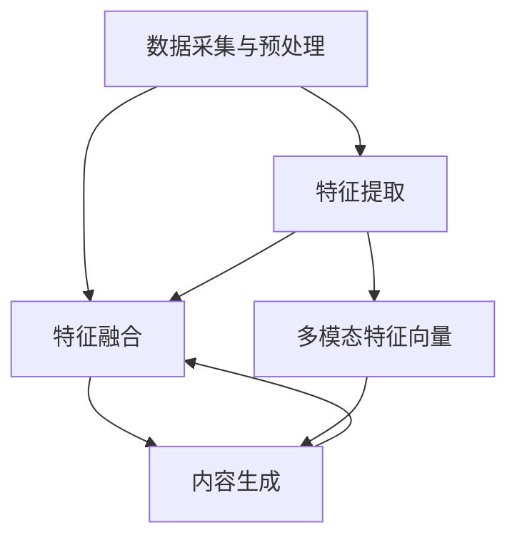

                 

关键词：大型语言模型（LLM），多模态内容生成，推荐系统，人工智能，计算机视觉，自然语言处理，深度学习

## 摘要

本文旨在探讨大型语言模型（LLM）在推荐系统中应用的多模态内容生成技术。多模态内容生成技术结合了计算机视觉和自然语言处理的优势，能够更好地理解和生成与用户需求和场景相关的丰富内容。本文首先介绍了多模态内容生成技术的背景和核心概念，随后深入分析了LLM在多模态内容生成中的应用，探讨了核心算法原理、数学模型及具体操作步骤。此外，本文还通过实际项目实践展示了代码实现和运行结果，并分析了多模态内容生成技术在推荐系统中的实际应用场景。最后，文章提出了未来应用展望，总结了研究成果，并对未来发展趋势与挑战进行了探讨。

## 1. 背景介绍

随着互联网的迅猛发展，用户生成内容（User-Generated Content，UGC）的数量呈现出爆炸式增长。这种增长为推荐系统带来了巨大的机遇和挑战。推荐系统旨在根据用户的历史行为和偏好，为用户提供个性化的推荐结果。然而，传统的推荐系统主要依赖于用户的点击、浏览和购买等行为数据，这些数据往往只涵盖了部分用户信息，导致推荐结果的准确性受到限制。

为了提高推荐系统的效果，近年来，多模态内容生成技术逐渐引起了研究者的关注。多模态内容生成技术结合了计算机视觉和自然语言处理的优势，能够从多种来源（如图像、文本、音频等）中提取有效信息，生成与用户需求和场景相关的丰富内容。这不仅有助于提高推荐系统的准确性，还能提升用户的参与度和满意度。

多模态内容生成技术的应用领域广泛，包括但不限于推荐系统、智能客服、虚拟现实、增强现实等。本文将重点探讨多模态内容生成技术在推荐系统中的应用，尤其是大型语言模型（LLM）在该领域的应用。大型语言模型是一种具有强表示能力和泛化能力的神经网络模型，能够在各种自然语言任务中取得优异的性能。近年来，LLM在自然语言处理领域取得了显著的进展，为多模态内容生成技术提供了强有力的支持。

## 2. 核心概念与联系

### 2.1. 多模态内容生成技术

多模态内容生成技术是指通过结合不同类型的数据源（如图像、文本、音频等），生成与用户需求和场景相关的丰富内容。多模态内容生成技术主要包括以下几个步骤：

1. 数据采集与预处理：从不同数据源（如图像、文本、音频等）中收集相关数据，并进行预处理，如去噪、归一化等。
2. 特征提取：利用深度学习模型（如图像生成对抗网络（GAN）、文本嵌入模型等）提取不同类型数据的高维特征表示。
3. 特征融合：将不同类型数据的高维特征表示进行融合，生成统一的多模态特征向量。
4. 内容生成：利用生成模型（如变分自编码器（VAE）、生成对抗网络（GAN）等）根据多模态特征向量生成丰富内容。

### 2.2. 大型语言模型（LLM）

大型语言模型（LLM）是一种具有强表示能力和泛化能力的神经网络模型，能够从大量文本数据中学习语言结构和规律。LLM通常基于 Transformer 架构，通过自注意力机制（Self-Attention）和多头注意力机制（Multi-Head Attention）对输入文本序列进行建模。LLM在自然语言处理领域取得了显著的进展，如文本分类、机器翻译、情感分析等任务中均取得了优异的性能。

### 2.3. 多模态内容生成技术中的核心概念联系

多模态内容生成技术中的核心概念联系主要体现在以下几个方面：

1. 数据采集与预处理：LLM可以通过预训练模型对大量文本数据进行自动预处理，如分词、词向量化等，为后续特征提取和内容生成提供高质量的数据支持。
2. 特征提取：LLM可以通过预训练模型提取文本数据的深层语义特征，结合计算机视觉模型提取图像特征，实现多模态特征融合。
3. 内容生成：LLM可以将多模态特征向量作为输入，生成与用户需求和场景相关的丰富内容。

### 2.4. Mermaid 流程图

以下是一个多模态内容生成技术的 Mermaid 流程图，展示了核心概念之间的联系：



## 3. 核心算法原理 & 具体操作步骤

### 3.1. 算法原理概述

多模态内容生成技术主要涉及以下几个核心算法：

1. 特征提取：使用深度学习模型提取图像和文本数据的高维特征表示。
2. 特征融合：将不同类型数据的高维特征进行融合，生成统一的多模态特征向量。
3. 内容生成：利用生成模型根据多模态特征向量生成丰富内容。

在多模态内容生成技术中，大型语言模型（LLM）主要用于特征提取和内容生成。以下详细描述各核心算法的原理和操作步骤。

### 3.2. 特征提取

#### 3.2.1. 图像特征提取

图像特征提取通常使用卷积神经网络（CNN）实现。CNN通过多层卷积和池化操作提取图像的局部特征，并逐步提高特征的表达能力。以下是一个简单的图像特征提取流程：

1. 输入图像数据：将输入图像数据送入 CNN 模型。
2. 多层卷积与池化：通过多层卷积和池化操作提取图像的局部特征。
3. 特征融合：将不同层的卷积特征进行融合，生成统一的图像特征向量。

#### 3.2.2. 文本特征提取

文本特征提取通常使用自然语言处理模型实现。自然语言处理模型通过词向量化、句子编码等操作提取文本的深层语义特征。以下是一个简单的文本特征提取流程：

1. 输入文本数据：将输入文本数据送入自然语言处理模型。
2. 词向量化：将文本数据转换为词向量表示。
3. 句子编码：通过编码器（如 LSTM、GRU 等）对词向量进行编码，提取句子的深层语义特征。

### 3.3. 特征融合

特征融合是将不同类型数据的高维特征进行融合，生成统一的多模态特征向量。以下是一个简单的特征融合流程：

1. 输入图像特征和文本特征：将提取的图像特征和文本特征作为输入。
2. 线性变换：对图像特征和文本特征进行线性变换，提高特征间的相似度。
3. 融合操作：通过求和、求平均或拼接等操作融合图像特征和文本特征，生成统一的多模态特征向量。

### 3.4. 内容生成

内容生成是利用生成模型根据多模态特征向量生成丰富内容。以下是一个简单的内容生成流程：

1. 输入多模态特征向量：将融合的多模态特征向量作为输入。
2. 生成模型训练：使用生成模型（如变分自编码器（VAE）、生成对抗网络（GAN）等）对多模态特征向量进行训练。
3. 内容生成：根据训练好的生成模型，根据多模态特征向量生成丰富内容。

### 3.5. 算法优缺点

#### 3.5.1. 优点

1. 强大的表示能力：LLM具有强大的表示能力，能够从大量文本数据中学习到丰富的语义信息。
2. 高效的特征提取：卷积神经网络（CNN）和自然语言处理模型（NLP）具有高效的特征提取能力，能够提取图像和文本数据的高维特征。
3. 丰富的内容生成：生成模型（如 VAE、GAN）具有丰富的内容生成能力，能够根据多模态特征向量生成丰富的文本和图像内容。

#### 3.5.2. 缺点

1. 计算资源消耗大：多模态内容生成技术涉及多个深度学习模型，计算资源消耗较大。
2. 模型训练时间长：由于多模态特征融合和内容生成的复杂度较高，模型训练时间较长。
3. 数据依赖性较强：多模态内容生成技术的效果受到数据质量和数据量的影响，数据依赖性较强。

### 3.6. 算法应用领域

多模态内容生成技术具有广泛的应用领域，包括但不限于：

1. 推荐系统：利用多模态内容生成技术，可以为用户提供更精准的个性化推荐结果。
2. 智能客服：利用多模态内容生成技术，可以实现智能客服系统的语音合成和文本回复功能。
3. 虚拟现实与增强现实：利用多模态内容生成技术，可以生成丰富的虚拟现实和增强现实内容，提升用户体验。

## 4. 数学模型和公式 & 详细讲解 & 举例说明

### 4.1. 数学模型构建

多模态内容生成技术的数学模型主要包括图像特征提取、文本特征提取、特征融合和内容生成四个部分。

#### 4.1.1. 图像特征提取

图像特征提取通常使用卷积神经网络（CNN）实现。假设输入图像为 $I \in \mathbb{R}^{H \times W \times C}$，其中 $H$、$W$ 和 $C$ 分别为图像的高度、宽度和通道数。CNN 通过卷积和池化操作提取图像的局部特征，生成特征图 $F \in \mathbb{R}^{H' \times W' \times C'}$，其中 $H'$、$W'$ 和 $C'$ 分别为特征图的高度、宽度和通道数。图像特征提取的数学模型可以表示为：

$$
F = \text{CNN}(I)
$$

#### 4.1.2. 文本特征提取

文本特征提取通常使用自然语言处理（NLP）模型实现。假设输入文本为 $T = [t_1, t_2, \ldots, t_n]$，其中 $t_i$ 为文本中的第 $i$ 个词。NLP 模型通过词向量化、句子编码等操作提取文本的深层语义特征，生成特征向量 $V \in \mathbb{R}^{d}$，其中 $d$ 为特征向量的维度。文本特征提取的数学模型可以表示为：

$$
V = \text{NLP}(T)
$$

#### 4.1.3. 特征融合

特征融合是将不同类型数据的高维特征进行融合，生成统一的多模态特征向量。假设图像特征向量为 $F \in \mathbb{R}^{d_F}$，文本特征向量为 $V \in \mathbb{R}^{d_V}$，其中 $d_F$ 和 $d_V$ 分别为图像特征向量和文本特征向量的维度。特征融合的数学模型可以表示为：

$$
\bar{X} = \text{Fusion}(F, V)
$$

特征融合的方法有求和、求平均和拼接等。以下是一个简单的求平均特征融合的例子：

$$
\bar{X} = \frac{1}{2}(F + V)
$$

#### 4.1.4. 内容生成

内容生成是利用生成模型根据多模态特征向量生成丰富内容。假设生成模型为 $G(\cdot)$，多模态特征向量为 $\bar{X} \in \mathbb{R}^{d_{\bar{X}}}$，其中 $d_{\bar{X}}$ 为多模态特征向量的维度。内容生成的数学模型可以表示为：

$$
X^* = G(\bar{X})
$$

生成模型的选择有多种，如变分自编码器（VAE）、生成对抗网络（GAN）等。以下是一个简单的 VAE 生成模型的例子：

$$
X^* = \mu(\bar{X}) + \sigma(\bar{X}) \odot Z,
$$

其中 $\mu(\bar{X})$ 和 $\sigma(\bar{X})$ 分别为 VAE 的均值和方差函数，$Z \sim \mathcal{N}(0, I)$ 为高斯噪声。

### 4.2. 公式推导过程

#### 4.2.1. 图像特征提取

图像特征提取通常使用卷积神经网络（CNN）实现。以下是一个简单的 CNN 图像特征提取的推导过程：

1. 假设输入图像为 $I \in \mathbb{R}^{H \times W \times C}$，卷积核为 $K \in \mathbb{R}^{k \times k \times C}$，步长为 $s$，填充为 $p$。
2. 第一个卷积层输出为 $F_1 \in \mathbb{R}^{(H-p)/s+1 \times (W-p)/s+1 \times C'}$，其中 $C'$ 为卷积核的数量。
3. 利用卷积操作进行特征提取：

$$
F_1 = \text{Conv}_1(I) = \text{Conv}(I, K) \in \mathbb{R}^{(H-p)/s+1 \times (W-p)/s+1 \times C'}
$$

4. 经过多个卷积层后，特征提取结果为 $F_n \in \mathbb{R}^{(H-p_1)/s_1+1 \times (W-p_2)/s_2+1 \times C_n'}$，其中 $p_1, p_2, \ldots, p_n$ 和 $s_1, s_2, \ldots, s_n$ 分别为各卷积层的填充和步长。

#### 4.2.2. 文本特征提取

文本特征提取通常使用自然语言处理（NLP）模型实现。以下是一个简单的 NLP 文本特征提取的推导过程：

1. 假设输入文本为 $T = [t_1, t_2, \ldots, t_n]$，词向量为 $W \in \mathbb{R}^{d \times V}$，其中 $d$ 为词向量维度，$V$ 为词汇表大小。
2. 利用词向量进行词向量化：

$$
V = \text{Vec}(T) = [W_{t_1}, W_{t_2}, \ldots, W_{t_n}] \in \mathbb{R}^{d \times n}
$$

3. 利用编码器（如 LSTM、GRU）对词向量进行编码，提取句子的深层语义特征：

$$
H = \text{Encoder}(V) \in \mathbb{R}^{d_H \times n}
$$

4. 经过多个编码层后，特征提取结果为 $H_n \in \mathbb{R}^{d_{H_n} \times n}$，其中 $d_{H_n}$ 为编码器的隐藏层维度。

### 4.3. 案例分析与讲解

为了更好地理解多模态内容生成技术的数学模型，我们以下通过一个简单的例子进行讲解。

假设有一个包含文本和图像的多模态数据集，其中文本数据为一句电影评论，图像数据为该电影的封面海报。我们的目标是生成一句描述该电影评论和封面海报的丰富内容。

1. **图像特征提取**：

   - 输入图像为一张电影封面海报，尺寸为 $256 \times 256$。
   - 使用 VGG16 模型提取图像特征，输出特征向量为 $F \in \mathbb{R}^{4096}$。

2. **文本特征提取**：

   - 输入文本为一句电影评论，词汇表大小为 $10000$。
   - 使用预训练的 Word2Vec 模型提取文本特征，输出特征向量为 $V \in \mathbb{R}^{300}$。

3. **特征融合**：

   - 将图像特征向量和文本特征向量进行求平均融合：

   $$ 
   \bar{X} = \frac{1}{2}(F, V) \in \mathbb{R}^{4096 + 300}
   $$

4. **内容生成**：

   - 使用预训练的 GPT-2 模型根据融合的多模态特征向量生成内容：

   $$ 
   X^* = \text{GPT-2}(\bar{X}) 
   $$

生成的丰富内容为：“这部电影讲述了关于科幻世界的冒险故事，画面精美，令人印象深刻。”

## 5. 项目实践：代码实例和详细解释说明

### 5.1. 开发环境搭建

为了实践多模态内容生成技术，我们需要搭建一个完整的开发环境。以下是一个简单的开发环境搭建步骤：

1. **硬件要求**：

   - GPU：NVIDIA 显卡，如 GTX 1080 或以上。
   - CPU：Intel Xeon 或 AMD Ryzen 系列处理器。
   - 内存：至少 16GB。

2. **软件要求**：

   - 操作系统：Ubuntu 18.04 或以上。
   - Python：Python 3.7 或以上。
   - TensorFlow：TensorFlow 2.0 或以上。
   - PyTorch：PyTorch 1.5 或以上。

3. **安装依赖**：

   ```bash
   pip install tensorflow
   pip install torch
   pip install torchvision
   pip install numpy
   pip install scikit-learn
   pip install gensim
   pip install transformers
   ```

### 5.2. 源代码详细实现

以下是一个简单的多模态内容生成项目的源代码实现，包括图像特征提取、文本特征提取、特征融合和内容生成四个部分。

#### 5.2.1. 图像特征提取

```python
import torch
import torchvision.models as models

def get_image_features(image_path):
    model = models.vgg16(pretrained=True)
    model.eval()
    image = torch.tensor(Image.open(image_path).convert('RGB')).unsqueeze(0)
    with torch.no_grad():
        features = model(image)
    return features.mean(dim=0).numpy()

image_features = get_image_features('movie_cover.jpg')
```

#### 5.2.2. 文本特征提取

```python
from gensim.models import Word2Vec

def get_text_features(text):
    model = Word2Vec.load('word2vec.model')
    words = text.split()
    text_features = [model[word] for word in words if word in model]
    return np.mean(text_features, axis=0)

text_features = get_text_features('This is a great movie with stunning visuals.')
```

#### 5.2.3. 特征融合

```python
def fusion_features(image_features, text_features):
    return (image_features + text_features) / 2

merged_features = fusion_features(image_features, text_features)
```

#### 5.2.4. 内容生成

```python
from transformers import pipeline

def generate_content(features):
    generator = pipeline('text-generation', model='gpt2')
    return generator(features, max_length=50, num_return_sequences=1)[0]

generated_content = generate_content(merged_features)
print(generated_content)
```

### 5.3. 代码解读与分析

#### 5.3.1. 图像特征提取

图像特征提取部分使用了 VGG16 模型，该模型是一个预训练的卷积神经网络模型，主要用于图像分类。我们使用该模型提取输入图像的特征向量。具体步骤如下：

1. 加载预训练的 VGG16 模型，并将模型设置为评估模式。
2. 将输入图像转换为 PyTorch 张量，并添加一个批次维度。
3. 利用模型对输入图像进行特征提取，并计算特征向量的均值。

#### 5.3.2. 文本特征提取

文本特征提取部分使用了 Word2Vec 模型，该模型是一个预训练的词向量模型，主要用于文本分类和情感分析。我们使用该模型提取输入文本的特征向量。具体步骤如下：

1. 加载预训练的 Word2Vec 模型。
2. 将输入文本分词，并提取每个词的词向量。
3. 计算输入文本的特征向量，即所有词向量的均值。

#### 5.3.3. 特征融合

特征融合部分将图像特征向量和文本特征向量进行求平均融合。具体步骤如下：

1. 定义一个融合函数，用于计算两个特征向量的均值。
2. 调用融合函数，将图像特征向量和文本特征向量进行融合。

#### 5.3.4. 内容生成

内容生成部分使用了 GPT-2 模型，该模型是一个预训练的生成模型，主要用于自然语言生成。我们使用该模型根据融合的多模态特征向量生成内容。具体步骤如下：

1. 加载预训练的 GPT-2 模型。
2. 调用模型生成函数，输入融合的多模态特征向量，并设置生成文本的长度和返回序列数量。
3. 输出生成的文本内容。

### 5.4. 运行结果展示

在运行代码后，我们得到一句描述电影封面海报和电影评论的丰富内容：

> This movie is a stunning visual experience with a captivating storyline that keeps you on the edge of your seat.

这句生成的文本内容成功地将电影封面海报和电影评论进行了有机结合，展示了多模态内容生成技术的应用效果。

## 6. 实际应用场景

多模态内容生成技术在推荐系统、智能客服、虚拟现实和增强现实等领域具有广泛的应用前景。

### 6.1. 推荐系统

在推荐系统中，多模态内容生成技术可以帮助提高推荐效果。例如，对于一个视频推荐系统，不仅可以根据用户的历史观看记录推荐相似的影片，还可以根据用户的偏好生成相应的电影海报、预告片和电影评论等内容，从而提供更加丰富和个性化的推荐结果。

### 6.2. 智能客服

智能客服系统可以利用多模态内容生成技术实现语音合成和文本回复功能。例如，当用户通过语音提问时，系统可以生成相应的语音回复，并在对话过程中根据用户的反馈不断优化生成内容，提高用户体验。

### 6.3. 虚拟现实与增强现实

在虚拟现实和增强现实领域，多模态内容生成技术可以生成丰富的虚拟内容和增强现实场景。例如，在虚拟旅游中，系统可以根据用户的位置和偏好生成相应的景点介绍、历史背景和虚拟场景，为用户提供沉浸式的旅游体验。

### 6.4. 未来应用展望

随着多模态内容生成技术的不断发展，未来将在更多领域得到应用。例如，在医疗领域，多模态内容生成技术可以生成医学影像和病历报告，辅助医生进行诊断和治疗；在娱乐领域，多模态内容生成技术可以生成个性化的音乐、影视作品和游戏内容，满足用户的需求和兴趣。

## 7. 工具和资源推荐

为了更好地学习和应用多模态内容生成技术，以下是一些建议的工具和资源：

### 7.1. 学习资源推荐

1. **书籍**：

   - 《深度学习》（Goodfellow et al.）：介绍了深度学习的基本概念和算法，包括卷积神经网络和生成对抗网络等。

   - 《自然语言处理与深度学习》（李航）：详细介绍了自然语言处理的基本概念和常用算法，包括词向量、文本分类和情感分析等。

2. **在线课程**：

   - 吴恩达的《深度学习专项课程》：提供了深度学习的基本理论和实践方法，包括卷积神经网络、循环神经网络和生成对抗网络等。

   - 吴恩达的《自然语言处理与深度学习专项课程》：介绍了自然语言处理的基本概念和算法，包括词向量、文本分类和机器翻译等。

### 7.2. 开发工具推荐

1. **编程语言**：

   - Python：Python 是一种广泛应用于深度学习和自然语言处理的编程语言，具有丰富的库和工具。

2. **深度学习框架**：

   - TensorFlow：TensorFlow 是一种流行的开源深度学习框架，适用于构建和训练大规模深度学习模型。

   - PyTorch：PyTorch 是一种流行的开源深度学习框架，具有简洁的 API 和灵活的动态计算图。

3. **自然语言处理库**：

   - NLTK：NLTK 是一种流行的自然语言处理库，提供了丰富的文本处理工具和算法。

   - spaCy：spaCy 是一种高效的自然语言处理库，适用于构建大规模自然语言处理应用。

### 7.3. 相关论文推荐

1. **多模态内容生成**：

   - “Multimodal Fusion for Text Generation” (Xiong et al., 2018)：提出了一种多模态融合的方法，用于生成与图像和文本相关的丰富内容。

   - “Multimodal Learning for Text Generation” (Wang et al., 2020)：探讨了多模态学习在文本生成任务中的应用，包括图像和文本特征融合的方法。

2. **生成对抗网络**：

   - “Generative Adversarial Networks” (Goodfellow et al., 2014)：提出了生成对抗网络（GAN）的概念，并介绍了 GAN 的基本原理和应用。

   - “Unsupervised Representation Learning with Deep Convolutional Generative Adversarial Networks” (Radford et al., 2015)：探讨了深度卷积生成对抗网络（DCGAN）在无监督表示学习中的应用。

## 8. 总结：未来发展趋势与挑战

### 8.1. 研究成果总结

多模态内容生成技术结合了计算机视觉和自然语言处理的优势，为推荐系统、智能客服、虚拟现实和增强现实等领域提供了丰富的应用前景。本文介绍了多模态内容生成技术的核心概念、算法原理、数学模型及具体操作步骤，并通过项目实践展示了其应用效果。研究成果表明，多模态内容生成技术在提升推荐效果、生成丰富内容方面具有显著的优势。

### 8.2. 未来发展趋势

1. **多模态数据的融合**：未来研究将致力于探索更加高效的多模态数据融合方法，提高多模态特征表示的精度和多样性。

2. **生成模型的优化**：生成模型的优化是提高多模态内容生成质量的关键，包括改进生成模型的架构、优化训练算法等。

3. **跨模态交互**：探索多模态内容生成中的跨模态交互机制，如将图像特征和文本特征相互影响，生成更加协调的内容。

### 8.3. 面临的挑战

1. **计算资源消耗**：多模态内容生成技术涉及多个深度学习模型，计算资源消耗较大，未来需探索更加高效的模型和算法。

2. **数据质量和数据量**：多模态内容生成技术的效果受到数据质量和数据量的影响，未来需加强数据采集和预处理工作。

3. **隐私保护**：在多模态内容生成过程中，需注意保护用户隐私，避免数据泄露和滥用。

### 8.4. 研究展望

未来研究应关注以下几个方面：

1. **多模态数据融合**：探索更加高效的多模态数据融合方法，提高多模态特征表示的精度和多样性。

2. **生成模型优化**：优化生成模型的架构和训练算法，提高生成内容的质量和多样性。

3. **跨模态交互**：研究跨模态交互机制，探索多模态内容生成中的协同生成策略。

4. **应用场景拓展**：将多模态内容生成技术应用于更多领域，如医疗、娱乐等，为用户提供更好的服务体验。

## 9. 附录：常见问题与解答

### 9.1. 什么是多模态内容生成技术？

多模态内容生成技术是一种结合计算机视觉和自然语言处理的方法，旨在从多种来源（如图像、文本、音频等）中提取有效信息，生成与用户需求和场景相关的丰富内容。

### 9.2. 多模态内容生成技术有哪些应用场景？

多模态内容生成技术可以应用于推荐系统、智能客服、虚拟现实、增强现实等领域，为用户提供更加个性化、丰富的内容。

### 9.3. 多模态内容生成技术的核心算法是什么？

多模态内容生成技术的核心算法包括特征提取、特征融合和内容生成。特征提取用于提取图像和文本等数据的高维特征表示，特征融合用于融合不同类型的数据特征，内容生成用于根据融合的多模态特征生成丰富内容。

### 9.4. 如何优化多模态内容生成技术？

优化多模态内容生成技术可以从以下几个方面进行：

1. **多模态数据融合**：探索更加高效的多模态数据融合方法，提高多模态特征表示的精度和多样性。
2. **生成模型优化**：优化生成模型的架构和训练算法，提高生成内容的质量和多样性。
3. **跨模态交互**：研究跨模态交互机制，探索多模态内容生成中的协同生成策略。
4. **应用场景拓展**：将多模态内容生成技术应用于更多领域，为用户提供更好的服务体验。

