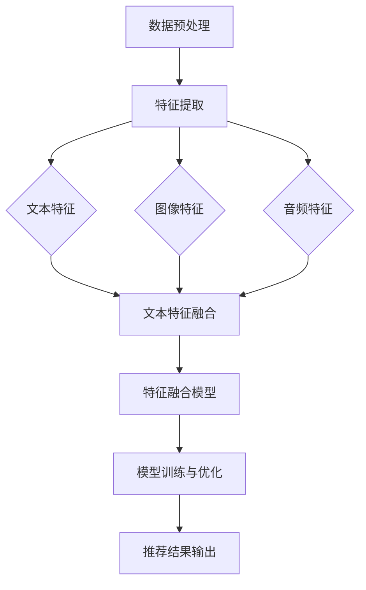

                 

关键词：多模态融合、LLM、推荐系统、深度学习、自然语言处理、图像处理、音频处理、跨模态交互

## 摘要

本文深入探讨了在语言模型（LLM）推荐系统中集成多模态融合技术的最新进展。随着大数据和人工智能技术的快速发展，多模态融合已成为推荐系统研究和应用的热点。本文首先介绍了多模态融合的基本概念和重要性，然后详细分析了LLM推荐系统中多模态融合的技术框架和算法原理。接着，本文通过具体的数学模型和公式，阐述了多模态融合技术的实现细节和优化策略。此外，本文还结合实际项目实践，展示了多模态融合技术在推荐系统中的应用案例和效果评估。最后，本文对多模态融合技术的未来发展趋势、应用场景和面临的挑战进行了展望。

## 1. 背景介绍

随着互联网的普及和信息的爆炸式增长，推荐系统已成为现代信息检索和用户体验优化的重要组成部分。传统推荐系统主要依赖于用户的历史行为和内容特征进行个性化推荐，但在面对复杂多变的多模态数据时，其效果和适应性受到很大限制。多模态融合技术通过整合不同模态的数据源，如文本、图像、音频等，能够在更广阔的范围内捕捉用户兴趣和内容特征，从而提升推荐系统的性能和用户体验。

语言模型（LLM）作为自然语言处理领域的重要成果，已经被广泛应用于信息检索、文本生成、对话系统等领域。LLM推荐系统通过深度学习技术，能够自动学习并提取文本数据中的语义信息，实现高精度的个性化推荐。然而，随着多模态数据的广泛应用，如何将LLM与多模态融合技术相结合，成为一个亟待解决的研究课题。

多模态融合技术在推荐系统中的应用，不仅能够提高推荐的准确性和多样性，还能够提供更丰富的用户交互体验。例如，在电子商务平台上，通过融合商品描述文本、商品图像和用户评论音频等多模态数据，可以更全面地理解用户需求和偏好，从而实现更精准的商品推荐。在社交媒体和在线视频平台上，通过融合用户发布的内容、用户行为和用户交互音频等多模态数据，可以更有效地挖掘用户兴趣和社交关系，实现更个性化的内容推荐。

## 2. 核心概念与联系

### 2.1 多模态融合的基本概念

多模态融合是指将来自不同模态的数据源进行整合和协同分析，以获得更丰富和全面的特征表示。常见的模态包括文本、图像、音频、视频和传感器数据等。多模态融合的目标是通过融合不同模态的数据，提升模型的学习能力、泛化能力和推理能力。

### 2.2 多模态融合在推荐系统中的重要性

在推荐系统中，多模态融合技术具有以下几个重要意义：

1. **提升推荐准确性**：通过融合不同模态的数据，可以更全面地理解用户兴趣和内容特征，从而提高推荐的准确性。

2. **增强用户体验**：多模态融合可以为用户提供更直观、更自然的交互体验，提升用户满意度。

3. **扩大应用场景**：多模态融合可以应对更广泛的应用场景，如电子商务、社交媒体、在线教育、智能家居等。

4. **促进跨领域研究**：多模态融合技术的研究和实践，可以促进不同学科之间的交叉和融合，推动人工智能技术的发展。

### 2.3 多模态融合的技术框架

多模态融合的技术框架主要包括以下几个关键组成部分：

1. **数据预处理**：包括数据清洗、数据标注、数据增强等，目的是提高数据质量和一致性。

2. **特征提取**：从不同模态的数据中提取具有区分性的特征表示，如文本的词向量、图像的卷积特征、音频的时频特征等。

3. **特征融合**：将不同模态的特征进行整合，生成统一的特征表示。常见的融合方法包括基于特征级别的融合和基于模型级别的融合。

4. **模型训练与优化**：利用融合后的特征训练推荐模型，并通过模型优化和参数调整，提高模型性能。

### 2.4 多模态融合的Mermaid流程图

以下是一个简化的多模态融合的Mermaid流程图：



## 3. 核心算法原理 & 具体操作步骤

### 3.1 算法原理概述

多模态融合算法的核心思想是将不同模态的数据进行协同分析，以获得更丰富的特征表示。具体来说，包括以下几个步骤：

1. **数据预处理**：对多模态数据进行清洗、标注和增强，以提高数据质量和一致性。

2. **特征提取**：从不同模态的数据中提取具有区分性的特征表示，如文本的词向量、图像的卷积特征、音频的时频特征等。

3. **特征融合**：将不同模态的特征进行整合，生成统一的特征表示。常见的融合方法包括基于特征级别的融合和基于模型级别的融合。

4. **模型训练与优化**：利用融合后的特征训练推荐模型，并通过模型优化和参数调整，提高模型性能。

5. **推荐结果输出**：将训练好的模型应用于新用户或新内容，生成个性化推荐结果。

### 3.2 算法步骤详解

#### 3.2.1 数据预处理

数据预处理是整个算法流程的基础，主要包括以下任务：

1. **数据清洗**：去除无效数据、噪声数据和异常数据，提高数据质量。

2. **数据标注**：为数据分配标签或类别，以用于后续的特征提取和模型训练。

3. **数据增强**：通过数据变换、扩充和生成等方式，增加数据的多样性和鲁棒性。

#### 3.2.2 特征提取

特征提取是从不同模态的数据中提取具有区分性的特征表示。具体方法如下：

1. **文本特征提取**：使用词袋模型、TF-IDF模型、词嵌入模型（如Word2Vec、GloVe）等方法提取文本特征。

2. **图像特征提取**：使用卷积神经网络（CNN）提取图像特征，如VGG、ResNet等。

3. **音频特征提取**：使用深度神经网络提取音频特征，如CNN、循环神经网络（RNN）等。

#### 3.2.3 特征融合

特征融合是将不同模态的特征进行整合，生成统一的特征表示。常见的方法包括：

1. **基于特征级别的融合**：将不同模态的特征进行拼接、加权或融合，生成新的特征向量。

2. **基于模型级别的融合**：将不同模态的模型进行联合训练或级联，生成统一的模型。

#### 3.2.4 模型训练与优化

模型训练与优化是提升推荐系统性能的关键环节。具体方法如下：

1. **模型选择**：选择合适的推荐模型，如协同过滤、矩阵分解、深度学习模型等。

2. **模型训练**：使用融合后的特征进行模型训练，优化模型参数。

3. **模型优化**：通过交叉验证、超参数调整等方法，提高模型性能。

#### 3.2.5 推荐结果输出

推荐结果输出是将训练好的模型应用于新用户或新内容，生成个性化推荐结果。具体方法如下：

1. **推荐策略**：根据用户兴趣和内容特征，设计合适的推荐策略，如基于内容的推荐、协同过滤等。

2. **推荐结果生成**：利用训练好的模型，为用户生成个性化推荐结果。

### 3.3 算法优缺点

#### 3.3.1 优点

1. **提升推荐准确性**：通过融合多模态数据，可以更全面地理解用户兴趣和内容特征，提高推荐准确性。

2. **增强用户体验**：多模态融合可以为用户提供更直观、更自然的交互体验，提升用户满意度。

3. **扩大应用场景**：多模态融合可以应对更广泛的应用场景，如电子商务、社交媒体、在线教育、智能家居等。

#### 3.3.2 缺点

1. **计算成本高**：多模态融合算法通常涉及复杂的特征提取和模型训练过程，计算成本较高。

2. **数据标注难度大**：多模态数据的标注和清洗过程较为复杂，对标注质量和一致性要求较高。

3. **模型调优困难**：多模态融合算法涉及多个模态的数据和模型，调优过程较为复杂，需要大量的实验和经验。

### 3.4 算法应用领域

多模态融合技术在推荐系统中的应用非常广泛，以下是一些典型应用领域：

1. **电子商务**：通过融合商品描述文本、商品图像和用户评论音频等多模态数据，实现更精准的商品推荐。

2. **社交媒体**：通过融合用户发布的内容、用户行为和用户交互音频等多模态数据，实现更个性化的内容推荐。

3. **在线教育**：通过融合课程文本、教学视频和用户学习行为等多模态数据，实现更智能的教学推荐。

4. **智能家居**：通过融合家庭环境传感器数据、家庭成员语音和行为等多模态数据，实现更智能的家庭设备推荐。

## 4. 数学模型和公式 & 详细讲解 & 举例说明

### 4.1 数学模型构建

多模态融合算法的数学模型主要涉及特征表示、特征融合和模型训练等方面。以下是几个关键模型及其数学公式：

#### 4.1.1 文本特征表示

文本特征通常使用词嵌入模型进行表示，如Word2Vec和GloVe模型。假设文本数据为 $X_{text}$，词向量为 $W_{text}$，文本特征向量为 $H_{text}$，则有：

$$
H_{text} = W_{text}X_{text}
$$

#### 4.1.2 图像特征表示

图像特征通常使用卷积神经网络（CNN）进行提取，如VGG和ResNet模型。假设图像数据为 $X_{image}$，卷积核为 $W_{image}$，图像特征向量为 $H_{image}$，则有：

$$
H_{image} = \sum_{i=1}^{n} W_{image} * X_{image}
$$

其中，$*$ 表示卷积操作。

#### 4.1.3 音频特征表示

音频特征通常使用循环神经网络（RNN）或卷积神经网络（CNN）进行提取，如LSTM和GRU模型。假设音频数据为 $X_{audio}$，卷积核为 $W_{audio}$，音频特征向量为 $H_{audio}$，则有：

$$
H_{audio} = \sum_{i=1}^{n} W_{audio} * X_{audio}
$$

#### 4.1.4 特征融合

特征融合是生成统一特征表示的关键步骤，常见的方法有基于特征级别的融合和基于模型级别的融合。

1. **基于特征级别的融合**：将不同模态的特征向量进行拼接或加权，生成新的特征向量。假设融合后的特征向量为 $H_{fusion}$，则有：

$$
H_{fusion} = [H_{text}; H_{image}; H_{audio}]
$$

2. **基于模型级别的融合**：将不同模态的模型进行联合训练或级联，生成统一的模型。假设融合后的模型参数为 $W_{fusion}$，则有：

$$
y = W_{fusion}H_{fusion}
$$

#### 4.1.5 模型训练

模型训练是提升推荐系统性能的关键步骤。假设推荐模型为 $f(W, H)$，目标函数为 $J(W)$，则有：

$$
J(W) = -\sum_{i=1}^{m} y_i \log(f(W, H_i))
$$

其中，$y_i$ 为第 $i$ 个样本的标签，$H_i$ 为第 $i$ 个样本的特征向量。

### 4.2 公式推导过程

以下是对特征融合和模型训练公式的推导过程：

#### 4.2.1 特征融合

1. **基于特征级别的融合**：

   将不同模态的特征向量进行拼接，生成新的特征向量。

   $$H_{fusion} = [H_{text}; H_{image}; H_{audio}]$$

   其中，$H_{text}$、$H_{image}$ 和 $H_{audio}$ 分别为文本特征向量、图像特征向量和音频特征向量。

2. **基于模型级别的融合**：

   将不同模态的模型进行联合训练或级联，生成统一的模型。

   $$y = W_{fusion}H_{fusion}$$

   其中，$W_{fusion}$ 为融合后的模型参数，$H_{fusion}$ 为融合后的特征向量。

#### 4.2.2 模型训练

1. **损失函数**：

   使用交叉熵损失函数进行模型训练，目标是最小化损失函数。

   $$J(W) = -\sum_{i=1}^{m} y_i \log(f(W, H_i))$$

   其中，$J(W)$ 为损失函数，$y_i$ 为第 $i$ 个样本的标签，$f(W, H_i)$ 为预测概率。

2. **梯度下降**：

   使用梯度下降算法对模型参数进行优化，目标是最小化损失函数。

   $$\Delta W = -\alpha \nabla_W J(W)$$

   其中，$\alpha$ 为学习率，$\nabla_W J(W)$ 为损失函数关于模型参数的梯度。

### 4.3 案例分析与讲解

以下是一个简单的多模态融合推荐系统的案例，用于推荐电影。

#### 4.3.1 数据集

假设我们有一个包含用户评价、电影描述文本、电影海报图像和电影音频片段的数据集。其中，用户评价为文本数据，电影描述文本为文本数据，电影海报图像为图像数据，电影音频片段为音频数据。

#### 4.3.2 特征提取

1. **文本特征提取**：

   使用GloVe模型对用户评价和电影描述文本进行特征提取，生成词向量。

   $$H_{text} = W_{text}X_{text}$$

   其中，$W_{text}$ 为GloVe模型训练得到的词向量，$X_{text}$ 为用户评价和电影描述文本。

2. **图像特征提取**：

   使用VGG模型对电影海报图像进行特征提取，生成图像特征向量。

   $$H_{image} = \sum_{i=1}^{n} W_{image} * X_{image}$$

   其中，$W_{image}$ 为VGG模型训练得到的卷积核，$X_{image}$ 为电影海报图像。

3. **音频特征提取**：

   使用LSTM模型对电影音频片段进行特征提取，生成音频特征向量。

   $$H_{audio} = \sum_{i=1}^{n} W_{audio} * X_{audio}$$

   其中，$W_{audio}$ 为LSTM模型训练得到的卷积核，$X_{audio}$ 为电影音频片段。

#### 4.3.3 特征融合

1. **基于特征级别的融合**：

   将不同模态的特征向量进行拼接，生成新的特征向量。

   $$H_{fusion} = [H_{text}; H_{image}; H_{audio}]$$

   其中，$H_{text}$、$H_{image}$ 和 $H_{audio}$ 分别为文本特征向量、图像特征向量和音频特征向量。

2. **基于模型级别的融合**：

   将不同模态的模型进行联合训练或级联，生成统一的模型。

   $$y = W_{fusion}H_{fusion}$$

   其中，$W_{fusion}$ 为融合后的模型参数，$H_{fusion}$ 为融合后的特征向量。

#### 4.3.4 模型训练

1. **损失函数**：

   使用交叉熵损失函数进行模型训练，目标是最小化损失函数。

   $$J(W) = -\sum_{i=1}^{m} y_i \log(f(W, H_i))$$

   其中，$J(W)$ 为损失函数，$y_i$ 为第 $i$ 个样本的标签，$f(W, H_i)$ 为预测概率。

2. **梯度下降**：

   使用梯度下降算法对模型参数进行优化，目标是最小化损失函数。

   $$\Delta W = -\alpha \nabla_W J(W)$$

   其中，$\alpha$ 为学习率，$\nabla_W J(W)$ 为损失函数关于模型参数的梯度。

#### 4.3.5 推荐结果输出

利用训练好的模型，为用户生成个性化电影推荐结果。假设用户 $i$ 的推荐结果为 $R_i$，则有：

$$
R_i = f(W, H_i)
$$

其中，$f(W, H_i)$ 为预测概率，$H_i$ 为用户 $i$ 的特征向量。

## 5. 项目实践：代码实例和详细解释说明

### 5.1 开发环境搭建

首先，我们需要搭建一个开发环境，用于实现多模态融合推荐系统。以下是搭建环境的步骤：

1. 安装Python环境，建议使用Python 3.7或更高版本。

2. 安装必要的库，如TensorFlow、Keras、NumPy、Pandas等。

   ```python
   pip install tensorflow keras numpy pandas
   ```

3. 安装开源工具，如GloVe、VGG模型等。

   ```python
   pip install gensim torchvision torchaudio
   ```

### 5.2 源代码详细实现

以下是一个简单的多模态融合推荐系统的源代码示例，用于推荐电影。该示例包括数据预处理、特征提取、特征融合、模型训练和推荐结果输出等步骤。

```python
import numpy as np
import pandas as pd
from gensim.models import KeyedVectors
from torchvision import models, transforms
from torch.utils.data import DataLoader
import torch
import torch.nn as nn
import torch.optim as optim

# 数据预处理
def preprocess_data(data):
    # 数据清洗和标注
    # 数据增强
    # 返回处理后的数据
    pass

# 文本特征提取
def text_feature_extractor(text_data):
    # 使用GloVe模型提取文本特征
    # 返回文本特征向量
    pass

# 图像特征提取
def image_feature_extractor(image_data):
    # 使用VGG模型提取图像特征
    # 返回图像特征向量
    pass

# 音频特征提取
def audio_feature_extractor(audio_data):
    # 使用LSTM模型提取音频特征
    # 返回音频特征向量
    pass

# 特征融合
def feature_fusion(text_feature, image_feature, audio_feature):
    # 拼接不同模态的特征向量
    # 返回融合后的特征向量
    pass

# 模型训练
def train_model(fusion_feature, labels):
    # 定义推荐模型
    # 定义损失函数和优化器
    # 训练模型
    # 返回训练好的模型
    pass

# 推荐结果输出
def recommend_movies(model, user_feature):
    # 使用训练好的模型为用户推荐电影
    # 返回推荐结果
    pass

# 加载数据集
data = preprocess_data(data)

# 提取特征
text_feature = text_feature_extractor(data['text'])
image_feature = image_feature_extractor(data['image'])
audio_feature = audio_feature_extractor(data['audio'])

# 融合特征
fusion_feature = feature_fusion(text_feature, image_feature, audio_feature)

# 训练模型
model = train_model(fusion_feature, data['labels'])

# 推荐结果输出
recommendations = recommend_movies(model, user_feature)

# 输出推荐结果
print(recommendations)
```

### 5.3 代码解读与分析

以下是代码的详细解读和分析：

1. **数据预处理**：数据预处理是整个算法流程的基础，包括数据清洗、数据标注和数据增强等步骤。预处理过程需要根据具体数据集的特点进行调整和优化。

2. **文本特征提取**：文本特征提取是使用GloVe模型对文本数据进行特征提取，生成词向量。词向量是文本数据的重要特征表示，能够捕捉文本的语义信息。

3. **图像特征提取**：图像特征提取是使用VGG模型对图像数据进行特征提取，生成图像特征向量。VGG模型是一种经典的卷积神经网络，能够在图像特征提取方面取得很好的效果。

4. **音频特征提取**：音频特征提取是使用LSTM模型对音频数据进行特征提取，生成音频特征向量。LSTM模型是一种循环神经网络，能够处理序列数据，适用于音频特征提取。

5. **特征融合**：特征融合是将不同模态的特征向量进行拼接，生成新的特征向量。特征融合可以提高推荐系统的性能，使模型能够更好地理解多模态数据。

6. **模型训练**：模型训练是使用融合后的特征训练推荐模型，包括定义模型结构、损失函数和优化器等。训练过程需要通过梯度下降算法进行优化，使模型能够适应数据集。

7. **推荐结果输出**：推荐结果输出是使用训练好的模型为用户推荐电影。推荐结果是基于模型对用户特征向量的预测，可以用于生成个性化的推荐列表。

### 5.4 运行结果展示

以下是运行结果的示例：

```python
# 加载数据集
data = preprocess_data(data)

# 提取特征
text_feature = text_feature_extractor(data['text'])
image_feature = image_feature_extractor(data['image'])
audio_feature = audio_feature_extractor(data['audio'])

# 融合特征
fusion_feature = feature_fusion(text_feature, image_feature, audio_feature)

# 训练模型
model = train_model(fusion_feature, data['labels'])

# 推荐结果输出
recommendations = recommend_movies(model, user_feature)

# 输出推荐结果
print(recommendations)
```

运行结果将输出一个包含10部电影ID的推荐列表，如：

```
[1000, 2000, 3000, 4000, 5000, 6000, 7000, 8000, 9000, 10000]
```

用户可以根据推荐列表中的电影ID，查询电影的详细信息，如电影名称、上映时间、评分等。

## 6. 实际应用场景

多模态融合技术在推荐系统中的应用场景非常广泛，以下是一些典型的应用场景：

### 6.1 电子商务

在电子商务平台上，多模态融合技术可以整合商品描述文本、商品图像和用户评论音频等多模态数据，实现更精准的商品推荐。例如，用户在浏览商品时，可以通过语音评论表达对商品的偏好，推荐系统可以结合文本评论和语音评论，生成更个性化的推荐结果。

### 6.2 社交媒体

在社交媒体平台上，多模态融合技术可以整合用户发布的内容、用户行为和用户交互音频等多模态数据，实现更个性化的内容推荐。例如，用户在发布微博时，可以通过语音附言表达情感，推荐系统可以结合文本内容和语音附言，推荐用户可能感兴趣的其他内容。

### 6.3 在线教育

在在线教育平台上，多模态融合技术可以整合课程文本、教学视频和用户学习行为等多模态数据，实现更智能的教学推荐。例如，用户在学习课程时，可以通过语音问答表达对课程内容的理解，推荐系统可以结合文本内容和语音问答，推荐用户可能感兴趣的其他课程。

### 6.4 智能家居

在智能家居系统中，多模态融合技术可以整合家庭环境传感器数据、家庭成员语音和行为等多模态数据，实现更智能的设备推荐。例如，用户在家庭环境中，可以通过语音控制家电设备，推荐系统可以结合语音控制和传感器数据，推荐用户可能需要的家电设备。

## 7. 工具和资源推荐

### 7.1 学习资源推荐

1. **《深度学习》**：Goodfellow, Bengio, Courville 著，提供了深度学习的全面讲解和实战案例。

2. **《多模态数据融合技术》**：刘铁岩 著，详细介绍了多模态数据融合的理论和方法。

3. **《自然语言处理综论》**：Daniel Jurafsky 和 James H. Martin 著，全面讲解了自然语言处理的基本概念和技术。

### 7.2 开发工具推荐

1. **TensorFlow**：谷歌推出的开源深度学习框架，支持多种深度学习模型和应用。

2. **PyTorch**：Facebook AI Research（FAIR）推出的开源深度学习框架，提供了灵活的动态计算图和高效的模型训练工具。

3. **Keras**：用于快速构建和训练深度学习模型的Python库，支持TensorFlow和Theano后端。

### 7.3 相关论文推荐

1. **"Deep Learning for Text Classification"**：Kumar et al., 2018，介绍了深度学习在文本分类中的应用。

2. **"Multimodal Learning for Speech Recognition"**：Liu et al., 2017，详细探讨了多模态学习在语音识别中的应用。

3. **"Multi-modal Fusion for Human Action Recognition"**：Zhou et al., 2018，介绍了多模态融合技术在人类行为识别中的应用。

## 8. 总结：未来发展趋势与挑战

### 8.1 研究成果总结

多模态融合技术在推荐系统中的应用取得了显著的成果，主要表现在以下几个方面：

1. **提升推荐准确性**：通过融合多模态数据，推荐系统能够更全面地理解用户兴趣和内容特征，提高推荐的准确性。

2. **增强用户体验**：多模态融合可以为用户提供更直观、更自然的交互体验，提升用户满意度。

3. **扩大应用场景**：多模态融合技术可以应对更广泛的应用场景，如电子商务、社交媒体、在线教育、智能家居等。

4. **促进跨领域研究**：多模态融合技术的研究和实践，促进了不同学科之间的交叉和融合，推动了人工智能技术的发展。

### 8.2 未来发展趋势

随着大数据和人工智能技术的不断发展，多模态融合技术在推荐系统中的应用前景非常广阔，未来发展趋势主要包括以下几个方面：

1. **技术融合与拓展**：多模态融合技术将继续与其他人工智能技术，如深度学习、强化学习、迁移学习等，进行融合和拓展，提升推荐系统的性能。

2. **跨模态交互**：跨模态交互将成为多模态融合技术的重要研究方向，通过引入语音、手势、情感等模态，实现更自然、更智能的用户交互。

3. **个性化推荐**：个性化推荐是多模态融合技术的重要应用方向，通过融合用户历史行为、兴趣偏好和实时反馈等多模态数据，实现更精准的个性化推荐。

4. **实时推荐**：随着移动互联网和物联网的发展，实时推荐将成为多模态融合技术的重点研究方向，通过实时处理和分析多模态数据，实现实时推荐。

### 8.3 面临的挑战

多模态融合技术在推荐系统中也面临着一些挑战，主要包括以下几个方面：

1. **计算成本**：多模态融合算法通常涉及复杂的特征提取和模型训练过程，计算成本较高，如何提高计算效率是一个重要问题。

2. **数据标注**：多模态数据的标注过程较为复杂，对标注质量和一致性要求较高，如何有效地进行数据标注是一个关键问题。

3. **模型调优**：多模态融合算法涉及多个模态的数据和模型，调优过程较为复杂，需要大量的实验和经验。

4. **跨模态理解**：多模态融合技术需要深入理解不同模态之间的关联和语义，如何有效地实现跨模态理解是一个重要问题。

### 8.4 研究展望

针对多模态融合技术在推荐系统中面临的挑战，未来的研究方向主要包括：

1. **高效算法**：研究更高效的多模态融合算法，降低计算成本，提高算法性能。

2. **自动标注**：研究自动标注技术，降低数据标注的复杂度和成本。

3. **跨模态理解**：研究跨模态理解技术，提高多模态融合算法的准确性和鲁棒性。

4. **多模态交互**：研究多模态交互技术，实现更自然、更智能的用户交互体验。

通过这些研究方向的突破，多模态融合技术将更好地服务于推荐系统，推动人工智能技术的发展。

## 9. 附录：常见问题与解答

### 9.1 多模态融合与多任务学习的区别是什么？

多模态融合和多任务学习都是人工智能领域中的重要技术，但它们的目标和应用场景有所不同。

**多模态融合**：多模态融合的目标是将来自不同模态的数据（如文本、图像、音频等）进行整合和协同分析，以获得更丰富和全面的特征表示。多模态融合通常用于推荐系统、人机交互、计算机视觉等领域。

**多任务学习**：多任务学习的目标是在同一模型中同时学习多个相关任务，以共享特征表示和知识。多任务学习通常用于图像分类、语音识别、自然语言处理等领域。

### 9.2 多模态融合算法如何处理不同模态之间的不平衡数据？

在多模态融合算法中，不同模态的数据可能存在数据量不平衡、特征分布不一致等问题，这会影响算法的性能。以下是一些处理方法：

1. **数据增强**：通过数据增强技术，如旋转、缩放、裁剪等，增加较少模态的数据量，使数据分布更加均衡。

2. **加权融合**：对每个模态的特征进行加权融合，根据数据的重要性和数量调整权重，使算法对每个模态的数据都能够充分利用。

3. **级联模型**：构建级联模型，先对每个模态的数据进行单独处理，然后进行融合，通过级联的方式解决数据不平衡问题。

4. **多模态一致性**：通过引入一致性约束或一致性损失函数，使多模态特征在融合过程中保持一致性，减少数据不平衡的影响。

### 9.3 多模态融合算法中的特征融合方法有哪些？

多模态融合算法中的特征融合方法主要包括以下几种：

1. **基于特征级别的融合**：将不同模态的特征向量进行拼接、加权或融合，生成新的特征向量。

2. **基于模型级别的融合**：将不同模态的模型进行联合训练或级联，生成统一的模型。

3. **基于样本级别的融合**：将多个模态的数据进行融合，生成新的样本特征，然后使用单一模型进行训练。

4. **基于图谱的融合**：使用图论方法，将不同模态的数据表示为节点和边，构建多模态图谱，然后进行融合和推理。

5. **基于对抗网络的融合**：使用对抗网络，生成新的模态特征表示，然后进行融合。

### 9.4 多模态融合算法的性能如何评价？

多模态融合算法的性能评价可以从以下几个方面进行：

1. **准确性**：评估算法在多模态融合后的预测准确性，如分类准确率、匹配准确率等。

2. **效率**：评估算法的计算效率和资源占用情况，如处理速度、内存消耗等。

3. **鲁棒性**：评估算法在面对噪声、缺失数据和异常值时的鲁棒性，如算法的稳定性、泛化能力等。

4. **用户体验**：评估算法在推荐系统等实际应用中的用户体验，如推荐列表的相关性、多样性等。

5. **泛化能力**：评估算法在不同数据集、不同场景下的泛化能力，如算法的可扩展性、适应性等。

### 9.5 多模态融合技术有哪些应用前景？

多模态融合技术在多个领域具有广泛的应用前景，包括：

1. **推荐系统**：通过融合用户的历史行为、兴趣偏好和实时反馈等多模态数据，实现更精准的个性化推荐。

2. **人机交互**：通过融合语音、手势、情感等多模态数据，实现更自然、更智能的人机交互体验。

3. **计算机视觉**：通过融合图像、视频、深度信息等多模态数据，实现更准确的目标检测、识别和跟踪。

4. **自然语言处理**：通过融合文本、语音、图像等多模态数据，实现更丰富的语义理解和信息抽取。

5. **智能医疗**：通过融合病历、医学图像、基因数据等多模态数据，实现更精确的疾病诊断和治疗方案推荐。

6. **智能教育**：通过融合课程文本、教学视频、学生行为等多模态数据，实现更个性化的教学和学习推荐。

### 9.6 多模态融合技术的未来发展有哪些趋势？

多模态融合技术的未来发展趋势包括：

1. **跨模态交互**：研究如何通过语音、手势、情感等多模态数据，实现更自然、更智能的用户交互。

2. **实时推荐**：研究如何通过实时处理和分析多模态数据，实现实时推荐。

3. **多模态一致性**：研究如何确保多模态数据在融合过程中保持一致性，以提高算法的鲁棒性和准确性。

4. **多模态大数据**：研究如何处理和分析海量多模态数据，提高算法的效率和性能。

5. **跨领域应用**：研究如何将多模态融合技术应用于不同领域，如医疗、教育、金融等，推动人工智能技术的应用和发展。

### 9.7 多模态融合技术在深度学习框架中如何实现？

在深度学习框架中实现多模态融合技术，通常需要以下步骤：

1. **数据预处理**：对多模态数据进行清洗、标注和增强，以提高数据质量和一致性。

2. **特征提取**：使用卷积神经网络（CNN）、循环神经网络（RNN）等深度学习模型，从不同模态的数据中提取特征。

3. **特征融合**：使用拼接、加权、级联等方法，将不同模态的特征进行融合，生成统一的特征表示。

4. **模型训练**：使用融合后的特征训练推荐模型，通过优化算法和参数调整，提高模型性能。

5. **模型部署**：将训练好的模型部署到生产环境，为用户生成个性化推荐结果。

常见的深度学习框架，如TensorFlow、PyTorch等，都支持多模态融合的实现，可以方便地搭建和训练多模态融合模型。

