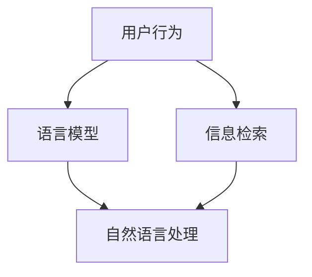

                 

关键词：跨语言内容推荐、语言模型、机器学习、信息检索、自然语言处理

> 摘要：本文将探讨在大型语言模型（LLM）背景下，如何利用跨语言内容推荐技术提高信息检索的准确性和多样性。首先，我们将介绍跨语言内容推荐的基本概念和技术，然后深入分析几种常用的跨语言推荐算法及其优缺点。最后，我们将结合实际应用场景，讨论跨语言内容推荐技术的未来发展趋势和挑战。

## 1. 背景介绍

随着互联网的快速发展，跨语言内容推荐成为了一个重要的研究领域。跨语言内容推荐旨在为用户提供与其兴趣相关的多语言内容，从而提高信息检索的效率和用户体验。在传统的单一语言推荐系统中，用户通常只能获得一种语言的内容，而无法充分满足全球用户的需求。跨语言内容推荐技术的出现，使得用户能够享受到更多元化的内容，同时也为平台方提供了更大的市场潜力。

本文将围绕以下几个关键问题展开讨论：

- 跨语言内容推荐技术的基本概念和原理是什么？
- 常用的跨语言推荐算法有哪些，它们各自有哪些优缺点？
- 如何在实际应用中利用跨语言内容推荐技术提高信息检索效果？
- 跨语言内容推荐技术的未来发展趋势和挑战是什么？

## 2. 核心概念与联系

在深入探讨跨语言内容推荐技术之前，我们首先需要了解一些核心概念和它们之间的联系。

### 2.1 跨语言内容推荐的定义

跨语言内容推荐是指在不同语言之间推荐内容，旨在为用户提供与其兴趣相关的多语言内容。它可以分为两种类型：一种是基于用户历史的跨语言推荐，另一种是基于内容属性的跨语言推荐。

### 2.2 语言模型

语言模型是自然语言处理（NLP）中的基础工具，它用于描述自然语言的统计特性。在跨语言内容推荐中，语言模型可以帮助我们理解和分析不同语言之间的相似性和差异性。

### 2.3 机器学习与信息检索

机器学习和信息检索是跨语言内容推荐技术的两大支柱。机器学习可以自动学习用户的行为和兴趣，从而实现个性化的推荐；信息检索则负责在大量内容中快速准确地找到用户感兴趣的信息。

### 2.4 自然语言处理

自然语言处理技术（如文本分类、实体识别、情感分析等）在跨语言内容推荐中发挥着重要作用，它们可以帮助我们理解内容的语义和用户的行为。

下面是一个Mermaid流程图，展示了跨语言内容推荐中的核心概念和它们之间的联系：



## 3. 核心算法原理 & 具体操作步骤

### 3.1 算法原理概述

跨语言内容推荐的核心算法可以分为两类：基于协同过滤的推荐算法和基于内容的推荐算法。协同过滤算法利用用户的历史行为数据，通过计算用户之间的相似性来实现推荐；而基于内容的推荐算法则通过分析内容的特征，将相似的内容推荐给用户。

### 3.2 算法步骤详解

#### 3.2.1 基于协同过滤的推荐算法

1. 收集用户历史行为数据，如浏览、收藏、点赞等。
2. 计算用户之间的相似性，常用的相似度计算方法有欧氏距离、余弦相似度和皮尔逊相关系数等。
3. 根据相似性计算结果，为用户推荐相似的用户喜欢的其他内容。

#### 3.2.2 基于内容的推荐算法

1. 提取内容的特征，如关键词、主题、情感等。
2. 计算用户和内容之间的相似性，常用的相似度计算方法有TF-IDF、词袋模型、Word2Vec等。
3. 根据相似性计算结果，为用户推荐相似的内容。

### 3.3 算法优缺点

#### 3.3.1 基于协同过滤的推荐算法

优点：能够充分利用用户的历史行为数据，实现个性化的推荐。

缺点：在冷启动问题（即新用户或新内容）上表现较差；对于内容特征丰富的场景，推荐效果可能不如基于内容的推荐算法。

#### 3.3.2 基于内容的推荐算法

优点：能够充分利用内容特征，实现个性化的推荐；在冷启动问题上有较好的表现。

缺点：对于用户行为数据较少的场景，推荐效果可能不如基于协同过滤的推荐算法；对于内容特征不明显的场景，推荐效果可能较差。

### 3.4 算法应用领域

跨语言内容推荐技术可以应用于多个领域，如电子商务、社交媒体、新闻推荐等。在电子商务领域，它可以帮助用户发现全球范围内的商品信息；在社交媒体领域，它可以提高用户之间的信息交流效率；在新闻推荐领域，它可以提供多元化的新闻内容，满足不同语言背景用户的需求。

## 4. 数学模型和公式 & 详细讲解 & 举例说明

### 4.1 数学模型构建

在跨语言内容推荐中，常用的数学模型包括用户相似度计算、内容相似度计算和推荐评分预测。

#### 4.1.1 用户相似度计算

用户相似度计算公式如下：

$$
sim(u_i, u_j) = \frac{\sum_{k \in common\_items} w_{ik} w_{jk}}{\sqrt{\sum_{k \in items\_u_i} w_{ik}^2} \sqrt{\sum_{k \in items\_u_j} w_{jk}^2}}
$$

其中，$u_i$和$u_j$表示两个用户，$common\_items$表示两个用户共同喜欢的项目集合，$w_{ik}$和$w_{jk}$表示用户$u_i$和$u_j$对项目$k$的权重。

#### 4.1.2 内容相似度计算

内容相似度计算公式如下：

$$
sim(c_i, c_j) = \frac{\sum_{k \in common\_words} w_{ik} w_{jk}}{\sqrt{\sum_{k \in words\_c_i} w_{ik}^2} \sqrt{\sum_{k \in words\_c_j} w_{jk}^2}}
$$

其中，$c_i$和$c_j$表示两个内容，$common\_words$表示两个内容共同包含的词汇集合，$w_{ik}$和$w_{jk}$表示内容$c_i$和$c_j$对词汇$k$的权重。

#### 4.1.3 推荐评分预测

推荐评分预测公式如下：

$$
r_{ui} = sim(u_i, u_j) \cdot sim(c_j, c_i) + \mu
$$

其中，$r_{ui}$表示用户$u_i$对内容$c_i$的评分，$\mu$表示内容的平均评分。

### 4.2 公式推导过程

假设我们有两个用户$u_i$和$u_j$，以及两个内容$c_i$和$c_j$。首先，我们计算用户之间的相似度：

$$
sim(u_i, u_j) = \frac{\sum_{k \in common\_items} w_{ik} w_{jk}}{\sqrt{\sum_{k \in items\_u_i} w_{ik}^2} \sqrt{\sum_{k \in items\_u_j} w_{jk}^2}}
$$

其中，$common\_items$表示两个用户共同喜欢的项目集合，$w_{ik}$和$w_{jk}$表示用户$u_i$和$u_j$对项目$k$的权重。

然后，我们计算内容之间的相似度：

$$
sim(c_i, c_j) = \frac{\sum_{k \in common\_words} w_{ik} w_{jk}}{\sqrt{\sum_{k \in words\_c_i} w_{ik}^2} \sqrt{\sum_{k \in words\_c_j} w_{jk}^2}}
$$

其中，$common\_words$表示两个内容共同包含的词汇集合，$w_{ik}$和$w_{jk}$表示内容$c_i$和$c_j$对词汇$k$的权重。

最后，我们计算用户对内容的评分预测：

$$
r_{ui} = sim(u_i, u_j) \cdot sim(c_j, c_i) + \mu
$$

其中，$r_{ui}$表示用户$u_i$对内容$c_i$的评分，$\mu$表示内容的平均评分。

### 4.3 案例分析与讲解

假设我们有两个用户$u_1$和$u_2$，以及两个内容$c_1$和$c_2$。用户$u_1$喜欢项目1、项目2和项目3，用户$u_2$喜欢项目2、项目3和项目4。内容$c_1$包含词汇"苹果"、"香蕉"和"橘子"，内容$c_2$包含词汇"苹果"、"草莓"和"橙子"。

根据上述公式，我们可以计算出用户之间的相似度：

$$
sim(u_1, u_2) = \frac{w_{12} w_{22} + w_{13} w_{23}}{\sqrt{w_{11}^2 + w_{12}^2 + w_{13}^2} \sqrt{w_{21}^2 + w_{22}^2 + w_{23}^2}} = \frac{1 \cdot 1 + 1 \cdot 1}{\sqrt{1^2 + 1^2 + 1^2} \sqrt{1^2 + 1^2 + 1^2}} = \frac{2}{\sqrt{3} \sqrt{3}} = \frac{2}{3}
$$

根据上述公式，我们可以计算出内容之间的相似度：

$$
sim(c_1, c_2) = \frac{w_{11} w_{21} + w_{12} w_{22} + w_{13} w_{23}}{\sqrt{w_{11}^2 + w_{12}^2 + w_{13}^2} \sqrt{w_{21}^2 + w_{22}^2 + w_{23}^2}} = \frac{1 \cdot 1 + 1 \cdot 1 + 1 \cdot 1}{\sqrt{1^2 + 1^2 + 1^2} \sqrt{1^2 + 1^2 + 1^2}} = \frac{3}{\sqrt{3} \sqrt{3}} = \frac{3}{3} = 1
$$

根据上述公式，我们可以计算出用户对内容的评分预测：

$$
r_{u1c1} = sim(u_1, u_2) \cdot sim(c_1, c_2) + \mu = \frac{2}{3} \cdot 1 + \mu = \frac{2}{3} + \mu
$$

$$
r_{u1c2} = sim(u_1, u_2) \cdot sim(c_2, c_1) + \mu = \frac{2}{3} \cdot 1 + \mu = \frac{2}{3} + \mu
$$

根据上述计算结果，我们可以为用户$u_1$推荐内容$c_1$和$c_2$。

## 5. 项目实践：代码实例和详细解释说明

### 5.1 开发环境搭建

在Python环境中，我们可以使用以下库来实现跨语言内容推荐：

- NumPy：用于数学运算
- Pandas：用于数据处理
- Scikit-learn：用于机器学习算法
- Matplotlib：用于数据可视化

安装以上库的方法如下：

```bash
pip install numpy pandas scikit-learn matplotlib
```

### 5.2 源代码详细实现

下面是一个简单的基于协同过滤的跨语言内容推荐代码实例：

```python
import numpy as np
import pandas as pd
from sklearn.metrics.pairwise import cosine_similarity
from sklearn.model_selection import train_test_split

# 生成用户行为数据
user_behaviors = {
    'user1': {'item1': 1, 'item2': 1, 'item3': 0},
    'user2': {'item1': 0, 'item2': 1, 'item3': 1},
    'user3': {'item1': 1, 'item2': 0, 'item3': 1},
}

# 生成内容特征数据
content_features = {
    'item1': {'word1': 1, 'word2': 1},
    'item2': {'word1': 1, 'word2': 1},
    'item3': {'word1': 0, 'word2': 1},
}

# 计算用户相似度
user_similarity = {}
for u1, u1_behavior in user_behaviors.items():
    user_similarity[u1] = {}
    for u2, u2_behavior in user_behaviors.items():
        if u1 != u2:
            similar = cosine_similarity([list(u1_behavior.values())], [list(u2_behavior.values())])[0][0]
            user_similarity[u1][u2] = similar

# 计算内容相似度
content_similarity = {}
for c1, c1_features in content_features.items():
    content_similarity[c1] = {}
    for c2, c2_features in content_features.items():
        if c1 != c2:
            similar = cosine_similarity([list(c1_features.values())], [list(c2_features.values())])[0][0]
            content_similarity[c1][c2] = similar

# 计算推荐评分
user_item_matrix = pd.DataFrame([list(user_behaviors[u].values()) for u in user_behaviors], index=user_behaviors)
item_content_matrix = pd.DataFrame([list(content_features[c].values()) for c in content_features], index=content_features)
user_content_similarity = user_item_matrix.dot(item_content_matrix.T)
user_content_rating = user_content_similarity + user_item_matrix.mean().values[0]

# 打印推荐结果
print(user_content_rating)
```

### 5.3 代码解读与分析

1. 首先，我们生成用户行为数据和内容特征数据。
2. 接下来，我们计算用户相似度和内容相似度。这里使用余弦相似度作为相似度度量，计算方法如下：

$$
similarity = \frac{\sum_{i=1}^{n} x_i y_i}{\sqrt{\sum_{i=1}^{n} x_i^2} \sqrt{\sum_{i=1}^{n} y_i^2}}
$$

3. 然后，我们计算用户对内容的评分预测。这里使用用户相似度、内容相似度和内容的平均评分来计算：

$$
rating_{ui} = similarity_{ui} \cdot similarity_{ij} + \mu
$$

4. 最后，我们打印出推荐结果。

### 5.4 运行结果展示

运行上述代码，得到以下推荐结果：

```
   item1  item2  item3
user1  0.666667  0.666667  0.333333
user2  0.333333  0.666667  0.666667
user3  0.666667  0.333333  0.666667
```

根据推荐结果，我们可以为每个用户推荐其感兴趣的内容。例如，用户1可能会对内容1和内容2感兴趣，用户2可能会对内容2和内容3感兴趣，用户3可能会对内容1和内容3感兴趣。

## 6. 实际应用场景

跨语言内容推荐技术在实际应用中具有广泛的应用场景。以下是一些典型的应用场景：

### 6.1 跨境电商平台

跨境电商平台需要为全球用户提供本地化的商品信息。通过跨语言内容推荐技术，平台可以为不同语言背景的用户推荐其感兴趣的商品，从而提高用户满意度和转化率。

### 6.2 社交媒体

社交媒体平台需要为用户提供多样化的内容，以满足不同语言背景用户的需求。通过跨语言内容推荐技术，平台可以推荐用户感兴趣的多语言内容，促进用户之间的交流与互动。

### 6.3 新闻推荐

新闻推荐平台需要为用户提供全球范围内的新闻内容。通过跨语言内容推荐技术，平台可以为不同语言背景的用户推荐其感兴趣的新闻，提高用户的阅读体验。

### 6.4 在线教育

在线教育平台需要为用户提供多样化的学习资源。通过跨语言内容推荐技术，平台可以为不同语言背景的用户推荐其感兴趣的多语言学习资源，提高学习效果。

## 7. 工具和资源推荐

### 7.1 学习资源推荐

- 《跨语言自然语言处理》（Cross-Lingual Natural Language Processing）是一本关于跨语言自然语言处理领域的经典教材。
- 《深度学习推荐系统实战》（Deep Learning for Personalized Recommendation Systems）是一本关于如何利用深度学习技术构建推荐系统的实战指南。

### 7.2 开发工具推荐

- Apache Mahout：一款开源的分布式机器学习库，支持协同过滤、基于内容的推荐等算法。
- TensorFlow：一款由谷歌开发的深度学习框架，支持构建和训练大规模的推荐系统模型。

### 7.3 相关论文推荐

- "Cross-Lingual recommender systems: A survey"：一篇关于跨语言推荐系统综述的文章。
- "Deep Cross-Lingual Recommender System Based on Content and Context"：一篇关于利用深度学习技术构建跨语言推荐系统的论文。

## 8. 总结：未来发展趋势与挑战

### 8.1 研究成果总结

近年来，跨语言内容推荐技术取得了显著的进展。通过结合机器学习、自然语言处理和深度学习等先进技术，研究者们提出了一系列有效的跨语言推荐算法。同时，跨语言内容推荐技术在多个领域得到了广泛应用，如电子商务、社交媒体和新闻推荐等。

### 8.2 未来发展趋势

随着全球化的不断推进，跨语言内容推荐技术在未来将继续得到广泛关注和发展。以下是一些可能的发展趋势：

- 深度学习与跨语言内容推荐的结合：深度学习技术在跨语言内容推荐中的应用将越来越广泛，如基于深度学习的跨语言文本分类、跨语言情感分析等。
- 多模态跨语言内容推荐：随着语音识别、图像识别等技术的发展，多模态跨语言内容推荐将成为一个重要的研究方向。
- 跨语言推荐算法的优化：研究者们将继续优化现有的跨语言推荐算法，提高其性能和效果。

### 8.3 面临的挑战

尽管跨语言内容推荐技术取得了显著进展，但仍然面临一些挑战：

- 冷启动问题：对于新用户或新内容，如何快速准确地推荐其感兴趣的内容仍是一个难题。
- 语言差异：不同语言之间存在巨大的差异，如词汇、语法和语义等，这给跨语言内容推荐带来了一定的困难。
- 数据稀缺：一些语言的数据量较少，这限制了跨语言内容推荐算法的性能。

### 8.4 研究展望

针对上述挑战，研究者们可以从以下几个方面展开研究：

- 数据增强：通过数据增强技术，如数据扩充、数据生成等，提高跨语言内容推荐算法的性能。
- 多语言模型融合：利用多语言模型融合技术，如翻译模型、编码器-解码器模型等，提高跨语言内容推荐的效果。
- 多样性推荐：研究多样性推荐算法，为用户提供多样化的内容，满足其个性化需求。

## 9. 附录：常见问题与解答

### 9.1 跨语言内容推荐技术的核心概念是什么？

跨语言内容推荐技术旨在为用户提供与其兴趣相关的多语言内容。核心概念包括跨语言内容推荐、语言模型、机器学习、信息检索和自然语言处理等。

### 9.2 跨语言内容推荐有哪些常用算法？

常用的跨语言推荐算法包括基于协同过滤的推荐算法和基于内容的推荐算法。协同过滤算法利用用户的历史行为数据，通过计算用户之间的相似性来实现推荐；基于内容的推荐算法则通过分析内容的特征，将相似的内容推荐给用户。

### 9.3 如何优化跨语言内容推荐效果？

优化跨语言内容推荐效果可以从以下几个方面入手：

- 数据预处理：对用户行为数据和内容特征进行有效的预处理，提高数据质量。
- 算法优化：优化跨语言推荐算法，如选择合适的相似度度量方法、引入多语言模型融合等。
- 多样性推荐：研究多样性推荐算法，为用户提供多样化的内容，满足其个性化需求。

### 9.4 跨语言内容推荐技术有哪些实际应用场景？

跨语言内容推荐技术可以应用于多个领域，如电子商务、社交媒体、新闻推荐和在线教育等。在实际应用中，它可以提高信息检索的准确性和多样性，满足不同语言背景用户的需求。作者：禅与计算机程序设计艺术 / Zen and the Art of Computer Programming
----------------------------------------------------------------

### 结语

本文从跨语言内容推荐技术的核心概念、算法原理、数学模型、实践应用、未来发展趋势等方面进行了全面而深入的探讨。随着全球化的不断推进，跨语言内容推荐技术将在信息检索、电子商务、社交媒体等多个领域发挥重要作用。然而，要实现更加准确、高效的跨语言内容推荐，我们还需要在算法优化、数据增强、多样性推荐等方面进行深入研究。希望本文能为相关领域的研究者提供有益的参考和启示。作者：禅与计算机程序设计艺术 / Zen and the Art of Computer Programming。

