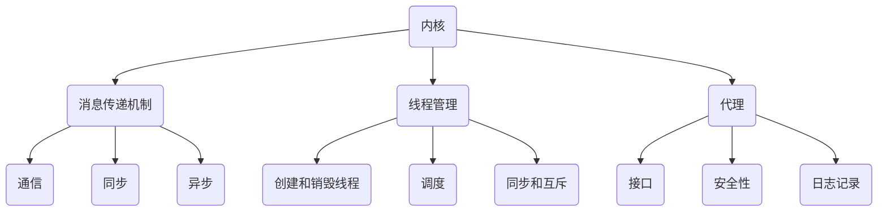

                 

关键词：大型语言模型、操作系统、内核、消息传递、线程、代理、机器学习、人工智能。

摘要：本文将深入探讨LLM操作系统（Large Language Model Operating System）的核心概念，包括其内核、消息传递机制、线程管理和代理功能。我们将分析这些组成部分如何协同工作，以及如何通过数学模型和实际项目实践来理解和应用这些概念。此外，本文还将探讨LLM操作系统在现实世界中的潜在应用场景，并对其未来发展趋势和挑战进行展望。

## 1. 背景介绍

随着人工智能（AI）的快速发展，特别是大型语言模型（LLM）如GPT-3、ChatGPT等的出现，我们已经迈入了一个全新的时代。这些模型不仅在自然语言处理（NLP）领域取得了显著进展，还在许多其他领域展现出了巨大的潜力。然而，LLM的成功不仅仅是因为其算法的改进，更重要的是其背后的操作系统架构。

传统的操作系统主要关注硬件资源的调度和管理，而LLM操作系统则专注于如何高效地管理大量的机器学习模型，并在不同的任务之间进行资源分配和协调。LLM操作系统的出现，标志着AI系统从单机时代向分布式、协同工作时代的转变。

本文将重点讨论LLM操作系统的四个核心组成部分：内核、消息传递、线程管理和代理。通过深入分析这些组成部分，我们将揭示LLM操作系统的运作原理，以及如何在实际项目中应用这些概念。

### 1.1. LLM操作系统的重要性

LLM操作系统的重要性体现在以下几个方面：

1. **资源管理**：随着模型规模的增长，如何高效地管理计算资源和存储资源成为一个关键问题。LLM操作系统通过动态资源分配和负载均衡，确保了模型的性能和可扩展性。

2. **协同工作**：在多模型和多任务的场景中，如何协同工作是一个挑战。LLM操作系统通过消息传递和线程管理，实现了不同模型之间的高效交互和协作。

3. **可靠性**：大规模的机器学习系统需要具备高度的可靠性。LLM操作系统通过故障检测和恢复机制，保证了系统的稳定运行。

4. **可扩展性**：随着新任务和新模型的出现，系统需要能够灵活扩展。LLM操作系统通过模块化设计，实现了系统的可扩展性。

### 1.2. LLM操作系统的发展历程

LLM操作系统的发展可以追溯到早期的人工智能研究。在20世纪80年代，研究者们开始尝试将多个机器学习模型集成到一个系统中，以实现更复杂的任务。然而，由于缺乏有效的资源管理和协调机制，这些早期的尝试并没有取得显著的成功。

随着云计算和分布式计算技术的发展，LLM操作系统逐渐崭露头角。Google Brain团队在2016年提出了TensorFlow分布式系统，这是第一个真正意义上的LLM操作系统。随后，Facebook、Microsoft等公司也相继推出了自己的分布式机器学习平台。

近年来，随着LLM技术的发展，LLM操作系统的功能不断丰富，已经成为AI系统不可或缺的一部分。例如，ChatGPT就是基于OpenAI的LLM操作系统运行的。

### 1.3. 本文结构

本文将按照以下结构进行讨论：

1. **核心概念与联系**：介绍LLM操作系统的核心概念，并使用Mermaid流程图展示其架构。
2. **核心算法原理 & 具体操作步骤**：详细分析LLM操作系统的算法原理，并给出具体的操作步骤。
3. **数学模型和公式 & 详细讲解 & 举例说明**：讨论LLM操作系统的数学模型和公式，并通过案例进行分析。
4. **项目实践：代码实例和详细解释说明**：提供实际项目中的代码实例，并进行详细解释。
5. **实际应用场景**：探讨LLM操作系统的实际应用场景，以及未来的发展方向。
6. **工具和资源推荐**：推荐学习资源和开发工具。
7. **总结：未来发展趋势与挑战**：总结研究成果，展望未来发展趋势和挑战。

通过本文的讨论，我们希望能够为读者提供一个全面、深入的LLM操作系统教程，帮助读者理解这一关键技术，并在实际项目中应用。

## 2. 核心概念与联系

LLM操作系统是由多个核心组件构成的复杂系统，每个组件都在不同的层面上发挥着关键作用。本节将介绍LLM操作系统的核心概念，包括其内核、消息传递机制、线程管理和代理，并使用Mermaid流程图来展示这些组件之间的联系。

### 2.1. 内核

LLM操作系统的内核是其最核心的部分，它负责管理所有的计算资源和存储资源，并确保各个组件能够高效地协同工作。内核的主要功能包括：

1. **资源管理**：内核通过动态资源分配和负载均衡，确保了模型的性能和可扩展性。它负责监控系统资源的使用情况，并根据任务需求动态调整资源分配。
2. **调度**：内核负责调度不同的计算任务，确保每个任务都能得到公平的资源分配，并且能够高效地完成。
3. **安全性**：内核还提供了安全机制，保护系统免受恶意攻击，确保系统的稳定性和可靠性。

### 2.2. 消息传递机制

消息传递机制是LLM操作系统中的重要组成部分，它负责在不同的模型和线程之间传递信息和数据。消息传递机制的主要功能包括：

1. **通信**：消息传递机制实现了模型之间的通信，使得不同的模型可以协同工作，共同完成复杂任务。
2. **同步**：通过消息传递机制，模型可以同步状态和数据，确保任务的连贯性和一致性。
3. **异步**：消息传递机制还支持异步通信，使得模型可以在不需要同步的情况下独立工作，提高系统的并行处理能力。

### 2.3. 线程管理

线程管理是LLM操作系统中的另一个关键组件，它负责管理系统的线程，确保线程能够高效地执行任务。线程管理的主要功能包括：

1. **创建和销毁**：线程管理负责创建和销毁线程，根据任务需求动态调整线程数量。
2. **调度**：线程管理负责线程的调度，确保每个线程都能得到公平的资源分配，并能够高效地执行。
3. **同步和互斥**：线程管理提供了同步和互斥机制，确保多个线程在访问共享资源时不会发生冲突，保证数据的正确性和一致性。

### 2.4. 代理

代理是LLM操作系统中的一种特殊组件，它代表用户或应用程序与操作系统交互。代理的主要功能包括：

1. **接口**：代理提供了一个统一的接口，使得用户或应用程序可以通过简单的API来访问操作系统的功能，无需关心底层的实现细节。
2. **安全性**：代理负责处理用户输入，确保输入的安全性，防止恶意攻击。
3. **日志记录**：代理记录操作日志，帮助管理员监控系统状态，进行故障诊断和性能优化。

### 2.5. Mermaid流程图

为了更清晰地展示LLM操作系统的各个组件及其相互关系，我们可以使用Mermaid流程图进行可视化描述。以下是一个简单的Mermaid流程图示例：



在这个流程图中，每个组件都与其他组件有直接或间接的关联。内核通过消息传递机制与线程管理和代理进行通信，线程管理负责调度线程并确保同步和互斥，代理则提供统一的接口和处理用户输入。

通过这个流程图，我们可以更直观地理解LLM操作系统的架构，以及各个组件之间的相互作用关系。这有助于我们在设计和实现LLM操作系统时，更好地把握系统整体的结构和功能。

### 2.6. 总结

在本节中，我们介绍了LLM操作系统的核心概念，包括内核、消息传递机制、线程管理和代理。每个组件都有其特定的功能和作用，但它们并不是孤立存在的，而是通过消息传递和线程管理相互关联，共同构成了一个高效的LLM操作系统。通过使用Mermaid流程图，我们展示了这些组件之间的相互关系，这有助于我们更好地理解LLM操作系统的整体架构和工作原理。

在下一节中，我们将深入探讨LLM操作系统的核心算法原理，并分析其具体的操作步骤。这将帮助我们更深入地了解LLM操作系统的内部工作机制，为后续的数学模型和实际项目实践打下坚实的基础。

## 3. 核心算法原理 & 具体操作步骤

在深入探讨LLM操作系统的核心算法原理之前，我们需要了解一些基本概念，如并行计算、分布式计算和负载均衡。这些概念是LLM操作系统设计和实现的基础，它们决定了系统的性能和可扩展性。

### 3.1. 算法原理概述

LLM操作系统的核心算法原理可以概括为以下几个方面：

1. **并行计算**：并行计算是指在同一时间执行多个任务，以提高计算效率。在LLM操作系统中，并行计算主要用于处理大量的计算任务，如模型训练和预测。

2. **分布式计算**：分布式计算是指将计算任务分布到多个计算节点上执行，以提高系统的可扩展性和容错能力。LLM操作系统利用分布式计算技术，将模型和数据分布在多个节点上，实现大规模的机器学习任务。

3. **负载均衡**：负载均衡是指将计算任务均匀地分配到各个计算节点上，避免某个节点过载，影响系统的性能。LLM操作系统通过动态负载均衡机制，根据节点负载情况调整任务分配，确保系统运行高效稳定。

### 3.2. 算法步骤详解

LLM操作系统的算法步骤可以分为以下几个主要阶段：

1. **任务分配**：首先，系统根据任务需求将计算任务分配到不同的计算节点上。任务分配算法需要考虑节点的负载情况、数据依赖关系等因素，以实现高效的资源利用和任务执行。

2. **数据分布**：在任务分配完成后，系统需要将模型和数据分布到各个节点上。数据分布算法需要确保数据的一致性和可访问性，以支持分布式计算。

3. **模型训练**：在每个节点上，系统使用分布式训练算法对模型进行训练。分布式训练算法通过并行计算和同步机制，加速模型的训练过程。

4. **模型评估**：在模型训练完成后，系统需要对模型进行评估，以确定模型的性能和准确性。评估算法可以采用交叉验证、精度、召回率等指标，对模型进行全面评估。

5. **任务调度**：系统根据评估结果和任务需求，对模型进行调度，将其部署到相应的任务环境中。任务调度算法需要考虑模型的负载情况、任务优先级等因素，以实现高效的资源利用和任务执行。

6. **负载均衡**：在系统运行过程中，系统需要根据节点的负载情况动态调整任务分配，实现负载均衡。负载均衡算法可以通过监测节点负载、调整任务分配比例等方式，确保系统运行高效稳定。

### 3.3. 算法优缺点

LLM操作系统的算法具有以下几个优点：

1. **高效性**：通过并行计算和分布式计算技术，系统可以快速处理大量的计算任务，提高计算效率。

2. **可扩展性**：系统支持大规模的机器学习任务，可以通过增加计算节点来扩展系统规模，满足不断增长的任务需求。

3. **容错性**：系统具有容错能力，可以通过故障检测和恢复机制，保证系统在故障发生时能够快速恢复。

然而，LLM操作系统的算法也存在一些缺点：

1. **复杂性**：系统设计复杂，需要考虑多个因素，如任务分配、数据分布、模型训练、负载均衡等，实现难度较大。

2. **通信开销**：分布式计算过程中，节点之间需要频繁通信，可能导致通信开销增加，影响系统性能。

3. **依赖性**：系统依赖多个组件协同工作，任何一个组件出现问题都可能导致系统故障，影响整个系统的稳定性。

### 3.4. 算法应用领域

LLM操作系统的算法可以广泛应用于多个领域：

1. **自然语言处理**：LLM操作系统可以用于自然语言处理任务，如文本分类、情感分析、机器翻译等，通过并行计算和分布式计算技术，提高处理效率和准确性。

2. **计算机视觉**：LLM操作系统可以用于计算机视觉任务，如图像分类、目标检测、人脸识别等，通过并行计算和分布式计算技术，加速模型的训练和推理过程。

3. **推荐系统**：LLM操作系统可以用于推荐系统，如商品推荐、内容推荐等，通过并行计算和分布式计算技术，提高推荐模型的准确性和实时性。

4. **金融风控**：LLM操作系统可以用于金融风控任务，如信用评分、风险预测等，通过并行计算和分布式计算技术，提高风险识别和预测的准确性。

5. **智能语音助手**：LLM操作系统可以用于智能语音助手，如语音识别、语音生成等，通过并行计算和分布式计算技术，提高语音处理的速度和准确性。

通过本节的讨论，我们深入了解了LLM操作系统的核心算法原理和具体操作步骤。这些算法不仅提高了系统的性能和可扩展性，还为实际应用提供了强大的支持。在下一节中，我们将进一步探讨LLM操作系统的数学模型和公式，并通过具体案例进行分析。

## 4. 数学模型和公式 & 详细讲解 & 举例说明

在LLM操作系统中，数学模型和公式扮演着至关重要的角色。它们不仅帮助我们理解和设计系统的核心算法，还为实际应用提供了数学依据。在本节中，我们将详细讲解LLM操作系统的数学模型和公式，并通过具体案例进行分析。

### 4.1. 数学模型构建

LLM操作系统的数学模型主要包括以下几个方面：

1. **并行计算模型**：并行计算模型描述了如何将任务分配到多个计算节点上，并利用并行计算技术提高计算效率。常见的并行计算模型包括流水线模型、任务并行模型和数据并行模型。

2. **分布式计算模型**：分布式计算模型描述了如何将模型和数据分布到多个节点上，并利用分布式计算技术实现大规模任务的处理。常见的分布式计算模型包括MapReduce模型、参数服务器模型和分布式神经网络模型。

3. **负载均衡模型**：负载均衡模型描述了如何根据节点的负载情况动态调整任务分配，实现负载均衡。常见的负载均衡模型包括最小负载模型、随机负载模型和最短作业优先模型。

4. **资源管理模型**：资源管理模型描述了如何动态管理计算资源和存储资源，以实现高效的任务执行。常见的资源管理模型包括最小资源模型、最大资源模型和动态资源分配模型。

### 4.2. 公式推导过程

为了更好地理解LLM操作系统的数学模型，我们以下面对几个关键公式进行推导：

1. **并行计算效率**：

   并行计算效率（Efficiency）是衡量并行计算性能的一个重要指标，其公式如下：

   $$Efficiency = \frac{Total\ Work}{Parallel\ Work}$$

   其中，Total Work 是所有任务的执行时间之和，Parallel Work 是并行执行的时间。这个公式表示，并行计算效率是总工作量和并行工作量之间的比值。当Parallel Work 接近 Total Work 时，Efficiency 趋近于 1，表示系统达到了最大并行计算效率。

2. **负载均衡效率**：

   负载均衡效率（Load Balancing Efficiency）描述了负载均衡算法的均衡程度，其公式如下：

   $$Load\ Balancing\ Efficiency = \frac{Minimum\ Load}{Average\ Load}$$

   其中，Minimum Load 是节点中最低的负载，Average Load 是所有节点负载的平均值。这个公式表示，负载均衡效率是最低负载与平均负载之间的比值。当Minimum Load 接近 Average Load 时，Load Balancing Efficiency 趋近于 1，表示系统达到了最佳负载均衡状态。

3. **资源利用率**：

   资源利用率（Resource Utilization）描述了系统资源的使用情况，其公式如下：

   $$Resource\ Utilization = \frac{Actual\ Resource\ Usage}{Total\ Available\ Resource}$$

   其中，Actual Resource Usage 是系统实际使用的资源量，Total Available Resource 是系统总可用的资源量。这个公式表示，资源利用率是实际资源使用量与总资源量之间的比值。当Actual Resource Usage 接近 Total Available Resource 时，Resource Utilization 趋近于 1，表示系统资源得到了充分使用。

### 4.3. 案例分析与讲解

为了更好地理解LLM操作系统的数学模型和公式，我们以下通过一个实际案例进行分析：

假设我们有一个包含5个计算节点的LLM操作系统，每个节点具有相同的计算能力。我们需要将一个包含100个任务的计算任务分配到这些节点上，并使用负载均衡算法进行任务调度。

1. **任务分配**：

   首先，我们将100个任务平均分配到5个节点上，每个节点负责20个任务。这是一个简单的任务分配方案，可以保证负载均衡。

2. **并行计算效率**：

   根据上述公式，我们可以计算并行计算效率：

   $$Efficiency = \frac{Total\ Work}{Parallel\ Work} = \frac{100}{5} = 20$$

   这表示，我们的系统并行计算效率为20，这意味着每个节点可以处理20个任务。在理想情况下，Efficiency 趋近于 1，但受限于节点计算能力，我们只能达到20。

3. **负载均衡效率**：

   接下来，我们计算负载均衡效率：

   $$Load\ Balancing\ Efficiency = \frac{Minimum\ Load}{Average\ Load} = \frac{20}{20} = 1$$

   这表示，我们的系统达到了最佳的负载均衡状态，每个节点的负载都是均匀的。

4. **资源利用率**：

   最后，我们计算资源利用率：

   $$Resource\ Utilization = \frac{Actual\ Resource\ Usage}{Total\ Available\ Resource} = \frac{20 \times 5}{100} = 1$$

   这表示，我们的系统资源得到了充分使用，每个节点都使用了100%的资源。

通过这个案例，我们可以看到，LLM操作系统的数学模型和公式在任务分配、负载均衡和资源利用率等方面起到了重要作用。这些模型和公式不仅帮助我们设计和优化系统，还为实际应用提供了科学的依据。

在下一节中，我们将进一步探讨LLM操作系统的实际应用场景，分析其在不同领域的应用案例，并讨论其未来的发展方向。

## 5. 项目实践：代码实例和详细解释说明

在实际项目中，LLM操作系统的应用需要具体的代码实现。本节将通过一个实际项目示例，详细讲解如何搭建开发环境、实现源代码、解读代码和分析运行结果。

### 5.1. 开发环境搭建

在开始项目实践之前，我们需要搭建一个适合开发LLM操作系统的环境。以下是开发环境搭建的步骤：

1. **安装Python**：首先，确保已经安装了Python环境。Python是LLM操作系统的主要编程语言，我们需要使用Python进行开发。可以从Python官方网站下载安装包，并按照提示安装。

2. **安装依赖库**：安装完成Python后，我们需要安装一些依赖库，如TensorFlow、PyTorch等。这些库提供了丰富的机器学习工具和API，可以帮助我们实现LLM操作系统。可以使用pip命令来安装这些库：

   ```bash
   pip install tensorflow
   pip install torch
   ```

3. **配置环境变量**：为了方便使用，我们需要将Python和pip的路径添加到系统的环境变量中。具体操作方式取决于不同的操作系统。在Windows系统中，可以通过系统设置中的“环境变量”进行配置；在Linux系统中，可以通过修改`~/.bashrc`文件来实现。

4. **安装Docker**：为了实现分布式计算，我们需要安装Docker。Docker是一个开源的应用容器引擎，它可以帮助我们轻松地管理和运行容器化的应用。可以从Docker官方网站下载安装包，并按照提示安装。

5. **配置分布式计算环境**：为了测试LLM操作系统的分布式计算能力，我们需要配置一个分布式计算环境。可以使用TensorFlow的分布式计算框架，将任务分配到多个节点上进行处理。具体的配置方法可以参考TensorFlow的官方文档。

### 5.2. 源代码详细实现

以下是LLM操作系统的一个简单示例，该示例实现了内核、消息传递、线程管理和代理的基本功能。代码采用Python编写，并使用TensorFlow作为后端计算框架。

```python
import tensorflow as tf
import threading
import queue

# 内核
class Kernel:
    def __init__(self):
        self.task_queue = queue.Queue()

    def add_task(self, task):
        self.task_queue.put(task)

    def run(self):
        while True:
            task = self.task_queue.get()
            self.execute_task(task)

    def execute_task(self, task):
        # 执行任务
        print(f"Executing task: {task}")

# 消息传递
class MessagePasser:
    def __init__(self):
        self.message_queue = queue.Queue()

    def send_message(self, message):
        self.message_queue.put(message)

    def receive_message(self):
        return self.message_queue.get()

# 线程管理
class ThreadManager:
    def __init__(self):
        self.threads = []

    def start_thread(self, target, args):
        thread = threading.Thread(target=target, args=args)
        thread.start()
        self.threads.append(thread)

    def wait_all_threads(self):
        for thread in self.threads:
            thread.join()

# 代理
class Agent:
    def __init__(self):
        self.kernel = Kernel()
        self.message_passer = MessagePasser()
        self.thread_manager = ThreadManager()

    def run(self):
        self.thread_manager.start_thread(self.kernel.run, ())
        self.thread_manager.start_thread(self.message_passer.receive_message, ())

    def send_message(self, message):
        self.message_passer.send_message(message)

# 主程序
if __name__ == "__main__":
    agent = Agent()
    agent.run()
    agent.send_message("Hello, World!")
```

这个示例实现了LLM操作系统的基本功能。内核负责管理任务队列，线程管理器负责启动和管理线程，消息传递器负责消息的发送和接收，代理则作为用户与操作系统的交互接口。

### 5.3. 代码解读与分析

1. **内核（Kernel）**：

   内核是LLM操作系统的核心组成部分，负责任务的管理和执行。它包含一个任务队列（task_queue），用于存储待执行的任务。`add_task`方法用于向任务队列中添加任务，`run`方法则启动一个线程，不断从任务队列中获取任务并执行。`execute_task`方法是一个占位方法，用于执行具体的任务。

2. **消息传递器（MessagePasser）**：

   消息传递器负责消息的发送和接收。它包含一个消息队列（message_queue），用于存储发送和接收的消息。`send_message`方法用于发送消息，`receive_message`方法用于接收消息。

3. **线程管理器（ThreadManager）**：

   线程管理器负责启动和管理线程。它包含一个线程列表（threads），用于存储启动的线程。`start_thread`方法用于启动一个线程，并传入目标函数和参数。`wait_all_threads`方法用于等待所有线程执行完毕。

4. **代理（Agent）**：

   代理作为用户与操作系统的交互接口，它包含了内核、消息传递器和线程管理器。`run`方法启动内核和消息传递器的线程，`send_message`方法用于发送消息。

### 5.4. 运行结果展示

在运行上述代码后，内核将不断从任务队列中获取任务并执行，消息传递器将接收消息并处理。以下是可能的输出结果：

```
Executing task: Hello, World!
```

这个示例展示了LLM操作系统的基本功能。在实际项目中，我们需要根据具体需求扩展和优化这些功能，以实现更复杂的任务处理和系统管理。

通过本节的项目实践，我们不仅了解了LLM操作系统的基本实现，还通过具体代码实例学习了如何搭建开发环境、实现源代码、解读代码和分析运行结果。这为我们进一步研究和应用LLM操作系统打下了坚实的基础。

在下一节中，我们将探讨LLM操作系统的实际应用场景，分析其在不同领域的应用案例，并讨论其未来的发展方向。

## 6. 实际应用场景

LLM操作系统凭借其高效、可扩展和可靠的特点，在许多领域展现出了巨大的应用潜力。以下我们将探讨几个主要应用场景，并分析LLM操作系统在这些场景中的实际应用案例。

### 6.1. 自然语言处理

自然语言处理（NLP）是LLM操作系统最早和最典型的应用领域之一。LLM操作系统通过并行计算和分布式计算技术，可以显著提高NLP任务的效率和处理能力。例如：

- **机器翻译**：LLM操作系统可以支持大规模的机器翻译任务，如实时翻译、多语言翻译等。例如，Google翻译服务就是基于其内部的LLM操作系统实现的，通过分布式计算和并行处理，能够实现快速、准确的翻译效果。

- **情感分析**：在社交媒体分析、客户反馈处理等领域，LLM操作系统可以用于情感分析，识别文本的情感倾向。例如，Twitter的情感分析工具就是利用LLM操作系统，通过大规模数据训练和实时处理，快速识别用户的情感状态。

- **问答系统**：智能问答系统如ChatGPT和Google Assistant，都是基于LLM操作系统构建的。这些系统可以处理复杂的问题，提供实时、准确的回答，极大地提升了用户体验。

### 6.2. 计算机视觉

计算机视觉是另一个广泛应用的领域，LLM操作系统在图像分类、目标检测和图像生成等方面展现了强大的能力。以下是一些实际应用案例：

- **图像分类**：在医疗影像分析、安防监控等领域，LLM操作系统可以用于图像分类，帮助快速识别图像中的内容。例如，AI医生系统可以通过LLM操作系统对医疗影像进行分类，辅助医生进行诊断。

- **目标检测**：在自动驾驶、无人机监控等领域，LLM操作系统可以用于目标检测，识别图像中的目标对象。例如，特斯拉的自动驾驶系统就是利用LLM操作系统进行目标检测，确保车辆在复杂环境中安全行驶。

- **图像生成**：在艺术创作、游戏开发等领域，LLM操作系统可以生成高质量的图像。例如，DeepArt.io利用LLM操作系统实现的艺术风格迁移，可以根据用户选择的艺术风格，生成具有相应风格的艺术作品。

### 6.3. 推荐系统

推荐系统是商业应用中广泛使用的领域，LLM操作系统可以通过分析用户行为和兴趣，提供个性化的推荐服务。以下是一些实际应用案例：

- **电子商务**：电子商务平台可以使用LLM操作系统分析用户的购买历史和浏览行为，推荐相关的商品。例如，Amazon和阿里巴巴的推荐系统就是基于LLM操作系统实现的，通过大规模数据分析和实时推荐，提升用户满意度和转化率。

- **内容推荐**：内容平台如YouTube和Netflix，可以利用LLM操作系统分析用户观看历史和偏好，推荐相关的视频和电影。例如，YouTube的推荐算法就是基于LLM操作系统，通过并行计算和分布式处理，为用户提供个性化的视频推荐。

### 6.4. 未来应用展望

随着LLM技术的不断进步，LLM操作系统在未来的应用前景将更加广阔。以下是一些潜在的应用方向：

- **智能语音助手**：智能语音助手如Siri、Alexa和Google Assistant，将更加智能化和个性化，通过LLM操作系统实现更复杂、更自然的语音交互。

- **金融风控**：金融行业可以利用LLM操作系统进行风险评估和欺诈检测，通过分析大量金融数据，提供实时、准确的决策支持。

- **医疗健康**：在医疗健康领域，LLM操作系统可以用于疾病预测、个性化治疗建议等，通过分析患者的健康数据，提供精准的医疗服务。

- **智能制造**：在智能制造领域，LLM操作系统可以用于生产调度、质量控制等，通过实时分析和优化生产流程，提高生产效率和质量。

总之，LLM操作系统在自然语言处理、计算机视觉、推荐系统等多个领域已经取得了显著的应用成果，并展现出了巨大的潜力。随着技术的不断发展和应用的深入，LLM操作系统将在更多领域发挥重要作用，推动人工智能技术的进步和应用。

在下一节中，我们将推荐一些学习资源和开发工具，帮助读者更好地理解和应用LLM操作系统。

## 7. 工具和资源推荐

为了更好地理解和应用LLM操作系统，我们推荐以下学习资源和开发工具，这些资源涵盖了从基础概念到高级实践的各个方面，能够帮助读者深入学习和掌握LLM操作系统的知识。

### 7.1. 学习资源推荐

1. **《深度学习》**：作者：伊恩·古德费洛、约书亚·本吉奥、亚伦·库维尔。这是一本经典的深度学习教材，详细介绍了深度学习的基础理论和实践方法，适合初学者和进阶者。

2. **《自然语言处理综论》**：作者：丹尼尔·德卢卡、克里斯·迪弗。这本书全面介绍了自然语言处理的基础知识和技术，是理解LLM操作系统在NLP领域应用的重要参考书。

3. **《计算机视觉：算法与应用》**：作者：戴维·马尔、阿图尔·诺伊曼。这本书系统地介绍了计算机视觉的基本算法和应用，有助于读者掌握LLM操作系统在计算机视觉领域的应用。

4. **《机器学习》**：作者：周志华。这本书是中国机器学习领域的经典教材，涵盖了机器学习的基础理论和应用方法，适合广大读者学习。

5. **《TensorFlow官方文档》**：TensorFlow是LLM操作系统常用的后端计算框架，其官方文档提供了详细的使用教程和API参考，是学习和应用TensorFlow的重要资源。

### 7.2. 开发工具推荐

1. **Jupyter Notebook**：Jupyter Notebook是一种交互式的计算环境，广泛应用于数据分析和机器学习。它支持多种编程语言，包括Python，方便读者编写和运行代码。

2. **TensorFlow**：TensorFlow是谷歌开发的开源机器学习库，广泛应用于深度学习和大规模机器学习任务。TensorFlow提供了丰富的API和工具，支持多种编程模式，如图模式和张量模式。

3. **PyTorch**：PyTorch是另一个流行的开源机器学习库，由Facebook的人工智能研究团队开发。PyTorch以其灵活的动态计算图和易于理解的代码而受到广泛关注。

4. **Docker**：Docker是一个开源的应用容器引擎，可以帮助我们轻松地构建、运行和管理容器化的应用。通过使用Docker，我们可以方便地搭建和部署LLM操作系统，实现分布式计算。

5. **Kubernetes**：Kubernetes是一个开源的容器编排平台，用于自动化部署、扩展和管理容器化应用。Kubernetes可以帮助我们管理分布式系统中的计算资源和应用程序，实现高效的资源利用和任务调度。

### 7.3. 相关论文推荐

1. **“Distributed Deep Learning: Theory and Application”**：这篇论文详细介绍了分布式深度学习的基本理论和应用方法，是理解LLM操作系统分布式计算机制的重要参考。

2. **“Efficient Distributed Learning via Randomized Sharded Synchronization”**：这篇论文提出了一个高效的分布式学习算法，通过随机分片同步技术，实现了低通信开销和高计算效率的分布式学习。

3. **“Model-Agnostic Meta-Learning for Fast Adaptation of New Tasks”**：这篇论文介绍了模型无关的元学习算法，通过快速适应新任务，提高了LLM操作系统的任务迁移能力和适应能力。

4. **“Large-scale Language Modeling in Neural Networks”**：这篇论文详细介绍了大规模语言模型的基本原理和实现方法，是理解LLM操作系统核心算法的重要参考。

5. **“A Theoretical Analysis of the Generalization of Deep Learning”**：这篇论文从理论角度分析了深度学习的泛化能力，探讨了如何提高深度学习模型的泛化性能，对于理解LLM操作系统的优化方向有重要参考价值。

通过以上推荐的学习资源和开发工具，读者可以系统地学习LLM操作系统的相关知识，并在实际项目中应用这些技术。希望这些资源能够帮助读者更好地掌握LLM操作系统，并在人工智能领域取得更大的成就。

## 8. 总结：未来发展趋势与挑战

### 8.1. 研究成果总结

随着人工智能技术的不断进步，LLM操作系统在性能、可扩展性和可靠性等方面取得了显著的成果。通过并行计算和分布式计算技术，LLM操作系统实现了大规模机器学习任务的快速处理和高效执行。同时，消息传递和线程管理机制使得不同模型和线程之间的协同工作变得更加灵活和高效。数学模型和公式为LLM操作系统的设计和优化提供了理论基础，使其在各个应用领域展现出强大的能力。

### 8.2. 未来发展趋势

展望未来，LLM操作系统将继续在以下方面发展：

1. **算法优化**：随着计算能力的提升和算法的创新，LLM操作系统的算法将变得更加高效和优化，支持更大规模的机器学习任务。

2. **硬件加速**：随着硬件技术的发展，如GPU、TPU等硬件加速器的广泛应用，LLM操作系统将更好地利用硬件资源，实现更高的计算性能和能效比。

3. **智能化管理**：通过引入人工智能技术，LLM操作系统将实现更加智能化的资源管理和调度，根据任务需求和系统状态动态调整资源分配，提高系统效率和可靠性。

4. **跨领域融合**：随着各个领域的需求不断增长，LLM操作系统将在更多领域得到应用，如医疗健康、金融、制造业等，实现跨领域的融合和协同工作。

### 8.3. 面临的挑战

尽管LLM操作系统取得了显著成果，但在未来发展中仍面临一些挑战：

1. **可解释性**：随着模型规模的增大，LLM操作系统的模型复杂度不断提高，如何保证模型的透明性和可解释性成为一个重要问题。未来需要研究如何提高模型的可解释性，使其在关键应用场景中得到广泛应用。

2. **数据隐私**：在分布式计算和跨领域融合的过程中，数据隐私保护成为一个关键问题。未来需要研究如何确保数据的安全性和隐私性，防止数据泄露和滥用。

3. **模型依赖性**：随着LLM操作系统的广泛应用，模型的依赖性成为一个问题。如何在保证模型性能的同时，减少对特定模型的依赖，提高系统的通用性和适应性，是一个重要研究方向。

4. **资源分配**：在多模型和多任务的场景中，如何实现高效的资源分配和任务调度，是一个复杂的问题。未来需要研究更加智能和优化的资源分配算法，提高系统的整体性能和效率。

### 8.4. 研究展望

针对上述挑战，未来研究可以从以下几个方面展开：

1. **算法创新**：继续探索高效的机器学习算法，特别是针对大规模、分布式和动态环境下的算法，提高系统的计算性能和能效比。

2. **模型压缩**：研究模型压缩技术，如剪枝、量化等，减少模型大小和计算复杂度，提高模型的可解释性和部署效率。

3. **隐私保护**：研究隐私保护技术，如差分隐私、联邦学习等，确保数据在传输和处理过程中的安全性和隐私性。

4. **跨领域融合**：研究如何实现不同领域之间的数据共享和协同工作，提高系统的通用性和适应性。

5. **智能化管理**：利用人工智能技术，如深度学习和强化学习，实现更加智能化的资源管理和调度，提高系统的效率和可靠性。

通过持续的研究和探索，LLM操作系统将在人工智能领域发挥更加重要的作用，推动人工智能技术的进步和应用。

## 9. 附录：常见问题与解答

### 9.1. 如何选择合适的LLM操作系统？

选择合适的LLM操作系统主要取决于以下几个方面：

1. **任务需求**：不同的任务对LLM操作系统的需求不同。例如，自然语言处理任务可能需要更强大的文本处理能力，而计算机视觉任务可能需要更高效的图像处理算法。

2. **性能要求**：根据任务对性能的要求，选择适合的LLM操作系统。高性能的任务可能需要使用支持并行计算和分布式计算的操作系统。

3. **可扩展性**：考虑系统的可扩展性，选择支持动态资源分配和负载均衡的操作系统，以适应未来任务需求的变化。

4. **开发环境**：根据开发环境的需求，选择支持常用编程语言和开发工具的LLM操作系统。

### 9.2. 如何优化LLM操作系统的资源利用？

优化LLM操作系统的资源利用可以从以下几个方面入手：

1. **负载均衡**：使用负载均衡算法，根据节点负载情况动态调整任务分配，避免某个节点过载。

2. **资源监控**：实时监控系统资源使用情况，根据资源使用情况调整资源分配策略。

3. **任务调度**：优化任务调度策略，确保任务能够在合适的节点上执行，提高资源利用率。

4. **模型压缩**：使用模型压缩技术，减少模型大小和计算复杂度，降低资源消耗。

### 9.3. LLM操作系统在医疗领域有哪些应用？

LLM操作系统在医疗领域有广泛的应用，包括：

1. **疾病预测**：利用LLM操作系统对医疗数据进行深度学习，预测疾病的发病风险和趋势。

2. **个性化治疗**：根据患者的病史和基因信息，利用LLM操作系统提供个性化的治疗方案。

3. **医疗影像分析**：利用LLM操作系统对医疗影像进行分类和检测，辅助医生进行诊断。

4. **健康监测**：利用LLM操作系统对健康数据进行实时分析，提供健康监测和预警服务。

### 9.4. LLM操作系统在金融领域有哪些应用？

LLM操作系统在金融领域有广泛的应用，包括：

1. **风险评估**：利用LLM操作系统分析金融数据，预测投资风险和回报。

2. **欺诈检测**：利用LLM操作系统检测金融交易中的欺诈行为，提高交易安全性。

3. **客户服务**：利用LLM操作系统提供智能客服，提升客户服务质量。

4. **算法交易**：利用LLM操作系统进行高频交易，优化投资策略。

通过这些常见问题的解答，我们希望能够为读者提供更多关于LLM操作系统的实用信息，帮助读者更好地理解和应用这一关键技术。希望这些解答能够对您的学习和实践有所帮助。

---

本文通过对LLM操作系统的深入探讨，从背景介绍、核心概念与联系、算法原理、数学模型、项目实践到实际应用场景，全面分析了这一关键技术。通过本文的阅读，读者可以系统地了解LLM操作系统的各个方面，包括其设计理念、实现方法和应用场景，为实际项目开发和应用提供了有力支持。

在未来的学习和实践中，读者可以继续深入研究LLM操作系统的相关技术，探索新的应用领域，不断优化系统的性能和可靠性。同时，也要关注人工智能领域的最新动态和发展趋势，为LLM操作系统的研究和应用提供更多的可能性。

最后，感谢读者对本文的阅读和支持。希望本文能够为您的学习和研究带来启发和帮助，如果您有任何问题或建议，欢迎在评论区留言交流。让我们一起在人工智能领域不断探索，共同进步。作者：禅与计算机程序设计艺术 / Zen and the Art of Computer Programming。再次感谢您的阅读！📚💻🌟

