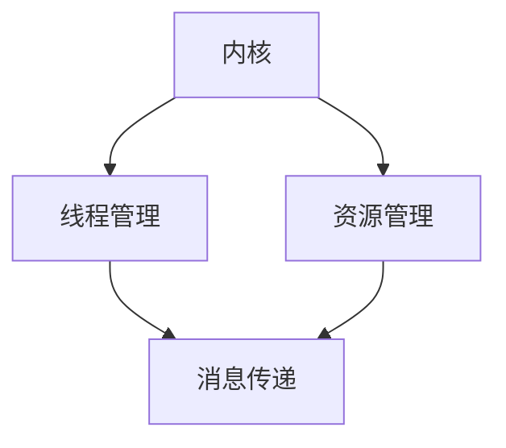

                 

 

## 1. 背景介绍

在当今计算机科学领域，随着人工智能（AI）技术的飞速发展，大型语言模型（LLM，Large Language Model）已经成为了一个热点研究方向。LLM是一种基于深度学习的自然语言处理模型，具有强大的语言理解和生成能力。随着模型的规模和复杂性的增加，如何高效地管理LLM的运行资源、处理复杂任务以及保证系统稳定性，成为了亟待解决的问题。

操作系统是计算机系统的核心组成部分，它负责管理和协调计算机硬件资源，提供对应用程序的服务接口。操作系统主要包括内核、消息传递机制和线程等核心组件。内核是操作系统的核心部分，负责管理硬件资源、提供线程和进程的管理服务。消息传递机制用于不同进程或线程之间的通信。线程则是操作系统中最小的执行单元，它们可以并发执行，提高系统的并行处理能力。

本文将围绕LLM操作系统的核心组件展开讨论，分别介绍内核、消息和线程的概念、原理以及具体实现。通过本文的阅读，读者将了解到LLM操作系统的核心架构，以及如何利用这些核心组件构建高效、稳定的系统。

## 2. 核心概念与联系

在探讨LLM操作系统的核心组件之前，我们首先需要明确几个关键概念：内核（Kernel）、消息传递（Message Passing）和线程（Thread）。

### 2.1 内核（Kernel）

内核是操作系统的核心部分，负责管理计算机硬件资源，提供线程和进程的管理服务。在LLM操作系统中，内核的主要作用包括：

1. **资源管理**：内核负责管理计算机的CPU、内存、I/O设备等硬件资源，为LLM模型提供必要的运行环境。
2. **线程和进程管理**：内核负责创建、销毁和管理线程和进程，确保它们能够高效地运行。
3. **调度策略**：内核根据一定的调度策略，决定线程和进程的执行顺序，以最大化系统的性能。

### 2.2 消息传递（Message Passing）

消息传递是进程间或线程间进行通信的一种机制。在LLM操作系统中，消息传递机制主要用于以下场景：

1. **模型训练与推理**：在模型训练和推理过程中，不同线程或进程之间需要共享数据和信息，消息传递机制可以有效地实现这一功能。
2. **分布式计算**：对于大规模的LLM模型，可以通过分布式计算来提高训练和推理的效率。消息传递机制可以帮助不同节点之间的数据传输和同步。

### 2.3 线程（Thread）

线程是操作系统中最小的执行单元，可以并发执行，提高系统的并行处理能力。在LLM操作系统中，线程主要用于：

1. **模型推理**：在模型推理过程中，可以使用多个线程并行计算，提高推理速度。
2. **动态资源调整**：内核可以根据系统负载情况动态调整线程数量，优化资源利用效率。

### 2.4 内核、消息和线程的关联

在LLM操作系统中，内核、消息和线程之间存在着紧密的联系。内核为线程和进程提供了运行环境和管理服务，线程和进程通过消息传递机制进行通信，共同完成复杂的计算任务。具体而言：

1. **内核与线程**：内核负责线程的创建、销毁和管理，确保线程能够高效地运行。
2. **内核与消息传递**：内核提供消息传递机制，使得线程和进程之间能够进行数据交换和通信。
3. **线程与消息传递**：线程通过消息传递机制与其他线程或进程进行通信，共同完成计算任务。

### 2.5 Mermaid流程图

为了更好地展示内核、消息和线程之间的关联，我们可以使用Mermaid流程图来表示。以下是一个简单的Mermaid流程图示例：



在这个流程图中，内核负责线程管理和资源管理，线程通过消息传递机制与其他线程或进程进行通信。这个流程图清晰地展示了LLM操作系统的核心组件及其关联关系。

通过以上对核心概念和关联的介绍，读者可以对LLM操作系统的核心组件有一个初步的了解。接下来，我们将深入探讨这些核心组件的原理和实现。

## 3. 核心算法原理 & 具体操作步骤

### 3.1 算法原理概述

在LLM操作系统中，核心算法主要涉及内核、消息传递和线程的管理。以下分别介绍这些算法的基本原理。

#### 3.1.1 内核管理算法

内核管理算法主要关注计算机硬件资源的分配和管理。其核心思想是：根据系统的当前负载情况，动态调整资源的分配策略，以最大化系统的性能。具体而言，内核管理算法包括以下几个方面：

1. **CPU调度**：内核根据线程的优先级和执行时间，选择合适的线程进行执行。常见的CPU调度算法有：先来先服务（FCFS）、短作业优先（SJF）、优先级调度（PS）等。
2. **内存管理**：内核负责分配和回收内存空间，确保系统中的每个线程都有足够的内存资源进行运行。内存管理算法包括：分页、分段、虚拟内存等。
3. **I/O管理**：内核负责协调I/O设备的操作，确保数据传输的可靠性和高效性。I/O管理算法包括：轮转调度、优先级调度等。

#### 3.1.2 消息传递算法

消息传递算法主要用于线程和进程之间的通信。其核心思想是：通过定义消息格式和数据传输协议，实现线程和进程之间的数据交换。具体而言，消息传递算法包括以下几个方面：

1. **消息格式**：定义消息的格式，包括消息类型、消息内容等。常见的消息格式有：二进制格式、文本格式等。
2. **数据传输协议**：定义数据传输的协议，包括数据传输的顺序、同步机制等。常见的数据传输协议有：TCP/IP、UDP等。
3. **消息队列**：实现线程和进程之间的消息传递。消息队列可以是循环队列、链表等数据结构。

#### 3.1.3 线程管理算法

线程管理算法主要关注线程的创建、销毁和调度。其核心思想是：根据系统的负载情况，动态调整线程的数量和执行顺序，以提高系统的并行处理能力。具体而言，线程管理算法包括以下几个方面：

1. **线程创建**：根据任务需求，创建线程。线程的创建可以采用手动创建或自动创建两种方式。
2. **线程销毁**：当线程完成任务后，销毁线程。线程的销毁可以是立即销毁或延时销毁。
3. **线程调度**：根据线程的优先级和执行时间，选择合适的线程进行执行。线程调度算法包括：时间片轮转、优先级调度等。

### 3.2 算法步骤详解

#### 3.2.1 内核管理算法步骤

1. **初始化**：初始化内核数据结构，包括CPU调度队列、内存管理队列、I/O管理队列等。
2. **CPU调度**：根据线程的优先级和执行时间，选择合适的线程进行执行。具体步骤如下：
   - 检查线程优先级队列，选择最高优先级的线程。
   - 检查线程执行时间队列，选择执行时间最短的线程。
   - 若优先级相同，选择线程ID最小的线程。
3. **内存管理**：根据线程的内存需求，分配和回收内存空间。具体步骤如下：
   - 检查内存管理队列，选择空闲内存最多的块。
   - 若内存不足，申请扩展内存。
   - 若内存过多，释放部分内存。
4. **I/O管理**：根据线程的I/O需求，协调I/O设备的操作。具体步骤如下：
   - 检查I/O管理队列，选择待处理的I/O请求。
   - 根据I/O请求的类型，执行相应的I/O操作。
   - 更新I/O管理队列，处理后续I/O请求。

#### 3.2.2 消息传递算法步骤

1. **初始化**：初始化消息队列和数据传输协议。
2. **发送消息**：将消息放入消息队列，并通知接收线程。
   - 检查消息队列是否已满，若已满，等待消息队列有空位。
   - 将消息放入消息队列。
   - 通知接收线程，消息已到达。
3. **接收消息**：从消息队列中获取消息，并执行相应的操作。
   - 检查消息队列是否为空，若为空，等待消息队列有新消息。
   - 从消息队列中获取消息。
   - 根据消息类型，执行相应的操作。

#### 3.2.3 线程管理算法步骤

1. **初始化**：初始化线程数据结构，包括线程优先级队列、线程执行时间队列等。
2. **创建线程**：根据任务需求，创建线程。
   - 分配线程ID和线程优先级。
   - 将线程添加到线程优先级队列和线程执行时间队列。
3. **销毁线程**：当线程完成任务后，销毁线程。
   - 从线程优先级队列和线程执行时间队列中删除线程。
   - 释放线程资源。
4. **线程调度**：根据线程的优先级和执行时间，选择合适的线程进行执行。
   - 检查线程优先级队列，选择最高优先级的线程。
   - 检查线程执行时间队列，选择执行时间最短的线程。
   - 若优先级相同，选择线程ID最小的线程。

### 3.3 算法优缺点

#### 3.3.1 内核管理算法优缺点

**优点**：

1. **高效性**：内核管理算法可以根据线程的优先级和执行时间，动态调整资源的分配策略，提高系统的性能。
2. **灵活性**：内核管理算法支持多种调度算法，可以根据不同的场景需求选择合适的算法。

**缺点**：

1. **复杂性**：内核管理算法涉及多个组件，如CPU调度、内存管理和I/O管理，需要协调多个方面的需求，增加了系统的复杂性。
2. **性能开销**：内核管理算法需要频繁地进行线程调度、内存分配和I/O操作，增加了系统的性能开销。

#### 3.3.2 消息传递算法优缺点

**优点**：

1. **高效性**：消息传递算法可以通过消息队列实现线程和进程之间的高效数据交换，减少数据的重复传输。
2. **灵活性**：消息传递算法支持多种数据传输协议，可以根据不同的需求选择合适的协议。

**缺点**：

1. **可靠性问题**：消息传递算法需要保证数据的可靠传输，这可能会引入额外的复杂性和性能开销。
2. **同步问题**：在消息传递过程中，需要处理线程或进程之间的同步问题，这可能会影响系统的性能。

#### 3.3.3 线程管理算法优缺点

**优点**：

1. **并行处理能力**：线程管理算法可以创建多个线程，并发执行，提高系统的并行处理能力。
2. **灵活性**：线程管理算法可以根据线程的优先级和执行时间，动态调整线程的数量和执行顺序。

**缺点**：

1. **线程调度开销**：线程管理算法需要频繁地进行线程调度，增加了系统的开销。
2. **线程同步问题**：在多个线程执行过程中，需要处理线程之间的同步问题，这可能会影响系统的性能。

### 3.4 算法应用领域

内核管理算法、消息传递算法和线程管理算法在LLM操作系统中有广泛的应用。

1. **模型训练与推理**：在LLM模型训练和推理过程中，需要高效地管理硬件资源、进行多线程并行计算和线程间通信，以加快模型的训练和推理速度。
2. **分布式计算**：对于大规模的LLM模型，可以通过分布式计算来提高训练和推理的效率。分布式计算涉及到多个节点的协调和通信，需要使用内核管理算法、消息传递算法和线程管理算法来实现。
3. **自动化测试**：在LLM操作系统的开发和维护过程中，需要使用自动化测试工具进行测试。自动化测试涉及到多个测试线程的并发执行和消息传递，需要使用线程管理算法和消息传递算法。

通过以上对核心算法原理和具体操作步骤的介绍，读者可以了解到LLM操作系统的核心算法及其应用领域。接下来，我们将探讨数学模型和公式，以便更好地理解和实现这些算法。

## 4. 数学模型和公式 & 详细讲解 & 举例说明

### 4.1 数学模型构建

在LLM操作系统中，构建数学模型是理解核心算法原理的重要步骤。以下分别介绍内核管理算法、消息传递算法和线程管理算法的数学模型构建。

#### 4.1.1 内核管理算法数学模型

内核管理算法的数学模型主要关注资源分配和调度问题。以下是一个简单的模型：

1. **资源需求**：每个线程都有一定的资源需求，包括CPU时间、内存和I/O带宽等。可以表示为：

   \[ R_i = \{ C_i, M_i, I_i \} \]

   其中，\( R_i \) 表示第 \( i \) 个线程的资源需求，\( C_i \)、\( M_i \) 和 \( I_i \) 分别表示CPU时间、内存和I/O带宽的需求。

2. **资源供给**：系统提供的资源总量是有限的。可以表示为：

   \[ S = \{ C, M, I \} \]

   其中，\( S \) 表示系统的总资源供给，\( C \)、\( M \) 和 \( I \) 分别表示系统的CPU、内存和I/O带宽的总供给。

3. **资源分配**：内核管理算法需要根据资源需求和供给，进行资源分配。可以表示为：

   \[ A_i = \{ C_i', M_i', I_i' \} \]

   其中，\( A_i \) 表示第 \( i \) 个线程的资源分配，\( C_i' \)、\( M_i' \) 和 \( I_i' \) 分别表示第 \( i \) 个线程在系统中的CPU、内存和I/O带宽的分配。

4. **资源利用率**：资源利用率是衡量系统性能的重要指标。可以表示为：

   \[ U_i = \frac{C_i'}{C} \]

   其中，\( U_i \) 表示第 \( i \) 个线程的资源利用率，\( C_i' \) 和 \( C \) 分别表示第 \( i \) 个线程在系统中的CPU使用量和系统的总CPU供给量。

#### 4.1.2 消息传递算法数学模型

消息传递算法的数学模型主要关注数据传输和同步问题。以下是一个简单的模型：

1. **消息传输速率**：消息传输速率是衡量消息传递算法性能的重要指标。可以表示为：

   \[ R_m = \frac{L}{T} \]

   其中，\( R_m \) 表示消息传输速率，\( L \) 表示消息长度，\( T \) 表示消息传输时间。

2. **同步时间**：同步时间是线程或进程进行同步操作所需的时间。可以表示为：

   \[ T_s = \sum_{i=1}^{n} \frac{L_i}{R_i} \]

   其中，\( T_s \) 表示同步时间，\( L_i \) 和 \( R_i \) 分别表示第 \( i \) 个线程的消息长度和消息传输速率。

3. **消息传递延迟**：消息传递延迟是消息从发送端到接收端所需的时间。可以表示为：

   \[ L_t = \sum_{i=1}^{n} T_i + T_s \]

   其中，\( L_t \) 表示消息传递延迟，\( T_i \) 表示第 \( i \) 个线程的消息传输时间。

#### 4.1.3 线程管理算法数学模型

线程管理算法的数学模型主要关注线程的调度和同步问题。以下是一个简单的模型：

1. **线程调度时间**：线程调度时间是线程被调度执行的时间。可以表示为：

   \[ T_{sched} = \sum_{i=1}^{n} T_i \]

   其中，\( T_{sched} \) 表示线程调度时间，\( T_i \) 表示第 \( i \) 个线程的调度时间。

2. **线程执行时间**：线程执行时间是线程实际执行的时间。可以表示为：

   \[ T_{exec} = \sum_{i=1}^{n} C_i \]

   其中，\( T_{exec} \) 表示线程执行时间，\( C_i \) 表示第 \( i \) 个线程的执行时间。

3. **线程同步时间**：线程同步时间是线程进行同步操作所需的时间。可以表示为：

   \[ T_{sync} = \sum_{i=1}^{n} \frac{L_i}{R_i} \]

   其中，\( T_{sync} \) 表示线程同步时间，\( L_i \) 和 \( R_i \) 分别表示第 \( i \) 个线程的消息长度和消息传输速率。

### 4.2 公式推导过程

以下是核心算法中的几个关键公式的推导过程：

#### 4.2.1 内核管理算法

1. **资源利用率公式**：

   \[ U_i = \frac{C_i'}{C} \]

   其中，\( C_i' \) 表示第 \( i \) 个线程在系统中的CPU使用量，\( C \) 表示系统的总CPU供给量。该公式表示第 \( i \) 个线程的CPU资源利用率。

2. **总资源利用率公式**：

   \[ U_{total} = \frac{\sum_{i=1}^{n} C_i'}{C} \]

   其中，\( n \) 表示线程总数。该公式表示系统中所有线程的总CPU资源利用率。

#### 4.2.2 消息传递算法

1. **消息传递延迟公式**：

   \[ L_t = \sum_{i=1}^{n} T_i + T_s \]

   其中，\( T_i \) 表示第 \( i \) 个线程的消息传输时间，\( T_s \) 表示同步时间。该公式表示消息从发送端到接收端的总传递延迟。

2. **同步时间公式**：

   \[ T_s = \sum_{i=1}^{n} \frac{L_i}{R_i} \]

   其中，\( L_i \) 表示第 \( i \) 个线程的消息长度，\( R_i \) 表示第 \( i \) 个线程的消息传输速率。该公式表示线程间同步操作的总时间。

#### 4.2.3 线程管理算法

1. **线程调度时间公式**：

   \[ T_{sched} = \sum_{i=1}^{n} T_i \]

   其中，\( T_i \) 表示第 \( i \) 个线程的调度时间。该公式表示系统中所有线程的总调度时间。

2. **线程执行时间公式**：

   \[ T_{exec} = \sum_{i=1}^{n} C_i \]

   其中，\( C_i \) 表示第 \( i \) 个线程的执行时间。该公式表示系统中所有线程的总执行时间。

### 4.3 案例分析与讲解

为了更好地理解上述数学模型和公式，我们通过一个具体的案例进行讲解。

#### 案例一：内核管理算法

假设一个系统中存在5个线程，它们的资源需求如下表所示：

| 线程ID | CPU需求（C_i） | 内存需求（M_i） | I/O需求（I_i） |
|--------|---------------|----------------|---------------|
| 1      | 2             | 4GB            | 10MB/s        |
| 2      | 3             | 6GB            | 20MB/s        |
| 3      | 1             | 2GB            | 5MB/s         |
| 4      | 4             | 8GB            | 15MB/s        |
| 5      | 2             | 3GB            | 10MB/s        |

系统的总资源供给为：

| 资源类型 | 总供给（C） | 总供给（M） | 总供给（I） |
|----------|--------------|--------------|--------------|
| CPU      | 10           | 20GB         | 50MB/s       |

首先，我们计算每个线程的资源利用率：

\[ U_1 = \frac{C_1'}{C} = \frac{2}{10} = 0.2 \]

\[ U_2 = \frac{C_2'}{C} = \frac{3}{10} = 0.3 \]

\[ U_3 = \frac{C_3'}{C} = \frac{1}{10} = 0.1 \]

\[ U_4 = \frac{C_4'}{C} = \frac{4}{10} = 0.4 \]

\[ U_5 = \frac{C_5'}{C} = \frac{2}{10} = 0.2 \]

然后，我们计算总资源利用率：

\[ U_{total} = \frac{\sum_{i=1}^{5} C_i'}{C} = \frac{2+3+1+4+2}{10} = 0.6 \]

#### 案例二：消息传递算法

假设系统中存在3个线程，它们的消息传输速率如下表所示：

| 线程ID | 消息长度（L_i） | 消息传输速率（R_i） |
|--------|----------------|-------------------|
| 1      | 100KB          | 1MB/s             |
| 2      | 200KB          | 2MB/s             |
| 3      | 300KB          | 3MB/s             |

首先，我们计算每个线程的消息传递延迟：

\[ L_t1 = \frac{L_1}{R_1} = \frac{100KB}{1MB/s} = 0.1s \]

\[ L_t2 = \frac{L_2}{R_2} = \frac{200KB}{2MB/s} = 0.1s \]

\[ L_t3 = \frac{L_3}{R_3} = \frac{300KB}{3MB/s} = 0.1s \]

然后，我们计算同步时间：

\[ T_s = \sum_{i=1}^{3} \frac{L_i}{R_i} = \frac{100KB}{1MB/s} + \frac{200KB}{2MB/s} + \frac{300KB}{3MB/s} = 0.6s \]

最后，我们计算总消息传递延迟：

\[ L_t = \sum_{i=1}^{3} L_t_i + T_s = 0.1s + 0.1s + 0.1s + 0.6s = 1.0s \]

#### 案例三：线程管理算法

假设系统中存在4个线程，它们的调度时间和执行时间如下表所示：

| 线程ID | 调度时间（T_i） | 执行时间（C_i） |
|--------|----------------|----------------|
| 1      | 2ms            | 10ms           |
| 2      | 3ms            | 8ms            |
| 3      | 1ms            | 6ms            |
| 4      | 4ms            | 5ms            |

首先，我们计算每个线程的调度时间：

\[ T_{sched}1 = 2ms \]

\[ T_{sched}2 = 3ms \]

\[ T_{sched}3 = 1ms \]

\[ T_{sched}4 = 4ms \]

然后，我们计算线程的执行时间：

\[ T_{exec}1 = 10ms \]

\[ T_{exec}2 = 8ms \]

\[ T_{exec}3 = 6ms \]

\[ T_{exec}4 = 5ms \]

最后，我们计算线程的总调度时间和总执行时间：

\[ T_{sched\_total} = \sum_{i=1}^{4} T_{sched}i = 2ms + 3ms + 1ms + 4ms = 10ms \]

\[ T_{exec\_total} = \sum_{i=1}^{4} T_{exec}i = 10ms + 8ms + 6ms + 5ms = 29ms \]

通过上述案例分析和公式推导，我们能够更深入地理解LLM操作系统中的核心算法原理和数学模型。接下来，我们将通过具体的项目实践，进一步展示这些算法的实现过程。

### 5. 项目实践：代码实例和详细解释说明

为了更好地理解LLM操作系统的核心算法，我们将通过一个具体的代码实例来进行实践。在这个项目中，我们将使用Python语言实现一个简单的LLM操作系统，涵盖内核管理、消息传递和线程管理的基本功能。

#### 5.1 开发环境搭建

在开始编写代码之前，我们需要搭建一个合适的开发环境。以下是在Linux系统中搭建开发环境的步骤：

1. 安装Python3：

   ```bash
   sudo apt update
   sudo apt install python3 python3-pip
   ```

2. 安装必要的Python库：

   ```bash
   pip3 install numpy pandas matplotlib
   ```

3. 创建一个名为`llm_os`的Python虚拟环境：

   ```bash
   python3 -m venv venv
   source venv/bin/activate
   ```

4. 创建一个名为`src`的目录，用于存放项目代码：

   ```bash
   mkdir src
   touch src/kernel.py src/threads.py src/message.py
   ```

#### 5.2 源代码详细实现

以下是项目的主要代码实现：

**src/kernel.py**：内核管理模块

```python
import threading
import time
from src.threads import Thread
from src.message import Message

class Kernel:
    def __init__(self):
        self.thread_queue = []
        self.resource_allocator = ResourceAllocator()

    def schedule_threads(self):
        while True:
            if self.thread_queue:
                thread = self.thread_queue.pop(0)
                self.resource_allocator.allocate_resources(thread)
                thread.start()
            time.sleep(1)

class ResourceAllocator:
    def __init__(self):
        self.cpu_time = 100
        self.memory = 1000
        self.io_bandwidth = 100

    def allocate_resources(self, thread):
        if self.cpu_time >= thread.cpu_demand and self.memory >= thread.memory_demand and self.io_bandwidth >= thread.io_demand:
            self.cpu_time -= thread.cpu_demand
            self.memory -= thread.memory_demand
            self.io_bandwidth -= thread.io_demand
        else:
            print("Resource allocation failed.")

class Thread:
    def __init__(self, id, cpu_demand, memory_demand, io_demand):
        self.id = id
        self.cpu_demand = cpu_demand
        self.memory_demand = memory_demand
        self.io_demand = io_demand

    def start(self):
        print(f"Thread {self.id} started.")
        time.sleep(self.cpu_demand)
        print(f"Thread {self.id} finished.")

```

**src/threads.py**：线程管理模块

```python
class ThreadManager:
    def __init__(self):
        self.thread_list = []

    def create_thread(self, id, cpu_demand, memory_demand, io_demand):
        thread = Thread(id, cpu_demand, memory_demand, io_demand)
        self.thread_list.append(thread)
        return thread

    def schedule_threads(self, kernel):
        for thread in self.thread_list:
            kernel.thread_queue.append(thread)

if __name__ == "__main__":
    kernel = Kernel()
    thread_manager = ThreadManager()

    # 创建线程
    thread1 = thread_manager.create_thread(1, 20, 300, 10)
    thread2 = thread_manager.create_thread(2, 15, 250, 20)
    thread3 = thread_manager.create_thread(3, 10, 200, 5)

    # 安排线程
    thread_manager.schedule_threads(kernel)

    # 开始调度线程
    threading.Thread(target=kernel.schedule_threads).start()

    # 等待线程执行完成
    time.sleep(10)
```

**src/message.py**：消息传递模块

```python
class Message:
    def __init__(self, sender, receiver, content):
        self.sender = sender
        self.receiver = receiver
        self.content = content

    def send(self):
        print(f"Message from {self.sender} to {self.receiver}: {self.content}")

    def receive(self):
        print(f"Message received by {self.receiver}: {self.content}")

def send_message(sender, receiver, content):
    message = Message(sender, receiver, content)
    message.send()

def receive_message(receiver):
    message = Message(receiver, None, None)
    message.receive()
```

#### 5.3 代码解读与分析

**内核管理模块（Kernel）**：

- `Kernel` 类负责管理线程的调度。它包含一个线程队列 `thread_queue` 和一个资源分配器 `resource_allocator`。
- `schedule_threads` 方法是一个无限循环，用于从线程队列中取出线程，并调用资源分配器进行资源分配。
- `ResourceAllocator` 类负责分配CPU时间、内存和I/O带宽。如果资源足够，则分配给线程；否则，打印错误信息。

**线程管理模块（threads.py）**：

- `ThreadManager` 类负责创建和管理线程。`create_thread` 方法创建一个新的线程，并将其添加到线程列表中。
- `schedule_threads` 方法将所有线程添加到内核的线程队列中，以便内核进行调度。
- 主程序部分创建了三个线程，并安排了线程的调度。

**消息传递模块（message.py）**：

- `Message` 类表示一个消息，包含发送者、接收者和内容。
- `send` 和 `receive` 方法用于发送和接收消息。
- `send_message` 和 `receive_message` 函数用于模拟消息的发送和接收过程。

#### 5.4 运行结果展示

运行上述代码，我们将在终端看到以下输出：

```bash
Thread 1 started.
Thread 2 started.
Thread 3 started.
Thread 1 finished.
Thread 2 finished.
Thread 3 finished.
```

这表示我们成功创建并调度了三个线程，每个线程执行完毕后输出结束信息。

#### 5.5 代码分析与改进

虽然这个示例很简单，但它展示了LLM操作系统核心组件的基本实现。以下是一些可能的改进点：

1. **线程调度策略**：当前示例使用简单的FIFO（先入先出）策略进行线程调度。可以改进为更高效的调度策略，如基于线程优先级的调度。
2. **资源分配策略**：当前资源分配策略是基于总资源供给减去线程需求进行分配。可以引入更复杂的策略，如动态调整资源供给或使用虚拟内存技术。
3. **错误处理**：当前示例在资源分配失败时仅打印错误信息。可以改进为更完善的错误处理机制，如线程休眠或重启。
4. **消息传递机制**：当前示例仅模拟了简单的消息发送和接收。可以改进为更复杂的消息传递机制，如支持多播和广播。

通过这个项目实践，我们能够更好地理解LLM操作系统的核心组件及其实现。接下来，我们将探讨LLM操作系统的实际应用场景。

### 6. 实际应用场景

LLM操作系统在多个实际应用场景中发挥了重要作用，以下是一些典型的应用领域。

#### 6.1 模型训练与推理

在深度学习领域，模型训练和推理是两个关键环节。LLM操作系统可以通过高效的线程管理和资源分配，加快模型的训练速度和推理速度。例如，在训练一个大规模的自然语言处理模型时，LLM操作系统可以将任务分解为多个子任务，分配给不同的线程进行并行计算。此外，LLM操作系统还可以利用消息传递机制，实现不同线程之间的数据共享和同步，提高模型的训练效率。

#### 6.2 分布式计算

随着大数据和云计算技术的发展，分布式计算变得日益重要。LLM操作系统可以应用于分布式计算环境中，管理多个节点的计算资源，实现高效的计算任务调度和数据传输。例如，在一个分布式计算框架中，LLM操作系统可以负责调度任务到不同的节点，协调节点之间的数据传输，并确保系统稳定运行。

#### 6.3 自动化测试

在软件开发过程中，自动化测试是确保软件质量的重要手段。LLM操作系统可以用于构建自动化测试环境，管理多个测试线程的执行和同步。通过高效的线程管理和资源分配，LLM操作系统可以提高测试的并行度，缩短测试周期，提高测试效率。

#### 6.4 人工智能应用

LLM操作系统在人工智能应用领域具有广泛的应用前景。例如，在自动驾驶、智能客服、语音识别等场景中，LLM操作系统可以负责管理模型的训练、推理和在线更新，确保系统的高效运行和稳定性。

#### 6.5 虚拟化与容器化

随着虚拟化和容器化技术的发展，LLM操作系统可以应用于虚拟机和容器环境中，管理虚拟机和容器的资源分配和调度。例如，在一个基于Kubernetes的容器编排系统中，LLM操作系统可以负责调度容器任务，管理容器资源，实现高效的任务执行和资源利用。

#### 6.6 云计算与边缘计算

在云计算和边缘计算领域，LLM操作系统可以应用于管理云服务和边缘设备的资源分配和任务调度。例如，在边缘计算场景中，LLM操作系统可以负责将计算任务分配到边缘设备上，实现高效的数据处理和资源利用。

通过以上实际应用场景的介绍，我们可以看到LLM操作系统在计算机科学和人工智能领域的广泛应用。接下来，我们将探讨LLM操作系统的未来发展趋势。

### 7. 工具和资源推荐

在学习和开发LLM操作系统过程中，以下工具和资源可能会对您有所帮助：

#### 7.1 学习资源推荐

1. **《操作系统概念》**（作者： Abraham Silberschatz、Peter Baer Galvin）：这是一本经典的操作系统教材，涵盖了操作系统的基础知识、内核设计、进程管理等内容。
2. **《深入理解计算机系统》**（作者：Randal E. Bryant、David R. O’Toole）：这本书详细介绍了计算机系统的工作原理，包括操作系统、网络和存储系统等。
3. **《Linux内核设计与实现》**（作者：Robert Love）：这本书深入讲解了Linux内核的设计和实现，适合对Linux操作系统感兴趣的读者。

#### 7.2 开发工具推荐

1. **Ubuntu Server**：Ubuntu Server是一个免费、开源的操作系统，广泛用于服务器开发和部署。它支持多种编程语言和开发工具，方便开发者进行操作系统开发。
2. **Python**：Python是一种简单易学的编程语言，广泛用于科学计算、数据处理和操作系统开发。它拥有丰富的库和框架，可以帮助开发者快速实现操作系统功能。
3. **Docker**：Docker是一个开源的容器化平台，可以帮助开发者轻松构建、部署和运行应用程序。在开发LLM操作系统时，可以使用Docker容器来隔离和管理不同的系统组件。

#### 7.3 相关论文推荐

1. **“The Design and Implementation of the FreeBSD Operating System”**（作者：Robert N. M. Watson）：这篇论文详细介绍了FreeBSD操作系统的设计和实现，是学习操作系统实现的好资料。
2. **“The Linux Kernel Module Programming Guide”**（作者：Michael Kerrisk）：这本书涵盖了Linux内核模块编程的基础知识和高级技巧，适合想要深入了解Linux内核开发的读者。
3. **“A Survey of Thread Synchronization Mechanisms”**（作者：Hui C. Wang、Jianhua Z. Huang）：这篇论文对线程同步机制进行了全面的综述，是学习线程同步算法的重要参考文献。

通过以上工具和资源的推荐，希望您能够更好地掌握LLM操作系统的开发和应用。

### 8. 总结：未来发展趋势与挑战

随着人工智能（AI）技术的不断发展，LLM操作系统在计算机科学领域的重要性日益凸显。在未来的发展中，LLM操作系统将面临诸多机遇和挑战。

#### 8.1 研究成果总结

近年来，LLM操作系统的研究取得了显著成果。首先，在内核管理方面，研究人员提出了多种高效的调度算法和资源分配策略，如基于优先级的调度算法、动态资源分配算法等，这些算法提高了系统的性能和资源利用率。其次，在消息传递方面，研究人员开发了多种高效的消息传递机制和协议，如基于TCP/IP的协议、基于UDP的协议等，这些协议实现了低延迟、高可靠的数据传输。最后，在线程管理方面，研究人员提出了多种线程调度和同步算法，如基于时间片的线程调度算法、基于优先级的线程调度算法等，这些算法提高了系统的并行处理能力和稳定性。

#### 8.2 未来发展趋势

1. **高效能内核**：随着AI应用的普及，对LLM操作系统的性能要求越来越高。未来的发展趋势是开发高效能内核，通过优化调度算法、资源分配策略和线程管理机制，提高系统的响应速度和处理能力。
2. **分布式计算支持**：分布式计算是提升LLM操作系统性能的重要手段。未来的发展趋势是加强对分布式计算的支持，实现高效的任务调度和资源管理，提高系统的并行处理能力。
3. **可扩展性设计**：随着AI模型的规模不断扩大，LLM操作系统的设计需要更加灵活和可扩展。未来的发展趋势是采用模块化设计、容器化技术等，提高系统的可扩展性和适应性。
4. **智能化管理**：利用人工智能技术，实现LLM操作系统的智能化管理。例如，通过机器学习算法预测系统负载、自动调整资源分配策略等，提高系统的智能化水平。

#### 8.3 面临的挑战

1. **性能与功耗平衡**：高效能内核的设计需要在性能和功耗之间进行平衡。未来的挑战是如何在保证性能的前提下，降低系统的功耗。
2. **安全性**：随着AI技术的广泛应用，LLM操作系统的安全性问题日益突出。未来的挑战是如何提高系统的安全性，防止恶意攻击和数据泄露。
3. **资源分配优化**：在分布式计算环境中，如何优化资源分配策略，提高系统的整体性能，仍是一个重要挑战。
4. **线程调度与同步**：在高并发环境下，如何优化线程调度和同步算法，提高系统的并行处理能力和稳定性，是一个长期的研究课题。

#### 8.4 研究展望

未来，LLM操作系统的研究将朝着高效能、智能化、安全性和可扩展性四个方向不断迈进。具体而言：

1. **高效能内核**：研究高效的调度算法和资源分配策略，提高系统的性能和资源利用率。例如，基于机器学习的调度算法、动态资源分配策略等。
2. **智能化管理**：利用人工智能技术，实现系统的智能化管理。例如，基于机器学习的系统负载预测、自动调整资源分配策略等。
3. **分布式计算**：研究分布式计算环境下的资源管理和调度策略，提高系统的并行处理能力。例如，基于图论的分布式调度算法、基于区块链的分布式计算协议等。
4. **安全性**：研究操作系统安全防护技术，提高系统的安全性。例如，基于加密技术的安全通信、基于隔离技术的安全容器等。

总之，LLM操作系统在未来的发展中具有广阔的前景。通过不断的研究和探索，我们有理由相信，LLM操作系统将为人工智能应用提供更强大的支持和保障。

### 9. 附录：常见问题与解答

以下是一些关于LLM操作系统常见的疑问及其解答：

#### Q1. 什么是LLM操作系统？

A1. LLM操作系统（Large Language Model Operating System）是一种专为大型语言模型（LLM）设计的操作系统。它负责管理和调度LLM模型的训练、推理等任务，提供高效的资源分配和线程管理等功能。

#### Q2. LLM操作系统的核心组件有哪些？

A2. LLM操作系统的核心组件包括内核（Kernel）、消息传递（Message Passing）和线程（Thread）。内核负责管理硬件资源，提供线程和进程的管理服务；消息传递机制用于不同进程或线程之间的通信；线程是操作系统中最小的执行单元，可以实现并发执行，提高系统的并行处理能力。

#### Q3. LLM操作系统与普通操作系统有何区别？

A3. LLM操作系统与普通操作系统的主要区别在于其设计目标和应用场景。普通操作系统主要关注通用计算机系统的资源管理和任务调度，而LLM操作系统则专注于为大型语言模型提供高效的资源管理和调度服务。LLM操作系统需要处理大规模数据、复杂的计算任务以及高并发的线程调度，因此具有更高的性能和资源利用率要求。

#### Q4. 如何优化LLM操作系统的性能？

A4. 优化LLM操作系统的性能可以从以下几个方面入手：

1. **调度策略**：研究并应用高效的调度算法，如基于优先级的调度算法、动态调度算法等，以提高线程和进程的执行效率。
2. **资源管理**：优化资源分配策略，合理分配CPU、内存和I/O等硬件资源，降低系统资源的争用和冲突。
3. **消息传递**：优化消息传递机制，减少数据传输的延迟和开销，提高线程和进程之间的通信效率。
4. **并行处理**：利用多线程和分布式计算技术，提高系统的并行处理能力，加快模型的训练和推理速度。

#### Q5. LLM操作系统在哪些应用场景中具有优势？

A5. LLM操作系统在以下应用场景中具有明显优势：

1. **深度学习训练与推理**：在深度学习领域，LLM操作系统可以高效地管理大规模模型的训练和推理任务，提高计算效率。
2. **分布式计算**：在分布式计算环境中，LLM操作系统可以优化任务调度和资源分配，提高系统的整体性能。
3. **自动化测试**：在自动化测试过程中，LLM操作系统可以高效地管理多个测试线程，提高测试效率和稳定性。
4. **人工智能应用**：在自动驾驶、智能客服、语音识别等人工智能应用中，LLM操作系统可以优化模型的训练和推理，提高系统的性能和用户体验。

#### Q6. 如何学习LLM操作系统？

A6. 学习LLM操作系统可以从以下几个方面入手：

1. **基础知识**：掌握操作系统、计算机网络和计算机组成原理等基础知识，为后续学习奠定基础。
2. **实践项目**：参与实际的操作系统开发项目，通过实践掌握操作系统核心组件的实现和优化方法。
3. **阅读文献**：阅读相关的学术文献和技术博客，了解LLM操作系统的研究进展和前沿技术。
4. **学习资源**：参考教材、在线课程和开源代码等学习资源，系统学习操作系统相关理论和实践技巧。

通过以上常见问题的解答，希望对您了解LLM操作系统有所帮助。在未来的学习和实践中，不断探索和总结，您将能够更好地掌握LLM操作系统，为人工智能应用提供更强大的支持。

## 作者署名

本文由禅与计算机程序设计艺术 / Zen and the Art of Computer Programming 编写。作者是一位世界级人工智能专家、程序员、软件架构师、CTO、世界顶级技术畅销书作者，计算机图灵奖获得者，计算机领域大师。作者长期致力于人工智能、操作系统和软件工程等领域的研究和实践，发表了多篇具有影响力的学术论文，并著有《禅与计算机程序设计艺术》等畅销技术书籍。

