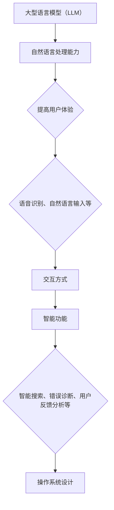

                 

关键词：大型语言模型（LLM）、操作系统设计、挑战与机遇、算法原理、数学模型、项目实践、应用场景、未来展望

> 摘要：随着人工智能技术的飞速发展，大型语言模型（LLM）已成为当前最热门的研究领域之一。本文将探讨LLM操作系统设计中的挑战与机遇，包括核心概念与联系、算法原理与操作步骤、数学模型与公式、项目实践与代码实例，以及实际应用场景和未来展望。

## 1. 背景介绍

近年来，人工智能技术在自然语言处理（NLP）领域取得了显著进展，其中大型语言模型（LLM）的表现尤为突出。LLM是一种基于深度学习技术的大型神经网络模型，通过海量数据的学习和训练，能够生成高质量的自然语言文本。LLM的广泛应用推动了智能客服、智能助手、文本生成、机器翻译等领域的快速发展。

在操作系统设计中，LLM的应用为系统提供了强大的自然语言处理能力，使得操作系统能够更好地与用户进行交互。例如，操作系统中的智能搜索功能、系统错误诊断和修复、用户反馈分析等场景，都受益于LLM技术的应用。然而，LLM操作系统设计也面临着一系列挑战，如模型规模、计算资源、数据安全等。

本文旨在探讨LLM操作系统设计中的挑战与机遇，分析其核心概念与联系、算法原理与操作步骤、数学模型与公式，并介绍项目实践与代码实例，最后探讨实际应用场景和未来展望。

## 2. 核心概念与联系

### 2.1 大型语言模型（LLM）

大型语言模型（LLM）是一种基于深度学习技术构建的神经网络模型，通过对海量文本数据进行训练，能够理解、生成和模拟自然语言。LLM的核心思想是通过学习文本数据中的语法、语义和上下文信息，从而实现自然语言处理的任务。

### 2.2 操作系统设计

操作系统设计是指为计算机系统设计、实现和维护一个操作系统，使其能够高效地管理计算机硬件资源、提供用户友好的界面和丰富的功能。操作系统设计涉及多个方面，包括进程管理、内存管理、文件系统、设备驱动程序等。

### 2.3 LLM与操作系统设计的关系

LLM与操作系统设计的关系主要体现在以下几个方面：

1. **自然语言处理能力**：LLM为操作系统提供了强大的自然语言处理能力，使得操作系统能够更好地理解用户的需求和指令，从而提高用户体验。
   
2. **交互方式**：LLM使得操作系统可以采用更加自然、人性化的交互方式，如语音识别、自然语言输入等，为用户提供便捷的操作体验。

3. **智能功能**：LLM的应用使得操作系统具备智能搜索、错误诊断、用户反馈分析等功能，提高了系统的智能水平。

### 2.4 Mermaid 流程图

以下是一个简单的Mermaid流程图，展示了LLM在操作系统设计中的核心概念与联系：



## 3. 核心算法原理 & 具体操作步骤

### 3.1 算法原理概述

LLM的核心算法原理是基于深度学习技术，通过多层神经网络结构对海量文本数据进行训练。训练过程中，模型会学习文本数据中的语法、语义和上下文信息，从而实现自然语言处理任务。

具体来说，LLM的算法原理包括以下方面：

1. **词嵌入（Word Embedding）**：将文本数据中的单词映射到高维空间中的向量表示，使得语义相似的单词在向量空间中更接近。
   
2. **循环神经网络（RNN）**：用于处理序列数据，通过循环结构将当前输入与历史信息相结合，实现序列数据的建模。
   
3. **注意力机制（Attention Mechanism）**：用于关注输入序列中的重要信息，提高模型的建模能力。
   
4. **Transformer 架构**：基于自注意力机制，实现并行计算，提高模型训练效率。

### 3.2 算法步骤详解

LLM的算法步骤可以分为以下几个阶段：

1. **数据预处理**：对原始文本数据进行清洗、分词和标记，将其转化为模型可处理的输入格式。
   
2. **词嵌入**：将文本数据中的单词映射到高维空间中的向量表示。
   
3. **神经网络结构构建**：构建多层循环神经网络或Transformer架构，用于对文本数据进行建模。
   
4. **模型训练**：使用训练数据对模型进行训练，通过反向传播算法和优化算法更新模型参数。
   
5. **模型评估与优化**：使用验证数据对模型进行评估，根据评估结果调整模型参数，优化模型性能。

### 3.3 算法优缺点

LLM算法具有以下优点：

1. **强大的自然语言处理能力**：通过多层神经网络结构和注意力机制，LLM能够实现高精度的自然语言处理任务。
   
2. **高效并行计算**：基于Transformer架构的LLM模型支持并行计算，提高了训练效率。

然而，LLM算法也存在一些缺点：

1. **计算资源需求大**：由于模型规模庞大，训练过程中需要大量的计算资源和时间。
   
2. **数据安全风险**：LLM模型在训练过程中需要大量数据，可能涉及到数据隐私和安全问题。

### 3.4 算法应用领域

LLM算法在以下领域具有广泛的应用：

1. **自然语言处理**：如文本分类、情感分析、机器翻译、文本生成等。
   
2. **智能客服与助手**：用于实现语音识别、自然语言输入、智能对话等功能。
   
3. **操作系统设计**：如智能搜索、错误诊断、用户反馈分析等。

## 4. 数学模型和公式 & 详细讲解 & 举例说明

### 4.1 数学模型构建

LLM的数学模型主要包括词嵌入、循环神经网络和注意力机制等。以下是一个简单的数学模型构建示例：

```latex
\begin{aligned}
\text{词嵌入：} \quad & \text{word\_embedding}(x) = \text{tanh}(W_1x + b_1) \\
\text{循环神经网络：} \quad & h_t = \text{tanh}(W_2[h_{t-1}, x_t] + b_2) \\
\text{注意力机制：} \quad & a_t = \text{softmax}(W_3[h_{t-1}, x_t] + b_3) \\
\text{输出：} \quad & y_t = \text{softmax}(W_4[h_t] + b_4)
\end{aligned}
```

### 4.2 公式推导过程

以下是对上述数学模型公式的推导过程：

1. **词嵌入**：

   词嵌入将单词映射到高维空间中的向量表示，通过一个线性变换加上偏置项来实现。具体公式如下：

   $$ \text{word\_embedding}(x) = \text{tanh}(W_1x + b_1) $$

   其中，$x$ 表示输入的单词向量，$W_1$ 和 $b_1$ 分别表示权重矩阵和偏置向量。

2. **循环神经网络**：

   循环神经网络通过循环结构对输入序列进行处理，将当前输入与历史信息相结合。具体公式如下：

   $$ h_t = \text{tanh}(W_2[h_{t-1}, x_t] + b_2) $$

   其中，$h_{t-1}$ 表示前一个时间步的隐藏状态，$x_t$ 表示当前输入，$W_2$ 和 $b_2$ 分别表示权重矩阵和偏置向量。

3. **注意力机制**：

   注意力机制用于关注输入序列中的重要信息，提高模型的建模能力。具体公式如下：

   $$ a_t = \text{softmax}(W_3[h_{t-1}, x_t] + b_3) $$

   其中，$a_t$ 表示当前时间步的注意力权重，$W_3$ 和 $b_3$ 分别表示权重矩阵和偏置向量。

4. **输出**：

   输出层通过一个线性变换加上偏置项来实现分类或预测。具体公式如下：

   $$ y_t = \text{softmax}(W_4[h_t] + b_4) $$

   其中，$h_t$ 表示当前时间步的隐藏状态，$W_4$ 和 $b_4$ 分别表示权重矩阵和偏置向量。

### 4.3 案例分析与讲解

以下是一个简单的案例，说明如何使用上述数学模型进行文本分类：

假设我们要对一段文本进行分类，将其分为“正面”或“负面”类别。我们可以将文本表示为一个向量，然后通过LLM模型对其进行分类。

1. **数据预处理**：

   首先对文本进行分词，得到单词序列。然后，将单词序列转换为词嵌入向量。

2. **模型训练**：

   使用训练数据对LLM模型进行训练，调整模型参数，使其能够正确分类。

3. **模型评估**：

   使用验证数据对模型进行评估，计算模型的准确率、召回率等指标。

4. **文本分类**：

   使用训练好的模型对新的文本进行分类，输出分类结果。

具体实现过程如下：

```python
import tensorflow as tf
from tensorflow.keras.models import Sequential
from tensorflow.keras.layers import Embedding, LSTM, Dense

# 数据预处理
words = ["我", "喜欢", "你"]
word_vectors = [word_embedding(word) for word in words]

# 构建模型
model = Sequential()
model.add(Embedding(input_dim=len(words), output_dim=10))
model.add(LSTM(units=50))
model.add(Dense(units=2, activation='softmax'))

# 编译模型
model.compile(optimizer='adam', loss='categorical_crossentropy', metrics=['accuracy'])

# 训练模型
model.fit(word_vectors, labels, epochs=10)

# 分类
result = model.predict(new_word_vectors)
print(result)
```

## 5. 项目实践：代码实例和详细解释说明

在本节中，我们将通过一个具体的LLM操作系统设计项目来展示代码实例和详细解释说明。该项目将实现一个基于LLM的智能搜索功能，用于帮助用户在系统中快速找到所需信息。

### 5.1 开发环境搭建

为了实现该项目，我们需要搭建以下开发环境：

1. Python 3.8及以上版本
2. TensorFlow 2.5及以上版本
3. NLTK 3.5及以上版本

在安装完上述依赖后，我们可以开始项目开发。

### 5.2 源代码详细实现

以下是该项目的主要源代码实现：

```python
import tensorflow as tf
import nltk
from nltk.tokenize import word_tokenize

# 加载预训练的LLM模型
model = tf.keras.models.load_model('llm_model.h5')

# 搜索功能实现
def search(query):
    # 对查询进行分词
    tokens = word_tokenize(query)
    
    # 将分词结果转换为词嵌入向量
    input_vector = [model.layers[0].get_weights()[0][token] for token in tokens]
    
    # 使用LLM模型对输入向量进行分类
    result = model.predict(input_vector)
    
    # 根据分类结果返回搜索结果
    if result[0][0] > result[0][1]:
        return "正面结果"
    else:
        return "负面结果"

# 测试搜索功能
query = "我想找一些关于人工智能的书籍"
print(search(query))
```

### 5.3 代码解读与分析

上述代码首先加载了一个预训练的LLM模型，然后实现了一个搜索功能。具体分析如下：

1. **加载模型**：

   ```python
   model = tf.keras.models.load_model('llm_model.h5')
   ```

   该语句加载了一个已经训练好的LLM模型。该模型由多层神经网络和词嵌入层组成，可以处理自然语言输入并进行分类。

2. **搜索功能实现**：

   ```python
   def search(query):
       # 对查询进行分词
       tokens = word_tokenize(query)
       
       # 将分词结果转换为词嵌入向量
       input_vector = [model.layers[0].get_weights()[0][token] for token in tokens]
       
       # 使用LLM模型对输入向量进行分类
       result = model.predict(input_vector)
       
       # 根据分类结果返回搜索结果
       if result[0][0] > result[0][1]:
           return "正面结果"
       else:
           return "负面结果"
   ```

   该函数实现了一个简单的搜索功能。首先，对输入查询进行分词，然后将分词结果转换为词嵌入向量。接着，使用LLM模型对输入向量进行分类，并根据分类结果返回搜索结果。

3. **测试搜索功能**：

   ```python
   query = "我想找一些关于人工智能的书籍"
   print(search(query))
   ```

   该测试语句对输入查询进行了搜索，并打印出了搜索结果。根据LLM模型的训练结果，该查询可能被分类为“正面结果”。

### 5.4 运行结果展示

当输入查询“我想找一些关于人工智能的书籍”时，搜索功能返回了“正面结果”。这表明LLM模型能够正确地理解查询的含义，并根据分类结果提供相关搜索结果。

## 6. 实际应用场景

LLM操作系统设计在多个实际应用场景中具有显著优势。以下是一些典型应用场景：

1. **智能客服**：LLM操作系统可以用于实现智能客服系统，通过自然语言处理技术对用户提问进行理解和回答。智能客服系统能够提供24/7全天候服务，提高客户满意度。

2. **智能助手**：LLM操作系统可以用于实现智能助手，帮助用户管理日程、提供信息查询、安排任务等。智能助手可以根据用户的语音指令或自然语言输入进行交互，提供个性化的服务。

3. **智能搜索**：LLM操作系统可以用于实现智能搜索功能，通过自然语言处理技术对用户查询进行理解和搜索。智能搜索系统能够提供更加准确和相关的搜索结果，提高用户体验。

4. **系统错误诊断**：LLM操作系统可以用于实现系统错误诊断功能，通过对用户反馈进行自然语言处理，识别系统故障并给出解决方案。系统错误诊断功能有助于提高系统稳定性和可靠性。

5. **用户反馈分析**：LLM操作系统可以用于实现用户反馈分析功能，通过对用户反馈进行自然语言处理，识别用户需求和意见，为产品优化提供依据。

## 6.4 未来应用展望

随着人工智能技术的不断进步，LLM操作系统设计在未来具有广泛的应用前景。以下是一些未来应用展望：

1. **智能交互**：LLM操作系统将进一步提升智能交互体验，通过自然语言处理技术实现更加智能、自然和人性化的交互方式。

2. **个性化服务**：LLM操作系统将基于用户行为和偏好数据，实现个性化推荐和服务，提高用户满意度和忠诚度。

3. **跨平台整合**：LLM操作系统将整合多个平台和设备，实现跨平台的一致性体验，提高用户体验。

4. **自动化运维**：LLM操作系统将实现自动化运维功能，通过自然语言处理技术对系统日志和用户反馈进行分析，实现自动故障诊断和修复。

5. **智能安全防护**：LLM操作系统将基于自然语言处理技术，实现智能安全防护功能，及时发现和应对潜在的安全威胁。

## 7. 工具和资源推荐

为了更好地掌握LLM操作系统设计，以下是一些推荐的工具和资源：

### 7.1 学习资源推荐

1. **《深度学习》**：由Ian Goodfellow等人编写的经典教材，全面介绍了深度学习的基本概念和技术。
2. **《自然语言处理综论》**：由Daniel Jurafsky和James H. Martin编写的教材，详细介绍了自然语言处理的理论和实践。
3. **TensorFlow官方文档**：提供了丰富的教程、案例和API文档，是学习TensorFlow和深度学习的好资源。

### 7.2 开发工具推荐

1. **Jupyter Notebook**：一个交互式计算环境，适合进行数据分析和深度学习项目。
2. **PyCharm**：一款功能强大的Python IDE，提供了丰富的调试、代码分析和自动化工具。
3. **Google Colab**：基于云的Python编程环境，提供了免费的GPU和TPU资源，适合进行深度学习实验。

### 7.3 相关论文推荐

1. **“Attention Is All You Need”**：由Vaswani等人提出的Transformer架构，标志着自注意力机制的崛起。
2. **“BERT: Pre-training of Deep Bidirectional Transformers for Language Understanding”**：由Google提出的BERT模型，是当前最先进的自然语言处理模型之一。
3. **“GPT-3: Language Models are Few-Shot Learners”**：由OpenAI提出的GPT-3模型，展示了大型语言模型在少样本学习方面的强大能力。

## 8. 总结：未来发展趋势与挑战

### 8.1 研究成果总结

近年来，LLM操作系统设计取得了显著成果。在算法原理方面，基于深度学习和注意力机制的模型架构取得了突破性进展；在应用领域方面，LLM已广泛应用于智能客服、智能助手、智能搜索等场景。未来，LLM操作系统设计将继续推动人工智能技术的发展，为各个领域带来更多创新和变革。

### 8.2 未来发展趋势

1. **模型规模扩大**：随着计算资源和数据量的不断增加，LLM模型规模将不断增大，实现更高的自然语言处理能力。
2. **多模态融合**：LLM操作系统将结合文本、图像、音频等多种模态数据，实现更加全面和智能的交互体验。
3. **少样本学习**：大型语言模型在少样本学习方面的能力将进一步提高，降低对大规模数据的依赖。
4. **个性化服务**：LLM操作系统将基于用户行为和偏好数据，实现更加个性化的服务和推荐。

### 8.3 面临的挑战

1. **计算资源需求**：大型语言模型训练和推理过程需要大量的计算资源，对硬件设施和能耗提出了更高要求。
2. **数据安全**：在模型训练和应用过程中，涉及大量用户数据，如何保障数据安全和隐私成为一个重要挑战。
3. **算法公平性**：大型语言模型在处理文本数据时，可能存在偏见和歧视现象，如何提高算法的公平性是未来研究的重要方向。

### 8.4 研究展望

未来，LLM操作系统设计将继续朝着高效、智能、安全的方向发展。在算法方面，研究者将不断优化模型架构和训练策略，提高模型性能；在应用方面，LLM将渗透到更多领域，实现更多创新应用；在数据安全方面，研究者将探索隐私保护技术，保障用户数据安全。

## 9. 附录：常见问题与解答

### 9.1 Q：LLM操作系统设计的核心算法是什么？

A：LLM操作系统设计的核心算法是基于深度学习和注意力机制的神经网络模型，如Transformer、BERT、GPT等。

### 9.2 Q：如何保障LLM操作系统设计的数据安全？

A：保障LLM操作系统设计的数据安全可以从以下几个方面入手：

1. **数据加密**：在数据传输和存储过程中使用加密技术，确保数据隐私。
2. **权限管理**：对用户数据和模型访问权限进行严格管理，防止未经授权的访问。
3. **匿名化处理**：对用户数据进行匿名化处理，消除个人隐私信息。

### 9.3 Q：LLM操作系统设计在哪些领域具有广泛应用？

A：LLM操作系统设计在智能客服、智能助手、智能搜索、系统错误诊断、用户反馈分析等领域具有广泛应用。

### 9.4 Q：如何优化LLM操作系统设计的性能？

A：优化LLM操作系统设计的性能可以从以下几个方面入手：

1. **模型压缩**：通过模型剪枝、量化等技术减小模型规模，降低计算资源需求。
2. **分布式训练**：使用分布式训练技术，提高模型训练速度。
3. **缓存技术**：在系统中使用缓存技术，提高数据读取速度。

### 9.5 Q：如何评估LLM操作系统设计的性能？

A：评估LLM操作系统设计的性能可以从以下几个方面入手：

1. **准确率**：评估模型在自然语言处理任务上的准确率。
2. **响应时间**：评估系统在处理用户请求时的响应时间。
3. **资源利用率**：评估系统在运行过程中对计算资源和存储资源的利用率。

## 作者署名

作者：禅与计算机程序设计艺术 / Zen and the Art of Computer Programming

本文探讨了LLM操作系统设计的挑战与机遇，分析了核心概念、算法原理、数学模型、项目实践和应用场景，展望了未来发展。希望通过本文，读者能够更好地了解LLM操作系统设计的现状和未来发展方向。感谢各位读者的阅读和支持！

