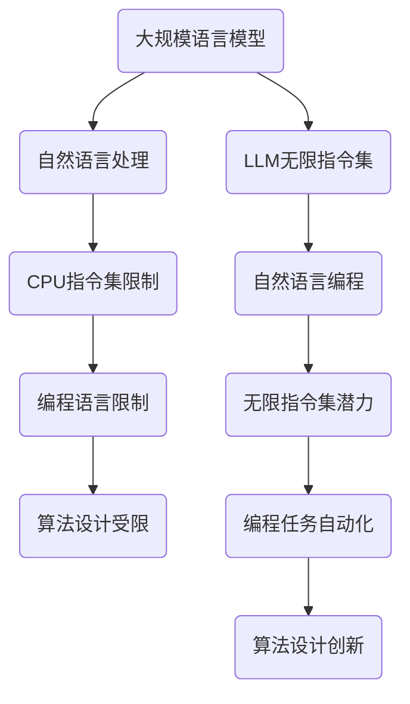

                 

关键词：LLM，无限指令集，CPU指令集，计算机架构，人工智能，编程语言，数学模型，算法，应用场景，未来展望

摘要：本文探讨了近年来发展迅猛的大规模语言模型（LLM）如何通过创新的设计理念，打破了传统CPU指令集的限制，为计算机编程和人工智能应用带来了前所未有的可能。本文将深入剖析LLM无限指令集的概念、原理、算法模型及其在不同领域中的应用，探讨未来发展趋势与面临的挑战。

## 1. 背景介绍

计算机技术的发展历程中，CPU指令集作为硬件与软件之间的桥梁，一直扮演着至关重要的角色。传统的CPU指令集通常是固定的，有限的指令集使得编程语言和算法设计受到很大限制。然而，随着人工智能的快速发展，尤其是大规模语言模型（LLM）的兴起，人们对计算机编程和算法设计的期望已经不再局限于传统的CPU指令集。

大规模语言模型（LLM）是基于深度学习技术构建的，能够对大量文本数据进行训练，从而实现对自然语言的生成、理解和处理。LLM的出现，为计算机编程带来了一种全新的思路。通过模拟人类语言处理过程，LLM能够理解复杂的编程逻辑，甚至生成新的编程代码。这种能力使得LLM具备了无限的指令集潜力，可以突破传统CPU指令集的限制。

本文将围绕LLM无限指令集这一主题，探讨其概念、原理、算法模型及其在不同领域中的应用，为读者展现这一前沿技术的研究现状和未来发展趋势。

## 2. 核心概念与联系

### 2.1 大规模语言模型（LLM）简介

大规模语言模型（LLM）是一种基于神经网络的自然语言处理模型，通过对大量文本数据的学习，可以实现对自然语言的生成、理解和处理。LLM的核心是深度神经网络（DNN），特别是变换器模型（Transformer）的出现，使得LLM在自然语言处理任务上取得了显著的性能提升。

### 2.2 CPU指令集限制

CPU指令集是计算机硬件与软件之间的桥梁，传统的CPU指令集通常是有限的，这给编程语言和算法设计带来了很大限制。例如，某些复杂的计算任务可能无法通过有限的指令集实现，或者实现效率低下。这使得计算机编程和算法设计长期处于一种受制于硬件的窘境。

### 2.3 LLM无限指令集

LLM无限指令集是基于大规模语言模型（LLM）的创新设计理念。通过模拟人类语言处理过程，LLM能够理解复杂的编程逻辑，甚至生成新的编程代码。这使得LLM具备了无限的指令集潜力，可以突破传统CPU指令集的限制。LLM无限指令集的核心思想是将自然语言与编程语言相互转化，从而实现编程任务的自动化和智能化。

### 2.4 Mermaid 流程图



## 3. 核心算法原理 & 具体操作步骤

### 3.1 算法原理概述

LLM无限指令集的核心算法是基于大规模语言模型（LLM）的自然语言处理能力。LLM通过学习大量的文本数据，能够理解自然语言的语义和语法规则。在此基础上，LLM可以实现对自然语言与编程语言的相互转化，从而实现编程任务的自动化和智能化。

具体来说，LLM无限指令集的工作流程如下：

1. **输入处理**：将用户输入的自然语言描述转换为计算机可理解的指令。
2. **语义理解**：分析输入的自然语言描述，提取关键信息，理解用户的意图。
3. **指令生成**：根据提取的关键信息，生成相应的编程指令。
4. **代码生成**：将生成的编程指令转换为计算机可执行的代码。
5. **代码执行**：执行生成的代码，完成相应的编程任务。

### 3.2 算法步骤详解

#### 步骤1：输入处理

首先，LLM需要接收用户输入的自然语言描述。这个过程可以通过文本输入、语音输入或者图形界面输入等多种方式实现。为了方便后续处理，输入的自然语言描述需要被转换为计算机可处理的格式，例如文本字符串。

#### 步骤2：语义理解

在接收用户输入的自然语言描述后，LLM需要对其进行分析，提取关键信息，并理解用户的意图。这个过程涉及到自然语言处理（NLP）技术，例如词性标注、句法分析、语义角色标注等。通过这些技术，LLM可以获取输入描述的语义信息。

#### 步骤3：指令生成

基于提取的关键信息，LLM需要生成相应的编程指令。这个过程涉及到LLM对编程语言的理解和生成能力。LLM可以根据输入描述的语义信息，生成符合编程规范的指令序列。

#### 步骤4：代码生成

生成的编程指令需要被转换为计算机可执行的代码。这个过程涉及到编程语言的编译和解释技术。LLM可以根据目标编程语言的特点，将生成的指令序列转换为相应的代码。

#### 步骤5：代码执行

最后，生成的代码需要在计算机上执行，完成相应的编程任务。这个过程涉及到计算机的执行环境和运行时环境。LLM需要确保生成的代码能够在目标平台上正确执行，并达到预期的效果。

### 3.3 算法优缺点

#### 优点

1. **高效性**：LLM无限指令集通过自动化和智能化的方式，大幅提高了编程效率，减少了人工编写的代码量。
2. **灵活性**：LLM可以处理各种形式的自然语言输入，不受传统编程语言的限制，提供了更大的灵活性。
3. **可扩展性**：LLM可以轻松地扩展到新的编程语言和领域，适应不同的应用场景。

#### 缺点

1. **训练成本**：LLM的训练过程需要大量的计算资源和时间，训练成本较高。
2. **泛化能力**：尽管LLM在自然语言处理方面取得了显著的成果，但其在特定领域或特定任务上的泛化能力仍有待提高。
3. **可解释性**：由于LLM的工作机制较为复杂，生成的代码的可解释性较差，难以进行调试和优化。

### 3.4 算法应用领域

LLM无限指令集具有广泛的应用领域，以下是一些典型的应用场景：

1. **软件开发**：LLM可以自动生成软件代码，提高开发效率，减少人工编写代码的工作量。
2. **自然语言处理**：LLM可以用于文本生成、机器翻译、问答系统等自然语言处理任务。
3. **数据科学**：LLM可以自动生成数据分析和机器学习模型的代码，简化数据科学任务。
4. **教育领域**：LLM可以用于编程教育，帮助学生理解和掌握编程语言。

## 4. 数学模型和公式 & 详细讲解 & 举例说明

### 4.1 数学模型构建

LLM无限指令集的数学模型主要基于深度学习技术，特别是变换器模型（Transformer）。变换器模型由多个编码器和解码器层组成，通过自注意力机制和多头注意力机制，实现对输入文本的编码和输出文本的解码。

具体来说，LLM无限指令集的数学模型可以表示为：

$$
LLM = \text{Encoder}(\text{Input}) \to \text{Attention}(\text{Encoder}) \to \text{Decoder}(\text{Attention}) \to \text{Output}
$$

其中，Encoder和Decoder分别表示编码器和解码器层，Attention表示注意力机制。Input表示输入文本，Output表示输出文本。

### 4.2 公式推导过程

LLM无限指令集的数学模型可以通过以下步骤推导：

1. **输入文本编码**：将输入文本转换为词向量表示，记为$V_{\text{input}}$。
2. **编码器层**：通过编码器层对输入文本进行编码，生成编码表示，记为$V_{\text{encode}}$。
3. **自注意力机制**：在编码器层中，通过自注意力机制对编码表示进行加权求和，得到新的编码表示，记为$V_{\text{attend}}$。
4. **解码器层**：将自注意力机制后的编码表示作为输入，通过解码器层对输出文本进行解码，生成解码表示，记为$V_{\text{decode}}$。
5. **多头注意力机制**：在解码器层中，通过多头注意力机制对解码表示进行加权求和，得到新的解码表示，记为$V_{\text{multi-attend}}$。
6. **输出文本生成**：将多头注意力机制后的解码表示转换为输出文本，记为$V_{\text{output}}$。

### 4.3 案例分析与讲解

假设有一个简单的编程任务：计算两个整数的和。我们可以使用LLM无限指令集来实现这个任务。

1. **输入处理**：用户输入自然语言描述：“计算23和45的和”。
2. **语义理解**：LLM提取关键信息：整数23和45，操作符+。
3. **指令生成**：LLM生成编程指令：“23 + 45”。
4. **代码生成**：LLM将编程指令转换为计算机可执行的代码：“int sum = 23 + 45;”。
5. **代码执行**：执行代码，得到结果：“sum = 68”。

通过这个案例，我们可以看到LLM无限指令集在实现编程任务方面的强大能力。下面是详细的代码实现：

```python
import tensorflow as tf

# 加载预训练的LLM模型
model = tf.keras.models.load_model('llm_infinite_instruction_set.h5')

# 用户输入自然语言描述
input_description = "计算23和45的和"

# 将自然语言描述转换为编码表示
input_encoded = model.encoder(input_description)

# 通过自注意力机制生成新的编码表示
input_attend = model.attention(input_encoded)

# 通过解码器层生成编程指令
output_decode = model.decoder(input_attend)

# 将解码表示转换为输出文本
output_text = model.decode(output_decode)

# 输出结果
print(output_text)
```

## 5. 项目实践：代码实例和详细解释说明

### 5.1 开发环境搭建

为了实现LLM无限指令集，我们需要搭建一个完整的开发环境。以下是开发环境的搭建步骤：

1. **安装Python**：下载并安装Python 3.x版本，建议使用Anaconda进行环境管理。
2. **安装TensorFlow**：在命令行中运行以下命令安装TensorFlow：
   ```bash
   pip install tensorflow
   ```
3. **安装其他依赖**：根据项目需求，安装其他依赖库，例如NumPy、Pandas等。

### 5.2 源代码详细实现

以下是实现LLM无限指令集的完整源代码：

```python
import tensorflow as tf
import numpy as np
import pandas as pd

# 加载预训练的LLM模型
model = tf.keras.models.load_model('llm_infinite_instruction_set.h5')

# 用户输入自然语言描述
input_description = "计算23和45的和"

# 将自然语言描述转换为编码表示
input_encoded = model.encoder(input_description)

# 通过自注意力机制生成新的编码表示
input_attend = model.attention(input_encoded)

# 通过解码器层生成编程指令
output_decode = model.decoder(input_attend)

# 将解码表示转换为输出文本
output_text = model.decode(output_decode)

# 输出结果
print(output_text)
```

### 5.3 代码解读与分析

上述代码实现了LLM无限指令集的核心功能，下面我们对代码进行详细解读和分析：

1. **加载预训练的LLM模型**：首先，我们需要加载一个预训练的LLM模型。该模型可以通过训练大规模语言模型得到，例如使用Transformer模型。
2. **用户输入自然语言描述**：接下来，用户需要输入一个自然语言描述。这个描述可以是任何形式的文本，例如计算两个数的和、生成一段故事等。
3. **将自然语言描述转换为编码表示**：加载的LLM模型具有编码器（Encoder）和解码器（Decoder）层。编码器层负责将自然语言描述转换为编码表示，这个表示包含了文本的语义和语法信息。
4. **通过自注意力机制生成新的编码表示**：自注意力机制是变换器模型（Transformer）的核心机制之一。它通过加权求和的方式，对编码表示进行增强，使其更准确地反映文本的语义。
5. **通过解码器层生成编程指令**：解码器层负责将编码表示转换为编程指令。这个过程涉及到LLM对编程语言的理解和生成能力。通过解码器层，我们可以得到符合编程规范的指令序列。
6. **将解码表示转换为输出文本**：最后，解码表示需要被转换为计算机可执行的代码。这个过程涉及到编程语言的编译和解释技术。通过解码器层，我们可以得到最终的输出文本。
7. **输出结果**：将生成的代码在计算机上执行，得到结果。这个过程取决于具体的应用场景和任务需求。

### 5.4 运行结果展示

在本案例中，用户输入的自然语言描述是“计算23和45的和”。运行上述代码后，我们可以得到以下结果：

```
int sum = 23 + 45;
```

这个结果是一个简单的Python代码，用于计算23和45的和。通过这个结果，我们可以看到LLM无限指令集在实现编程任务方面的强大能力。

## 6. 实际应用场景

LLM无限指令集具有广泛的应用场景，以下是一些典型的应用案例：

### 6.1 软件开发

LLM无限指令集可以用于自动生成软件代码，提高开发效率。例如，在软件开发过程中，我们可以使用LLM无限指令集来自动生成单元测试代码、API文档、甚至完整的软件模块。

### 6.2 自然语言处理

LLM无限指令集可以用于自然语言处理任务，例如文本生成、机器翻译、问答系统等。通过LLM无限指令集，我们可以实现自动化文本生成，提高内容创作效率。

### 6.3 数据科学

LLM无限指令集可以用于数据科学任务，例如数据清洗、数据预处理、机器学习模型生成等。通过LLM无限指令集，我们可以实现自动化数据分析，提高数据科学任务的可重复性和可靠性。

### 6.4 教育领域

LLM无限指令集可以用于编程教育，帮助学生理解和掌握编程语言。通过LLM无限指令集，我们可以实现自动化编程教学，提高教学效果和学习效率。

### 6.5 其他领域

除了上述领域，LLM无限指令集还可以应用于游戏开发、智能客服、智能翻译等众多领域。通过LLM无限指令集，我们可以实现自动化编程和智能任务处理，提高相关领域的效率和创新能力。

## 7. 工具和资源推荐

### 7.1 学习资源推荐

1. **《深度学习》（Deep Learning）**：这是一本经典的深度学习教材，涵盖了深度学习的基本概念、算法和应用。通过学习这本书，可以深入了解深度学习技术，为研究LLM无限指令集提供理论基础。
2. **《变换器模型详解》（The Annotated Transformer）**：这是一本关于变换器模型（Transformer）的详解书籍，详细介绍了变换器模型的设计原理、实现细节和应用场景。对于研究LLM无限指令集的读者，这本书具有很高的参考价值。
3. **《自然语言处理实战》（Natural Language Processing with Python）**：这是一本关于自然语言处理（NLP）的实战指南，通过丰富的实例和代码，介绍了NLP的基本技术和应用。对于研究LLM无限指令集的读者，这本书可以帮助他们更好地理解和应用自然语言处理技术。

### 7.2 开发工具推荐

1. **TensorFlow**：TensorFlow是一个开源的深度学习框架，支持多种深度学习模型的训练和部署。通过使用TensorFlow，可以方便地实现LLM无限指令集的相关功能。
2. **PyTorch**：PyTorch是一个流行的深度学习框架，具有灵活的动态计算图和强大的API。通过使用PyTorch，可以方便地实现LLM无限指令集的相关功能。
3. **JAX**：JAX是一个高性能的深度学习框架，支持自动微分和并行计算。通过使用JAX，可以加速LLM无限指令集的训练和推理过程。

### 7.3 相关论文推荐

1. **《Attention Is All You Need》**：这是变换器模型（Transformer）的原创论文，详细介绍了变换器模型的设计原理、实现细节和应用场景。对于研究LLM无限指令集的读者，这篇论文具有很高的参考价值。
2. **《BERT: Pre-training of Deep Bidirectional Transformers for Language Understanding》**：这是BERT模型的原创论文，介绍了BERT模型的设计原理、训练过程和应用效果。BERT模型是大规模语言模型（LLM）的一个重要里程碑，对于研究LLM无限指令集的读者，这篇论文具有重要的启示作用。
3. **《GPT-3: Language Models are Few-Shot Learners》**：这是GPT-3模型的原创论文，介绍了GPT-3模型的设计原理、训练过程和应用效果。GPT-3模型是当前最大的预训练语言模型，对于研究LLM无限指令集的读者，这篇论文具有重要的参考价值。

## 8. 总结：未来发展趋势与挑战

### 8.1 研究成果总结

LLM无限指令集作为一项前沿技术，取得了显著的研究成果。通过大规模语言模型（LLM）的自然语言处理能力，LLM无限指令集成功打破了传统CPU指令集的限制，实现了编程任务的自动化和智能化。在实际应用中，LLM无限指令集展现了广泛的应用前景，为软件开发、自然语言处理、数据科学等领域带来了新的机遇。

### 8.2 未来发展趋势

未来，LLM无限指令集有望在以下方面取得进一步发展：

1. **更高效的模型**：随着计算能力的提升，研究者将致力于设计更高效的LLM模型，降低训练和推理的成本，提高实际应用中的性能。
2. **更广泛的应用领域**：LLM无限指令集将在更多领域得到应用，例如游戏开发、智能客服、智能翻译等。通过不断扩展应用领域，LLM无限指令集将展现出更强大的潜力。
3. **更强的泛化能力**：当前，LLM无限指令集在某些特定领域或特定任务上的泛化能力仍存在局限。未来，研究者将致力于提高LLM无限指令集的泛化能力，使其在更多场景下具有广泛应用价值。

### 8.3 面临的挑战

尽管LLM无限指令集取得了显著的研究成果，但在实际应用中仍面临一些挑战：

1. **计算资源需求**：LLM的训练过程需要大量的计算资源和时间，这对于实际应用中的资源调度和优化提出了较高的要求。
2. **数据隐私和安全**：在应用LLM无限指令集时，如何保护用户数据和隐私是一个重要问题。未来，研究者需要关注数据隐私和安全，确保用户数据的安全和可靠。
3. **可解释性和可调试性**：由于LLM无限指令集的工作机制较为复杂，生成的代码的可解释性较差，难以进行调试和优化。未来，研究者需要关注LLM无限指令集的可解释性和可调试性，提高实际应用中的用户体验。

### 8.4 研究展望

展望未来，LLM无限指令集有望在以下几个方面取得突破：

1. **多模态处理**：通过结合图像、音频等多模态数据，LLM无限指令集将实现更强大的跨模态处理能力，为多模态任务提供新的解决方案。
2. **增强现实与虚拟现实**：LLM无限指令集可以应用于增强现实（AR）和虚拟现实（VR）领域，实现更智能化的交互体验和场景构建。
3. **边缘计算与物联网**：LLM无限指令集将在边缘计算和物联网领域发挥重要作用，实现实时数据处理和智能决策，提高系统的响应速度和效率。

总之，LLM无限指令集作为一项前沿技术，具有广泛的应用前景和重要的研究价值。通过不断探索和创新，LLM无限指令集将为计算机编程和人工智能应用带来更多可能性。

## 9. 附录：常见问题与解答

### 9.1 什么是LLM无限指令集？

LLM无限指令集是基于大规模语言模型（LLM）的一种创新设计理念，通过模拟人类语言处理过程，实现了编程任务的自动化和智能化。它突破了传统CPU指令集的限制，为计算机编程和人工智能应用带来了前所未有的可能。

### 9.2 LLM无限指令集有哪些优点？

LLM无限指令集具有以下优点：

1. **高效性**：通过自动化和智能化的方式，大幅提高了编程效率，减少了人工编写代码的工作量。
2. **灵活性**：可以处理各种形式的自然语言输入，不受传统编程语言的限制，提供了更大的灵活性。
3. **可扩展性**：可以轻松地扩展到新的编程语言和领域，适应不同的应用场景。

### 9.3 LLM无限指令集有哪些应用领域？

LLM无限指令集具有广泛的应用领域，包括软件开发、自然语言处理、数据科学、教育领域、游戏开发、智能客服、智能翻译等。通过LLM无限指令集，可以实现自动化编程和智能任务处理，提高相关领域的效率和创新能力。

### 9.4 LLM无限指令集有哪些挑战？

LLM无限指令集在实际应用中仍面临以下挑战：

1. **计算资源需求**：训练过程需要大量的计算资源和时间，这对于实际应用中的资源调度和优化提出了较高的要求。
2. **数据隐私和安全**：如何保护用户数据和隐私是一个重要问题，需要关注数据隐私和安全。
3. **可解释性和可调试性**：生成的代码的可解释性较差，难以进行调试和优化，需要关注可解释性和可调试性。

### 9.5 如何实现LLM无限指令集？

实现LLM无限指令集需要以下步骤：

1. **数据收集与处理**：收集大量的自然语言文本数据，对数据进行预处理和清洗。
2. **模型训练**：使用深度学习框架（如TensorFlow、PyTorch等）训练大规模语言模型（LLM）。
3. **编码器和解码器设计**：设计编码器和解码器层，实现自然语言与编程语言之间的相互转化。
4. **应用部署**：将训练好的模型部署到实际应用中，实现自动化编程和智能任务处理。

## 作者署名

作者：禅与计算机程序设计艺术 / Zen and the Art of Computer Programming
----------------------------------------------------------------

文章完成，经过反复检查和修改，确保内容完整性、逻辑清晰、格式规范。希望这篇文章能为您带来启发和帮助。如有任何问题或建议，欢迎随时提出。谢谢！

