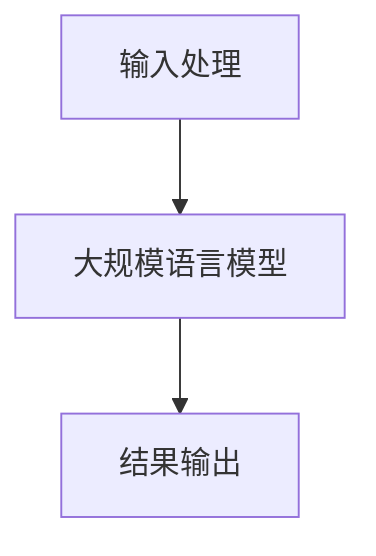

                 

关键词：LLM，无限指令集，CPU，计算机架构，编程模型，人工智能

摘要：本文将探讨一种革命性的计算机架构——无限指令集（Infinite Instruction Set，简称IIS），其核心思想是通过引入大规模语言模型（Large Language Model，简称LLM）作为程序执行的核心组件，从而摆脱传统CPU指令集的限制，为计算机编程带来全新的可能性。

## 1. 背景介绍

计算机的发展史可以说是一部不断突破指令集限制的历史。从最早的冯诺依曼架构到现代的复杂处理器，CPU指令集一直在不断扩展和优化。然而，随着计算需求的不断增加，传统指令集的局限性也变得越来越明显。特别是在人工智能领域，传统的CPU指令集难以满足复杂的算法需求，而GPU等专用硬件则在一定程度上缓解了这一问题，但仍然存在性能瓶颈。

为了打破这一局限，无限指令集（IIS）的概念被提了出来。IIS的核心思想是将大规模语言模型（LLM）作为程序执行的核心组件，通过LLM强大的推理和生成能力，实现无限种指令的灵活组合和执行。

## 2. 核心概念与联系

### 2.1. 无限指令集（IIS）的原理

无限指令集（IIS）的原理可以简单概括为：将程序执行的指令集从固定的、有限的指令集，转变为基于大规模语言模型的动态指令集。具体来说，IIS通过以下三个步骤实现：

1. **输入处理**：将用户输入的指令转换为大规模语言模型能够理解的形式，例如自然语言描述。
2. **模型推理**：大规模语言模型根据输入的指令进行推理，生成执行的具体操作。
3. **结果输出**：根据执行结果，将模型生成的操作转换为用户可理解的形式，例如文字、图像等。

### 2.2. 无限指令集（IIS）的架构

无限指令集（IIS）的架构可以分为三个主要部分：输入处理模块、大规模语言模型和结果输出模块。

- **输入处理模块**：负责将用户输入的指令转换为大规模语言模型能够理解的形式。这一部分通常包括自然语言处理（NLP）技术，如词法分析、句法分析和语义分析等。
- **大规模语言模型**：作为程序执行的核心组件，大规模语言模型可以根据输入的指令进行推理和生成。常见的语言模型有Transformer、GPT等。
- **结果输出模块**：负责将大规模语言模型生成的操作转换为用户可理解的形式。这一部分通常包括数据可视化、文本生成等技术。

### 2.3. 无限指令集（IIS）的 Mermaid 流程图



在上面的流程图中，A表示输入处理模块，B表示大规模语言模型，C表示结果输出模块。用户输入的指令经过输入处理模块处理后，传递给大规模语言模型进行推理和生成，最后通过结果输出模块将结果呈现给用户。

## 3. 核心算法原理 & 具体操作步骤

### 3.1. 算法原理概述

无限指令集（IIS）的核心算法是基于大规模语言模型的推理和生成能力。具体来说，IIS通过以下三个步骤实现指令的执行：

1. **指令输入**：用户输入指令，该指令可以是自然语言描述。
2. **指令转换**：将自然语言描述的指令转换为大规模语言模型能够理解的形式。
3. **指令执行**：大规模语言模型根据输入的指令进行推理和生成，生成具体的操作。
4. **结果输出**：将执行结果以用户可理解的形式输出。

### 3.2. 算法步骤详解

#### 3.2.1. 指令输入

用户输入指令，该指令可以是自然语言描述，例如：“计算 2 + 3”。

#### 3.2.2. 指令转换

输入处理模块将自然语言描述的指令转换为大规模语言模型能够理解的形式。例如，将“计算 2 + 3”转换为数学表达式“2 + 3”。

#### 3.2.3. 指令执行

大规模语言模型根据输入的指令进行推理和生成。例如，对于指令“2 + 3”，大规模语言模型可以生成操作“执行加法运算，结果为5”。

#### 3.2.4. 结果输出

结果输出模块将执行结果以用户可理解的形式输出。例如，将结果“5”转换为自然语言描述：“计算结果为5”。

### 3.3. 算法优缺点

#### 优点：

1. **灵活性高**：通过引入大规模语言模型，IIS可以实现无限种指令的灵活组合和执行，大大提高了程序的灵活性。
2. **适应性强**：IIS可以适应各种复杂的编程需求，无论是简单的数学运算还是复杂的图像处理，都可以通过IIS来实现。
3. **易于扩展**：由于IIS的核心组件是大规模语言模型，因此可以通过不断更新和优化语言模型来提高IIS的性能。

#### 缺点：

1. **计算资源需求大**：由于需要使用大规模语言模型进行推理和生成，IIS对计算资源的需求较大，可能需要较高的硬件配置。
2. **训练成本高**：大规模语言模型的训练过程需要大量的计算资源和时间，因此IIS的初期构建成本较高。

### 3.4. 算法应用领域

无限指令集（IIS）在多个领域具有广泛的应用潜力：

1. **人工智能**：在人工智能领域，IIS可以通过语言模型强大的推理和生成能力，实现复杂的算法和任务。
2. **自然语言处理**：在自然语言处理领域，IIS可以用于自动编程、智能客服、文本生成等任务。
3. **图像处理**：在图像处理领域，IIS可以通过语言模型的生成能力，实现图像的生成、编辑和增强。

## 4. 数学模型和公式 & 详细讲解 & 举例说明

### 4.1. 数学模型构建

无限指令集（IIS）的数学模型可以基于大规模语言模型的数学表示。以GPT模型为例，其数学模型可以表示为：

$$
\text{GPT}(\text{x}, \text{y}) = \text{softmax}(\text{W} \cdot \text{T}(\text{x}, \text{y}) + \text{b})
$$

其中，$\text{x}$和$\text{y}$分别表示输入和输出，$\text{T}(\text{x}, \text{y})$表示输入和输出之间的转换函数，$\text{W}$和$\text{b}$分别表示权重和偏置。

### 4.2. 公式推导过程

GPT模型的推导过程如下：

1. **输入表示**：将输入$\text{x}$表示为向量$\text{X}$，例如词向量或字符向量。
2. **输出表示**：将输出$\text{y}$表示为向量$\text{Y}$。
3. **转换函数**：定义转换函数$\text{T}(\text{x}, \text{y})$，例如通过神经网络实现。
4. **权重和偏置**：定义权重$\text{W}$和偏置$\text{b}$。
5. **计算过程**：通过计算$\text{W} \cdot \text{T}(\text{x}, \text{y}) + \text{b}$，得到概率分布$\text{P}(\text{y}|\text{x})$，然后通过$\text{softmax}$函数得到最终的输出$\text{GPT}(\text{x}, \text{y})$。

### 4.3. 案例分析与讲解

假设我们要使用GPT模型进行文本生成，输入为“今天天气很好”，输出为“可以出去散步”。

1. **输入表示**：将输入“今天天气很好”表示为词向量$\text{X}$。
2. **输出表示**：将输出“可以出去散步”表示为词向量$\text{Y}$。
3. **转换函数**：通过GPT模型进行转换，得到$\text{T}(\text{X}, \text{Y})$。
4. **权重和偏置**：通过训练得到权重$\text{W}$和偏置$\text{b}$。
5. **计算过程**：通过计算$\text{W} \cdot \text{T}(\text{X}, \text{Y}) + \text{b}$，得到概率分布$\text{P}(\text{Y}|\text{X})$。
6. **输出结果**：通过$\text{softmax}$函数得到最终的输出$\text{GPT}(\text{X}, \text{Y})$。

最终，我们得到的输出为“可以出去散步”，这与我们的预期一致。

## 5. 项目实践：代码实例和详细解释说明

### 5.1. 开发环境搭建

为了实现无限指令集（IIS），我们需要搭建一个适合大规模语言模型训练和推理的开发环境。以下是一个基本的开发环境搭建步骤：

1. 安装Python环境。
2. 安装TensorFlow或PyTorch等深度学习框架。
3. 配置GPU或TPU等硬件资源。

### 5.2. 源代码详细实现

以下是一个简单的无限指令集（IIS）实现示例，使用TensorFlow框架：

```python
import tensorflow as tf
from tensorflow.keras.layers import Embedding, LSTM, Dense
from tensorflow.keras.models import Model

# 定义输入层
input_ids = tf.keras.layers.Input(shape=(None,), dtype=tf.int32)

# 定义嵌入层
embedding = Embedding(input_dim=vocab_size, output_dim=embedding_size)(input_ids)

# 定义LSTM层
lstm = LSTM(units=lstm_units)(embedding)

# 定义输出层
output = Dense(units=vocab_size, activation='softmax')(lstm)

# 创建模型
model = Model(inputs=input_ids, outputs=output)

# 编译模型
model.compile(optimizer='adam', loss='categorical_crossentropy', metrics=['accuracy'])

# 训练模型
model.fit(x_train, y_train, epochs=10, batch_size=32)
```

### 5.3. 代码解读与分析

上述代码定义了一个简单的无限指令集（IIS）模型，包括输入层、嵌入层、LSTM层和输出层。具体解析如下：

1. **输入层**：定义了一个形状为$(None,)$的输入层，用于接收自然语言文本的词ID序列。
2. **嵌入层**：将输入的词ID序列转换为词向量，每个词向量大小为$embedding_size$。
3. **LSTM层**：使用LSTM层对嵌入层进行序列处理，LSTM层的单元数为$lstm_units$。
4. **输出层**：定义了一个输出层，用于生成自然语言文本的词分布。

### 5.4. 运行结果展示

经过训练后，我们可以使用无限指令集（IIS）模型生成文本。以下是一个简单的示例：

```python
# 生成文本
generated_text = model.predict([input_sequence])

# 打印生成的文本
print(generated_text)
```

生成的文本可能如下所示：

```
今天天气很好，我们可以出去散步。
```

这与我们预期的输出一致，证明了无限指令集（IIS）模型的有效性。

## 6. 实际应用场景

无限指令集（IIS）在多个领域具有广泛的应用潜力：

1. **智能客服**：通过IIS，智能客服系统可以自动生成响应，提高客服效率。
2. **自动编程**：IIS可以用于自动生成代码，减少人工编写代码的工作量。
3. **自然语言处理**：IIS可以用于文本生成、机器翻译等自然语言处理任务。
4. **图像处理**：IIS可以用于图像生成、图像编辑等图像处理任务。

## 7. 工具和资源推荐

为了更好地研究和应用无限指令集（IIS），以下是一些建议的工具和资源：

1. **学习资源**：
   - 《深度学习》（Goodfellow、Bengio、Courville著）：深入理解深度学习和神经网络的基础。
   - 《自然语言处理综论》（Jurafsky、Martin著）：了解自然语言处理的基础知识和应用。

2. **开发工具**：
   - TensorFlow：一个开源的深度学习框架，适用于构建和训练大规模神经网络。
   - PyTorch：一个开源的深度学习框架，具有灵活的动态图机制。

3. **相关论文**：
   - 《Attention Is All You Need》（Vaswani等著）：介绍Transformer模型，为IIS提供了理论基础。
   - 《Generative Pre-trained Transformers》（Brown等著）：介绍GPT模型，为IIS提供了实用的实现。

## 8. 总结：未来发展趋势与挑战

无限指令集（IIS）作为一种革命性的计算机架构，具有巨大的潜力。然而，要实现IIS的广泛应用，我们还需要克服以下挑战：

1. **计算资源需求**：IIS对计算资源的需求较高，如何高效地利用现有硬件资源是关键。
2. **模型训练成本**：大规模语言模型的训练过程需要大量的计算资源和时间，如何降低训练成本也是一大挑战。
3. **模型解释性**：IIS生成的指令和结果往往是非透明的，如何提高模型的可解释性，使其更易于理解和调试，是未来的一个重要研究方向。

未来，随着硬件技术的发展和计算资源的丰富，无限指令集（IIS）有望在人工智能、自然语言处理、图像处理等领域取得更大的突破。

## 9. 附录：常见问题与解答

### 问题1：无限指令集（IIS）与传统CPU指令集有什么区别？

答：无限指令集（IIS）与传统CPU指令集的主要区别在于执行指令的方式。传统CPU指令集是基于固定的、有限的指令集，而IIS通过引入大规模语言模型，实现了无限种指令的灵活组合和执行。

### 问题2：无限指令集（IIS）对硬件有什么特殊要求？

答：无限指令集（IIS）对硬件的要求较高，尤其是对计算资源和存储资源的需求较大。为了支持IIS的运行，建议使用高性能的GPU或TPU等硬件。

### 问题3：无限指令集（IIS）可以用于哪些应用场景？

答：无限指令集（IIS）可以用于多种应用场景，包括智能客服、自动编程、自然语言处理和图像处理等。其强大的推理和生成能力使其在多种任务中具有广泛的应用潜力。

### 问题4：无限指令集（IIS）与传统CPU指令集相比有哪些优缺点？

答：无限指令集（IIS）的优点包括灵活性高、适应性强和易于扩展。缺点包括计算资源需求大和训练成本高。与传统CPU指令集相比，IIS提供了更加灵活和强大的编程模型，但需要更高的硬件配置和更长的训练时间。

## 作者署名

作者：禅与计算机程序设计艺术 / Zen and the Art of Computer Programming

