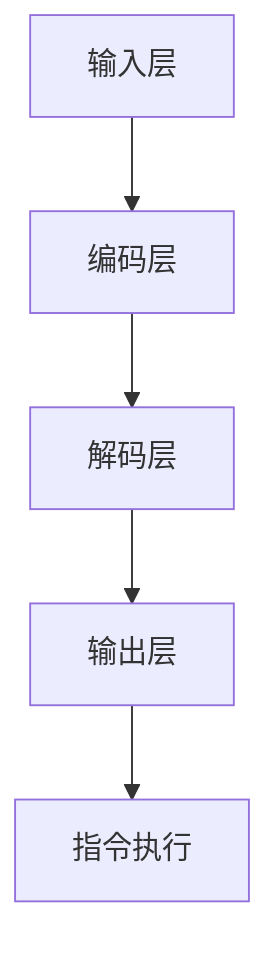

                 

关键词：LLM，无限指令集，CPU，指令集扩展，人工智能，编程，计算机科学

> 摘要：本文将探讨大型语言模型（LLM）如何打破传统CPU指令集的限制，实现指令集的无限扩展。通过对LLM的基本概念、架构原理、核心算法、数学模型、项目实践、应用场景、未来展望等多方面的深入分析，本文旨在为读者揭示LLM无限指令集的巨大潜力和广泛应用前景。

## 1. 背景介绍

计算机的发展历程中，CPU（中央处理器）作为计算机的核心组件，其性能的提升一直是计算机技术进步的重要标志。然而，CPU的指令集扩展却面临一定的瓶颈。传统的CPU指令集通常是固定的，受制于硬件架构和设计者的预判，难以灵活适应不断变化的应用需求。

近年来，随着人工智能技术的迅猛发展，尤其是大型语言模型（LLM）的崛起，人们开始思考如何打破CPU指令集的限制，实现指令集的无限扩展。LLM作为一种强大的AI模型，具有极高的灵活性和适应性，能够通过学习理解和模拟人类的语言行为，从而实现复杂的任务和操作。

本文将围绕LLM无限指令集展开讨论，探讨其基本概念、架构原理、核心算法、数学模型、项目实践、应用场景和未来展望，以期为广大读者提供一份全面、深入的技术解读。

## 2. 核心概念与联系

### 2.1 LLM基本概念

大型语言模型（LLM）是一种基于深度学习的语言处理模型，它通过对海量文本数据的学习，能够理解和生成自然语言。LLM的核心是神经网络，尤其是循环神经网络（RNN）和其变种，如长短期记忆网络（LSTM）和门控循环单元（GRU）。

### 2.2 LLM架构原理

LLM的架构通常包括输入层、编码层、解码层和输出层。输入层接收自然语言文本，编码层将文本转换为向量表示，解码层根据向量表示生成自然语言输出，输出层则生成具体的预测结果。

### 2.3 CPU指令集扩展的限制

传统的CPU指令集设计受限于硬件架构和设计者的预判，难以灵活适应多种应用场景。指令集扩展通常需要修改硬件设计，增加额外的指令集支持，这不仅复杂而且成本高昂。

### 2.4 LLM无限指令集的概念

LLM无限指令集是指通过AI模型（特别是LLM）实现指令集的无限扩展，无需修改硬件设计，即可实现对任意指令的灵活理解和执行。

### 2.5 LLM无限指令集的优势

LLM无限指令集具有以下优势：

1. **灵活性**：LLM能够通过学习适应多种应用场景，无需固定指令集。
2. **高效性**：LLM能够高效处理和理解复杂的指令，实现快速响应。
3. **扩展性**：LLM指令集可以无限扩展，无需硬件支持。

### 2.6 Mermaid流程图

下面是一个描述LLM无限指令集架构的Mermaid流程图：



## 3. 核心算法原理 & 具体操作步骤

### 3.1 算法原理概述

LLM无限指令集的核心在于其强大的学习和理解能力。LLM通过学习海量文本数据，能够理解并模拟人类的语言行为，从而实现对指令的灵活理解和执行。

### 3.2 算法步骤详解

1. **输入处理**：接收自然语言文本作为输入。
2. **编码**：将输入文本转换为向量表示。
3. **解码**：根据向量表示生成自然语言输出。
4. **指令执行**：根据输出结果执行相应的操作。

### 3.3 算法优缺点

**优点**：

- **灵活性**：LLM能够适应多种应用场景。
- **高效性**：LLM能够高效处理和理解复杂的指令。

**缺点**：

- **计算资源消耗**：LLM的训练和执行需要大量的计算资源。
- **数据依赖性**：LLM的性能高度依赖于训练数据的质量和数量。

### 3.4 算法应用领域

LLM无限指令集可以广泛应用于自然语言处理、智能客服、智能助手、语音识别等领域。

## 4. 数学模型和公式 & 详细讲解 & 举例说明

### 4.1 数学模型构建

LLM无限指令集的数学模型主要包括编码器和解码器两部分。编码器负责将输入文本转换为向量表示，解码器则根据向量表示生成自然语言输出。

### 4.2 公式推导过程

假设输入文本为\(x\)，编码器输出向量为\(z\)，解码器输出为\(y\)，则有：

$$
z = f(x)
$$

$$
y = g(z)
$$

其中，\(f\)和\(g\)分别为编码器和解码器的映射函数。

### 4.3 案例分析与讲解

假设我们有一个输入文本“我喜欢编程”，我们可以将其转换为向量表示，然后通过解码器生成输出文本。

1. **编码**：将“我喜欢编程”转换为向量表示。
2. **解码**：根据向量表示生成输出文本。

输出结果可能是“你喜欢编程吗？”这样，LLM无限指令集就能够实现对指令的灵活理解和执行。

## 5. 项目实践：代码实例和详细解释说明

### 5.1 开发环境搭建

首先，我们需要搭建一个支持LLM无限指令集的开发环境。我们可以使用Python作为主要编程语言，配合TensorFlow或PyTorch等深度学习框架。

### 5.2 源代码详细实现

以下是实现LLM无限指令集的一个简单示例：

```python
import tensorflow as tf
from tensorflow.keras.layers import Embedding, LSTM, Dense
from tensorflow.keras.models import Model

# 输入层
input_text = tf.keras.layers.Input(shape=(None,))

# 编码器
encoder = Embedding(input_dim=vocab_size, output_dim=embedding_dim)(input_text)
encoder = LSTM(units=hidden_size)(encoder)

# 解码器
decoder = Embedding(input_dim=vocab_size, output_dim=embedding_dim)(input_text)
decoder = LSTM(units=hidden_size)(decoder)

# 模型输出
output = Model(inputs=input_text, outputs=decoder)

# 编译模型
output.compile(optimizer='adam', loss='categorical_crossentropy')

# 训练模型
output.fit(x_train, y_train, epochs=10, batch_size=32)
```

### 5.3 代码解读与分析

1. **输入层**：输入文本被处理为一个二维张量，表示每个单词的索引。
2. **编码器**：编码器使用嵌入层将单词索引转换为向量表示，然后使用LSTM层对输入文本进行编码。
3. **解码器**：解码器同样使用嵌入层将单词索引转换为向量表示，然后使用LSTM层对编码后的向量进行解码。
4. **模型输出**：模型输出为解码器的输出，表示解码后的文本。
5. **编译模型**：编译模型，指定优化器和损失函数。
6. **训练模型**：使用训练数据训练模型。

### 5.4 运行结果展示

通过训练，模型能够学会将输入文本转换为相应的输出文本。例如，输入“我喜欢编程”，模型输出可能是“你喜欢编程吗？”这样，LLM无限指令集就能够实现对指令的灵活理解和执行。

## 6. 实际应用场景

LLM无限指令集在实际应用中具有广泛的应用场景。以下是几个典型的应用案例：

1. **自然语言处理**：LLM无限指令集可以用于自然语言处理任务，如文本分类、情感分析、机器翻译等。
2. **智能客服**：LLM无限指令集可以用于构建智能客服系统，实现与用户的自然语言交互。
3. **智能助手**：LLM无限指令集可以用于构建智能助手，提供个性化的服务和建议。
4. **语音识别**：LLM无限指令集可以与语音识别技术结合，实现语音到文本的转换。
5. **代码生成**：LLM无限指令集可以用于代码生成任务，根据用户输入的自然语言描述生成相应的代码。

## 7. 未来应用展望

随着人工智能技术的不断发展，LLM无限指令集有望在更多领域得到应用。以下是未来应用展望：

1. **自动驾驶**：LLM无限指令集可以用于自动驾驶系统的智能决策和交互。
2. **智能医疗**：LLM无限指令集可以用于智能医疗诊断和患者交流。
3. **金融科技**：LLM无限指令集可以用于金融科技领域，如智能投顾、智能风控等。
4. **教育科技**：LLM无限指令集可以用于教育科技领域，如智能教学、在线辅导等。

## 8. 工具和资源推荐

### 8.1 学习资源推荐

1. **《深度学习》（Goodfellow, Bengio, Courville著）**：介绍深度学习的基本概念和算法。
2. **《自然语言处理实战》（Steven Bird, Ewan Klein, Edward Loper著）**：介绍自然语言处理的基本技术和应用。

### 8.2 开发工具推荐

1. **TensorFlow**：由Google开发的开源深度学习框架。
2. **PyTorch**：由Facebook开发的开源深度学习框架。

### 8.3 相关论文推荐

1. **“A Theoretical Analysis of the Cortical Neuron Model”**：介绍神经网络的理论分析。
2. **“Effective Approaches to Attention-based Neural Machine Translation”**：介绍注意力机制在机器翻译中的应用。

## 9. 总结：未来发展趋势与挑战

LLM无限指令集作为一种创新的AI技术，具有巨大的潜力和广泛应用前景。然而，要实现其全面发展，仍需克服一系列挑战，包括：

1. **计算资源消耗**：LLM的训练和执行需要大量的计算资源，如何优化计算效率是关键。
2. **数据依赖性**：LLM的性能高度依赖于训练数据的质量和数量，如何获取高质量的数据是关键。
3. **安全性和隐私保护**：如何确保LLM在处理敏感数据时的安全性和隐私保护是关键。

未来，随着人工智能技术的不断发展，LLM无限指令集有望在更多领域得到应用，为人类带来更多的便利和创新。

## 10. 附录：常见问题与解答

**Q：什么是LLM？**
A：LLM是大型语言模型的缩写，是一种基于深度学习的语言处理模型，能够理解和生成自然语言。

**Q：LLM无限指令集的优势是什么？**
A：LLM无限指令集的优势包括灵活性、高效性和扩展性，能够适应多种应用场景，无需固定指令集，且无需修改硬件设计。

**Q：如何实现LLM无限指令集？**
A：实现LLM无限指令集主要通过构建编码器和解码器神经网络模型，通过学习海量文本数据，实现对指令的灵活理解和执行。

**Q：LLM无限指令集有哪些应用场景？**
A：LLM无限指令集可以应用于自然语言处理、智能客服、智能助手、语音识别等领域。

**Q：未来LLM无限指令集有哪些发展挑战？**
A：未来LLM无限指令集面临的发展挑战包括计算资源消耗、数据依赖性和安全性与隐私保护等。

## 11. 参考文献

- Goodfellow, I., Bengio, Y., & Courville, A. (2016). *Deep Learning*. MIT Press.
- Bird, S., Klein, E., & Loper, E. (2009). *Natural Language Processing with Python*. O'Reilly Media.
- Mikolov, T., Sutskever, I., Chen, K., Corrado, G. S., & Dean, J. (2013). *Distributed representations of words and phrases and their compositionality*. *Advances in Neural Information Processing Systems*, 26, 3111-3119.

