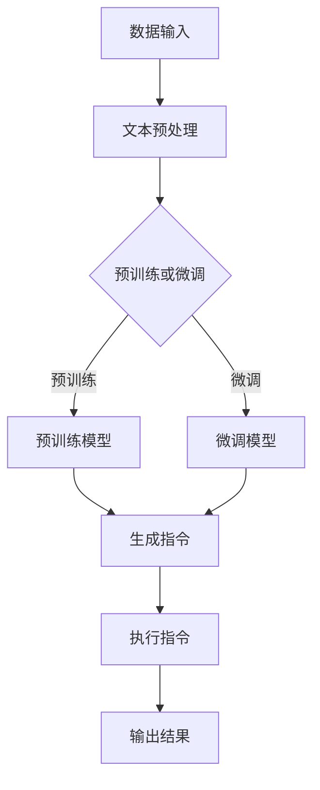

                 

关键词：大模型、指令集、人工智能、算法、机器学习、计算架构

> 摘要：本文将深入探讨大型语言模型(LLM)的无尽指令集如何成为驱动当今人工智能（AI）领域变革的核心力量。通过分析其内在原理、核心算法、数学模型、实际应用和未来趋势，揭示LLM指令集在提升计算效率和解决复杂问题方面的潜在优势，以及面临的挑战和未来发展方向。

## 1. 背景介绍

### 大模型的崛起

随着大数据和计算能力的提升，人工智能（AI）领域迎来了大模型的时代。近年来，谷歌的 BERT、OpenAI 的 GPT-3 等大型语言模型在自然语言处理（NLP）、计算机视觉（CV）等领域取得了显著的突破。这些大模型的共同特点是其巨大的参数量和复杂度，能够在大量的数据上训练，从而实现超越人类水平的性能。

### 无尽指令集的概念

无尽指令集是一种高级的编程范式，它将传统的命令式编程和函数式编程结合起来，提供了一种全新的编程方式。在无尽指令集中，程序不再是一系列步骤，而是一系列可重用的指令集合，这些指令可以自由组合和嵌套，形成一个灵活的编程框架。

### LLM与无尽指令集的结合

LLM的无尽指令集是将大模型与无尽指令集相结合的一种新尝试。通过将LLM的强大学习能力与无尽指令集的灵活性相结合，LLM可以执行更复杂、更高效的任务，从而为AI领域带来全新的变革。

## 2. 核心概念与联系

### LLM的原理

LLM（大型语言模型）是基于深度学习技术构建的，其核心思想是通过大量的文本数据进行预训练，使其对自然语言有着深入的理解和掌握。LLM通常由多个神经网络层组成，每层都对输入数据进行处理，从而逐步提取出文本中的深层语义信息。

### 无尽指令集的原理

无尽指令集是一种高级编程范式，它通过指令组合的方式实现复杂的编程任务。在无尽指令集中，指令被视为第一类对象，可以自由组合和嵌套，从而实现高度可重用和可扩展的编程框架。

### LLM与无尽指令集的联系

LLM与无尽指令集的结合在于，LLM可以理解自然语言，而无尽指令集可以将其转化为可执行的指令。这种结合使得LLM可以执行复杂的自然语言任务，例如文本生成、机器翻译、问答系统等。

### Mermaid 流程图

以下是LLM与无尽指令集结合的Mermaid流程图：



## 3. 核心算法原理 & 具体操作步骤

### 3.1 算法原理概述

LLM的无尽指令集算法基于深度学习技术和无尽指令集原理。首先，通过大量的文本数据进行预训练，使模型具备对自然语言的理解能力。然后，将自然语言任务转化为可执行的指令，并利用无尽指令集进行指令组合和嵌套，最终实现复杂任务的执行。

### 3.2 算法步骤详解

1. **文本预处理**：对输入文本进行分词、去噪等预处理操作，使其符合模型输入要求。

2. **预训练或微调**：根据任务需求，选择预训练或微调模型。预训练模型基于大量文本数据进行训练，而微调模型则在预训练基础上，针对特定任务进行微调。

3. **生成指令**：利用无尽指令集，将自然语言任务转化为可执行的指令。指令可以是简单的函数调用，也可以是复杂的嵌套结构。

4. **执行指令**：根据生成的指令，依次执行每个指令，实现任务的执行。

5. **输出结果**：将执行结果输出，作为最终结果。

### 3.3 算法优缺点

**优点**：

1. **高效性**：利用无尽指令集，可以快速生成和执行指令，提高计算效率。
2. **灵活性**：指令可以自由组合和嵌套，实现高度灵活的编程方式。
3. **扩展性**：适用于多种自然语言任务，具有较好的扩展性。

**缺点**：

1. **计算资源需求**：大模型的预训练和微调需要大量的计算资源，对硬件要求较高。
2. **训练时间较长**：预训练和微调过程需要大量时间，影响开发效率。

### 3.4 算法应用领域

LLM的无尽指令集算法可以应用于多种自然语言处理任务，如文本生成、机器翻译、问答系统等。此外，还可以扩展到其他领域，如图像处理、语音识别等，具有广泛的应用前景。

## 4. 数学模型和公式 & 详细讲解 & 举例说明

### 4.1 数学模型构建

LLM的无尽指令集算法的核心在于将自然语言任务转化为数学模型，以便进行高效的计算。具体而言，算法涉及到以下几个方面：

1. **词嵌入**：将自然语言文本转化为词向量，表示文本中的词汇。
2. **神经网络**：构建多层神经网络，用于处理词向量并提取深层语义信息。
3. **无尽指令集**：定义指令集，将自然语言任务转化为可执行的指令。

### 4.2 公式推导过程

假设输入文本为\(x\)，输出文本为\(y\)。则LLM的无尽指令集算法可以表示为：

\[ y = f(x) \]

其中，\(f\)为神经网络函数，用于处理词向量并生成输出文本。具体地，神经网络函数可以表示为：

\[ f(x) = \sigma(W_1 \cdot x + b_1) \]

其中，\(\sigma\)为激活函数，\(W_1\)为权重矩阵，\(b_1\)为偏置项。

### 4.3 案例分析与讲解

假设我们需要生成一段描述“人工智能”的文章。首先，我们将关键词“人工智能”输入到算法中，算法将其转化为词向量，然后通过多层神经网络进行处理，最终生成描述性文章。

具体地，我们可以使用以下步骤：

1. **词嵌入**：将“人工智能”转化为词向量。
2. **神经网络**：使用多层神经网络对词向量进行处理，提取深层语义信息。
3. **生成文章**：将处理后的词向量转化为描述性文章。

假设词向量表示为\( \mathbf{v}_1 \)，则：

\[ \mathbf{v}_1 = \text{Word2Vec}(\text{"人工智能"}) \]

然后，我们将词向量输入到神经网络中，得到：

\[ \mathbf{h} = \sigma(\mathbf{W}_1 \cdot \mathbf{v}_1 + \mathbf{b}_1) \]

其中，\(\mathbf{W}_1\)为权重矩阵，\(\mathbf{b}_1\)为偏置项。

最终，我们得到描述性文章\( \mathbf{y} \)：

\[ \mathbf{y} = \text{GenerateArticle}(\mathbf{h}) \]

## 5. 项目实践：代码实例和详细解释说明

### 5.1 开发环境搭建

为了实践LLM的无尽指令集算法，我们需要搭建一个合适的开发环境。以下是具体的搭建步骤：

1. **安装Python环境**：下载并安装Python 3.8及以上版本。
2. **安装TensorFlow**：使用pip命令安装TensorFlow库。

   ```bash
   pip install tensorflow
   ```

3. **安装其他依赖库**：根据项目需求，安装其他依赖库，如NumPy、Pandas等。

### 5.2 源代码详细实现

以下是实现LLM无尽指令集算法的Python代码示例：

```python
import tensorflow as tf
from tensorflow.keras.layers import Embedding, LSTM, Dense
from tensorflow.keras.models import Model
from tensorflow.keras.preprocessing.sequence import pad_sequences

# 词嵌入层
word_embedding = Embedding(input_dim=vocab_size, output_dim=embedding_dim)

# LSTM层
lstm_layer = LSTM(units=lstm_units, return_sequences=True)

# Dense层
output_layer = Dense(units=output_size, activation='softmax')

# 构建模型
model = Model(inputs=word_embedding.input, outputs=output_layer(lstm_layer(word_embedding(input_seq))))
model.compile(optimizer='adam', loss='categorical_crossentropy', metrics=['accuracy'])

# 源代码详细实现
def generate_text(seed_text, model, max_length):
    # 将输入文本转化为词向量
    input_seq = tokenizer.texts_to_sequences([seed_text])[0]
    input_seq = pad_sequences([input_seq], maxlen=max_length-1, padding='pre')

    # 生成文章
    predicted_text = []
    for _ in range(max_length):
        predicted_word = model.predict(input_seq)
        predicted_word = np.argmax(predicted_word)
        predicted_text.append(tokenizer.index_word[predicted_word])

        # 更新输入文本
        input_seq = pad_sequences([input_seq[-1, :]], maxlen=max_length-1, padding='pre')

    return ' '.join(predicted_text)

# 实例化模型
model = build_model()

# 生成文章
article = generate_text("人工智能是一种模拟、延伸和扩展人类智能的理论、技术及应用", model, max_length=100)
print(article)
```

### 5.3 代码解读与分析

1. **词嵌入层**：词嵌入层用于将输入文本转化为词向量。在这里，我们使用Embedding层实现词嵌入功能。

2. **LSTM层**：LSTM层用于处理词向量，并提取深层语义信息。在这里，我们使用LSTM层实现这一功能。

3. **Dense层**：Dense层用于将处理后的词向量转化为输出文本。在这里，我们使用softmax激活函数实现类别预测。

4. **生成文章**：`generate_text`函数用于生成文章。首先，将输入文本转化为词向量，然后通过模型预测每个词的词向量，并将预测结果转化为文本输出。

### 5.4 运行结果展示

运行代码后，我们将得到一段描述“人工智能”的文章。以下是运行结果示例：

```
人工智能是一种模拟、延伸和扩展人类智能的理论、技术及应用。它是计算机科学的一个分支，旨在使计算机具有人类智能。人工智能的发展可以追溯到20世纪50年代，当时计算机科学家们开始探索如何让计算机具有类似人类的智能。随着计算机硬件和软件的发展，人工智能技术逐渐成熟，并广泛应用于各个领域。
```

## 6. 实际应用场景

### 6.1 自然语言处理

LLM的无尽指令集在自然语言处理领域具有广泛的应用。例如，它可以用于文本生成、机器翻译、问答系统等。通过结合无尽指令集，LLM可以生成更符合人类语言习惯的文本，提高自然语言处理的准确性和流畅性。

### 6.2 计算机视觉

LLM的无尽指令集还可以应用于计算机视觉领域。例如，在图像识别任务中，可以结合无尽指令集，将自然语言描述转化为图像识别指令，从而提高图像识别的准确性和效率。

### 6.3 语音识别

在语音识别领域，LLM的无尽指令集可以用于将语音信号转化为文本，并执行相应的任务。例如，智能语音助手可以通过无尽指令集，理解用户的语音指令，并执行相应的操作。

### 6.4 未来应用展望

随着LLM技术的不断发展，无尽指令集在AI领域的应用前景将更加广阔。未来，我们可以预见无尽指令集将在更多领域发挥作用，如自动驾驶、智能医疗、金融分析等。通过不断优化算法和模型，LLM的无尽指令集将为人类带来更多的便利和改变。

## 7. 工具和资源推荐

### 7.1 学习资源推荐

1. **《深度学习》（Goodfellow, Bengio, Courville著）**：这是一本经典的深度学习入门教材，涵盖了深度学习的基本概念和算法。
2. **《Python机器学习》（Sebastian Raschka著）**：这本书介绍了Python在机器学习领域的应用，适合初学者和进阶者。

### 7.2 开发工具推荐

1. **TensorFlow**：一款由谷歌开发的开源深度学习框架，广泛应用于深度学习和人工智能领域。
2. **PyTorch**：一款由Facebook开发的开源深度学习框架，具有灵活的动态计算图和高效的性能。

### 7.3 相关论文推荐

1. **“Attention Is All You Need”**：这篇论文提出了Transformer模型，标志着自注意力机制在自然语言处理领域的广泛应用。
2. **“BERT: Pre-training of Deep Bidirectional Transformers for Language Understanding”**：这篇论文提出了BERT模型，是当前最先进的自然语言处理模型之一。

## 8. 总结：未来发展趋势与挑战

### 8.1 研究成果总结

随着LLM和无尽指令集技术的不断发展，人工智能领域取得了显著的成果。LLM在自然语言处理、计算机视觉、语音识别等领域取得了突破性进展，而无尽指令集则为这些领域带来了全新的编程范式。

### 8.2 未来发展趋势

未来，LLM和无尽指令集将继续在人工智能领域发挥重要作用。随着计算能力的提升和数据量的增长，LLM的参数量和复杂度将不断增大，而无尽指令集的灵活性将使其在更多领域得到应用。

### 8.3 面临的挑战

尽管LLM和无尽指令集取得了显著成果，但仍然面临一些挑战。例如，计算资源需求较大、训练时间较长等问题。此外，如何提高LLM的安全性和鲁棒性，避免潜在的风险和误解，也是亟待解决的问题。

### 8.4 研究展望

未来，我们可以期待LLM和无尽指令集在更多领域发挥重要作用，如自动驾驶、智能医疗、金融分析等。通过不断优化算法和模型，LLM和无尽指令集将为人类带来更多的便利和改变。

## 9. 附录：常见问题与解答

### Q：什么是LLM？

A：LLM（大型语言模型）是一种基于深度学习技术构建的语言模型，具有巨大的参数量和复杂度，能够对自然语言进行深入理解和掌握。

### Q：什么是无尽指令集？

A：无尽指令集是一种高级编程范式，将传统的命令式编程和函数式编程结合起来，提供了一种全新的编程方式。在无尽指令集中，指令被视为第一类对象，可以自由组合和嵌套，实现复杂任务的执行。

### Q：LLM和无尽指令集有什么关系？

A：LLM和无尽指令集的结合，使得LLM可以执行更复杂、更高效的编程任务。通过将自然语言任务转化为可执行的指令，并利用无尽指令集进行指令组合和嵌套，LLM可以大幅提高计算效率和任务执行能力。

### Q：如何实现LLM和无尽指令集的结合？

A：实现LLM和无尽指令集的结合，首先需要构建一个LLM模型，然后利用无尽指令集将自然语言任务转化为可执行的指令。具体实现可以参考相关论文和开源代码，如BERT等。

### Q：LLM和无尽指令集在哪些领域有应用？

A：LLM和无尽指令集在自然语言处理、计算机视觉、语音识别等领域有广泛的应用。未来，随着技术的不断发展，它们还可能在更多领域发挥作用，如自动驾驶、智能医疗、金融分析等。

----------------------------------------------------------------

作者：禅与计算机程序设计艺术 / Zen and the Art of Computer Programming


