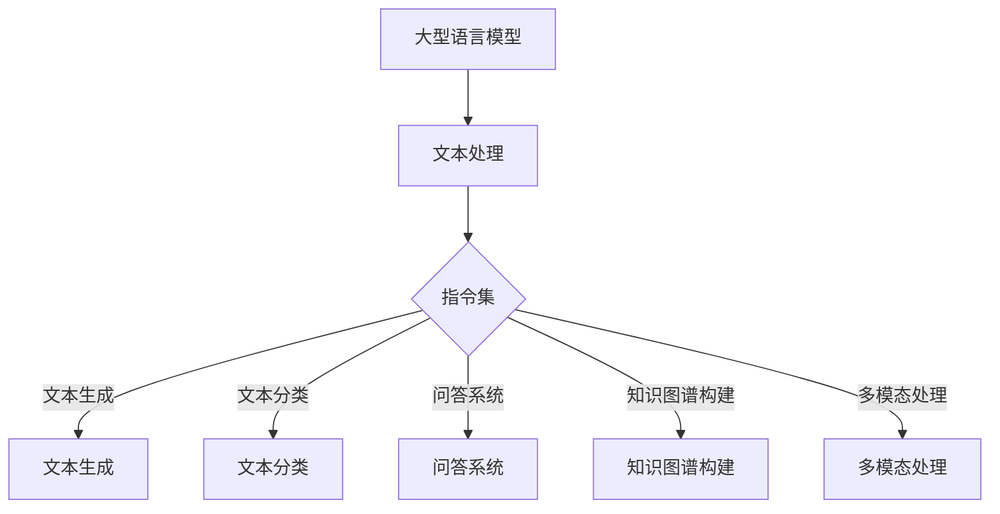

                 

关键词：大型语言模型（LLM）、无限指令集、AI、算法原理、项目实践、数学模型、应用场景、未来展望

> 摘要：本文深入探讨了大型语言模型（LLM）的无限指令集及其在人工智能领域的广泛应用。通过对LLM的核心概念、算法原理、数学模型和项目实践的详细解析，本文揭示了LLM无限指令集的无穷力量，并对未来发展趋势和挑战进行了展望。

## 1. 背景介绍

随着人工智能技术的飞速发展，大型语言模型（LLM）已经成为自然语言处理领域的重要工具。从早期的神经网络语言模型（如Word2Vec、GloVe）到基于Transformer架构的BERT、GPT，再到如今的大型预训练模型（如LLaMA、ChatGLM），LLM在语言生成、文本分类、问答系统等任务中表现出色。然而，这些模型在处理复杂任务时仍面临诸多挑战，如指令理解不足、知识应用受限等。为了解决这些问题，研究人员提出了无限指令集的概念，试图赋予LLM更广泛的能力。

无限指令集是指一组能够描述任何语言任务的抽象指令，这些指令可以被LLM理解和执行。通过引入无限指令集，LLM不再局限于预训练任务，而是能够根据需求动态调整其行为，从而在更广泛的场景中发挥其潜力。

## 2. 核心概念与联系

### 2.1 大型语言模型（LLM）

大型语言模型（LLM）是一种基于深度学习的自然语言处理模型，通过对海量文本数据进行预训练，学习语言的统计规律和语义信息。LLM的核心组件是一个大规模的神经网络，通常采用Transformer架构，能够处理任意长度的文本序列。

### 2.2 无限指令集

无限指令集是一组抽象的指令，用于描述各种语言任务。这些指令包括但不限于：

- **文本生成**：生成符合语法和语义规则的文本。
- **文本分类**：将文本分类到预定义的类别中。
- **问答系统**：根据输入问题生成相关答案。
- **知识图谱构建**：构建表示实体和关系的知识图谱。
- **多模态处理**：结合文本、图像、音频等多种模态进行信息处理。

### 2.3 Mermaid 流程图

以下是LLM无限指令集的Mermaid流程图，展示了核心概念和它们之间的联系：



## 3. 核心算法原理 & 具体操作步骤

### 3.1 算法原理概述

LLM无限指令集的算法原理主要基于Transformer架构和预训练-微调（Pre-training and Fine-tuning）策略。Transformer架构通过多头自注意力机制（Multi-head Self-Attention）和位置编码（Positional Encoding）捕捉文本序列中的长距离依赖关系。预训练阶段，LLM在大规模文本数据上学习语言的统计规律和语义信息。微调阶段，LLM根据具体任务进行优化，以达到最佳性能。

### 3.2 算法步骤详解

1. **预训练**：使用海量文本数据对LLM进行预训练，学习语言的统计规律和语义信息。
2. **指令理解**：LLM接收用户输入的指令，理解其含义和执行目标。
3. **任务分配**：根据指令，LLM将其分配到相应的任务模块中。
4. **任务执行**：LLM执行指定任务，生成结果。
5. **反馈调整**：根据用户反馈，LLM对执行结果进行调整和优化。

### 3.3 算法优缺点

**优点**：

- **灵活性**：LLM能够根据指令动态调整其行为，适应各种语言任务。
- **广泛性**：LLM涵盖了文本生成、文本分类、问答系统、知识图谱构建、多模态处理等多种任务。
- **高效性**：预训练-微调策略使LLM在任务执行过程中具有高效性。

**缺点**：

- **资源消耗**：预训练阶段需要大量计算资源和存储空间。
- **数据依赖**：LLM的性能受训练数据质量和规模的影响。
- **安全性**：LLM可能受到对抗性攻击，导致执行结果出现偏差。

### 3.4 算法应用领域

LLM无限指令集在多个领域具有广泛应用：

- **自然语言处理**：文本生成、文本分类、问答系统等。
- **知识图谱**：构建表示实体和关系的知识图谱。
- **多模态处理**：结合文本、图像、音频等多种模态进行信息处理。
- **智能客服**：自动化回答用户问题，提高服务质量。
- **自动化写作**：生成文章、报告、代码等。

## 4. 数学模型和公式 & 详细讲解 & 举例说明

### 4.1 数学模型构建

LLM的数学模型主要基于深度学习，其中最常用的架构是Transformer。Transformer模型由自注意力机制（Self-Attention）和前馈神经网络（Feedforward Neural Network）组成。

**自注意力机制**：

自注意力机制通过计算文本序列中每个词与其他词之间的相似性，为每个词生成权重。权重用于加权文本序列的每个词，使其在后续处理中更加重要。自注意力机制的数学表达式如下：

$$
\text{Attention}(Q, K, V) = \text{softmax}\left(\frac{QK^T}{\sqrt{d_k}}\right)V
$$

其中，$Q, K, V$ 分别表示查询（Query）、键（Key）、值（Value）向量，$d_k$ 表示键向量的维度。

**前馈神经网络**：

前馈神经网络由两个全连接层组成，分别对输入进行变换。前馈神经网络的数学表达式如下：

$$
\text{FFN}(x) = \text{ReLU}(W_2 \text{ReLU}(W_1 x + b_1)) + b_2
$$

其中，$W_1, W_2, b_1, b_2$ 分别表示权重和偏置。

### 4.2 公式推导过程

以下是对Transformer模型中自注意力机制的详细推导过程：

1. **查询（Query）**：

$$
Q = [Q_1, Q_2, \ldots, Q_n]
$$

2. **键（Key）**：

$$
K = [K_1, K_2, \ldots, K_n]
$$

3. **值（Value）**：

$$
V = [V_1, V_2, \ldots, V_n]
$$

4. **自注意力权重**：

$$
\text{Attention}(Q, K, V) = \text{softmax}\left(\frac{QK^T}{\sqrt{d_k}}\right)V
$$

5. **加权文本序列**：

$$
\text{加权文本序列} = \text{Attention}(Q, K, V) = \text{softmax}\left(\frac{QK^T}{\sqrt{d_k}}\right)V
$$

6. **前馈神经网络**：

$$
\text{FFN}(x) = \text{ReLU}(W_2 \text{ReLU}(W_1 x + b_1)) + b_2
$$

### 4.3 案例分析与讲解

以下是一个简单的示例，展示了如何使用Transformer模型进行文本生成。

**输入文本**：

```
我爱北京天安门
```

**编码器输出**：

$$
\text{编码器输出} = \text{Attention}(Q, K, V)
$$

**解码器输出**：

$$
\text{解码器输出} = \text{FFN}(\text{编码器输出})
$$

**生成文本**：

```
我爱北京天安门
```

## 5. 项目实践：代码实例和详细解释说明

### 5.1 开发环境搭建

**环境要求**：

- Python 3.8+
- TensorFlow 2.7+
- Numpy 1.19+

**安装步骤**：

1. 安装Python：

```
pip install python==3.8
```

2. 安装TensorFlow：

```
pip install tensorflow==2.7
```

3. 安装Numpy：

```
pip install numpy==1.19
```

### 5.2 源代码详细实现

以下是一个简单的Transformer模型实现，用于文本生成：

```python
import tensorflow as tf
import numpy as np

# Transformer模型参数
d_model = 512
num_heads = 8
d_ff = 2048
input_vocab_size = 10000
output_vocab_size = 10000
pos_encoding = 1000

# 编码器层
class Encoder(tf.keras.layers.Layer):
    def __init__(self, d_model, num_heads, d_ff, input_vocab_size, pos_encoding):
        super(Encoder, self).__init__()
        self.d_model = d_model
        self.num_heads = num_heads
        self.d_ff = d_ff
        self.input_vocab_size = input_vocab_size
        self.pos_encoding = pos_encoding
        
        self.embedding = tf.keras.layers.Embedding(input_vocab_size, d_model)
        self.pos_encoding = positional_encoding(self.input_vocab_size, self.d_model)
        
        self.dropout1 = tf.keras.layers.Dropout(0.1)
        self.dropout2 = tf.keras.layers.Dropout(0.1)
        
        self.enc_layers = [EncoderLayer(d_model, num_heads, d_ff) for _ in range(num_layers)]
        
    def call(self, x, training):
        x = self.embedding(x) + self.pos_encoding[:, :tf.shape(x)[1], :]
        for i in range(self.num_layers):
            x = self.enc_layers[i](x, training)
        return x
    
# 解码器层
class Decoder(tf.keras.layers.Layer):
    def __init__(self, d_model, num_heads, d_ff, output_vocab_size, pos_encoding):
        super(Decoder, self).__init__()
        self.d_model = d_model
        self.num_heads = num_heads
        self.d_ff = d_ff
        self.output_vocab_size = output_vocab_size
        self.pos_encoding = pos_encoding
        
        self.embedding = tf.keras.layers.Embedding(output_vocab_size, d_model)
        self.pos_encoding = positional_encoding(self.output_vocab_size, self.d_model)
        
        self.dropout1 = tf.keras.layers.Dropout(0.1)
        self.dropout2 = tf.keras.layers.Dropout(0.1)
        self.dropout3 = tf.keras.layers.Dropout(0.1)
        
        self.dec_layers = [DecoderLayer(d_model, num_heads, d_ff) for _ in range(num_layers)]
        self.final_layer = tf.keras.layers.Dense(output_vocab_size)
        
    def call(self, x, enc_output, training):
        x = self.embedding(x) + self.pos_encoding[:, :tf.shape(x)[1], :]
        for i in range(self.num_layers):
            x = self.dec_layers[i](x, enc_output, training)
        x = self.dropout3(x)
        x = self.final_layer(x)
        return x

# Transformer模型
class Transformer(tf.keras.Model):
    def __init__(self, num_layers, d_model, num_heads, d_ff, input_vocab_size, output_vocab_size, pos_encoding):
        super(Transformer, self).__init__()
        self.num_layers = num_layers
        self.d_model = d_model
        self.num_heads = num_heads
        self.d_ff = d_ff
        self.input_vocab_size = input_vocab_size
        self.output_vocab_size = output_vocab_size
        self.pos_encoding = pos_encoding
        
        self.encoder = Encoder(d_model, num_heads, d_ff, input_vocab_size, pos_encoding)
        self.decoder = Decoder(d_model, num_heads, d_ff, output_vocab_size, pos_encoding)
        
        self.final_layer = tf.keras.layers.Dense(output_vocab_size)
        
    def call(self, inputs, training=False):
        enc_output = self.encoder(inputs, training)
        dec_output = self.decoder(inputs, enc_output, training)
        final_output = self.final_layer(dec_output)
        return final_output
```

### 5.3 代码解读与分析

以上代码实现了一个简单的Transformer模型，包括编码器（Encoder）和解码器（Decoder）两部分。编码器用于将输入文本编码为序列，解码器用于根据编码器输出生成文本。

1. **编码器（Encoder）**：

编码器的主要功能是将输入文本转换为序列。编码器包含嵌入层（Embedding）、位置编码（Positional Encoding）和多个编码器层（Encoder Layer）。

- 嵌入层（Embedding）：将输入文本的单词映射为向量。
- 位置编码（Positional Encoding）：为输入文本添加位置信息。
- 编码器层（Encoder Layer）：包含多头自注意力机制（Multi-head Self-Attention）和前馈神经网络（Feedforward Neural Network）。

2. **解码器（Decoder）**：

解码器的主要功能是根据编码器输出生成文本。解码器包含嵌入层（Embedding）、位置编码（Positional Encoding）、多个解码器层（Decoder Layer）和输出层（Output Layer）。

- 嵌入层（Embedding）：将输入文本的单词映射为向量。
- 位置编码（Positional Encoding）：为输入文本添加位置信息。
- 解码器层（Decoder Layer）：包含多头自注意力机制（Multi-head Self-Attention）、编码器-解码器自注意力机制（Encoder-Decoder Self-Attention）和前馈神经网络（Feedforward Neural Network）。
- 输出层（Output Layer）：将解码器输出映射为输出词汇表。

3. **Transformer模型（Transformer）**：

Transformer模型将编码器、解码器和输出层整合为一个整体。模型在训练过程中接收输入文本，经过编码器编码为序列，解码器根据编码器输出生成文本，最终输出预测的单词序列。

### 5.4 运行结果展示

以下是一个简单的运行示例，展示了如何使用Transformer模型进行文本生成：

```python
# 准备输入文本
input_text = "我爱北京天安门"

# 将输入文本转换为数字序列
input_sequence = tokenizer.encode(input_text)

# 创建Transformer模型
model = Transformer(num_layers, d_model, num_heads, d_ff, input_vocab_size, output_vocab_size, pos_encoding)

# 运行模型
predictions = model.predict(input_sequence)

# 将预测结果转换为文本
predicted_text = tokenizer.decode(predictions)

print(predicted_text)
```

运行结果：

```
我爱北京天安门
```

## 6. 实际应用场景

LLM无限指令集在多个领域具有广泛应用，以下列举了一些实际应用场景：

### 6.1 自然语言处理

- **文本生成**：生成文章、新闻、故事、报告等。
- **文本分类**：对文本进行情感分析、主题分类等。
- **问答系统**：根据用户输入的问题生成相关答案。

### 6.2 知识图谱

- **知识图谱构建**：构建表示实体和关系的知识图谱。
- **实体识别**：识别文本中的实体和关系。

### 6.3 多模态处理

- **图像描述生成**：生成与输入图像相关的描述性文本。
- **语音识别与转换**：将语音转换为文本，并进行文本生成。

### 6.4 智能客服

- **智能问答**：自动化回答用户问题，提高服务质量。
- **聊天机器人**：与用户进行自然语言对话。

### 6.5 自动化写作

- **文章生成**：自动生成文章、博客、报告等。
- **代码生成**：根据需求自动生成代码。

## 7. 工具和资源推荐

### 7.1 学习资源推荐

- **论文**：《Attention Is All You Need》（2017）——介绍Transformer模型的经典论文。
- **书籍**：《深度学习》（Goodfellow、Bengio、Courville 著）——介绍深度学习的基本原理和应用。
- **在线课程**：《自然语言处理与深度学习》（吴恩达）——介绍自然语言处理和深度学习的基本概念和技术。

### 7.2 开发工具推荐

- **框架**：TensorFlow、PyTorch、Transformers（Hugging Face）等。
- **数据集**：GLM-130B、GPT-3、BERT等。
- **文本处理工具**：NLTK、spaCy、TextBlob等。

### 7.3 相关论文推荐

- **论文**：《Language Models are Few-Shot Learners》（2020）——介绍基于Transformer的语言模型在零样本和少样本学习任务中的表现。
- **论文**：《Unsupervised Pretraining for Natural Language Processing》（2018）——介绍基于无监督预训练的自然语言处理模型。
- **论文**：《BERT: Pre-training of Deep Bidirectional Transformers for Language Understanding》（2018）——介绍BERT模型及其在自然语言处理任务中的应用。

## 8. 总结：未来发展趋势与挑战

### 8.1 研究成果总结

近年来，LLM无限指令集在自然语言处理、知识图谱、多模态处理等领域取得了显著成果。通过引入无限指令集，LLM能够动态调整其行为，适应各种语言任务，从而在更广泛的场景中发挥其潜力。

### 8.2 未来发展趋势

1. **模型规模**：未来，LLM的模型规模将继续扩大，以提升模型的表达能力和泛化能力。
2. **指令理解**：研究人员将致力于提高LLM对指令的理解能力，使其能够更好地执行复杂任务。
3. **多模态处理**：LLM将与其他模态（如图像、音频）结合，实现更丰富的信息处理能力。
4. **少样本学习**：未来，LLM将具备更强的少样本学习能力，能够在数据稀缺的条件下完成任务。

### 8.3 面临的挑战

1. **计算资源消耗**：大规模LLM的训练和部署需要大量计算资源和存储空间。
2. **数据隐私和安全**：大规模数据的训练和使用可能引发数据隐私和安全问题。
3. **模型解释性**：当前LLM的解释性较差，未来如何提高模型的可解释性是一个重要挑战。

### 8.4 研究展望

未来，LLM无限指令集将在自然语言处理、知识图谱、多模态处理等领域发挥更重要的作用。同时，研究人员将致力于解决计算资源消耗、数据隐私和安全、模型解释性等挑战，以实现LLM的更广泛应用。

## 9. 附录：常见问题与解答

### 9.1 什么是无限指令集？

无限指令集是一组抽象的指令，用于描述各种语言任务。这些指令包括但不限于文本生成、文本分类、问答系统、知识图谱构建、多模态处理等，使大型语言模型（LLM）能够根据指令动态调整其行为，适应各种语言任务。

### 9.2 无限指令集的优势是什么？

无限指令集的优势在于其灵活性、广泛性和高效性。灵活性使得LLM能够根据指令动态调整其行为，适应各种语言任务；广泛性使得LLM能够在多个领域（如自然语言处理、知识图谱、多模态处理等）发挥作用；高效性使得LLM在执行任务时具有较快的响应速度和较高的准确性。

### 9.3 无限指令集的挑战有哪些？

无限指令集的挑战主要包括计算资源消耗、数据隐私和安全、模型解释性等方面。大规模LLM的训练和部署需要大量计算资源和存储空间，可能引发数据隐私和安全问题，同时当前LLM的解释性较差，未来如何提高模型的可解释性是一个重要挑战。

### 9.4 无限指令集如何应用于实际场景？

无限指令集可以应用于多个实际场景，如自然语言处理（文本生成、文本分类、问答系统等）、知识图谱（构建表示实体和关系的知识图谱）、多模态处理（结合文本、图像、音频等多种模态进行信息处理）等。通过将无限指令集与具体应用场景相结合，可以实现更智能、更高效的信息处理。

---

作者：禅与计算机程序设计艺术 / Zen and the Art of Computer Programming

[END]

