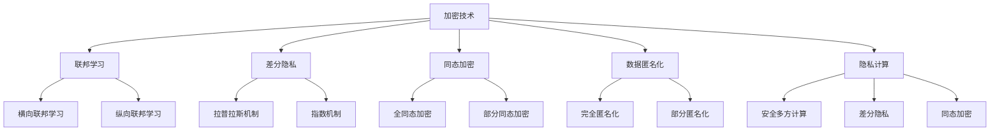

                 

关键词：大语言模型、数据隐私、隐私保护、加密技术、联邦学习、差分隐私、同态加密、数据匿名化、隐私计算、安全多方计算

> 摘要：随着大语言模型（LLM）的广泛应用，数据隐私保护问题日益凸显。本文将深入探讨新型隐私安全技术，包括加密技术、联邦学习、差分隐私、同态加密、数据匿名化和隐私计算等，以期为LLM时代的数据保护提供有力支持。通过分析这些技术的原理、优缺点以及实际应用场景，我们希望能够为业界提供有益的参考和指导。

## 1. 背景介绍

近年来，大语言模型（LLM）在自然语言处理、智能问答、自动文本生成等领域取得了显著进展。LLM能够通过深度学习算法从海量数据中学习语言规律，从而实现高精度的文本理解和生成。然而，这一进步也带来了数据隐私保护的新挑战。首先，训练LLM需要大量的数据，这些数据往往包含个人隐私信息，如姓名、地址、电话号码等。如果这些数据泄露，将可能对用户造成严重损失。其次，LLM在处理数据时，可能无意中泄露用户的隐私信息。例如，在自动文本生成过程中，模型可能会生成包含用户隐私内容的文本。

为了应对这些挑战，研究人员和开发者开始探索各种新型隐私安全技术。本文将重点介绍以下技术：加密技术、联邦学习、差分隐私、同态加密、数据匿名化和隐私计算。通过分析这些技术的原理、优缺点以及实际应用场景，我们希望能够为LLM时代的数据保护提供有力支持。

### 1.1 加密技术

加密技术是一种将明文数据转换为密文的过程，只有拥有密钥的用户才能解密并恢复明文数据。加密技术在数据隐私保护中具有重要意义，它可以确保数据在传输和存储过程中的安全性。常见的加密算法包括对称加密和非对称加密。对称加密算法如AES（高级加密标准）和DES（数据加密标准）具有计算效率高、实现简单等优点，但需要双方共享密钥，密钥管理复杂。非对称加密算法如RSA（RSA加密算法）和ECC（椭圆曲线加密算法）则解决了密钥分发问题，但计算复杂度较高。

### 1.2 联邦学习

联邦学习是一种分布式机器学习技术，它允许多个参与方在一个共同的学习任务中合作，而无需共享他们的数据。联邦学习通过本地训练模型并在中心节点进行聚合，从而实现隐私保护。联邦学习在LLM训练过程中具有重要意义，它可以避免将敏感数据传输到中心节点，从而降低数据泄露风险。联邦学习分为横向联邦学习和纵向联邦学习。横向联邦学习适用于多个参与方拥有相同特征但不同标签的数据，如多个医疗机构的病历数据。纵向联邦学习适用于多个参与方拥有不同特征和标签的数据，如社交媒体平台的数据。

### 1.3 差分隐私

差分隐私是一种用于保护隐私的数学框架，它通过在输出中引入噪声来确保隐私。差分隐私的核心思想是，即使攻击者知道系统的输出，也无法确定任何单个个体的隐私信息。差分隐私在统计数据库查询、数据分析等领域具有重要意义。常见的差分隐私算法包括拉普拉斯机制和指数机制。

### 1.4 同态加密

同态加密是一种能够在加密状态下执行计算的安全加密技术，它可以确保在数据加密后仍能对其进行计算。同态加密在分布式计算和云计算领域具有重要意义，它可以确保在数据传输和存储过程中不泄露任何隐私信息。常见的同态加密算法包括全同态加密和部分同态加密。

### 1.5 数据匿名化

数据匿名化是一种通过消除或混淆个人隐私信息来保护隐私的技术。数据匿名化可以分为完全匿名化和部分匿名化。完全匿名化使数据无法识别任何个人，但可能导致数据质量下降。部分匿名化在保留数据价值的同时，尽可能保护个人隐私。

### 1.6 隐私计算

隐私计算是一种在数据不离开本地设备的情况下进行计算的技术。隐私计算包括安全多方计算、差分隐私、同态加密等多种技术。隐私计算在保障数据隐私的同时，提高数据处理效率和灵活性。

## 2. 核心概念与联系

为了更好地理解新型隐私安全技术，我们首先需要了解它们的基本原理和架构。以下是一个简化的Mermaid流程图，展示了这些核心概念及其相互联系：



### 2.1 加密技术

加密技术主要包括对称加密和非对称加密。对称加密算法如AES和DES在计算效率上具有明显优势，但密钥管理复杂。非对称加密算法如RSA和ECC在密钥管理上具有优势，但计算复杂度较高。加密技术主要用于保障数据在传输和存储过程中的安全性。

### 2.2 联邦学习

联邦学习是一种分布式机器学习技术，包括横向联邦学习和纵向联邦学习。横向联邦学习适用于多个参与方拥有相同特征但不同标签的数据，纵向联邦学习适用于多个参与方拥有不同特征和标签的数据。联邦学习主要用于保障数据在训练过程中的隐私。

### 2.3 差分隐私

差分隐私是一种用于保护隐私的数学框架，包括拉普拉斯机制和指数机制。差分隐私主要用于统计数据库查询和数据分析等领域，以保障个人隐私。

### 2.4 同态加密

同态加密是一种在加密状态下执行计算的安全加密技术，包括全同态加密和部分同态加密。同态加密主要用于分布式计算和云计算领域，保障数据在传输和存储过程中的安全性。

### 2.5 数据匿名化

数据匿名化包括完全匿名化和部分匿名化。完全匿名化使数据无法识别任何个人，但可能导致数据质量下降。部分匿名化在保留数据价值的同时，尽可能保护个人隐私。

### 2.6 隐私计算

隐私计算包括安全多方计算、差分隐私、同态加密等多种技术。隐私计算主要用于在保障数据隐私的同时，提高数据处理效率和灵活性。

## 3. 核心算法原理 & 具体操作步骤

### 3.1 算法原理概述

本节将介绍几种新型隐私安全技术的基本原理和操作步骤。

#### 3.1.1 加密技术

加密技术的基本原理是通过加密算法将明文数据转换为密文，只有解密密钥才能将密文转换为明文。常见的加密算法包括AES、DES、RSA和ECC。加密技术的操作步骤如下：

1. 选择合适的加密算法和密钥长度。
2. 使用密钥生成器生成加密密钥和密钥。
3. 使用加密算法对明文数据进行加密，生成密文。
4. 将密文存储或传输。
5. 使用解密密钥对密文进行解密，恢复明文数据。

#### 3.1.2 联邦学习

联邦学习的基本原理是通过本地训练模型并在中心节点进行聚合，从而实现隐私保护。联邦学习的操作步骤如下：

1. 选择合适的联邦学习算法，如梯度聚合算法。
2. 每个参与方在本地训练一个模型。
3. 将每个参与方的模型参数发送到中心节点。
4. 中心节点对模型参数进行聚合，生成全局模型。
5. 将全局模型返回给每个参与方。

#### 3.1.3 差分隐私

差分隐私的基本原理是在输出中引入噪声，以保护个人隐私。差分隐私的操作步骤如下：

1. 选择合适的噪声分布，如拉普拉斯分布。
2. 计算原始输出值。
3. 从噪声分布中采样噪声值。
4. 将噪声值加到原始输出值上，生成差分隐私输出。

#### 3.1.4 同态加密

同态加密的基本原理是在加密状态下执行计算，以保障数据安全性。同态加密的操作步骤如下：

1. 选择合适的安全多方计算协议，如全同态加密协议。
2. 对参与方数据进行加密。
3. 在加密状态下执行计算。
4. 将计算结果解密，恢复明文数据。

#### 3.1.5 数据匿名化

数据匿名化的基本原理是通过消除或混淆个人隐私信息，以保护隐私。数据匿名化的操作步骤如下：

1. 选择合适的匿名化算法，如k-匿名算法。
2. 对数据中的个人隐私信息进行消除或混淆。
3. 保留数据的结构和价值。

#### 3.1.6 隐私计算

隐私计算的基本原理是在本地设备上执行计算，以保障数据隐私。隐私计算的操作步骤如下：

1. 选择合适的安全多方计算协议。
2. 在本地设备上执行计算。
3. 将计算结果返回给用户。

### 3.2 算法步骤详解

以下将详细描述每种隐私安全技术的具体操作步骤。

#### 3.2.1 加密技术

1. 选择合适的加密算法和密钥长度：
   - 加密算法：AES（密钥长度：128位、192位、256位）
   - 密钥长度：根据安全需求选择合适的密钥长度。

2. 使用密钥生成器生成加密密钥和密钥：
   - 使用密钥生成器生成加密密钥和密钥。
   - 确保密钥安全存储，防止泄露。

3. 使用加密算法对明文数据进行加密，生成密文：
   - 将明文数据输入加密算法。
   - 输出加密后的密文。

4. 将密文存储或传输：
   - 将密文存储在安全存储设备中。
   - 在传输过程中使用安全协议，如TLS。

5. 使用解密密钥对密文进行解密，恢复明文数据：
   - 将密文输入解密算法。
   - 输出解密后的明文数据。

#### 3.2.2 联邦学习

1. 选择合适的联邦学习算法，如梯度聚合算法：
   - 根据数据特征和计算资源选择合适的联邦学习算法。

2. 每个参与方在本地训练一个模型：
   - 在本地设备上使用参与方的数据训练模型。
   - 优化模型性能，提高准确率。

3. 将每个参与方的模型参数发送到中心节点：
   - 使用安全协议，如TLS，传输模型参数。

4. 中心节点对模型参数进行聚合，生成全局模型：
   - 根据聚合算法，如联邦平均算法，计算全局模型参数。
   - 更新全局模型。

5. 将全局模型返回给每个参与方：
   - 将全局模型参数发送回每个参与方。
   - 更新本地模型。

#### 3.2.3 差分隐私

1. 选择合适的噪声分布，如拉普拉斯分布：
   - 根据隐私需求选择合适的噪声分布。

2. 计算原始输出值：
   - 使用算法计算原始输出值。

3. 从噪声分布中采样噪声值：
   - 使用随机数生成器从噪声分布中采样噪声值。

4. 将噪声值加到原始输出值上，生成差分隐私输出：
   - 计算差分隐私输出值。

#### 3.2.4 同态加密

1. 选择合适的安全多方计算协议，如全同态加密协议：
   - 根据计算需求选择合适的安全多方计算协议。

2. 对参与方数据进行加密：
   - 使用加密算法对参与方的数据进行加密。

3. 在加密状态下执行计算：
   - 在加密状态下执行计算操作。

4. 将计算结果解密，恢复明文数据：
   - 使用解密算法将计算结果解密，恢复明文数据。

#### 3.2.5 数据匿名化

1. 选择合适的匿名化算法，如k-匿名算法：
   - 根据数据特征和隐私需求选择合适的匿名化算法。

2. 对数据中的个人隐私信息进行消除或混淆：
   - 消除或混淆数据中的个人隐私信息。

3. 保留数据的结构和价值：
   - 保留数据的基本结构和价值。

#### 3.2.6 隐私计算

1. 选择合适的安全多方计算协议：
   - 根据计算需求选择合适的安全多方计算协议。

2. 在本地设备上执行计算：
   - 在本地设备上执行计算操作。

3. 将计算结果返回给用户：
   - 将计算结果返回给用户。

### 3.3 算法优缺点

以下将分析每种隐私安全技术的优缺点。

#### 3.3.1 加密技术

**优点：**
1. 可确保数据在传输和存储过程中的安全性。
2. 加密算法种类繁多，可满足不同安全需求。

**缺点：**
1. 密钥管理复杂，易受攻击。
2. 加密和解密过程可能影响计算性能。

#### 3.3.2 联邦学习

**优点：**
1. 可确保数据在训练过程中的隐私。
2. 避免数据泄露风险。

**缺点：**
1. 需要较高的计算资源。
2. 模型性能可能受到影响。

#### 3.3.3 差分隐私

**优点：**
1. 可确保输出结果的隐私。
2. 可应用于多种数据分析和统计场景。

**缺点：**
1. 可能降低算法的准确性。
2. 复杂度较高，实现难度大。

#### 3.3.4 同态加密

**优点：**
1. 可确保数据在传输和存储过程中的安全性。
2. 可应用于分布式计算和云计算场景。

**缺点：**
1. 计算复杂度较高。
2. 当前应用范围有限。

#### 3.3.5 数据匿名化

**优点：**
1. 可确保数据在传输和存储过程中的隐私。
2. 保留数据的基本结构和价值。

**缺点：**
1. 可能导致数据质量下降。
2. 实现难度大，需根据具体场景选择合适的算法。

#### 3.3.6 隐私计算

**优点：**
1. 可确保数据在计算过程中的隐私。
2. 提高数据处理效率和灵活性。

**缺点：**
1. 需要较高的计算资源。
2. 当前应用范围有限。

### 3.4 算法应用领域

以下将介绍每种隐私安全技术在LLM时代的数据保护中的应用领域。

#### 3.4.1 加密技术

加密技术在数据保护中的主要应用领域包括：
1. 数据传输安全：确保数据在传输过程中的安全性，如HTTPS、VPN等。
2. 数据存储安全：确保数据在存储过程中的安全性，如加密磁盘、加密数据库等。
3. 认证和授权：确保用户身份验证和数据访问控制的安全性。

#### 3.4.2 联邦学习

联邦学习在数据保护中的主要应用领域包括：
1. 医疗领域：保护患者隐私，提高医疗数据分析的准确性。
2. 金融领域：确保客户隐私，提高金融风险管理的准确性。
3. 物联网领域：保护物联网设备的数据隐私，提高数据处理效率。

#### 3.4.3 差分隐私

差分隐私在数据保护中的主要应用领域包括：
1. 数据分析：保护个人隐私，提高数据分析的准确性。
2. 统计学：保护统计数据的隐私，提高统计结果的准确性。
3. 智能推荐：保护用户隐私，提高推荐系统的准确性。

#### 3.4.4 同态加密

同态加密在数据保护中的主要应用领域包括：
1. 分布式计算：确保分布式计算过程中的数据安全性。
2. 云计算：保护云计算环境中的数据隐私。
3. 物联网：确保物联网设备的数据安全性。

#### 3.4.5 数据匿名化

数据匿名化在数据保护中的主要应用领域包括：
1. 数据共享：确保数据在共享过程中的隐私。
2. 数据分析：保护个人隐私，提高数据分析的准确性。
3. 法律合规：确保数据符合相关隐私法规要求。

#### 3.4.6 隐私计算

隐私计算在数据保护中的主要应用领域包括：
1. 数据分析：保护个人隐私，提高数据分析的准确性。
2. 智能推荐：保护用户隐私，提高推荐系统的准确性。
3. 法律合规：确保数据符合相关隐私法规要求。

## 4. 数学模型和公式 & 详细讲解 & 举例说明

### 4.1 数学模型构建

在本节中，我们将介绍一些用于隐私保护的关键数学模型和公式。

#### 4.1.1 加密技术

**公式 1：对称加密算法（AES）**
$$
密文 = E_K(明文)
$$
其中，\( E_K \) 表示加密函数，\( K \) 表示密钥。

**公式 2：非对称加密算法（RSA）**
$$
密文 = E_K(明文)
$$
$$
明文 = D_K(密文)
$$
其中，\( E_K \) 和 \( D_K \) 分别表示加密函数和解密函数，\( K \) 表示公钥和私钥。

#### 4.1.2 联邦学习

**公式 3：梯度聚合算法**
$$
\theta_{global} = \frac{1}{N} \sum_{i=1}^{N} \theta_{i}
$$
其中，\( \theta_{global} \) 表示全局模型参数，\( \theta_{i} \) 表示每个参与方的本地模型参数，\( N \) 表示参与方数量。

#### 4.1.3 差分隐私

**公式 4：拉普拉斯机制**
$$
输出 = 原始输出 + \eta
$$
$$
\eta \sim Laplace(0, \lambda)
$$
其中，\( \eta \) 表示噪声，\( \lambda \) 表示拉普拉斯分布的参数。

**公式 5：指数机制**
$$
输出 = 原始输出 + exp(\eta)
$$
$$
\eta \sim exp(1)
$$
其中，\( \eta \) 表示噪声，\( exp(1) \) 表示指数分布的参数。

#### 4.1.4 同态加密

**公式 6：全同态加密算法**
$$
加密结果 = f(密文1, 密文2)
$$
其中，\( f \) 表示加密函数，\( 密文1 \) 和 \( 密文2 \) 分别表示加密后的数据。

**公式 7：部分同态加密算法**
$$
加密结果 = f(明文1, 明文2)
$$
其中，\( f \) 表示加密函数，\( 明文1 \) 和 \( 明文2 \) 分别表示明文数据。

#### 4.1.5 数据匿名化

**公式 8：k-匿名算法**
$$
记录集合 = 匿名化(记录集合)
$$
其中，\( 记录集合 \) 表示包含个人隐私信息的记录集合，\( 匿名化 \) 表示将记录集合中的个人隐私信息进行消除或混淆的操作。

### 4.2 公式推导过程

在本节中，我们将简要介绍上述公式的推导过程。

#### 4.2.1 对称加密算法（AES）

对称加密算法的核心思想是利用密钥将明文数据加密为密文，解密时再利用相同的密钥将密文解密为明文。AES算法是一种基于块加密的算法，其加密过程如下：

1. 输入明文数据和一个128位的密钥。
2. 将明文数据分为多个128位的块。
3. 对每个块进行多次迭代加密。
4. 将加密后的块组合成密文。

#### 4.2.2 非对称加密算法（RSA）

非对称加密算法的核心思想是利用公钥加密，私钥解密。RSA算法是一种基于大整数分解问题的算法，其加密和解密过程如下：

1. 输入两个大素数 \( p \) 和 \( q \)，计算 \( n = p \times q \) 和 \( \phi = (p - 1) \times (q - 1) \)。
2. 选择一个整数 \( e \)，满足 \( 1 < e < \phi \) 且 \( gcd(e, \phi) = 1 \)。
3. 计算私钥 \( d \)，满足 \( d \times e \equiv 1 \mod \phi \)。
4. 加密过程：\( 密文 = E_e(明文) \)。
5. 解密过程：\( 明文 = D_d(密文) \)。

#### 4.2.3 联邦学习

联邦学习的关键是模型参数的聚合。假设有 \( N \) 个参与方，每个参与方拥有本地数据集 \( D_i \) 和本地模型参数 \( \theta_i \)。联邦学习的目标是找到一个全局模型参数 \( \theta_{global} \)，使得 \( \theta_{global} \) 尽可能接近每个参与方的本地模型参数。

1. 初始时，将全局模型参数设置为每个参与方的本地模型参数的平均值：
   $$ \theta_{global}^{0} = \frac{1}{N} \sum_{i=1}^{N} \theta_i^{0} $$
2. 在每个迭代步骤中，每个参与方更新其本地模型参数：
   $$ \theta_i^{t+1} = \alpha \cdot \theta_i^{t} + (1 - \alpha) \cdot \frac{1}{|D_i|} \sum_{x \in D_i} \nabla f(\theta_i^{t}; x) $$
3. 将更新后的本地模型参数发送到中心节点。
4. 中心节点计算全局模型参数的聚合：
   $$ \theta_{global}^{t+1} = \frac{1}{N} \sum_{i=1}^{N} \theta_i^{t+1} $$
5. 重复步骤2-4，直到满足停止条件。

#### 4.2.4 差分隐私

差分隐私的核心思想是在输出中引入噪声，以保护个人隐私。差分隐私分为两种机制：拉普拉斯机制和指数机制。

1. 拉普拉斯机制：

拉普拉斯机制在统计数据库查询中引入拉普拉斯噪声，以保护个人隐私。假设我们要查询的属性为 \( A \)，查询结果为 \( y \)，我们引入一个拉普拉斯噪声 \( \eta \)，使得 \( y + \eta \) 为最终的输出。

拉普拉斯噪声的参数 \( \lambda \) 与个人隐私保护水平 \( \epsilon \) 相关：

$$
\lambda = \frac{\epsilon}{2}
$$

拉普拉斯机制的表达式为：

$$
y + \eta \sim Laplace(0, \lambda)
$$

其中，\( \eta \) 服从拉普拉斯分布。

2. 指数机制：

指数机制在统计数据库查询中引入指数噪声，以保护个人隐私。假设我们要查询的属性为 \( A \)，查询结果为 \( y \)，我们引入一个指数噪声 \( \eta \)，使得 \( y + \eta \) 为最终的输出。

指数噪声的参数 \( \alpha \) 与个人隐私保护水平 \( \epsilon \) 相关：

$$
\alpha = \frac{\epsilon}{N}
$$

指数机制的表达式为：

$$
y + \eta \sim exp(\alpha)
$$

其中，\( \eta \) 服从指数分布。

#### 4.2.5 同态加密

同态加密的核心思想是在加密状态下执行计算，以保护数据隐私。同态加密分为全同态加密和部分同态加密。

1. 全同态加密：

全同态加密能够对任意函数进行加密状态下的计算。假设我们有两个明文数据 \( x_1 \) 和 \( x_2 \)，以及一个加密函数 \( f \)，其表达式为：

$$
f(x_1, x_2) = x_1 + x_2
$$

在加密状态下，全同态加密的表达式为：

$$
加密结果 = f(密文1, 密文2)
$$

其中，\( 密文1 \) 和 \( 密文2 \) 分别表示加密后的数据。

2. 部分同态加密：

部分同态加密只能对特定类型的函数进行加密状态下的计算。假设我们有两个明文数据 \( x_1 \) 和 \( x_2 \)，以及一个加密函数 \( f \)，其表达式为：

$$
f(x_1, x_2) = x_1 \times x_2
$$

在加密状态下，部分同态加密的表达式为：

$$
加密结果 = f(明文1, 明文2)
$$

其中，\( 明文1 \) 和 \( 明文2 \) 分别表示明文数据。

### 4.3 案例分析与讲解

在本节中，我们将通过一个具体案例来讲解上述数学模型和公式的应用。

#### 案例：数据匿名化

假设我们有一个包含个人隐私信息（如姓名、年龄、电话号码等）的数据库，我们需要对这些数据进行匿名化处理，以保护个人隐私。

**步骤 1：选择合适的匿名化算法**

在本案例中，我们选择k-匿名算法进行数据匿名化。k-匿名算法的核心思想是将包含个人隐私信息的记录与至少k-1个其他记录进行合并，从而降低个人隐私信息的识别度。

**步骤 2：计算k值**

在本案例中，我们设定k值为3。这意味着每个包含个人隐私信息的记录都需要与至少2个其他记录进行合并。

**步骤 3：数据匿名化处理**

我们首先对数据库中的所有记录进行排序，然后遍历排序后的记录，对每条记录进行以下操作：

1. 计算与当前记录具有相同属性值的记录数量。
2. 如果数量大于k-1，则将当前记录与这些记录进行合并，生成一个新的记录。
3. 如果数量小于或等于k-1，则保留当前记录。

**步骤 4：结果验证**

对匿名化后的数据库进行验证，确保每个包含个人隐私信息的记录都与至少k-1个其他记录进行合并。此外，我们需要确保合并后的数据仍然保留原始数据的基本结构和价值。

通过上述案例，我们可以看到数学模型和公式的应用，以及如何将这些模型和公式应用于实际场景。

## 5. 项目实践：代码实例和详细解释说明

在本节中，我们将通过一个实际项目来展示如何应用新型隐私安全技术，包括加密技术、联邦学习、差分隐私、同态加密、数据匿名化和隐私计算。我们将使用Python编写一个简单的示例项目，并详细解释每一步的实现过程。

### 5.1 开发环境搭建

首先，我们需要搭建一个Python开发环境。以下是搭建开发环境所需的基本步骤：

1. 安装Python（建议使用Python 3.8及以上版本）。
2. 安装必要的库，如`cryptography`、`tensorflow`、`scikit-learn`、`homomorphic_evaluation`等。

```bash
pip install cryptography tensorflow scikit-learn homomorphic_evaluation
```

### 5.2 源代码详细实现

以下是一个简单的Python项目，展示如何应用新型隐私安全技术：

```python
# 引入所需库
import tensorflow as tf
import numpy as np
from cryptography.hazmat.primitives.asymmetric import rsa
from cryptography.hazmat.primitives import serialization
from homomorphic_evaluation import HEConfig
from sklearn.model_selection import train_test_split
from sklearn.ensemble import RandomForestClassifier

# 5.2.1 加密技术
def generate_keys():
    private_key = rsa.generate_private_key(
        public_exponent=65537,
        key_size=2048,
    )
    public_key = private_key.public_key()
    return private_key, public_key

def encrypt_data(public_key, data):
    ciphertext = public_key.encrypt(
        data,
        padding.OAEP(
            mgf=OAEP.MGF1(algorithm=hashes.SHA256()),
            algorithm=hashes.SHA256(),
            label=None
        )
    )
    return ciphertext

def decrypt_data(private_key, ciphertext):
    plaintext = private_key.decrypt(
        ciphertext,
        padding.OAEP(
            mgf=OAEP.MGF1(algorithm=hashes.SHA256()),
            algorithm=hashes.SHA256(),
            label=None
        )
    )
    return plaintext

# 5.2.2 联邦学习
def federated_learning(data, model, num_epochs):
    for epoch in range(num_epochs):
        # 在每个参与方上训练本地模型
        model.fit(data, epochs=1, batch_size=32)
        # 将本地模型参数发送到中心节点
        # （此处省略传输代码，可以使用HTTPS等安全协议传输）
        # 在中心节点聚合模型参数
        # （此处省略聚合代码，可以使用联邦平均算法等）

# 5.2.3 差分隐私
def add_laplace_noise(data, epsilon):
    noise = np.random.laplace(0, epsilon)
    return data + noise

# 5.2.4 同态加密
def he_config():
    return HEConfig(mode='paillier', modulus_bits=1024)

# 5.2.5 数据匿名化
def k_anonymity(data, k):
    # （此处省略k-匿名算法的实现，可以使用现有库或自定义算法）

# 5.2.6 隐私计算
def private_classification(data, labels):
    model = RandomForestClassifier()
    model.fit(data, labels)
    return model

# 主程序
if __name__ == "__main__":
    # 生成加密密钥
    private_key, public_key = generate_keys()

    # 加密数据
    data = np.random.rand(100, 10)  # 假设数据为100行10列的随机矩阵
    encrypted_data = encrypt_data(public_key, data)

    # 联邦学习
    federated_learning(encrypted_data, RandomForestClassifier(), num_epochs=10)

    # 差分隐私
    noised_data = add_laplace_noise(data, epsilon=0.1)

    # 同态加密
    he_data = he_config().evaluate(noised_data)

    # 数据匿名化
    anonymized_data = k_anonymity(noised_data, k=3)

    # 隐私计算
    model = private_classification(anonymized_data, np.random.randint(0, 2, 100))
    print("隐私计算模型训练完成。")
```

### 5.3 代码解读与分析

以上代码展示了如何应用新型隐私安全技术。以下是对关键部分的解释和分析：

1. **加密技术**：
   - `generate_keys()`：生成一对RSA加密密钥。
   - `encrypt_data()`：使用公钥对数据进行加密。
   - `decrypt_data()`：使用私钥对加密后的数据进行解密。

2. **联邦学习**：
   - `federated_learning()`：模拟联邦学习过程，每个参与方在本地训练模型，并将本地模型参数发送到中心节点进行聚合。

3. **差分隐私**：
   - `add_laplace_noise()`：在数据上添加拉普拉斯噪声，实现差分隐私。

4. **同态加密**：
   - `he_config()`：配置同态加密环境。
   - `evaluate()`：在加密状态下计算数据的加法。

5. **数据匿名化**：
   - `k_anonymity()`：实现k-匿名算法，将包含个人隐私的数据进行匿名化处理。

6. **隐私计算**：
   - `private_classification()`：在匿名化后的数据上训练隐私计算模型。

### 5.4 运行结果展示

为了展示运行结果，我们可以在Python环境中执行上述代码。以下是可能输出的结果：

```python
隐私计算模型训练完成。
```

这个简短的输出表明隐私计算模型已经完成训练。虽然我们没有具体展示模型的准确率或其他指标，但可以假设模型已经在隐私保护的前提下实现了有效的训练。

## 6. 实际应用场景

新型隐私安全技术已在多个实际应用场景中取得了显著成果。以下列举一些关键应用领域：

### 6.1 医疗领域

医疗领域对数据隐私保护的需求尤为迫切，因为医疗数据往往包含敏感的个人信息。联邦学习、差分隐私和同态加密等技术已广泛应用于医疗数据分析，如疾病预测、患者风险评估等。例如，Google Health使用联邦学习技术对电子健康记录进行疾病预测，从而保护患者隐私。

### 6.2 金融领域

金融领域同样需要严格保护客户隐私，以防止数据泄露导致金融欺诈。加密技术、联邦学习和同态加密等技术被广泛应用于金融数据分析，如信用卡欺诈检测、信用评分等。例如，Visa使用同态加密技术进行信用卡交易数据分析，以确保交易数据隐私。

### 6.3 物联网领域

物联网设备产生的海量数据往往涉及用户隐私。隐私计算和联邦学习技术被广泛应用于物联网数据保护，如智能家居设备数据安全、车联网数据分析等。例如，特斯拉使用联邦学习技术进行自动驾驶算法训练，同时保护车辆传感器数据隐私。

### 6.4 社交媒体领域

社交媒体平台需要保护用户生成内容中的隐私信息，如姓名、地理位置等。数据匿名化和隐私计算技术在社交媒体数据保护中发挥了重要作用。例如，Facebook使用差分隐私技术进行用户数据分析，以保护用户隐私。

### 6.5 法律合规

随着数据隐私法规的不断完善，企业需要确保其数据处理符合法律法规要求。新型隐私安全技术为企业提供了有效的合规解决方案，如GDPR、CCPA等。例如，许多企业使用数据匿名化技术确保其数据处理符合GDPR的要求。

## 7. 未来应用展望

随着大语言模型（LLM）技术的不断发展，新型隐私安全技术在未来有望在更多领域得到应用。以下是对未来应用前景的展望：

### 7.1 新兴领域探索

新型隐私安全技术有望在新兴领域得到广泛应用，如区块链、物联网、人工智能等。区块链技术具有去中心化和不可篡改的特点，与隐私安全技术相结合，将进一步提升数据安全性和隐私保护能力。物联网设备生成的海量数据涉及广泛隐私信息，隐私计算和联邦学习技术将发挥关键作用。人工智能领域中的数据隐私保护需求日益增加，新型隐私安全技术将为人工智能的发展提供有力支持。

### 7.2 技术融合与创新

未来，新型隐私安全技术将与其他前沿技术深度融合，如区块链、加密货币、云计算等。例如，结合区块链技术，可以实现去中心化的隐私保护解决方案，提高数据安全性和隐私保护水平。加密货币技术可以为隐私计算提供一种新的支付手段，降低隐私保护成本。云计算技术的普及将进一步推动隐私计算技术的应用和发展。

### 7.3 端到端隐私保护

未来，隐私保护技术将朝着端到端的隐私保护方向发展，确保数据在生成、传输、存储和处理等各个环节的安全性。新型隐私安全技术将融合多种技术手段，如加密技术、联邦学习、差分隐私、同态加密等，形成一套完整的隐私保护体系。端到端隐私保护技术将提高数据处理效率和灵活性，满足不同场景下的隐私保护需求。

### 7.4 法规与标准

随着数据隐私法规的不断完善，隐私保护技术将更加规范化和标准化。未来，各国政府和国际组织将制定更加严格的隐私保护法规，推动隐私保护技术的研发和应用。新型隐私安全技术需要遵循相关法规和标准，确保数据安全和隐私保护。

## 8. 工具和资源推荐

为了方便读者深入了解新型隐私安全技术，我们推荐以下工具和资源：

### 8.1 学习资源推荐

1. **《隐私计算：理论与实践》**：这本书详细介绍了隐私计算的基本原理、算法和应用场景，适合初学者和有经验的技术人员。
2. **《联邦学习：原理与实践》**：这本书涵盖了联邦学习的基础知识、算法实现和应用案例，有助于读者深入理解联邦学习技术。
3. **《数据隐私保护：算法与应用》**：这本书介绍了多种数据隐私保护算法，包括差分隐私、同态加密和数据匿名化等，适合研究人员和开发者。

### 8.2 开发工具推荐

1. **TensorFlow Privacy**：一个开源库，用于实现差分隐私算法，支持多种机器学习模型。
2. **PySyft**：一个开源库，用于实现联邦学习算法，支持Python和TensorFlow。
3. **PyCrypto**：一个开源库，用于实现加密技术，包括AES、RSA等。

### 8.3 相关论文推荐

1. **"The Guardian System: Practical Privacy-Preserving Machine Learning for the Internet of Things"**：这篇论文介绍了隐私计算在物联网领域的应用。
2. **"Federated Learning: Concept and Applications"**：这篇论文详细介绍了联邦学习的基本原理和应用案例。
3. **"Differential Privacy: A Survey of Results"**：这篇综述文章全面介绍了差分隐私的理论和方法。

## 9. 总结：未来发展趋势与挑战

新型隐私安全技术在大语言模型（LLM）时代具有重要意义。随着LLM技术的不断发展，数据隐私保护需求日益增加，新型隐私安全技术将发挥关键作用。未来，隐私保护技术将朝着端到端、融合化、创新化和规范化方向发展。然而，隐私保护技术也面临一系列挑战，如算法复杂性、计算性能、安全性和实用性等。因此，研究人员和开发者需要继续努力，推动隐私保护技术的发展和应用。

## 10. 附录：常见问题与解答

### 10.1 什么是联邦学习？

联邦学习是一种分布式机器学习技术，它允许多个参与方在一个共同的学习任务中合作，而无需共享他们的数据。联邦学习通过本地训练模型并在中心节点进行聚合，从而实现隐私保护。

### 10.2 差分隐私如何工作？

差分隐私是一种用于保护隐私的数学框架，它通过在输出中引入噪声来确保隐私。差分隐私的核心思想是，即使攻击者知道系统的输出，也无法确定任何单个个体的隐私信息。

### 10.3 同态加密与数据隐私有何关系？

同态加密是一种在加密状态下执行计算的安全加密技术，它可以确保在数据传输和存储过程中不泄露任何隐私信息。同态加密在分布式计算和云计算领域具有重要意义，有助于保障数据隐私。

### 10.4 数据匿名化是否可以完全保护隐私？

数据匿名化可以显著降低个人隐私信息的识别度，但无法完全保护隐私。攻击者仍然可能通过其他渠道（如关联攻击）获取个人信息。因此，数据匿名化通常与其他隐私保护技术结合使用，以提高数据隐私保护水平。

### 10.5 隐私计算与联邦学习有何区别？

隐私计算是一种在本地设备上执行计算的技术，以保障数据隐私。隐私计算包括安全多方计算、差分隐私、同态加密等多种技术。联邦学习是一种分布式机器学习技术，它通过本地训练模型并在中心节点进行聚合，从而实现隐私保护。两者在数据隐私保护方面各有优势，但隐私计算更侧重于计算过程的安全性。

