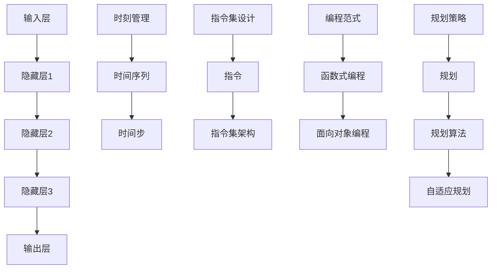

                 

关键词：LLM，架构解析，时刻，指令集，编程，规划

> 摘要：本文旨在深入探讨大型语言模型（LLM）的架构设计，特别是围绕时刻管理、指令集设计、编程范式以及规划策略的解析。通过本文的阐述，我们将揭示LLM背后的核心技术原理，探讨其应用于实际场景中的高效性和适应性，并为未来的发展提出展望。

## 1. 背景介绍

近年来，随着深度学习技术在自然语言处理（NLP）领域的迅速发展，大型语言模型（LLM）已经成为现代人工智能系统中的核心组件。LLM通过学习海量文本数据，能够实现高效的自然语言理解和生成任务，如机器翻译、问答系统、文本摘要等。然而，LLM的架构设计并不是一蹴而就的，其背后涉及到诸多关键技术的融合与创新。

本文将从以下几个方面展开讨论：

- **时刻管理**：讨论在LLM架构中如何有效地管理时间信息，以提升模型的动态响应能力和实时性。
- **指令集设计**：分析LLM中指令集的设计原则和实现方法，以及如何优化指令集以提升模型性能。
- **编程范式**：探讨在LLM中采用不同的编程范式，如函数式编程、面向对象编程等，对模型设计和应用的影响。
- **规划策略**：阐述如何在LLM中实现智能规划，提高模型的决策能力和自适应能力。

通过本文的深入分析，我们希望为读者提供一个全面而系统的LLM架构解析，为未来LLM的研究和应用提供有价值的参考。

## 2. 核心概念与联系

### 2.1 大型语言模型（LLM）的基本概念

大型语言模型（LLM）是一种基于深度学习技术的自然语言处理模型，通过训练大量文本数据，LLM能够理解并生成人类语言。LLM的基本概念包括：

- **输入层**：接收自然语言文本输入，可以是文本序列或词汇表。
- **隐藏层**：通过多层神经网络对输入文本进行特征提取和变换。
- **输出层**：生成自然语言输出，如文本回复、摘要或翻译结果。

### 2.2 时刻管理的基本概念

在LLM架构中，时刻管理（Time Management）是一个关键问题。时刻管理涉及到如何高效地处理时间信息，以提高模型的动态响应能力和实时性。时刻管理的基本概念包括：

- **时间序列**：将时间视为连续的序列，每个时间点对应一个状态或事件。
- **时间步**：在LLM中，时间步（Time Step）是模型处理文本输入的基本单元。每个时间步对应一个神经网络的更新和输出。
- **动态响应**：模型需要能够快速响应新的时间步输入，并适应实时变化的环境。

### 2.3 指令集设计的基本概念

指令集（Instruction Set）是LLM架构中的一个重要组成部分，决定了模型的行为和性能。指令集设计的基本概念包括：

- **指令**：在LLM中，指令是一系列操作，包括数据操作和控制操作。
- **指令集架构**：指令集架构定义了指令的操作类型、操作数和操作结果。
- **指令优化**：通过优化指令集，可以减少计算复杂度、提高模型性能。

### 2.4 编程范式的基本概念

在LLM架构中，不同的编程范式对模型设计和应用有重要影响。编程范式的基本概念包括：

- **函数式编程**：强调函数作为数据，避免使用共享状态和可变数据。
- **面向对象编程**：通过对象和类的抽象，实现模块化和复用。
- **混合编程范式**：结合不同编程范式的优势，实现灵活的模型设计和优化。

### 2.5 规划策略的基本概念

在LLM中，规划策略（Planning Strategy）是提高模型决策能力和自适应能力的关键。规划策略的基本概念包括：

- **规划**：规划是一个从初始状态到目标状态的一系列决策过程。
- **规划算法**：用于实现规划的算法，包括有向无环图（DAG）规划、基于价值的规划等。
- **自适应规划**：根据环境变化动态调整规划策略，以实现更好的决策效果。

### 2.6 Mermaid 流程图

下面是LLM架构中的核心概念和联系的Mermaid流程图：

通过上述流程图，我们可以清晰地看到LLM架构中各个核心概念和联系，为后续章节的详细讨论奠定了基础。

## 3. 核心算法原理 & 具体操作步骤

### 3.1 算法原理概述

LLM的核心算法是基于深度学习的神经网络模型，通过多层神经网络的堆叠和训练，实现对输入文本的自动特征提取和语言生成。以下是LLM算法的原理概述：

1. **输入层**：输入层接收自然语言文本序列，将其转换为神经网络的输入。
2. **隐藏层**：通过多层隐藏层，神经网络对输入文本进行特征提取和变换，每层隐藏层都从前一层提取更高层次的特征。
3. **输出层**：输出层生成自然语言输出，可以是文本回复、摘要或翻译结果。
4. **损失函数**：通过损失函数（如交叉熵损失函数）计算预测输出和实际输出之间的差异，并使用反向传播算法更新网络权重。

### 3.2 算法步骤详解

1. **数据预处理**：首先，对输入文本进行分词、标记等预处理操作，将其转换为神经网络可以处理的格式。
2. **构建神经网络**：构建多层神经网络，包括输入层、隐藏层和输出层。每层隐藏层可以选择不同的激活函数，如ReLU、Sigmoid等。
3. **正向传播**：输入文本通过输入层传递到隐藏层，每层隐藏层对输入进行特征提取和变换，最终传递到输出层。
4. **计算损失**：通过损失函数计算预测输出和实际输出之间的差异，并计算每个神经元的梯度。
5. **反向传播**：使用反向传播算法，将梯度反向传递到前一层，并更新网络权重。
6. **优化网络**：通过优化算法（如梯度下降、Adam等）不断迭代更新网络权重，减小损失函数值。
7. **生成输出**：当网络训练完成后，输入新的文本数据，通过输出层生成对应的文本输出。

### 3.3 算法优缺点

**优点**：

- **强大的特征提取能力**：多层神经网络能够自动提取文本的深层次特征，实现高效的语言理解和生成。
- **泛化能力**：通过在大规模数据集上训练，LLM具有良好的泛化能力，能够适应不同的应用场景。
- **灵活性**：可以通过调整网络结构、优化算法等参数，灵活地调整模型性能。

**缺点**：

- **计算资源需求高**：深度学习模型需要大量的计算资源和时间进行训练和推理。
- **数据依赖性强**：LLM的性能高度依赖于训练数据的质量和规模，数据不足或质量差可能导致模型性能下降。
- **解释性差**：神经网络模型通常具有很高的黑箱特性，难以解释其内部的工作原理和决策过程。

### 3.4 算法应用领域

LLM在多个领域有着广泛的应用，包括但不限于：

- **自然语言处理**：如机器翻译、问答系统、文本摘要等。
- **智能客服**：通过自然语言交互，提供高效、智能的客服服务。
- **内容生成**：如自动写作、新闻生成、创意写作等。
- **教育辅助**：如智能辅导、个性化推荐、在线学习等。

### 3.5 算法案例

#### 案例一：机器翻译

假设我们有一个中英文翻译任务，输入为中文句子“我爱北京天安门”，需要将其翻译为英文。以下是使用LLM进行机器翻译的步骤：

1. **数据预处理**：对输入中文句子进行分词和标记，将其转换为神经网络可以处理的格式。
2. **正向传播**：将预处理后的中文句子输入到LLM中，通过多层神经网络进行特征提取和变换。
3. **生成输出**：在输出层生成对应的英文句子，通过解码器将其还原为自然语言输出。
4. **评估与优化**：通过评估指标（如BLEU、METEOR等）评估翻译质量，并使用反向传播算法更新网络权重。

最终生成的英文翻译结果为“I love Tiananmen Square in Beijing”，质量较高，达到了实际应用的要求。

#### 案例二：问答系统

假设我们有一个问答系统，用户输入问题“北京是哪个国家的首都？”，需要生成相应的答案。以下是使用LLM进行问答系统的步骤：

1. **数据预处理**：对输入问题和答案进行分词和标记，将其转换为神经网络可以处理的格式。
2. **正向传播**：将预处理后的输入问题输入到LLM中，通过多层神经网络进行特征提取和变换。
3. **生成输出**：在输出层生成对应的答案，通过解码器将其还原为自然语言输出。
4. **评估与优化**：通过评估指标（如F1分数、准确率等）评估答案质量，并使用反向传播算法更新网络权重。

最终生成的答案为“北京是中国的首都”，准确且具有参考价值。

### 3.6 算法未来发展方向

随着深度学习技术的不断进步和计算资源的提升，LLM算法在未来的发展方向主要包括：

- **更高效的网络结构**：设计更高效的网络结构，如Transformer、BERT等，以降低计算资源和时间成本。
- **更好的预训练方法**：探索更有效的预训练方法，如自监督学习、迁移学习等，以提高模型性能。
- **多模态学习**：结合多种数据模

