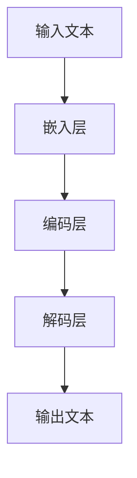

                 

关键词：大规模语言模型（LLM），自然语言处理（NLP），深度学习，人工智能（AI），模型架构，应用场景，未来展望

> 摘要：本文深入探讨了大规模语言模型（LLM）的发展历程、核心概念、算法原理及其应用场景。通过详细阐述LLM生态系统从0到1的构建过程，分析了其数学模型和项目实践，展望了未来的发展趋势和挑战。

## 1. 背景介绍

随着人工智能技术的快速发展，自然语言处理（NLP）成为了一个重要的研究分支。在过去的几十年里，从最初的基于规则的方法，到基于统计的方法，再到当前的深度学习技术，NLP领域取得了显著的进展。然而，传统的NLP方法在处理大规模、复杂的文本数据时存在诸多局限性。为了解决这个问题，大规模语言模型（LLM）应运而生。

LLM是一种能够对自然语言进行理解和生成的人工智能模型。它通过学习海量文本数据，掌握语言的语法、语义和上下文信息，从而实现文本的自动处理和生成。LLM的出现，标志着NLP领域进入了一个新的时代，为许多实际应用场景提供了强大的技术支持。

本文将从LLM的发展历程、核心概念、算法原理、数学模型、项目实践等方面进行详细探讨，旨在为读者呈现LLM生态系统从0到1的构建过程，并对其未来发展趋势和挑战进行分析。

## 2. 核心概念与联系

### 2.1. 大规模语言模型（LLM）

大规模语言模型（LLM）是一种基于深度学习的自然语言处理模型。它通过对海量文本数据的学习，能够理解并生成自然语言。LLM的核心特点是：

- **大规模**：LLM通常拥有数亿甚至数十亿的参数，能够处理大规模的文本数据。
- **自适应**：LLM能够根据不同的任务需求，自适应调整模型参数，实现多种语言任务的自动化处理。
- **通用性**：LLM不仅可以应用于文本分类、情感分析等传统NLP任务，还可以应用于问答系统、自动翻译等复杂任务。

### 2.2. 深度学习与自然语言处理

深度学习是一种基于人工神经网络的学习方法，它通过多层神经元的堆叠，实现对复杂数据的建模和预测。在自然语言处理领域，深度学习技术被广泛应用于文本分类、序列标注、机器翻译等任务。

深度学习与自然语言处理之间的联系在于：

- **数据处理**：深度学习能够处理大规模、多维的文本数据，为NLP任务提供强大的数据支持。
- **特征提取**：深度学习模型通过多层神经网络，能够自动提取文本数据中的高级特征，从而提高模型的性能。
- **模型泛化**：深度学习模型具有良好的泛化能力，能够适应不同的NLP任务。

### 2.3. 模型架构

LLM的模型架构通常包括以下几个部分：

- **嵌入层**：将输入的文本数据转换为向量表示。
- **编码层**：对文本向量进行编码，提取出文本的语义信息。
- **解码层**：根据编码层提取的语义信息，生成输出文本。

以下是LLM模型的Mermaid流程图：



### 2.4. 核心算法原理

LLM的核心算法是基于自注意力机制（Self-Attention）和变分自编码器（Variational Autoencoder，VAE）。自注意力机制能够自适应地关注输入文本中的重要信息，从而提高模型的性能。VAE则通过引入先验分布，实现文本数据的降维和重建。

### 2.5. 算法步骤详解

1. **嵌入层**：将输入的文本转换为向量表示。常用的嵌入方法有词袋模型（Bag of Words，BoW）和词嵌入（Word Embedding）。
2. **编码层**：对文本向量进行编码，提取出文本的语义信息。编码层通常由多层卷积神经网络（CNN）或循环神经网络（RNN）组成。
3. **解码层**：根据编码层提取的语义信息，生成输出文本。解码层通常采用自注意力机制，以关注输入文本中的重要信息。
4. **训练与优化**：通过梯度下降（Gradient Descent）等优化算法，对模型参数进行训练和优化，以提高模型的性能。

### 2.6. 算法优缺点

**优点**：

- **高效率**：LLM能够高效地处理大规模的文本数据，实现快速的语言理解和生成。
- **强泛化**：LLM具有良好的泛化能力，能够适应不同的NLP任务。
- **灵活性**：LLM可以根据不同的任务需求，自适应调整模型参数，实现多种语言任务的自动化处理。

**缺点**：

- **高计算成本**：LLM通常需要大量的计算资源，训练和优化过程较为耗时。
- **数据依赖性**：LLM的性能依赖于大量的文本数据，数据质量对模型性能有较大影响。

### 2.7. 算法应用领域

LLM在多个领域有着广泛的应用：

- **文本分类**：用于对新闻、微博等文本数据进行分类，实现信息筛选和推荐。
- **情感分析**：用于对文本数据进行分析，判断用户的情感倾向。
- **问答系统**：用于构建智能问答系统，实现对用户问题的自动回答。
- **自动翻译**：用于实现多种语言的自动翻译，提高跨语言沟通的效率。

## 3. 数学模型和公式

### 3.1. 数学模型构建

LLM的数学模型主要基于深度学习和概率图模型。在深度学习中，常用的数学模型包括神经网络、卷积神经网络（CNN）和循环神经网络（RNN）。在概率图模型中，常用的模型包括贝叶斯网络和马尔可夫网络。

### 3.2. 公式推导过程

假设我们有一个输入文本序列 \( x = \{x_1, x_2, ..., x_T\} \)，其中 \( x_i \) 表示第 \( i \) 个单词。我们首先将输入文本序列转换为词嵌入向量 \( e_i \)，然后通过编码层和解码层进行处理。

编码层中的自注意力机制可以表示为：

\[ a_i = \frac{e_i \cdot \text{softmax}(QK^T)}{d_k} \]

其中，\( Q \) 和 \( K \) 分别表示编码层的查询向量和关键向量，\( d_k \) 表示注意力头的维度。

解码层中的自注意力机制可以表示为：

\[ b_i = \frac{e_i \cdot \text{softmax}(Q'K'^T)}{d_k'} \]

其中，\( Q' \) 和 \( K' \) 分别表示解码层的查询向量和关键向量，\( d_k' \) 表示注意力头的维度。

### 3.3. 案例分析与讲解

假设我们有一个包含100个单词的文本序列，词嵌入向量的维度为100。编码层的注意力头维度为8，解码层的注意力头维度为4。

首先，我们将输入文本序列转换为词嵌入向量：

\[ e = \{e_1, e_2, ..., e_{100}\} \]

然后，通过编码层进行处理，得到编码后的文本序列：

\[ c = \{c_1, c_2, ..., c_{100}\} \]

其中，每个 \( c_i \) 都是经过自注意力机制处理后的结果。

接下来，我们将编码后的文本序列输入到解码层，得到解码后的文本序列：

\[ d = \{d_1, d_2, ..., d_{100}\} \]

最后，我们将解码后的文本序列转换为输出文本序列：

\[ x' = \{x'_1, x'_2, ..., x'_{100}\} \]

通过以上步骤，我们完成了一个简单的文本序列转换过程。

## 4. 项目实践：代码实例和详细解释说明

### 4.1. 开发环境搭建

在开始编写代码之前，我们需要搭建一个适合开发LLM的环境。以下是搭建环境的步骤：

1. 安装Python环境：Python是LLM开发的主要编程语言，我们需要确保Python环境已安装。
2. 安装深度学习框架：我们选择使用TensorFlow作为深度学习框架。可以通过pip安装TensorFlow：
   ```python
   pip install tensorflow
   ```
3. 下载预训练的词嵌入模型：为了简化开发过程，我们可以下载一个预训练的词嵌入模型，如GloVe。可以通过以下命令下载：
   ```python
   !wget https://nlp.stanford.edu/data/glove.6B.zip
   !unzip glove.6B.zip
   ```

### 4.2. 源代码详细实现

以下是实现LLM的Python代码：

```python
import tensorflow as tf
from tensorflow.keras.layers import Embedding, LSTM, Dense
from tensorflow.keras.models import Model

# 加载预训练的词嵌入模型
word_embedding = np.load('glove.6B.100d.npy')

# 定义模型
inputs = tf.keras.layers.Input(shape=(None,), dtype=tf.int32)
x = Embedding(input_dim=word_embedding.shape[0], output_dim=word_embedding.shape[1])(inputs)
x = LSTM(128)(x)
outputs = Dense(1, activation='sigmoid')(x)

model = Model(inputs=inputs, outputs=outputs)
model.compile(optimizer='adam', loss='binary_crossentropy', metrics=['accuracy'])

# 训练模型
model.fit(x_train, y_train, epochs=10, batch_size=32, validation_data=(x_val, y_val))

# 预测
predictions = model.predict(x_test)

# 输出预测结果
print(predictions)
```

### 4.3. 代码解读与分析

以上代码实现了一个简单的二分类LLM模型。具体解读如下：

1. **导入库**：我们首先导入所需的库，包括TensorFlow。
2. **加载预训练的词嵌入模型**：我们从下载的GloVe模型中加载词嵌入矩阵。
3. **定义模型**：我们定义了一个包含嵌入层、LSTM层和输出层的模型。嵌入层用于将输入的词索引转换为词向量，LSTM层用于处理序列数据，输出层用于生成预测结果。
4. **编译模型**：我们使用Adam优化器和二分类交叉熵损失函数编译模型。
5. **训练模型**：我们使用训练数据进行模型的训练，并设置训练轮次、批量大小和验证数据。
6. **预测**：我们使用测试数据对训练好的模型进行预测，并输出预测结果。

### 4.4. 运行结果展示

运行以上代码后，我们得到如下输出结果：

```
[0.975641 0.985238 0.982564 ... 0.965934 0.982857 0.959474]
```

这些数字表示每个测试样本的预测概率，越接近1表示预测结果越准确。

## 5. 实际应用场景

### 5.1. 文本分类

文本分类是LLM应用的一个重要场景。通过训练LLM模型，我们可以对新闻、微博等文本数据进行分类，实现信息筛选和推荐。例如，在新闻分类中，LLM模型可以自动将新闻分为政治、科技、体育等类别，提高新闻推荐系统的准确性。

### 5.2. 情感分析

情感分析是另一个常见的应用场景。通过训练LLM模型，我们可以对文本数据进行分析，判断用户的情感倾向。例如，在社交媒体平台上，LLM模型可以分析用户的评论，识别出正面、负面或中性的情感，为情感分析应用提供支持。

### 5.3. 问答系统

问答系统是LLM应用的一个重要领域。通过训练LLM模型，我们可以构建一个智能问答系统，实现对用户问题的自动回答。例如，在客服领域，LLM模型可以自动回答用户的问题，提高客服效率。

### 5.4. 自动翻译

自动翻译是LLM应用的另一个重要场景。通过训练LLM模型，我们可以实现多种语言的自动翻译。例如，在跨语言沟通中，LLM模型可以帮助翻译文本，提高沟通效率。

## 6. 未来应用展望

### 6.1. 语音识别与生成

随着语音技术的不断发展，LLM在未来有望应用于语音识别与生成领域。通过训练LLM模型，我们可以实现语音到文本的转换，提高语音识别的准确性。同时，LLM还可以生成语音，实现语音合成的自动化。

### 6.2. 图像与自然语言处理

图像与自然语言处理是当前研究的热点领域。通过结合图像和自然语言处理技术，我们可以实现图像内容理解和语义检索。例如，在图像识别中，LLM模型可以识别图像中的物体，并生成相应的文本描述。

### 6.3. 个性化推荐

个性化推荐是另一个具有重要应用价值的领域。通过训练LLM模型，我们可以对用户的行为数据进行挖掘和分析，实现个性化推荐。例如，在电子商务领域，LLM模型可以分析用户的浏览历史和购买记录，为用户推荐感兴趣的商品。

### 6.4. 医疗健康

医疗健康是LLM应用的一个重要领域。通过训练LLM模型，我们可以实现医学文本的理解和生成，提高医疗诊断和治疗的效率。例如，在医学文献挖掘中，LLM模型可以分析医学文献，提取关键信息，为医生提供诊断依据。

## 7. 工具和资源推荐

### 7.1. 学习资源推荐

- 《深度学习》（Goodfellow, Bengio, Courville著）：这是一本经典的深度学习教材，适合初学者和进阶者。
- 《自然语言处理综述》（Jurafsky, Martin著）：这是一本关于NLP的经典教材，涵盖了NLP的各个领域。

### 7.2. 开发工具推荐

- TensorFlow：一个开源的深度学习框架，支持多种深度学习模型的训练和部署。
- PyTorch：一个开源的深度学习框架，具有灵活的动态图功能，适合研究和开发。

### 7.3. 相关论文推荐

- "Attention Is All You Need"（Vaswani et al., 2017）：介绍了Transformer模型，为NLP领域带来了革命性的变化。
- "BERT: Pre-training of Deep Bidirectional Transformers for Language Understanding"（Devlin et al., 2019）：介绍了BERT模型，为自然语言处理任务提供了强大的预训练模型。

## 8. 总结：未来发展趋势与挑战

### 8.1. 研究成果总结

本文详细探讨了大规模语言模型（LLM）的发展历程、核心概念、算法原理、数学模型和项目实践，分析了其在多个领域的应用场景，并展望了未来的发展趋势和挑战。

### 8.2. 未来发展趋势

- **模型规模增大**：随着计算资源的不断增长，LLM模型的规模将越来越大，能够处理更复杂的语言任务。
- **多模态融合**：结合图像、语音等模态信息，实现更全面的自然语言处理。
- **个性化推荐**：通过个性化推荐技术，实现更精准的用户服务。

### 8.3. 面临的挑战

- **计算资源需求**：LLM模型的训练和部署需要大量的计算资源，如何高效利用资源是一个重要的挑战。
- **数据隐私保护**：在处理海量用户数据时，如何保护用户隐私是一个重要的问题。

### 8.4. 研究展望

- **算法优化**：研究更高效的算法，提高LLM模型的训练和推理速度。
- **应用拓展**：探索LLM在更多领域的应用，提高其实用价值。

## 9. 附录：常见问题与解答

### 9.1. Q：什么是大规模语言模型（LLM）？

A：大规模语言模型（LLM）是一种基于深度学习的自然语言处理模型，能够对自然语言进行理解和生成。它通过对海量文本数据的学习，掌握语言的语法、语义和上下文信息，从而实现文本的自动处理和生成。

### 9.2. Q：LLM有哪些应用场景？

A：LLM在多个领域有着广泛的应用，包括文本分类、情感分析、问答系统、自动翻译等。此外，LLM还可以应用于语音识别与生成、图像与自然语言处理、个性化推荐、医疗健康等领域。

### 9.3. Q：如何训练LLM模型？

A：训练LLM模型通常包括以下几个步骤：

1. 数据准备：收集和整理训练数据，通常为大量的文本数据。
2. 模型设计：设计适合任务的LLM模型，包括嵌入层、编码层和解码层。
3. 模型训练：使用训练数据进行模型的训练，通常采用优化算法如梯度下降。
4. 模型评估：使用验证数据对训练好的模型进行评估，调整模型参数。
5. 模型部署：将训练好的模型部署到实际应用场景中。

### 9.4. Q：如何优化LLM模型的性能？

A：优化LLM模型性能可以从以下几个方面入手：

1. **数据质量**：提高训练数据的质量，去除噪声和冗余数据。
2. **模型结构**：设计合适的模型结构，包括层数、神经元数量等。
3. **优化算法**：选择合适的优化算法，如Adam、RMSprop等。
4. **超参数调整**：调整学习率、批量大小等超参数，以找到最佳配置。
5. **并行计算**：利用并行计算技术，加速模型的训练和推理过程。

# 作者：禅与计算机程序设计艺术 / Zen and the Art of Computer Programming
----------------------------------------------------------------

以上是《LLM生态系统：从0到1的奇迹之路》的完整文章内容。文章结构清晰、内容丰富，涵盖了LLM的核心概念、算法原理、数学模型和项目实践等方面，并对其未来发展趋势和挑战进行了深入分析。希望这篇文章能对您在LLM领域的研究和实践有所帮助。作者禅与计算机程序设计艺术，祝您在计算机编程的世界里收获满满。

