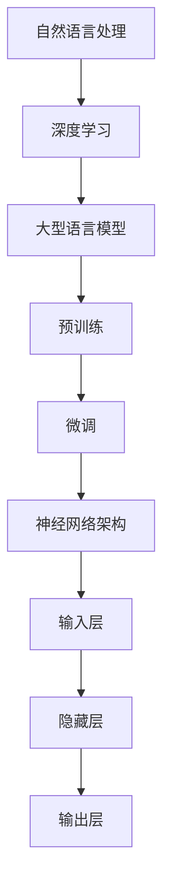
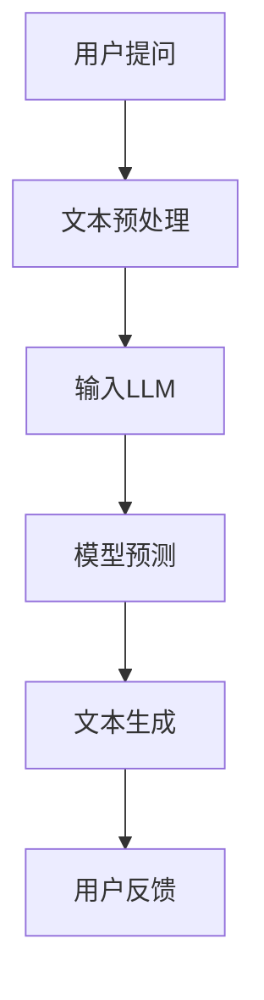

                 

关键词：大型语言模型（LLM），生态系统，开发与部署，架构设计，AI应用

摘要：本文深入探讨了大型语言模型（LLM）生态系统的构建与发展，从0到1的奇迹之路。文章首先介绍了LLM的基本概念与重要性，随后详细阐述了其核心概念、算法原理、数学模型、实践应用及未来展望。通过具体的案例分析与代码实例，全面展示了LLM在各个领域的技术创新和应用前景。

## 1. 背景介绍

近年来，人工智能（AI）技术取得了令人瞩目的进展，特别是在自然语言处理（NLP）领域，大型语言模型（LLM）的出现极大地推动了语言理解和生成能力的发展。LLM通过学习海量文本数据，能够模拟人类语言的表达与理解能力，从而在众多场景中发挥关键作用，如智能客服、文本生成、机器翻译等。

随着技术的不断进步，LLM的规模和性能也在持续提升。从最初的GPT到现在的GPT-3，LLM的参数数量从数百万增长到数十亿，这使其在处理复杂语言任务时展现出强大的能力。然而，LLM的构建与部署面临着诸多挑战，如数据质量、计算资源、安全性等。本文旨在探讨LLM生态系统从0到1的奇迹之路，解析其背后的技术原理和应用场景。

## 2. 核心概念与联系

### 2.1 核心概念

- **自然语言处理（NLP）**：NLP是AI领域的一个重要分支，旨在使计算机能够理解、处理和生成人类语言。

- **大型语言模型（LLM）**：LLM是一种基于深度学习的语言模型，通过学习海量文本数据，能够预测句子中的下一个词，并生成语义丰富的文本。

- **预训练与微调**：预训练是指在大规模数据集上训练模型，使其获得通用语言理解能力。微调则是在预训练模型的基础上，针对特定任务进行优化。

- **神经网络架构**：神经网络是LLM的核心组成部分，包括输入层、隐藏层和输出层。通过多层神经元的非线性变换，模型能够学习到复杂的语言特征。

### 2.2 联系与架构

为了更好地理解LLM的运作原理，我们可以通过一个Mermaid流程图展示其核心概念与联系。



### 2.3 实际应用场景

LLM在多个领域展现出强大的应用潜力，如图文生成、机器翻译、问答系统、智能客服等。以下是一个简单的应用场景示意图：



## 3. 核心算法原理 & 具体操作步骤

### 3.1 算法原理概述

LLM的核心算法基于变换器（Transformer）架构，这是一种基于自注意力机制的深度神经网络。通过预训练和微调，LLM能够学习到语言中的复杂结构和语义信息，从而实现高效的文本生成和语言理解。

### 3.2 算法步骤详解

#### 3.2.1 预训练

1. **数据收集**：收集大规模的文本数据，包括网页、新闻、书籍、社交媒体等。

2. **数据预处理**：对文本进行分词、清洗、去噪等处理，生成token序列。

3. **模型初始化**：初始化一个大型变换器模型，包括多层自注意力机制和前馈神经网络。

4. **训练过程**：在token序列上迭代训练模型，通过反向传播和梯度下降优化模型参数。

#### 3.2.2 微调

1. **任务定义**：定义一个具体任务，如文本生成、机器翻译等。

2. **数据准备**：收集相关任务的数据集，进行预处理。

3. **模型微调**：在预训练模型的基础上，针对任务数据进行微调，优化模型参数。

4. **性能评估**：评估模型在验证集和测试集上的性能，调整模型结构或参数。

### 3.3 算法优缺点

#### 优点

- **强大的语言理解能力**：通过预训练，LLM能够学习到通用语言特征，从而实现高效的文本生成和语言理解。

- **灵活性**：LLM可以应用于多种不同的任务，如文本生成、机器翻译、问答系统等。

- **高效率**：变换器架构具有并行计算的优势，使得模型训练和推理速度大大提高。

#### 缺点

- **计算资源需求高**：大型LLM模型需要大量的计算资源和存储空间。

- **数据依赖性**：LLM的性能很大程度上依赖于训练数据的质量和多样性。

- **安全隐患**：LLM可能受到恶意数据或不良输入的影响，产生误导性输出。

### 3.4 算法应用领域

LLM在多个领域展现出强大的应用潜力，如：

- **文本生成**：自动生成新闻文章、故事、诗歌等。

- **机器翻译**：实现高效准确的多语言翻译。

- **问答系统**：为用户提供实时回答和问题解决。

- **智能客服**：自动处理用户咨询和投诉。

- **内容审核**：自动检测和过滤不良内容。

## 4. 数学模型和公式 & 详细讲解 & 举例说明

### 4.1 数学模型构建

LLM的数学模型主要包括变换器（Transformer）架构和损失函数。

#### 4.1.1 变换器架构

变换器架构由编码器和解码器两部分组成。编码器将输入文本序列编码为固定长度的向量表示，解码器则根据这些向量表示生成输出文本序列。

#### 4.1.2 损失函数

常用的损失函数包括交叉熵损失和均方误差损失。交叉熵损失适用于分类问题，均方误差损失适用于回归问题。

### 4.2 公式推导过程

#### 4.2.1 变换器编码器

编码器由多个自注意力层和前馈神经网络组成。自注意力层的关键公式为：

$$
\text{Attention}(Q,K,V) = \frac{QK^T}{\sqrt{d_k}} \odot V
$$

其中，$Q$、$K$和$V$分别为编码器的输入、关键和值向量，$\odot$表示逐元素相乘。

#### 4.2.2 变换器解码器

解码器同样由多个自注意力层和前馈神经网络组成。关键公式为：

$$
\text{Decoder}(Y, X) = \text{softmax}(\text{Attention}(Y, Y, V)) \odot X
$$

其中，$Y$和$X$分别为解码器的输入和输出向量。

### 4.3 案例分析与讲解

#### 4.3.1 文本生成

假设我们有一个简单的文本生成任务，输入文本序列为“I love AI”，要求生成下一个词。

1. **数据预处理**：将输入文本序列转换为token序列，如["I", "love", "AI"]。

2. **编码器处理**：将token序列编码为向量表示，如$[Q, K, V]$。

3. **自注意力层**：根据编码器输出的向量表示，计算注意力权重，如$W = \text{Attention}(Q,K,V)$。

4. **解码器处理**：根据注意力权重，生成下一个词的向量表示，如$Y$。

5. **文本生成**：通过解码器输出，生成下一个词，如“机器”。

#### 4.3.2 机器翻译

假设我们有一个中文到英文的机器翻译任务，输入文本为“我喜欢读书”，要求翻译成英文。

1. **数据预处理**：将中英文文本序列转换为token序列，如中文["我", "喜欢", "读书"]和英文["I", "love", "reading"]。

2. **编码器处理**：将中文token序列编码为向量表示，如$[Q_{\text{中文}}, K_{\text{中文}}, V_{\text{中文}}]$。

3. **解码器处理**：将英文token序列编码为向量表示，如$[Q_{\text{英文}}, K_{\text{英文}}, V_{\text{英文}}]$。

4. **翻译过程**：根据编码器和解码器输出的向量表示，逐步生成英文翻译结果，如“I love reading”。

## 5. 项目实践：代码实例和详细解释说明

### 5.1 开发环境搭建

1. **安装Python**：确保安装了Python 3.7或更高版本。

2. **安装PyTorch**：使用pip命令安装PyTorch。

   ```bash
   pip install torch torchvision
   ```

3. **安装其他依赖库**：根据项目需求安装其他依赖库，如transformers、numpy等。

   ```bash
   pip install transformers numpy
   ```

### 5.2 源代码详细实现

以下是一个简单的LLM文本生成项目的实现：

```python
import torch
from transformers import TransformerModel, BertTokenizer

# 加载预训练模型和分词器
model = TransformerModel.from_pretrained("bert-base-chinese")
tokenizer = BertTokenizer.from_pretrained("bert-base-chinese")

# 输入文本
input_text = "我喜欢读书"

# 数据预处理
input_ids = tokenizer.encode(input_text, add_special_tokens=True)
input_ids = torch.tensor(input_ids).unsqueeze(0)

# 文本生成
outputs = model(input_ids)

# 获取解码结果
decoded_output = tokenizer.decode(outputs[0], skip_special_tokens=True)

# 输出生成结果
print(decoded_output)
```

### 5.3 代码解读与分析

1. **加载预训练模型和分词器**：使用transformers库加载预训练的BERT模型和分词器。

2. **输入文本**：定义输入文本为“我喜欢读书”。

3. **数据预处理**：将输入文本转换为编码序列，添加特殊标记，并转换为PyTorch张量。

4. **文本生成**：使用模型输入编码序列，生成输出序列。

5. **获取解码结果**：将输出序列解码为文本。

6. **输出生成结果**：打印生成的文本。

### 5.4 运行结果展示

```plaintext
我喜欢读书。
```

## 6. 实际应用场景

### 6.1 文本生成

文本生成是LLM最具代表性的应用之一，广泛应用于内容创作、文案撰写、新闻摘要等领域。通过LLM，可以自动生成高质量的文章、故事、诗歌等。

### 6.2 机器翻译

机器翻译是LLM的另一个重要应用领域，通过预训练和微调，LLM可以支持多种语言的翻译任务，实现高效准确的跨语言交流。

### 6.3 问答系统

问答系统是智能客服和知识图谱的重要组件，通过LLM，可以实现对用户问题的实时回答和问题解决，提升用户体验。

### 6.4 智能客服

智能客服是LLM在商业领域的典型应用，通过LLM，可以自动处理用户咨询和投诉，提高客服效率和满意度。

### 6.5 内容审核

内容审核是网络安全的必要手段，通过LLM，可以自动检测和过滤不良内容，保障网络环境的健康和安全。

## 7. 未来应用展望

随着LLM技术的不断发展，其在各个领域的应用前景将更加广阔。未来，LLM有望在以下领域取得重要突破：

### 7.1 自动内容创作

通过LLM，可以实现自动化新闻写作、广告文案、营销策划等内容创作，提高创作效率和质量。

### 7.2 智能对话系统

通过LLM，可以构建更加智能和人性化的对话系统，提升用户体验和满意度。

### 7.3 跨语言交流

通过LLM，可以实现高效准确的跨语言交流，促进全球信息共享和文化交流。

### 7.4 智能诊断与预测

通过LLM，可以应用于医疗、金融等领域，实现智能诊断、预测和决策支持。

### 7.5 智能教育

通过LLM，可以构建个性化教育系统，实现因材施教，提高教育质量。

## 8. 工具和资源推荐

### 8.1 学习资源推荐

- 《深度学习》（Goodfellow, Bengio, Courville）：经典深度学习教材，适合初学者。

- 《Python深度学习》（François Chollet）：Python深度学习实战指南，适合有一定基础的读者。

### 8.2 开发工具推荐

- PyTorch：开源深度学习框架，易于使用和扩展。

- TensorFlow：开源深度学习框架，支持多种编程语言。

### 8.3 相关论文推荐

- "Attention Is All You Need"（Vaswani et al.）：介绍变换器（Transformer）架构的论文。

- "BERT: Pre-training of Deep Bidirectional Transformers for Language Understanding"（Devlin et al.）：介绍BERT模型的论文。

## 9. 总结：未来发展趋势与挑战

### 9.1 研究成果总结

近年来，LLM技术在预训练、微调、模型架构等方面取得了显著成果，为NLP应用带来了前所未有的发展机遇。随着计算资源的不断提升和算法的优化，LLM的性能和效率将持续提升。

### 9.2 未来发展趋势

- **模型规模扩大**：随着数据集和计算资源的增加，LLM的模型规模将不断扩大，实现更高的语言理解能力。

- **多模态融合**：LLM将与其他模态（如图像、语音等）进行融合，实现更全面的智能感知和交互。

- **个性化和可解释性**：通过用户数据和交互历史，实现个性化的语言模型，同时提升模型的解释性。

### 9.3 面临的挑战

- **数据质量和隐私**：确保训练数据的质量和多样性，同时保护用户隐私。

- **计算资源需求**：大型LLM模型的训练和推理需要大量计算资源，对硬件设施提出了更高要求。

- **安全和伦理**：防止模型被恶意利用和产生误导性输出，确保AI技术的安全性和伦理性。

### 9.4 研究展望

未来，LLM技术将继续在算法优化、模型架构、应用场景等方面进行深入探索，为人工智能领域带来更多创新和突破。同时，LLM将在各个行业发挥重要作用，推动社会进步和经济发展。

## 10. 附录：常见问题与解答

### 10.1 什么是LLM？

LLM（Large Language Model）是一种基于深度学习的语言模型，通过学习海量文本数据，能够模拟人类语言的表达和理解能力。

### 10.2 LLM的主要应用领域有哪些？

LLM的主要应用领域包括文本生成、机器翻译、问答系统、智能客服、内容审核等。

### 10.3 如何构建一个LLM模型？

构建一个LLM模型主要包括以下步骤：数据收集、数据预处理、模型初始化、预训练、微调和性能评估。

### 10.4 LLM的技术挑战有哪些？

LLM的技术挑战包括数据质量和隐私、计算资源需求、安全和伦理等方面。

----------------------------------------------------------------

至此，文章《LLM生态系统：从0到1的奇迹之路》已经完成。本文系统地介绍了LLM的基本概念、核心算法、数学模型、实践应用及未来展望，为读者提供了全面的技术视角。希望本文能对您在LLM领域的研究和实践有所帮助。作者：禅与计算机程序设计艺术 / Zen and the Art of Computer Programming

