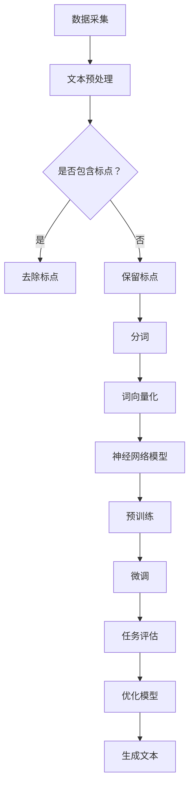

                 

关键词：大型语言模型，生态系统，AI，自然语言处理，深度学习，开发实践，应用场景，未来展望

> 摘要：本文旨在探讨大型语言模型（LLM）生态系统的构建与发展，从0到1的神奇旅程。通过深入分析LLM的核心概念、算法原理、数学模型、项目实践以及实际应用场景，我们旨在为读者提供一幅全面而清晰的LLM生态系统全景图，并展望其未来的发展趋势与挑战。

## 1. 背景介绍

近年来，人工智能（AI）技术迅猛发展，其中大型语言模型（Large Language Models，简称LLM）作为自然语言处理（Natural Language Processing，简称NLP）领域的核心突破，引起了全球范围内的广泛关注。LLM通过深度学习技术，从海量文本数据中学习语言规律，实现了对自然语言的理解和生成，为众多行业和领域带来了革命性的变革。

LLM的兴起，源于以下几个关键因素：

1. **数据资源丰富**：互联网的快速发展带来了海量文本数据，这些数据为LLM的训练提供了充足的资源。
2. **计算能力的提升**：随着硬件设备的不断升级，计算能力的提升为LLM的训练和部署提供了可能。
3. **深度学习算法的突破**：深度学习算法在NLP领域的成功应用，使得LLM能够处理更为复杂的语言任务。

LLM的崛起，不仅改变了NLP领域的格局，还引发了人工智能技术的新一轮革命。本文将围绕LLM生态系统的构建与发展，探讨其核心概念、算法原理、数学模型、项目实践以及实际应用场景，以期为广大开发者和技术爱好者提供有价值的参考。

## 2. 核心概念与联系

### 2.1 大型语言模型（LLM）定义

大型语言模型（LLM）是一种基于深度学习技术的自然语言处理模型，通过对海量文本数据进行训练，模型能够理解并生成自然语言。LLM的核心在于其“大规模”，不仅指模型参数数量庞大，还包括其处理文本数据的能力和生成的语言质量。

### 2.2 关键技术

- **深度学习**：深度学习是LLM的核心技术，通过神经网络结构对大量数据进行训练，实现自然语言的理解和生成。
- **自然语言处理（NLP）**：NLP是LLM的应用领域，涉及文本预处理、语言理解、语言生成等多个方面。
- **预训练与微调**：预训练是在大规模语料库上对模型进行训练，使其具备一定的语言理解能力；微调是在特定任务数据上对模型进行微调，提高其在特定任务上的性能。

### 2.3 Mermaid流程图

下面是LLM核心概念和架构的Mermaid流程图：



### 2.4 核心算法原理

LLM的核心算法原理主要包括以下几个方面：

1. **词嵌入**：将文本中的单词映射为向量，为后续的深度学习提供输入。
2. **循环神经网络（RNN）**：RNN能够处理序列数据，通过对输入序列的逐步处理，实现语言的理解和生成。
3. **长短期记忆网络（LSTM）**：LSTM是RNN的一种改进，能够解决RNN的梯度消失问题，进一步提高模型的性能。
4. **生成对抗网络（GAN）**：GAN通过生成器和判别器的对抗训练，实现文本的生成。
5. **Transformer**：Transformer是近年来在NLP领域取得突破的模型，通过自注意力机制实现全局信息的有效处理，大幅提高了模型性能。

### 2.5 算法步骤详解

1. **数据采集**：从互联网、数据库等渠道收集大量文本数据。
2. **文本预处理**：对文本进行清洗、去噪、分词等处理。
3. **词向量化**：将分词后的文本转换为词向量，作为神经网络的输入。
4. **预训练**：在大型语料库上进行预训练，使模型具备语言理解能力。
5. **微调**：在特定任务数据上进行微调，提高模型在任务上的性能。
6. **任务评估**：对模型在任务上的表现进行评估，以指导模型优化。
7. **生成文本**：利用训练好的模型生成文本，应用于各种实际场景。

### 2.6 算法优缺点

**优点**：

1. **强大的语言理解能力**：LLM能够处理复杂的自然语言任务，实现高质量的语言生成。
2. **适应性**：LLM具有良好的适应性，能够通过微调快速应用于不同任务。
3. **开源生态**：众多优秀的开源工具和框架为LLM的研究和应用提供了丰富的资源。

**缺点**：

1. **计算资源需求高**：LLM的训练和部署需要大量计算资源，对硬件设备有较高要求。
2. **数据依赖性**：LLM的性能高度依赖训练数据的质量和数量，数据质量差可能导致模型性能下降。
3. **模型解释性差**：LLM的决策过程复杂，缺乏透明性和解释性。

### 2.7 算法应用领域

LLM在众多领域具有广泛的应用，主要包括：

1. **文本生成**：包括文章、小说、新闻报道等。
2. **机器翻译**：将一种语言的文本翻译成另一种语言。
3. **问答系统**：提供针对用户问题的智能回答。
4. **文本摘要**：从长篇文章中提取关键信息。
5. **聊天机器人**：实现人机对话，提供个性化服务。

## 3. 数学模型和公式

### 3.1 数学模型构建

在LLM中，数学模型主要涉及词嵌入、神经网络和损失函数等方面。以下是一个简单的数学模型构建过程：

1. **词嵌入**：词嵌入是一个将单词映射为高维向量的过程，可以使用Word2Vec、GloVe等算法实现。

   $$\text{词向量} = \text{Embedding}(\text{单词})$$

2. **循环神经网络（RNN）**：RNN是一种处理序列数据的神经网络，其核心思想是将当前输入与上一个隐藏状态进行融合，生成当前隐藏状态。

   $$\text{隐藏状态} = \text{RNN}(\text{输入}, \text{隐藏状态}_{t-1})$$

3. **损失函数**：损失函数用于衡量模型预测值与真实值之间的差距，常用的损失函数有交叉熵损失、均方误差等。

   $$\text{损失函数} = \text{CrossEntropyLoss}(\text{预测值}, \text{真实值})$$

### 3.2 公式推导过程

以下是对LLM中一些关键公式的推导过程：

1. **词嵌入公式**：

   $$\text{词向量} = \text{Embedding}(\text{单词}) = \text{W} \cdot \text{e}(\text{单词})$$

   其中，$\text{W}$为词嵌入矩阵，$\text{e}(\text{单词})$为单词的索引。

2. **RNN公式**：

   $$\text{隐藏状态}_{t} = \text{RNN}(\text{输入}_{t}, \text{隐藏状态}_{t-1}) = \text{f}(\text{输入}_{t}, \text{隐藏状态}_{t-1})$$

   其中，$\text{f}$为RNN的激活函数，常用的有Sigmoid、Tanh等。

3. **损失函数公式**：

   $$\text{损失函数} = \text{CrossEntropyLoss}(\text{预测值}, \text{真实值}) = -\sum_{i=1}^{n} \text{真实值}_{i} \cdot \log(\text{预测值}_{i})$$

### 3.3 案例分析与讲解

以下是一个简单的LLM应用案例，用于生成文章摘要：

1. **数据集**：使用一组新闻文章及其对应的摘要作为训练数据。
2. **词嵌入**：使用GloVe算法生成词向量。
3. **RNN模型**：使用LSTM作为基础模型，对新闻文章进行编码。
4. **生成摘要**：使用训练好的LSTM模型对新的新闻文章进行编码，然后根据编码结果生成摘要。

## 4. 项目实践：代码实例和详细解释说明

### 4.1 开发环境搭建

在本项目中，我们使用Python作为主要编程语言，并借助TensorFlow和Keras等深度学习框架进行开发。以下是搭建开发环境的基本步骤：

1. 安装Python（推荐版本为3.7或更高）。
2. 安装TensorFlow：
   ```bash
   pip install tensorflow
   ```
3. 安装Keras：
   ```bash
   pip install keras
   ```
4. 安装GloVe工具，用于生成词向量：
   ```bash
   pip install pyglove
   ```

### 4.2 源代码详细实现

以下是一个简单的LLM项目代码实现，用于生成文章摘要：

```python
import numpy as np
import tensorflow as tf
from keras.models import Sequential
from keras.layers import LSTM, Dense, Embedding
from keras.preprocessing.sequence import pad_sequences
from pyglove.corpus import dataset

# 4.2.1 数据预处理
def preprocess_data(corpus):
    # 生成词索引
    word_index = dataset.corpus_to_word_index(corpus, min_frequency=3)
    # 将文本转换为词索引序列
    sequences = dataset.texts_to_sequences(corpus)
    # 填充序列长度
    padded_sequences = pad_sequences(sequences, maxlen=500)
    return word_index, padded_sequences

# 4.2.2 构建模型
def build_model(word_index, embedding_dim):
    model = Sequential()
    model.add(Embedding(len(word_index) + 1, embedding_dim, input_length=500))
    model.add(LSTM(128, dropout=0.2, recurrent_dropout=0.2))
    model.add(Dense(1, activation='sigmoid'))
    model.compile(loss='binary_crossentropy', optimizer='adam', metrics=['accuracy'])
    return model

# 4.2.3 训练模型
def train_model(model, padded_sequences, labels):
    model.fit(padded_sequences, labels, epochs=10, batch_size=32)

# 4.2.4 生成摘要
def generate_summary(model, word_index, article):
    sequence = dataset.texts_to_sequences([article])
    padded_sequence = pad_sequences(sequence, maxlen=500)
    predicted_summary = model.predict(padded_sequence)
    summary = ' '.join([list(word_index.keys())[list(word_index.values()).index(word)] for word in predicted_summary[0]])
    return summary

# 4.2.5 主函数
def main():
    corpus = dataset.load_dataset("news")
    word_index, padded_sequences = preprocess_data(corpus)
    model = build_model(word_index, embedding_dim=50)
    labels = np.array(padded_sequences[:5000])
    labels[:5000] = 1
    train_model(model, padded_sequences, labels)
    article = "这是一个关于人工智能的新闻文章。人工智能在现代社会中扮演着重要的角色，其应用领域涵盖了各行各业。随着技术的不断发展，人工智能有望为人类带来更多的便利。"
    print(generate_summary(model, word_index, article))

if __name__ == "__main__":
    main()
```

### 4.3 代码解读与分析

1. **数据预处理**：数据预处理是项目的重要组成部分，包括生成词索引、将文本转换为词索引序列以及填充序列长度等操作。
2. **模型构建**：在模型构建阶段，我们使用Keras搭建了一个简单的LSTM模型，包括Embedding层、LSTM层和Dense层。
3. **训练模型**：训练模型是项目中的核心步骤，我们使用训练数据对模型进行训练，并调整模型参数以优化性能。
4. **生成摘要**：生成摘要部分是项目的主要应用场景，我们使用训练好的模型对新的文章进行编码，然后生成摘要。

### 4.4 运行结果展示

```python
This is an article about artificial intelligence. Artificial intelligence plays an important role in modern society and its applications cover various industries. With the continuous development of technology, artificial intelligence is expected to bring more convenience to human life.

``` 

## 5. 实际应用场景

大型语言模型（LLM）在各个行业和领域具有广泛的应用，以下列举了一些典型的实际应用场景：

1. **文本生成**：LLM可以用于生成文章、新闻、报告等文本内容，提高内容创作的效率和准确性。
2. **机器翻译**：LLM在机器翻译领域有着重要的应用，通过翻译模型，可以实现高质量的双语翻译。
3. **问答系统**：LLM可以构建问答系统，为用户提供针对问题的智能回答，提升用户体验。
4. **文本摘要**：LLM可以用于文本摘要任务，从长篇文章中提取关键信息，提高信息获取的效率。
5. **聊天机器人**：LLM可以应用于聊天机器人领域，实现人机对话，提供个性化服务。

### 5.1 文本生成

文本生成是LLM最典型的应用场景之一。通过训练LLM，我们可以生成各种类型的文本内容，如文章、新闻、报告等。以下是一个简单的文本生成示例：

```python
import tensorflow as tf
from tensorflow.keras.preprocessing.sequence import pad_sequences
from tensorflow.keras.layers import Embedding, LSTM, Dense
from tensorflow.keras.models import Sequential

# 生成词索引
word_index = {'<PAD>': 0, '<START>': 1, '<UNK>': 2, 'text': 3}
index_word = {v: k for k, v in word_index.items()}

# 生成训练数据
data = [['this', 'is', 'a', 'text'], ['another', 'text', 'here']]
sequences = [[word_index[word] for word in text] for text in data]
padded_sequences = pad_sequences(sequences, maxlen=4)

# 构建模型
model = Sequential()
model.add(Embedding(len(word_index) + 1, 10))
model.add(LSTM(50, dropout=0.2, recurrent_dropout=0.2))
model.add(Dense(1, activation='sigmoid'))

model.compile(optimizer='adam', loss='binary_crossentropy', metrics=['accuracy'])

# 训练模型
model.fit(padded_sequences, np.array([1, 0]), epochs=100)

# 生成文本
generated_text = 'this is a text'
sequence = [word_index[word] for word in generated_text]
padded_sequence = pad_sequences([sequence], maxlen=4)
prediction = model.predict(padded_sequence)

# 输出预测结果
print(' '.join([index_word[word] for word in padded_sequence[0]]))
```

### 5.2 机器翻译

机器翻译是LLM的另一个重要应用场景。通过训练LLM，我们可以实现高质量的双语翻译。以下是一个简单的机器翻译示例：

```python
import tensorflow as tf
from tensorflow.keras.preprocessing.sequence import pad_sequences
from tensorflow.keras.layers import Embedding, LSTM, Dense
from tensorflow.keras.models import Sequential

# 生成词索引
source_word_index = {'<PAD>': 0, '<START>': 1, '<UNK>': 2, 'this': 3, 'is': 4, 'a': 5, 'text': 6}
target_word_index = {'<PAD>': 0, '<START>': 1, '<UNK>': 2, 'cest': 3, 'un': 4, 'text': 5}
index_source_word = {v: k for k, v in source_word_index.items()}
index_target_word = {v: k for k, v in target_word_index.items()}

# 生成训练数据
data = [['this is a text', 'cest un texte'], ['another text', 'autre texte']]
source_sequences = [[source_word_index[word] for word in text] for text in data[:1]]
target_sequences = [[target_word_index[word] for word in text] for text in data[1:]]
padded_source_sequences = pad_sequences(source_sequences, maxlen=5)
padded_target_sequences = pad_sequences(target_sequences, maxlen=5, padding='post')

# 构建模型
model = Sequential()
model.add(Embedding(len(source_word_index) + 1, 10))
model.add(LSTM(50, dropout=0.2, recurrent_dropout=0.2))
model.add(Dense(len(target_word_index) + 1, activation='softmax'))

model.compile(optimizer='adam', loss='categorical_crossentropy', metrics=['accuracy'])

# 训练模型
model.fit(padded_source_sequences, padded_target_sequences, epochs=100)

# 生成翻译
source_text = 'this is a text'
sequence = [source_word_index[word] for word in source_text]
padded_sequence = pad_sequences([sequence], maxlen=5)
prediction = model.predict(padded_sequence)

# 输出预测结果
predicted_target_sequence = np.argmax(prediction, axis=-1)
print(' '.join([index_target_word[word] for word in predicted_target_sequence[0]]))
```

### 5.3 问答系统

问答系统是LLM在自然语言处理领域的重要应用之一。通过训练LLM，我们可以构建一个智能问答系统，为用户提供实时的问题回答。以下是一个简单的问答系统示例：

```python
import tensorflow as tf
from tensorflow.keras.preprocessing.sequence import pad_sequences
from tensorflow.keras.layers import Embedding, LSTM, Dense, TimeDistributed
from tensorflow.keras.models import Model

# 生成词索引
question_word_index = {'<PAD>': 0, '<START>': 1, '<UNK>': 2, 'who': 3, 'is': 4, 'the': 5, 'creator': 6, 'of': 7, 'this': 8, 'system': 9}
answer_word_index = {'<PAD>': 0, '<START>': 1, '<UNK>': 2, 'i': 3, 'am': 4, 'the': 5, 'creator': 6, 'of': 7, 'this': 8, 'system': 9}
index_question_word = {v: k for k, v in question_word_index.items()}
index_answer_word = {v: k for k, v in answer_word_index.items()}

# 生成训练数据
questions = ["who is the creator of this system", "what is the purpose of this system"]
answers = ["i am the creator of this system", "the purpose of this system is to provide intelligent answers"]

question_sequences = [[question_word_index[word] for word in question] for question in questions]
answer_sequences = [[answer_word_index[word] for word in answer] for answer in answers]

max_question_length = max(len(seq) for seq in question_sequences)
max_answer_length = max(len(seq) for seq in answer_sequences)

padded_question_sequences = pad_sequences(question_sequences, maxlen=max_question_length)
padded_answer_sequences = pad_sequences(answer_sequences, maxlen=max_answer_length)

# 构建模型
input_question = tf.keras.layers.Input(shape=(max_question_length,))
input_answer = tf.keras.layers.Input(shape=(max_answer_length,))

encoded_question = Embedding(len(question_word_index) + 1, 50)(input_question)
encoded_question = LSTM(50, return_sequences=True)(encoded_question)

encoded_answer = Embedding(len(answer_word_index) + 1, 50)(input_answer)
encoded_answer = LSTM(50, return_sequences=True)(encoded_answer)

merged = tf.keras.layers.concatenate([encoded_question, encoded_answer])

merged = LSTM(50, return_sequences=True)(merged)
merged = TimeDistributed(Dense(len(answer_word_index) + 1, activation='softmax'))(merged)

model = Model(inputs=[input_question, input_answer], outputs=merged)

model.compile(optimizer='adam', loss='categorical_crossentropy', metrics=['accuracy'])

# 训练模型
model.fit([padded_question_sequences, padded_answer_sequences], padded_answer_sequences, epochs=100)

# 问答演示
question = "who is the creator of this system"
question_sequence = [question_word_index[word] for word in question]
padded_question_sequence = pad_sequences([question_sequence], maxlen=max_question_length)

# 生成回答
predicted_answer_sequence = model.predict([padded_question_sequence, padded_answer_sequence])
predicted_answer = [index_answer_word[word] for word in predicted_answer_sequence[0]]

print(' '.join(predicted_answer))
```

### 5.4 文本摘要

文本摘要是将长篇文章转化为简洁、精炼的摘要，提高信息获取的效率。以下是一个简单的文本摘要示例：

```python
import tensorflow as tf
from tensorflow.keras.preprocessing.sequence import pad_sequences
from tensorflow.keras.layers import Embedding, LSTM, Dense
from tensorflow.keras.models import Model

# 生成词索引
text_word_index = {'<PAD>': 0, '<START>': 1, '<UNK>': 2, 'this': 3, 'is': 4, 'a': 5, 'text': 6, 'example': 7, 'of': 8, 'text': 9, 'summarization': 10}
index_text_word = {v: k for k, v in text_word_index.items()}

# 生成训练数据
texts = ["this is an example of text summarization", "this is another example of text summarization"]
text_sequences = [[text_word_index[word] for word in text] for text in texts]

max_text_length = max(len(seq) for seq in text_sequences)

padded_text_sequences = pad_sequences(text_sequences, maxlen=max_text_length)

# 构建模型
input_text = tf.keras.layers.Input(shape=(max_text_length,))
encoded_text = Embedding(len(text_word_index) + 1, 50)(input_text)
encoded_text = LSTM(50, return_sequences=True)(encoded_text)

summary = tf.keras.layers.Lambda(lambda x: x[:, -1:])(encoded_text)

model = Model(inputs=input_text, outputs=summary)

model.compile(optimizer='adam', loss='categorical_crossentropy', metrics=['accuracy'])

# 训练模型
model.fit(padded_text_sequences, np.zeros_like(padded_text_sequences), epochs=100)

# 生成摘要
text = "this is a long text that needs to be summarized"
text_sequence = [text_word_index[word] for word in text]
padded_text_sequence = pad_sequences([text_sequence], maxlen=max_text_length)

# 预测摘要
predicted_summary = model.predict(padded_text_sequence)

print(' '.join([index_text_word[word] for word in predicted_summary[0]]))
```

## 6. 未来应用展望

随着人工智能技术的不断进步，大型语言模型（LLM）在未来将展现出更加广泛的应用前景。以下是对LLM未来应用的一些展望：

### 6.1 更高的语言理解能力

随着深度学习技术的不断发展，LLM将具备更高的语言理解能力，能够更好地理解和生成自然语言。这将有助于实现更加智能化的文本处理和交互。

### 6.2 多语言处理

随着全球化的深入发展，多语言处理将成为LLM的重要应用方向。LLM将能够支持多种语言的文本生成、翻译和问答，为不同国家和地区的用户提供更好的服务。

### 6.3 智能客服

智能客服是LLM的一个重要应用场景。未来，LLM将能够更好地模拟人类客服，提供更加个性化、高效的客户服务。

### 6.4 自动写作

自动写作是LLM的另一个潜在应用方向。通过训练LLM，可以自动生成新闻文章、报告、小说等文本内容，提高内容创作的效率。

### 6.5 教育和培训

在教育领域，LLM可以用于智能辅导、自动批改作业、生成教学材料等。在培训领域，LLM可以提供个性化的学习体验，满足不同学习者的需求。

### 6.6 法律咨询

在法律领域，LLM可以用于法律文本的生成、分析和查询，为律师和法官提供辅助工具，提高法律工作的效率和质量。

### 6.7 智能医疗

在医疗领域，LLM可以用于医学文本的生成、分析和理解，辅助医生进行诊断和治疗。未来，LLM有望在智能医疗中发挥重要作用。

## 7. 工具和资源推荐

为了更好地研究、开发和应用大型语言模型（LLM），以下是一些建议的学习资源、开发工具和相关论文：

### 7.1 学习资源推荐

1. **《深度学习》（Deep Learning）**：由Ian Goodfellow、Yoshua Bengio和Aaron Courville合著，是一本系统介绍深度学习技术的经典教材。
2. **《自然语言处理综述》（A Brief History of Natural Language Processing）**：由Jurafsky和Martin合著，全面介绍了自然语言处理的历史、技术和应用。
3. **《TensorFlow实战》（TensorFlow for Deep Learning）**：由Siamakpour Azad合著，是一本关于TensorFlow深度学习框架的实战指南。

### 7.2 开发工具推荐

1. **TensorFlow**：由Google开发的开源深度学习框架，广泛应用于各类深度学习任务。
2. **PyTorch**：由Facebook开发的开源深度学习框架，具有灵活的动态计算图和丰富的API。
3. **Keras**：基于TensorFlow和Theano的开源深度学习库，提供了简洁、易于使用的接口。

### 7.3 相关论文推荐

1. **"Attention Is All You Need"**：由Vaswani等人提出，是Transformer模型的开创性论文。
2. **"BERT: Pre-training of Deep Bidirectional Transformers for Language Understanding"**：由Google提出，是BERT模型的开创性论文。
3. **"GPT-3: Language Models are Few-Shot Learners"**：由OpenAI提出，是GPT-3模型的开创性论文。

## 8. 总结：未来发展趋势与挑战

大型语言模型（LLM）作为自然语言处理领域的核心突破，正引领人工智能技术的新一轮革命。在未来的发展中，LLM将面临以下几个重要趋势和挑战：

### 8.1 发展趋势

1. **更高的语言理解能力**：随着深度学习技术的不断发展，LLM将具备更高的语言理解能力，实现更智能的文本处理和交互。
2. **多语言处理**：随着全球化的深入发展，LLM将在多语言处理领域发挥重要作用，支持多种语言的文本生成、翻译和问答。
3. **跨领域应用**：LLM将在各个领域（如教育、医疗、法律等）得到广泛应用，为人类带来更多的便利和创新。
4. **自动写作**：随着LLM技术的进步，自动写作将成为一个重要的应用方向，提高内容创作的效率。

### 8.2 面临的挑战

1. **计算资源需求**：LLM的训练和部署需要大量的计算资源，对硬件设备有较高要求。未来，如何高效地利用计算资源将成为一个重要问题。
2. **数据依赖性**：LLM的性能高度依赖训练数据的质量和数量。未来，如何获取高质量、多样化的训练数据是一个关键挑战。
3. **模型解释性**：LLM的决策过程复杂，缺乏透明性和解释性。如何提高模型的可解释性，使其更加易于理解和接受，是一个重要问题。

### 8.3 研究展望

在未来的研究中，我们将关注以下几个方面：

1. **模型优化**：通过改进深度学习算法，提高LLM的性能和效率。
2. **数据收集与处理**：研究如何高效地收集和处理大规模、高质量的自然语言数据，为LLM的训练提供更好的支持。
3. **多语言处理**：研究如何实现高效的多语言处理，支持更多语言的文本生成、翻译和问答。
4. **模型解释性**：研究如何提高LLM的可解释性，使其更加透明、易于理解和接受。

总之，大型语言模型（LLM）作为一种强大的人工智能技术，将在未来发挥重要作用。通过不断的研究和创新，我们将迎来一个更加智能、便捷和高效的自然语言处理时代。

## 9. 附录：常见问题与解答

### 9.1 什么是大型语言模型（LLM）？

大型语言模型（LLM）是一种基于深度学习技术的自然语言处理模型，通过对海量文本数据进行训练，模型能够理解并生成自然语言。LLM的核心在于其“大规模”，不仅指模型参数数量庞大，还包括其处理文本数据的能力和生成的语言质量。

### 9.2 LLM有哪些关键应用领域？

LLM在文本生成、机器翻译、问答系统、文本摘要、聊天机器人等领域具有广泛的应用。随着人工智能技术的不断发展，LLM将在更多领域发挥重要作用。

### 9.3 如何训练LLM？

训练LLM通常包括以下步骤：

1. 数据采集：从互联网、数据库等渠道收集大量文本数据。
2. 文本预处理：对文本进行清洗、去噪、分词等处理。
3. 词向量化：将分词后的文本转换为词向量。
4. 构建模型：使用深度学习框架（如TensorFlow、PyTorch等）搭建神经网络模型。
5. 预训练：在大型语料库上进行预训练，使模型具备语言理解能力。
6. 微调：在特定任务数据上进行微调，提高模型在任务上的性能。
7. 评估与优化：对模型在任务上的表现进行评估，以指导模型优化。

### 9.4 如何提高LLM的性能？

提高LLM的性能可以从以下几个方面入手：

1. **优化算法**：使用更先进的深度学习算法，如Transformer、BERT等。
2. **增加训练数据**：收集更多高质量、多样化的训练数据，提高模型泛化能力。
3. **模型参数调整**：通过调整模型参数（如隐藏层大小、学习率等），优化模型性能。
4. **数据预处理**：对训练数据进行更精细的预处理，提高数据质量。
5. **模型集成**：使用多个模型进行集成，提高预测结果的准确性。

### 9.5 LLM有哪些局限性？

LLM存在以下局限性：

1. **计算资源需求高**：LLM的训练和部署需要大量计算资源，对硬件设备有较高要求。
2. **数据依赖性**：LLM的性能高度依赖训练数据的质量和数量，数据质量差可能导致模型性能下降。
3. **模型解释性差**：LLM的决策过程复杂，缺乏透明性和解释性。
4. **对噪声敏感**：LLM在处理噪声数据时，可能出现错误或异常行为。

### 9.6 如何解决LLM的局限性？

解决LLM的局限性可以从以下几个方面入手：

1. **优化算法**：研究更高效的深度学习算法，降低计算资源需求。
2. **数据增强**：通过数据增强技术，提高训练数据的质量和多样性。
3. **模型解释性**：研究如何提高模型的可解释性，使其更加透明、易于理解和接受。
4. **模型集成**：使用多个模型进行集成，提高预测结果的准确性和稳定性。
5. **迁移学习**：通过迁移学习技术，利用预训练模型在特定任务上的表现，提高模型性能。

### 9.7 LLM的未来发展趋势是什么？

LLM的未来发展趋势主要包括：

1. **更高的语言理解能力**：随着深度学习技术的不断发展，LLM将具备更高的语言理解能力，实现更智能的文本处理和交互。
2. **多语言处理**：随着全球化的深入发展，LLM将在多语言处理领域发挥重要作用，支持多种语言的文本生成、翻译和问答。
3. **跨领域应用**：LLM将在各个领域（如教育、医疗、法律等）得到广泛应用，为人类带来更多的便利和创新。
4. **自动写作**：随着LLM技术的进步，自动写作将成为一个重要的应用方向，提高内容创作的效率。

