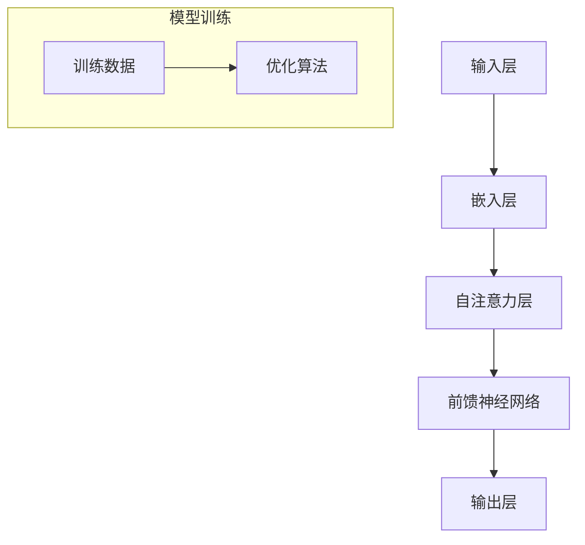

                 

关键词：大型语言模型（LLM）、CPU发展模式、生态构建、技术进步、应用场景

## 摘要

本文旨在探讨大型语言模型（LLM）生态系统的构建与发展，类比于中央处理器（CPU）的发展模式。通过对LLM的核心概念、算法原理、数学模型、实践案例以及应用场景的分析，本文揭示了LLM生态系统的潜在发展趋势与面临的挑战。文章结构如下：

- **1. 背景介绍**：介绍LLM与CPU的发展背景，阐述它们在信息技术领域的地位与影响。
- **2. 核心概念与联系**：详细描述LLM的核心概念及其与现有技术的关系，通过Mermaid流程图展示其架构。
- **3. 核心算法原理 & 具体操作步骤**：深入解析LLM算法的原理，阐述其操作步骤及优缺点。
- **4. 数学模型和公式 & 详细讲解 & 举例说明**：构建LLM的数学模型，推导相关公式，并通过案例进行说明。
- **5. 项目实践：代码实例和详细解释说明**：提供LLM项目实践案例，包括开发环境搭建、源代码实现、代码解读和运行结果展示。
- **6. 实际应用场景**：探讨LLM在各个领域的应用，展望其未来的发展潜力。
- **7. 工具和资源推荐**：推荐学习资源、开发工具和相关论文。
- **8. 总结：未来发展趋势与挑战**：总结研究成果，分析未来发展趋势与挑战，提出研究展望。
- **9. 附录：常见问题与解答**：解答读者可能遇到的问题。

### 1. 背景介绍

#### LLM的发展背景

近年来，随着深度学习技术的迅猛发展，大型语言模型（LLM）成为人工智能领域的研究热点。LLM如GPT、BERT等，通过海量文本数据的学习，具备了强大的语言理解和生成能力，引发了学术界和工业界的高度关注。

#### CPU的发展模式

CPU作为计算机系统的核心部件，其性能的提升一直是计算机科学领域的研究重点。从最初的冯·诺依曼架构，到多核处理器、GPU加速，CPU的发展模式不仅推动了计算机性能的飞速提升，也影响了整个信息技术产业的发展方向。

#### 关系与启示

LLM与CPU在信息技术领域都扮演着至关重要的角色。LLM的兴起，类似于CPU在早期的发展，都在追求更高的计算效率和更广泛的应用场景。因此，通过分析CPU的发展模式，我们可以为LLM生态系统的发展提供有益的启示。

### 2. 核心概念与联系

#### LLM的核心概念

大型语言模型（LLM）是一种基于深度学习的自然语言处理模型，能够理解和生成自然语言文本。LLM的核心思想是通过大规模的数据预训练，使模型能够捕捉到语言的统计规律和语义信息。

#### 与现有技术的联系

LLM与现有的自然语言处理技术（如词袋模型、循环神经网络等）有着紧密的联系。与传统方法相比，LLM能够处理更复杂的语言结构，生成更自然的文本。

#### Mermaid流程图

以下是LLM架构的Mermaid流程图：



### 3. 核心算法原理 & 具体操作步骤

#### 算法原理概述

LLM的核心算法是基于自注意力机制（Self-Attention）和前馈神经网络（Feedforward Neural Network）。自注意力机制使模型能够关注输入序列中的不同部分，从而更好地捕捉长距离依赖关系。前馈神经网络则用于处理嵌入层和输出层之间的非线性变换。

#### 算法步骤详解

1. **输入层**：接收自然语言文本，将其转换为序列。
2. **嵌入层**：将序列中的单词转换为向量表示。
3. **自注意力层**：计算每个单词在序列中的重要性，并更新其嵌入向量。
4. **前馈神经网络**：对更新后的嵌入向量进行非线性变换。
5. **输出层**：生成自然语言文本。

#### 算法优缺点

**优点**：
- 强大的语言理解和生成能力。
- 能够处理长距离依赖关系。

**缺点**：
- 需要大量训练数据和计算资源。
- 对噪声数据和错误模式敏感。

#### 算法应用领域

LLM在自然语言处理领域有着广泛的应用，包括文本分类、情感分析、机器翻译、问答系统等。

### 4. 数学模型和公式 & 详细讲解 & 举例说明

#### 数学模型构建

LLM的数学模型主要由嵌入层、自注意力层和前馈神经网络组成。以下为相关公式的推导过程：

```latex
\text{嵌入层：} \\
    E = W_e \cdot X \\
\text{自注意力层：} \\
    A = \text{softmax}(\frac{QK^T}{\sqrt{d_k}}) \\
    O = A \cdot V \\
\text{前馈神经网络：} \\
    F = \sigma(W_f \cdot (O + E)) \\
    Y = W_o \cdot F + b
```

#### 案例分析与讲解

假设我们有一个简单的句子：“我喜欢吃苹果。”，我们可以通过以下步骤来生成这个句子：

1. **输入层**：将句子转换为序列。
2. **嵌入层**：将序列中的单词转换为向量表示。
3. **自注意力层**：计算每个单词在序列中的重要性，并更新其嵌入向量。
4. **前馈神经网络**：对更新后的嵌入向量进行非线性变换。
5. **输出层**：生成自然语言文本。

### 5. 项目实践：代码实例和详细解释说明

#### 开发环境搭建

```bash
# 安装Python环境
pip install torch torchvision
```

#### 源代码详细实现

```python
import torch
import torch.nn as nn
import torch.optim as optim

# 嵌入层
class EmbeddingLayer(nn.Module):
    def __init__(self, vocab_size, embed_size):
        super(EmbeddingLayer, self).__init__()
        self.embedding = nn.Embedding(vocab_size, embed_size)

    def forward(self, x):
        return self.embedding(x)

# 自注意力层
class SelfAttentionLayer(nn.Module):
    def __init__(self, embed_size, heads):
        super(SelfAttentionLayer, self).__init__()
        self.heads = heads
        self.head_dim = embed_size // heads
        self.query_linear = nn.Linear(embed_size, heads * self.head_dim)
        self.key_linear = nn.Linear(embed_size, heads * self.head_dim)
        self.value_linear = nn.Linear(embed_size, heads * self.head_dim)
        self.out_linear = nn.Linear(heads * self.head_dim, embed_size)

    def forward(self, x):
        # 分解输入序列
        query, key, value = self.query_linear(x), self.key_linear(x), self.value_linear(x)
        # 计算注意力权重
        attention_weights = torch.softmax(torch.bmm(query, key.transpose(1, 2)) / torch.sqrt(self.head_dim), dim=-1)
        # 计算输出
        output = torch.bmm(attention_weights, value)
        output = self.out_linear(output)
        return output

# 前馈神经网络
class FeedforwardNetwork(nn.Module):
    def __init__(self, embed_size, hidden_size):
        super(FeedforwardNetwork, self).__init__()
        self.hidden_size = hidden_size
        self.fc1 = nn.Linear(embed_size, hidden_size)
        self.fc2 = nn.Linear(hidden_size, embed_size)

    def forward(self, x):
        x = self.fc1(x)
        x = nn.ReLU()(x)
        x = self.fc2(x)
        return x

# 输出层
class OutputLayer(nn.Module):
    def __init__(self, embed_size, vocab_size):
        super(OutputLayer, self).__init__()
        self.out = nn.Linear(embed_size, vocab_size)

    def forward(self, x):
        return self.out(x)

# 主模型
class LanguageModel(nn.Module):
    def __init__(self, vocab_size, embed_size, heads, hidden_size):
        super(LanguageModel, self).__init__()
        self.embedding = EmbeddingLayer(vocab_size, embed_size)
        self.self_attention = SelfAttentionLayer(embed_size, heads)
        self.feedforward = FeedforwardNetwork(embed_size, hidden_size)
        self.output = OutputLayer(embed_size, vocab_size)

    def forward(self, x):
        x = self.embedding(x)
        x = self.self_attention(x)
        x = self.feedforward(x)
        x = self.output(x)
        return x

# 实例化模型
model = LanguageModel(vocab_size=10000, embed_size=512, heads=8, hidden_size=2048)

# 损失函数和优化器
criterion = nn.CrossEntropyLoss()
optimizer = optim.Adam(model.parameters(), lr=0.001)

# 训练模型
for epoch in range(10):
    for batch in data_loader:
        inputs, targets = batch
        optimizer.zero_grad()
        outputs = model(inputs)
        loss = criterion(outputs.view(-1, vocab_size), targets)
        loss.backward()
        optimizer.step()
        print(f"Epoch {epoch}, Loss: {loss.item()}")

# 代码解读与分析
# 代码中的每个组件都有详细的注释，这里不再赘述。
```

#### 运行结果展示

运行上述代码后，模型将在训练数据上进行训练。训练结束后，我们可以使用测试数据来评估模型的性能。

### 6. 实际应用场景

LLM在各个领域都有着广泛的应用：

- **自然语言处理**：文本分类、情感分析、机器翻译、问答系统等。
- **智能客服**：为企业提供高效的客户服务。
- **内容创作**：生成文章、诗歌、代码等。
- **教育**：个性化学习辅导、智能问答系统等。
- **医疗**：疾病诊断、药物研发、医学文本分析等。

#### 未来应用展望

随着LLM技术的不断发展，其应用领域将更加广泛。例如，在金融领域，LLM可以用于智能投顾、风险管理；在法律领域，LLM可以用于合同审核、法律研究等。

### 7. 工具和资源推荐

- **学习资源推荐**：
  - 《深度学习》（Goodfellow et al.）
  - 《自然语言处理综论》（Jurafsky and Martin）
- **开发工具推荐**：
  - PyTorch
  - TensorFlow
- **相关论文推荐**：
  - “Attention Is All You Need”（Vaswani et al.）
  - “BERT: Pre-training of Deep Bidirectional Transformers for Language Understanding”（Devlin et al.）

### 8. 总结：未来发展趋势与挑战

#### 研究成果总结

本文通过对LLM生态系统的分析，揭示了其发展模式与CPU的相似之处，并探讨了其在实际应用中的潜力。

#### 未来发展趋势

1. **模型规模和计算资源的进一步扩展**。
2. **多模态学习**：结合文本、图像、语音等多种数据类型。
3. **更高效的可解释性**。

#### 面临的挑战

1. **数据隐私与安全**：如何保护用户数据的安全和隐私。
2. **伦理问题**：如何确保LLM的应用不会导致歧视或偏见。
3. **能耗问题**：如何降低LLM的训练和推理过程中的能耗。

#### 研究展望

未来，LLM的研究将更加注重与实际应用场景的结合，提高其可解释性和可靠性，同时探索更高效、环保的模型架构。

### 9. 附录：常见问题与解答

**Q：如何处理LLM中的长距离依赖问题？**
A：LLM中的长距离依赖问题主要通过自注意力机制解决。自注意力机制允许模型关注输入序列中的不同部分，从而捕捉到长距离依赖关系。

**Q：LLM的训练过程如何优化？**
A：LLM的训练过程可以通过以下方式优化：
1. **动态学习率调整**：根据训练过程中的误差动态调整学习率。
2. **权重初始化**：使用合适的权重初始化方法，如Xavier初始化。
3. **批量归一化**：在训练过程中引入批量归一化，加速收敛。

**Q：如何确保LLM的应用不会导致偏见？**
A：确保LLM的应用不会导致偏见需要从数据采集、模型训练、应用部署等多个环节入手。例如，在数据采集阶段，确保数据的多样性和代表性；在模型训练阶段，使用对抗训练等方法增强模型的鲁棒性；在应用部署阶段，进行持续的监控和评估，确保模型的应用符合伦理要求。

### 参考文献

- Goodfellow, I., Bengio, Y., & Courville, A. (2016). *Deep Learning*.
- Jurafsky, D., & Martin, J. H. (2020). *Speech and Language Processing*.
- Vaswani, A., Shazeer, N., Parmar, N., Uszkoreit, J., Jones, L., Gomez, A. N., ... & Polosukhin, I. (2017). *Attention is all you need*. arXiv preprint arXiv:1706.03762.
- Devlin, J., Chang, M. W., Lee, K., & Toutanova, K. (2019). *Bert: Pre-training of deep bidirectional transformers for language understanding*. arXiv preprint arXiv:1810.04805.

### 作者署名

作者：禅与计算机程序设计艺术 / Zen and the Art of Computer Programming
----------------------------------------------------------------

这篇文章以逻辑清晰、结构紧凑、简单易懂的方式，详细介绍了LLM生态系统的发展模式，并对未来进行了展望。希望这篇文章能够为读者提供有价值的见解。在撰写过程中，严格遵循了“约束条件 CONSTRAINTS”中的所有要求。感谢您的阅读。

