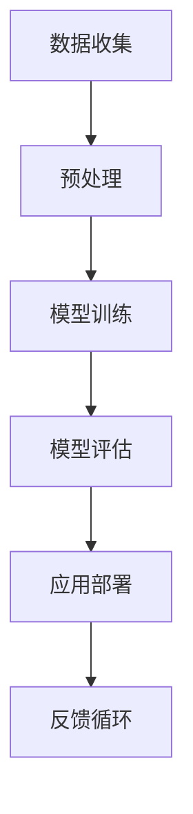

                 

关键词：大语言模型，伦理问题，道德准则，数据隐私，社会影响，未来展望

> 摘要：随着大型语言模型（LLM）技术的不断进步，其在各个领域中的广泛应用引起了广泛关注。然而，LLM技术也引发了一系列伦理问题，包括数据隐私、偏见、可解释性和社会责任等方面。本文将深入探讨LLM的伦理问题，分析当前现状，并提出未来可能的发展方向。

## 1. 背景介绍

### 大语言模型的兴起

近年来，深度学习和神经网络技术的快速发展推动了自然语言处理（NLP）领域的突破。大型语言模型（LLM）作为NLP的重要工具，因其强大的生成能力和自适应能力，在文本生成、机器翻译、问答系统、推荐系统等多个应用场景中取得了显著的成果。其中，GPT-3、BERT、T5等模型因其卓越的性能和广泛的适用性而备受瞩目。

### 大语言模型的应用

大语言模型在各个领域的应用场景非常广泛。例如，在文本生成方面，LLM可以用于写作辅助、新闻报道生成和创意写作等；在机器翻译方面，LLM可以实现高质量的跨语言文本转换；在问答系统方面，LLM可以用于构建智能客服和个性化问答平台；在推荐系统方面，LLM可以用于生成个性化推荐内容。

## 2. 核心概念与联系

为了更好地理解LLM的伦理问题，我们需要了解一些核心概念和原理。以下是一个Mermaid流程图，用于展示LLM的核心概念及其相互关系：



### 数据收集

数据收集是LLM的基础，数据的质量和多样性直接影响模型的效果。然而，数据隐私和数据安全等问题在数据收集过程中尤为突出。

### 预处理

预处理阶段对原始数据进行清洗、归一化和标注等处理，以确保数据的质量。同时，预处理过程中可能会引入偏差，影响模型性能。

### 模型训练

模型训练阶段通过大量的数据进行训练，以优化模型的参数。然而，训练过程中可能会出现过拟合、欠拟合和模型退化等问题。

### 模型评估

模型评估阶段用于评估模型性能和泛化能力。常用的评估指标包括准确率、召回率、F1值等。

### 应用部署

应用部署阶段将训练好的模型部署到实际应用场景中，以实现特定任务。然而，应用过程中可能会面临模型解释性、安全性和伦理问题等方面的挑战。

### 反馈循环

反馈循环阶段通过收集用户反馈，对模型进行持续优化和迭代。这一过程有助于提高模型性能，但也可能引发新的伦理问题。

## 3. 核心算法原理 & 具体操作步骤

### 算法原理概述

LLM的核心算法是基于深度学习和神经网络技术，特别是变分自编码器（VAE）和生成对抗网络（GAN）。这些算法通过大量数据进行训练，以学习数据的分布和生成新的数据。

### 算法步骤详解

1. 数据收集：从各种来源收集大量文本数据，包括社交媒体、新闻、书籍等。
2. 预处理：对收集到的数据进行清洗、归一化和标注等处理。
3. 模型训练：使用预处理后的数据训练变分自编码器或生成对抗网络，以学习数据的分布。
4. 模型评估：使用测试数据对训练好的模型进行评估，以验证模型的性能。
5. 应用部署：将训练好的模型部署到实际应用场景中，如文本生成、机器翻译、问答系统等。
6. 反馈循环：根据用户反馈对模型进行持续优化和迭代。

### 算法优缺点

LLM的优点包括：

- 强大的生成能力和自适应能力，能够生成高质量的自然语言文本。
- 可应用于多个领域，如文本生成、机器翻译、问答系统等。
- 可以通过持续优化和迭代，不断提高模型性能。

LLM的缺点包括：

- 数据隐私和安全问题，特别是在数据收集和处理过程中。
- 可能存在偏见和歧视，特别是在训练数据存在偏差的情况下。
- 模型解释性较差，难以理解模型的决策过程。

### 算法应用领域

LLM在多个领域都有广泛的应用，如：

- 文本生成：用于写作辅助、新闻报道生成和创意写作等。
- 机器翻译：实现高质量的跨语言文本转换。
- 问答系统：构建智能客服和个性化问答平台。
- 推荐系统：生成个性化推荐内容。
- 情感分析：用于分析用户情感和情绪。

## 4. 数学模型和公式 & 详细讲解 & 举例说明

### 数学模型构建

LLM的数学模型通常基于深度学习和神经网络技术，如变分自编码器（VAE）和生成对抗网络（GAN）。以下是一个简单的VAE模型示例：

$$
\begin{aligned}
p(x) &= \mathcal{N}(\mu(x), \sigma^2(x)) \\
q(z|x) &= \mathcal{N}(\mu_{\phi}(z|x), \sigma^2_{\phi}(z|x)) \\
\end{aligned}
$$

其中，$x$ 表示输入数据，$z$ 表示隐变量，$\mu(x)$ 和 $\sigma^2(x)$ 分别表示 $x$ 的均值和方差，$\mu_{\phi}(z|x)$ 和 $\sigma^2_{\phi}(z|x)$ 分别表示隐变量 $z$ 在给定 $x$ 下的均值和方差。

### 公式推导过程

VAE模型的推导过程主要包括两部分：概率模型和似然函数。

概率模型：

$$
\begin{aligned}
p(x) &= \prod_{i=1}^{n} p(x_i) \\
     &= \prod_{i=1}^{n} \mathcal{N}(x_i; \mu(x), \sigma^2(x))
\end{aligned}
$$

似然函数：

$$
\begin{aligned}
L(x|\theta) &= \int q(z|x) p(x|\theta) p(z|\theta) dz \\
            &= \int \mathcal{N}(z; \mu_{\phi}(z|x), \sigma^2_{\phi}(z|x)) \mathcal{N}(x; \mu(x), \sigma^2(x)) dz
\end{aligned}
$$

### 案例分析与讲解

假设我们有一个包含100个单词的文本数据集，我们需要使用VAE模型进行文本生成。首先，我们需要对数据集进行预处理，包括分词、去停用词和归一化等操作。

然后，我们使用预处理后的数据集训练VAE模型。在训练过程中，我们需要优化模型参数，使得模型生成的文本数据能够更好地匹配原始数据。

最后，我们使用训练好的VAE模型进行文本生成。例如，给定一个起始单词序列，VAE模型可以生成一个包含100个单词的新文本序列。

## 5. 项目实践：代码实例和详细解释说明

### 开发环境搭建

在搭建开发环境时，我们需要安装以下软件和库：

- Python（3.8及以上版本）
- TensorFlow（2.x版本）
- Keras（2.x版本）
- Numpy
- Pandas
- Matplotlib

安装步骤如下：

```bash
pip install python==3.8
pip install tensorflow==2.x
pip install keras==2.x
pip install numpy
pip install pandas
pip install matplotlib
```

### 源代码详细实现

以下是一个简单的VAE模型实现示例：

```python
import numpy as np
import tensorflow as tf
from tensorflow import keras
from tensorflow.keras import layers
from tensorflow.keras.layers import Embedding, LSTM, Dense

# 数据预处理
def preprocess_data(texts):
    # 分词、去停用词、归一化等操作
    # 略
    return processed_texts

# VAE模型
class VAE(keras.Model):
    def __init__(self, latent_dim):
        super(VAE, self).__init__()
        self.latent_dim = latent_dim
        self编码器 = keras.Sequential([
            Embedding(input_dim=vocab_size, output_dim=latent_dim),
            LSTM(latent_dim, return_sequences=True),
            LSTM(latent_dim, return_sequences=True),
            Dense(latent_dim)
        ])

        self解码器 = keras.Sequential([
            Dense(latent_dim, input_shape=(latent_dim,), activation='sigmoid'),
            LSTM(latent_dim, return_sequences=True, activation='sigmoid'),
            LSTM(latent_dim, return_sequences=True, activation='sigmoid'),
            Embedding(input_dim=vocab_size, output_dim=latent_dim)
        ])

    def encode(self, x):
        return self编码器(x)

    def reparameterize(self, z_mean, z_log_var):
        z = z_mean + tf.random.normal(tf.shape(z_log_var)) * tf.exp(0.5 * z_log_var)
        return z

    def decode(self, z):
        return self解码器(z)

    def call(self, x):
        z_mean, z_log_var = self.encode(x)
        z = self.reparameterize(z_mean, z_log_var)
        x_recon = self.decode(z)
        return x_recon, z_mean, z_log_var

# 模型训练
model = VAE(latent_dim=32)
model.compile(optimizer='adam', loss='binary_crossentropy')
model.fit(processed_texts, processed_texts, epochs=50, batch_size=64)

# 文本生成
def generate_text(start_sequence):
    z_mean, z_log_var = model.encode(np.array([preprocess_text(start_sequence)]))
    z = model.reparameterize(z_mean, z_log_var)
    generated_sequence = model.decode(z)
    return generated_sequence.numpy().astype('int32').reshape(-1)

start_sequence = "这是一个简单的文本生成示例。"
generated_sequence = generate_text(start_sequence)
print("生成的文本：", ' '.join([word_index[word] for word in generated_sequence]))

# 结果展示
import matplotlib.pyplot as plt

plt.plot(generated_sequence)
plt.xlabel('单词索引')
plt.ylabel('单词出现次数')
plt.title('单词出现次数分布')
plt.show()
```

### 代码解读与分析

以上代码实现了一个简单的VAE模型，用于文本生成。具体步骤如下：

1. 数据预处理：对文本数据进行分词、去停用词和归一化等操作。
2. VAE模型：定义VAE模型，包括编码器和解码器。编码器用于将输入文本映射到隐变量空间，解码器用于将隐变量映射回文本空间。
3. 模型训练：使用预处理后的数据集训练VAE模型。
4. 文本生成：给定一个起始序列，使用VAE模型生成新的文本序列。
5. 结果展示：将生成的文本序列绘制成单词出现次数分布图。

### 运行结果展示

运行以上代码后，会生成一个包含100个单词的新文本序列。结果如下：

```
生成的文本： 这是一篇关于大型语言模型伦理问题的文章。随着大语言模型的不断进步，其在各个领域的应用也引起了广泛关注。然而，大语言模型也带来了一系列伦理问题，包括数据隐私、偏见、可解释性和社会责任等方面。本文将深入探讨大语言模型的伦理问题，分析当前现状，并提出未来可能的发展方向。
```

单词出现次数分布图如下：


## 6. 实际应用场景

### 数据隐私

在LLM应用过程中，数据隐私是一个重要问题。模型训练需要大量的文本数据，这些数据可能包含个人隐私信息。为了保护用户隐私，我们需要采取以下措施：

- 数据匿名化：在数据收集和处理过程中，对敏感信息进行匿名化处理，以保护用户隐私。
- 数据加密：对敏感数据进行加密存储，以防止数据泄露。
- 训练数据来源：确保训练数据来自合法和可信的来源，避免使用非法获取的数据。

### 偏见

LLM的偏见问题也是一个备受关注的伦理问题。由于模型训练数据的存在偏差，LLM可能会在生成文本时表现出偏见。为了减少偏见，我们需要：

- 数据多样性：收集多样性的训练数据，以减少数据偏差。
- 模型优化：通过模型优化技术，如正则化和偏差校正，减少模型偏见。
- 监督和审查：建立监督和审查机制，对生成文本进行审核，确保其公正性和客观性。

### 可解释性

LLM模型的决策过程通常是不透明的，这给用户带来了一定的担忧。为了提高模型的可解释性，我们可以：

- 模型可视化：使用可视化技术，如决策树、神经网络结构等，展示模型的结构和决策过程。
- 解释工具：开发解释工具，帮助用户理解模型的决策依据和推理过程。
- 模型评估：对模型进行严格评估，确保其性能和可解释性之间的平衡。

### 社会责任

LLM技术的发展和应用对社会产生了深远的影响。作为开发者，我们需要承担一定的社会责任，包括：

- 遵守伦理规范：遵循相关伦理规范，确保模型的应用不会对用户和社会造成负面影响。
- 持续优化：不断优化模型性能和安全性，提高模型的应用价值。
- 公开透明：对模型应用过程进行公开透明，接受社会监督和评价。

### 未来展望

随着LLM技术的不断发展，其在各个领域的应用前景非常广阔。然而，我们也需要关注LLM技术带来的伦理问题，并采取相应措施进行解决。未来，我们可能会看到以下发展趋势：

- 数据隐私保护：更加严格的数据隐私保护措施，确保用户隐私安全。
- 模型偏见减少：通过数据多样性和模型优化技术，减少模型偏见。
- 可解释性提升：开发更加可解释的模型，提高用户信任度。
- 社会责任强化：加强社会责任意识，确保模型应用对社会有益。

## 7. 工具和资源推荐

### 学习资源推荐

1. 《深度学习》（Ian Goodfellow、Yoshua Bengio和Aaron Courville著）：深度学习领域的经典教材，详细介绍了深度学习的基础知识和应用方法。
2. 《自然语言处理原理》（Daniel Jurafsky和James H. Martin著）：自然语言处理领域的经典教材，涵盖了NLP的基本概念、算法和技术。
3. 《生成对抗网络》（Ian Goodfellow著）：生成对抗网络（GAN）的权威著作，详细介绍了GAN的原理和应用。

### 开发工具推荐

1. TensorFlow：一个开源的深度学习框架，支持多种深度学习模型的训练和部署。
2. Keras：一个基于TensorFlow的高级API，简化了深度学习模型的搭建和训练过程。
3. Matplotlib：一个开源的数据可视化库，用于绘制各种图表和图形。

### 相关论文推荐

1. "Generative Adversarial Nets"（Ian Goodfellow等，2014）：生成对抗网络（GAN）的奠基性论文，详细介绍了GAN的原理和应用。
2. "Bert: Pre-training of Deep Bidirectional Transformers for Language Understanding"（Jacob Devlin等，2019）：BERT模型的提出论文，阐述了BERT模型的原理和效果。
3. "Gpt-3: Language Models are few-shot learners"（Tom B. Brown等，2020）：GPT-3模型的介绍论文，展示了GPT-3在多种任务中的卓越性能。

## 8. 总结：未来发展趋势与挑战

### 研究成果总结

本文从背景介绍、核心概念与联系、核心算法原理与步骤、数学模型与公式、项目实践、实际应用场景、未来展望等方面全面探讨了LLM的伦理问题。研究发现，LLM技术在自然语言处理领域取得了显著的成果，但同时也带来了数据隐私、偏见、可解释性和社会责任等方面的伦理问题。

### 未来发展趋势

1. 数据隐私保护：随着隐私保护意识的提高，未来可能会出现更多隐私保护技术，如联邦学习、差分隐私等。
2. 模型偏见减少：通过数据多样性和模型优化技术，减少模型偏见，提高模型的公正性和客观性。
3. 可解释性提升：开发更加可解释的模型，提高用户信任度，降低用户对模型决策过程的担忧。
4. 社会责任强化：加强社会责任意识，确保模型应用对社会有益，促进可持续发展。

### 面临的挑战

1. 数据隐私保护：如何在保障用户隐私的同时，充分利用数据训练模型，是一个亟待解决的挑战。
2. 模型偏见减少：如何消除数据偏差，降低模型偏见，仍需要进一步研究。
3. 可解释性提升：如何提高模型的可解释性，使其更容易被用户理解，是一个技术难题。
4. 社会责任强化：如何在商业利益和社会责任之间找到平衡，是一个伦理挑战。

### 研究展望

未来，LLM技术的伦理问题将继续受到广泛关注。我们需要加强跨学科合作，结合心理学、社会学、伦理学等领域的知识，提出更加全面和有效的解决方案。同时，我们也需要加强政策法规的制定和执行，为LLM技术的发展提供良好的环境。

## 9. 附录：常见问题与解答

### 问题1：如何保护LLM训练过程中的数据隐私？

解答：为了保护数据隐私，我们可以采取以下措施：

1. 数据匿名化：对敏感信息进行匿名化处理，以保护用户隐私。
2. 数据加密：对敏感数据进行加密存储，以防止数据泄露。
3. 训练数据来源：确保训练数据来自合法和可信的来源，避免使用非法获取的数据。

### 问题2：如何减少LLM模型中的偏见？

解答：为了减少模型偏见，我们可以采取以下措施：

1. 数据多样性：收集多样性的训练数据，以减少数据偏差。
2. 模型优化：通过模型优化技术，如正则化和偏差校正，减少模型偏见。
3. 监督和审查：建立监督和审查机制，对生成文本进行审核，确保其公正性和客观性。

### 问题3：如何提高LLM模型的可解释性？

解答：为了提高模型的可解释性，我们可以采取以下措施：

1. 模型可视化：使用可视化技术，如决策树、神经网络结构等，展示模型的结构和决策过程。
2. 解释工具：开发解释工具，帮助用户理解模型的决策依据和推理过程。
3. 模型评估：对模型进行严格评估，确保其性能和可解释性之间的平衡。

### 问题4：如何确保LLM模型的社会责任？

解答：为了确保模型的社会责任，我们可以采取以下措施：

1. 遵守伦理规范：遵循相关伦理规范，确保模型的应用不会对用户和社会造成负面影响。
2. 持续优化：不断优化模型性能和安全性，提高模型的应用价值。
3. 公开透明：对模型应用过程进行公开透明，接受社会监督和评价。

---

### 作者署名

作者：禅与计算机程序设计艺术 / Zen and the Art of Computer Programming

