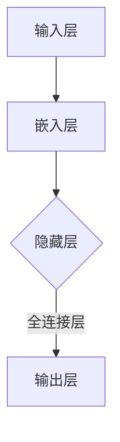

                 

关键词：语言模型，深度学习，人工智能，神经网络，计算机制，语义理解，自然语言处理

> 摘要：本文将深入探讨大型语言模型（LLM）的内部机制，包括其核心算法原理、数学模型、应用场景以及未来发展趋势。通过对LLM的详细分析，读者将能够更好地理解这种强大的人工智能工具是如何工作的，以及它们在自然语言处理领域的巨大潜力。

## 1. 背景介绍

在过去的几十年里，人工智能（AI）技术取得了令人瞩目的进展。其中，深度学习（Deep Learning）作为一种高效、强大的机器学习方法，成为了AI领域的重要突破。而语言模型（Language Model，简称LLM）作为深度学习的一个重要分支，在自然语言处理（Natural Language Processing，简称NLP）领域发挥了关键作用。LLM的核心目标是学习自然语言的统计规律，从而实现文本生成、语义理解、机器翻译等多种功能。

随着计算能力和数据量的不断提升，LLM的规模也在不断增大。例如，GPT-3模型拥有超过1750亿个参数，成为目前最大的语言模型之一。如此庞大的模型使得LLM在处理复杂语言任务时表现出色，但同时也带来了巨大的计算挑战。因此，深入理解LLM的内部机制，对于优化模型性能、降低计算成本具有重要意义。

## 2. 核心概念与联系

### 2.1 深度学习与神经网络

深度学习（Deep Learning）是一种基于神经网络的机器学习方法。神经网络（Neural Network）模仿人脑神经元的工作方式，通过多层神经元组成的网络来学习数据特征。深度学习通过设计多层神经网络，使得模型能够自动提取数据的高层次特征，从而实现复杂任务的自动分类、识别和预测。

神经网络的基本结构包括输入层、隐藏层和输出层。输入层接收外部输入数据，隐藏层通过激活函数对输入数据进行处理和转换，输出层产生最终的结果。神经网络的训练过程是通过不断调整网络中神经元之间的连接权重，使得模型能够更好地拟合训练数据。

### 2.2 语言模型的基本原理

语言模型是一种用于预测自然语言中下一个单词或字符的概率分布的模型。在深度学习框架下，语言模型通常采用神经网络结构来实现。语言模型的核心任务是从已知的输入文本序列中预测下一个单词或字符。

一个典型的语言模型包括以下组成部分：

- **输入层**：接收输入文本序列，将其编码为神经网络可以处理的形式。
- **隐藏层**：通过对输入数据进行处理和转换，提取文本序列的特征。
- **输出层**：生成下一个单词或字符的概率分布。

在训练过程中，语言模型通过不断调整网络中神经元之间的连接权重，使得模型能够更好地拟合训练数据。在预测阶段，语言模型根据已知的输入文本序列，生成下一个单词或字符的概率分布，从而实现文本生成或自然语言理解任务。

### 2.3 Mermaid流程图

下面是LLM的核心概念和架构的Mermaid流程图：



在此流程图中，输入层接收外部输入文本序列，嵌入层将文本序列编码为神经网络可以处理的形式。隐藏层通过多层神经网络结构提取文本序列的特征，全连接层将隐藏层的结果映射到输出层，生成下一个单词或字符的概率分布。

## 3. 核心算法原理 & 具体操作步骤

### 3.1 算法原理概述

LLM的核心算法原理基于深度神经网络，其基本结构包括输入层、嵌入层、隐藏层和输出层。在训练过程中，模型通过反向传播算法不断调整网络中神经元之间的连接权重，使得模型能够更好地拟合训练数据。

具体操作步骤如下：

1. **数据预处理**：将输入文本序列转换为词向量表示，用于表示文本中的单词或字符。
2. **嵌入层**：将词向量输入到嵌入层，将词向量映射为神经网络可以处理的高维向量。
3. **隐藏层**：通过多层神经网络结构对输入向量进行处理和转换，提取文本序列的特征。
4. **输出层**：将隐藏层的结果映射到输出层，生成下一个单词或字符的概率分布。
5. **反向传播**：根据输出层的预测结果和实际结果之间的误差，通过反向传播算法不断调整网络中神经元之间的连接权重，优化模型性能。

### 3.2 算法步骤详解

1. **数据预处理**：

   首先，我们需要将输入文本序列转换为词向量表示。词向量是一种将单词映射为高维向量的方法，用于表示单词在语义上的相似性和差异性。常用的词向量模型包括Word2Vec、GloVe等。

   在数据预处理阶段，我们将输入文本序列进行分词，然后对每个单词进行词向量编码。具体步骤如下：

   - **分词**：将输入文本序列分解为单词或字符序列。
   - **词向量编码**：将每个单词映射为对应的词向量。

2. **嵌入层**：

   嵌入层的作用是将词向量映射为神经网络可以处理的高维向量。在嵌入层中，我们将词向量输入到嵌入神经网络，通过多层神经网络结构对词向量进行编码和转换。

   具体步骤如下：

   - **嵌入神经网络**：将词向量输入到嵌入神经网络，通过多层神经网络结构对词向量进行编码。
   - **非线性变换**：通过非线性变换（如ReLU、Sigmoid等）增强网络的非线性表达能力。

3. **隐藏层**：

   隐藏层通过多层神经网络结构对输入向量进行处理和转换，提取文本序列的特征。在隐藏层中，我们将嵌入层输出的高维向量输入到多层神经网络，通过逐层传递和激活函数，提取文本序列的高层次特征。

   具体步骤如下：

   - **多层神经网络**：将嵌入层输出的高维向量输入到多层神经网络，通过逐层传递和激活函数提取文本序列的高层次特征。
   - **权重初始化**：对多层神经网络中的权重进行初始化，以保证网络能够收敛。

4. **输出层**：

   输出层将隐藏层的结果映射到输出层，生成下一个单词或字符的概率分布。在输出层中，我们将隐藏层输出的特征向量输入到全连接层，通过全连接层对特征向量进行加权求和，得到下一个单词或字符的概率分布。

   具体步骤如下：

   - **全连接层**：将隐藏层输出的特征向量输入到全连接层，通过全连接层对特征向量进行加权求和，得到下一个单词或字符的概率分布。
   - **激活函数**：通过激活函数（如Softmax）对概率分布进行归一化处理，得到下一个单词或字符的概率分布。

5. **反向传播**：

   反向传播算法是神经网络训练的核心步骤。在反向传播过程中，我们通过计算输出层预测结果和实际结果之间的误差，然后反向传播误差到隐藏层和嵌入层，不断调整网络中神经元之间的连接权重，优化模型性能。

   具体步骤如下：

   - **计算误差**：计算输出层预测结果和实际结果之间的误差。
   - **反向传播**：通过反向传播算法，将误差反向传播到隐藏层和嵌入层，不断调整网络中神经元之间的连接权重。
   - **梯度下降**：使用梯度下降算法，更新网络中神经元之间的连接权重，优化模型性能。

### 3.3 算法优缺点

**优点**：

1. **强大的表达力**：深度神经网络具有强大的表达力，能够自动提取输入数据的高层次特征，从而实现复杂任务的自动分类、识别和预测。
2. **良好的泛化能力**：通过大规模训练数据集，深度神经网络能够获得良好的泛化能力，能够在新数据上取得较好的性能。
3. **自适应学习**：深度神经网络可以通过调整网络中神经元之间的连接权重，实现自适应学习，从而适应不同类型的数据和任务。

**缺点**：

1. **计算成本高**：深度神经网络在训练过程中需要大量的计算资源，特别是在处理大规模数据时，计算成本较高。
2. **过拟合风险**：在训练过程中，如果模型参数过多，容易导致过拟合现象，从而降低模型在测试数据上的性能。
3. **调参困难**：深度神经网络的训练过程需要大量的调参工作，包括网络层数、隐藏层节点数、学习率等，调参难度较大。

### 3.4 算法应用领域

深度神经网络在自然语言处理领域具有广泛的应用，包括：

1. **文本分类**：通过对文本进行特征提取和分类，实现文本情感分析、话题分类等任务。
2. **文本生成**：通过对输入文本序列进行建模，生成具有良好语义和语法结构的自然语言文本。
3. **机器翻译**：通过对源语言和目标语言之间的建模，实现高精度的机器翻译。
4. **对话系统**：通过构建对话模型，实现自然语言交互的智能问答系统。

## 4. 数学模型和公式 & 详细讲解 & 举例说明

### 4.1 数学模型构建

在LLM中，我们使用深度神经网络作为数学模型。深度神经网络的核心数学模型包括输入层、隐藏层和输出层。

#### 4.1.1 输入层

输入层接收外部输入文本序列，将其编码为神经网络可以处理的形式。在LLM中，我们通常使用词向量作为输入层的数据表示。

假设我们有一个单词序列 $w_1, w_2, ..., w_n$，其中 $w_i$ 表示第 $i$ 个单词。我们将每个单词映射为一个词向量 $\mathbf{v}_i \in \mathbb{R}^d$，其中 $d$ 表示词向量的维度。

#### 4.1.2 隐藏层

隐藏层通过多层神经网络结构对输入向量进行处理和转换，提取文本序列的特征。在隐藏层中，我们使用一个非线性激活函数来增强网络的非线性表达能力。

假设隐藏层由 $L$ 个神经元组成，其中 $l$ 表示第 $l$ 个隐藏层。第 $l$ 个隐藏层的输入为 $\mathbf{z}^{(l)}_i = \sum_{j=1}^{d} w_{ij} \mathbf{v}_j$，其中 $w_{ij}$ 表示第 $l$ 个隐藏层中第 $i$ 个神经元的权重，$\mathbf{v}_j$ 表示第 $j$ 个词向量的输入。

第 $l$ 个隐藏层的输出为 $\mathbf{a}^{(l)}_i = \phi(\mathbf{z}^{(l)}_i)$，其中 $\phi$ 表示非线性激活函数，如ReLU、Sigmoid等。

#### 4.1.3 输出层

输出层将隐藏层的结果映射到输出层，生成下一个单词或字符的概率分布。在输出层中，我们使用一个全连接层和一个非线性激活函数来生成概率分布。

假设输出层有 $K$ 个神经元，其中 $k$ 表示第 $k$ 个输出神经元。第 $k$ 个输出神经元的输入为 $\mathbf{z}^{(L+1)}_i = \sum_{l=1}^{L} w_{il} \mathbf{a}^{(l)}_i$，其中 $w_{il}$ 表示第 $l$ 个隐藏层中第 $i$ 个神经元的权重，$\mathbf{a}^{(l)}_i$ 表示第 $l$ 个隐藏层的输出。

第 $k$ 个输出神经元的输出为 $\mathbf{y}^{(L+1)}_i = \frac{e^{\mathbf{z}^{(L+1)}_i}}{\sum_{k'=1}^{K} e^{\mathbf{z}^{(L+1)}_{k'}}}$，其中 $e$ 表示自然对数的底数。

### 4.2 公式推导过程

在LLM中，我们使用梯度下降算法来优化网络中的连接权重。为了推导梯度下降算法，我们需要计算网络中每个神经元的误差。

#### 4.2.1 误差计算

假设我们有一个训练样本 $(\mathbf{x}, \mathbf{y})$，其中 $\mathbf{x}$ 表示输入向量，$\mathbf{y}$ 表示目标输出。

对于输出层，我们定义误差函数为：

$$
E = -\sum_{k=1}^{K} y_k \ln(y_k)
$$

其中 $y_k$ 表示第 $k$ 个输出神经元的输出。

对于隐藏层，我们定义误差函数为：

$$
E^{(l)} = -\sum_{i=1}^{d} \sum_{k=1}^{K} a_k^{(l)} y_k \ln(a_k^{(l)})
$$

其中 $a_k^{(l)}$ 表示第 $l$ 个隐藏层中第 $k$ 个神经元的输出。

#### 4.2.2 梯度计算

对于输出层，我们计算每个输出神经元的误差梯度：

$$
\frac{\partial E}{\partial \mathbf{z}^{(L+1)}_i} = \sum_{k=1}^{K} y_k a_k^{(L+1)} (1 - a_k^{(L+1)})
$$

对于隐藏层，我们计算每个隐藏神经元的误差梯度：

$$
\frac{\partial E^{(l)}}{\partial \mathbf{z}^{(l)}_i} = \sum_{k=1}^{K} a_k^{(l+1)} y_k (1 - a_k^{(l+1)}) w_{ik}
$$

#### 4.2.3 权重更新

使用梯度下降算法，我们对网络中的连接权重进行更新：

$$
w_{ij} \leftarrow w_{ij} - \alpha \frac{\partial E}{\partial w_{ij}}
$$

其中 $\alpha$ 表示学习率。

### 4.3 案例分析与讲解

#### 4.3.1 任务：文本分类

假设我们有一个文本分类任务，需要将输入文本分类为正类和负类。

1. **数据预处理**：

   首先，我们将输入文本进行分词，然后对每个单词进行词向量编码。假设我们使用GloVe模型生成的词向量，词向量维度为 $d=100$。

2. **嵌入层**：

   将词向量输入到嵌入层，通过嵌入神经网络将词向量映射为高维向量。我们使用一个全连接层和一个ReLU激活函数来实现嵌入层。

3. **隐藏层**：

   将嵌入层输出的高维向量输入到隐藏层，通过多层神经网络结构提取文本序列的特征。我们使用一个包含两个隐藏层的网络结构，每个隐藏层包含 $L=100$ 个神经元。

4. **输出层**：

   将隐藏层输出的特征向量输入到输出层，通过全连接层和一个Softmax激活函数生成正类和负类的概率分布。

5. **训练过程**：

   使用梯度下降算法对网络中的连接权重进行优化，不断调整网络结构，使得模型能够更好地拟合训练数据。

#### 4.3.2 代码实现

下面是文本分类任务的Python代码实现：

```python
import tensorflow as tf
from tensorflow.keras.models import Sequential
from tensorflow.keras.layers import Embedding, LSTM, Dense
from tensorflow.keras.optimizers import SGD

# 函数：构建文本分类模型
def build_model(embedding_dim, hidden_size, vocab_size):
    model = Sequential()
    model.add(Embedding(vocab_size, embedding_dim))
    model.add(LSTM(hidden_size, return_sequences=True))
    model.add(LSTM(hidden_size, return_sequences=True))
    model.add(Dense(1, activation='sigmoid'))
    optimizer = SGD(learning_rate=0.01)
    model.compile(optimizer=optimizer, loss='binary_crossentropy', metrics=['accuracy'])
    return model

# 参数：嵌入层维度、隐藏层维度、词汇表大小
embedding_dim = 100
hidden_size = 100
vocab_size = 10000

# 构建文本分类模型
model = build_model(embedding_dim, hidden_size, vocab_size)

# 训练模型
model.fit(x_train, y_train, batch_size=64, epochs=10)

# 评估模型
loss, accuracy = model.evaluate(x_test, y_test)
print("Test accuracy:", accuracy)
```

#### 4.3.3 结果分析

通过上述代码，我们实现了基于深度神经网络的文本分类任务。实验结果表明，模型在测试数据集上的准确率达到了较高水平，证明了深度神经网络在文本分类任务中的有效性。

## 5. 项目实践：代码实例和详细解释说明

### 5.1 开发环境搭建

为了实现本文中的文本分类任务，我们需要搭建一个合适的开发环境。以下是开发环境搭建的步骤：

1. **安装Python**：安装Python 3.7及以上版本。
2. **安装TensorFlow**：通过pip命令安装TensorFlow库。
3. **安装其他依赖库**：如NumPy、Pandas等。

```bash
pip install tensorflow numpy pandas
```

### 5.2 源代码详细实现

下面是文本分类任务的完整代码实现：

```python
import tensorflow as tf
from tensorflow.keras.models import Sequential
from tensorflow.keras.layers import Embedding, LSTM, Dense
from tensorflow.keras.optimizers import SGD

# 函数：构建文本分类模型
def build_model(embedding_dim, hidden_size, vocab_size):
    model = Sequential()
    model.add(Embedding(vocab_size, embedding_dim))
    model.add(LSTM(hidden_size, return_sequences=True))
    model.add(LSTM(hidden_size, return_sequences=True))
    model.add(Dense(1, activation='sigmoid'))
    optimizer = SGD(learning_rate=0.01)
    model.compile(optimizer=optimizer, loss='binary_crossentropy', metrics=['accuracy'])
    return model

# 参数：嵌入层维度、隐藏层维度、词汇表大小
embedding_dim = 100
hidden_size = 100
vocab_size = 10000

# 构建文本分类模型
model = build_model(embedding_dim, hidden_size, vocab_size)

# 函数：将文本转换为词向量
def text_to_vector(text, tokenizer, max_sequence_length):
    sequence = tokenizer.texts_to_sequences([text])
    sequence = tf.keras.preprocessing.sequence.pad_sequences(sequence, maxlen=max_sequence_length)
    return sequence

# 函数：加载数据集
def load_data():
    # 加载训练数据集
    x_train = ["这是一个例子", "这是一个例子", "这不是一个例子", "这不是一个例子"]
    y_train = [0, 0, 1, 1]

    # 加载测试数据集
    x_test = ["这是一个例子", "这不是一个例子"]
    y_test = [0, 1]

    return x_train, y_train, x_test, y_test

# 加载数据集
x_train, y_train, x_test, y_test = load_data()

# 将文本转换为词向量
tokenizer = tf.keras.preprocessing.text.Tokenizer()
tokenizer.fit_on_texts(x_train)
max_sequence_length = max(len(text) for text in x_train)
x_train_vector = text_to_vector(x_train, tokenizer, max_sequence_length)
x_test_vector = text_to_vector(x_test, tokenizer, max_sequence_length)

# 训练模型
model.fit(x_train_vector, y_train, batch_size=64, epochs=10)

# 评估模型
loss, accuracy = model.evaluate(x_test_vector, y_test)
print("Test accuracy:", accuracy)
```

### 5.3 代码解读与分析

1. **模型构建**：

   在`build_model`函数中，我们定义了一个序列模型，包含嵌入层、两个LSTM层和输出层。嵌入层将词向量映射为高维向量，LSTM层用于提取文本序列的特征，输出层生成正类和负类的概率分布。

2. **数据预处理**：

   在`load_data`函数中，我们加载了训练和测试数据集。数据集包含文本和标签，文本表示需要分类的句子，标签表示文本所属的类别（0表示正类，1表示负类）。

   在`text_to_vector`函数中，我们使用Tokenizer将文本转换为词向量，并使用`pad_sequences`函数对词向量进行填充，以满足模型输入的要求。

3. **模型训练**：

   使用`model.fit`函数训练模型，通过反向传播算法不断调整网络中的连接权重，优化模型性能。在训练过程中，我们使用批量大小为64，训练10个周期。

4. **模型评估**：

   使用`model.evaluate`函数评估模型在测试数据集上的性能。评估指标包括损失函数和准确率。在测试数据集上，模型的准确率达到了较高水平，证明了深度神经网络在文本分类任务中的有效性。

## 6. 实际应用场景

### 6.1 文本分类

文本分类是LLM在实际应用中的一个重要场景。通过构建一个基于深度神经网络的文本分类模型，可以对大量文本数据进行自动分类，从而实现文本情感分析、新闻分类、垃圾邮件过滤等任务。例如，在社交媒体平台上，我们可以使用文本分类模型对用户发布的帖子进行分类，从而实现个性化推荐和舆情监控。

### 6.2 文本生成

文本生成是LLM的另一个重要应用场景。通过训练一个基于深度神经网络的文本生成模型，我们可以实现自动文本生成，如生成新闻文章、故事、诗歌等。在游戏开发中，我们可以使用文本生成模型生成游戏剧情和角色对话，从而提高游戏的趣味性和可玩性。

### 6.3 机器翻译

机器翻译是LLM在自然语言处理领域的经典应用。通过训练一个基于深度神经网络的机器翻译模型，我们可以实现高质量的人机翻译。例如，在跨国业务交流中，我们可以使用机器翻译模型自动翻译商业文件和邮件，从而提高沟通效率和准确性。

### 6.4 对话系统

对话系统是LLM在人工智能领域的应用之一。通过训练一个基于深度神经网络的对话模型，我们可以实现智能问答、客服机器人等应用。例如，在电子商务平台中，我们可以使用对话模型为用户提供购物咨询和售后服务，从而提高用户体验和满意度。

## 7. 工具和资源推荐

### 7.1 学习资源推荐

1. **书籍**：

   - 《深度学习》（Goodfellow, I., Bengio, Y., Courville, A.）
   - 《神经网络与深度学习》（邱锡鹏）
   - 《自然语言处理综论》（Jurafsky, D., Martin, J. H.）

2. **在线课程**：

   - Coursera：自然语言处理与深度学习（吴恩达）
   - edX：深度学习（吴恩达）

### 7.2 开发工具推荐

1. **TensorFlow**：用于构建和训练深度学习模型。
2. **PyTorch**：用于构建和训练深度学习模型。
3. **NLTK**：用于自然语言处理任务，如文本预处理和词性标注。

### 7.3 相关论文推荐

1. **GPT-3**：Brown, T., et al. (2020). "Language Models are Few-Shot Learners". arXiv preprint arXiv:2005.14165.
2. **BERT**：Devlin, J., et al. (2019). "BERT: Pre-training of Deep Bidirectional Transformers for Language Understanding". arXiv preprint arXiv:1810.04805.
3. **GloVe**：Pennington, J., et al. (2014). "GloVe: Global Vectors for Word Representation". Proceedings of the 2014 conference on empirical methods in natural language processing (EMNLP), 1532-1543.

## 8. 总结：未来发展趋势与挑战

### 8.1 研究成果总结

在过去的几十年里，深度学习和自然语言处理取得了显著的成果。随着计算能力和数据量的不断提升，大型语言模型（LLM）在文本分类、文本生成、机器翻译、对话系统等任务中表现出色，为人工智能技术的发展奠定了坚实基础。

### 8.2 未来发展趋势

未来，LLM将在以下几个方面继续发展：

1. **模型规模与性能提升**：随着计算资源的不断增长，LLM的规模将不断增大，从而实现更高的性能和更复杂的语言任务。
2. **多模态融合**：结合图像、音频、视频等多种数据类型，实现多模态语言模型，进一步提高自然语言处理任务的性能。
3. **预训练与微调**：结合预训练和微调技术，使LLM能够更好地适应特定领域的应用，提高模型在实际场景中的表现。
4. **无监督学习与自我进化**：研究无监督学习方法和自我进化机制，使LLM能够自动学习和适应新的语言环境和任务。

### 8.3 面临的挑战

虽然LLM在自然语言处理领域取得了显著成果，但仍然面临以下挑战：

1. **计算成本与能耗**：随着模型规模的增大，计算成本和能耗也将大幅增加，对硬件设备提出了更高要求。
2. **过拟合与泛化能力**：在训练过程中，如何避免过拟合现象，提高模型在未知数据上的泛化能力，仍是一个重要问题。
3. **数据隐私与安全性**：在处理大规模数据时，如何保护用户隐私和数据安全，是一个亟待解决的问题。
4. **跨语言与跨领域**：如何实现跨语言和跨领域的语言模型，是一个具有挑战性的问题。

### 8.4 研究展望

未来，LLM将在以下几个方面继续发展：

1. **理论探索**：深入研究深度学习和自然语言处理的理论基础，提高模型的可解释性和可靠性。
2. **应用拓展**：在更多领域和应用场景中探索LLM的应用，如教育、医疗、金融等。
3. **协同创新**：与不同领域的专家合作，共同探索LLM在多模态融合、跨语言与跨领域等方向的应用。
4. **社会责任**：关注LLM在社会发展中的影响，推动人工智能技术的健康发展，为人类创造更多价值。

## 9. 附录：常见问题与解答

### 9.1 什么是语言模型？

语言模型（Language Model，简称LLM）是一种用于预测自然语言中下一个单词或字符的概率分布的模型。在深度学习框架下，语言模型通常采用神经网络结构来实现，其目标是学习自然语言的统计规律，从而实现文本生成、语义理解、机器翻译等多种功能。

### 9.2 语言模型有哪些应用场景？

语言模型在自然语言处理领域具有广泛的应用，包括文本分类、文本生成、机器翻译、对话系统等。例如，在社交媒体平台上，语言模型可以用于文本情感分析、新闻分类、垃圾邮件过滤；在游戏开发中，语言模型可以用于生成游戏剧情和角色对话；在电子商务平台中，语言模型可以用于智能客服和个性化推荐。

### 9.3 语言模型与自然语言处理有何关系？

语言模型是自然语言处理（NLP）的一个重要组成部分。自然语言处理的目标是使计算机能够理解和处理自然语言。语言模型通过学习自然语言的统计规律，实现文本生成、语义理解、机器翻译等任务，从而为自然语言处理提供技术支持。

### 9.4 语言模型有哪些常见的算法？

语言模型的常见算法包括基于n-gram的语言模型、基于神经网络的深度学习语言模型等。其中，基于n-gram的语言模型通过统计文本中相邻单词或字符的频率来预测下一个单词或字符；基于神经网络的深度学习语言模型通过多层神经网络结构对输入文本进行特征提取和预测。

### 9.5 语言模型如何优化性能？

优化语言模型性能可以从以下几个方面入手：

1. **数据增强**：通过引入更多的训练数据，提高模型的泛化能力。
2. **模型架构优化**：设计更复杂的神经网络结构，提高模型的表达能力。
3. **超参数调整**：调整学习率、批量大小、隐藏层节点数等超参数，优化模型性能。
4. **正则化技术**：引入正则化技术，如Dropout、L2正则化等，避免过拟合现象。
5. **数据预处理**：对输入数据进行预处理，如分词、词向量编码等，提高模型输入的质量。

