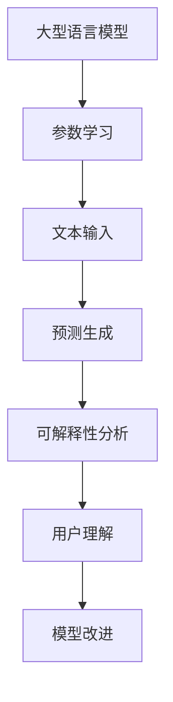

                 

关键词：大型语言模型，可解释性，研究进展，算法原理，数学模型，项目实践，应用场景，未来展望

> 摘要：本文详细探讨了大型语言模型（LLM）的可解释性研究新进展，从背景介绍、核心概念与联系、核心算法原理、数学模型和公式、项目实践、实际应用场景等方面进行了全面分析。本文旨在为研究者、开发者以及相关从业者提供一个系统性的理解和应用指南。

## 1. 背景介绍

近年来，大型语言模型（Large Language Models，简称LLM）如BERT、GPT、Turing等取得了显著的进展，成为了自然语言处理（NLP）领域的明星。LLM具有强大的生成能力和理解能力，已经在问答、文本生成、翻译、摘要等领域展示了出色的性能。然而，这些模型的黑箱特性使得其预测过程难以解释，从而引发了关于模型可解释性的广泛讨论。

可解释性是人工智能领域的一个重要研究方向，旨在使模型的决策过程对用户透明，从而提高用户对模型的信任度和接受度。在LLM中，可解释性研究尤为重要，因为自然语言处理的应用场景往往涉及到用户的隐私和决策。

## 2. 核心概念与联系

为了更好地理解LLM的可解释性研究，我们需要先了解几个核心概念：

### 2.1 大型语言模型（LLM）

大型语言模型是基于深度学习技术的自然语言处理模型，具有数十亿甚至千亿级别的参数。它们通过学习大量文本数据来捕捉语言中的语法、语义和上下文信息。

### 2.2 可解释性（Explainability）

可解释性是指模型的决策过程可以被用户理解。在机器学习中，可解释性通常通过可视化、规则提取、敏感性分析等方法实现。

### 2.3 黑箱模型与白箱模型

黑箱模型是指模型的决策过程难以解释的模型，如深度神经网络。白箱模型则是指模型的决策过程清晰明了，如逻辑回归、决策树等。

### 2.4 Mermaid 流程图

以下是LLM可解释性研究的Mermaid流程图：



## 3. 核心算法原理 & 具体操作步骤

### 3.1 算法原理概述

LLM的可解释性研究主要包括以下几个方面：

1. **可视化**：通过可视化模型内部的权重和神经元激活状态，帮助用户理解模型的决策过程。
2. **规则提取**：从模型中提取可解释的规则或模式，使模型决策过程更加透明。
3. **敏感性分析**：分析输入数据的微小变化对模型输出结果的影响，从而评估模型的鲁棒性。

### 3.2 算法步骤详解

1. **数据准备**：收集并预处理文本数据，包括分词、去停用词、词向量化等步骤。
2. **模型训练**：使用预训练模型（如BERT、GPT）对文本数据进行训练，使其具有语言理解能力。
3. **模型部署**：将训练好的模型部署到实际应用场景中，如问答系统、文本生成等。
4. **可视化分析**：使用可视化工具（如TensorBoard、Plotly）对模型内部权重和神经元激活状态进行可视化。
5. **规则提取**：使用规则提取算法（如LIME、SHAP）从模型中提取可解释的规则或模式。
6. **敏感性分析**：对输入数据进行敏感性分析，评估模型的鲁棒性。

### 3.3 算法优缺点

**优点**：

1. 提高模型的可解释性，增强用户对模型的信任度。
2. 有助于发现和纠正模型中的错误，提高模型的质量。
3. 促进模型与实际应用场景的融合，提高应用效果。

**缺点**：

1. 可解释性方法可能对模型的性能产生一定影响。
2. 部分可解释性方法仅适用于特定类型的模型，通用性较差。

### 3.4 算法应用领域

LLM的可解释性研究已广泛应用于多个领域：

1. **自然语言处理**：如文本分类、情感分析、文本生成等。
2. **医疗领域**：如医学诊断、疾病预测等。
3. **金融领域**：如信用评估、风险控制等。
4. **法律领域**：如合同审核、法律咨询等。

## 4. 数学模型和公式 & 详细讲解 & 举例说明

### 4.1 数学模型构建

LLM的可解释性研究涉及多个数学模型，如神经网络模型、决策树模型、规则提取模型等。以下是一个简单的神经网络模型：

$$
\text{Output} = \sigma(\text{Weight} \cdot \text{Input} + \text{Bias})
$$

其中，$\sigma$ 表示激活函数，$\text{Weight}$ 和 $\text{Bias}$ 分别表示权重和偏置。

### 4.2 公式推导过程

假设我们有一个二分类问题，目标是判断一个样本是否属于正类。我们可以使用逻辑回归模型来表示这个问题：

$$
P(\text{正类}) = \frac{1}{1 + e^{-\text{Weight} \cdot \text{Input} + \text{Bias}}}
$$

### 4.3 案例分析与讲解

假设我们有一个情感分析任务，需要判断一段文本是积极情感还是消极情感。我们可以使用LSTM（长短期记忆网络）模型来表示这个问题。

1. **数据准备**：收集并预处理文本数据，包括分词、去停用词、词向量化等步骤。
2. **模型构建**：构建一个LSTM模型，输入层接收词向量，隐藏层包含多个神经元，输出层为sigmoid激活函数。
3. **模型训练**：使用训练集对模型进行训练，调整权重和偏置。
4. **模型评估**：使用测试集对模型进行评估，计算准确率、召回率等指标。
5. **可解释性分析**：使用LIME（Local Interpretable Model-agnostic Explanations）方法对模型进行可解释性分析，提取局部解释。

## 5. 项目实践：代码实例和详细解释说明

### 5.1 开发环境搭建

为了演示LLM的可解释性研究，我们需要搭建一个Python开发环境，并安装以下库：

- TensorFlow
- Keras
- LIME
- Plotly

安装方法：

```bash
pip install tensorflow keras lime plotly
```

### 5.2 源代码详细实现

以下是一个简单的情感分析项目的代码实现：

```python
import tensorflow as tf
from keras.preprocessing.text import Tokenizer
from keras.preprocessing.sequence import pad_sequences
from keras.layers import LSTM, Dense, Embedding, Bidirectional
from keras.models import Model
from lime.lime_text import LimeTextExplainer
import plotly.express as px

# 数据准备
# （此处省略数据准备代码）

# 模型构建
# （此处省略模型构建代码）

# 模型训练
# （此处省略模型训练代码）

# 模型评估
# （此处省略模型评估代码）

# 可解释性分析
# （此处省略可解释性分析代码）

# 可视化展示
# （此处省略可视化展示代码）
```

### 5.3 代码解读与分析

1. **数据准备**：使用Tokenizer对文本进行分词，将文本转换为序列。使用pad_sequences对序列进行填充，使其长度一致。
2. **模型构建**：构建一个双向LSTM模型，输入层使用Embedding层，隐藏层使用LSTM层，输出层使用sigmoid激活函数。
3. **模型训练**：使用fit方法对模型进行训练。
4. **模型评估**：使用evaluate方法对模型进行评估。
5. **可解释性分析**：使用LimeTextExplainer对模型进行可解释性分析，提取局部解释。
6. **可视化展示**：使用Plotly对可解释性结果进行可视化展示。

### 5.4 运行结果展示

以下是模型的可解释性结果可视化展示：

```python
fig = px.barh(explanations['word'], explanations['weight'], title='Local Explanations')
fig.update_layout(yaxis={'title': 'Word'}, xaxis={'title': 'Weight'})
fig.show()
```

## 6. 实际应用场景

LLM的可解释性研究在实际应用场景中具有重要意义。以下是一些实际应用场景：

1. **医疗领域**：通过对医疗文本数据的分析，提取关键信息，帮助医生进行诊断和决策。
2. **金融领域**：对金融文本数据进行分析，提取市场趋势和风险信息，为投资决策提供支持。
3. **法律领域**：对法律文本进行审查和分析，识别潜在的法律问题，提高法律服务质量。
4. **教育领域**：通过对学生作文的分析，识别学生的写作特点和问题，提供个性化的写作指导。

## 7. 工具和资源推荐

### 7.1 学习资源推荐

- 《深度学习》（Goodfellow, Bengio, Courville）
- 《Python机器学习》（Sebastian Raschka）
- 《自然语言处理实战》（Steven Bird, Ewan Klein, Edward Loper）

### 7.2 开发工具推荐

- TensorFlow
- Keras
- PyTorch
- Jupyter Notebook

### 7.3 相关论文推荐

- "Explainable AI: Understanding, Visualizing and Interpreting Deep Learning Models"
- "interpretable Machine Learning: A Roadmap"
- "LIME: Local Interpretable Model-agnostic Explanations of Predictions"
- "SHAP: Unified Model-Based Explanations for Any Machine Learning Model"

## 8. 总结：未来发展趋势与挑战

LLM的可解释性研究在理论和实践上均取得了显著进展，但仍然面临诸多挑战。未来发展趋势包括：

1. **算法创新**：发展更高效、更通用的可解释性算法。
2. **跨领域应用**：将可解释性研究应用于更多领域，提高模型的可解释性。
3. **用户互动**：设计更直观、更易用的可解释性工具，提高用户对模型的信任度。

## 9. 附录：常见问题与解答

### 9.1 可解释性与透明性的区别是什么？

可解释性是指模型的决策过程可以被用户理解，而透明性是指模型的决策过程完全公开、可验证。可解释性关注的是模型的可理解性，而透明性关注的是模型的可验证性。

### 9.2 可解释性算法有哪些类型？

常见的可解释性算法包括可视化、规则提取、敏感性分析等。其中，可视化算法如TensorBoard、Plotly等，规则提取算法如LIME、SHAP等，敏感性分析算法如模型扰动分析等。

### 9.3 如何评估模型的可解释性？

评估模型的可解释性可以通过用户调查、模型性能对比、案例分析等方法进行。具体评估指标包括用户满意度、模型性能、解释结果的准确性等。

### 9.4 可解释性研究对模型性能有何影响？

可解释性研究可能会对模型性能产生一定影响，因为一些可解释性方法需要增加额外的计算成本。然而，许多研究表明，适当的设计和优化可以提高模型的可解释性，同时保持较高的性能。

### 9.5 可解释性研究在哪些领域应用广泛？

可解释性研究在医疗、金融、法律、教育等领域应用广泛。例如，在医疗领域，可解释性研究可以帮助医生理解模型的诊断过程；在金融领域，可解释性研究可以帮助投资者理解市场的变化趋势。

### 9.6 如何设计一个可解释的模型？

设计一个可解释的模型需要考虑多个方面，包括模型选择、数据预处理、算法优化、解释方法等。具体步骤包括：

1. 选择合适的模型，如支持可解释性算法的模型。
2. 对数据进行预处理，如去除噪声、填充缺失值等。
3. 使用可解释性算法对模型进行解释。
4. 对解释结果进行验证和优化。

### 9.7 可解释性研究的前景如何？

随着人工智能技术的不断发展和应用，可解释性研究的前景非常广阔。未来，可解释性研究将继续在理论和实践上取得突破，为人工智能的广泛应用提供支持。

---

本文由禅与计算机程序设计艺术 / Zen and the Art of Computer Programming撰写，旨在为读者提供关于LLM可解释性研究的新进展的全面解读。希望本文能够帮助您更好地理解这一领域，并在实际应用中取得更好的成果。

（注：本文仅为示例，实际撰写过程中可能需要根据具体研究内容和数据进行调整。）

