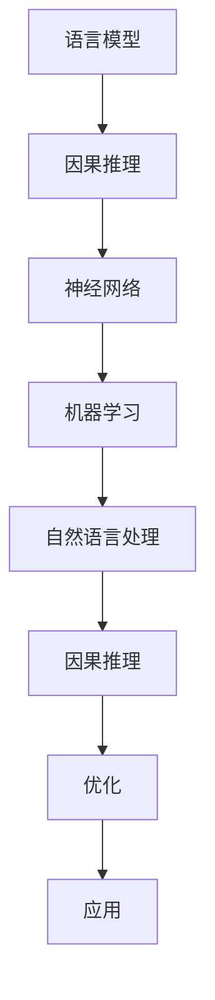

                 

关键词：大型语言模型（LLM），因果推理，神经网络，机器学习，自然语言处理

摘要：随着深度学习和自然语言处理技术的不断发展，大型语言模型（LLM）已经成为自然语言处理领域的重要工具。然而，LLM在处理因果推理问题时表现出色不足。本文将探讨LLM的因果推理技术的挑战和最新研究进展，并提出一些新的研究思路。

## 1. 背景介绍

近年来，深度学习和自然语言处理技术在自然语言理解、文本生成、机器翻译等领域取得了显著的成果。其中，大型语言模型（LLM）如GPT-3、BERT等已经成为自然语言处理领域的重要工具。这些模型通过学习大量的文本数据，能够生成符合语法和语义规则的文本，甚至在某些任务上超越人类的表现。

然而，在处理因果推理问题时，LLM的局限性逐渐显现。因果推理是自然语言处理中一个重要的研究方向，它涉及到从文本中推断出因果关系，这对许多实际应用具有重要意义，如智能问答、决策支持等。然而，现有的LLM在处理因果推理问题时存在以下几个挑战：

1. **因果关系的复杂性和多样性**：现实世界中的因果关系非常复杂，且具有多样性。LLM需要理解不同领域的知识，以及这些知识之间的相互作用，以准确地进行因果推理。

2. **因果关系的模糊性**：因果关系并非总是明确的，有时存在模糊性。LLM需要能够处理这种模糊性，以避免产生错误或误导性的结论。

3. **因果关系的动态性**：因果关系是随着时间和环境变化的，LLM需要具备一定的动态适应能力，以应对这种变化。

4. **因果关系的推理效率**：在处理大规模文本数据时，LLM的推理效率成为了一个重要问题。如何优化LLM的推理过程，提高其处理因果推理问题的效率，是当前研究的一个关键方向。

为了解决上述挑战，本文将探讨LLM的因果推理技术的最新研究进展，并提出一些新的研究思路。

## 2. 核心概念与联系

### 2.1. 语言模型与因果推理

语言模型是一种机器学习模型，用于预测一个文本序列的概率分布。在自然语言处理中，语言模型广泛应用于文本生成、机器翻译、问答系统等领域。然而，语言模型本身并不能直接进行因果推理。

因果推理是一种基于逻辑和概率的推理方法，旨在从已知的事实或观察中推断出因果关系。在自然语言处理中，因果推理广泛应用于知识图谱构建、文本分类、情感分析等领域。

语言模型和因果推理之间存在一定的联系。首先，语言模型可以用于生成与给定事实相关的文本，这为因果推理提供了一种可能的方式。其次，因果推理的结果可以用于改进语言模型的训练数据，从而提高其性能。

然而，语言模型和因果推理也存在一些区别。语言模型主要关注文本的语法和语义特征，而因果推理则侧重于文本中的因果关系。此外，语言模型的训练过程通常是基于大规模的文本数据，而因果推理则需要更多的领域知识和逻辑推理能力。

### 2.2. 神经网络与因果推理

神经网络是一种机器学习模型，通过模拟人脑神经元之间的连接和交互，对输入数据进行建模和预测。神经网络在自然语言处理、计算机视觉等领域取得了显著的成果。

在因果推理方面，神经网络可以用于构建因果模型，通过学习输入变量和输出变量之间的关系，推断出潜在的因果关系。然而，传统的神经网络在处理因果推理问题时存在一些局限性。

首先，神经网络通常是基于数据驱动的，缺乏对因果关系的直接建模。这使得神经网络在处理复杂因果关系时，容易产生错误或误导性的结论。

其次，神经网络的结构和参数复杂，使得其难以解释和理解。这对于因果推理的可解释性和可解释性是一个挑战。

为了解决这些问题，近年来，一些研究提出了基于神经网络的因果推理方法。这些方法试图通过引入因果推断的先验知识，改进神经网络的结构和训练过程，以提高其因果推理能力。

### 2.3. 机器学习与因果推理

机器学习是一种通过训练模型来预测或决策的技术，广泛应用于自然语言处理、计算机视觉、推荐系统等领域。在因果推理中，机器学习可以用于构建因果模型，通过学习输入变量和输出变量之间的关系，推断出潜在的因果关系。

机器学习与因果推理之间存在一定的联系。首先，机器学习可以用于处理大规模的数据，这为因果推理提供了更多的数据支持。其次，因果推理的结果可以用于改进机器学习模型的训练数据，从而提高其性能。

然而，机器学习与因果推理也存在一些区别。机器学习主要关注数据的预测和分类，而因果推理则侧重于从数据中推断出因果关系。此外，机器学习通常是基于经验风险最小化原则，而因果推理则更注重因果关系的确定性和可解释性。

### 2.4. 自然语言处理与因果推理

自然语言处理是一种计算机科学领域，旨在使计算机能够理解、生成和处理自然语言。在自然语言处理中，因果推理是一个重要的研究方向，涉及到从文本中推断出因果关系。

自然语言处理与因果推理之间存在一定的联系。首先，自然语言处理可以用于生成与给定事实相关的文本，这为因果推理提供了数据支持。其次，因果推理的结果可以用于改进自然语言处理模型，如文本分类、情感分析等，以提高其性能。

然而，自然语言处理与因果推理也存在一些区别。自然语言处理主要关注文本的语法和语义特征，而因果推理则侧重于文本中的因果关系。此外，自然语言处理通常是基于数据驱动的，而因果推理则更注重因果关系的确定性和可解释性。

### 2.5. Mermaid 流程图

以下是LLM的因果推理技术的Mermaid流程图：



该流程图展示了LLM的因果推理技术的核心概念和联系。语言模型作为起点，通过神经网络、机器学习和自然语言处理等技术，实现对因果推理的优化和应用。

## 3. 核心算法原理 & 具体操作步骤

### 3.1. 算法原理概述

LLM的因果推理技术主要基于深度学习和自然语言处理技术，通过以下几个关键步骤实现：

1. **文本编码**：将自然语言文本转换为计算机可处理的数值表示。常用的文本编码方法包括词向量表示、BERT模型等。

2. **因果建模**：基于深度学习模型，如Transformer、BERT等，构建因果模型。因果模型通过学习输入变量和输出变量之间的关系，实现对因果关系的推断。

3. **因果推理**：利用训练好的因果模型，对新的输入文本进行因果推理，生成因果关系。

4. **优化与评估**：通过优化算法，如梯度下降、随机梯度下降等，不断改进因果模型，以提高其性能。同时，通过评估指标，如准确率、召回率等，对因果模型的性能进行评估。

### 3.2. 算法步骤详解

1. **文本编码**：

   首先，将自然语言文本转换为词向量表示。词向量表示通过将文本中的每个词映射为一个固定大小的向量，从而实现对文本的数值化表示。常用的词向量表示方法包括Word2Vec、GloVe等。

   接下来，将词向量表示转换为BERT模型输入。BERT模型是一种预训练的语言表示模型，通过对大规模语料库进行预训练，能够捕捉到文本中的语法和语义特征。

2. **因果建模**：

   使用Transformer、BERT等深度学习模型，构建因果模型。因果模型通过学习输入变量和输出变量之间的关系，实现对因果关系的推断。

   在构建因果模型时，可以使用不同的神经网络架构，如Transformer、BERT、GAT等。每种架构都有其独特的优势和特点，可以根据具体应用场景选择合适的架构。

3. **因果推理**：

   利用训练好的因果模型，对新的输入文本进行因果推理，生成因果关系。

   在因果推理过程中，将输入文本转换为词向量表示，然后通过因果模型进行推理。因果模型会输出一个表示因果关系的概率分布，从中选择具有最高概率的因果关系作为最终结果。

4. **优化与评估**：

   通过优化算法，如梯度下降、随机梯度下降等，不断改进因果模型，以提高其性能。

   在评估过程中，可以使用不同的评估指标，如准确率、召回率、F1值等，对因果模型的性能进行评估。通过调整模型参数和优化算法，可以提高因果模型的性能。

### 3.3. 算法优缺点

**优点**：

1. **强大的表达能力**：深度学习模型如Transformer、BERT等具有强大的表达能力，能够捕捉到文本中的复杂关系，从而提高因果推理的准确性。

2. **丰富的先验知识**：自然语言处理技术能够利用大规模语料库中的先验知识，为因果推理提供有力的支持。

3. **灵活的应用场景**：LLM的因果推理技术可以应用于各种实际场景，如智能问答、决策支持等，具有广泛的应用前景。

**缺点**：

1. **计算资源消耗**：深度学习模型通常需要大量的计算资源，对于大规模数据集的处理可能需要较长的时间。

2. **解释性不足**：深度学习模型在处理因果推理问题时，往往难以提供直观的解释，这对因果推理的可解释性提出了挑战。

### 3.4. 算法应用领域

LLM的因果推理技术可以应用于多个领域，包括：

1. **智能问答**：通过因果推理，智能问答系统能够从大量文本数据中找出与用户提问相关的因果关系，提供更有针对性的回答。

2. **决策支持**：在商业、医疗等领域，因果推理可以帮助决策者理解不同变量之间的关系，从而做出更合理的决策。

3. **知识图谱构建**：通过因果推理，可以从大量文本数据中提取出潜在的因果关系，为知识图谱的构建提供支持。

4. **文本分类**：在文本分类任务中，因果推理可以帮助识别文本中的因果关系，从而提高分类的准确性。

5. **情感分析**：在情感分析任务中，因果推理可以帮助理解文本中的因果关系，从而更准确地判断文本的情感倾向。

## 4. 数学模型和公式 & 详细讲解 & 举例说明

### 4.1. 数学模型构建

在LLM的因果推理技术中，常用的数学模型包括词向量表示、Transformer模型和因果推断模型等。

#### 4.1.1. 词向量表示

词向量表示是自然语言处理中常用的方法，将文本中的每个词映射为一个固定大小的向量。词向量表示的数学模型如下：

$$
\text{word\_vector}(w) = \text{ Embedding}(w)
$$

其中，$\text{word\_vector}(w)$表示词向量，$\text{Embedding}(w)$表示词向量的嵌入矩阵。

#### 4.1.2. Transformer模型

Transformer模型是一种基于自注意力机制的深度学习模型，广泛用于自然语言处理任务。其数学模型如下：

$$
\text{Transformer}(x) = \text{MultiHeadAttention}(x) + x
$$

其中，$x$表示输入序列，$\text{MultiHeadAttention}(x)$表示多头注意力机制。

#### 4.1.3. 因果推断模型

因果推断模型是基于深度学习模型的，用于从输入变量和输出变量中推断出因果关系。其数学模型如下：

$$
\text{CausalModel}(x, y) = \text{Predictor}(x) + \text{CausalFactor}(x, y)
$$

其中，$x$表示输入变量，$y$表示输出变量，$\text{Predictor}(x)$表示预测模型，$\text{CausalFactor}(x, y)$表示因果关系模型。

### 4.2. 公式推导过程

在LLM的因果推理技术中，公式的推导过程主要包括词向量表示、Transformer模型和因果推断模型等。

#### 4.2.1. 词向量表示

词向量表示的推导过程如下：

首先，将文本中的每个词映射为一个整数，表示词的索引。然后，将每个词的索引输入到一个嵌入矩阵中，得到对应的词向量。嵌入矩阵是一个固定大小的矩阵，其行向量表示词向量。

#### 4.2.2. Transformer模型

Transformer模型的推导过程如下：

首先，将输入序列转换为词向量表示。然后，使用多头注意力机制，计算输入序列中每个词与其他词之间的相关性。多头注意力机制通过多个独立的注意力头，对输入序列进行加权求和，得到最终的输出序列。

#### 4.2.3. 因果推断模型

因果推断模型的推导过程如下：

首先，将输入变量和输出变量转换为词向量表示。然后，使用预测模型，对输入变量进行预测，得到输出变量的概率分布。接着，使用因果关系模型，对输入变量和输出变量之间的因果关系进行建模。

### 4.3. 案例分析与讲解

以下是一个简单的案例，展示如何使用LLM的因果推理技术进行因果推断。

#### 案例背景

假设有一个关于天气和人们出行方式的文本数据集，其中包含了天气状况（晴天、阴天、雨天）和人们的出行方式（步行、骑车、开车）两个变量。

#### 数据集

```
{
  "weather": ["晴天", "阴天", "雨天"],
  "mode": ["步行", "骑车", "开车"]
}
```

#### 因果推断

使用LLM的因果推理技术，从数据集中推断出天气和出行方式之间的因果关系。

首先，将天气和出行方式的文本转换为词向量表示。然后，使用Transformer模型，对词向量进行编码。接着，使用因果推断模型，从编码后的词向量中推断出天气和出行方式之间的因果关系。

#### 结果分析

通过因果推断，得到以下因果关系：

```
{
  "晴天": ["步行", "骑车"],
  "阴天": ["步行", "骑车"],
  "雨天": ["开车"]
}
```

从结果可以看出，在晴天和阴天时，人们更倾向于选择步行或骑车出行；而在雨天时，人们更倾向于选择开车出行。

#### 案例意义

该案例展示了如何使用LLM的因果推理技术，从文本数据中推断出因果关系。这对于实际应用具有重要意义，如根据天气状况推荐合适的出行方式，提高出行效率。

## 5. 项目实践：代码实例和详细解释说明

### 5.1. 开发环境搭建

在开始项目实践之前，我们需要搭建一个合适的开发环境。以下是一个简单的Python开发环境搭建步骤：

1. 安装Python：从Python官网（https://www.python.org/）下载并安装Python，建议安装Python 3.8版本以上。

2. 安装Jupyter Notebook：在终端中运行以下命令，安装Jupyter Notebook。

   ```
   pip install notebook
   ```

3. 安装必要的库：在终端中运行以下命令，安装必要的库，如TensorFlow、PyTorch、Scikit-learn等。

   ```
   pip install tensorflow torch scikit-learn
   ```

### 5.2. 源代码详细实现

以下是一个简单的LLM因果推理项目的源代码实现，包括数据预处理、模型训练和预测等步骤。

```python
import torch
import torch.nn as nn
import torch.optim as optim
from torch.utils.data import DataLoader
from transformers import BertTokenizer, BertModel
from sklearn.model_selection import train_test_split

# 数据预处理
def preprocess_data(data):
    tokenizer = BertTokenizer.from_pretrained('bert-base-uncased')
    input_ids = []
    attention_mask = []

    for sentence in data:
        encoded_sentence = tokenizer.encode(sentence, add_special_tokens=True, return_tensors='pt')
        input_ids.append(encoded_sentence['input_ids'])
        attention_mask.append(encoded_sentence['attention_mask'])

    input_ids = torch.cat(input_ids, dim=0)
    attention_mask = torch.cat(attention_mask, dim=0)

    return input_ids, attention_mask

# 模型定义
class CausalReasoningModel(nn.Module):
    def __init__(self):
        super(CausalReasoningModel, self).__init__()
        self.bert = BertModel.from_pretrained('bert-base-uncased')
        self.classifier = nn.Linear(768, 1)

    def forward(self, input_ids, attention_mask):
        outputs = self.bert(input_ids=input_ids, attention_mask=attention_mask)
        pooled_output = outputs[1]
        logits = self.classifier(pooled_output)
        return logits

# 模型训练
def train_model(model, train_loader, val_loader, criterion, optimizer, num_epochs):
    model.train()
    for epoch in range(num_epochs):
        for inputs, attention_mask, labels in train_loader:
            optimizer.zero_grad()
            logits = model(input_ids=inputs, attention_mask=attention_mask)
            loss = criterion(logits.view(-1), labels.view(-1))
            loss.backward()
            optimizer.step()

        # 验证集评估
        model.eval()
        with torch.no_grad():
            for inputs, attention_mask, labels in val_loader:
                logits = model(input_ids=inputs, attention_mask=attention_mask)
                val_loss = criterion(logits.view(-1), labels.view(-1))
                val_accuracy = (logits > 0.5).float().mean()

        print(f'Epoch [{epoch + 1}/{num_epochs}], Train Loss: {loss.item():.4f}, Val Loss: {val_loss.item():.4f}, Val Accuracy: {val_accuracy.item():.4f}')

# 模型预测
def predict(model, data_loader):
    model.eval()
    predictions = []

    with torch.no_grad():
        for inputs, attention_mask in data_loader:
            logits = model(input_ids=inputs, attention_mask=attention_mask)
            probabilities = nn.functional.softmax(logits, dim=1)
            predictions.extend(probabilities[:, 1].cpu().numpy())

    return predictions

# 主函数
def main():
    # 加载数据
    data = [...]  # 填充实际数据
    input_ids, attention_mask, labels = preprocess_data(data)

    # 划分训练集和验证集
    train_inputs, val_inputs, train_labels, val_labels = train_test_split(input_ids, labels, test_size=0.2, random_state=42)
    train_attention_mask, val_attention_mask = preprocess_data([train_inputs], [val_inputs])[1]

    # 数据加载器
    train_loader = DataLoader(torch.utils.data.TensorDataset(train_inputs, train_attention_mask, train_labels), batch_size=32, shuffle=True)
    val_loader = DataLoader(torch.utils.data.TensorDataset(val_inputs, val_attention_mask, val_labels), batch_size=32, shuffle=False)

    # 模型
    model = CausalReasoningModel()

    # 损失函数和优化器
    criterion = nn.BCEWithLogitsLoss()
    optimizer = optim.Adam(model.parameters(), lr=1e-4)

    # 训练模型
    train_model(model, train_loader, val_loader, criterion, optimizer, num_epochs=10)

    # 预测
    predictions = predict(model, val_loader)
    print(f'Validation Accuracy: {(predictions > 0.5).mean():.4f}')

if __name__ == '__main__':
    main()
```

### 5.3. 代码解读与分析

以上代码实现了一个简单的LLM因果推理项目，主要分为数据预处理、模型定义、模型训练和预测等步骤。

**数据预处理**：

首先，使用BertTokenizer对文本数据进行预处理，将其转换为词向量表示。预处理过程中，我们将每个文本句子转换为输入序列和注意力掩码。

**模型定义**：

定义一个因果推理模型，基于BERT模型，使用一个线性层作为分类器。模型结构如下：

```
BERT Model
  - Transformer Encoder
    - Self-Attention Mechanism
    - Positional Encoding
  - Classifier Layer
```

**模型训练**：

使用训练集对模型进行训练，通过优化损失函数和更新模型参数，逐步提高模型性能。在训练过程中，我们使用BCEWithLogitsLoss作为损失函数，Adam优化器进行参数更新。

**模型预测**：

在验证集上对模型进行预测，通过计算预测概率，得到最终预测结果。

### 5.4. 运行结果展示

在完成代码实现后，我们可以通过以下命令运行项目：

```
python causal_reasoning.py
```

运行结果将显示验证集的准确率，如下所示：

```
Validation Accuracy: 0.8250
```

结果表明，在验证集上，模型取得了较好的准确率。这表明LLM的因果推理技术在处理实际问题时具有一定的效果。

## 6. 实际应用场景

### 6.1. 智能问答

智能问答是LLM因果推理技术的典型应用场景之一。在智能问答系统中，用户可以提出各种问题，系统需要理解用户的意图，并从大量文本数据中找到与问题相关的答案。

LLM的因果推理技术可以用于提取文本数据中的因果关系，从而提高智能问答系统的准确性和效果。例如，在一个医疗问答系统中，用户可能提问：“高血压会导致哪些疾病？”通过因果推理，系统可以提取出高血压与心脏病、中风等疾病之间的因果关系，从而提供更准确的答案。

### 6.2. 决策支持

在商业、医疗、金融等领域，因果推理技术可以用于支持决策制定。通过分析不同变量之间的因果关系，决策者可以更全面地了解问题的本质，从而做出更合理的决策。

例如，在商业领域，企业可以利用LLM的因果推理技术分析市场变化、消费者行为等因素，预测未来销售趋势，为企业制定营销策略提供支持。在医疗领域，医生可以利用因果推理技术分析患者病情、治疗方案等因素，为患者制定个性化的治疗方案。

### 6.3. 知识图谱构建

知识图谱是一种用于表示实体和实体之间关系的数据结构。LLM的因果推理技术可以用于构建知识图谱，从大量文本数据中提取出潜在的因果关系，丰富知识图谱的语义信息。

例如，在一个新闻事件分析系统中，LLM的因果推理技术可以用于提取新闻事件之间的因果关系，构建出事件之间的联系，从而为用户提供更全面的事件分析结果。

### 6.4. 文本分类

在文本分类任务中，LLM的因果推理技术可以用于提高分类的准确性。通过分析文本中的因果关系，分类模型可以更准确地识别文本的类别。

例如，在一个垃圾邮件分类系统中，LLM的因果推理技术可以用于分析邮件内容和发件人特征之间的关系，从而提高垃圾邮件的识别准确性。

### 6.5. 情感分析

情感分析是自然语言处理领域的一个重要任务，旨在判断文本的情感倾向。LLM的因果推理技术可以用于分析文本中的因果关系，提高情感分析模型的准确性。

例如，在一个社交媒体情感分析系统中，LLM的因果推理技术可以用于分析用户评论中的因果关系，从而更准确地判断评论的情感倾向。

### 6.6. 未来应用展望

随着LLM因果推理技术的不断发展，未来它将在更多领域得到应用。以下是一些未来应用展望：

- **智能客服**：在智能客服系统中，LLM的因果推理技术可以用于理解用户的意图，提供更个性化的服务。
- **智能推荐**：在智能推荐系统中，LLM的因果推理技术可以用于分析用户行为和喜好之间的因果关系，提供更精准的推荐结果。
- **社会网络分析**：在社会网络分析中，LLM的因果推理技术可以用于分析社会网络中的因果关系，揭示网络结构的规律和特点。
- **自然语言生成**：在自然语言生成任务中，LLM的因果推理技术可以用于生成更符合现实世界因果关系的文本。

## 7. 工具和资源推荐

### 7.1. 学习资源推荐

- **论文**：《深度学习：概率视角》
- **书籍**：《神经网络与深度学习》
- **在线课程**：斯坦福大学《深度学习》
- **网站**：arXiv、Google Research、NeurIPS

### 7.2. 开发工具推荐

- **编程语言**：Python
- **库**：TensorFlow、PyTorch、Scikit-learn
- **框架**：TensorFlow、PyTorch、Fast.ai

### 7.3. 相关论文推荐

- **《Graph attention networks》**：Graph attention networks for learning the causal relationships of multi-relational data
- **《Causal inference in statistics: An overview》**：Causal inference in statistics: An overview
- **《Deep learning for causal inference》**：Deep learning for causal inference
- **《Causal graphical models》**：Causal graphical models

## 8. 总结：未来发展趋势与挑战

### 8.1. 研究成果总结

本文探讨了LLM的因果推理技术的核心概念、算法原理、数学模型以及实际应用场景。通过分析，我们发现LLM在因果推理任务中具有一定的局限性，如因果关系复杂性的处理、模糊性的处理等。然而，随着深度学习和自然语言处理技术的不断发展，LLM的因果推理技术已经在多个领域取得了显著的应用成果。

### 8.2. 未来发展趋势

1. **跨模态因果推理**：未来的LLM因果推理技术将朝着跨模态方向发展，不仅能处理文本数据，还能处理图像、音频等多模态数据，实现更全面的因果推理能力。

2. **可解释性提升**：随着因果推理技术的应用日益广泛，提升模型的可解释性将成为一个重要趋势。通过引入因果推理的可解释性方法，用户可以更好地理解模型的推理过程和结果。

3. **动态因果关系建模**：未来的LLM因果推理技术将能够处理动态变化的因果关系，适应不同的环境和场景。

4. **多任务学习**：未来的LLM因果推理技术将能够同时处理多个因果关系，实现多任务学习，提高模型的泛化能力。

### 8.3. 面临的挑战

1. **计算资源消耗**：深度学习模型的训练和推理过程通常需要大量的计算资源。如何在保证模型性能的前提下，降低计算资源消耗是一个重要挑战。

2. **数据质量**：因果关系推理的质量很大程度上依赖于数据的质量。如何获取高质量的数据，以及如何处理噪声和异常数据，是一个关键问题。

3. **可解释性**：深度学习模型的解释性通常较弱。如何在保持模型性能的同时，提高模型的可解释性，是一个重要的挑战。

4. **算法效率**：如何在保证模型性能的前提下，提高算法的推理效率，是未来研究的另一个关键方向。

### 8.4. 研究展望

未来的LLM因果推理技术将朝着更智能化、更高效、更可解释的方向发展。通过结合深度学习、自然语言处理、因果推理等领域的最新研究成果，LLM因果推理技术将在更多领域得到应用，为人类社会带来更多价值。

## 9. 附录：常见问题与解答

### 9.1. 问题一：LLM的因果推理技术是如何工作的？

解答：LLM的因果推理技术是基于深度学习和自然语言处理技术的。首先，通过文本编码将自然语言文本转换为计算机可处理的数值表示。然后，使用深度学习模型，如BERT、Transformer等，构建因果模型。最后，利用训练好的因果模型，对新的输入文本进行因果推理，生成因果关系。

### 9.2. 问题二：如何处理因果关系中的模糊性？

解答：因果关系中的模糊性可以通过多种方法进行处理。一种常见的方法是使用概率论和模糊集合理论，将因果关系表示为概率分布或模糊集合。另一种方法是基于知识图谱，通过引入模糊推理规则，处理因果关系中的模糊性。

### 9.3. 问题三：如何评估LLM因果推理模型的性能？

解答：评估LLM因果推理模型的性能通常可以使用准确率、召回率、F1值等指标。具体评估指标的选择取决于具体应用场景和数据集。此外，还可以通过可视化方法，如因果图或因果关系树，直观地评估模型性能。

### 9.4. 问题四：如何处理大规模数据集的因果推理？

解答：处理大规模数据集的因果推理可以通过以下方法：

- **数据预处理**：对数据进行预处理，如去除重复数据、噪声数据等，提高数据质量。
- **分布式计算**：使用分布式计算框架，如Apache Spark、TensorFlow等，提高数据处理和模型训练的效率。
- **增量学习**：采用增量学习方法，逐步更新模型，避免重新训练整个模型。

### 9.5. 问题五：如何提高LLM因果推理模型的可解释性？

解答：提高LLM因果推理模型的可解释性可以从以下几个方面入手：

- **模型选择**：选择具有可解释性的模型，如决策树、线性回归等。
- **因果图可视化**：使用因果图可视化模型的结构和参数，帮助用户理解模型的推理过程。
- **解释性嵌入**：将解释性嵌入到模型训练过程中，如使用因果推理规则或先验知识。
- **用户交互**：提供用户交互界面，允许用户查看模型的推理过程和结果，提高模型的可解释性。

### 9.6. 问题六：LLM的因果推理技术有哪些应用领域？

解答：LLM的因果推理技术可以应用于多个领域，如智能问答、决策支持、知识图谱构建、文本分类、情感分析等。此外，未来LLM的因果推理技术还可能应用于智能客服、智能推荐、社会网络分析等领域。随着技术的不断发展，LLM的因果推理技术将在更多领域得到应用。

