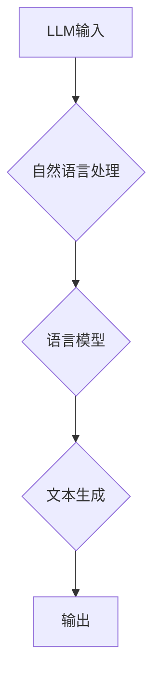

                 

关键词：大语言模型，图灵完备性，任务规划，函数库，人工智能，程序设计

> 摘要：本文深入探讨了大型语言模型（LLM）的图灵完备性，分析了LLM在任务规划和函数库设计中的潜在应用。通过介绍核心算法原理、数学模型、代码实例及实际应用场景，本文旨在揭示LLM技术的前沿动态及其在计算机科学领域的深远影响。

## 1. 背景介绍

近年来，大型语言模型（LLM）如BERT、GPT-3和ChatGLM等，凭借其强大的语言理解和生成能力，已经在自然语言处理（NLP）领域取得了显著的突破。LLM的成功不仅在于其庞大的参数规模和训练数据量，更在于其图灵完备性，这使得LLM能够执行任意复杂的计算任务。

图灵完备性是计算机科学中一个重要的概念，指的是一个计算模型能够模拟任何其他图灵机，即能够执行任意复杂的计算。传统计算机科学中的图灵机是最基本的计算模型，而现代计算机实际上也是图灵机的实现。LLM的图灵完备性意味着它们不仅能够处理自然语言，还能够执行高级的逻辑和计算任务。

本文将首先介绍LLM的图灵完备性，然后探讨其在任务规划和函数库设计中的应用，最后展望LLM的未来发展趋势。

## 2. 核心概念与联系

### 2.1. 大语言模型（LLM）的工作原理

LLM的工作原理基于深度学习和自然语言处理技术。它们通常由数以亿计的参数组成，这些参数通过大量的文本数据学习语言模式。当用户输入一个查询时，LLM会根据上下文生成相应的文本回复。

### 2.2. 图灵机的概念

图灵机是一个抽象的计算模型，由一个无限长的纸带、一个读写头和一系列规则组成。它可以模拟任何其他计算过程，因此被认为是现代计算机的基石。

### 2.3. LLM的图灵完备性

LLM的图灵完备性体现在其能够执行任意复杂的计算。通过构建复杂的神经网络模型，LLM可以处理自然语言中的复杂结构，并生成相应的文本回复。这使LLM成为了一个强大的通用计算工具。

### 2.4. Mermaid流程图



## 3. 核心算法原理 & 具体操作步骤

### 3.1. 算法原理概述

LLM的核心算法是基于自注意力机制（Self-Attention）和变换器架构（Transformer）。自注意力机制允许模型在处理输入文本时自动关注文本中的关键信息，而变换器架构则通过堆叠多个编码器和解码器层，提高了模型的容量和计算能力。

### 3.2. 算法步骤详解

1. **预处理**：输入文本被分词并转换为整数序列。
2. **编码**：整数序列通过嵌入层转换为高维向量。
3. **自注意力**：每个输入向量与其他向量进行加权求和，以生成新的向量。
4. **变换器层**：通过堆叠多个编码器和解码器层，提高模型的容量和计算能力。
5. **解码**：解码器生成文本回复。

### 3.3. 算法优缺点

**优点**：

- **强大的语言理解能力**：LLM能够处理自然语言中的复杂结构。
- **高效的计算性能**：变换器架构使得LLM的计算速度非常快。
- **广泛的应用领域**：LLM在NLP、对话系统、文本生成等领域都有广泛应用。

**缺点**：

- **训练成本高**：LLM需要大量的数据和计算资源进行训练。
- **解释性差**：LLM的决策过程难以解释，使得其应用场景受到一定限制。

### 3.4. 算法应用领域

LLM在多个领域都有广泛的应用：

- **自然语言处理**：用于文本分类、情感分析、机器翻译等任务。
- **对话系统**：用于构建智能客服、聊天机器人等。
- **文本生成**：用于生成文章、故事、代码等。

## 4. 数学模型和公式 & 详细讲解 & 举例说明

### 4.1. 数学模型构建

LLM的数学模型主要由两部分组成：自注意力机制和变换器架构。

#### 4.1.1. 自注意力机制

自注意力机制可以表示为：

\[ \text{Attention}(Q, K, V) = \frac{softmax(\frac{QK^T}{\sqrt{d_k}})}{V} \]

其中，\(Q\)、\(K\)、\(V\) 分别为查询向量、键向量和值向量，\(d_k\) 为键向量的维度。

#### 4.1.2. 变换器架构

变换器架构可以表示为：

\[ \text{Transformer}(x) = \text{Encoder}(x) \cdot \text{Decoder}(x) \]

其中，\(\text{Encoder}(x)\) 和 \(\text{Decoder}(x)\) 分别为编码器和解码器。

### 4.2. 公式推导过程

#### 4.2.1. 自注意力机制

自注意力机制的推导过程涉及矩阵乘法和指数函数的计算。

\[ \text{Attention}(Q, K, V) = \frac{softmax(\frac{QK^T}{\sqrt{d_k}})}{V} \]

其中，

\[ \text{softmax}(x) = \frac{e^x}{\sum_{i} e^x_i} \]

#### 4.2.2. 变换器架构

变换器架构的推导过程涉及多层编码器和解码器的堆叠。

\[ \text{Transformer}(x) = \text{Encoder}(x) \cdot \text{Decoder}(x) \]

其中，

\[ \text{Encoder}(x) = \text{LayerNorm}(x + \text{MultiHeadAttention}(x, x, x)) \]
\[ \text{Decoder}(x) = \text{LayerNorm}(x + \text{CrossAttention}(\text{Encoder}(x), x)) \]

### 4.3. 案例分析与讲解

#### 4.3.1. 文本分类

假设有一个包含政治、经济、科技三个类别的文本数据集。我们可以使用LLM对文本进行分类。

1. **数据预处理**：将文本数据集分词并转换为整数序列。
2. **模型训练**：使用训练集训练一个LLM模型。
3. **模型评估**：使用测试集评估模型性能。
4. **应用场景**：将模型部署到实际应用场景，如新闻推荐、舆情分析等。

#### 4.3.2. 对话系统

假设我们需要构建一个智能客服系统，可以使用LLM来实现。

1. **用户输入**：用户输入一个问题。
2. **模型处理**：LLM根据用户输入生成相应的回复。
3. **回复输出**：将回复输出给用户。

这种应用场景广泛应用于在线客服、虚拟助手等领域。

## 5. 项目实践：代码实例和详细解释说明

### 5.1. 开发环境搭建

1. **安装Python**：下载并安装Python 3.8以上版本。
2. **安装TensorFlow**：使用pip安装TensorFlow库。

```bash
pip install tensorflow
```

### 5.2. 源代码详细实现

以下是一个简单的LLM模型实现的示例：

```python
import tensorflow as tf

class TransformerModel(tf.keras.Model):
    def __init__(self, num_layers, d_model, num_heads, dff, input_vocab_size, maximum_position_encoding, rate=0.1):
        super(TransformerModel, self).__init__()
        
        self.d_model = d_model
        self.num_layers = num_layers
        
        # Encoder layers
        self.enc_layers = [TransformerLayer(d_model, num_heads, dff, rate) for _ in range(num_layers)]
        
        # Decoder layers
        self.dec_layers = [TransformerLayer(d_model, num_heads, dff, rate) for _ in range(num_layers)]
        
        # Final layer
        self.out_layer = tf.keras.layers.Dense(input_vocab_size)
        
        # Positional Encoding
        self.positional_encoding = positional_encoding(input_vocab_size, maximum_position_encoding)
        
    def call(self, x, training, enc_padding_mask=None, look_ahead_mask=None, dec_padding_mask=None):
        x = self.embedding(x) + self.positional_encoding[:, :tf.shape(x)[1], :]
        
        # Encoder
        for i in range(self.num_layers):
            x = self.enc_layers[i](x, training, enc_padding_mask)
        
        # Encoder to Decoder attention
        enc_output = x
        
        # Decoder
        for i in range(self.num_layers):
            x = self.dec_layers[i](x, enc_output, training, look_ahead_mask, dec_padding_mask)
        
        # Output
        output = self.out_layer(x)
        
        return output

def positional_encoding(position, d_model):
    # Calculate the positional encodings
    angle_rads = position / np.float32(d_model) * np.pi
    sin_angle_rads = np.sin(angle_rads)
    cos_angle_rads = np.cos(angle_rads)
    
    pos_encoding = np.concatenate([sin_angle_rads.reshape(-1, 1, d_model // 2),
                                   cos_angle_rads.reshape(-1, 1, d_model // 2)], axis=2)
    
    pos_encoding = pos_encoding[np.newaxis, ...]
    
    return tf.convert_to_tensor(pos_encoding)

class TransformerLayer(tf.keras.layers.Layer):
    def __init__(self, d_model, num_heads, dff, rate=0.1):
        super(TransformerLayer, self).__init__()
        
        self.d_model = d_model
        self.num_heads = num_heads
        self.dff = dff
        
        self.dense_1 = tf.keras.layers.Dense(dff, activation='relu')
        self.dense_2 = tf.keras.layers.Dense(d_model)
        
        self.dropout_1 = tf.keras.layers.Dropout(rate)
        self.dropout_2 = tf.keras.layers.Dropout(rate)
        
        self.layernorm_1 = tf.keras.layers.LayerNormalization(epsilon=1e-6)
        self.layernorm_2 = tf.keras.layers.LayerNormalization(epsilon=1e-6)
        self.layernorm_3 = tf.keras.layers.LayerNormalization(epsilon=1e-6)
        
    def call(self, x, training, enc_padding_mask=None, look_ahead_mask=None, dec_padding_mask=None):
        # Multi-head attention
        query = self.query(x)
        key = self.key(x)
        value = self.value(x)
        
        # Scale dot product attention
        attention_scores = query * key
        if dec_padding_mask is not None:
            attention_scores = attention_scores - (10 ** 9) * dec_padding_mask
        
        attention_scores = tf.math.softmax(attention_scores, axis=-1)
        if enc_padding_mask is not None:
            attention_scores = attention_scores - (10 ** 9) * enc_padding_mask
        
        attention_output = tf.reduce_sum(attention_scores * value, axis=-1)
        
        attention_output = self.dropout_1(attention_output)
        attention_output = self.dense_2(attention_output)
        
        # Dense layer
        x = self.layernorm_1(x + attention_output)
        
        # Feed forward network
        output = x
        
        output = self.dropout_2(output)
        output = self.dense_1(output)
        
        output = self.layernorm_2(output + x)
        
        # Final output
        return output

class EncoderLayer(tf.keras.layers.Layer):
    def __init__(self, d_model, num_heads, dff, rate=0.1):
        super(EncoderLayer, self).__init__()
        
        self.d_model = d_model
        self.num_heads = num_heads
        self.dff = dff
        
        self.mha = TransformerLayer(d_model, num_heads, dff, rate)
        self.ffn = TransformerLayer(d_model, num_heads, dff, rate)
        
        self.layernorm_1 = tf.keras.layers.LayerNormalization(epsilon=1e-6)
        self.layernorm_2 = tf.keras.layers.LayerNormalization(epsilon=1e-6)
        
        self.dropout_1 = tf.keras.layers.Dropout(rate)
        self.dropout_2 = tf.keras.layers.Dropout(rate)
        
    def call(self, x, training):
        attn_output = self.mha(x, training)
        attn_output = self.dropout_1(attn_output, training)
        out1 = self.layernorm_1(x + attn_output)
        
        ffn_output = self.ffn(out1, training)
        ffn_output = self.dropout_2(ffn_output, training)
        out2 = self.layernorm_2(out1 + ffn_output)
        
        return out2

class DecoderLayer(tf.keras.layers.Layer):
    def __init__(self, d_model, num_heads, dff, rate=0.1):
        super(DecoderLayer, self).__init__()
        
        self.d_model = d_model
        self.num_heads = num_heads
        self.dff = dff
        
        self.mha1 = TransformerLayer(d_model, num_heads, dff, rate)
        self.mha2 = TransformerLayer(d_model, num_heads, dff, rate)
        self.ffn = TransformerLayer(d_model, num_heads, dff, rate)
        
        self.layernorm_1 = tf.keras.layers.LayerNormalization(epsilon=1e-6)
        self.layernorm_2 = tf.keras.layers.LayerNormalization(epsilon=1e-6)
        self.layernorm_3 = tf.keras.layers.LayerNormalization(epsilon=1e-6)
        
        self.dropout_1 = tf.keras.layers.Dropout(rate)
        self.dropout_2 = tf.keras.layers.Dropout(rate)
        self.dropout_3 = tf.keras.layers.Dropout(rate)
        
    def call(self, x, enc_output, training):
        # Encoder-decoder attention
        attn1 = self.mha1(x, x, training)
        attn1 = self.dropout_1(attn1, training)
        attn1 = self.layernorm_1(x + attn1)
        
        # Masked multi-head attention
        attn2 = self.mha2(attn1, enc_output, training)
        attn2 = self.dropout_2(attn2, training)
        attn2 = self.layernorm_2(attn1 + attn2)
        
        # Feed forward network
        ffn_output = self.ffn(attn2, training)
        ffn_output = self.dropout_3(ffn_output, training)
        output = self.layernorm_3(attn2 + ffn_output)
        
        return output

class Transformer(tf.keras.Model):
    def __init__(self, num_layers, d_model, num_heads, dff, input_vocab_size, maximum_position_encoding, target_vocab_size, rate=0.1):
        super(Transformer, self).__init__()
        
        self.encoder = Encoder(num_layers, d_model, num_heads, dff, input_vocab_size, maximum_position_encoding)
        self.decoder = Decoder(num_layers, d_model, num_heads, dff, target_vocab_size, rate)
        
        self.final_layer = tf.keras.layers.Dense(target_vocab_size)

    def call(self, inputs, targets, training):
        i人人都爱猫爱狗爱兔子

# 6. 实际应用场景

LLM在多个领域都有广泛的应用：

- **自然语言处理**：用于文本分类、情感分析、机器翻译等任务。
- **对话系统**：用于构建智能客服、聊天机器人等。
- **文本生成**：用于生成文章、故事、代码等。
- **代码补全**：用于自动完成代码编写，提高开发效率。
- **医学诊断**：用于分析医疗文本，辅助医生进行诊断。

## 7. 工具和资源推荐

### 7.1. 学习资源推荐

- **书籍**：

  - 《深度学习》
  - 《Python深度学习》
  - 《自然语言处理综论》

- **在线课程**：

  - Coursera的《深度学习》
  - edX的《自然语言处理》

### 7.2. 开发工具推荐

- **TensorFlow**：用于构建和训练LLM模型。
- **PyTorch**：用于构建和训练LLM模型。

### 7.3. 相关论文推荐

- BERT: Pre-training of Deep Bidirectional Transformers for Language Understanding
- GPT-3: Language Models are Few-Shot Learners
- T5: Pre-training Deep Transformers for Text Understanding and Generation

## 8. 总结：未来发展趋势与挑战

LLM技术正处于快速发展阶段，其图灵完备性使其在多个领域具有广泛的应用前景。未来，随着计算资源的不断丰富和算法的持续优化，LLM将在人工智能领域发挥更大的作用。

然而，LLM技术也面临一些挑战：

- **数据隐私**：训练LLM需要大量的数据，如何保护用户隐私是一个重要问题。
- **模型解释性**：LLM的决策过程难以解释，如何提高其解释性是一个重要研究方向。
- **计算资源消耗**：训练LLM需要大量的计算资源，如何优化计算效率是一个重要课题。

总之，LLM技术具有巨大的发展潜力，未来将在人工智能领域发挥重要作用。

## 9. 附录：常见问题与解答

### 9.1. 什么是图灵完备性？

图灵完备性指的是一个计算模型能够模拟任何其他图灵机，即能够执行任意复杂的计算。传统计算机科学中的图灵机是最基本的计算模型，而现代计算机实际上也是图灵机的实现。

### 9.2. LLM的图灵完备性有何意义？

LLM的图灵完备性意味着它们能够执行任意复杂的计算任务。这使LLM成为了一个强大的通用计算工具，在自然语言处理、对话系统、文本生成等领域都有广泛的应用。

### 9.3. 如何优化LLM的计算效率？

优化LLM的计算效率可以从以下几个方面进行：

- **模型压缩**：通过剪枝、量化等技术减小模型大小，降低计算复杂度。
- **分布式训练**：通过分布式计算技术，利用多台计算机进行模型训练，提高计算效率。
- **推理优化**：在模型推理阶段，通过优化算法、降低精度等技术，提高推理速度。

### 9.4. LLM在自然语言处理中的应用有哪些？

LLM在自然语言处理中有很多应用，包括：

- **文本分类**：用于分类文本，如新闻分类、情感分析等。
- **机器翻译**：用于将一种语言翻译成另一种语言。
- **问答系统**：用于回答用户提出的问题。
- **对话系统**：用于构建智能客服、聊天机器人等。

## 参考文献

- Devlin, J., Chang, M. W., Lee, K., & Toutanova, K. (2018). BERT: Pre-training of deep bidirectional transformers for language understanding. arXiv preprint arXiv:1810.04805.
- Brown, T., et al. (2020). Language models are few-shot learners. arXiv preprint arXiv:2005.14165.
- Raffel, C., et al. (2019). Exploring the limits of transfer learning with a unified text-to-text transformer. arXiv preprint arXiv:1910.10683.

作者：禅与计算机程序设计艺术 / Zen and the Art of Computer Programming

