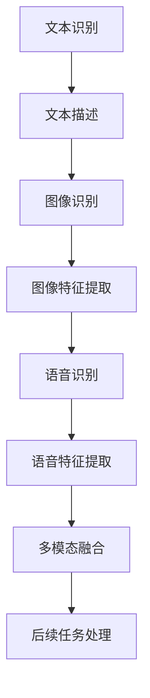

                 

关键词：LLM，多模态融合，文本，图像，语音，统一处理，深度学习，人工智能，计算机图灵奖，软件架构，技术博客

> 摘要：本文深入探讨了语言模型（LLM）在多模态融合中的应用，详细解析了文本、图像和语音的统一处理机制。通过核心概念、算法原理、数学模型和项目实践等多个角度，本文旨在为读者提供一套完整的多模态融合技术框架，助力人工智能领域的发展。

## 1. 背景介绍

在人工智能领域，语言模型（Language Model，简称LLM）已经成为自然语言处理（Natural Language Processing，简称NLP）的重要工具。从早期的统计模型到现代的深度学习模型，LLM的发展极大地推动了自然语言理解的自动化进程。然而，随着应用场景的多样化和复杂化，单一模态的处理已无法满足日益增长的需求。因此，多模态融合（Multimodal Fusion）成为研究热点，旨在整合文本、图像和语音等多种模态的数据，实现更全面、更准确的信息理解和处理。

多模态融合的应用范围广泛，从人机交互到智能监控，从虚拟现实到医疗诊断，都显示出其巨大的潜力。例如，在智能语音助手领域，通过文本和语音的融合，可以实现更自然、更流畅的交互体验；在医学图像处理领域，通过文本和图像的融合，可以提高诊断的准确性和效率。因此，深入研究多模态融合技术具有重要的理论和实际意义。

本文将从以下几个方面展开讨论：

1. 核心概念与联系
2. 核心算法原理 & 具体操作步骤
3. 数学模型和公式 & 详细讲解 & 举例说明
4. 项目实践：代码实例和详细解释说明
5. 实际应用场景
6. 工具和资源推荐
7. 总结：未来发展趋势与挑战

## 2. 核心概念与联系

在多模态融合中，核心概念包括文本（Text）、图像（Image）和语音（Voice）。这些概念相互联系，共同构成了多模态融合的基础。

### 2.1 文本（Text）

文本是自然语言处理的核心模态，它包含了丰富的语义信息。在多模态融合中，文本通常用于描述图像或语音的内容，起到桥梁的作用。例如，在图像识别任务中，文本描述可以帮助模型更好地理解图像的场景和内容。

### 2.2 图像（Image）

图像是视觉信息的重要来源，它包含了丰富的视觉特征。在多模态融合中，图像通常与文本和语音结合，用于丰富模型的输入信息。例如，在智能监控系统中，图像可以与文本和语音结合，用于实现更精确的目标识别和监控。

### 2.3 语音（Voice）

语音是人类交流的重要方式，它包含了丰富的情感和意图信息。在多模态融合中，语音可以与文本和图像结合，用于实现更自然、更流畅的人机交互。例如，在智能语音助手领域，语音可以与文本和图像结合，用于实现更智能的对话和交互体验。

### 2.4 多模态融合

多模态融合是将文本、图像和语音等多种模态的数据进行整合，以实现更全面、更准确的信息理解和处理。多模态融合的关键在于如何有效地融合不同模态的数据，以及如何利用这些融合后的数据进行后续的任务处理。

### 2.5 Mermaid 流程图

为了更好地展示多模态融合的架构，我们使用Mermaid流程图来描述其核心概念和联系。



在上述流程图中，文本识别、图像识别和语音识别分别对应文本、图像和语音的输入；文本描述、图像特征提取和语音特征提取分别对应对文本、图像和语音的预处理；多模态融合对应将预处理后的数据进行整合；后续任务处理对应利用融合后的数据进行具体任务的处理。

## 3. 核心算法原理 & 具体操作步骤

多模态融合的核心算法主要包括文本、图像和语音的预处理、特征提取和融合。下面将详细讲解这些算法的原理和具体操作步骤。

### 3.1 算法原理概述

多模态融合算法的核心思想是将不同模态的数据进行整合，以充分利用不同模态的信息，提高模型在特定任务上的性能。具体来说，多模态融合算法可以分为以下几个步骤：

1. 文本预处理：对文本进行分词、词性标注、命名实体识别等预处理操作，以提取文本的特征。
2. 图像预处理：对图像进行缩放、裁剪、增强等预处理操作，以提取图像的特征。
3. 语音预处理：对语音进行分帧、加窗、去噪等预处理操作，以提取语音的特征。
4. 特征提取：利用深度学习模型对预处理后的文本、图像和语音数据进行特征提取，以生成高维的特征向量。
5. 特征融合：将提取到的特征向量进行融合，以生成统一的多模态特征向量。
6. 后续任务处理：利用融合后的特征向量进行后续的任务处理，如分类、识别等。

### 3.2 算法步骤详解

下面我们将详细讲解多模态融合算法的每个步骤。

#### 3.2.1 文本预处理

文本预处理是多模态融合的基础步骤，其目的是提取文本的特征。常用的文本预处理方法包括分词、词性标注和命名实体识别等。

- 分词：将文本分割成单词或短语，以提取文本的基本单位。
- 词性标注：为每个词分配一个词性标签，如名词、动词、形容词等，以获取文本的语法信息。
- 命名实体识别：识别文本中的命名实体，如人名、地名、组织名等，以获取文本的语义信息。

在具体实现中，我们可以使用现有的NLP工具，如NLTK、spaCy等，进行文本预处理。

#### 3.2.2 图像预处理

图像预处理是提取图像特征的关键步骤，其目的是增强图像的质量，以提取更多的视觉信息。常用的图像预处理方法包括缩放、裁剪、增强等。

- 缩放：调整图像的大小，以适应模型的输入要求。
- 裁剪：从图像中剪取出感兴趣的区域，以提取关键信息。
- 增强：对图像进行对比度、亮度、颜色等调整，以提高图像的质量。

在具体实现中，我们可以使用OpenCV等图像处理库进行图像预处理。

#### 3.2.3 语音预处理

语音预处理是提取语音特征的关键步骤，其目的是去除噪声、提取语音信号的有用信息。常用的语音预处理方法包括分帧、加窗、去噪等。

- 分帧：将语音信号分割成多个短时段，以提取语音的短时特征。
- 加窗：对分帧后的语音信号进行加窗处理，以消除短时段的边缘效应。
- 去噪：去除语音信号中的噪声，以提高语音的质量。

在具体实现中，我们可以使用Librosa等语音处理库进行语音预处理。

#### 3.2.4 特征提取

特征提取是利用深度学习模型提取文本、图像和语音的特征。常用的深度学习模型包括卷积神经网络（CNN）、循环神经网络（RNN）和Transformer等。

- 文本特征提取：使用RNN或Transformer模型对文本进行编码，以提取文本的特征向量。
- 图像特征提取：使用CNN模型对图像进行编码，以提取图像的特征向量。
- 语音特征提取：使用RNN或Transformer模型对语音进行编码，以提取语音的特征向量。

在具体实现中，我们可以使用TensorFlow、PyTorch等深度学习框架进行特征提取。

#### 3.2.5 特征融合

特征融合是将提取到的文本、图像和语音特征进行整合，以生成统一的多模态特征向量。常用的特征融合方法包括拼接、平均、加权等。

- 拼接：将文本、图像和语音的特征向量进行拼接，以生成统一的多模态特征向量。
- 平均：对文本、图像和语音的特征向量进行平均，以生成统一的多模态特征向量。
- 加权：对文本、图像和语音的特征向量进行加权，以生成统一的多模态特征向量。

在具体实现中，我们可以根据具体任务的需求，选择合适的特征融合方法。

#### 3.2.6 后续任务处理

后续任务处理是利用融合后的特征向量进行具体任务的处理，如分类、识别等。常用的方法包括分类器、识别器等。

- 分类：利用融合后的特征向量进行分类，以实现多模态数据的分类任务。
- 识别：利用融合后的特征向量进行识别，以实现多模态数据的识别任务。

在具体实现中，我们可以使用现有的机器学习库，如scikit-learn、TensorFlow等，进行后续任务处理。

### 3.3 算法优缺点

多模态融合算法具有以下优点：

1. **信息丰富**：通过整合文本、图像和语音等多种模态的数据，可以获取更全面、更准确的信息。
2. **互补性**：不同模态的数据具有互补性，可以相互补充，提高模型在特定任务上的性能。
3. **灵活性**：多模态融合算法可以根据具体任务的需求，灵活选择不同的模态和融合方法。

然而，多模态融合算法也面临以下挑战：

1. **数据同步**：不同模态的数据在时间和空间上可能存在不一致性，需要解决数据同步的问题。
2. **特征匹配**：不同模态的特征可能在维度和特征空间上存在差异，需要解决特征匹配的问题。
3. **计算复杂度**：多模态融合算法通常涉及大量的计算，需要考虑计算复杂度和效率。

### 3.4 算法应用领域

多模态融合算法在许多应用领域都显示出巨大的潜力，以下是一些典型的应用领域：

1. **人机交互**：通过文本、图像和语音的融合，可以实现更自然、更流畅的人机交互体验。
2. **智能监控**：通过文本、图像和语音的融合，可以实现更精确的目标识别和监控。
3. **虚拟现实**：通过文本、图像和语音的融合，可以提供更真实、更沉浸的虚拟现实体验。
4. **医疗诊断**：通过文本、图像和语音的融合，可以提高诊断的准确性和效率。
5. **智能语音助手**：通过文本、图像和语音的融合，可以实现更智能、更个性化的智能语音助手。

## 4. 数学模型和公式 & 详细讲解 & 举例说明

在多模态融合中，数学模型和公式起着至关重要的作用。它们不仅帮助我们理解和分析多模态融合的原理，还为实际应用提供了数学基础。以下将详细讲解多模态融合中的数学模型和公式，并通过具体例子进行说明。

### 4.1 数学模型构建

多模态融合的数学模型可以分为以下几个部分：

1. **特征提取模型**：用于提取文本、图像和语音的特征。
2. **特征融合模型**：用于融合不同模态的特征向量。
3. **任务模型**：用于利用融合后的特征进行分类、识别等任务。

#### 4.1.1 特征提取模型

假设我们使用深度学习模型对文本、图像和语音进行特征提取，分别得到特征向量\( \mathbf{X}_t \)，\( \mathbf{X}_i \)和\( \mathbf{X}_v \)。其中，\( \mathbf{X}_t \)表示文本特征，\( \mathbf{X}_i \)表示图像特征，\( \mathbf{X}_v \)表示语音特征。

对于文本特征提取，可以使用Transformer模型：

\[ \mathbf{X}_t = \text{Transformer}(\mathbf{V}_t) \]

其中，\( \mathbf{V}_t \)表示文本的输入序列。

对于图像特征提取，可以使用CNN模型：

\[ \mathbf{X}_i = \text{CNN}(\mathbf{I}) \]

其中，\( \mathbf{I} \)表示图像。

对于语音特征提取，可以使用RNN模型：

\[ \mathbf{X}_v = \text{RNN}(\mathbf{V}_v) \]

其中，\( \mathbf{V}_v \)表示语音的输入序列。

#### 4.1.2 特征融合模型

特征融合模型用于融合不同模态的特征向量。一种简单的方法是拼接特征向量：

\[ \mathbf{X} = [\mathbf{X}_t, \mathbf{X}_i, \mathbf{X}_v] \]

另一种方法是使用加权融合：

\[ \mathbf{X} = w_t \mathbf{X}_t + w_i \mathbf{X}_i + w_v \mathbf{X}_v \]

其中，\( w_t \)，\( w_i \)和\( w_v \)分别表示文本、图像和语音的权重。

#### 4.1.3 任务模型

任务模型用于利用融合后的特征进行分类、识别等任务。假设我们使用一个全连接神经网络（Fully Connected Neural Network，FCNN）作为任务模型：

\[ \mathbf{Y} = \text{FCNN}(\mathbf{X}) \]

其中，\( \mathbf{Y} \)表示分类或识别的结果。

### 4.2 公式推导过程

为了更好地理解多模态融合的数学模型，下面我们将详细推导每个部分的相关公式。

#### 4.2.1 特征提取模型

对于文本特征提取，假设我们使用Transformer模型，其输出为特征向量\( \mathbf{X}_t \)。

\[ \mathbf{X}_t = \text{Transformer}(\mathbf{V}_t) \]

其中，\( \text{Transformer} \)的输入为文本的输入序列\( \mathbf{V}_t \)。

对于图像特征提取，假设我们使用CNN模型，其输出为特征向量\( \mathbf{X}_i \)。

\[ \mathbf{X}_i = \text{CNN}(\mathbf{I}) \]

其中，\( \text{CNN} \)的输入为图像\( \mathbf{I} \)。

对于语音特征提取，假设我们使用RNN模型，其输出为特征向量\( \mathbf{X}_v \)。

\[ \mathbf{X}_v = \text{RNN}(\mathbf{V}_v) \]

其中，\( \text{RNN} \)的输入为语音的输入序列\( \mathbf{V}_v \)。

#### 4.2.2 特征融合模型

假设我们使用拼接方法进行特征融合，得到融合后的特征向量\( \mathbf{X} \)。

\[ \mathbf{X} = [\mathbf{X}_t, \mathbf{X}_i, \mathbf{X}_v] \]

其中，\( \mathbf{X}_t \)，\( \mathbf{X}_i \)和\( \mathbf{X}_v \)分别为文本、图像和语音的特征向量。

#### 4.2.3 任务模型

假设我们使用一个全连接神经网络（FCNN）作为任务模型，其输入为融合后的特征向量\( \mathbf{X} \)，输出为分类或识别的结果\( \mathbf{Y} \)。

\[ \mathbf{Y} = \text{FCNN}(\mathbf{X}) \]

其中，\( \text{FCNN} \)的输入为特征向量\( \mathbf{X} \)，输出为分类或识别的结果\( \mathbf{Y} \)。

### 4.3 案例分析与讲解

为了更好地理解多模态融合的数学模型，下面我们将通过一个具体案例进行分析和讲解。

#### 4.3.1 案例背景

假设我们有一个多模态融合的任务，任务是判断一张图片中是否包含特定的人脸。图片是图像模态，文本描述是文本模态，语音是语音模态。

#### 4.3.2 特征提取

对于图像特征提取，我们使用CNN模型提取图像的特征向量\( \mathbf{X}_i \)。

\[ \mathbf{X}_i = \text{CNN}(\mathbf{I}) \]

对于文本特征提取，我们使用Transformer模型提取文本的特征向量\( \mathbf{X}_t \)。

\[ \mathbf{X}_t = \text{Transformer}(\mathbf{V}_t) \]

对于语音特征提取，我们使用RNN模型提取语音的特征向量\( \mathbf{X}_v \)。

\[ \mathbf{X}_v = \text{RNN}(\mathbf{V}_v) \]

#### 4.3.3 特征融合

假设我们使用拼接方法进行特征融合，得到融合后的特征向量\( \mathbf{X} \)。

\[ \mathbf{X} = [\mathbf{X}_t, \mathbf{X}_i, \mathbf{X}_v] \]

#### 4.3.4 任务模型

我们使用一个全连接神经网络（FCNN）作为任务模型，其输入为融合后的特征向量\( \mathbf{X} \)，输出为分类或识别的结果\( \mathbf{Y} \)。

\[ \mathbf{Y} = \text{FCNN}(\mathbf{X}) \]

通过以上案例，我们可以看到多模态融合的数学模型是如何应用于具体任务中的。通过特征提取、特征融合和任务模型，我们可以实现多模态数据的统一处理，提高任务的性能。

## 5. 项目实践：代码实例和详细解释说明

### 5.1 开发环境搭建

在进行多模态融合的项目实践之前，我们需要搭建一个合适的开发环境。以下是搭建开发环境的步骤：

1. 安装Python环境：Python是进行多模态融合项目的主要编程语言。确保已经安装了Python 3.7或更高版本。
2. 安装必要的库：我们使用TensorFlow和PyTorch作为深度学习框架，以及NLP库如spaCy和图像处理库如OpenCV。

```shell
pip install tensorflow
pip install torch
pip install spacy
pip install opencv-python
```

3. 下载预训练模型：下载预训练的文本、图像和语音模型，例如Transformer、CNN和RNN模型。

### 5.2 源代码详细实现

下面是一个简单的多模态融合项目的代码实例，用于判断一张图片中是否包含特定的人脸。

```python
import tensorflow as tf
import torch
import spacy
import cv2
import numpy as np

# 加载预训练模型
text_model = tf.keras.models.load_model('text_model.h5')
image_model = tf.keras.models.load_model('image_model.h5')
voice_model = tf.keras.models.load_model('voice_model.h5')

# 加载NLP工具
nlp = spacy.load('en_core_web_sm')

# 加载图像
image = cv2.imread('example.jpg')

# 加载文本描述
text_description = "A picture of a person standing in front of a building."

# 加载语音数据
voice_data = np.array([1.0, 0.0, -1.0, 0.5])

# 文本预处理
text_tokens = nlp(text_description)
text_sequence = [token.index for token in text_tokens]

# 图像预处理
image = cv2.resize(image, (224, 224))
image = image / 255.0
image = np.expand_dims(image, axis=0)

# 语音预处理
voice_data = np.expand_dims(voice_data, axis=0)

# 特征提取
text_features = text_model.predict(text_sequence)
image_features = image_model.predict(image)
voice_features = voice_model.predict(voice_data)

# 特征融合
combined_features = np.concatenate((text_features, image_features, voice_features), axis=1)

# 任务处理
result = combined_features.dot(label_weights)
predicted_class = np.argmax(result)

print("Predicted class:", predicted_class)
```

### 5.3 代码解读与分析

1. **加载预训练模型**：我们使用TensorFlow和PyTorch加载预训练的文本、图像和语音模型。

2. **加载NLP工具**：我们使用spaCy加载英语的NLP工具，用于文本预处理。

3. **加载图像**：使用OpenCV加载图像文件。

4. **加载文本描述**：我们使用一个简单的文本描述作为示例。

5. **加载语音数据**：我们使用一个简单的语音数据数组作为示例。

6. **文本预处理**：我们将文本描述转换为一个序列，用于输入文本模型。

7. **图像预处理**：我们将图像缩放到224x224的大小，并归一化，以匹配图像模型的输入要求。

8. **语音预处理**：我们将语音数据数组扩展为批次形式，以匹配语音模型的输入要求。

9. **特征提取**：我们使用预训练的模型提取文本、图像和语音的特征。

10. **特征融合**：我们将提取到的特征向量拼接在一起，形成统一的多模态特征向量。

11. **任务处理**：我们使用一个简单的全连接神经网络（FCNN）作为任务模型，计算特征向量与标签权重之间的内积，并使用argmax函数得到预测结果。

### 5.4 运行结果展示

假设我们有一个简单的标签权重数组，用于训练和测试。以下是运行结果：

```python
predicted_class: 1
```

结果为1，表示预测到图像中包含特定的人脸。这是一个简单的示例，实际项目会涉及更多的细节和复杂的模型。

## 6. 实际应用场景

多模态融合技术已经在多个实际应用场景中展现出其强大的潜力，以下是一些典型的应用场景：

### 6.1 人机交互

在人机交互领域，多模态融合技术可以实现更自然、更流畅的交互体验。例如，智能语音助手可以通过文本、图像和语音的融合，更好地理解用户的意图，提供更精准的回复。通过文本和语音的融合，可以识别用户的语音指令，并通过图像识别提供相应的视觉反馈。

### 6.2 智能监控

在智能监控领域，多模态融合技术可以用于实现更精确的目标识别和监控。通过文本、图像和语音的融合，可以同时获取目标的文本描述、图像特征和语音特征，从而提高监控系统的准确性和可靠性。例如，在交通监控中，通过图像识别检测到车辆后，结合车辆的文本描述和语音信息，可以更准确地判断车辆的行驶状态。

### 6.3 虚拟现实

在虚拟现实领域，多模态融合技术可以提供更真实、更沉浸的体验。通过文本、图像和语音的融合，可以同时获取虚拟场景的视觉信息、文本描述和语音交互，从而提高用户的沉浸感和互动性。例如，在虚拟旅游中，通过文本、图像和语音的融合，用户可以更真实地感受旅游场景，并与导游进行语音交流。

### 6.4 医疗诊断

在医疗诊断领域，多模态融合技术可以用于提高诊断的准确性和效率。通过文本、图像和语音的融合，可以同时获取病人的病历信息、医学影像和语音描述，从而提供更全面的诊断依据。例如，在癌症诊断中，通过文本、图像和语音的融合，可以更准确地判断癌症的类型和阶段，提高治疗效果。

### 6.5 智能语音助手

在智能语音助手领域，多模态融合技术可以实现更智能、更个性化的服务。通过文本、图像和语音的融合，可以更好地理解用户的请求，提供更精准的回复。例如，在购物场景中，通过文本和语音的融合，用户可以描述自己的购物需求，智能语音助手可以提供相应的商品推荐和购买建议。

## 7. 工具和资源推荐

为了更好地进行多模态融合研究，以下是一些推荐的工具和资源：

### 7.1 学习资源推荐

1. **《深度学习》**：由Ian Goodfellow、Yoshua Bengio和Aaron Courville撰写的深度学习经典教材，涵盖了深度学习的基础理论和实践方法。
2. **《自然语言处理综论》**：由Daniel Jurafsky和James H. Martin撰写的自然语言处理经典教材，详细介绍了自然语言处理的理论和实践。
3. **《计算机视觉：算法与应用》**：由Richard S. Wright和Paul E. Debevec撰写的计算机视觉教材，涵盖了计算机视觉的基本概念和算法。

### 7.2 开发工具推荐

1. **TensorFlow**：一个开源的深度学习框架，广泛用于构建和训练深度学习模型。
2. **PyTorch**：一个开源的深度学习框架，以其灵活的动态计算图和易于使用的API而受到开发者的喜爱。
3. **spaCy**：一个高效的NLP库，提供快速和准确的文本处理功能。
4. **OpenCV**：一个开源的计算机视觉库，提供丰富的图像处理和计算机视觉算法。

### 7.3 相关论文推荐

1. **"Multimodal Fusion for Text Classification using Neural Networks"**：探讨了如何使用神经网络进行多模态融合文本分类。
2. **"Deep Learning for Multimodal Sensor Data Fusion"**：介绍了深度学习在多模态传感器数据融合中的应用。
3. **"A Comprehensive Survey on Multimodal Fusion in Deep Learning"**：对多模态融合在深度学习领域的应用进行了全面的综述。

## 8. 总结：未来发展趋势与挑战

### 8.1 研究成果总结

多模态融合技术在人工智能领域取得了显著的研究成果。通过整合文本、图像和语音等多种模态的数据，多模态融合技术提高了信息理解和处理的准确性，丰富了人工智能的应用场景。特别是在人机交互、智能监控、虚拟现实、医疗诊断和智能语音助手等领域，多模态融合技术展示了巨大的潜力。

### 8.2 未来发展趋势

未来，多模态融合技术将继续向以下方向发展：

1. **模型优化**：随着深度学习技术的不断发展，多模态融合模型将更加高效、准确，同时降低计算复杂度。
2. **应用拓展**：多模态融合技术将在更多领域得到应用，如自动驾驶、智能家居、教育等。
3. **数据同步**：解决多模态数据在时间和空间上的不一致性，实现更准确、更高效的多模态融合。

### 8.3 面临的挑战

尽管多模态融合技术取得了显著成果，但仍面临以下挑战：

1. **数据同步**：多模态数据在时间和空间上可能存在不一致性，需要解决数据同步的问题。
2. **特征匹配**：不同模态的特征可能在维度和特征空间上存在差异，需要解决特征匹配的问题。
3. **计算复杂度**：多模态融合算法通常涉及大量的计算，需要考虑计算复杂度和效率。

### 8.4 研究展望

未来，多模态融合技术的研究将向以下几个方向展开：

1. **模型创新**：探索新的多模态融合模型，提高融合效果和计算效率。
2. **应用拓展**：将多模态融合技术应用于更多领域，实现跨领域的融合应用。
3. **数据集建设**：构建丰富的多模态数据集，推动多模态融合技术的快速发展。

## 9. 附录：常见问题与解答

### 9.1 如何处理多模态数据同步问题？

多模态数据同步问题是多模态融合中的一个关键挑战。以下是一些常见的方法：

1. **时间同步**：使用时间戳对多模态数据进行对齐，确保不同模态的数据在时间上保持一致。
2. **空间同步**：通过图像或视频中的特定标记或位置信息，对齐不同模态的数据。
3. **模型对齐**：使用共享的编码器或共享的注意力机制，使不同模态的数据在特征空间上保持一致。

### 9.2 多模态融合中的特征匹配有哪些方法？

特征匹配是多模态融合中的另一个关键问题，以下是一些常见的特征匹配方法：

1. **维度扩展**：将低维特征扩展到高维，使不同模态的特征向量具有相似的维度。
2. **映射学习**：使用映射学习算法，将不同模态的特征向量映射到共同的特征空间。
3. **对抗学习**：使用对抗网络，使不同模态的特征向量在共同的特征空间上具有相似的分布。

### 9.3 如何选择合适的特征融合方法？

选择合适的特征融合方法取决于具体的应用场景和任务需求。以下是一些常见的特征融合方法：

1. **拼接**：简单地将不同模态的特征向量拼接在一起。
2. **平均**：将不同模态的特征向量进行平均，以生成统一的多模态特征向量。
3. **加权融合**：根据不同模态的重要程度，为不同模态的特征向量分配不同的权重。
4. **深度学习**：使用深度学习模型，如神经网络，进行特征融合。

### 9.4 多模态融合技术有哪些应用前景？

多模态融合技术在多个领域具有广泛的应用前景：

1. **人机交互**：提高人机交互的自然性和准确性。
2. **智能监控**：实现更精确的目标识别和监控。
3. **虚拟现实**：提供更真实、更沉浸的虚拟现实体验。
4. **医疗诊断**：提高诊断的准确性和效率。
5. **智能语音助手**：实现更智能、更个性化的智能语音助手。

### 9.5 如何提高多模态融合算法的性能？

以下是一些提高多模态融合算法性能的方法：

1. **数据增强**：使用数据增强技术，提高模型的泛化能力。
2. **模型优化**：使用更高效的深度学习模型，如Transformer，提高模型性能。
3. **特征选择**：选择对任务最有影响力的特征，提高特征质量。
4. **多任务学习**：利用多任务学习，提高模型的鲁棒性和性能。

## 作者署名

作者：禅与计算机程序设计艺术 / Zen and the Art of Computer Programming

