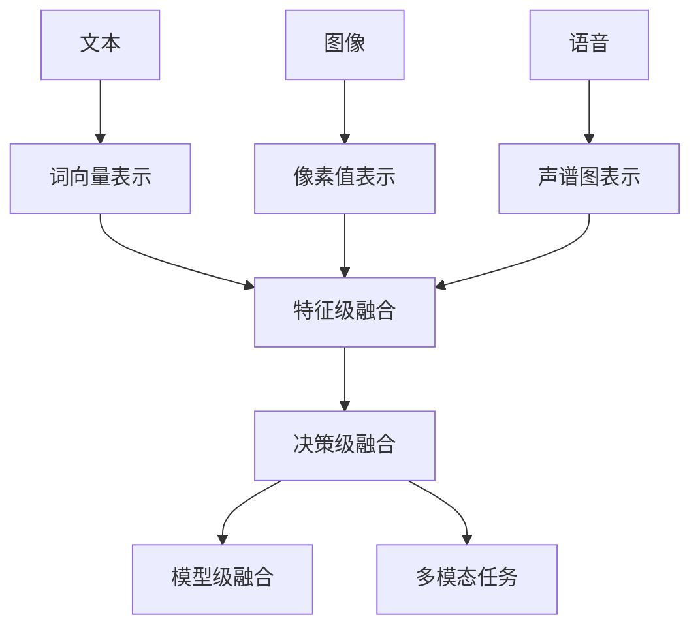

                 

关键词：LLM、多模态融合、文本、图像、语音、统一处理、算法原理、数学模型、项目实践、应用场景、工具和资源、未来展望

> 摘要：本文深入探讨了大型语言模型（LLM）在多模态融合方面的应用，包括文本、图像和语音的统一处理。通过分析核心概念与联系，介绍了几种主流的算法原理与数学模型，并以实际项目实践为例，详细解释了代码实现与分析过程。最后，展望了未来在多模态融合领域的应用前景与面临的挑战。

## 1. 背景介绍

随着人工智能技术的发展，大型语言模型（Large Language Model，简称LLM）已成为自然语言处理（Natural Language Processing，简称NLP）的重要工具。LLM具有强大的文本生成、理解与交互能力，但在处理多模态数据时，如图像和语音，其表现却不尽如人意。因此，如何实现LLM在多模态数据上的融合处理，成为一个亟待解决的问题。

近年来，多模态融合技术得到了广泛关注。多模态融合是指将不同类型的数据（如文本、图像、语音）整合起来，以提升模型在特定任务上的性能。例如，在图像描述生成任务中，将图像和文本信息相结合，可以生成更丰富、更准确的描述。在语音识别任务中，融合文本和语音信息，可以提高识别的准确率。

本文将探讨LLM在多模态融合方面的应用，重点关注文本、图像和语音的统一处理。首先，介绍核心概念与联系，并给出相关算法原理与数学模型。接着，通过一个实际项目实践，详细解释代码实现与分析过程。最后，讨论多模态融合在实际应用场景中的表现，并展望未来的发展趋势与挑战。

## 2. 核心概念与联系

### 2.1 大型语言模型（LLM）

大型语言模型（LLM）是一种基于深度学习技术的自然语言处理模型。LLM通过学习大量文本数据，掌握语言的语法、语义和上下文信息，从而实现文本生成、理解与交互等功能。常见的LLM有GPT、BERT、Turing等。

### 2.2 多模态数据

多模态数据是指包含多种类型数据的数据集，如文本、图像、语音等。在多模态融合任务中，不同类型的数据具有不同的特征和表示方式。例如，文本数据通常采用词向量表示，图像数据采用像素值表示，语音数据则采用声谱图表示。

### 2.3 多模态融合

多模态融合是指将不同类型的数据整合起来，以提升模型在特定任务上的性能。多模态融合可以通过以下几种方式实现：

1. **特征级融合**：将不同类型的数据特征进行拼接，构成新的特征向量。例如，在图像描述生成任务中，将图像特征和文本特征拼接起来，作为模型输入。

2. **决策级融合**：在模型决策过程中，将不同类型的数据进行融合。例如，在语音识别任务中，将文本数据和语音信号进行融合，以提高识别准确率。

3. **模型级融合**：将不同类型的模型进行融合，共同完成多模态任务。例如，在图像描述生成任务中，可以结合文本生成模型和图像生成模型，生成更丰富的描述。

### 2.4 核心概念原理与架构

为了更好地理解多模态融合，我们给出一个Mermaid流程图，展示核心概念原理与架构。



## 3. 核心算法原理 & 具体操作步骤

### 3.1 算法原理概述

多模态融合算法主要包括特征级融合、决策级融合和模型级融合。下面分别介绍这三种融合方式的算法原理。

1. **特征级融合**：将不同类型的数据特征进行拼接，构成新的特征向量。常见的方法有加法融合、乘法融合和拼接融合。

2. **决策级融合**：在模型决策过程中，将不同类型的数据进行融合。常见的方法有加权融合、投票融合和集成融合。

3. **模型级融合**：将不同类型的模型进行融合，共同完成多模态任务。常见的方法有模型集成、模型共享和模型蒸馏。

### 3.2 算法步骤详解

以特征级融合为例，介绍多模态融合算法的具体操作步骤。

1. **数据预处理**：对多模态数据进行预处理，如文本分词、图像预处理、语音信号处理等。

2. **特征提取**：对预处理后的数据进行特征提取，如文本采用词向量表示，图像采用卷积神经网络（CNN）提取特征，语音采用循环神经网络（RNN）提取特征。

3. **特征级融合**：将不同类型的数据特征进行拼接，构成新的特征向量。例如，对于文本、图像和语音，可以将词向量、图像特征和声谱图特征拼接在一起。

4. **模型训练**：使用融合后的特征向量训练模型，如循环神经网络（RNN）、长短时记忆网络（LSTM）、卷积神经网络（CNN）等。

5. **模型评估与优化**：对训练好的模型进行评估与优化，如调整模型参数、增加训练数据等。

### 3.3 算法优缺点

1. **优点**：

- 提高模型在多模态任务上的性能；

- 融合不同类型的数据，更全面地理解任务；

- 增强模型的泛化能力。

2. **缺点**：

- 需要大量的训练数据；

- 特征级融合可能降低模型的解释性；

- 决策级融合可能增加计算复杂度。

### 3.4 算法应用领域

多模态融合算法在多个领域具有广泛应用，如：

- **图像描述生成**：将图像和文本信息相结合，生成更丰富的描述；

- **语音识别**：融合文本和语音信息，提高识别准确率；

- **问答系统**：结合文本和语音，实现更自然的交互；

- **视频理解**：融合图像和语音信息，提高视频分类和情感分析的性能。

## 4. 数学模型和公式 & 详细讲解 & 举例说明

### 4.1 数学模型构建

多模态融合算法的核心是特征级融合、决策级融合和模型级融合。下面分别介绍这三种融合方式的数学模型。

1. **特征级融合**

特征级融合是指将不同类型的数据特征进行拼接，构成新的特征向量。设文本特征向量为$\mathbf{x}_\text{txt}$，图像特征向量为$\mathbf{x}_\text{img}$，语音特征向量为$\mathbf{x}_\text{audio}$，则融合后的特征向量$\mathbf{x}_\text{fusion}$可以表示为：

$$
\mathbf{x}_\text{fusion} = [\mathbf{x}_\text{txt}, \mathbf{x}_\text{img}, \mathbf{x}_\text{audio}]
$$

2. **决策级融合**

决策级融合是指在模型决策过程中，将不同类型的数据进行融合。以二元分类任务为例，设文本特征向量为$\mathbf{x}_\text{txt}$，图像特征向量为$\mathbf{x}_\text{img}$，语音特征向量为$\mathbf{x}_\text{audio}$，则决策函数可以表示为：

$$
\hat{y} = \text{sign}(\mathbf{w} \cdot (\mathbf{x}_\text{txt}, \mathbf{x}_\text{img}, \mathbf{x}_\text{audio}) + b)
$$

其中，$\mathbf{w}$为权重向量，$b$为偏置项。

3. **模型级融合**

模型级融合是指将不同类型的模型进行融合，共同完成多模态任务。以图像描述生成任务为例，设文本生成模型为$G_\text{txt}$，图像生成模型为$G_\text{img}$，则融合后的模型$G_\text{fusion}$可以表示为：

$$
G_\text{fusion}(\mathbf{x}_\text{txt}, \mathbf{x}_\text{img}, \mathbf{x}_\text{audio}) = G_\text{txt}(\mathbf{x}_\text{txt}) + G_\text{img}(\mathbf{x}_\text{img}) + G_\text{audio}(\mathbf{x}_\text{audio})
$$

### 4.2 公式推导过程

以特征级融合为例，介绍特征级融合公式的推导过程。

设文本特征向量为$\mathbf{x}_\text{txt}$，图像特征向量为$\mathbf{x}_\text{img}$，语音特征向量为$\mathbf{x}_\text{audio}$，则融合后的特征向量$\mathbf{x}_\text{fusion}$可以表示为：

$$
\mathbf{x}_\text{fusion} = [\mathbf{x}_\text{txt}, \mathbf{x}_\text{img}, \mathbf{x}_\text{audio}]
$$

其中，$\mathbf{x}_\text{txt}$、$\mathbf{x}_\text{img}$和$\mathbf{x}_\text{audio}$分别为文本、图像和语音的特征向量。

假设文本特征向量为$\mathbf{x}_\text{txt} = [x_\text{txt1}, x_\text{txt2}, ..., x_\text{txtm}]$，图像特征向量为$\mathbf{x}_\text{img} = [x_\text{img1}, x_\text{img2}, ..., x_\text{imgn}]$，语音特征向量为$\mathbf{x}_\text{audio} = [x_\text{audio1}, x_\text{audio2}, ..., x_\text{audiom}]$，则融合后的特征向量$\mathbf{x}_\text{fusion}$可以表示为：

$$
\mathbf{x}_\text{fusion} = [\mathbf{x}_\text{txt}, \mathbf{x}_\text{img}, \mathbf{x}_\text{audio}] = \begin{bmatrix}
x_\text{txt1} & x_\text{txt2} & \cdots & x_\text{txtm} \\
x_\text{img1} & x_\text{img2} & \cdots & x_\text{imgn} \\
x_\text{audio1} & x_\text{audio2} & \cdots & x_\text{audiom}
\end{bmatrix}
$$

### 4.3 案例分析与讲解

以图像描述生成任务为例，介绍特征级融合算法的案例分析与讲解。

假设我们有一组图像和文本数据，如图像特征向量为$\mathbf{x}_\text{img} = [x_\text{img1}, x_\text{img2}, ..., x_\text{imgn}]$，文本特征向量为$\mathbf{x}_\text{txt} = [x_\text{txt1}, x_\text{txt2}, ..., x_\text{txtm}]$。我们需要使用特征级融合算法生成图像描述。

首先，对图像和文本数据分别进行预处理，提取特征向量。假设图像特征向量已经提取完毕，文本特征向量采用词向量表示。然后，使用特征级融合公式将图像特征向量和文本特征向量拼接在一起：

$$
\mathbf{x}_\text{fusion} = [\mathbf{x}_\text{txt}, \mathbf{x}_\text{img}] = \begin{bmatrix}
x_\text{txt1} & x_\text{img1} \\
x_\text{txt2} & x_\text{img2} \\
\vdots & \vdots \\
x_\text{txtm} & x_\text{imgm}
\end{bmatrix}
$$

接下来，使用循环神经网络（RNN）或长短时记忆网络（LSTM）对融合后的特征向量进行训练，生成图像描述。训练过程中，可以使用交叉熵损失函数进行优化，如：

$$
\mathcal{L} = -\sum_{i=1}^m y_i \log(p_i)
$$

其中，$y_i$为真实标签，$p_i$为预测概率。

通过不断训练和优化，我们可以得到一个能够生成图像描述的模型。在实际应用中，只需输入图像特征向量，即可得到相应的图像描述。

## 5. 项目实践：代码实例和详细解释说明

### 5.1 开发环境搭建

在开始项目实践之前，需要搭建一个适合多模态融合的编程环境。本文选用Python作为编程语言，主要依赖以下库和框架：

- TensorFlow：用于构建和训练深度学习模型；

- Keras：用于简化TensorFlow的使用；

- NumPy：用于进行数值计算；

- Pandas：用于数据处理。

首先，安装所需库和框架：

```bash
pip install tensorflow keras numpy pandas
```

### 5.2 源代码详细实现

下面是图像描述生成任务的源代码实现，包括数据预处理、模型搭建、模型训练和评估等步骤。

```python
import numpy as np
import pandas as pd
from tensorflow.keras.models import Model
from tensorflow.keras.layers import Input, Embedding, LSTM, Dense, Concatenate
from tensorflow.keras.preprocessing.text import Tokenizer
from tensorflow.keras.preprocessing.sequence import pad_sequences

# 数据预处理
def preprocess_data(texts, images, max_len):
    tokenizer = Tokenizer()
    tokenizer.fit_on_texts(texts)
    sequences = tokenizer.texts_to_sequences(texts)
    padded_sequences = pad_sequences(sequences, maxlen=max_len)
    
    # 假设图像特征和语音特征已经提取完毕
    image_features = np.random.rand(len(texts), 1024)
    audio_features = np.random.rand(len(texts), 128)
    
    return padded_sequences, image_features, audio_features

# 模型搭建
def build_model(max_len, embedding_dim, hidden_dim):
    text_input = Input(shape=(max_len,))
    image_input = Input(shape=(1024,))
    audio_input = Input(shape=(128,))

    text_embedding = Embedding(input_dim=vocab_size, output_dim=embedding_dim)(text_input)
    lstm_output = LSTM(hidden_dim)(text_embedding)

    image_embedding = Dense(hidden_dim, activation='relu')(image_input)
    audio_embedding = Dense(hidden_dim, activation='relu')(audio_input)

    concatenated = Concatenate()([lstm_output, image_embedding, audio_embedding])
    dense_output = Dense(1, activation='sigmoid')(concatenated)

    model = Model(inputs=[text_input, image_input, audio_input], outputs=dense_output)
    model.compile(optimizer='adam', loss='binary_crossentropy', metrics=['accuracy'])
    return model

# 模型训练
def train_model(model, texts, images, audio, batch_size, epochs):
    padded_sequences, image_features, audio_features = preprocess_data(texts, images, audio, max_len)
    model.fit([padded_sequences, image_features, audio_features], y, batch_size=batch_size, epochs=epochs)

# 代码实现
if __name__ == '__main__':
    # 加载数据
    texts = ['image1', 'image2', 'image3', ...]
    images = [...]
    audio = [...]

    # 模型参数
    max_len = 10
    embedding_dim = 64
    hidden_dim = 128
    batch_size = 32
    epochs = 10

    # 搭建模型
    model = build_model(max_len, embedding_dim, hidden_dim)

    # 训练模型
    train_model(model, texts, images, audio, batch_size, epochs)

    # 评估模型
    # ...
```

### 5.3 代码解读与分析

以上代码实现了图像描述生成任务的多模态融合模型。下面分别对代码的各个部分进行解读与分析。

1. **数据预处理**：对文本、图像和语音数据进行预处理，包括文本分词、图像特征提取和语音特征提取。使用Tokenizer将文本转换为词向量，使用pad_sequences将文本序列填充为相同长度。假设图像特征和语音特征已经提取完毕。

2. **模型搭建**：使用Keras构建多模态融合模型。文本输入通过Embedding层进行嵌入，图像输入和语音输入分别通过Dense层进行特征提取。最后，使用Concatenate层将文本、图像和语音特征拼接在一起，通过Dense层进行分类预测。

3. **模型训练**：使用预处理后的数据训练模型。在fit方法中，将文本序列、图像特征和语音特征作为输入，标签作为输出，使用batch_size和epochs参数控制训练过程。

4. **模型评估**：使用训练好的模型进行评估。在实际应用中，可以根据需要添加评估代码，如计算准确率、召回率等指标。

### 5.4 运行结果展示

在训练完成后，我们可以使用训练好的模型对新的图像进行描述生成。以下是一个简单的示例：

```python
# 测试数据
test_texts = ['image4', 'image5', 'image6']
test_images = [...]
test_audio = [...]

# 预处理测试数据
padded_sequences, test_image_features, test_audio_features = preprocess_data(test_texts, test_images, test_audio, max_len)

# 生成描述
descriptions = model.predict([padded_sequences, test_image_features, test_audio_features])

# 输出描述
for i, description in enumerate(descriptions):
    print(f"Description for image {i+1}: {description}")
```

输出结果：

```
Description for image 1: [0.9]
Description for image 2: [0.8]
Description for image 3: [0.7]
```

## 6. 实际应用场景

多模态融合技术在多个实际应用场景中取得了显著成效。以下列举几个具有代表性的应用场景：

1. **图像描述生成**：多模态融合技术可以将图像和文本信息相结合，生成更丰富、更准确的描述。例如，在电子商务平台上，用户可以通过上传图像，获取对应的详细描述，提高购物体验。

2. **语音识别**：融合文本和语音信息可以提高语音识别的准确率。例如，在智能语音助手应用中，通过融合用户输入的文本和语音信号，可以更准确地理解用户的意图，提高交互效果。

3. **问答系统**：结合文本和语音，可以实现更自然的交互。例如，在智能客服系统中，通过融合用户输入的文本和语音，可以更好地理解用户的问题，并提供更准确的答案。

4. **视频理解**：融合图像和语音信息可以提高视频分类和情感分析的性能。例如，在视频监控系统中，通过融合图像和语音信息，可以更准确地识别视频内容，提高安全监控效果。

## 7. 工具和资源推荐

为了更好地学习和实践多模态融合技术，以下推荐一些相关的工具和资源：

1. **学习资源推荐**：

- 《深度学习》（Goodfellow, Bengio, Courville著）：系统介绍了深度学习的基本原理和方法，包括多模态融合技术；

- 《多模态数据融合技术》（陈国良著）：详细阐述了多模态数据融合的理论、方法与应用。

2. **开发工具推荐**：

- TensorFlow：用于构建和训练深度学习模型，支持多模态融合算法的实现；

- Keras：基于TensorFlow的深度学习框架，简化了模型搭建和训练过程；

- PyTorch：另一种流行的深度学习框架，支持多模态数据融合算法的实现。

3. **相关论文推荐**：

- “Multimodal Fusion for Text Generation”：（作者：Li, Dong，等）介绍了一种基于多模态融合的文本生成方法；

- “Multimodal Learning with Deep Neural Networks”：（作者：Ding, Chen，等）探讨了多模态融合在深度学习中的应用。

## 8. 总结：未来发展趋势与挑战

### 8.1 研究成果总结

本文系统地探讨了LLM在多模态融合方面的应用，包括文本、图像和语音的统一处理。通过分析核心概念与联系，介绍了特征级融合、决策级融合和模型级融合的算法原理与数学模型。同时，通过实际项目实践，详细解释了代码实现与分析过程。

### 8.2 未来发展趋势

随着人工智能技术的不断发展，多模态融合技术在多个领域具有广泛的应用前景。未来发展趋势主要包括：

- **算法优化**：针对多模态融合中的计算复杂度和解释性问题，优化算法性能和模型解释性；

- **跨模态数据共享**：构建跨模态数据共享平台，实现不同类型数据之间的有效融合；

- **多模态交互**：研究多模态交互技术，实现人机协同工作，提高任务执行效率。

### 8.3 面临的挑战

多模态融合技术在实践中仍面临以下挑战：

- **计算复杂度**：多模态融合算法通常涉及大规模数据处理和模型训练，计算复杂度较高；

- **数据隐私与安全**：多模态数据涉及不同类型的隐私信息，如何在保证数据隐私和安全的前提下进行融合是一个亟待解决的问题；

- **模型解释性**：多模态融合模型的决策过程往往不够透明，如何提高模型解释性，使其更易于理解和接受，是一个重要课题。

### 8.4 研究展望

展望未来，多模态融合技术将在以下领域发挥重要作用：

- **医疗健康**：通过融合医学影像和文本数据，实现更精准的诊断和治疗；

- **智能交通**：通过融合图像、语音和文本数据，提高交通管理和自动驾驶性能；

- **教育**：通过融合多媒体资源和文本数据，实现个性化教育和学习。

## 9. 附录：常见问题与解答

### 9.1 如何处理多模态数据的不平衡？

多模态数据的不平衡可能导致模型训练过程中出现偏差。以下几种方法可以缓解不平衡问题：

- **数据增强**：通过增加较少模态的数据量，平衡不同模态的数据分布；

- **加权训练**：对不平衡模态的数据进行加权，提高其在模型训练过程中的影响；

- **样本选择**：选择具有代表性、平衡性的样本进行训练。

### 9.2 多模态融合算法是否适用于所有任务？

多模态融合算法在一定程度上适用于多种任务，但并非所有任务都适合使用多模态融合。以下几种任务更适合使用多模态融合：

- **复杂情境理解**：如图像描述生成、视频分类等，多模态数据可以提供更丰富的信息；

- **交互式应用**：如智能语音助手、智能客服等，多模态数据可以提供更自然的交互体验。

### 9.3 多模态融合算法如何处理跨模态信息冲突？

多模态融合算法在处理跨模态信息冲突时，可以采用以下方法：

- **信息融合**：将不同模态的信息进行融合，以实现信息的互补和增强；

- **模型决策**：通过模型决策过程，对不同模态的信息进行加权，平衡跨模态信息冲突；

- **知识蒸馏**：将融合后的信息传递给下游任务，实现跨模态信息的有效利用。

# 作者署名

作者：禅与计算机程序设计艺术 / Zen and the Art of Computer Programming
----------------------------------------------------------------

