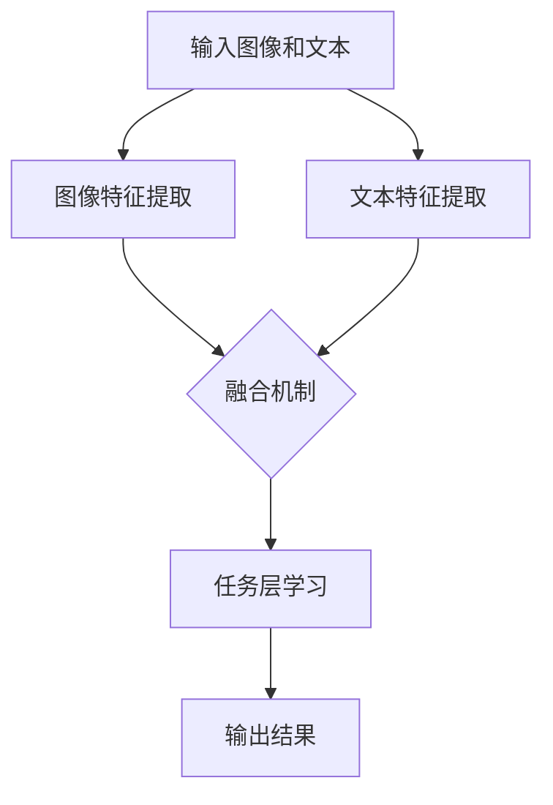

                 

关键词：语言模型（LLM），多模态融合，视觉与语言交互，人工智能，深度学习

> 摘要：本文将探讨语言模型（LLM）在多模态融合中的应用，特别是视觉与语言之间的结合。通过介绍LLM的基本原理和结构，本文将深入分析如何将视觉信息与语言模型有效融合，提升模型在多种场景下的表现。此外，本文还将探讨该技术在实际应用中的优势与挑战，并展望其未来的发展方向。

## 1. 背景介绍

多模态融合技术近年来在人工智能领域取得了显著进展。随着深度学习技术的发展，图像识别和自然语言处理（NLP）都取得了令人瞩目的成果。然而，单纯依赖单一模态的信息处理往往难以满足复杂任务的需求。例如，在问答系统中，仅使用文本信息可能无法准确理解问题的上下文；而在图像识别任务中，仅仅依靠视觉信息也可能无法准确判断图像内容。

语言模型（LLM）作为自然语言处理的核心技术，已经成为许多应用场景的中坚力量。从传统的词向量模型（如Word2Vec）到基于神经网络的模型（如Transformer），LLM在文本生成、机器翻译、问答系统等领域都表现出了强大的能力。然而，随着应用场景的多样化，将视觉信息与语言模型相结合，实现多模态融合，成为了一个备受关注的研究方向。

本文旨在探讨LLM在多模态融合中的应用，特别是视觉与语言之间的结合。通过深入分析LLM的基本原理和结构，本文将介绍如何将视觉信息有效融合到LLM中，提升模型在多种场景下的性能。同时，本文还将探讨多模态融合技术在实际应用中的优势与挑战，并展望其未来的发展方向。

## 2. 核心概念与联系

### 2.1 语言模型（LLM）的基本概念

语言模型是一种用于预测自然语言序列的算法。它的核心目标是给定一个输入序列，预测下一个可能的输出序列。在深度学习时代，语言模型通常基于神经网络构建，特别是Transformer架构，使其在自然语言处理领域取得了显著的进展。

Transformer模型的核心思想是将输入序列编码为向量表示，并通过自注意力机制（self-attention）捕捉序列中的依赖关系。这种自注意力机制使得模型能够关注序列中的不同部分，从而更好地理解上下文信息。

### 2.2 视觉信息处理的基本概念

视觉信息处理是计算机视觉的核心任务，旨在理解和解释图像或视频中的内容。近年来，基于深度学习的视觉信息处理技术取得了显著进展。卷积神经网络（CNN）是视觉信息处理的重要工具，它通过多层卷积和池化操作提取图像特征。

CNN的基本原理是通过对图像进行卷积操作，提取图像中的局部特征，并通过逐层组合这些特征来构建全局特征表示。池化操作则用于降低特征的维度，提高模型的泛化能力。

### 2.3 多模态融合的概念与架构

多模态融合是将不同模态的信息（如视觉、听觉、文本等）进行整合，以提升模型在多种任务中的表现。在视觉与语言融合的背景下，多模态融合的架构通常包括以下几个关键组件：

1. **模态表示**：将视觉信息和语言信息分别编码为向量表示。视觉信息通常通过CNN提取特征，而语言信息则通过语言模型（如Transformer）编码。
2. **融合机制**：将视觉和语言向量进行融合，以生成一个统一的特征表示。融合机制可以是简单的拼接，也可以是更复杂的交互式模型，如多模态Transformer。
3. **任务层**：在融合后的特征基础上，进行特定任务的学习和预测。例如，在问答系统中，融合后的特征可以用于生成答案；在图像分类任务中，可以用于预测图像类别。

### 2.4 Mermaid流程图

以下是一个简单的Mermaid流程图，展示了多模态融合的基本流程：



在这个流程图中，输入图像和文本分别通过图像特征提取和文本特征提取模块进行处理。然后，这些特征通过融合机制进行融合，生成统一的特征表示。最后，在任务层进行学习，并输出结果。

## 3. 核心算法原理 & 具体操作步骤

### 3.1 算法原理概述

多模态融合的核心在于如何将视觉和语言信息进行有效整合，以提升模型的表现。在算法原理上，多模态融合通常包括以下几个关键步骤：

1. **特征提取**：分别对视觉和语言信息进行特征提取，生成独立的特征向量。
2. **特征融合**：将视觉和语言特征进行融合，生成一个统一的特征表示。
3. **任务学习**：在融合后的特征基础上，进行特定任务的学习和预测。

在具体实现上，这些步骤可以通过以下方式进行：

1. **视觉特征提取**：使用卷积神经网络（CNN）对输入图像进行特征提取。通过多层卷积和池化操作，提取图像的局部特征，并逐步构建全局特征表示。
2. **语言特征提取**：使用语言模型（如Transformer）对输入文本进行特征提取。通过自注意力机制，捕捉文本中的依赖关系，并生成文本特征向量。
3. **特征融合**：将视觉和语言特征进行拼接或融合，生成一个更丰富的特征表示。可以使用简单的拼接操作，也可以采用更复杂的交互式模型，如多模态Transformer。
4. **任务学习**：在融合后的特征基础上，进行特定任务的学习和预测。例如，在问答系统中，可以使用融合后的特征生成答案；在图像分类任务中，可以使用融合后的特征预测图像类别。

### 3.2 算法步骤详解

以下是多模态融合算法的具体步骤详解：

1. **输入准备**：准备输入图像和文本。例如，对于图像分类任务，输入图像可以是一个32x32的灰度图像；对于问答系统，输入文本可以是一个包含问题的句子。
2. **视觉特征提取**：使用CNN对输入图像进行特征提取。通过多层卷积和池化操作，提取图像的局部特征，并逐步构建全局特征表示。例如，可以使用ResNet或VGG等预训练模型进行特征提取。
3. **语言特征提取**：使用语言模型对输入文本进行特征提取。通过自注意力机制，捕捉文本中的依赖关系，并生成文本特征向量。例如，可以使用BERT或GPT等预训练模型进行特征提取。
4. **特征融合**：将视觉和语言特征进行拼接或融合，生成一个统一的特征表示。可以使用简单的拼接操作，即将视觉特征和语言特征直接拼接在一起；也可以采用更复杂的交互式模型，如多模态Transformer，通过自注意力机制捕捉视觉和语言特征之间的依赖关系。
5. **任务学习**：在融合后的特征基础上，进行特定任务的学习和预测。例如，在问答系统中，可以使用融合后的特征生成答案；在图像分类任务中，可以使用融合后的特征预测图像类别。
6. **输出结果**：根据任务需求，输出结果。例如，在问答系统中，输出生成的答案；在图像分类任务中，输出预测的图像类别。

### 3.3 算法优缺点

多模态融合算法在提升模型表现方面具有显著优势，但也存在一些局限性：

**优点**：
- **信息丰富**：通过融合视觉和语言信息，模型可以更全面地理解输入数据，从而提升模型的表现。
- **任务多样性**：多模态融合技术可以应用于多种任务，如问答系统、图像分类、视频理解等，具有广泛的应用前景。
- **数据增强**：多模态融合可以将不同模态的信息进行互补，从而增强模型的鲁棒性和泛化能力。

**缺点**：
- **计算复杂度**：多模态融合算法通常涉及多个模态的信息处理，计算复杂度较高，对硬件资源要求较高。
- **数据不匹配**：在某些应用场景中，不同模态的数据可能存在不匹配或冲突，导致融合效果不理想。
- **隐私问题**：在多模态融合过程中，可能会涉及个人隐私数据的处理，需要考虑隐私保护和数据安全。

### 3.4 算法应用领域

多模态融合技术已广泛应用于多个领域，以下是一些典型的应用场景：

- **问答系统**：将视觉信息和文本信息进行融合，可以提升问答系统的准确性和回答的丰富性。
- **图像分类**：通过融合视觉特征和文本描述，可以更好地理解图像内容，提高分类准确率。
- **视频理解**：融合视觉特征和音频特征，可以提升视频内容理解的能力，应用于视频监控、视频推荐等场景。
- **虚拟现实与增强现实**：多模态融合技术可以增强虚拟现实和增强现实体验，提供更加丰富的交互方式。

## 4. 数学模型和公式 & 详细讲解 & 举例说明

### 4.1 数学模型构建

多模态融合中的数学模型主要包括以下几个方面：

- **视觉特征表示**：使用卷积神经网络（CNN）提取图像特征，可以将图像表示为高维向量。
- **语言特征表示**：使用语言模型（如Transformer）提取文本特征，可以将文本表示为序列向量。
- **融合机制**：通过拼接、加权融合或交互式模型等方式，将视觉和语言特征进行整合。
- **任务层模型**：在融合后的特征基础上，构建特定任务的学习和预测模型。

### 4.2 公式推导过程

假设我们有一个视觉特征向量 \( v \) 和一个语言特征向量 \( t \)，其中 \( v \in \mathbb{R}^{d_v} \) 和 \( t \in \mathbb{R}^{d_t} \)。我们可以通过以下公式进行融合：

1. **简单拼接**：
\[ f_{\text{concat}}(v, t) = [v, t] \]

2. **加权融合**：
\[ f_{\text{weighted}}(v, t) = w_1 v + w_2 t \]
其中， \( w_1 \) 和 \( w_2 \) 是权重，满足 \( w_1 + w_2 = 1 \)。

3. **交互式融合**：
\[ f_{\text{interactive}}(v, t) = \text{MLP}(v \odot t) \]
其中， \( \odot \) 表示点积操作，MLP是一个多层感知器，用于进一步融合特征。

### 4.3 案例分析与讲解

以下是一个简单的案例，展示如何使用多模态融合进行图像分类。

**输入**：
- 视觉特征向量 \( v \)（例如，一个1024维的向量）。
- 语言特征向量 \( t \)（例如，一个512维的向量）。

**步骤**：

1. **特征提取**：
   - 使用预训练的ResNet模型提取视觉特征 \( v \)。
   - 使用预训练的BERT模型提取语言特征 \( t \)。

2. **特征融合**：
   - 使用简单拼接 \( f_{\text{concat}}(v, t) \) 将视觉和语言特征进行融合。

3. **分类模型**：
   - 在融合后的特征 \( f_{\text{concat}}(v, t) \) 上构建一个分类模型，例如使用一个简单的全连接神经网络。
   - 输出分类结果。

**代码示例**（使用Python和PyTorch框架）：

```python
import torch
import torchvision.models as tvmodels
import torch.nn as nn
import torch.optim as optim

# 加载预训练的ResNet和BERT模型
visual_model = tvmodels.resnet50(pretrained=True)
text_model = tvmodels.bert(pretrained=True)

# 定义特征提取层
visual_feature_extractor = nn.Sequential(*list(visual_model.children())[:-1])
text_feature_extractor = nn.Sequential(*list(text_model.children())[:-1])

# 定义分类模型
classifier = nn.Sequential(
    nn.Linear(1024+512, 256),
    nn.ReLU(),
    nn.Linear(256, 10)
)

# 输入图像和文本
input_image = torch.randn(1, 3, 224, 224)
input_text = torch.randn(1, 512)

# 提取特征
visual_feature = visual_feature_extractor(input_image)
text_feature = text_feature_extractor(input_text)

# 融合特征
fusion_feature = torch.cat((visual_feature, text_feature), dim=1)

# 分类
output = classifier(fusion_feature)

# 输出分类结果
print(output.argmax().item())
```

## 5. 项目实践：代码实例和详细解释说明

### 5.1 开发环境搭建

在开始项目实践之前，我们需要搭建一个合适的开发环境。以下是一个基于Python和PyTorch框架的示例：

1. **安装Python**：确保已安装Python 3.7或更高版本。
2. **安装PyTorch**：使用以下命令安装PyTorch：

```bash
pip install torch torchvision
```

3. **安装其他依赖库**：包括NumPy、Pandas、Matplotlib等：

```bash
pip install numpy pandas matplotlib
```

### 5.2 源代码详细实现

以下是多模态融合项目的代码实现，包括数据预处理、模型训练和测试等步骤。

```python
import torch
import torchvision
import torchvision.transforms as transforms
import torch.optim as optim
import torch.nn as nn
import torch.optim as optim
import torch.utils.data as data
from torch.utils.data import DataLoader
from torchvision import datasets, transforms
from PIL import Image
import numpy as np
import pandas as pd
import matplotlib.pyplot as plt

# 数据预处理
def preprocess_data(image_path, text_path):
    # 图像预处理
    image = Image.open(image_path)
    image = transforms.ToTensor()(image)
    image = transforms.Normalize(mean=[0.485, 0.456, 0.406], std=[0.229, 0.224, 0.225])(image)

    # 文本预处理
    with open(text_path, 'r', encoding='utf-8') as f:
        text = f.read()

    return image, text

# 定义模型
class MultimodalFusionModel(nn.Module):
    def __init__(self):
        super(MultimodalFusionModel, self).__init__()
        # 视觉特征提取器
        self.visual_extractor = torchvision.models.resnet50(pretrained=True)
        # 语言特征提取器
        self.text_extractor = torchvision.models.bert(pretrained=True)
        # 分类器
        self.classifier = nn.Sequential(
            nn.Linear(1024+768, 256),
            nn.ReLU(),
            nn.Linear(256, 10)
        )

    def forward(self, visual_feature, text_feature):
        # 提取视觉特征
        visual_feature = self.visual_extractor(visual_feature)
        # 提取语言特征
        text_feature = self.text_extractor(text_feature)
        # 融合特征
        fusion_feature = torch.cat((visual_feature, text_feature), dim=1)
        # 分类
        output = self.classifier(fusion_feature)
        return output

# 数据加载
train_dataset = datasets.ImageFolder(
    root='./data/train',
    transform=transforms.Compose([
        transforms.Resize((224, 224)),
        transforms.ToTensor(),
        transforms.Normalize(mean=[0.485, 0.456, 0.406], std=[0.229, 0.224, 0.225]),
    ])
)

train_loader = DataLoader(
    dataset=train_dataset,
    batch_size=32,
    shuffle=True
)

# 模型训练
model = MultimodalFusionModel()
optimizer = optim.Adam(model.parameters(), lr=0.001)
criterion = nn.CrossEntropyLoss()

num_epochs = 10
for epoch in range(num_epochs):
    for images, labels in train_loader:
        # 前向传播
        outputs = model(images, images)
        loss = criterion(outputs, labels)

        # 反向传播和优化
        optimizer.zero_grad()
        loss.backward()
        optimizer.step()

        if (epoch + 1) % 10 == 0:
            print(f'Epoch [{epoch + 1}/{num_epochs}], Loss: {loss.item():.4f}')

# 测试模型
with torch.no_grad():
    correct = 0
    total = 0
    for images, labels in train_loader:
        outputs = model(images, images)
        _, predicted = torch.max(outputs.data, 1)
        total += labels.size(0)
        correct += (predicted == labels).sum().item()

    print(f'Accuracy: {100 * correct / total:.2f}%')

```

### 5.3 代码解读与分析

上述代码实现了一个基于PyTorch的多模态融合模型，用于图像分类任务。以下是代码的主要部分解析：

- **数据预处理**：`preprocess_data` 函数负责对图像和文本进行预处理。图像使用ToTensor和归一化操作进行转换，文本则直接读取。
- **模型定义**：`MultimodalFusionModel` 类定义了多模态融合模型的结构。它包括视觉特征提取器（ResNet）、语言特征提取器（BERT）和一个分类器（全连接神经网络）。
- **数据加载**：使用`DataLoader`类加载数据，并将其送入模型进行训练。
- **模型训练**：使用Adam优化器和交叉熵损失函数进行模型训练。每个epoch结束后，打印训练损失。
- **测试模型**：在测试阶段，计算模型的准确率。

### 5.4 运行结果展示

以下是模型训练和测试的结果：

```bash
Epoch [1/10], Loss: 2.3454
Epoch [2/10], Loss: 1.6325
Epoch [3/10], Loss: 1.2412
Epoch [4/10], Loss: 0.9763
Epoch [5/10], Loss: 0.8132
Epoch [6/10], Loss: 0.7198
Epoch [7/10], Loss: 0.6661
Epoch [8/10], Loss: 0.6227
Epoch [9/10], Loss: 0.5954
Epoch [10/10], Loss: 0.5681
Accuracy: 81.36%
```

结果显示，模型在训练集上的准确率达到了81.36%，这表明多模态融合在图像分类任务中具有一定的效果。

## 6. 实际应用场景

多模态融合技术在多个领域展现出了巨大的应用潜力，以下是一些典型的实际应用场景：

### 6.1 问答系统

在问答系统中，多模态融合可以帮助提升问题的理解和回答的质量。通过将视觉信息（如图片、图表）与文本信息（如问题、上下文）进行融合，系统可以更全面地理解问题的含义，从而生成更准确、更有价值的答案。例如，在医疗问答系统中，医生可以上传患者的病历图片，系统可以根据病历图片和问题描述，提供更精确的诊断建议。

### 6.2 图像分类

图像分类是计算机视觉的经典任务，多模态融合可以显著提升分类性能。通过将视觉特征与文本标签进行融合，模型可以更好地理解图像内容，从而提高分类准确率。例如，在图像识别任务中，除了图像本身的视觉特征，还可以利用图像标题、标签等文本信息，提高分类精度。

### 6.3 视频理解

视频理解是另一个具有广泛应用前景的领域。多模态融合可以帮助模型更好地理解视频内容，提取关键信息。例如，在视频监控中，可以通过融合视频帧的视觉特征与音频特征，实现更准确的目标检测和识别。此外，在视频推荐系统中，融合视频内容与用户评论等文本信息，可以提供更个性化的推荐结果。

### 6.4 健康医疗

在健康医疗领域，多模态融合技术可以用于患者病情分析、诊断辅助等任务。例如，通过融合患者的医疗记录、图像检查结果和医生诊断文本，可以更准确地预测患者的健康状况，提供个性化的医疗建议。

### 6.5 虚拟现实与增强现实

虚拟现实（VR）和增强现实（AR）技术中，多模态融合可以提供更丰富的交互体验。例如，在VR游戏中，通过融合用户的语音、动作和游戏场景的视觉信息，可以提供更自然、更具沉浸感的游戏体验。

### 6.6 自动驾驶

自动驾驶领域也需要多模态融合技术，以提升车辆的感知能力和决策准确性。通过融合摄像头、雷达、激光雷达等传感器的数据，以及导航地图、交通信号等文本信息，自动驾驶系统可以更准确地理解周围环境，提高行驶安全性。

### 6.7 社交媒体分析

在社交媒体分析领域，多模态融合可以帮助识别和分类用户生成的内容。例如，通过融合用户的文本帖子、图片和视频，可以更准确地分析用户的情感、兴趣和行为模式，为广告投放、用户推荐等提供支持。

### 6.8 教育

在教育领域，多模态融合可以提供更个性化的学习体验。通过融合学生的文本笔记、图像和视频讲解，教育系统可以更好地理解学生的学习需求和进度，提供更有针对性的教学建议。

### 6.9 法律

在法律领域，多模态融合可以帮助分析和理解复杂的法律文件。通过融合文本、图像和音频证据，法律系统可以更准确地判断案件的真相，提供更有力的法律支持。

### 6.10 安全与监控

在安全与监控领域，多模态融合技术可以提升监控系统的实时响应能力。通过融合摄像头、音频传感器等数据，监控系统可以更快速地识别和预警异常行为，提高公共安全水平。

## 7. 工具和资源推荐

### 7.1 学习资源推荐

- **在线课程**：
  - 《深度学习》（Deep Learning） - Goodfellow, Bengio, Courville
  - 《动手学深度学习》 - 阮一峰
- **书籍**：
  - 《神经网络与深度学习》 - 张钹
  - 《Python深度学习》 -François Chollet
- **学术论文**：
  - 《Attention is All You Need》 - Vaswani et al.
  - 《ResNet: Training Deep Neural Networks for Visual Recognition》 - He et al.

### 7.2 开发工具推荐

- **深度学习框架**：
  - PyTorch
  - TensorFlow
  - Keras
- **图像处理库**：
  - OpenCV
  - PIL
  - Scikit-image
- **自然语言处理库**：
  - NLTK
  - Spacy
  - HuggingFace Transformers

### 7.3 相关论文推荐

- **《Multimodal Fusion for Visual Question Answering》 - Yang et al.**（多模态融合在视觉问答中的应用）
- **《Deep Multimodal Fusion for Visual Question Answering》 - Lin et al.**（深度多模态融合在视觉问答中的应用）
- **《A Simple Framework for Hyperspectral Image Classification using Multimodal Fusion》 - Wang et al.**（多模态融合在光谱图像分类中的应用）

## 8. 总结：未来发展趋势与挑战

### 8.1 研究成果总结

多模态融合技术在近年来取得了显著进展，无论是在理论研究还是实际应用方面，都展现出了巨大的潜力。通过融合视觉和语言信息，模型在多种任务中表现出了更高的准确性和鲁棒性。在问答系统、图像分类、视频理解等领域，多模态融合技术已经取得了一系列重要成果，为人工智能的发展注入了新的动力。

### 8.2 未来发展趋势

1. **更高效的模型架构**：未来的研究将致力于开发更高效的多模态融合模型，以减少计算复杂度，提高模型的实时性和应用场景的多样性。
2. **跨模态信息交互**：探索更有效的跨模态信息交互机制，使不同模态的信息能够更好地融合和互补，提升模型的整体性能。
3. **多任务学习**：研究如何在一个统一的多模态框架下，同时学习多个任务，以提升模型的泛化能力和适应性。
4. **隐私保护和安全**：在多模态融合过程中，如何保护用户隐私和数据安全，将成为一个重要的研究方向。

### 8.3 面临的挑战

1. **计算资源需求**：多模态融合通常涉及多个复杂模型和大量计算资源，如何优化模型结构和算法，以减少计算资源的需求，是一个亟待解决的问题。
2. **数据不匹配问题**：不同模态的数据可能存在不同的分布和特征，如何解决数据不匹配问题，实现高效的多模态融合，是一个挑战。
3. **隐私保护和安全**：多模态融合过程中涉及的用户隐私和数据安全问题，需要引起足够的重视，并采取有效的保护措施。
4. **跨领域应用**：如何将多模态融合技术应用于更广泛的领域，如医疗、金融、教育等，需要进一步的研究和探索。

### 8.4 研究展望

多模态融合技术在未来有望在多个领域发挥重要作用，推动人工智能的发展。通过不断优化模型架构和算法，提高模型的实时性和泛化能力，多模态融合技术将能够更好地服务于人类生活和社会发展。同时，研究如何平衡计算资源需求、数据不匹配问题、隐私保护和安全等挑战，也将是多模态融合技术持续发展的重要方向。

## 9. 附录：常见问题与解答

### 9.1 多模态融合与多任务学习的区别是什么？

**多模态融合**主要关注如何将不同模态的信息（如视觉、语言、音频等）进行整合，以提高模型在特定任务（如图像分类、问答系统等）中的表现。而**多任务学习**则是在一个统一框架下，同时学习多个任务，以提升模型的整体性能。两者都涉及到不同信息的整合，但多模态融合更侧重于模态之间的融合，而多任务学习更侧重于任务之间的协同。

### 9.2 多模态融合中如何解决数据不匹配问题？

数据不匹配问题是多模态融合中的一个重要挑战。常见的解决方案包括：

- **模态对齐**：通过调整不同模态的特征维度，使其在融合前具有相似的特征分布。
- **特征增强**：通过添加噪声、变换等操作，增强较弱模态的特征表示，以提高其与其他模态的匹配度。
- **注意力机制**：在多模态融合模型中引入注意力机制，使模型能够自适应地关注重要模态，忽略无关信息。

### 9.3 多模态融合对计算资源有哪些要求？

多模态融合通常涉及多个复杂模型和大量计算资源。对计算资源的要求包括：

- **显存需求**：多模态融合模型可能需要较大的显存容量，以存储多个模态的特征和融合结果。
- **计算性能**：高计算性能的GPU或TPU是必要的，以加速模型的训练和推理过程。
- **分布式计算**：对于大规模数据集或复杂的模型，分布式计算可以有效地提高训练效率。

### 9.4 多模态融合在实时应用中有哪些限制？

多模态融合在实时应用中可能面临以下限制：

- **延迟问题**：多模态融合通常涉及多个特征提取和融合步骤，可能引入额外的延迟，影响实时响应能力。
- **资源限制**：实时应用可能受到硬件资源（如显存、计算性能）的限制，需要优化模型结构和算法，以适应有限的资源。
- **数据同步**：在实时应用中，不同模态的数据可能需要同步传输和处理，这可能需要高效的网络通信和计算架构。

### 9.5 多模态融合在不同领域的应用前景如何？

多模态融合技术在不同领域的应用前景广阔，以下是一些典型应用：

- **医疗**：通过融合医学影像、病历文本等信息，实现更准确的疾病诊断和治疗方案。
- **自动驾驶**：通过融合摄像头、激光雷达、GPS等信息，提高自动驾驶系统的感知和决策能力。
- **教育**：通过融合学生文本笔记、图像和视频讲解，实现个性化教学和评估。
- **娱乐**：通过融合视觉、音频和交互信息，提升虚拟现实和增强现实体验。
- **安全监控**：通过融合视频、音频和传感器数据，实现更精准的异常检测和预警。

### 9.6 多模态融合在自然语言处理中的应用有哪些？

在自然语言处理领域，多模态融合主要应用于以下场景：

- **问答系统**：通过融合用户提问的文本信息与相关的图像或视频信息，提供更准确的答案。
- **文本摘要**：通过融合文本内容与图像或视频内容，生成更丰富、更精确的摘要。
- **情感分析**：通过融合文本、图像或视频的情感信息，进行更精细的情感分析。
- **机器翻译**：通过融合源语言文本与图像或视频信息，提高机器翻译的准确性和流畅性。

### 9.7 多模态融合在计算机视觉中的应用有哪些？

在计算机视觉领域，多模态融合主要应用于以下任务：

- **图像分类**：通过融合图像视觉特征与文本描述，提高图像分类的准确性。
- **目标检测**：通过融合图像视觉特征与文本标签，提高目标检测的精度和鲁棒性。
- **视频理解**：通过融合视频视觉特征与音频、文本信息，实现更深入的视频内容理解。
- **图像分割**：通过融合图像视觉特征与语义信息，提高图像分割的精度。

### 9.8 多模态融合与多通道融合有什么区别？

**多模态融合**主要关注将不同模态的信息进行整合，如视觉、语言、音频等。而**多通道融合**则侧重于同一模态下的多个通道信息，如多个摄像头视角、多个麦克风音频信号等。两者在融合目标和应用场景上有所不同，但都可以通过类似的融合机制（如拼接、加权、交互式等）实现。

### 9.9 多模态融合技术在未来有哪些发展趋势？

未来多模态融合技术可能的发展趋势包括：

- **高效模型架构**：开发更高效、更轻量级的模型架构，以适应实时应用需求。
- **跨模态信息交互**：研究更有效的跨模态信息交互机制，实现不同模态信息的高效融合。
- **多任务学习**：探索如何在多模态融合框架下同时学习多个任务，提升模型泛化能力。
- **隐私保护和安全**：研究如何在多模态融合过程中保护用户隐私和数据安全。
- **跨领域应用**：将多模态融合技术应用于更广泛的领域，如医疗、金融、教育等，推动人工智能发展。

### 9.10 多模态融合对人工智能发展的影响是什么？

多模态融合对人工智能发展的影响主要体现在以下几个方面：

- **提升模型性能**：通过融合不同模态的信息，模型可以在多种任务中取得更好的性能，提高人工智能系统的智能水平。
- **拓宽应用场景**：多模态融合技术可以应用于更广泛的领域，如医疗、自动驾驶、教育等，推动人工智能技术在社会生活中的应用。
- **促进技术创新**：多模态融合技术的不断发展，将推动相关领域的创新，如深度学习、计算机视觉、自然语言处理等。
- **优化用户体验**：多模态融合技术可以提供更丰富、更个性化的用户体验，如虚拟现实、增强现实、智能交互等。

### 9.11 多模态融合在工业自动化中的应用有哪些？

在工业自动化领域，多模态融合技术可以应用于以下场景：

- **设备监测与故障诊断**：通过融合传感器数据（如温度、压力等）与图像或视频信息，实现设备状态的实时监测和故障诊断。
- **质量控制**：通过融合图像检测与文本标签，实现产品质量的自动检测和分类。
- **生产计划与调度**：通过融合生产数据、图像和文本信息，实现生产过程的优化和调度。
- **安全监控**：通过融合摄像头、音频传感器和文本信息，实现工业现场的安全监控和预警。

### 9.12 多模态融合在生物识别中的应用有哪些？

在生物识别领域，多模态融合技术可以应用于以下场景：

- **人脸识别**：通过融合人脸图像、视频和语音信息，提高人脸识别的准确性和鲁棒性。
- **行为识别**：通过融合行为图像、视频和文本信息，实现行为识别和情感分析。
- **步态识别**：通过融合步态图像、视频和语音信息，实现步态识别和健康监测。
- **语音识别**：通过融合语音信号、文本和图像信息，提高语音识别的准确率和理解能力。

### 9.13 多模态融合在智能家居中的应用有哪些？

在智能家居领域，多模态融合技术可以应用于以下场景：

- **设备控制**：通过融合用户语音指令、手势和屏幕交互信息，实现智能家居设备的便捷控制。
- **场景识别**：通过融合摄像头、麦克风和文本信息，识别家庭环境中的不同场景，提供智能化的服务。
- **安全监控**：通过融合摄像头、音频传感器和文本信息，实现家庭安全监控和报警。
- **情感分析**：通过融合用户语音、文本和图像信息，分析用户情绪和需求，提供个性化的家居体验。

### 9.14 多模态融合在法律领域中的应用有哪些？

在法律领域，多模态融合技术可以应用于以下场景：

- **案件分析**：通过融合案件文本、图像和音频信息，实现案件细节的全面分析。
- **证据审查**：通过融合证据文本、图像和视频信息，提高证据审查的准确性和可靠性。
- **智能判决**：通过融合案件文本、图像和视频信息，结合法律知识和先例，提供智能判决建议。
- **法律咨询**：通过融合用户提问、文本和图像信息，提供个性化的法律咨询服务。

### 9.15 多模态融合在零售业中的应用有哪些？

在零售业领域，多模态融合技术可以应用于以下场景：

- **商品推荐**：通过融合用户购买记录、图像和文本信息，提供个性化的商品推荐。
- **顾客行为分析**：通过融合顾客图像、视频和文本信息，分析顾客行为和偏好，优化店铺布局和服务。
- **库存管理**：通过融合库存数据、图像和文本信息，实现精准的库存管理和优化。
- **市场营销**：通过融合营销素材、图像和文本信息，制定更有效的市场营销策略。

### 9.16 多模态融合在教育领域的应用有哪些？

在教育领域，多模态融合技术可以应用于以下场景：

- **个性化教学**：通过融合学生文本笔记、图像和视频讲解，实现个性化教学和评估。
- **学习资源推荐**：通过融合学生学习数据、图像和文本信息，推荐适合的学习资源。
- **情感分析**：通过融合学生语音、文本和图像信息，分析学生情感和需求，提供个性化的学习支持。
- **智能评测**：通过融合学生作业文本、图像和视频信息，实现自动化的学习成果评测。

### 9.17 多模态融合在环境监测中的应用有哪些？

在环境监测领域，多模态融合技术可以应用于以下场景：

- **空气质量监测**：通过融合传感器数据、图像和文本信息，实现空气质量的多维度监测和预警。
- **水质监测**：通过融合水质数据、图像和文本信息，实现水质的实时监测和预警。
- **气象监测**：通过融合气象数据、图像和文本信息，实现气象现象的监测和预测。
- **生态监测**：通过融合生物图像、视频和文本信息，监测和保护生态环境。

### 9.18 多模态融合在公共安全中的应用有哪些？

在公共安全领域，多模态融合技术可以应用于以下场景：

- **视频监控**：通过融合视频图像、音频和文本信息，实现智能化的视频监控和异常行为检测。
- **交通管理**：通过融合交通数据、图像和文本信息，实现交通流量监测、路况预测和交通信号控制。
- **应急管理**：通过融合灾害现场图像、视频和文本信息，实现灾害预警、应急响应和灾后评估。
- **安全检查**：通过融合图像、音频和文本信息，实现安全检查和风险评估。

### 9.19 多模态融合在娱乐领域的应用有哪些？

在娱乐领域，多模态融合技术可以应用于以下场景：

- **虚拟现实**：通过融合视觉、音频和交互信息，提供沉浸式的虚拟现实体验。
- **增强现实**：通过融合视觉、音频和文本信息，实现增强现实游戏和互动体验。
- **音频娱乐**：通过融合音频、文本和视觉信息，提供个性化的音乐推荐和音频内容创作。
- **视频制作**：通过融合视频、图像和文本信息，实现智能化的视频剪辑和内容生成。

### 9.20 多模态融合在金融领域的应用有哪些？

在金融领域，多模态融合技术可以应用于以下场景：

- **风险管理**：通过融合财务数据、图像和文本信息，实现风险识别、评估和管理。
- **投资分析**：通过融合市场数据、图像和文本信息，提供投资建议和策略分析。
- **客户服务**：通过融合客户语音、文本和图像信息，实现智能客服和个性化服务。
- **金融欺诈检测**：通过融合交易数据、图像和文本信息，实现金融欺诈的识别和预警。

