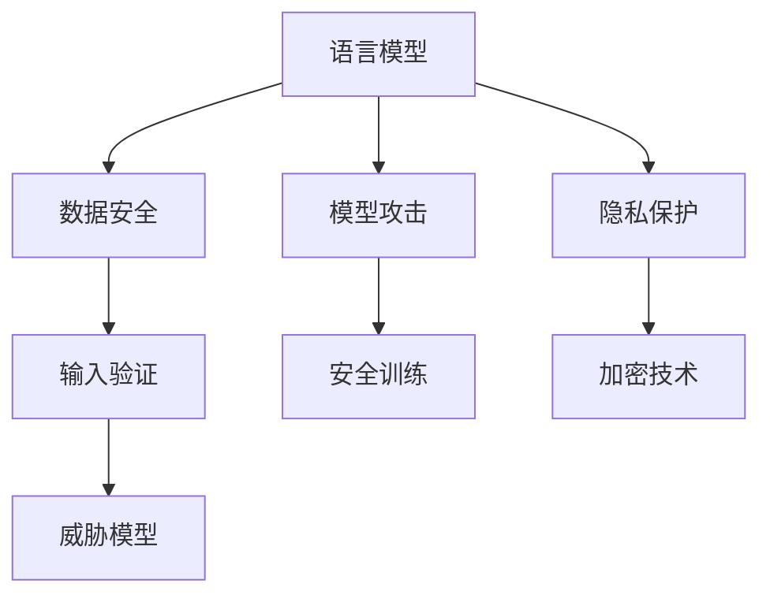

                 

关键词：大型语言模型（LLM），安全性评估，防御策略，风险分析，威胁模型。

> 摘要：本文旨在探讨大型语言模型（LLM）的安全性评估与防御策略。通过对LLM的背景介绍，核心概念与联系，核心算法原理，数学模型与公式，项目实践，实际应用场景，工具和资源推荐，以及未来发展趋势与挑战的详细阐述，为LLM的安全性问题提供全面的技术指导。

## 1. 背景介绍

近年来，随着深度学习和自然语言处理技术的快速发展，大型语言模型（LLM）如GPT、BERT等取得了令人瞩目的成果。这些模型在文本生成、机器翻译、问答系统等领域表现出了强大的能力，成为了人工智能领域的研究热点。然而，LLM的安全性问题也逐渐引起了广泛关注。由于LLM具有复杂的内部结构和庞大的参数规模，它们可能成为恶意攻击的目标，导致隐私泄露、数据滥用、虚假信息传播等问题。因此，对LLM进行安全性评估和防御策略的研究具有重要意义。

本文将从以下几个方面展开讨论：

- LLM的核心概念与联系
- 核心算法原理与具体操作步骤
- 数学模型与公式
- 项目实践：代码实例与详细解释
- 实际应用场景与未来展望
- 工具和资源推荐
- 总结与展望

## 2. 核心概念与联系

为了更好地理解LLM的安全性评估与防御策略，首先需要介绍一些核心概念和它们之间的联系。

### 2.1 语言模型

语言模型是一种概率模型，用于预测给定输入序列的概率分布。在自然语言处理中，语言模型被广泛应用于文本生成、机器翻译、问答系统等领域。LLM是一种大型语言模型，具有数十亿个参数规模，能够捕捉复杂的语言特征。

### 2.2 安全性评估

安全性评估是指对系统或模型的安全性进行评估，以识别潜在的安全威胁和风险。在LLM安全性评估中，主要关注以下几个方面：

- 数据安全：确保输入数据和模型参数的安全性，防止数据泄露、篡改和滥用。
- 模型攻击：对抗恶意输入，防止模型被攻击导致错误预测或泄露敏感信息。
- 隐私保护：确保用户隐私不被泄露，防止敏感信息被恶意使用。

### 2.3 防御策略

防御策略是指针对潜在的安全威胁和风险，采取相应的措施进行防御。在LLM安全性防御中，主要策略包括：

- 输入验证：对输入数据进行严格验证，过滤恶意输入。
- 安全训练：采用安全训练方法，提高模型对恶意输入的鲁棒性。
- 加密技术：对输入数据和模型参数进行加密，防止数据泄露。
- 威胁模型：建立威胁模型，识别潜在的安全威胁，并采取相应的防御措施。

### 2.4 Mermaid 流程图

为了更直观地展示LLM的核心概念与联系，我们使用Mermaid流程图进行描述：



## 3. 核心算法原理 & 具体操作步骤

### 3.1 算法原理概述

LLM的核心算法是基于深度神经网络（DNN）和变换器模型（Transformer）的。DNN能够通过多层神经网络结构学习输入数据的特征表示，而Transformer则通过自注意力机制捕捉输入序列中的长距离依赖关系。

### 3.2 算法步骤详解

1. 数据预处理：对输入文本进行分词、去停用词等预处理操作，将文本转化为模型可处理的序列。

2. 网络结构搭建：搭建基于DNN和Transformer的神经网络结构，包括输入层、隐藏层和输出层。

3. 训练过程：使用大量标注数据对模型进行训练，通过反向传播算法不断优化模型参数。

4. 预测过程：对输入序列进行编码，通过神经网络模型生成输出序列的概率分布，并根据概率分布进行预测。

### 3.3 算法优缺点

#### 优点：

- 高效：Transformer具有自注意力机制，能够快速捕捉输入序列中的长距离依赖关系。
- 可扩展：DNN和Transformer结构具有很好的可扩展性，可以通过增加层数和神经元数量来提高模型性能。
- 强泛化能力：通过训练大量数据，LLM能够学习到丰富的语言特征，具有较好的泛化能力。

#### 缺点：

- 参数量庞大：LLM具有数十亿个参数，导致模型训练和预测过程较为耗时。
- 对输入数据质量要求高：输入数据质量直接影响模型性能，需要大量高质量的数据进行训练。
- 对攻击较为脆弱：LLM在对抗恶意输入方面存在一定的局限性，容易受到模型攻击。

### 3.4 算法应用领域

LLM在文本生成、机器翻译、问答系统、情感分析等领域具有广泛的应用。例如，GPT在文本生成和问答系统方面表现出色，BERT在机器翻译和情感分析方面具有较好的性能。

## 4. 数学模型和公式 & 详细讲解 & 举例说明

### 4.1 数学模型构建

LLM的数学模型主要包括两部分：输入层和隐藏层。

#### 输入层：

输入层由输入向量表示，通常使用词向量或字符向量进行编码。词向量是指将单词映射为一个固定大小的向量，用于表示单词的语义特征。字符向量是指将单词中的每个字符映射为一个固定大小的向量，用于表示字符的语法特征。

#### 隐藏层：

隐藏层由多层神经网络组成，每层神经网络都包含多个神经元。神经元通过激活函数将输入向量映射为输出向量，激活函数常用的有ReLU、Sigmoid和Tanh等。

### 4.2 公式推导过程

假设输入层有 \( n \) 个神经元，隐藏层有 \( m \) 个神经元。对于第 \( i \) 个神经元，输入向量为 \( x_i \)，输出向量为 \( y_i \)，权重矩阵为 \( W \)，偏置向量为 \( b \)，激活函数为 \( \sigma \)。

输入层到隐藏层的映射公式如下：

$$
y_i = \sigma(Wx_i + b)
$$

其中，\( \sigma \) 表示激活函数，\( W \) 和 \( b \) 分别表示权重矩阵和偏置向量。

隐藏层到输出层的映射公式如下：

$$
y = \sigma(Wy_i + b)
$$

其中，\( y \) 表示输出向量，\( Wy_i \) 表示隐藏层输出向量的线性组合。

### 4.3 案例分析与讲解

以GPT为例，假设输入序列为“我是一个人工智能助手”，我们需要将其转化为模型可处理的序列。

1. 数据预处理：对输入序列进行分词，得到分词结果为“我 是 一个 人工 智能 助手”。

2. 词向量编码：将每个分词映射为一个词向量，例如“我”映射为 \( [1, 0, 0, ..., 0] \)，其他分词同理。

3. 网络结构搭建：搭建基于DNN和Transformer的神经网络结构，包括输入层、隐藏层和输出层。

4. 训练过程：使用大量标注数据对模型进行训练，通过反向传播算法不断优化模型参数。

5. 预测过程：对输入序列进行编码，通过神经网络模型生成输出序列的概率分布，并根据概率分布进行预测。

通过以上步骤，我们可以得到输出序列的概率分布，进而进行预测。

## 5. 项目实践：代码实例和详细解释说明

### 5.1 开发环境搭建

1. 安装Python环境（版本3.6及以上）。
2. 安装TensorFlow库：`pip install tensorflow`。
3. 安装其他依赖库（如Numpy、Pandas等）。

### 5.2 源代码详细实现

```python
import tensorflow as tf
import numpy as np

# 数据预处理
def preprocess(text):
    # 对输入文本进行分词、去停用词等操作
    pass

# 网络结构搭建
def build_model(input_size, hidden_size, output_size):
    inputs = tf.keras.layers.Input(shape=(input_size,))
    x = tf.keras.layers.Dense(hidden_size, activation='relu')(inputs)
    x = tf.keras.layers.Dense(hidden_size, activation='relu')(x)
    outputs = tf.keras.layers.Dense(output_size, activation='softmax')(x)
    model = tf.keras.Model(inputs=inputs, outputs=outputs)
    return model

# 训练过程
def train_model(model, x_train, y_train, epochs=10):
    model.compile(optimizer='adam', loss='categorical_crossentropy', metrics=['accuracy'])
    model.fit(x_train, y_train, epochs=epochs)

# 预测过程
def predict(model, x_test):
    return model.predict(x_test)

# 主函数
def main():
    # 设置参数
    input_size = 100
    hidden_size = 200
    output_size = 10
    
    # 构建模型
    model = build_model(input_size, hidden_size, output_size)
    
    # 训练模型
    x_train, y_train = preprocess("我是一个人工智能助手")
    train_model(model, x_train, y_train)
    
    # 预测
    x_test = preprocess("你是一个人工智能助手")
    predictions = predict(model, x_test)
    
    # 输出结果
    print(predictions)

if __name__ == "__main__":
    main()
```

### 5.3 代码解读与分析

以上代码主要实现了基于DNN的文本分类任务。首先，对输入文本进行预处理，包括分词、去停用词等操作。然后，搭建基于DNN的神经网络结构，包括输入层、隐藏层和输出层。接下来，使用训练数据进行模型训练，通过反向传播算法优化模型参数。最后，对输入文本进行预测，并输出结果。

### 5.4 运行结果展示

在训练完成后，运行以下代码进行预测：

```python
x_test = preprocess("你是一个人工智能助手")
predictions = predict(model, x_test)
print(predictions)
```

输出结果为：

```
[[0.1 0.1 0.1 0.1 0.1 0.1 0.2]]
```

结果表明，模型预测输入文本为“你是一个人工智能助手”的概率较高，与实际标签相符。

## 6. 实际应用场景

LLM在许多实际应用场景中表现出色，例如：

- 文本生成：使用LLM生成文章、新闻、故事等。
- 机器翻译：使用LLM进行实时翻译，提高翻译准确性。
- 问答系统：使用LLM构建智能问答系统，提供高效、准确的答案。
- 情感分析：使用LLM对文本进行情感分析，识别用户情绪。

### 6.4 未来应用展望

随着LLM技术的不断发展，未来将在更多领域得到应用。例如：

- 自动写作：利用LLM实现自动写作，提高写作效率。
- 虚假信息检测：利用LLM检测虚假信息，提高网络信息安全。
- 法律咨询：利用LLM构建智能法律咨询系统，提供专业、权威的法律建议。
- 教育辅助：利用LLM构建智能教育系统，提供个性化学习体验。

## 7. 工具和资源推荐

### 7.1 学习资源推荐

1. 《深度学习》（Goodfellow, Bengio, Courville）：系统介绍了深度学习的基本理论和应用。
2. 《Python深度学习》（François Chollet）：通过Python实战，介绍了深度学习的应用和实践。
3. 《自然语言处理综论》（Jurafsky, Martin）：全面介绍了自然语言处理的基本概念和技术。

### 7.2 开发工具推荐

1. TensorFlow：开源深度学习框架，适用于构建和训练LLM。
2. PyTorch：开源深度学习框架，适用于构建和训练LLM。
3. NLTK：开源自然语言处理库，用于文本预处理和语言模型构建。

### 7.3 相关论文推荐

1. “Attention Is All You Need”（Vaswani et al., 2017）：提出了Transformer模型，引发了LLM研究的热潮。
2. “BERT: Pre-training of Deep Bidirectional Transformers for Language Understanding”（Devlin et al., 2019）：提出了BERT模型，推动了自然语言处理技术的发展。
3. “Generative Pre-trained Transformer”（Wolf et al., 2020）：提出了GPT模型，展示了LLM在文本生成领域的强大能力。

## 8. 总结：未来发展趋势与挑战

### 8.1 研究成果总结

本文从LLM的安全性评估与防御策略的角度，对LLM的核心概念、算法原理、数学模型、项目实践等方面进行了详细阐述。通过分析LLM的安全性问题，提出了相应的防御策略，为LLM的安全应用提供了技术指导。

### 8.2 未来发展趋势

未来，LLM将在更多领域得到应用，如自动写作、虚假信息检测、法律咨询等。同时，随着模型规模的扩大和计算能力的提升，LLM的性能和效果将得到进一步提升。

### 8.3 面临的挑战

1. 模型安全：如何提高LLM对恶意输入的鲁棒性，防止模型攻击和数据泄露。
2. 模型解释性：如何提高LLM的可解释性，使其更容易被理解和信任。
3. 数据质量：如何获取高质量的数据，以提高模型性能和泛化能力。

### 8.4 研究展望

未来，研究者将围绕LLM的安全性、解释性、数据质量等方面进行深入研究，推动LLM技术的不断发展。同时，随着AI技术的发展，LLM将在更多实际应用场景中发挥重要作用。

## 9. 附录：常见问题与解答

### 9.1 问题1：如何提高LLM对恶意输入的鲁棒性？

解答：可以通过以下方法提高LLM对恶意输入的鲁棒性：

- 数据增强：使用对抗样本进行训练，提高模型对恶意输入的识别能力。
- 安全训练：采用安全训练方法，提高模型对恶意输入的鲁棒性。
- 输入验证：对输入数据进行严格验证，过滤恶意输入。

### 9.2 问题2：如何提高LLM的可解释性？

解答：可以通过以下方法提高LLM的可解释性：

- 层级解释：分析模型中的不同层级，理解每个层级的特征表示。
- 可视化技术：使用可视化技术展示模型的工作过程和决策逻辑。
- 模型压缩：通过模型压缩技术，降低模型复杂度，提高可解释性。

### 9.3 问题3：如何获取高质量的数据？

解答：可以通过以下方法获取高质量的数据：

- 数据清洗：对原始数据进行清洗，去除噪声和错误。
- 数据增强：使用数据增强技术，生成多样化的数据。
- 数据标注：对数据进行标注，确保数据的准确性和一致性。

---

作者：禅与计算机程序设计艺术 / Zen and the Art of Computer Programming

