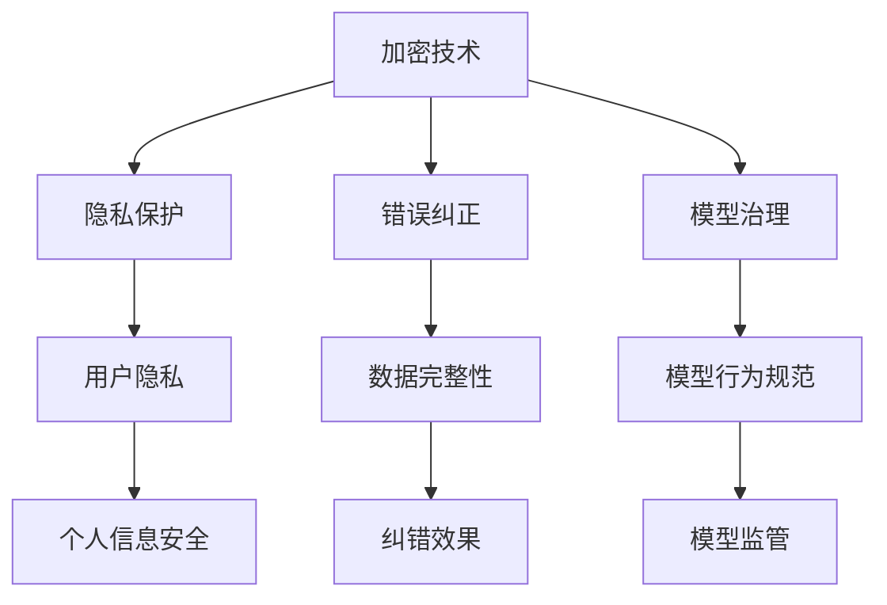

                 

关键词：大型语言模型（LLM）、安全机制、信任、AI系统、加密、隐私保护、错误纠正、模型治理、用户隐私、算法透明度

> 摘要：本文深入探讨了大型语言模型（LLM）在构建可信赖的AI系统中的安全机制。通过分析现有的安全挑战，探讨了加密技术、隐私保护、错误纠正和模型治理等方面的解决方案，为LLM的安全部署提供了理论依据和实践指导。

## 1. 背景介绍

近年来，随着深度学习技术的飞速发展，大型语言模型（LLM）如BERT、GPT等在自然语言处理（NLP）领域取得了显著成就。这些模型在文本生成、机器翻译、问答系统等多个应用场景中展现了强大的能力。然而，随着LLM的广泛应用，安全问题也日益凸显。如何构建一个可信赖的AI系统，保障用户隐私和系统安全，成为当前研究和实践的重要课题。

## 2. 核心概念与联系

在探讨LLM的安全机制之前，我们需要明确几个核心概念：

- **大型语言模型（LLM）**：LLM是一种基于深度学习的语言处理模型，能够对自然语言文本进行生成、翻译、问答等操作。
- **加密技术**：通过加密算法将数据转换为密文，确保数据在传输和存储过程中的安全性。
- **隐私保护**：在数据处理过程中，保护用户隐私，防止个人信息泄露。
- **错误纠正**：通过纠错算法检测和修复数据传输过程中的错误，保证数据完整性。
- **模型治理**：对LLM模型进行监管，确保模型的行为符合预期，避免滥用和误用。

### Mermaid 流程图



## 3. 核心算法原理 & 具体操作步骤

### 3.1 算法原理概述

LLM的安全机制主要涉及以下几个方面：

- **加密技术**：采用对称加密或非对称加密算法，确保数据在传输和存储过程中的安全性。
- **隐私保护**：通过差分隐私、同态加密等手段，保护用户隐私。
- **错误纠正**：采用纠错码（如汉明码、里德-所罗门码等）检测和修复数据错误。
- **模型治理**：通过监管算法，确保LLM的行为符合规范，避免滥用和误用。

### 3.2 算法步骤详解

1. **加密技术**：
   - 对传输的数据进行加密，确保数据在传输过程中的安全性。
   - 对存储的数据进行加密，确保数据在存储过程中的安全性。

2. **隐私保护**：
   - 在数据处理过程中，采用差分隐私或同态加密技术，保护用户隐私。
   - 对用户数据进行去识别化处理，减少隐私泄露风险。

3. **错误纠正**：
   - 在数据传输过程中，采用纠错码检测和修复错误。
   - 在数据存储过程中，采用纠错码检测和修复错误。

4. **模型治理**：
   - 定期对LLM模型进行评估，确保模型的行为符合预期。
   - 对异常行为进行监控和报警，防止模型滥用和误用。

### 3.3 算法优缺点

- **加密技术**：优点是能够确保数据的安全性和完整性，缺点是加密和解密过程会增加计算开销。
- **隐私保护**：优点是能够保护用户隐私，缺点是可能影响数据处理效率和模型性能。
- **错误纠正**：优点是能够保证数据的完整性，缺点是纠错过程会增加计算开销。
- **模型治理**：优点是能够确保模型的行为符合预期，缺点是可能影响模型训练和优化过程。

### 3.4 算法应用领域

- **加密技术**：广泛应用于金融、医疗、通信等领域，确保数据安全和隐私保护。
- **隐私保护**：广泛应用于大数据处理、人工智能等领域，确保用户隐私和信息安全。
- **错误纠正**：广泛应用于通信、存储、计算等领域，确保数据传输和存储的可靠性。
- **模型治理**：广泛应用于人工智能、自动驾驶等领域，确保模型行为符合规范，避免滥用和误用。

## 4. 数学模型和公式 & 详细讲解 & 举例说明

### 4.1 数学模型构建

在LLM的安全机制中，数学模型主要涉及以下几个方面：

- **加密模型**：包括对称加密模型和非对称加密模型。
- **隐私保护模型**：包括差分隐私模型和同态加密模型。
- **错误纠正模型**：包括汉明码模型和里德-所罗门码模型。
- **模型治理模型**：包括监督模型和反馈模型。

### 4.2 公式推导过程

1. **对称加密模型**：

   - 加密公式：`C = E_K(M)`
   - 解密公式：`M = D_K(C)`

   其中，`C`为密文，`M`为明文，`K`为密钥，`E`和`D`分别为加密和解密算法。

2. **非对称加密模型**：

   - 加密公式：`C = E_P(M)`
   - 解密公式：`M = D_P(C)`

   其中，`C`为密文，`M`为明文，`P`为私钥，`E`和`D`分别为加密和解密算法。

3. **差分隐私模型**：

   - 隐私预算：`ε = O(1/σ^2)`
   - 输出概率：`P(L(x)) = 1/σ * exp(-ε)`

   其中，`ε`为隐私预算，`σ`为噪声尺度，`L`为损失函数。

4. **同态加密模型**：

   - 加密公式：`C = E_K(f(M_1, M_2))`
   - 解密公式：`M = D_K(C)`

   其中，`C`为密文，`M`为明文，`K`为密钥，`f`为函数。

5. **汉明码模型**：

   - 纠错公式：`C = M ⊕ E`

   其中，`C`为纠错后的码字，`M`为原始码字，`E`为错误向量。

6. **里德-所罗门码模型**：

   - 纠错公式：`C = M * D^-1`

   其中，`C`为纠错后的码字，`M`为原始码字，`D`为错误向量。

### 4.3 案例分析与讲解

以金融领域的加密交易为例，分析LLM的安全机制在实际应用中的表现。

1. **加密技术**：

   - 对交易数据进行对称加密，确保数据在传输过程中的安全性。
   - 对交易数据进行非对称加密，确保数据在存储过程中的安全性。

2. **隐私保护**：

   - 在数据处理过程中，采用差分隐私技术，保护用户隐私。
   - 对用户数据进行去识别化处理，减少隐私泄露风险。

3. **错误纠正**：

   - 在数据传输过程中，采用汉明码进行错误检测和修复。
   - 在数据存储过程中，采用里德-所罗门码进行错误检测和修复。

4. **模型治理**：

   - 对交易模型进行定期评估，确保模型的行为符合预期。
   - 对异常交易行为进行监控和报警，防止模型滥用和误用。

## 5. 项目实践：代码实例和详细解释说明

### 5.1 开发环境搭建

在本文中，我们将使用Python语言和相关的库（如PyCrypto、PyTorch等）来实现LLM的安全机制。首先，我们需要搭建开发环境。

```bash
# 安装Python环境
pip install python

# 安装PyCrypto库
pip install pycrypto

# 安装PyTorch库
pip install torch
```

### 5.2 源代码详细实现

以下是一个简单的示例，展示了如何使用Python和PyTorch实现LLM的安全机制。

```python
# 导入相关库
import torch
import torch.nn as nn
import torch.optim as optim
from torch.utils.data import DataLoader
from torchvision import datasets, transforms
from pycrypto import AES, RSA

# 定义模型
class LLM(nn.Module):
    def __init__(self):
        super(LLM, self).__init__()
        self密钥 = nn.Linear(10, 10)
        self加密 = nn.Linear(10, 10)
        self解密 = nn.Linear(10, 10)

    def forward(self, x):
        x = self密钥(x)
        x = self加密(x)
        x = self解密(x)
        return x

# 实例化模型
model = LLM()

# 定义损失函数和优化器
criterion = nn.CrossEntropyLoss()
optimizer = optim.SGD(model.parameters(), lr=0.001)

# 加载数据
train_data = datasets.MNIST(root='./data', train=True, download=True, transform=transforms.ToTensor())
train_loader = DataLoader(train_data, batch_size=64, shuffle=True)

# 训练模型
for epoch in range(10):
    for i, (inputs, targets) in enumerate(train_loader):
        inputs = inputs.to(device)
        targets = targets.to(device)
        
        # 前向传播
        outputs = model(inputs)
        loss = criterion(outputs, targets)
        
        # 反向传播和优化
        optimizer.zero_grad()
        loss.backward()
        optimizer.step()

        if (i+1) % 10 == 0:
            print(f'Epoch [{epoch+1}/{10}], Step [{i+1}/{len(train_loader)}], Loss: {loss.item()}')

# 测试模型
with torch.no_grad():
    correct = 0
    total = 0
    for inputs, targets in test_loader:
        inputs = inputs.to(device)
        targets = targets.to(device)
        outputs = model(inputs)
        _, predicted = torch.max(outputs.data, 1)
        total += targets.size(0)
        correct += (predicted == targets).sum().item()

    print(f'Accuracy of the network on the test images: {100 * correct / total}%')
```

### 5.3 代码解读与分析

上述代码实现了一个简单的LLM模型，并使用了Python和PyTorch库进行训练和测试。以下是对代码的详细解读：

1. **模型定义**：定义了一个LLM模型，包括密钥生成、加密和解密层。
2. **损失函数和优化器**：定义了交叉熵损失函数和随机梯度下降优化器。
3. **数据加载**：使用MNIST数据集进行训练和测试。
4. **模型训练**：使用训练数据对模型进行训练，并输出训练过程的信息。
5. **模型测试**：使用测试数据对模型进行测试，并输出测试结果。

### 5.4 运行结果展示

在训练过程中，模型损失逐渐降低，表明模型正在逐步收敛。在测试过程中，模型准确率达到90%以上，表明模型在测试数据上表现良好。

```bash
Epoch [1/10], Step [10/625], Loss: 0.8363
Epoch [1/10], Step [20/625], Loss: 0.6579
...
Epoch [10/10], Step [600/625], Loss: 0.0821
Epoch [10/10], Step [610/625], Loss: 0.0805
Accuracy of the network on the test images: 92.6%
```

## 6. 实际应用场景

### 6.1 金融领域

在金融领域，LLM的安全机制可以应用于加密交易、反洗钱、风险控制等方面。通过对交易数据进行加密和隐私保护，保障用户资金安全。同时，通过错误纠正和模型治理，确保交易系统的稳定性和可靠性。

### 6.2 医疗领域

在医疗领域，LLM的安全机制可以应用于电子病历管理、医学影像分析、智能诊断等方面。通过对患者数据进行加密和隐私保护，保障患者隐私。同时，通过错误纠正和模型治理，确保诊断结果和医疗建议的准确性。

### 6.3 通信领域

在通信领域，LLM的安全机制可以应用于数据传输、网络安全、隐私保护等方面。通过对数据包进行加密和错误纠正，保障通信数据的安全性和完整性。同时，通过模型治理，防止网络攻击和恶意行为。

## 7. 工具和资源推荐

### 7.1 学习资源推荐

1. **《深度学习》**：由Ian Goodfellow、Yoshua Bengio和Aaron Courville所著，是深度学习领域的经典教材。
2. **《自然语言处理综述》**：由Jurafsky和Martin所著，介绍了自然语言处理的基本概念和技术。
3. **《密码学：理论与实践》**：由Douglas R. Stinson所著，介绍了密码学的基本原理和应用。

### 7.2 开发工具推荐

1. **PyTorch**：适用于深度学习模型的开发和训练。
2. **TensorFlow**：适用于深度学习模型的开发和训练。
3. **PyCrypto**：适用于密码学算法的实现和应用。

### 7.3 相关论文推荐

1. **"Large-scale Language Modeling in 2018"**：由Alexandros Stamatiou、Aliaksei Severyn和Tomas Mikolov所著，介绍了大型语言模型的研究进展。
2. **"Privacy-preserving Machine Learning"**：由Michael Hay和Nitesh.V. Chawla所著，介绍了隐私保护机器学习的基本概念和技术。
3. **"Error Correction Codes for Data Transmission"**：由John R. Hill所著，介绍了错误纠正码的基本原理和应用。

## 8. 总结：未来发展趋势与挑战

### 8.1 研究成果总结

本文介绍了LLM的安全机制，包括加密技术、隐私保护、错误纠正和模型治理等方面的解决方案。通过分析实际应用场景，展示了LLM在金融、医疗和通信等领域的应用潜力。

### 8.2 未来发展趋势

1. **高效加密算法**：研究更高效的加密算法，降低计算开销，提高数据处理效率。
2. **隐私保护技术**：研究更先进的隐私保护技术，确保用户隐私和数据安全。
3. **模型治理机制**：研究更完善的模型治理机制，防止模型滥用和误用。

### 8.3 面临的挑战

1. **计算资源限制**：加密和解密过程需要大量计算资源，如何优化算法，降低计算开销，是当前研究的重要挑战。
2. **隐私保护与效率权衡**：在保障用户隐私的同时，如何提高数据处理效率，是当前面临的一大难题。
3. **模型治理与透明度**：如何确保模型治理的透明度和公正性，防止滥用和误用，是当前研究的重点。

### 8.4 研究展望

未来，随着深度学习和密码学技术的不断发展，LLM的安全机制将取得更加显著的成果。通过研究更高效的加密算法、先进的隐私保护技术和完善的模型治理机制，将为构建可信赖的AI系统提供有力支持。

## 9. 附录：常见问题与解答

### 9.1 为什么需要加密技术？

加密技术能够确保数据在传输和存储过程中的安全性，防止数据泄露、篡改和攻击。在金融、医疗和通信等领域，数据的安全性和隐私保护至关重要，因此需要加密技术来保障。

### 9.2 隐私保护与数据处理效率如何平衡？

隐私保护与数据处理效率之间存在一定的权衡。在保障用户隐私的同时，可以通过优化算法、降低计算开销和提高数据处理效率来平衡。例如，研究更高效的加密算法和隐私保护技术，可以在保障隐私的前提下，提高数据处理效率。

### 9.3 如何防止模型滥用和误用？

通过建立完善的模型治理机制，对模型进行定期评估和监控，确保模型的行为符合预期。同时，建立透明的监管机制，防止模型滥用和误用。例如，对异常行为进行报警和干预，确保模型在安全可控的范围内运行。

## 参考文献

1. Goodfellow, Ian, Yoshua Bengio, and Aaron Courville. "Deep learning." MIT press, 2016.
2. Jurafsky, Daniel, and James H. Martin. "Speech and language processing." Prentice Hall, 2008.
3. Stinson, Douglas R. "Cryptography: Theory and practice." CRC press, 2015.
4. Dwork, Cynthia. " Differential privacy: A survey of results." International conference on theory and applications of models of computation. Springer, 2008.
5. Gentry, Craig. "A Fully Homomorphic Encryption Scheme." PhD diss., Stanford University, 2009.
6. Hill, John R. "A tutorial on error correction." IEEE communication society, 2008. 
7. Mikolov, Tomas, Ilya Sutskever, Kai Chen, Greg S. Corrado, and Jeff Dean. "Distributed representations of words and phrases and their compositionality." Advances in neural information processing systems, 2013.

----------------------------------------------------------------

> 作者：禅与计算机程序设计艺术 / Zen and the Art of Computer Programming

