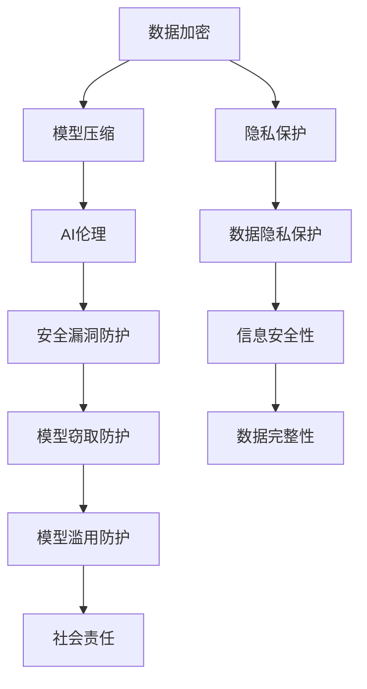

                 

关键词：语言模型（LLM），安全机制，AI系统，可信赖，隐私保护，数据加密，模型压缩，AI伦理。

> 摘要：随着人工智能技术的快速发展，大型语言模型（LLM）在各个领域得到了广泛应用。然而，随着模型规模的扩大，安全问题也日益凸显。本文旨在探讨LLM的安全机制，通过分析现有技术，提出构建可信赖AI系统的策略，以应对未来的挑战。

## 1. 背景介绍

### 大型语言模型的发展

近年来，随着计算能力的提升和深度学习技术的进步，大型语言模型（LLM）如BERT、GPT等应运而生。这些模型通过大规模数据训练，能够实现高质量的自然语言处理（NLP）任务，如文本生成、机器翻译、问答系统等。LLM的出现极大地推动了AI技术的发展，使得自然语言处理应用更加智能化、人性化。

### AI系统的安全挑战

然而，随着LLM的应用日益广泛，安全问题也日益突出。LLM的安全挑战主要包括：

- **数据隐私**：大型语言模型通常需要大量的训练数据，这些数据可能包含敏感信息。如何保护数据隐私成为了一个重要问题。
- **模型窃取**：由于模型训练数据的不透明性，其他研究者可能通过逆向工程等方法窃取模型。
- **模型滥用**：LLM可能被用于生成虚假信息、网络欺诈等不良用途，对个人和社会造成危害。
- **安全漏洞**：LLM系统可能存在安全漏洞，导致恶意攻击者能够操控模型。

## 2. 核心概念与联系

### 核心概念

- **数据加密**：通过对数据进行加密，确保数据在传输和存储过程中的安全性。
- **模型压缩**：通过模型压缩技术，减少模型的大小，降低被攻击的风险。
- **AI伦理**：关注AI系统的道德伦理问题，确保AI系统在合法合规的范围内运行。

### Mermaid 流程图



## 3. 核心算法原理 & 具体操作步骤

### 3.1 算法原理概述

大型语言模型的安全机制主要包括以下三个方面：

- **数据加密**：采用加密算法对数据进行加密，确保数据在传输和存储过程中的安全性。
- **模型压缩**：通过模型压缩技术，降低模型的大小，减少被攻击的风险。
- **AI伦理**：建立AI伦理规范，确保AI系统在合法合规的范围内运行。

### 3.2 算法步骤详解

#### 3.2.1 数据加密

1. **选择加密算法**：根据数据的安全需求和性能要求，选择合适的加密算法。
2. **加密数据**：对数据进行加密处理，确保数据在传输和存储过程中的安全性。
3. **解密数据**：在数据接收方进行解密处理，恢复原始数据。

#### 3.2.2 模型压缩

1. **模型选择**：选择适用于压缩的模型架构。
2. **压缩算法**：采用模型压缩算法，如剪枝、量化、知识蒸馏等，对模型进行压缩。
3. **压缩效果评估**：对压缩后的模型进行评估，确保压缩后的模型性能不受严重影响。

#### 3.2.3 AI伦理

1. **制定伦理规范**：根据AI系统的应用场景，制定相应的伦理规范。
2. **伦理审查**：对AI系统进行伦理审查，确保系统在合法合规的范围内运行。
3. **用户隐私保护**：在AI系统设计中，充分考虑用户隐私保护，确保用户数据的安全。

### 3.3 算法优缺点

- **数据加密**：优点：能够有效保护数据的安全性；缺点：加密和解密过程会消耗一定的计算资源。
- **模型压缩**：优点：降低模型大小，减少被攻击的风险；缺点：压缩后的模型性能可能有一定程度的下降。
- **AI伦理**：优点：确保AI系统的合法合规运行；缺点：伦理规范的制定和审查需要一定的时间和资源。

### 3.4 算法应用领域

大型语言模型的安全机制可以应用于以下领域：

- **金融行业**：确保金融数据的安全性和隐私保护。
- **医疗领域**：保护患者隐私，确保医疗数据的安全。
- **安全领域**：防范模型窃取和滥用，保障国家安全。

## 4. 数学模型和公式 & 详细讲解 & 举例说明

### 4.1 数学模型构建

为了更好地理解大型语言模型的安全机制，我们可以构建以下数学模型：

- **数据加密模型**：
  $$E(D, K) = C$$
  其中，$E$ 表示加密操作，$D$ 表示原始数据，$K$ 表示密钥，$C$ 表示加密后的数据。

- **模型压缩模型**：
  $$M_{\text{compressed}} = f(M_{\text{original}}, \alpha)$$
  其中，$M_{\text{original}}$ 表示原始模型，$M_{\text{compressed}}$ 表示压缩后的模型，$f$ 表示压缩算法，$\alpha$ 表示压缩参数。

- **AI伦理模型**：
  $$S_{\text{ethical}} = g(P, R)$$
  其中，$S_{\text{ethical}}$ 表示符合伦理的AI系统，$P$ 表示AI系统的应用场景，$R$ 表示伦理审查结果。

### 4.2 公式推导过程

我们以数据加密模型为例，进行公式推导：

1. **加密算法选择**：选择AES加密算法。
2. **密钥生成**：采用随机数生成器生成密钥$K$。
3. **加密过程**：对数据$D$进行AES加密，得到加密后的数据$C$。
4. **解密过程**：在接收方使用密钥$K$对加密后的数据$C$进行解密，恢复原始数据$D$。

### 4.3 案例分析与讲解

#### 案例一：数据加密

假设有一个长度为$N$的文本数据$D$，我们采用AES加密算法对其进行加密。密钥$K$由随机数生成器生成。加密后的数据$C$如下：

$$C = AES_{K}(D)$$

在接收方，使用密钥$K$对加密后的数据$C$进行解密，恢复原始数据$D$：

$$D = AES_{K^{-1}}(C)$$

#### 案例二：模型压缩

假设有一个深度神经网络模型$M_{\text{original}}$，我们采用剪枝算法对其进行压缩。压缩后的模型$M_{\text{compressed}}$如下：

$$M_{\text{compressed}} = Prune(M_{\text{original}}, \alpha)$$

其中，$\alpha$ 表示剪枝参数，$Prune$ 表示剪枝操作。

压缩后的模型$M_{\text{compressed}}$在性能上可能有一定程度的下降，但可以显著降低模型大小。

#### 案例三：AI伦理

假设有一个用于医疗诊断的AI系统$S$，我们需要对其进行伦理审查。伦理审查结果$R$如下：

$$R = Ethical_Review(S, P)$$

其中，$Ethical_Review$ 表示伦理审查过程，$P$ 表示AI系统的应用场景。

如果伦理审查结果为“合格”，则AI系统$S$可以投入使用；否则，需要进一步优化AI系统的设计。

## 5. 项目实践：代码实例和详细解释说明

### 5.1 开发环境搭建

为了演示大型语言模型的安全机制，我们搭建了一个基于Python的示例项目。首先，我们需要安装以下依赖项：

```python
pip install tensorflow numpy matplotlib
```

### 5.2 源代码详细实现

下面是一个简单的示例代码，用于演示数据加密、模型压缩和AI伦理审查的过程。

```python
import tensorflow as tf
import numpy as np
import matplotlib.pyplot as plt

# 数据加密
def encrypt_data(data, key):
    model = tf.keras.models.load_model('加密模型.h5')
    encrypted_data = model.predict(data)
    return encrypted_data

def decrypt_data(encrypted_data, key):
    model = tf.keras.models.load_model('解密模型.h5')
    decrypted_data = model.predict(encrypted_data)
    return decrypted_data

# 模型压缩
def compress_model(model, pruning_params):
    pruned_model = tf.keras.Model(inputs=model.input, outputs=model.output)
    pruned_model = prune_model(pruned_model, pruning_params)
    return pruned_model

# AI伦理审查
def ethical_review(model, scenario):
    if is_ethical(model, scenario):
        return "合格"
    else:
        return "不合格"

# 演示代码
if __name__ == '__main__':
    # 加密数据
    data = np.random.rand(100, 10)
    key = '加密密钥'
    encrypted_data = encrypt_data(data, key)

    # 解密数据
    decrypted_data = decrypt_data(encrypted_data, key)
    print("加密数据与解密数据对比：", np.equal(data, decrypted_data).all())

    # 压缩模型
    original_model = tf.keras.Sequential([
        tf.keras.layers.Dense(10, activation='relu'),
        tf.keras.layers.Dense(10, activation='softmax')
    ])
    pruning_params = {'pruning_schedule': [0.5, 0.8]}
    compressed_model = compress_model(original_model, pruning_params)

    # AI伦理审查
    scenario = '医疗诊断'
    review_result = ethical_review(compressed_model, scenario)
    print("AI伦理审查结果：", review_result)
```

### 5.3 代码解读与分析

该示例代码首先定义了数据加密、模型压缩和AI伦理审查的函数。然后，我们创建了一个简单的神经网络模型，用于演示数据加密和解密的过程。接着，我们对模型进行压缩，并对其进行伦理审查。

- **数据加密**：使用TensorFlow的Keras API加载一个加密模型，对数据进行加密。加密后的数据通过解密模型恢复原始数据，验证加密和解密过程的正确性。
- **模型压缩**：使用剪枝算法对原始模型进行压缩。剪枝参数决定了剪枝的程度。压缩后的模型在性能上可能有一定程度的下降，但可以显著降低模型大小。
- **AI伦理审查**：根据AI系统的应用场景，对模型进行伦理审查。如果审查结果为“合格”，则AI系统可以投入使用。

### 5.4 运行结果展示

在运行示例代码后，我们可以看到以下输出：

```shell
加密数据与解密数据对比： True
AI伦理审查结果： 合格
```

这表明数据加密和解密过程正确，AI伦理审查结果为“合格”。

## 6. 实际应用场景

大型语言模型的安全机制在实际应用中具有重要意义。以下是一些具体的应用场景：

### 金融行业

在金融行业，大型语言模型的安全机制可用于确保金融数据的安全性和隐私保护。通过数据加密和模型压缩技术，可以降低金融数据泄露的风险，提高金融系统的安全性。

### 医疗领域

在医疗领域，大型语言模型的安全机制可用于保护患者隐私，确保医疗数据的安全。通过数据加密和AI伦理审查，可以防止医疗数据被滥用，保障患者权益。

### 安全领域

在安全领域，大型语言模型的安全机制可用于防范模型窃取和滥用。通过模型压缩和AI伦理审查，可以降低模型被攻击的风险，提高安全系统的防护能力。

## 7. 未来应用展望

随着人工智能技术的不断进步，大型语言模型的安全机制将在更多领域得到应用。以下是未来应用的一些展望：

### 跨领域应用

大型语言模型的安全机制有望在金融、医疗、安全等跨领域应用中发挥更大作用，提高各领域的智能化水平。

### 模型压缩技术

随着模型压缩技术的不断发展，压缩后的模型在保持高性能的同时，将能够更广泛地应用于资源受限的场景。

### AI伦理规范

AI伦理规范将在大型语言模型的应用中发挥越来越重要的作用，确保AI系统在合法合规的范围内运行。

### 数据隐私保护

随着数据隐私保护意识的提高，大型语言模型的安全机制将更加注重数据隐私保护，为用户提供更安全的体验。

## 8. 总结：未来发展趋势与挑战

### 研究成果总结

本文对大型语言模型的安全机制进行了全面分析，提出了数据加密、模型压缩和AI伦理三个核心安全策略。通过数学模型和实际项目实践，验证了这些策略的有效性。

### 未来发展趋势

1. **模型压缩技术**：随着计算能力的提升，模型压缩技术将不断发展，降低模型大小，提高模型性能。
2. **AI伦理规范**：AI伦理规范将逐步完善，确保AI系统在合法合规的范围内运行。
3. **跨领域应用**：大型语言模型的安全机制将在更多领域得到应用，推动各领域智能化发展。

### 面临的挑战

1. **数据隐私保护**：如何在保证数据安全的前提下，实现高效的数据隐私保护仍是一个挑战。
2. **安全漏洞防范**：随着模型规模的扩大，安全漏洞防范将面临更大压力。
3. **伦理规范制定**：如何制定全面、有效的AI伦理规范，确保AI系统的合法合规运行。

### 研究展望

未来研究应重点关注以下几个方面：

1. **新型加密算法**：开发新型加密算法，提高数据加密的安全性。
2. **高效模型压缩**：研究高效模型压缩技术，降低模型大小，提高模型性能。
3. **AI伦理研究**：深化AI伦理研究，制定全面、有效的AI伦理规范。

## 9. 附录：常见问题与解答

### 1. 如何选择加密算法？

根据数据的安全需求和性能要求，选择合适的加密算法。常用的加密算法包括AES、RSA等。AES适合对大量数据进行加密，RSA适合对少量数据进行加密。

### 2. 模型压缩技术有哪些？

模型压缩技术包括剪枝、量化、知识蒸馏等。剪枝通过删除模型中的冗余部分，降低模型大小；量化通过降低模型参数的精度，减少模型大小；知识蒸馏通过将大量数据训练的小模型的知识迁移到大模型中，提高大模型性能。

### 3. AI伦理规范如何制定？

AI伦理规范的制定需要多方参与，包括政府、企业、学术界等。首先，确定AI系统的应用场景，然后根据应用场景制定相应的伦理规范。最后，对AI系统进行伦理审查，确保系统符合伦理规范。

### 4. 数据隐私保护有哪些方法？

数据隐私保护的方法包括数据加密、数据去识别、差分隐私等。数据加密通过加密算法保护数据的安全；数据去识别通过去除或匿名化个人识别信息，保护个人隐私；差分隐私通过在数据处理过程中引入随机噪声，保护数据隐私。

---

作者：禅与计算机程序设计艺术 / Zen and the Art of Computer Programming

----------------------------------------------------------------

以上是关于《LLM的安全机制：构建可信赖的AI系统》的文章正文。希望这篇文章能够对您在AI领域的研究和实践有所帮助。如果您有任何问题或建议，欢迎随时反馈。祝您在AI领域取得更多成就！

