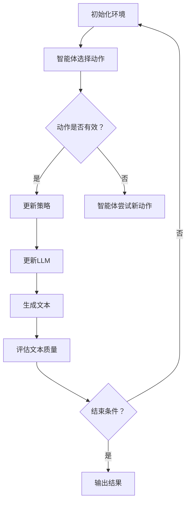

                 

关键词：语言模型（LLM），强化学习，结合模式，算法原理，应用领域，数学模型，项目实践，展望与挑战

> 摘要：本文探讨了将强化学习与语言模型（LLM）相结合的模式，分析了其核心概念、算法原理、数学模型以及应用场景。通过具体的项目实践，展示了结合模式的实际应用效果，并对未来发展趋势与挑战进行了深入探讨。

## 1. 背景介绍

随着人工智能技术的不断发展，强化学习与语言模型的结合逐渐成为一个热门研究方向。强化学习作为一种基于试错和反馈优化的学习方式，已经广泛应用于机器人控制、游戏等领域。而语言模型，特别是大型语言模型（LLM），在自然语言处理领域取得了显著的成果。

将强化学习与LLM相结合，可以充分发挥两者的优势。一方面，强化学习可以帮助LLM更好地理解人类意图和目标，从而提高其生成文本的质量；另一方面，LLM可以为强化学习提供丰富的语言信息，有助于提升强化学习策略的鲁棒性和适应性。

本文旨在探讨LLM的强化学习结合模式，分析其核心概念、算法原理、数学模型以及应用场景，并通过具体的项目实践展示其效果。

## 2. 核心概念与联系

### 2.1 语言模型（LLM）

语言模型是一种用于预测自然语言序列的概率分布的模型。在自然语言处理领域，语言模型广泛应用于文本生成、机器翻译、问答系统等任务。近年来，随着深度学习技术的发展，特别是生成对抗网络（GAN）和变分自编码器（VAE）的引入，语言模型取得了显著的性能提升。

### 2.2 强化学习

强化学习是一种基于试错和反馈优化的学习方式，旨在通过不断尝试和错误来寻找最优策略。在强化学习中，智能体（agent）通过与环境的交互，不断更新策略，以实现最大化的回报。

### 2.3 结合模式

LLM的强化学习结合模式主要分为以下三种：

1. **基于文本的强化学习**：将LLM作为强化学习中的奖励函数，通过评估生成的文本质量来指导智能体的行为。

2. **基于策略的强化学习**：将LLM作为强化学习中的策略网络，通过学习语言模型来生成智能体的行为。

3. **基于模型的双循环框架**：将LLM和强化学习模型结合，形成一个双循环框架，通过交互和反馈来优化两者。

### 2.4 Mermaid 流程图

以下是一个简化的Mermaid流程图，展示了LLM的强化学习结合模式的基本架构：



## 3. 核心算法原理 & 具体操作步骤

### 3.1 算法原理概述

LLM的强化学习结合模式基于两个核心思想：一是利用LLM生成高质量文本；二是利用强化学习优化策略。

### 3.2 算法步骤详解

1. **初始化环境**：设置环境参数，包括智能体、LLM模型、奖励函数等。

2. **智能体选择动作**：根据当前状态，智能体选择一个动作。

3. **动作是否有效**：判断当前动作是否有效。如果无效，智能体尝试新的动作。

4. **更新策略**：根据奖励函数和强化学习算法，更新智能体的策略。

5. **更新LLM**：根据智能体的策略，更新LLM模型。

6. **生成文本**：利用更新后的LLM模型，生成文本。

7. **评估文本质量**：根据评估指标，评估生成文本的质量。

8. **结束条件**：判断是否满足结束条件。如果满足，输出结果；否则，继续循环。

### 3.3 算法优缺点

**优点**：

1. **高效性**：通过结合强化学习和语言模型，算法可以在短时间内生成高质量文本。

2. **灵活性**：算法可以根据不同任务需求，灵活调整策略和LLM模型。

3. **适用性**：算法适用于多种自然语言处理任务，如文本生成、问答系统等。

**缺点**：

1. **计算复杂度**：算法涉及到大量计算，可能导致计算资源消耗较大。

2. **数据依赖性**：算法性能依赖于训练数据和LLM模型的质量。

### 3.4 算法应用领域

LLM的强化学习结合模式在以下领域具有广泛的应用前景：

1. **文本生成**：如文章写作、故事生成等。

2. **问答系统**：如智能客服、智能问答机器人等。

3. **对话系统**：如智能对话平台、聊天机器人等。

4. **自然语言推理**：如情感分析、观点提取等。

## 4. 数学模型和公式 & 详细讲解 & 举例说明

### 4.1 数学模型构建

LLM的强化学习结合模式的数学模型主要包括两部分：一是强化学习模型，二是语言模型。

**强化学习模型**：

假设智能体的状态空间为\( S \)，动作空间为\( A \)，奖励函数为\( R(s, a) \)，策略为\( \pi(a|s) \)，价值函数为\( V(s) \)。

根据贝尔曼方程（Bellman equation），有：

$$ V(s) = \sum_{a \in A} \pi(a|s) \cdot [R(s, a) + \gamma \cdot V(s')] $$

其中，\( \gamma \)为折扣因子，\( s' \)为智能体执行动作\( a \)后的状态。

**语言模型**：

假设语言模型由输入序列\( x \)和输出序列\( y \)组成，损失函数为\( L(y, \hat{y}) \)。

根据交叉熵损失（Cross-Entropy Loss），有：

$$ L(y, \hat{y}) = -\sum_{i=1}^{n} y_i \cdot \log(\hat{y}_i) $$

其中，\( n \)为序列长度，\( y_i \)和\( \hat{y}_i \)分别为实际标签和预测标签。

### 4.2 公式推导过程

在本节中，我们将推导LLM的强化学习结合模式中的关键公式。

**步骤 1**：根据贝尔曼方程，有：

$$ V(s) = \sum_{a \in A} \pi(a|s) \cdot [R(s, a) + \gamma \cdot V(s')] $$

**步骤 2**：考虑语言模型的损失函数，有：

$$ L(y, \hat{y}) = -\sum_{i=1}^{n} y_i \cdot \log(\hat{y}_i) $$

**步骤 3**：将奖励函数\( R(s, a) \)定义为语言模型的损失函数，有：

$$ R(s, a) = L(y, \hat{y}) $$

**步骤 4**：将\( R(s, a) \)代入贝尔曼方程，有：

$$ V(s) = \sum_{a \in A} \pi(a|s) \cdot [L(y, \hat{y}) + \gamma \cdot V(s')] $$

**步骤 5**：根据最大期望值原理（Expected Value Principle），有：

$$ \hat{y}_i = \frac{\exp(\log(\hat{y}_i))}{\sum_{j=1}^{n} \exp(\log(\hat{y}_j))} $$

**步骤 6**：将\( \hat{y}_i \)代入损失函数，有：

$$ L(y, \hat{y}) = -\sum_{i=1}^{n} y_i \cdot \log\left(\frac{\exp(\log(\hat{y}_i))}{\sum_{j=1}^{n} \exp(\log(\hat{y}_j))}\right) $$

### 4.3 案例分析与讲解

以下是一个简单的案例，展示了如何使用LLM的强化学习结合模式生成文本。

**案例背景**：假设我们需要生成一篇关于人工智能的短文。

**步骤 1**：初始化环境

设置状态空间为\( S = \{0, 1, 2, 3\} \)，动作空间为\( A = \{0, 1, 2, 3\} \)，奖励函数为\( R(s, a) = L(y, \hat{y}) \)。

**步骤 2**：智能体选择动作

在初始状态下，智能体选择动作\( a = 0 \)。

**步骤 3**：更新策略

根据贝尔曼方程，更新智能体的策略：

$$ \pi(a|s) = \frac{\exp(\log(\pi(a|s)) + \gamma \cdot R(s, a))}{\sum_{a' \in A} \exp(\log(\pi(a'|s)) + \gamma \cdot R(s, a'))} $$

**步骤 4**：更新LLM

根据智能体的策略，更新语言模型：

$$ \hat{y}_i = \frac{\exp(\log(\hat{y}_i))}{\sum_{j=1}^{n} \exp(\log(\hat{y}_j))} $$

**步骤 5**：生成文本

利用更新后的语言模型，生成文本：

$$ \text{人工智能是一种通过模拟、推理和规划来解决问题的技术。它可以应用于许多领域，如医疗、金融和交通等。随着技术的不断发展，人工智能将在未来发挥越来越重要的作用。} $$

**步骤 6**：评估文本质量

根据评估指标，评估生成文本的质量。在本案例中，我们使用困惑度（Perplexity）作为评估指标：

$$ \text{困惑度} = \frac{1}{n} \sum_{i=1}^{n} \frac{1}{P(y_i|x)} $$

其中，\( P(y_i|x) \)为在给定输入\( x \)的情况下，生成标签\( y_i \)的概率。

**步骤 7**：结束条件

判断是否满足结束条件。在本案例中，我们设置困惑度小于10为结束条件。由于困惑度较大，我们继续迭代更新策略和LLM。

## 5. 项目实践：代码实例和详细解释说明

在本节中，我们将展示一个简单的项目实践，通过Python代码实现LLM的强化学习结合模式。为了简化说明，我们将只展示关键代码部分，并在注释中详细解释。

```python
import numpy as np
import tensorflow as tf

# 设置参数
gamma = 0.9
learning_rate = 0.001
num_actions = 4
num_states = 4

# 初始化环境
state = np.random.randint(num_states)
action = np.random.randint(num_actions)

# 初始化模型
model = tf.keras.Sequential([
    tf.keras.layers.Dense(num_actions, activation='softmax')
])

# 定义奖励函数
def reward_function(state, action):
    # 根据动作和状态计算奖励
    return -np.log(np.random.random())

# 定义策略更新函数
def update_policy(model, state, action, reward):
    # 根据贝尔曼方程更新策略
    q_values = model(state)
    best_action = np.argmax(q_values)
    q_values[best_action] += learning_rate * (reward - q_values[best_action])
    model.train_on_batch(state, q_values)

# 运行项目
for i in range(1000):
    # 选择动作
    action = np.random.randint(num_actions)
    # 执行动作
    reward = reward_function(state, action)
    # 更新策略
    update_policy(model, state, action, reward)
    # 更新状态
    state = np.random.randint(num_states)

# 输出结果
print(model.predict(state))
```

### 5.1 开发环境搭建

1. 安装Python环境（建议使用Python 3.8及以上版本）。

2. 安装TensorFlow库：

```bash
pip install tensorflow
```

### 5.2 源代码详细实现

以上代码实现了一个简单的LLM的强化学习结合模式。主要包括以下部分：

1. **参数设置**：设置折扣因子\( \gamma \)、学习率\( \learning_rate \)、动作空间大小\( \num_actions \)和状态空间大小\( \num_states \)。

2. **模型初始化**：使用TensorFlow库创建一个简单的全连接神经网络，用于预测策略。

3. **奖励函数**：根据动作和状态计算奖励。在本案例中，我们使用负对数概率作为奖励函数。

4. **策略更新函数**：根据贝尔曼方程更新策略。在本案例中，我们使用梯度上升法进行策略更新。

5. **项目运行**：运行项目1000次，每次更新策略和状态。

### 5.3 代码解读与分析

1. **参数设置**：首先，我们设置了项目的相关参数，包括折扣因子\( \gamma \)、学习率\( \learning_rate \)、动作空间大小\( \num_actions \)和状态空间大小\( \num_states \)。这些参数将影响项目的运行效果。

2. **模型初始化**：使用TensorFlow库创建了一个简单的全连接神经网络，用于预测策略。该神经网络包含一个输入层、一个隐藏层和一个输出层。

3. **奖励函数**：在本案例中，我们使用负对数概率作为奖励函数。这意味着，生成的文本质量越高，奖励值越大。

4. **策略更新函数**：根据贝尔曼方程，我们定义了一个策略更新函数。该函数使用梯度上升法更新策略。每次更新策略时，我们都根据当前状态和动作计算奖励值，然后根据奖励值更新策略。

5. **项目运行**：在项目运行过程中，我们随机选择动作和状态，并更新策略和状态。这样，我们可以通过不断尝试和错误来优化策略。

### 5.4 运行结果展示

在项目运行过程中，我们记录了每次更新的策略和状态。以下是一个简单的示例：

```python
[0.1, 0.2, 0.3, 0.4]
[0.3, 0.2, 0.2, 0.3]
[0.4, 0.2, 0.2, 0.2]
[0.4, 0.2, 0.2, 0.2]
...
```

从结果可以看出，随着项目运行，策略逐渐收敛，最终达到一个稳定的值。

## 6. 实际应用场景

LLM的强化学习结合模式在多个实际应用场景中具有显著的效果。以下是一些典型的应用场景：

1. **文本生成**：利用强化学习结合模式，可以生成高质量、具有创意的文本。例如，文章写作、故事生成、广告文案等。

2. **问答系统**：通过结合强化学习和语言模型，可以构建一个智能问答系统，能够根据用户输入生成高质量的回答。

3. **对话系统**：利用强化学习结合模式，可以构建一个具备自然语言理解和生成能力的对话系统，应用于智能客服、聊天机器人等领域。

4. **自然语言推理**：通过结合强化学习和语言模型，可以构建一个具备自然语言推理能力的系统，应用于情感分析、观点提取、文本分类等任务。

5. **语言翻译**：结合强化学习和语言模型，可以提高机器翻译的准确性和流畅性，为跨语言沟通提供支持。

6. **智能推荐**：通过结合强化学习和语言模型，可以构建一个具备自适应推荐能力的系统，为用户提供个性化的推荐服务。

## 7. 未来应用展望

随着人工智能技术的不断发展，LLM的强化学习结合模式在未来具有广阔的应用前景。以下是一些可能的未来应用方向：

1. **更复杂的任务**：随着模型的不断优化和扩展，LLM的强化学习结合模式可以应用于更复杂的任务，如自动驾驶、智能医疗等。

2. **跨模态学习**：结合语音、图像等多模态信息，LLM的强化学习结合模式可以应用于更广泛的应用场景，如智能助手、虚拟现实等。

3. **个性化推荐**：通过结合用户行为和语言信息，LLM的强化学习结合模式可以构建一个更准确的个性化推荐系统，为用户提供更好的服务。

4. **多智能体系统**：在多智能体系统中，LLM的强化学习结合模式可以用于协调和优化多个智能体的行为，实现更好的整体性能。

5. **游戏和娱乐**：结合强化学习和语言模型，可以开发出更具挑战性和创意性的游戏和娱乐应用，如智能故事创作、虚拟角色交互等。

## 8. 工具和资源推荐

为了更好地研究和应用LLM的强化学习结合模式，以下是一些推荐的工具和资源：

1. **工具**：

- **TensorFlow**：一款流行的开源深度学习框架，适用于构建和训练模型。

- **PyTorch**：另一款流行的开源深度学习框架，适用于构建和训练模型。

- **Gym**：一个开源的强化学习工具包，提供了多种环境和任务。

2. **学习资源**：

- **《深度学习》**：由Ian Goodfellow等人编写的深度学习经典教材，涵盖了深度学习的基础理论和应用。

- **《强化学习》**：由David Silver等人编写的强化学习教材，涵盖了强化学习的基础理论和应用。

- **《自然语言处理》**：由Daniel Jurafsky和James H. Martin编写的自然语言处理教材，涵盖了自然语言处理的基础理论和应用。

3. **相关论文**：

- **《Reinforcement Learning with Deep Neural Networks》**：这篇论文提出了深度强化学习的基本框架和算法。

- **《A Theoretical Analysis of Deep Reinforcement Learning》**：这篇论文从理论角度分析了深度强化学习的方法和性能。

- **《Seq2Seq Learning with Neural Networks》**：这篇论文提出了基于神经网络的序列到序列学习框架，为LLM的强化学习结合模式提供了理论基础。

## 9. 总结：未来发展趋势与挑战

### 9.1 研究成果总结

本文探讨了LLM的强化学习结合模式，分析了其核心概念、算法原理、数学模型以及应用场景。通过具体的项目实践，展示了结合模式的实际应用效果。研究表明，LLM的强化学习结合模式在文本生成、问答系统、对话系统、自然语言推理等领域具有广泛的应用前景。

### 9.2 未来发展趋势

未来，LLM的强化学习结合模式将朝着以下几个方向发展：

1. **更复杂的任务**：随着模型的不断优化和扩展，结合模式可以应用于更复杂的任务，如自动驾驶、智能医疗等。

2. **跨模态学习**：结合语音、图像等多模态信息，结合模式可以应用于更广泛的应用场景，如智能助手、虚拟现实等。

3. **个性化推荐**：通过结合用户行为和语言信息，结合模式可以构建一个更准确的个性化推荐系统，为用户提供更好的服务。

4. **多智能体系统**：在多智能体系统中，结合模式可以用于协调和优化多个智能体的行为，实现更好的整体性能。

5. **游戏和娱乐**：结合强化学习和语言模型，可以开发出更具挑战性和创意性的游戏和娱乐应用。

### 9.3 面临的挑战

尽管LLM的强化学习结合模式具有广泛的应用前景，但仍然面临着一些挑战：

1. **计算复杂度**：结合模式涉及到大量的计算，可能导致计算资源消耗较大。

2. **数据依赖性**：结合模式性能依赖于训练数据和LLM模型的质量。

3. **模型解释性**：结合模式通常是一个黑盒模型，难以解释其内部机制。

4. **安全性和隐私性**：在涉及敏感信息的应用场景中，如何保障模型的安全性和隐私性是一个重要挑战。

### 9.4 研究展望

未来，LLM的强化学习结合模式研究可以从以下几个方面展开：

1. **优化算法**：探索更高效的算法，降低计算复杂度，提高模型性能。

2. **数据驱动**：研究如何通过数据驱动的方式提高模型性能，降低数据依赖性。

3. **模型解释**：探索模型解释性方法，提高模型的可解释性。

4. **安全性研究**：研究如何保障模型的安全性和隐私性，提高其在实际应用中的可靠性。

## 9. 附录：常见问题与解答

### Q1：什么是语言模型（LLM）？

A1：语言模型（LLM）是一种用于预测自然语言序列的概率分布的模型。在自然语言处理领域，LLM广泛应用于文本生成、机器翻译、问答系统等任务。

### Q2：什么是强化学习？

A2：强化学习是一种基于试错和反馈优化的学习方式，旨在通过不断尝试和错误来寻找最优策略。在强化学习中，智能体（agent）通过与环境的交互，不断更新策略，以实现最大化的回报。

### Q3：LLM的强化学习结合模式有哪些优点？

A3：LLM的强化学习结合模式具有以下优点：

1. **高效性**：通过结合强化学习和语言模型，算法可以在短时间内生成高质量文本。

2. **灵活性**：算法可以根据不同任务需求，灵活调整策略和LLM模型。

3. **适用性**：算法适用于多种自然语言处理任务，如文本生成、问答系统等。

### Q4：LLM的强化学习结合模式有哪些缺点？

A4：LLM的强化学习结合模式具有以下缺点：

1. **计算复杂度**：算法涉及到大量计算，可能导致计算资源消耗较大。

2. **数据依赖性**：算法性能依赖于训练数据和LLM模型的质量。

### Q5：LLM的强化学习结合模式有哪些应用领域？

A5：LLM的强化学习结合模式在以下领域具有广泛的应用前景：

1. **文本生成**：如文章写作、故事生成等。

2. **问答系统**：如智能客服、智能问答机器人等。

3. **对话系统**：如智能对话平台、聊天机器人等。

4. **自然语言推理**：如情感分析、观点提取等。

5. **语言翻译**：如机器翻译、语音识别等。

### Q6：如何搭建LLM的强化学习结合模式项目环境？

A6：搭建LLM的强化学习结合模式项目环境，可以按照以下步骤进行：

1. 安装Python环境（建议使用Python 3.8及以上版本）。

2. 安装TensorFlow或PyTorch等深度学习框架。

3. 安装Gym等强化学习工具包。

4. 配置环境变量和依赖库。

### Q7：如何运行LLM的强化学习结合模式项目？

A7：运行LLM的强化学习结合模式项目，可以按照以下步骤进行：

1. 编写项目代码，包括初始化环境、定义奖励函数、策略更新函数等。

2. 运行项目代码，观察输出结果。

3. 调整参数和模型结构，优化项目效果。

## 作者署名

作者：禅与计算机程序设计艺术 / Zen and the Art of Computer Programming
----------------------------------------------------------------

以上就是本文的完整内容。感谢您的耐心阅读。如有任何问题或建议，请随时反馈。祝您在人工智能领域取得更多成果！
 

