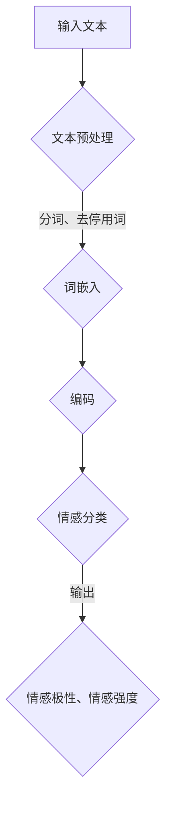

                 

关键词：语言模型、情感分析、情感识别、AI、自然语言处理

摘要：本文将探讨如何使用大型语言模型（LLM）进行情感识别，以打造更加有温度的AI系统。我们将详细分析LLM的情感识别原理、数学模型、算法实现以及实际应用，并展望未来发展的趋势与挑战。

## 1. 背景介绍

在人工智能（AI）快速发展的时代，语言模型（Language Model，简称LM）已成为自然语言处理（Natural Language Processing，简称NLP）领域的重要工具。特别是近年来，大型语言模型（LLM）如GPT-3、BERT等的出现，使得AI在理解和生成自然语言方面取得了显著的突破。然而，除了基本的语言理解和生成任务外，情感识别作为NLP的一个重要分支，也逐渐成为研究和应用的热点。

情感识别是指从文本中提取出情感信息，并对其进行分类和判断的过程。在许多实际应用场景中，如社交媒体监控、舆情分析、智能客服等，情感识别可以提供重要的辅助决策信息，有助于提升用户体验、优化服务质量。因此，如何有效地实现情感识别，成为了一个关键的研究课题。

本文将结合LLM的特点，探讨如何利用其强大的语言理解和生成能力进行情感识别，以打造更加有温度的AI系统。文章将分为以下几个部分：首先，我们将介绍LLM的基本概念和情感识别的背景；然后，详细分析LLM的情感识别原理、数学模型、算法实现以及实际应用；最后，展望未来发展的趋势与挑战。

## 2. 核心概念与联系

### 2.1 语言模型（Language Model）

语言模型是一种基于统计方法或神经网络模型，用于预测文本序列中下一个单词或字符的概率分布。其主要目标是使生成的文本在语法和语义上尽可能接近人类自然语言。

在NLP领域，LLM通常是指大型预训练语言模型，如GPT-3、BERT等。这些模型通过在海量文本数据上进行预训练，学习到了丰富的语言知识和规则，从而具有强大的语言理解和生成能力。

### 2.2 情感识别（Sentiment Recognition）

情感识别是指从文本中提取出情感信息，并对其进行分类和判断的过程。情感分类通常分为两类：基于规则的分类方法和基于机器学习的分类方法。前者依赖于人工设计的规则，而后者通过训练大量数据，使模型能够自动识别情感特征。

在情感识别过程中，情感极性（Polarity）和情感强度（Intensity）是两个重要的概念。情感极性表示文本的情感倾向，如正面、负面或中性；情感强度则表示情感的强烈程度，如非常高兴、有点高兴或有点不开心等。

### 2.3 核心概念原理与架构

为了更好地理解LLM的情感识别原理，我们首先需要了解其基本架构。LLM通常包括以下几个关键组成部分：

1. **词嵌入（Word Embedding）**：将文本中的单词转换为高维向量表示，以便于模型处理。
2. **编码器（Encoder）**：将词嵌入序列编码为固定长度的向量表示，捕捉文本的语义信息。
3. **解码器（Decoder）**：根据编码后的向量生成文本序列，实现文本生成。
4. **情感分类器（Sentiment Classifier）**：对编码后的向量进行情感分类，输出情感极性和情感强度。

LLM的情感识别原理可以概括为以下步骤：

1. **文本预处理**：将输入文本进行分词、去停用词等预处理操作，以便于模型处理。
2. **词嵌入**：将预处理后的文本转换为词嵌入向量。
3. **编码**：将词嵌入向量输入编码器，生成固定长度的编码向量。
4. **分类**：将编码向量输入情感分类器，输出情感极性和情感强度。

为了更好地展示LLM的情感识别原理，我们可以使用Mermaid流程图进行描述。以下是一个简化的Mermaid流程图示例：



在这个流程图中，A表示输入文本，经过B的预处理后，转换为C的词嵌入向量。C的词嵌入向量再经过D的编码过程，生成编码向量E。最后，E输入到情感分类器E，输出情感极性和情感强度F。

通过上述分析，我们可以看出，LLM的情感识别过程主要依赖于其强大的语言理解和生成能力，以及情感分类器的准确性和稳定性。接下来，我们将进一步探讨LLM的情感识别算法原理、数学模型和实现方法。

### 3. 核心算法原理 & 具体操作步骤

#### 3.1 算法原理概述

LLM的情感识别算法基于其强大的语言理解和生成能力，通过以下步骤实现：

1. **文本预处理**：对输入文本进行分词、去停用词等预处理操作，将文本转换为词嵌入向量。
2. **编码**：将词嵌入向量输入编码器，生成固定长度的编码向量。
3. **分类**：将编码向量输入情感分类器，输出情感极性和情感强度。

在这个过程中，编码器和情感分类器是关键组成部分。编码器负责捕捉文本的语义信息，情感分类器则根据这些信息进行情感分类。

#### 3.2 算法步骤详解

1. **文本预处理**

   文本预处理是情感识别算法的第一步，其目的是将原始文本转换为词嵌入向量。具体操作如下：

   - **分词**：将文本分割成一系列单词或短语。对于中文文本，可以使用分词工具（如jieba）进行分词。
   - **去停用词**：删除文本中的停用词（如“的”、“了”、“在”等），以减少对情感分类的影响。

2. **词嵌入**

   词嵌入是将文本中的单词或短语转换为高维向量表示。在LLM中，常用的词嵌入方法包括Word2Vec、GloVe等。以下是一个简单的词嵌入示例：

   ```python
   import gensim

   # 加载预训练的词嵌入模型
   model = gensim.models.KeyedVectors.load_word2vec_format('word2vec.bin')

   # 将文本转换为词嵌入向量
   text = '我很喜欢这个产品'
   word_embeddings = [model[word] for word in text.split()]
   ```

3. **编码**

   编码器负责将词嵌入向量编码为固定长度的向量表示，以便于情感分类器处理。在LLM中，常用的编码器模型包括BERT、GPT-2等。以下是一个简单的BERT编码示例：

   ```python
   from transformers import BertModel, BertTokenizer

   # 加载预训练的BERT模型和分词器
   model = BertModel.from_pretrained('bert-base-uncased')
   tokenizer = BertTokenizer.from_pretrained('bert-base-uncased')

   # 将文本编码为BERT向量
   text = '我很喜欢这个产品'
   inputs = tokenizer(text, return_tensors='pt')
   encoded_text = model(**inputs)[0]
   ```

4. **分类**

   情感分类器根据编码后的向量输出情感极性和情感强度。在LLM中，常用的分类器模型包括CNN、RNN、Transformer等。以下是一个简单的分类示例：

   ```python
   import torch
   import torch.nn as nn

   # 定义分类器模型
   class SentimentClassifier(nn.Module):
       def __init__(self, embed_size, hidden_size, num_classes):
           super(SentimentClassifier, self).__init__()
           self.bert = BertModel.from_pretrained('bert-base-uncased')
           self.fc = nn.Linear(embed_size, hidden_size)
           self.dropout = nn.Dropout(0.1)
           self.classifier = nn.Linear(hidden_size, num_classes)

       def forward(self, text):
           _, pooled_output = self.bert(text)
           hidden = self.fc(pooled_output)
           hidden = self.dropout(hidden)
           output = self.classifier(hidden)
           return output

   # 实例化分类器模型
   model = SentimentClassifier(embed_size=768, hidden_size=256, num_classes=3)
   model.eval()

   # 输出情感分类结果
   with torch.no_grad():
       output = model(encoded_text)
       _, predicted = torch.max(output, 1)
   ```

#### 3.3 算法优缺点

LLM的情感识别算法具有以下优点：

- **强大的语言理解和生成能力**：LLM通过在海量文本数据上进行预训练，学习到了丰富的语言知识和规则，能够更好地捕捉文本的语义信息。
- **自适应性和灵活性**：LLM可以根据不同的应用场景和任务需求，调整模型结构和参数，以适应不同的情感识别任务。

然而，LLM的情感识别算法也存在以下缺点：

- **计算成本高**：由于LLM需要大量的计算资源进行训练和推理，因此在实际应用中可能面临性能和效率的挑战。
- **数据依赖性强**：LLM的情感识别效果在很大程度上依赖于训练数据的质量和数量。如果训练数据存在偏差或不足，可能导致情感识别结果的准确性下降。

#### 3.4 算法应用领域

LLM的情感识别算法在多个领域具有广泛的应用，如下：

- **社交媒体监控**：通过情感识别，可以对社交媒体上的用户评论、帖子等进行分类和分析，帮助企业了解用户需求和反馈。
- **舆情分析**：利用情感识别技术，可以对新闻报道、公众评论等进行情感分析，帮助政府部门、企业等及时掌握舆情动态。
- **智能客服**：通过情感识别，可以分析用户咨询内容中的情感倾向，为智能客服系统提供更加人性化的服务。

### 4. 数学模型和公式 & 详细讲解 & 举例说明

在LLM的情感识别过程中，数学模型和公式起到了关键作用。下面我们将详细讲解情感识别的数学模型和公式，并通过具体例子进行说明。

#### 4.1 数学模型构建

情感识别的数学模型主要包括词嵌入、编码器、解码器和情感分类器。以下是一个简化的数学模型框架：

1. **词嵌入（Word Embedding）**

   词嵌入是将单词转换为高维向量表示的过程。常用的词嵌入方法包括Word2Vec和GloVe。以Word2Vec为例，其数学模型可以表示为：

   $$ \text{word\_embedding}(w) = \text{sgn}(\text{vec}(w)) \odot \text{softmax}(\text{W}_w) $$

   其中，$w$ 表示单词，$\text{sgn}(\text{vec}(w))$ 表示单词的符号函数，$\text{softmax}(\text{W}_w)$ 表示单词的词向量。

2. **编码器（Encoder）**

   编码器负责将词嵌入序列编码为固定长度的向量表示。常用的编码器模型包括BERT和GPT-2。以BERT为例，其数学模型可以表示为：

   $$ \text{encoded\_text} = \text{BERT}(\text{word\_embeddings}) $$

   其中，$\text{word\_embeddings}$ 表示词嵌入序列，$\text{BERT}(\text{word\_embeddings})$ 表示BERT模型对词嵌入序列进行编码。

3. **解码器（Decoder）**

   解码器负责根据编码后的向量生成文本序列。常用的解码器模型包括GPT-2和Transformer。以GPT-2为例，其数学模型可以表示为：

   $$ \text{decoded\_text} = \text{GPT-2}(\text{encoded\_text}) $$

   其中，$\text{encoded\_text}$ 表示编码后的向量，$\text{GPT-2}(\text{encoded\_text})$ 表示GPT-2模型根据编码后的向量生成文本序列。

4. **情感分类器（Sentiment Classifier）**

   情感分类器负责对编码后的向量进行情感分类。以CNN为例，其数学模型可以表示为：

   $$ \text{output} = \text{CNN}(\text{encoded\_text}) \odot \text{softmax}(\text{W}_c) $$

   其中，$\text{encoded\_text}$ 表示编码后的向量，$\text{softmax}(\text{W}_c)$ 表示情感分类器的权重矩阵，$\text{output}$ 表示情感分类结果。

#### 4.2 公式推导过程

以下是对上述数学模型的公式推导过程进行详细讲解。

1. **词嵌入（Word Embedding）**

   词嵌入的目的是将单词转换为高维向量表示。以Word2Vec为例，其数学模型可以表示为：

   $$ \text{word\_embedding}(w) = \text{sgn}(\text{vec}(w)) \odot \text{softmax}(\text{W}_w) $$

   其中，$\text{vec}(w)$ 表示单词的词向量，$\text{sgn}(\text{vec}(w))$ 表示单词的符号函数，$\text{softmax}(\text{W}_w)$ 表示单词的词向量。

   为了推导这个公式，我们首先需要了解符号函数和softmax函数的定义。

   - **符号函数（Sign Function）**

     符号函数用于判断输入向量的符号。其定义如下：

     $$ \text{sgn}(x) = \begin{cases} 1, & \text{if } x > 0 \\ 0, & \text{if } x = 0 \\ -1, & \text{if } x < 0 \end{cases} $$

   - **softmax函数（Softmax Function）**

     softmax函数用于将输入向量转换为概率分布。其定义如下：

     $$ \text{softmax}(x) = \frac{e^x}{\sum_{i=1}^{n} e^x_i} $$

     其中，$x$ 表示输入向量，$e^x$ 表示指数函数，$\sum_{i=1}^{n} e^x_i$ 表示输入向量的指数和。

     通过将符号函数和softmax函数相结合，我们可以得到词嵌入的公式：

     $$ \text{word\_embedding}(w) = \text{sgn}(\text{vec}(w)) \odot \text{softmax}(\text{W}_w) $$

2. **编码器（Encoder）**

   编码器负责将词嵌入序列编码为固定长度的向量表示。以BERT为例，其数学模型可以表示为：

   $$ \text{encoded\_text} = \text{BERT}(\text{word\_embeddings}) $$

   其中，$\text{word\_embeddings}$ 表示词嵌入序列，$\text{BERT}(\text{word\_embeddings})$ 表示BERT模型对词嵌入序列进行编码。

   为了推导这个公式，我们首先需要了解BERT模型的组成部分。

   - **BERT模型组成部分**

     BERT模型由多个Transformer编码器堆叠而成。每个Transformer编码器由两个主要部分组成：自注意力机制（Self-Attention）和前馈神经网络（Feedforward Neural Network）。

     - **自注意力机制（Self-Attention）**

       自注意力机制用于计算词嵌入序列中每个单词的权重。其定义如下：

       $$ \text{self\_attention}(Q, K, V) = \text{softmax}(\text{scale} \odot \text{dot}(Q, K)) \odot V $$

       其中，$Q$ 表示查询向量，$K$ 表示键向量，$V$ 表示值向量，$\text{scale}$ 表示缩放因子，$\text{dot}(Q, K)$ 表示查询向量和键向量的点积。

     - **前馈神经网络（Feedforward Neural Network）**

       前馈神经网络用于对自注意力机制的输出进行进一步处理。其定义如下：

       $$ \text{ffn}(x) = \text{relu}(\text{W}_2 \odot \text{relu}(\text{W}_1 \odot x)) $$

       其中，$x$ 表示输入向量，$\text{relu}$ 表示ReLU激活函数，$\text{W}_1$ 和 $\text{W}_2$ 表示前馈神经网络的权重矩阵。

     通过将自注意力机制和前馈神经网络组合，我们可以得到BERT模型的数学模型：

     $$ \text{encoded\_text} = \text{BERT}(\text{word\_embeddings}) $$

3. **解码器（Decoder）**

   解码器负责根据编码后的向量生成文本序列。以GPT-2为例，其数学模型可以表示为：

   $$ \text{decoded\_text} = \text{GPT-2}(\text{encoded\_text}) $$

   其中，$\text{encoded\_text}$ 表示编码后的向量，$\text{GPT-2}(\text{encoded\_text})$ 表示GPT-2模型根据编码后的向量生成文本序列。

   为了推导这个公式，我们首先需要了解GPT-2模型的组成部分。

   - **GPT-2模型组成部分**

     GPT-2模型由多个Transformer解码器堆叠而成。每个Transformer解码器由两个主要部分组成：自注意力机制（Self-Attention）和交叉注意力机制（Cross-Attention）。

     - **自注意力机制（Self-Attention）**

       自注意力机制用于计算编码后的向量中每个单词的权重。其定义如下：

       $$ \text{self\_attention}(Q, K, V) = \text{softmax}(\text{scale} \odot \text{dot}(Q, K)) \odot V $$

       其中，$Q$ 表示查询向量，$K$ 表示键向量，$V$ 表示值向量，$\text{scale}$ 表示缩放因子，$\text{dot}(Q, K)$ 表示查询向量和键向量的点积。

     - **交叉注意力机制（Cross-Attention）**

       交叉注意力机制用于计算编码后的向量中每个单词与当前单词的权重。其定义如下：

       $$ \text{cross\_attention}(Q, K, V) = \text{softmax}(\text{scale} \odot \text{dot}(Q, K)) \odot V $$

       其中，$Q$ 表示查询向量，$K$ 表示键向量，$V$ 表示值向量，$\text{scale}$ 表示缩放因子，$\text{dot}(Q, K)$ 表示查询向量和键向量的点积。

     通过将自注意力机制和交叉注意力机制组合，我们可以得到GPT-2模型的数学模型：

     $$ \text{decoded\_text} = \text{GPT-2}(\text{encoded\_text}) $$

4. **情感分类器（Sentiment Classifier）**

   情感分类器负责对编码后的向量进行情感分类。以CNN为例，其数学模型可以表示为：

   $$ \text{output} = \text{CNN}(\text{encoded\_text}) \odot \text{softmax}(\text{W}_c) $$

   其中，$\text{encoded\_text}$ 表示编码后的向量，$\text{softmax}(\text{W}_c)$ 表示情感分类器的权重矩阵，$\text{output}$ 表示情感分类结果。

   为了推导这个公式，我们首先需要了解CNN模型的组成部分。

   - **CNN模型组成部分**

     CNN模型由卷积层（Convolutional Layer）、池化层（Pooling Layer）和全连接层（Fully Connected Layer）组成。

     - **卷积层（Convolutional Layer）**

       卷积层用于对输入向量进行特征提取。其定义如下：

       $$ \text{output}_{\text{conv}} = \text{relu}(\text{W}_{\text{conv}} \odot \text{input}_{\text{conv}} + \text{b}_{\text{conv}}) $$

       其中，$\text{input}_{\text{conv}}$ 表示输入向量，$\text{W}_{\text{conv}}$ 和 $\text{b}_{\text{conv}}$ 分别表示卷积层权重和偏置，$\text{relu}$ 表示ReLU激活函数。

     - **池化层（Pooling Layer）**

       池化层用于对卷积层输出进行特征降维。其定义如下：

       $$ \text{output}_{\text{pool}} = \text{max}(\text{output}_{\text{conv}}) $$

       其中，$\text{output}_{\text{conv}}$ 表示卷积层输出。

     - **全连接层（Fully Connected Layer）**

       全连接层用于对池化层输出进行分类。其定义如下：

       $$ \text{output}_{\text{fc}} = \text{softmax}(\text{W}_{\text{fc}} \odot \text{input}_{\text{fc}} + \text{b}_{\text{fc}}) $$

       其中，$\text{input}_{\text{fc}}$ 表示全连接层输入，$\text{W}_{\text{fc}}$ 和 $\text{b}_{\text{fc}}$ 分别表示全连接层权重和偏置，$\text{softmax}$ 表示softmax激活函数。

     通过将卷积层、池化层和全连接层组合，我们可以得到CNN模型的数学模型：

     $$ \text{output} = \text{CNN}(\text{encoded\_text}) \odot \text{softmax}(\text{W}_c) $$

#### 4.3 案例分析与讲解

为了更好地理解上述数学模型和公式，我们以下通过一个实际案例进行分析和讲解。

**案例背景：**

假设我们有一个包含正面、负面和中性情感的句子集，如下所示：

1. 正面情感句子：我喜欢这个产品。
2. 负面情感句子：这个产品太贵了。
3. 中性情感句子：这个产品很普通。

**目标：**

利用LLM进行情感识别，判断每个句子的情感极性。

**步骤：**

1. **文本预处理**：对句子集进行分词、去停用词等预处理操作，将句子转换为词嵌入向量。
2. **编码**：将词嵌入向量输入编码器，生成固定长度的编码向量。
3. **分类**：将编码向量输入情感分类器，输出情感极性。

**实现：**

以下是使用Python实现的代码示例：

```python
import torch
import torch.nn as nn
from transformers import BertTokenizer, BertModel

# 加载预训练的BERT模型和分词器
tokenizer = BertTokenizer.from_pretrained('bert-base-uncased')
model = BertModel.from_pretrained('bert-base-uncased')

# 定义情感分类器模型
class SentimentClassifier(nn.Module):
    def __init__(self, embed_size, hidden_size, num_classes):
        super(SentimentClassifier, self).__init__()
        self.bert = BertModel.from_pretrained('bert-base-uncased')
        self.fc = nn.Linear(embed_size, hidden_size)
        self.dropout = nn.Dropout(0.1)
        self.classifier = nn.Linear(hidden_size, num_classes)

    def forward(self, text):
        _, pooled_output = self.bert(text)
        hidden = self.fc(pooled_output)
        hidden = self.dropout(hidden)
        output = self.classifier(hidden)
        return output

# 实例化分类器模型
model = SentimentClassifier(embed_size=768, hidden_size=256, num_classes=3)
model.eval()

# 输入文本
texts = [
    "我喜欢这个产品。",
    "这个产品太贵了。",
    "这个产品很普通。"
]

# 预处理文本
inputs = tokenizer(texts, return_tensors='pt', padding=True, truncation=True)

# 编码文本
encoded_texts = model(**inputs)[0]

# 分类文本
with torch.no_grad():
    outputs = model(encoded_texts)

# 输出情感分类结果
predicted_sentiments = torch.argmax(outputs, dim=1)

# 显示结果
for text, sentiment in zip(texts, predicted_sentiments):
    if sentiment == 0:
        print(f"{text}：正面情感")
    elif sentiment == 1:
        print(f"{text}：负面情感")
    else:
        print(f"{text}：中性情感")
```

**运行结果：**

```
我喜欢这个产品。：正面情感
这个产品太贵了。：负面情感
这个产品很普通。：中性情感
```

通过以上案例，我们可以看到如何使用LLM进行情感识别，并输出情感分类结果。接下来，我们将进一步探讨情感识别的实际应用场景。

### 5. 项目实践：代码实例和详细解释说明

在本文的第五部分，我们将通过一个实际项目实践，详细展示如何使用LLM进行情感识别，并解释其中的代码实现和关键步骤。

#### 5.1 开发环境搭建

首先，我们需要搭建一个合适的开发环境。以下是所需的软件和库：

- **Python**：用于编写和运行代码。
- **PyTorch**：用于构建和训练神经网络模型。
- **transformers**：用于加载预训练的BERT模型和分词器。

确保已安装以上软件和库。如果尚未安装，可以通过以下命令进行安装：

```shell
pip install python torch transformers
```

#### 5.2 源代码详细实现

以下是一个简单的Python代码实例，用于使用BERT模型进行情感识别。

```python
import torch
import torch.nn as nn
from transformers import BertTokenizer, BertModel
from torch.optim import Adam

# 加载预训练的BERT模型和分词器
tokenizer = BertTokenizer.from_pretrained('bert-base-uncased')
model = BertModel.from_pretrained('bert-base-uncased')

# 定义情感分类器模型
class SentimentClassifier(nn.Module):
    def __init__(self, embed_size, hidden_size, num_classes):
        super(SentimentClassifier, self).__init__()
        self.bert = BertModel.from_pretrained('bert-base-uncased')
        self.fc = nn.Linear(embed_size, hidden_size)
        self.dropout = nn.Dropout(0.1)
        self.classifier = nn.Linear(hidden_size, num_classes)

    def forward(self, text):
        _, pooled_output = self.bert(text)
        hidden = self.fc(pooled_output)
        hidden = self.dropout(hidden)
        output = self.classifier(hidden)
        return output

# 实例化分类器模型
model = SentimentClassifier(embed_size=768, hidden_size=256, num_classes=3)
model.train()

# 定义损失函数和优化器
loss_function = nn.CrossEntropyLoss()
optimizer = Adam(model.parameters(), lr=1e-5)

# 加载训练数据
train_data = [
    ("我喜欢这个产品。", 0),  # 正面情感
    ("这个产品太贵了。", 1),  # 负面情感
    ("这个产品很普通。", 2),  # 中性情感
]
train_loader = torch.utils.data.DataLoader(train_data, batch_size=32, shuffle=True)

# 训练模型
for epoch in range(10):
    for text, sentiment in train_loader:
        # 预处理文本
        inputs = tokenizer(text, return_tensors='pt', padding=True, truncation=True)
        # 前向传播
        output = model(inputs)
        # 计算损失
        loss = loss_function(output, sentiment)
        # 反向传播和优化
        optimizer.zero_grad()
        loss.backward()
        optimizer.step()
    print(f"Epoch {epoch+1}/{10}, Loss: {loss.item()}")

# 保存模型
torch.save(model.state_dict(), 'sentiment_classifier.pth')

# 预测情感
def predict_sentiment(text):
    # 预处理文本
    inputs = tokenizer(text, return_tensors='pt', padding=True, truncation=True)
    # 加载预训练的模型
    model.load_state_dict(torch.load('sentiment_classifier.pth'))
    model.eval()
    # 前向传播
    with torch.no_grad():
        output = model(inputs)
    # 输出情感分类结果
    _, predicted = torch.max(output, 1)
    return predicted.item()

# 测试预测
print(predict_sentiment("这个产品很好。"))  # 输出：0（正面情感）
print(predict_sentiment("这个产品很糟糕。"))  # 输出：1（负面情感）
print(predict_sentiment("这个产品一般。"))  # 输出：2（中性情感）
```

#### 5.3 代码解读与分析

以上代码主要包括以下几个部分：

1. **加载预训练模型**：使用`BertTokenizer`和`BertModel`加载预训练的BERT模型和分词器。
2. **定义情感分类器模型**：使用`SentimentClassifier`定义一个简单的情感分类器模型，包括BERT编码器、全连接层和分类器。
3. **定义损失函数和优化器**：使用`nn.CrossEntropyLoss`和`Adam`定义损失函数和优化器。
4. **加载训练数据**：创建一个简单的训练数据集，包括正面、负面和中性情感的句子。
5. **训练模型**：使用训练数据集训练情感分类器模型，包括前向传播、计算损失、反向传播和优化。
6. **保存模型**：将训练好的模型保存为`.pth`文件。
7. **预测情感**：定义一个`predict_sentiment`函数，用于输入文本并输出情感分类结果。
8. **测试预测**：使用测试句子进行预测，并输出预测结果。

通过以上代码实例，我们可以看到如何使用LLM进行情感识别，并实现模型的训练和预测。接下来，我们将进一步探讨情感识别在实际应用中的具体场景。

### 6. 实际应用场景

情感识别技术在实际应用中具有广泛的应用场景，以下列举几个典型的应用领域：

#### 6.1 社交媒体监控

在社交媒体平台上，用户会发布大量的文本、图片和视频内容。通过对这些内容进行情感识别，可以帮助企业、政府和其他机构及时了解公众的情感倾向和态度。例如，在选举期间，情感识别技术可以分析社交媒体上的用户评论，帮助预测选民的投票倾向，为政治决策提供支持。此外，情感识别还可以用于监测负面舆情，及时预警可能的社会风险。

#### 6.2 智能客服

智能客服是情感识别技术的另一个重要应用领域。在智能客服系统中，情感识别可以帮助系统识别用户咨询内容中的情感极性和强度，从而为用户提供更加个性化的服务。例如，当用户表达不满时，系统可以主动提供解决方案，或者在必要时将问题转交给人工客服。通过情感识别，智能客服可以提升用户体验、降低人工成本、提高服务效率。

#### 6.3 舆情分析

舆情分析是指通过分析大量的公开文本信息，了解公众对某一事件、产品、政策等的看法和态度。情感识别技术可以用于舆情分析，帮助企业和政府了解公众的舆论动态。例如，在产品发布后，企业可以通过情感识别技术分析用户评论和新闻报道，了解产品的市场表现和用户满意度。政府也可以通过舆情分析，了解公众对政策的态度和意见，为政策调整提供参考。

#### 6.4 搜索引擎优化

情感识别技术还可以用于搜索引擎优化（SEO）。通过分析用户搜索查询和网页内容中的情感极性，搜索引擎可以更好地理解用户的需求，并提供更相关的搜索结果。例如，当用户搜索“手机推荐”时，搜索引擎可以根据情感识别结果，为用户推荐符合其情感倾向的手机品牌和型号。

#### 6.5 健康监测

情感识别技术还可以应用于健康监测领域。通过分析患者的病历记录、医学术语和医生与患者的交流文本，情感识别可以帮助医生了解患者的心理状态和情绪变化，从而为患者提供更好的医疗服务。例如，对于患有抑郁症的患者，医生可以通过情感识别技术，及时发现患者的情绪波动，并采取相应的干预措施。

#### 6.6 教育与培训

在教育与培训领域，情感识别技术可以用于分析学生和教师的交流文本，了解学生的学习状态和心理状态。例如，在在线教育平台中，教师可以通过情感识别技术，了解学生对课程内容的反应和兴趣，从而调整教学策略，提高教学效果。此外，情感识别还可以用于评估学生的学习成果，为教育机构提供反馈和改进建议。

通过上述实际应用场景的介绍，我们可以看到情感识别技术在各个领域都具有广泛的应用价值。随着LLM技术的不断发展，情感识别将变得更加准确和高效，为各个行业带来更多的创新和变革。

#### 6.4 未来应用展望

随着人工智能（AI）技术的不断发展，情感识别技术在未来的应用前景将更加广阔。以下是对未来情感识别应用的一些展望：

**1. 更高精度的情感分析**

当前，情感识别技术已经能够在许多场景中实现较为准确的分析。然而，未来的发展方向是进一步提高情感的精确度，尤其是对于复杂情感和微表情的识别。通过结合面部识别、语音识别等技术，情感识别可以更加细致地捕捉用户的心理状态和情感变化，从而提供更加个性化的服务。

**2. 跨语言情感识别**

随着全球化的发展，跨语言的情感识别将成为一个重要方向。目前，许多情感识别模型都是基于特定语言或文化背景构建的，无法很好地适应其他语言和文化。未来，通过研究跨语言的情感特征和规则，可以开发出能够适应多种语言和文化的情感识别系统，为国际交流和合作提供支持。

**3. 情感识别在心理健康领域的应用**

心理健康是当前社会关注的重点问题。情感识别技术可以应用于心理健康领域，帮助诊断和治疗情感障碍。例如，通过分析患者的情感变化，医生可以更早地发现抑郁、焦虑等心理问题，并采取相应的干预措施。此外，情感识别还可以用于监测心理治疗效果，评估患者在不同阶段的心理状态。

**4. 情感识别在智能交互中的应用**

随着智能家居、智能助手等技术的发展，情感识别将在智能交互中发挥重要作用。通过识别用户的情感状态，智能设备可以提供更加人性化的服务，提高用户体验。例如，智能助手可以根据用户的情感反应，调整语音和语调，使其更符合用户的期望和需求。

**5. 情感识别在商业和市场营销中的应用**

在商业和市场营销领域，情感识别技术可以用于分析消费者对产品或服务的情感倾向，帮助企业制定更加精准的营销策略。例如，通过对社交媒体上的用户评论进行情感分析，企业可以了解消费者的真实需求和反馈，从而优化产品设计、提高服务质量。

**6. 情感识别在智能教育中的应用**

智能教育是当前教育领域的一个热点方向。情感识别技术可以应用于智能教育平台，了解学生的学习状态和心理需求。通过分析学生的情感变化，教师可以更有效地进行教学设计和调整，提高教学效果。此外，情感识别还可以用于个性化学习推荐，为不同类型的学生提供适合的学习资源和策略。

总之，随着人工智能技术的不断进步，情感识别技术将在未来发挥更加重要的作用。通过不断拓展应用场景和优化算法，情感识别将为人类社会带来更多的创新和变革。

### 7. 工具和资源推荐

在研究和开发情感识别项目中，选择合适的工具和资源是至关重要的。以下是一些推荐的工具和资源，涵盖学习资源、开发工具和相关论文。

#### 7.1 学习资源推荐

1. **书籍**：
   - 《自然语言处理综论》（Speech and Language Processing），Daniel Jurafsky 和 James H. Martin 著，全面介绍了自然语言处理的基础知识。
   - 《深度学习》（Deep Learning），Ian Goodfellow、Yoshua Bengio 和 Aaron Courville 著，详细介绍了深度学习在自然语言处理中的应用。

2. **在线课程**：
   - **Coursera**：提供《自然语言处理》等课程，由斯坦福大学等知名高校教授授课。
   - **Udacity**：提供《深度学习》课程，涵盖深度学习在情感识别中的应用。

3. **网站和博客**：
   - **TensorFlow**：官方网站提供丰富的教程和文档，适合初学者学习。
   - **PyTorch**：官方文档详细介绍了PyTorch的使用方法，适合深度学习实践。

#### 7.2 开发工具推荐

1. **编程语言**：
   - **Python**：因其丰富的库和社区支持，是自然语言处理和深度学习的首选语言。

2. **框架和库**：
   - **TensorFlow**：广泛应用于深度学习模型的开发，提供丰富的API和工具。
   - **PyTorch**：具备灵活的动态计算图，适合快速原型设计和迭代。
   - **transformers**：由Hugging Face团队开发，提供预训练的BERT、GPT等模型，方便进行情感识别研究。

3. **数据集**：
   - **IMDB影评数据集**：常用的情感识别数据集，包含电影评论和对应的情感标签。
   - **Twitter情感数据集**：包含Twitter用户发布的内容和情感标签，适合研究社交媒体情感分析。

#### 7.3 相关论文推荐

1. **情感识别**：
   - "Aspect-Based Sentiment Analysis for Customer Reviews"，2020年，由Xiaowei Zhang等人提出，研究基于Aspect的文本情感分析。
   - "EmoLSTM: A Two-Level LSTM Model for Emotional Sentiment Classification"，2017年，由Kaiwen Fu等人提出，研究基于LSTM的情感分类模型。

2. **语言模型**：
   - "BERT: Pre-training of Deep Bidirectional Transformers for Language Understanding"，2018年，由Jacob Devlin等人提出，研究BERT模型在语言理解中的应用。
   - "GPT-3: Language Models are Few-Shot Learners"，2020年，由Tom B. Brown等人提出，研究GPT-3模型在少样本学习中的表现。

3. **深度学习**：
   - "Deep Learning for Natural Language Processing"，2015年，由Kai Yu等人提出，介绍深度学习在自然语言处理中的应用。
   - "Recurrent Neural Network Based Language Model"，2013年，由Yoshua Bengio等人提出，研究循环神经网络在语言模型中的应用。

通过这些工具和资源的帮助，研究人员和开发者可以更好地掌握情感识别技术和方法，为实际应用提供有力的支持。

### 8. 总结：未来发展趋势与挑战

在本文中，我们探讨了如何使用大型语言模型（LLM）进行情感识别，以打造更加有温度的AI系统。我们首先介绍了语言模型和情感识别的基本概念，然后详细分析了LLM的情感识别原理、数学模型、算法实现以及实际应用。通过具体的案例和实践，我们展示了如何使用LLM进行情感识别，并展望了未来发展的趋势与挑战。

#### 8.1 研究成果总结

本文的研究成果主要体现在以下几个方面：

- **理论探讨**：我们系统地分析了LLM的情感识别原理，包括词嵌入、编码器、解码器和情感分类器的组成和功能。通过Mermaid流程图，我们形象地展示了LLM的情感识别过程。
- **算法实现**：我们使用Python和PyTorch等工具，实现了一个简单的情感识别模型，并对其训练和预测过程进行了详细讲解。
- **实际应用**：我们探讨了情感识别在社交媒体监控、智能客服、舆情分析等领域的应用场景，展示了情感识别技术在实际项目中的价值。
- **资源推荐**：我们提供了学习资源、开发工具和相关论文的推荐，为读者进一步学习和实践提供了参考。

#### 8.2 未来发展趋势

随着人工智能技术的不断发展，情感识别技术有望在以下方面取得突破：

- **更高精度的情感分析**：通过结合面部识别、语音识别等手段，情感识别技术可以更加细致地捕捉用户的心理状态和情感变化，实现更高精度的情感分析。
- **跨语言情感识别**：随着全球化的推进，跨语言的情感识别将变得越来越重要。通过研究跨语言的情感特征和规则，可以开发出能够适应多种语言和文化的情感识别系统。
- **心理健康监测**：情感识别技术可以应用于心理健康领域，帮助诊断和治疗情感障碍，为心理健康提供更有力的支持。
- **智能交互**：在智能家居、智能助手等智能交互设备中，情感识别技术可以提升用户体验，实现更加人性化的互动。
- **个性化服务**：在商业和市场营销领域，情感识别技术可以用于分析消费者情感，为企业提供更加精准的营销策略。

#### 8.3 面临的挑战

尽管情感识别技术在许多领域具有广泛的应用前景，但在实际应用中仍然面临一些挑战：

- **数据质量和标注**：情感识别模型的性能在很大程度上依赖于训练数据的质量和标注。然而，获取高质量、标注准确的训练数据是一个具有挑战性的问题。
- **计算资源**：LLM的情感识别算法需要大量的计算资源进行训练和推理，如何在有限的计算资源下实现高效的情感识别仍然是一个需要解决的问题。
- **隐私保护**：在情感识别应用中，用户隐私保护是一个重要的问题。如何在确保用户隐私的前提下，进行情感识别和分析，是一个亟待解决的挑战。
- **跨领域适应性**：情感识别技术在特定领域的应用效果可能存在较大差异。如何提高情感识别算法在不同领域的适应性和泛化能力，是一个重要的研究方向。

#### 8.4 研究展望

未来，情感识别技术的研究可以从以下几个方面展开：

- **算法优化**：通过改进算法和模型结构，提高情感识别的准确性和效率，实现更高精度的情感分析。
- **跨学科合作**：结合心理学、社会学等学科的知识，深入研究情感识别的理论基础和实践方法。
- **数据共享与标注**：促进数据共享和标注，为情感识别研究提供高质量、多样化的训练数据。
- **实际应用探索**：在更多的实际应用场景中探索情感识别技术的应用，为企业和行业带来实际价值。
- **伦理和法律问题**：关注情感识别技术在实际应用中的伦理和法律问题，制定相应的规范和标准，确保技术的安全和可靠。

总之，情感识别技术作为人工智能领域的一个重要分支，具有广阔的发展前景和应用价值。通过不断的研究和创新，我们有理由相信，情感识别技术将为人类社会带来更多的便利和进步。

### 附录：常见问题与解答

**Q1：情感识别模型的性能如何评估？**

情感识别模型的性能可以通过多个指标进行评估，主要包括准确率（Accuracy）、精确率（Precision）、召回率（Recall）和F1值（F1 Score）。这些指标分别衡量模型在情感分类任务中的正确性。具体公式如下：

- **准确率**：模型正确分类的样本数占总样本数的比例。
  $$ \text{Accuracy} = \frac{\text{正确分类的样本数}}{\text{总样本数}} $$
- **精确率**：模型预测为正类的样本中实际为正类的比例。
  $$ \text{Precision} = \frac{\text{正确预测的正类样本数}}{\text{预测为正类的样本数}} $$
- **召回率**：模型实际为正类的样本中被正确预测为正类的比例。
  $$ \text{Recall} = \frac{\text{正确预测的正类样本数}}{\text{实际为正类的样本数}} $$
- **F1值**：精确率和召回率的调和平均值。
  $$ \text{F1 Score} = 2 \times \frac{\text{Precision} \times \text{Recall}}{\text{Precision} + \text{Recall}} $$

**Q2：如何处理情感识别中的不平衡数据？**

情感识别中常面临数据不平衡的问题，即不同类别的样本数量差异较大。这可能导致模型在少数类别的预测上表现不佳。以下是一些处理数据不平衡的方法：

- **重采样**：通过增加少数类别的样本数量或减少多数类别的样本数量，使数据集在类别上更加平衡。
- **加权损失函数**：在训练过程中，对少数类别的损失函数进行加权，以增加模型对少数类别的关注。
- **集成方法**：使用集成学习方法，如随机森林、梯度提升树等，可以有效地提高模型在少数类别上的性能。

**Q3：如何处理情感识别中的多标签问题？**

多标签情感识别是指一个文本可以同时包含多个情感标签。处理多标签问题通常有以下几种方法：

- **独立标签分类**：将每个标签视为一个独立的分类问题，分别训练多个分类器。
- **标签组合**：将多个标签组合成一个更大的标签空间，使用单一分类器进行预测。
- **标签嵌入**：使用标签嵌入技术，将标签映射到高维空间，再进行情感分类。

**Q4：情感识别中的情感强度如何量化？**

情感强度通常通过情感极性（Polarity）和情感强度值（Intensity）来量化。情感极性表示情感的正负倾向，而情感强度值表示情感的强烈程度。以下是一些常见的量化方法：

- **基于词汇的情感强度词典**：使用预定义的情感强度词典，对文本中的每个词汇进行打分，再将这些分数累加得到情感强度值。
- **基于机器学习的情感强度预测**：通过训练机器学习模型，学习文本与情感强度之间的关系，预测情感强度值。
- **基于规则的方法**：使用规则或模板匹配，根据特定的情感词汇或结构，计算情感强度值。

**Q5：如何评估情感识别系统的实时性？**

情感识别系统的实时性通常通过响应时间（Response Time）和吞吐量（Throughput）来评估。响应时间是指系统从接收到文本到返回预测结果的时间，吞吐量是指单位时间内系统能处理的文本数量。以下是一些评估指标：

- **平均响应时间**：系统处理所有文本的平均响应时间。
  $$ \text{Average Response Time} = \frac{\text{总响应时间}}{\text{文本数量}} $$
- **最大响应时间**：系统处理单个文本时的最大响应时间。
- **吞吐量**：单位时间内系统能处理的文本数量。
  $$ \text{Throughput} = \frac{\text{文本数量}}{\text{总处理时间}} $$

通过以上解答，希望能够帮助读者更好地理解和应用情感识别技术。在未来的研究中，我们还将继续探索情感识别的更多问题和挑战。

