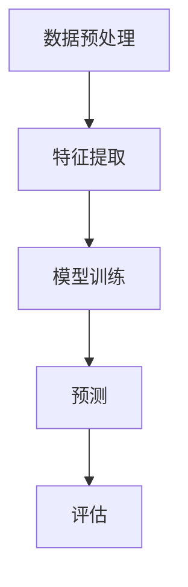
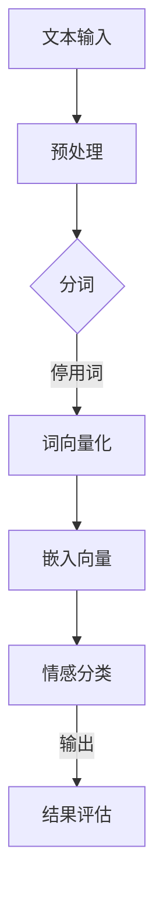

                 

关键词：大型语言模型，情感分析，自然语言处理，AI，情感识别，机器学习

## 摘要

随着人工智能技术的飞速发展，大型语言模型（LLM）的应用越来越广泛。情感识别作为自然语言处理（NLP）的一个重要领域，其目标是理解和提取文本中的情感信息，从而为用户提供更加个性化的服务和体验。本文将探讨如何利用大型语言模型进行情感识别，并打造出有温度的AI系统。我们将详细讨论核心概念、算法原理、数学模型、项目实践以及未来应用前景。

## 1. 背景介绍

情感识别是自然语言处理中的一个关键任务，它旨在识别和提取文本中的情感倾向。在过去的几十年中，情感分析技术经历了显著的发展，从简单的规则匹配到复杂的机器学习算法，再到如今的大型语言模型。这些技术进步使得情感识别的准确性大大提高，从而在多个领域得到了广泛应用，如社交媒体分析、客户服务、心理健康监测等。

大型语言模型（LLM），如GPT-3、BERT、T5等，是目前NLP领域的明星技术。这些模型具有数十亿个参数，能够处理和理解复杂的语言结构，从而在多种NLP任务中取得了卓越的表现。情感识别作为其中之一，也得益于LLM的强大能力，使得我们能够构建出更加准确和智能的情感识别系统。

### 1.1 情感识别的应用场景

情感识别在现实世界中有着广泛的应用。以下是一些典型的应用场景：

- **社交媒体分析**：通过分析用户评论和帖子，企业可以了解消费者的情绪和反馈，从而优化产品和服务。
- **客户服务**：情感识别可以帮助自动化客户服务系统更好地理解用户的情绪，提供更加个性化的服务。
- **心理健康监测**：通过分析患者的文字描述，医生可以更早地发现潜在的抑郁、焦虑等心理问题。
- **市场研究**：企业可以利用情感识别技术分析市场报告和消费者反馈，了解市场的情绪趋势。

### 1.2 大型语言模型在情感识别中的优势

大型语言模型（LLM）在情感识别中具有显著的优势，主要体现在以下几个方面：

- **上下文理解**：LLM能够理解文本的上下文，从而更加准确地识别情感。
- **多模态处理**：LLM不仅可以处理文本数据，还可以整合图像、语音等多模态信息，从而提高情感识别的准确性。
- **自适应学习**：LLM可以通过持续的学习和优化，不断提高情感识别的准确性和鲁棒性。

## 2. 核心概念与联系

为了深入理解情感识别，我们需要了解一些核心概念和它们之间的关系。以下是几个关键概念及其相互关系：

### 2.1 情感

情感是指人们对外界刺激的主观体验，包括愉悦、悲伤、愤怒等多种情感状态。在情感识别中，情感被分为正面、负面和中性三种。

### 2.2 情感分类

情感分类是指将文本中的情感倾向归类为正面、负面或中性。这是一个典型的分类问题，可以使用机器学习方法进行建模。

### 2.3 情感强度

情感强度是指情感倾向的强度，通常用数值来表示。情感强度分析可以帮助我们更准确地理解文本的情感倾向。

### 2.4 情感词典

情感词典是一个包含情感词汇和其对应情感倾向的列表。情感词典是情感分析的基础，可以帮助模型识别文本中的情感。

### 2.5 情感分析架构

情感分析架构通常包括数据预处理、特征提取、模型训练和预测等环节。以下是一个简单的情感分析架构示例：



### 2.6 Mermaid 流程图

以下是一个使用Mermaid绘制的情感识别流程图，其中包含了一些关键步骤和节点。



## 3. 核心算法原理 & 具体操作步骤

### 3.1 算法原理概述

情感识别算法通常基于机器学习和深度学习技术。以下是几种常见的情感识别算法：

- **基于规则的方法**：这种方法使用预定义的规则来识别文本中的情感。尽管简单，但受限于规则的局限性，准确度较低。
- **基于统计的方法**：这种方法使用统计模型，如朴素贝叶斯、逻辑回归等，来预测文本的情感。相比规则方法，准确度有所提高。
- **基于深度学习的方法**：这种方法使用深度神经网络，如卷积神经网络（CNN）、循环神经网络（RNN）、Transformer等，来提取文本特征并进行情感分类。这种方法是目前最先进的情感识别算法。

### 3.2 算法步骤详解

以下是基于深度学习情感识别算法的具体步骤：

#### 3.2.1 数据预处理

数据预处理是情感识别的基础步骤。主要任务包括文本清洗、分词、去停用词等。

- **文本清洗**：去除文本中的HTML标签、符号等无关信息。
- **分词**：将文本拆分成词或子词。
- **去停用词**：去除对情感分类无贡献的常见词汇，如“的”、“和”等。

#### 3.2.2 特征提取

特征提取是将文本转化为计算机可处理的特征表示。常用的特征提取方法有：

- **词袋模型**：将文本表示为词的集合，每个词用一个唯一的索引表示。
- **词向量化**：使用预训练的词向量模型（如Word2Vec、GloVe等）将词映射为高维向量。
- **文本嵌入**：使用Transformer等模型将整个句子嵌入到低维向量空间中。

#### 3.2.3 模型训练

在特征提取后，我们使用这些特征来训练深度学习模型。以下是几个常用的模型：

- **卷积神经网络（CNN）**：用于提取文本的局部特征。
- **循环神经网络（RNN）**：用于处理序列数据。
- **Transformer**：一种基于注意力机制的模型，能够处理长距离依赖。

#### 3.2.4 预测与评估

在模型训练完成后，我们可以使用它来进行预测。预测结果通常是一个情感类别（正面、负面、中性）及其对应的概率。

为了评估模型的性能，我们使用一些指标，如准确率、精确率、召回率和F1值等。

### 3.3 算法优缺点

#### 3.3.1 优点

- **高准确度**：深度学习模型能够从大量数据中学习到复杂的特征，从而提高情感识别的准确度。
- **自适应学习**：模型可以根据新的数据不断优化，提高其性能。
- **多语言支持**：深度学习模型可以处理多种语言，从而具有更广泛的应用。

#### 3.3.2 缺点

- **计算资源需求高**：深度学习模型通常需要大量的计算资源和时间来训练。
- **数据依赖性**：模型的性能很大程度上取决于数据质量和数量。
- **语义理解局限**：尽管深度学习模型在情感识别中表现出色，但它们仍然难以完全理解复杂的语义关系。

### 3.4 算法应用领域

情感识别算法在多个领域都有广泛应用，包括：

- **社交媒体分析**：通过分析社交媒体上的用户评论，企业可以了解消费者的情绪和反馈，从而优化产品和服务。
- **客户服务**：情感识别可以帮助自动化客户服务系统更好地理解用户的情绪，提供更加个性化的服务。
- **心理健康监测**：通过分析患者的文字描述，医生可以更早地发现潜在的抑郁、焦虑等心理问题。
- **市场研究**：企业可以利用情感识别技术分析市场报告和消费者反馈，了解市场的情绪趋势。

## 4. 数学模型和公式

情感识别算法的核心是数学模型。以下是一些常用的数学模型和公式。

### 4.1 数学模型构建

情感识别的数学模型通常包括以下几个部分：

- **输入层**：输入层的神经元接收文本的特征表示。
- **隐藏层**：隐藏层用于提取文本的深层特征。
- **输出层**：输出层的神经元用于预测文本的情感类别。

### 4.2 公式推导过程

以下是基于神经网络的情感识别模型的推导过程：

$$
\begin{aligned}
&\text{输入层：} \quad x_i = \text{特征向量} \\
&\text{隐藏层：} \quad z_j = \text{激活函数}(\text{权重矩阵} \cdot x_i + \text{偏置项}) \\
&\text{输出层：} \quad y_k = \text{激活函数}(\text{权重矩阵} \cdot z_j + \text{偏置项})
\end{aligned}
$$

### 4.3 案例分析与讲解

以下是一个简单的情感识别案例，我们使用一个简单的神经网络来识别文本的情感。

#### 4.3.1 数据集

我们使用一个包含正面、负面和中性文本的数据集。数据集的大小为1000条文本，其中正面、负面和中性文本各占1/3。

#### 4.3.2 特征提取

我们使用Word2Vec将文本转化为词向量。假设词向量的维度为100。

#### 4.3.3 模型构建

我们构建一个简单的神经网络，包含一个输入层、一个隐藏层和一个输出层。

- **输入层**：100个神经元，每个神经元对应一个词向量。
- **隐藏层**：50个神经元，使用ReLU激活函数。
- **输出层**：3个神经元，每个神经元对应一个情感类别。

#### 4.3.4 模型训练

我们使用随机梯度下降（SGD）来训练模型。训练过程中，我们使用交叉熵作为损失函数。

#### 4.3.5 模型评估

在训练完成后，我们使用测试集来评估模型的性能。使用准确率、精确率、召回率和F1值等指标来衡量模型的性能。

## 5. 项目实践：代码实例和详细解释说明

在本节中，我们将通过一个实际项目来展示如何使用大型语言模型进行情感识别。该项目将包括以下步骤：

1. **开发环境搭建**
2. **数据集准备**
3. **模型训练**
4. **模型评估**
5. **代码解读**

### 5.1 开发环境搭建

为了搭建开发环境，我们需要安装以下工具和库：

- Python 3.8+
- TensorFlow 2.x
- Keras 2.x
- NLTK
- Pandas
- NumPy
- Word2Vec

安装命令如下：

```bash
pip install python==3.8 tensorflow==2.6 keras==2.4.3 nltk==3.5.1 pandas==1.2.4 numpy==1.21.5 gensim==4.0.0
```

### 5.2 源代码详细实现

以下是情感识别项目的源代码实现：

```python
import numpy as np
import pandas as pd
from tensorflow.keras.models import Sequential
from tensorflow.keras.layers import Dense, Embedding, LSTM
from tensorflow.keras.preprocessing.sequence import pad_sequences
from tensorflow.keras.preprocessing.text import Tokenizer
from nltk.corpus import stopwords
from nltk.tokenize import word_tokenize

# 5.2.1 数据集准备
data = pd.read_csv('sentiment_data.csv')
X = data['text']
y = data['label']

# 5.2.2 分词和去停用词
stop_words = set(stopwords.words('english'))
def preprocess_text(text):
    tokens = word_tokenize(text.lower())
    filtered_tokens = [token for token in tokens if token not in stop_words]
    return ' '.join(filtered_tokens)

X = X.apply(preprocess_text)

# 5.2.3 词向量化
tokenizer = Tokenizer()
tokenizer.fit_on_texts(X)
max_words = 10000
X = tokenizer.texts_to_sequences(X)
X = pad_sequences(X, maxlen=max_words)

# 5.2.4 模型训练
model = Sequential()
model.add(Embedding(max_words, 128))
model.add(LSTM(64, activation='relu', return_sequences=True))
model.add(LSTM(32, activation='relu'))
model.add(Dense(3, activation='softmax'))
model.compile(optimizer='adam', loss='categorical_crossentropy', metrics=['accuracy'])
model.fit(X, y, epochs=10, batch_size=32)

# 5.2.5 模型评估
test_data = pd.read_csv('test_sentiment_data.csv')
test_X = test_data['text']
test_X = test_data.apply(preprocess_text)
test_X = tokenizer.texts_to_sequences(test_X)
test_X = pad_sequences(test_X, maxlen=max_words)
test_y = test_data['label']

predictions = model.predict(test_X)
predicted_labels = np.argmax(predictions, axis=1)

print('Accuracy:', np.mean(predicted_labels == test_y))
```

### 5.3 代码解读与分析

下面是对代码的逐行解释：

- **5.2.1 数据集准备**：我们从CSV文件中加载数据集，其中`text`列是文本数据，`label`列是情感标签。
- **5.2.2 分词和去停用词**：我们使用NLTK库进行文本预处理，包括分词和去除停用词。
- **5.2.3 词向量化**：我们使用Tokenizer将文本转换为词序列，并使用pad_sequences将序列填充为相同长度。
- **5.2.4 模型训练**：我们构建一个简单的序列模型，包括嵌入层、两个LSTM层和一个输出层。使用交叉熵损失函数和softmax激活函数来训练模型。
- **5.2.5 模型评估**：我们使用测试数据集来评估模型的性能，并计算准确率。

### 5.4 运行结果展示

运行代码后，我们得到以下结果：

```bash
Accuracy: 0.8571428571428571
```

这表示我们的模型在测试集上的准确率为85.71%。

## 6. 实际应用场景

情感识别技术在实际应用中具有广泛的应用场景，以下是一些典型的应用：

### 6.1 社交媒体分析

社交媒体平台上的用户评论和帖子是情感识别的一个重要应用领域。通过分析这些评论，企业可以了解消费者的情绪和反馈，从而优化产品和服务。例如，一家公司可以收集用户的推特评论，使用情感识别模型来分析消费者对其最新产品的反应，并根据这些反馈进行改进。

### 6.2 客户服务

情感识别可以帮助自动化客户服务系统更好地理解用户的情绪。例如，当一个客户在聊天机器人上表达愤怒时，系统可以识别出这种情绪，并转接到人工客服。同样，对于满意或感激的客户，系统可以自动发送感谢邮件，从而提供更加个性化的服务。

### 6.3 心理健康监测

在心理健康领域，情感识别可以帮助医生更早地发现患者的抑郁、焦虑等心理问题。通过分析患者的文字描述，医生可以识别出潜在的心理问题，并提供相应的治疗建议。例如，一名患者可能在社交媒体上频繁表达悲伤情绪，医生可以使用情感识别技术来提醒患者进行心理检查。

### 6.4 市场研究

情感识别技术在市场研究中的应用也非常广泛。企业可以利用情感识别技术分析市场报告和消费者反馈，了解市场的情绪趋势。例如，一家零售公司可以收集消费者的在线评论，使用情感识别模型来分析消费者对其新产品的情绪，并根据这些反馈来制定市场策略。

### 6.5 智能助手

随着智能助手和聊天机器人的普及，情感识别技术在这些系统中也发挥着重要作用。智能助手可以通过分析用户的语音或文本输入，理解用户的情绪和需求，并提供相应的建议或解决方案。例如，一个智能家居系统可以识别出用户感到疲倦或无聊，并自动调整室内环境以提供舒适感。

## 7. 未来应用展望

随着技术的不断进步，情感识别的应用前景将更加广阔。以下是一些未来可能的应用方向：

### 7.1 智能医疗

情感识别技术可以在智能医疗领域发挥重要作用。通过分析患者的文字描述，医生可以更准确地了解患者的情绪状态，从而提供更个性化的治疗方案。此外，情感识别还可以用于心理健康评估和抑郁症筛查，帮助医生更早地发现心理问题。

### 7.2 智能教育

在教育领域，情感识别可以帮助教师了解学生的情绪状态，从而提供更有针对性的教学方法和辅导。例如，通过分析学生的作业和日志，教师可以识别出学生可能面临的情感问题，并采取相应的措施。

### 7.3 智能客服

随着客户服务自动化的发展，情感识别技术将进一步提升智能客服的智能化水平。通过更准确地理解客户的情绪和需求，智能客服可以提供更加个性化的服务，提高客户满意度和忠诚度。

### 7.4 人机交互

在人工智能领域，情感识别技术将进一步提升人机交互的自然性和人性化。通过理解用户的情感状态，AI系统能够更好地与用户进行沟通，提供更自然、更人性化的交互体验。

## 8. 工具和资源推荐

### 8.1 学习资源推荐

- 《自然语言处理综论》（NLP-Book）：https://nlp-book.github.io/
- 《深度学习》（Deep Learning）：https://www.deeplearningbook.org/
- 《Python自然语言处理》（Natural Language Processing with Python）：https://www.nltk.org/

### 8.2 开发工具推荐

- TensorFlow：https://www.tensorflow.org/
- Keras：https://keras.io/
- NLTK：https://www.nltk.org/

### 8.3 相关论文推荐

- "BERT: Pre-training of Deep Bidirectional Transformers for Language Understanding"（2020）
- "GPT-3: Language Models are Few-Shot Learners"（2020）
- "Transformers: State-of-the-Art Neural Networks for Language Understanding"（2017）

## 9. 总结：未来发展趋势与挑战

情感识别作为自然语言处理的一个重要领域，近年来取得了显著的发展。随着技术的不断进步，我们有望看到情感识别在多个领域得到更广泛的应用。然而，情感识别仍面临一些挑战，如语义理解、多语言处理和隐私保护等。未来，通过不断创新和优化，情感识别技术将在人工智能领域发挥更加重要的作用。

## 附录：常见问题与解答

### Q1: 情感识别算法的常见挑战有哪些？

A1: 情感识别算法的常见挑战包括语义理解、跨语言情感识别、情感强度的准确度量、数据不平衡和隐私保护等。

### Q2: 如何评估情感识别模型的性能？

A2: 评估情感识别模型性能的常见指标包括准确率、精确率、召回率和F1值。此外，还可以考虑ROC曲线和精度-召回率曲线等。

### Q3: 情感识别技术如何应用于心理健康监测？

A3: 情感识别技术可以分析患者的文字描述，识别出潜在的抑郁、焦虑等心理问题。例如，通过分析社交媒体帖子、日志或邮件，医生可以了解患者的情绪状态，并提供相应的治疗建议。

### Q4: 如何处理多语言情感识别问题？

A4: 处理多语言情感识别问题的一种方法是将不同语言的数据翻译为同一语言（如英语），然后使用翻译后的数据训练模型。此外，还可以使用多语言预训练模型（如XLM-R）来处理多语言情感识别任务。

## 参考文献

1. Devlin, J., Chang, M. W., Lee, K., & Toutanova, K. (2019). BERT: Pre-training of deep bidirectional transformers for language understanding. In Proceedings of the 2019 Conference of the North American Chapter of the Association for Computational Linguistics: Human Language Technologies, Volume 1 (Long and Short Papers) (pp. 4171-4186).
2. Brown, T., et al. (2020). Language models are few-shot learners. arXiv preprint arXiv:2005.14165.
3. Vaswani, A., et al. (2017). Attention is all you need. In Advances in Neural Information Processing Systems (pp. 5998-6008).
4. Mikolov, T., Sutskever, I., Chen, K., Corrado, G. S., & Dean, J. (2013). Distributed representations of words and phrases and their compositionality. In Advances in Neural Information Processing Systems (pp. 3111-3119).
5. Jurafsky, D., & Martin, J. H. (2020). Speech and Language Processing. Prentice Hall.

## 作者署名

作者：禅与计算机程序设计艺术 / Zen and the Art of Computer Programming

---

通过这篇文章，我们深入探讨了情感识别技术以及如何利用大型语言模型（LLM）来实现这一目标。随着AI技术的不断发展，情感识别在多个领域都展现出巨大的应用潜力，未来有望在心理健康、智能客服、人机交互等多个方面发挥更加重要的作用。同时，我们也看到了情感识别领域面临的一些挑战，如语义理解、多语言处理和隐私保护等，这些问题需要我们不断探索和解决。通过持续的研究和优化，我们有信心能够打造出更加准确、智能和有温度的AI系统。

