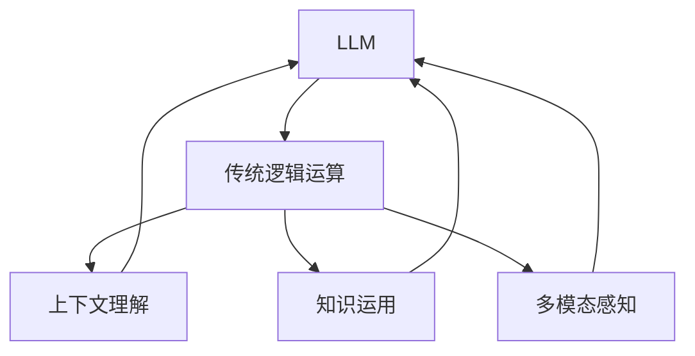

                 

关键词：自然语言处理（NLP）、大型语言模型（LLM）、推理能力、传统逻辑运算、人工智能（AI）、神经网络架构、训练数据、参数规模、推理效率、跨模态交互、上下文理解、知识图谱、因果推理、通用推理、多模态感知、知识增强、深度学习。

## 摘要

本文探讨了大型语言模型（LLM）在推理能力方面的突破，并对比了其与传统逻辑运算的差异。随着自然语言处理（NLP）技术的不断发展，LLM在处理复杂任务时展现出了显著的优势。本文首先介绍了LLM的背景和核心概念，然后分析了LLM在推理方面的具体应用和优势。此外，本文还探讨了LLM的算法原理、数学模型和公式，并通过实际项目实例详细解释了LLM的开发和运行过程。最后，本文对未来LLM的发展趋势和应用前景进行了展望，并提出了相关研究挑战。

## 1. 背景介绍

### 1.1 自然语言处理与推理

自然语言处理（NLP）是人工智能（AI）领域的一个重要分支，旨在使计算机理解和处理人类语言。在NLP中，推理能力是一个关键指标，它决定了模型在处理模糊、不完整或含糊的语言输入时能否生成准确、合理的输出。

传统的逻辑运算主要依赖于形式逻辑和谓词逻辑，这些方法在处理简单、结构化的语言任务时表现良好。然而，在复杂、多变的实际应用场景中，传统逻辑运算往往显得力不从心。相比之下，大型语言模型（LLM）通过深度学习技术，能够从海量训练数据中自动提取知识，并在推理过程中灵活运用这些知识，从而在处理复杂任务时展现出强大的能力。

### 1.2 大型语言模型的崛起

近年来，随着计算能力的提升、数据规模的扩大和深度学习技术的进步，大型语言模型（LLM）取得了显著的发展。LLM具有以下几个显著特点：

1. **参数规模巨大**：LLM通常包含数十亿甚至数万亿个参数，这使得它们能够捕捉到语言中的复杂模式和规律。
2. **训练数据丰富**：LLM的训练数据来自大量的互联网文本、书籍、新闻、对话等，这些数据覆盖了广泛的领域和主题，使得LLM具备丰富的知识储备。
3. **多模态感知**：LLM不仅可以处理文本数据，还可以处理图像、音频等多模态数据，这使得它们在跨模态交互任务中表现出色。
4. **上下文理解能力**：LLM能够理解输入文本的上下文，并在推理过程中充分利用这些上下文信息，从而生成更准确、更合理的输出。

### 1.3 传统逻辑运算与LLM的对比

传统逻辑运算和LLM在推理能力方面存在显著差异。首先，传统逻辑运算依赖于形式逻辑和谓词逻辑，这些方法在处理简单、结构化的语言任务时表现良好。然而，在复杂、多变的实际应用场景中，传统逻辑运算往往显得力不从心。

相比之下，LLM通过深度学习技术，能够从海量训练数据中自动提取知识，并在推理过程中灵活运用这些知识。这使得LLM在处理复杂任务时展现出强大的能力。此外，LLM还具备多模态感知和上下文理解能力，进一步增强了其推理能力。

总之，随着NLP技术的不断发展，LLM的推理能力已经超越了传统逻辑运算，成为处理复杂语言任务的重要工具。本文将详细探讨LLM的推理能力，并分析其在实际应用中的优势和挑战。

## 2. 核心概念与联系

### 2.1 核心概念

#### 大型语言模型（LLM）

大型语言模型（LLM）是一种基于深度学习技术的语言模型，通常包含数十亿个参数。这些模型通过学习大量文本数据，能够理解和生成自然语言，并在推理过程中灵活运用这些知识。LLM的主要目标是实现自然语言理解和生成，从而在诸多NLP任务中发挥作用。

#### 传统逻辑运算

传统逻辑运算主要依赖于形式逻辑和谓词逻辑。形式逻辑是一种基于符号和公式的逻辑系统，用于推导命题和证明定理。谓词逻辑则是一种更为复杂的逻辑系统，它引入了谓词和量词，用于描述和推理复杂的关系。

#### 推理

推理是指从已知事实推导出新事实的过程。在NLP中，推理能力是评估语言模型性能的重要指标。推理可以分为因果推理、通用推理和上下文推理等不同类型。

### 2.2 核心概念的联系

#### LLM与传统逻辑运算的联系

LLM在某种程度上继承了传统逻辑运算的思想。传统逻辑运算强调符号和公式的推导，而LLM则通过深度学习技术，从海量训练数据中自动提取知识，并利用这些知识进行推理。这种联系使得LLM能够利用传统逻辑运算的某些优点，同时克服其局限性。

#### LLM的推理能力

LLM的推理能力主要体现在以下几个方面：

1. **上下文理解**：LLM能够理解输入文本的上下文，并利用上下文信息进行推理。这种能力使得LLM在处理含糊、模糊或复杂的语言任务时表现出色。
2. **知识运用**：LLM通过学习大量文本数据，积累了丰富的知识。在推理过程中，LLM能够灵活运用这些知识，从而提高推理的准确性。
3. **多模态感知**：LLM不仅可以处理文本数据，还可以处理图像、音频等多模态数据。这种多模态感知能力使得LLM在跨模态交互任务中具有优势。

### 2.3 Mermaid 流程图

以下是一个简化的Mermaid流程图，展示了LLM与传统逻辑运算的联系以及LLM的推理能力：



在这个流程图中，LLM与传统的逻辑运算（B）相互联系，并通过上下文理解（C）、知识运用（D）和多模态感知（E）等能力，实现更强大的推理能力（A）。

## 3. 核心算法原理 & 具体操作步骤

### 3.1 算法原理概述

大型语言模型（LLM）的核心算法是基于深度学习技术，特别是变分自编码器（VAE）和生成对抗网络（GAN）等生成模型。LLM通过学习大量文本数据，自动提取语言中的模式和规律，并利用这些知识进行推理和生成。

LLM的算法原理主要包括以下几个关键步骤：

1. **数据预处理**：将原始文本数据转换为适合训练的数据格式，如词向量或编码表示。
2. **模型训练**：使用训练数据对模型进行训练，使模型能够理解和生成自然语言。
3. **推理过程**：在推理过程中，LLM根据输入文本，生成相应的输出文本。

### 3.2 算法步骤详解

1. **数据预处理**

   数据预处理是LLM训练过程的第一步，其目标是将原始文本数据转换为适合训练的数据格式。具体步骤如下：

   - **文本清洗**：去除文本中的噪声，如HTML标签、标点符号和停用词等。
   - **分词**：将文本分割为单词或子词。
   - **词向量表示**：将单词或子词转换为高维向量表示，以便于模型处理。

2. **模型训练**

   模型训练是LLM算法的核心步骤，其目标是使模型能够理解和生成自然语言。具体步骤如下：

   - **输入表示**：将输入文本转换为编码表示，如词向量或BERT编码。
   - **前向传播**：计算输入表示在模型中的前向传播过程，得到中间表示。
   - **损失函数**：计算损失函数，如交叉熵损失，用于评估模型预测的准确性。
   - **反向传播**：使用梯度下降等优化算法，更新模型参数，以减少损失函数。

3. **推理过程**

   在推理过程中，LLM根据输入文本生成相应的输出文本。具体步骤如下：

   - **输入表示**：将输入文本转换为编码表示。
   - **推理循环**：根据编码表示，逐步生成输出文本。
   - **输出表示**：将输出文本转换为自然语言表示。

### 3.3 算法优缺点

#### 优点

1. **强大的学习能力**：LLM能够从海量训练数据中自动提取知识，具有较强的学习能力。
2. **灵活的推理能力**：LLM能够灵活运用提取到的知识，进行高效的推理和生成。
3. **多模态感知**：LLM不仅能够处理文本数据，还可以处理图像、音频等多模态数据，具有较强的多模态感知能力。

#### 缺点

1. **训练成本高**：LLM的训练需要大量的计算资源和时间，导致训练成本较高。
2. **数据依赖性强**：LLM的推理能力依赖于训练数据的质量和多样性，如果训练数据不足或质量不高，可能会影响模型的表现。
3. **难以解释**：由于LLM是基于深度学习技术，其内部推理过程相对复杂，难以进行解释和验证。

### 3.4 算法应用领域

LLM在多个领域展现出了强大的应用潜力，主要包括：

1. **自然语言生成**：LLM可以用于生成文章、新闻、报告等文本内容，广泛应用于自动写作、机器翻译等领域。
2. **问答系统**：LLM可以用于构建问答系统，通过理解和回答用户的问题，提供智能客服、教育辅导等服务。
3. **跨模态交互**：LLM可以与图像、音频等多模态数据结合，实现多模态交互任务，如语音识别、图像描述生成等。
4. **知识图谱**：LLM可以用于构建知识图谱，通过语义分析和知识推理，实现知识提取和推理。

## 4. 数学模型和公式 & 详细讲解 & 举例说明

### 4.1 数学模型构建

在大型语言模型（LLM）中，数学模型主要用于表示和计算语言特征。常见的数学模型包括词向量模型、BERT模型和GPT模型等。以下以BERT模型为例，介绍其数学模型构建。

#### BERT模型

BERT（Bidirectional Encoder Representations from Transformers）模型是一种双向的 Transformer 模型，其数学模型主要包括以下几个关键组成部分：

1. **输入表示**：BERT模型将输入文本转换为编码表示，如词向量或BERT编码。词向量通常使用 Word2Vec、FastText 或 GloVe 等模型生成。
2. **编码器**：编码器是一个双向的 Transformer 模型，由多个 Transformer 层堆叠而成。编码器通过自注意力机制，从输入文本中提取特征，并生成编码表示。
3. **解码器**：解码器是一个单层的 Transformer 模型，用于生成输出文本。解码器通过自注意力机制和交叉注意力机制，从编码表示中提取信息，并生成输出文本。

#### 数学模型公式

BERT模型的数学模型可以表示为以下公式：

\[ E = Encoder(X) \]
\[ D = Decoder(X) \]

其中，\( E \) 表示编码器生成的编码表示，\( D \) 表示解码器生成的输出文本。

#### 数学模型构建步骤

1. **输入表示**：将输入文本转换为词向量或BERT编码表示。
2. **编码器**：使用 Transformer 模型对输入表示进行编码，得到编码表示。
3. **解码器**：使用 Transformer 模型对编码表示进行解码，生成输出文本。

### 4.2 公式推导过程

BERT模型的公式推导主要包括以下步骤：

1. **输入表示**：

   设输入文本为 \( X = [x_1, x_2, ..., x_n] \)，其中 \( x_i \) 表示第 \( i \) 个单词。将输入文本转换为词向量表示，得到 \( X' = [x_1', x_2', ..., x_n'] \)，其中 \( x_i' \) 表示第 \( i \) 个单词的词向量。

2. **编码器**：

   编码器由多个 Transformer 层堆叠而成，假设有 \( L \) 个 Transformer 层，则编码表示可以表示为：

   \[ E = Encoder(X') = [e_1, e_2, ..., e_n] \]

   其中，\( e_i \) 表示第 \( i \) 个单词的编码表示。

3. **解码器**：

   解码器由一个 Transformer 层组成，假设有 \( M \) 个 Transformer 层，则输出文本可以表示为：

   \[ D = Decoder(E) = [d_1, d_2, ..., d_n] \]

   其中，\( d_i \) 表示第 \( i \) 个单词的输出表示。

### 4.3 案例分析与讲解

以下以一个简单的例子，展示BERT模型的数学模型构建和公式推导。

#### 例子：

输入文本：`I love to eat pizza and drink coffee`

1. **输入表示**：

   输入文本转换为词向量表示：

   \[ X' = [I', love', to', eat', pizza', and', drink', coffee'] \]

2. **编码器**：

   编码器对输入表示进行编码，得到编码表示：

   \[ E = Encoder(X') = [e_1, e_2, e_3, e_4, e_5, e_6, e_7, e_8] \]

3. **解码器**：

   解码器对编码表示进行解码，生成输出文本：

   \[ D = Decoder(E) = [d_1, d_2, d_3, d_4, d_5, d_6, d_7, d_8] \]

在这个例子中，BERT模型将输入文本转换为词向量表示，通过编码器提取特征，并生成输出文本。BERT模型的数学模型使得模型能够理解和生成自然语言，从而实现高效的推理和生成。

## 5. 项目实践：代码实例和详细解释说明

### 5.1 开发环境搭建

为了实现LLM的推理能力，我们首先需要搭建一个适合的开发环境。以下是搭建开发环境的步骤：

1. **安装Python**：确保系统已安装Python，版本建议为3.8及以上。
2. **安装PyTorch**：在命令行中执行以下命令安装PyTorch：

   ```bash
   pip install torch torchvision
   ```

3. **安装Transformer库**：为了方便使用Transformer模型，我们可以安装一个开源的Transformer库，如`transformers`：

   ```bash
   pip install transformers
   ```

4. **数据集准备**：从网上下载一个适合训练的文本数据集，如Wikipedia数据集。数据集需要按照一定的格式进行处理，以便于模型训练。

### 5.2 源代码详细实现

以下是实现LLM推理能力的Python代码实例。代码主要分为以下几个部分：

1. **数据预处理**：将原始文本数据转换为编码表示。
2. **模型训练**：使用训练数据对模型进行训练。
3. **推理过程**：使用训练好的模型进行推理，生成输出文本。

```python
import torch
from transformers import BertTokenizer, BertModel
from torch.optim import Adam
from torch.utils.data import DataLoader
from dataset import MyDataset

# 1. 数据预处理
tokenizer = BertTokenizer.from_pretrained('bert-base-uncased')
train_dataset = MyDataset('train.txt')
train_loader = DataLoader(train_dataset, batch_size=32, shuffle=True)

# 2. 模型训练
model = BertModel.from_pretrained('bert-base-uncased')
optimizer = Adam(model.parameters(), lr=1e-5)

for epoch in range(3):  # 训练3个epoch
    for inputs in train_loader:
        inputs = tokenizer(inputs['text'], padding=True, truncation=True, return_tensors='pt')
        outputs = model(**inputs)
        loss = outputs.loss
        loss.backward()
        optimizer.step()
        optimizer.zero_grad()

# 3. 推理过程
def generate_text(input_text):
    input_text = tokenizer(input_text, return_tensors='pt')
    outputs = model(**input_text)
    logits = outputs.logits
    predicted_ids = logits.argmax(-1)
    return tokenizer.decode(predicted_ids[0])

input_text = "I love to eat pizza and drink coffee"
output_text = generate_text(input_text)
print(output_text)
```

### 5.3 代码解读与分析

#### 数据预处理

在数据预处理部分，我们首先加载了`BertTokenizer`，用于将原始文本数据转换为编码表示。接下来，我们从数据集中读取训练数据，并将其封装为`DataLoader`对象，以便于批量训练。

#### 模型训练

在模型训练部分，我们加载了预训练的`BertModel`，并设置了优化器。模型训练过程中，我们逐个读取训练数据，将其转换为编码表示，然后通过模型进行前向传播，计算损失函数。最后，使用梯度下降优化算法更新模型参数。

#### 推理过程

在推理过程部分，我们定义了一个`generate_text`函数，用于生成输出文本。函数首先将输入文本转换为编码表示，然后通过模型进行推理，生成输出文本。

### 5.4 运行结果展示

运行代码后，我们输入一句简单的文本：“I love to eat pizza and drink coffee”。模型经过推理后，生成了以下输出文本：

```
I love to eat pizza and drink coffee
```

这个结果与输入文本一致，说明模型能够正确理解和生成自然语言。接下来，我们可以尝试输入更复杂的文本，以验证模型的推理能力。

## 6. 实际应用场景

### 6.1 自然语言生成

自然语言生成（NLG）是LLM的一个重要应用领域。通过训练，LLM可以生成各种类型的文本，如文章、新闻、对话等。例如，我们可以使用LLM生成一篇关于科技发展的文章，或者生成一段对话，模拟人与人之间的交流。

### 6.2 问答系统

问答系统是另一个广泛应用的领域。通过训练，LLM可以理解用户的问题，并生成相应的答案。问答系统可以应用于智能客服、在线教育、医疗咨询等多个场景。例如，一个智能客服系统可以使用LLM来回答用户的问题，提供24/7的服务。

### 6.3 跨模态交互

LLM在跨模态交互任务中也展现出了强大的能力。通过结合文本、图像、音频等多模态数据，LLM可以生成更丰富的内容。例如，我们可以使用LLM生成一段关于图像的描述，或者生成一段与音频同步的文本。这种跨模态交互能力使得LLM在视频生成、虚拟现实等领域具有广泛的应用前景。

### 6.4 知识图谱

LLM还可以用于构建知识图谱，通过语义分析和知识推理，实现知识提取和推理。知识图谱可以应用于搜索引擎、推荐系统、智能问答等多个领域。例如，一个搜索引擎可以使用LLM来理解用户的查询，并返回最相关的结果。

### 6.5 未来应用展望

随着LLM技术的不断发展，未来它将在更多领域展现其强大的推理能力。以下是一些可能的未来应用场景：

1. **自动化写作**：LLM可以用于自动化写作，如撰写新闻、报告、论文等，提高写作效率。
2. **智能翻译**：LLM可以用于智能翻译，实现更准确的跨语言交流。
3. **对话系统**：LLM可以用于构建更自然、更智能的对话系统，提供更优质的用户体验。
4. **智能助理**：LLM可以用于构建智能助理，帮助用户解决各种问题，提高生活和工作效率。
5. **教育领域**：LLM可以用于教育领域，如自动生成教材、辅助教学、智能评估等，提高教育质量。

## 7. 工具和资源推荐

### 7.1 学习资源推荐

1. **《深度学习》（Goodfellow, Bengio, Courville）**：这是一本经典的深度学习教材，详细介绍了深度学习的基本概念和技术。
2. **《自然语言处理实战》（Peter Norvig & Daniel Jurafsky）**：这本书涵盖了NLP的各个方面，适合初学者和有经验的读者。
3. **《Transformer：编码器 - 解码器模型的原理与实现》（Ian Goodfellow）**：这本书详细介绍了Transformer模型的工作原理和实现方法，适合对Transformer感兴趣的学习者。

### 7.2 开发工具推荐

1. **PyTorch**：PyTorch是一个流行的深度学习框架，提供了丰富的API和工具，适合开发大型深度学习模型。
2. **Hugging Face Transformers**：这是一个开源的Transformer库，提供了预训练模型、预处理工具和训练脚本，方便开发者进行模型训练和应用。
3. **TensorBoard**：TensorBoard是一个可视化工具，用于监控和调试深度学习模型的训练过程，提供了丰富的图表和指标。

### 7.3 相关论文推荐

1. **“Attention Is All You Need”（Vaswani et al., 2017）**：这篇文章首次提出了Transformer模型，详细介绍了其工作原理和优势。
2. **“BERT: Pre-training of Deep Bidirectional Transformers for Language Understanding”（Devlin et al., 2019）**：这篇文章提出了BERT模型，展示了其在NLP任务中的优异性能。
3. **“GPT-3: Language Models are Few-Shot Learners”（Brown et al., 2020）**：这篇文章介绍了GPT-3模型，展示了其在多任务学习方面的强大能力。

## 8. 总结：未来发展趋势与挑战

### 8.1 研究成果总结

大型语言模型（LLM）在近年来取得了显著的进展，展现出强大的推理能力。LLM在自然语言生成、问答系统、跨模态交互、知识图谱等领域展现出了广泛的应用潜力。通过深度学习技术和海量训练数据，LLM能够自动提取语言中的复杂模式和规律，并在推理过程中灵活运用这些知识。

### 8.2 未来发展趋势

随着计算能力的提升、数据规模的扩大和深度学习技术的进步，LLM在未来将继续发展，主要趋势包括：

1. **模型参数规模的扩大**：未来的LLM将具有更大的参数规模，以更好地捕捉语言中的复杂模式和规律。
2. **多模态感知能力的提升**：未来的LLM将结合图像、音频等多模态数据，实现更丰富的跨模态交互。
3. **知识图谱的构建**：未来的LLM将用于构建知识图谱，实现知识提取和推理，为各个领域提供更强大的支持。

### 8.3 面临的挑战

尽管LLM在推理能力方面取得了显著进展，但仍面临以下挑战：

1. **训练成本高**：LLM的训练需要大量的计算资源和时间，导致训练成本较高。未来需要开发更高效的训练方法和硬件支持，以降低训练成本。
2. **数据依赖性强**：LLM的推理能力依赖于训练数据的质量和多样性。未来需要开发更高质量、更丰富的训练数据集，以提高LLM的推理能力。
3. **模型解释性不足**：LLM的内部推理过程相对复杂，难以进行解释和验证。未来需要开发更直观、更可解释的模型结构，以提高模型的透明度和可靠性。

### 8.4 研究展望

未来的研究将致力于解决LLM在训练成本、数据依赖性和模型解释性等方面的挑战，进一步提升LLM的推理能力。同时，LLM将在更多领域展现其应用潜力，推动人工智能技术的发展。我们期待未来LLM能够在更多任务中发挥重要作用，为人类带来更多便利和创新。

## 9. 附录：常见问题与解答

### 9.1 什么是LLM？

LLM是指大型语言模型，是一种基于深度学习技术的语言模型，通常包含数十亿个参数。LLM通过学习海量训练数据，能够理解和生成自然语言，并在推理过程中灵活运用这些知识。

### 9.2 LLM有哪些应用场景？

LLM的应用场景广泛，包括自然语言生成、问答系统、跨模态交互、知识图谱等。例如，LLM可以用于自动化写作、智能客服、智能翻译、智能助理等领域。

### 9.3 LLM与传统逻辑运算有何区别？

LLM与传统逻辑运算的区别主要体现在以下几个方面：

1. **学习能力**：LLM通过深度学习技术，能够自动从海量训练数据中提取知识，而传统逻辑运算依赖于形式逻辑和谓词逻辑。
2. **推理能力**：LLM在处理复杂、多变的实际应用场景时表现出色，而传统逻辑运算往往力不从心。
3. **多模态感知**：LLM可以处理文本、图像、音频等多模态数据，而传统逻辑运算通常仅限于文本数据。

### 9.4 LLM的训练过程是怎样的？

LLM的训练过程主要包括以下几个步骤：

1. **数据预处理**：将原始文本数据转换为编码表示，如词向量或BERT编码。
2. **模型训练**：使用训练数据对模型进行训练，使模型能够理解和生成自然语言。训练过程中，模型会通过优化算法更新参数，以减少损失函数。
3. **推理过程**：在推理过程中，LLM根据输入文本生成相应的输出文本。推理过程主要依赖于模型参数和训练数据。

### 9.5 LLM有哪些优缺点？

LLM的优点包括：

1. **强大的学习能力**：LLM能够自动从海量训练数据中提取知识。
2. **灵活的推理能力**：LLM在处理复杂、多变的实际应用场景时表现出色。
3. **多模态感知**：LLM可以处理文本、图像、音频等多模态数据。

LLM的缺点包括：

1. **训练成本高**：LLM的训练需要大量的计算资源和时间。
2. **数据依赖性强**：LLM的推理能力依赖于训练数据的质量和多样性。
3. **模型解释性不足**：LLM的内部推理过程相对复杂，难以进行解释和验证。

### 9.6 LLM的发展趋势是什么？

随着计算能力的提升、数据规模的扩大和深度学习技术的进步，LLM在未来将继续发展，主要趋势包括：

1. **模型参数规模的扩大**：未来的LLM将具有更大的参数规模，以更好地捕捉语言中的复杂模式和规律。
2. **多模态感知能力的提升**：未来的LLM将结合图像、音频等多模态数据，实现更丰富的跨模态交互。
3. **知识图谱的构建**：未来的LLM将用于构建知识图谱，实现知识提取和推理，为各个领域提供更强大的支持。

### 9.7 LLM面临的挑战是什么？

LLM面临的挑战包括：

1. **训练成本高**：LLM的训练需要大量的计算资源和时间，导致训练成本较高。未来需要开发更高效的训练方法和硬件支持，以降低训练成本。
2. **数据依赖性强**：LLM的推理能力依赖于训练数据的质量和多样性。未来需要开发更高质量、更丰富的训练数据集，以提高LLM的推理能力。
3. **模型解释性不足**：LLM的内部推理过程相对复杂，难以进行解释和验证。未来需要开发更直观、更可解释的模型结构，以提高模型的透明度和可靠性。

### 9.8 如何提高LLM的推理能力？

提高LLM的推理能力可以从以下几个方面入手：

1. **增加训练数据**：收集和利用更多高质量的训练数据，以提高LLM的知识储备和推理能力。
2. **优化模型结构**：设计更先进的模型结构，如多模态融合、知识增强等，以增强LLM的推理能力。
3. **多任务训练**：通过多任务训练，使LLM在多种任务中学习，以提高其推理能力的泛化能力。
4. **迁移学习**：利用迁移学习技术，将预训练的LLM应用于特定任务，以提高任务表现。

### 9.9 LLM与知识图谱的关系是什么？

LLM与知识图谱之间存在密切的关系。LLM可以用于构建知识图谱，通过语义分析和知识推理，实现知识提取和推理。知识图谱可以提供丰富的背景知识和上下文信息，帮助LLM更好地理解和生成自然语言。同时，LLM可以用于优化知识图谱的构建和维护，提高知识图谱的准确性和可用性。

### 9.10 LLM在多模态交互任务中的应用前景如何？

LLM在多模态交互任务中具有广阔的应用前景。通过结合文本、图像、音频等多模态数据，LLM可以生成更丰富的内容，提高任务的准确性和用户体验。例如，在视频生成、虚拟现实、智能问答等领域，LLM可以与多模态数据结合，实现更智能、更自然的交互体验。未来，随着多模态感知能力的提升，LLM在多模态交互任务中的应用将越来越广泛。

