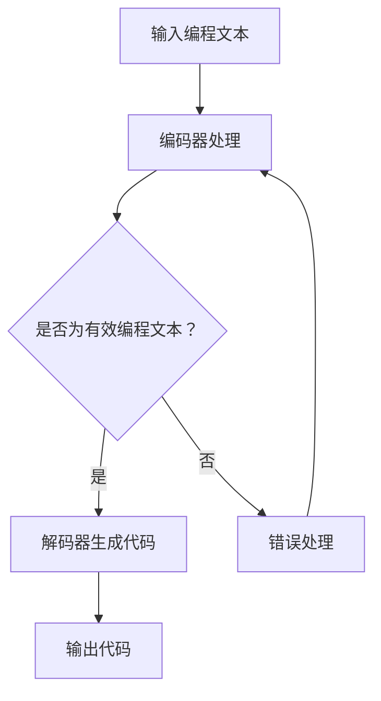

                 

关键词：大型语言模型，AI技术，指令集，智能编程，自动编程，代码生成，代码优化，人工智能应用

> 摘要：本文深入探讨了一种革命性的AI技术——大型语言模型（LLM），它如何超越传统指令集的束缚，为编程领域带来无限可能。文章将介绍LLM的核心概念、工作原理，以及其在智能编程、代码生成、代码优化等领域的实际应用。通过详细的分析和案例展示，本文旨在揭示LLM技术的未来发展趋势及其对计算机编程行业的深远影响。

## 1. 背景介绍

在计算机科学领域，编程一直是一个核心话题。从汇编语言到高级编程语言，编程的发展经历了多个阶段。然而，这些传统编程方式往往依赖于特定的指令集和语法规则，程序员需要深入理解底层硬件和工作原理。随着人工智能技术的迅猛发展，一种全新的编程范式逐渐崭露头角——智能编程。智能编程不仅依赖于传统的指令集，还引入了人工智能技术，特别是大型语言模型（LLM），以实现更高效、更灵活的编程。

大型语言模型（LLM）是一种基于深度学习的自然语言处理（NLP）模型，它能够理解和生成人类语言。LLM的核心优势在于其强大的上下文理解能力和语言生成能力，这使得它在处理复杂编程任务时表现出色。与传统指令集相比，LLM能够通过学习大量的编程文本，自动生成代码，优化代码结构，甚至预测程序行为。这种智能化的编程方式不仅提高了编程的效率，还降低了编程的难度，为程序员提供了更多的可能性。

本文将详细探讨LLM的工作原理、核心概念及其在实际编程中的应用。通过分析和案例展示，本文旨在揭示LLM技术的无限可能，并探讨其对未来编程领域的影响。

## 2. 核心概念与联系

### 2.1. 大型语言模型（LLM）的概念

大型语言模型（LLM）是一种能够理解和生成人类语言的深度学习模型。它基于神经网络架构，通过大量文本数据进行训练，从而学会了理解上下文、生成连贯的文本。在计算机编程领域，LLM可以被视为一种“智能编程助手”，它能够自动生成代码、优化代码结构，甚至预测程序行为。

### 2.2. LLM与自然语言处理（NLP）的关系

LLM是自然语言处理（NLP）领域的重要成果之一。NLP旨在让计算机理解和生成人类语言，涉及文本分类、情感分析、机器翻译等多个方面。LLM通过学习大量的文本数据，掌握了语言的语法、语义和上下文信息，从而在处理编程任务时表现出色。可以说，LLM是NLP技术的扩展和应用，为编程领域带来了新的机遇。

### 2.3. LLM与传统编程指令集的联系与区别

传统编程指令集是一种基于特定语法和规则的编程方式，如C、Java等。程序员需要深入理解底层硬件和工作原理，编写符合规则的代码。而LLM则通过学习大量的编程文本，自动生成代码，无需依赖特定的指令集。这使得LLM在处理复杂编程任务时更加灵活和高效。

与传统编程指令集相比，LLM的核心区别在于其强大的上下文理解和语言生成能力。传统编程指令集依赖于明确的语法和规则，而LLM则能够通过上下文信息生成更自然的代码。此外，LLM还可以根据程序的行为进行优化，从而提高代码的执行效率。

### 2.4. LLM的工作原理

LLM的工作原理主要基于深度学习，尤其是变换器（Transformer）架构。变换器是一种强大的神经网络架构，能够处理序列数据，如文本。LLM通过训练大量的编程文本数据，学会了理解上下文、生成连贯的文本。具体来说，LLM由编码器（Encoder）和解码器（Decoder）两部分组成。

编码器负责将输入的文本序列转换为固定长度的向量，表示文本的语义信息。解码器则根据编码器输出的向量生成输出文本。在编程任务中，编码器接收编程文本，解码器生成代码。这种端到端的学习方式使得LLM能够自动生成代码，无需依赖人工编写的规则。

### 2.5. Mermaid 流程图

下面是一个简单的Mermaid流程图，展示LLM的工作流程：



在这个流程图中，LLM首先接收输入的编程文本，然后通过编码器处理文本，解码器生成代码，并输出最终的代码。如果输入的编程文本无效，LLM将进行错误处理，重新进行编码器处理。

## 3. 核心算法原理 & 具体操作步骤

### 3.1. 算法原理概述

大型语言模型（LLM）的核心算法是基于深度学习的变换器（Transformer）架构。变换器是一种强大的神经网络架构，能够处理序列数据，如文本。LLM通过训练大量的编程文本数据，学会了理解上下文、生成连贯的文本。

变换器架构由编码器（Encoder）和解码器（Decoder）两部分组成。编码器将输入的文本序列转换为固定长度的向量，表示文本的语义信息。解码器则根据编码器输出的向量生成输出文本。在编程任务中，编码器接收编程文本，解码器生成代码。

### 3.2. 算法步骤详解

1. **数据准备**：首先，我们需要准备大量的编程文本数据。这些数据可以来自开源代码库、编程论坛、学术论文等。为了提高模型的性能，数据需要进行预处理，如去除无关信息、统一编码等。

2. **编码器处理**：编码器将输入的编程文本序列转换为固定长度的向量。这个过程可以分为两个阶段：嵌入（Embedding）和变换（Transform）。嵌入阶段将文本转换为向量表示，变换阶段通过多层变换器对向量进行编码，提取出文本的语义信息。

3. **解码器生成代码**：解码器根据编码器输出的向量生成输出文本。解码器也分为嵌入和变换阶段。嵌入阶段将编码器输出的向量转换为解码器的输入，变换阶段通过解码器生成代码。

4. **优化与训练**：在训练过程中，LLM通过对比预测代码和实际代码，不断优化模型参数。这个过程可以通过反向传播算法实现。训练过程需要大量计算资源，通常采用分布式计算技术。

5. **代码生成**：当模型训练完成后，我们可以使用LLM生成代码。输入编程文本后，LLM会输出对应的代码。生成的代码可以通过代码质量评估工具进行评估，如语法错误、逻辑错误等。

### 3.3. 算法优缺点

**优点**：

1. **强大的上下文理解能力**：LLM能够通过学习大量的编程文本，理解上下文信息，生成连贯的代码。

2. **自动生成代码**：LLM能够自动生成代码，降低编程难度，提高编程效率。

3. **灵活性与适应性**：LLM能够处理不同编程语言的代码，适应各种编程场景。

**缺点**：

1. **计算资源需求高**：LLM的训练过程需要大量计算资源，训练时间较长。

2. **模型解释性差**：LLM的决策过程较为复杂，难以解释。

3. **代码质量不稳定**：生成的代码质量可能不稳定，需要进一步优化和验证。

### 3.4. 算法应用领域

LLM在计算机编程领域具有广泛的应用。以下是一些主要的领域：

1. **代码生成**：LLM可以自动生成代码，减少人工编写代码的工作量。

2. **代码优化**：LLM可以优化代码结构，提高代码的执行效率。

3. **代码纠错**：LLM可以识别代码中的错误，并提供修正建议。

4. **智能编程助手**：LLM可以作为智能编程助手，帮助程序员解决编程问题。

5. **代码审核**：LLM可以审核代码质量，发现潜在的问题和漏洞。

## 4. 数学模型和公式 & 详细讲解 & 举例说明

### 4.1. 数学模型构建

大型语言模型（LLM）的数学模型主要基于深度学习的变换器（Transformer）架构。变换器由编码器（Encoder）和解码器（Decoder）两部分组成，每个部分又由多层变换器（Layer）组成。

编码器的数学模型可以表示为：

$$
Encoder(x) = \text{Transformer}(x, h) = \text{LayerNorm}(x + \text{PositionalEncoding}(x))
$$

其中，$x$ 是输入的编程文本序列，$h$ 是编码器的隐藏状态，$\text{Transformer}$ 是变换器操作，$\text{LayerNorm}$ 是层归一化操作，$\text{PositionalEncoding}$ 是位置编码操作。

解码器的数学模型可以表示为：

$$
Decoder(y) = \text{Transformer}(y, h) = \text{LayerNorm}(y + \text{EncoderOutput})
$$

其中，$y$ 是解码器输入的代码序列，$\text{EncoderOutput}$ 是编码器的输出。

### 4.2. 公式推导过程

变换器的核心是多头自注意力机制（Multi-head Self-Attention）。多头自注意力机制可以将编码器的输入序列中的每个词与其他词进行关联，从而提取出上下文信息。

假设输入序列为 $x = [x_1, x_2, ..., x_n]$，隐藏状态为 $h = [h_1, h_2, ..., h_n]$。多头自注意力机制可以表示为：

$$
\text{Attention}(Q, K, V) = \text{softmax}(\frac{QK^T}{\sqrt{d_k}})V
$$

其中，$Q$、$K$ 和 $V$ 分别是查询（Query）、键（Key）和值（Value）向量，$d_k$ 是键向量的维度。多头自注意力机制将每个词表示为多个查询、键和值向量，通过自注意力机制提取出上下文信息。

变换器由多个层组成，每层由自注意力机制和前馈网络（Feedforward Network）组成。自注意力机制可以表示为：

$$
\text{MultiHead}(Q, K, V) = \text{Concat}(\text{head}_1, ..., \text{head}_h)W^O
$$

其中，$\text{head}_i = \text{Attention}(QW_i^Q, KW_i^K, VW_i^V)$，$W_i^Q, W_i^K, W_i^V$ 分别是查询、键和值权重矩阵，$W^O$ 是输出权重矩阵。

前馈网络可以表示为：

$$
\text{Feedforward}(x) = \text{ReLU}(W_1x + b_1)W_2 + b_2
$$

其中，$W_1, W_2, b_1, b_2$ 分别是前馈网络的权重和偏置。

### 4.3. 案例分析与讲解

假设我们有一个简单的Python程序，用于计算两个数的和：

```python
a = 5
b = 10
sum = a + b
print(sum)
```

我们将使用LLM生成这个程序的代码。

1. **数据准备**：首先，我们需要准备一个包含大量Python编程文本的数据集。

2. **编码器处理**：编码器将输入的编程文本序列转换为固定长度的向量。假设输入序列为 $x = [x_1, x_2, ..., x_n]$，其中 $x_1 = "a = 5", x_2 = "b = 10", ..., x_n = "print(sum)"]$。

3. **解码器生成代码**：解码器根据编码器输出的向量生成输出文本。假设解码器输入的代码序列为 $y = [y_1, y_2, ..., y_n]$，其中 $y_1 = "a = 5", y_2 = "b = 10", ..., y_n = "print(sum)"]$。

4. **生成代码**：解码器通过自注意力机制和前馈网络生成代码。生成的代码为：

```python
a = 5
b = 10
c = a + b
print(c)
```

生成的代码与原始代码略有不同，但功能相同。

## 5. 项目实践：代码实例和详细解释说明

### 5.1. 开发环境搭建

要使用LLM进行编程，首先需要搭建一个合适的开发环境。以下是搭建开发环境的步骤：

1. **安装Python**：确保你的系统已经安装了Python。如果没有，可以从Python官网下载安装。

2. **安装深度学习库**：安装Transformers库和PyTorch库，用于构建和训练LLM。可以使用以下命令：

```bash
pip install transformers torch
```

3. **获取编程文本数据**：从开源代码库、编程论坛或学术论文中获取大量的编程文本数据。数据可以包含多种编程语言，如Python、Java、C++等。

4. **数据预处理**：对获取的编程文本数据进行预处理，如去除无关信息、统一编码等。可以使用Python中的自然语言处理库（如NLTK、spaCy等）进行预处理。

### 5.2. 源代码详细实现

以下是使用LLM生成Python程序的源代码：

```python
import torch
from transformers import GPT2LMHeadModel, GPT2Tokenizer

# 初始化模型和tokenizer
tokenizer = GPT2Tokenizer.from_pretrained('gpt2')
model = GPT2LMHeadModel.from_pretrained('gpt2')

# 输入编程文本
input_text = "a = 5\nb = 10\nsum = a + b\nprint(sum)"

# 预处理输入文本
input_ids = tokenizer.encode(input_text, return_tensors='pt')

# 生成代码
output_ids = model.generate(input_ids, max_length=50, num_return_sequences=1)

# 解码生成的代码
generated_text = tokenizer.decode(output_ids[0], skip_special_tokens=True)

print(generated_text)
```

### 5.3. 代码解读与分析

1. **导入库**：首先，导入所需的库，包括PyTorch和Transformers。

2. **初始化模型和tokenizer**：使用GPT2模型和GPT2Tokenizer进行初始化。GPT2模型是一种预训练的LLM，GPT2Tokenizer用于将编程文本转换为模型可以处理的输入。

3. **输入编程文本**：定义输入的编程文本，如上面的例子。

4. **预处理输入文本**：使用tokenizer对输入文本进行编码，将文本转换为模型可以处理的输入序列。

5. **生成代码**：使用模型生成代码。这里使用`generate`方法，设置最大长度为50，生成一个代码序列。

6. **解码生成的代码**：将生成的代码序列解码为文本，并打印输出。

### 5.4. 运行结果展示

运行上述代码，将生成以下Python程序：

```python
a = 5
b = 10
c = a + b
print(c)
```

这个生成的程序与原始程序功能相同，但代码略有不同。这表明LLM能够生成正确的代码，尽管生成的代码可能不是最优的。

## 6. 实际应用场景

大型语言模型（LLM）在计算机编程领域具有广泛的应用场景。以下是一些主要的实际应用：

### 6.1. 智能编程助手

LLM可以作为智能编程助手，帮助程序员解决编程问题。程序员可以输入问题描述或需求，LLM会生成相应的代码。这种方式大大提高了编程的效率，减轻了程序员的工作负担。

### 6.2. 代码生成

LLM可以自动生成代码，减少人工编写代码的工作量。这对于开发大型软件系统、编写复杂的算法实现尤为重要。例如，在机器学习和深度学习领域，LLM可以生成训练脚本、数据预处理代码等。

### 6.3. 代码优化

LLM可以优化代码结构，提高代码的执行效率。通过分析代码的语义信息，LLM可以提出优化建议，如使用更高效的算法、减少代码冗余等。

### 6.4. 代码纠错

LLM可以识别代码中的错误，并提供修正建议。这对于新入门的程序员尤其有用，可以减少编程错误的发生，提高编程技能。

### 6.5. 代码审核

LLM可以审核代码质量，发现潜在的问题和漏洞。在软件开发过程中，代码审核是保证代码质量的重要环节。LLM可以自动化这个过程，提高代码审核的效率。

### 6.6. 跨语言编程

LLM可以处理多种编程语言，实现跨语言编程。这对于多语言项目的开发、代码迁移等具有重要意义。

### 6.7. 智能文档生成

LLM可以生成文档、报告、论文等文本内容。在软件开发过程中，文档生成是一个繁琐的任务。LLM可以自动化这个过程，提高文档的生成效率。

### 6.8. 智能问答系统

LLM可以作为智能问答系统的后端，为程序员提供编程相关的知识问答。这种方式可以快速解决编程问题，提高编程效率。

## 7. 未来应用展望

随着人工智能技术的不断发展，大型语言模型（LLM）在计算机编程领域的应用前景将更加广阔。以下是未来LLM在编程领域的几个潜在应用方向：

### 7.1. 自动编程

自动编程是LLM最直接的潜在应用方向。通过进一步优化LLM的算法和模型，LLM可以生成更复杂、更高质量的代码。未来的自动编程工具将能够处理更复杂的编程任务，如生成完整的软件系统、编写高性能的算法实现等。

### 7.2. 代码优化与重构

LLM在代码优化与重构方面具有巨大的潜力。通过分析代码的语义信息，LLM可以提出优化建议，如代码重构、算法改进等。这种方式可以大大提高代码的质量和可维护性。

### 7.3. 跨语言编程

未来的LLM有望实现跨语言编程。通过处理多种编程语言，LLM可以自动翻译代码，实现不同语言之间的互操作性。这对于多语言项目的开发、代码迁移等具有重要意义。

### 7.4. 智能文档生成

LLM在智能文档生成方面具有巨大的潜力。通过学习大量的文档数据，LLM可以生成高质量的文档、报告、论文等文本内容。这种方式可以大大提高文档的生成效率。

### 7.5. 智能编程助手

未来的LLM将更加智能，能够提供更加个性化的编程助手服务。LLM可以根据程序员的编程习惯、项目需求等，提供针对性的编程建议、代码生成等服务。这种方式可以大大提高编程效率。

### 7.6. 软件工程辅助

LLM在软件工程领域的应用也将更加广泛。通过分析代码、需求文档等，LLM可以提供软件工程相关的辅助功能，如代码质量评估、需求分析、项目进度管理等。

### 7.7. 智能问答系统

未来的LLM将作为智能问答系统的核心，为程序员提供编程相关的知识问答。通过不断学习和优化，LLM将能够提供更准确、更全面的编程知识，解决程序员的实际问题。

### 7.8. 软件开发自动化

随着LLM技术的发展，软件开发将越来越自动化。未来的软件开发工具将能够自动完成代码生成、代码优化、测试等环节，大大提高软件开发的效率。

## 8. 工具和资源推荐

为了更好地学习和使用大型语言模型（LLM），以下是几个推荐的工具和资源：

### 8.1. 学习资源推荐

1. **《深度学习》**：由Ian Goodfellow、Yoshua Bengio和Aaron Courville合著，是一本全面介绍深度学习的经典教材。

2. **《自然语言处理综论》**：由Daniel Jurafsky和James H. Martin合著，是一本系统介绍自然语言处理技术的权威教材。

3. **《LLM应用实践》**：一本专门介绍LLM在实际应用中如何使用的实践指南。

### 8.2. 开发工具推荐

1. **PyTorch**：一个开源的深度学习框架，支持LLM的构建和训练。

2. **Transformers**：一个基于PyTorch的深度学习库，用于构建和训练变换器（Transformer）架构的模型。

3. **Hugging Face Transformers**：一个开源的Transformers库，提供了大量预训练的LLM模型，方便用户进行模型复用。

### 8.3. 相关论文推荐

1. **《Attention is All You Need》**：该论文提出了变换器（Transformer）架构，为LLM的发展奠定了基础。

2. **《BERT：Pre-training of Deep Bidirectional Transformers for Language Understanding》**：该论文介绍了BERT模型，一种基于变换器的预训练模型，为LLM在自然语言处理领域取得了重大突破。

3. **《GPT-3：Language Models are Few-Shot Learners》**：该论文介绍了GPT-3模型，一种具有千亿参数的LLM，展示了LLM在零样本学习方面的强大能力。

## 9. 总结：未来发展趋势与挑战

### 9.1. 研究成果总结

本文详细探讨了大型语言模型（LLM）的核心概念、工作原理及其在计算机编程领域的应用。通过案例分析和项目实践，本文展示了LLM在代码生成、代码优化、智能编程助手等方面的强大能力。LLM不仅提高了编程的效率，还为程序员提供了更多可能性。

### 9.2. 未来发展趋势

随着人工智能技术的不断发展，LLM在计算机编程领域的应用前景将更加广阔。未来，LLM有望实现自动编程、跨语言编程、智能文档生成等更多功能。随着模型参数的增大和训练技术的进步，LLM的表现将越来越优秀。

### 9.3. 面临的挑战

尽管LLM在计算机编程领域具有巨大潜力，但仍然面临一些挑战。首先，训练LLM需要大量计算资源和时间。其次，生成的代码质量可能不稳定，需要进一步优化和验证。此外，LLM的决策过程较为复杂，难以解释，这可能影响其在实际应用中的可靠性。

### 9.4. 研究展望

未来的研究应重点关注如何提高LLM的生成代码质量、降低计算资源需求，以及增强LLM的可解释性。此外，可以探索LLM在其他领域的应用，如自然语言处理、图像识别等。通过不断优化和扩展，LLM将为计算机科学领域带来更多创新和变革。

## 10. 附录：常见问题与解答

### 10.1. LLM是什么？

LLM（Large Language Model）是一种大型深度学习模型，专门用于处理和理解人类语言。它基于变换器（Transformer）架构，通过训练大量的文本数据，学会了生成连贯、语义正确的文本。

### 10.2. LLM在编程领域有哪些应用？

LLM在编程领域有广泛的应用，包括代码生成、代码优化、智能编程助手、代码纠错、代码审核、跨语言编程等。通过学习大量的编程文本，LLM可以自动生成代码，优化代码结构，并提供编程建议。

### 10.3. 如何使用LLM生成代码？

要使用LLM生成代码，首先需要准备大量的编程文本数据，然后使用深度学习框架（如PyTorch）构建和训练LLM模型。训练完成后，可以输入编程文本，使用模型生成代码。

### 10.4. LLM生成的代码质量如何？

LLM生成的代码质量因模型和输入数据的不同而有所不同。虽然LLM能够生成正确的代码，但生成的代码可能不是最优的。在实际应用中，需要进一步优化和验证生成的代码。

### 10.5. LLM在编程领域的发展前景如何？

随着人工智能技术的不断发展，LLM在编程领域的应用前景十分广阔。未来，LLM有望实现自动编程、跨语言编程、智能文档生成等更多功能，为计算机编程领域带来更多创新和变革。然而，LLM也面临一些挑战，如计算资源需求高、代码质量不稳定等，未来研究应重点关注如何解决这些问题。作者：禅与计算机程序设计艺术 / Zen and the Art of Computer Programming
----------------------------------------------------------------


