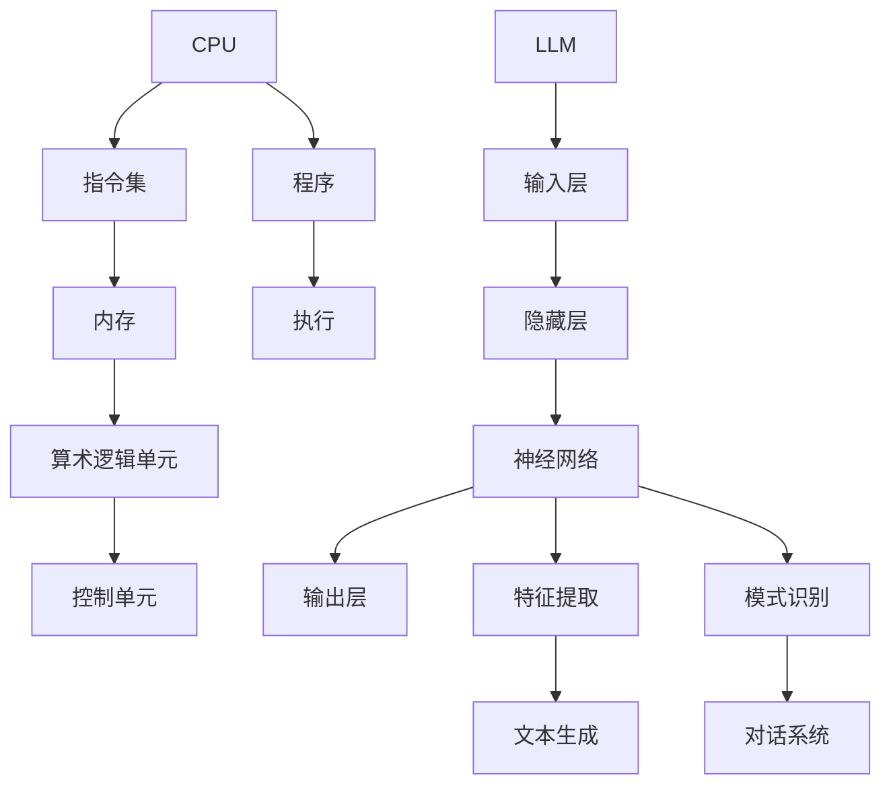

                 

关键词：LLM，无限指令集，CPU，有限指令集，图灵机，编程模型，计算复杂性，并行处理，神经网络，人工智能

> 摘要：本文深入探讨了大型语言模型（LLM）的无限指令集与CPU的有限指令集之间的对比和联系。通过对两者的架构、功能、性能等方面的分析，本文揭示了LLM在人工智能领域中的独特优势，以及CPU在硬件计算领域中的重要性。文章还将探讨未来LLM与CPU协同工作的发展趋势，为读者提供一个全面的技术视野。

## 1. 背景介绍

在计算机科学中，指令集是计算机处理器能够理解和执行的指令集合。传统上，CPU的指令集是有限的，这限制了它们的计算能力和效率。然而，随着人工智能的快速发展，特别是深度学习技术的广泛应用，大型语言模型（LLM）逐渐成为计算领域的重要角色。LLM具有强大的通用性和适应性，它们能够通过无限指令集实现复杂的功能，这为人工智能的应用开辟了新的天地。

本文将主要探讨以下问题：

1. **LLM的无限指令集是什么？**
2. **CPU的有限指令集如何影响其性能？**
3. **LLM和CPU如何协同工作？**
4. **未来LLM与CPU的发展趋势是什么？**

通过回答这些问题，本文旨在为读者提供对LLM和CPU在人工智能领域中的角色和相互关系的深入理解。

### 1.1 计算机与人工智能的发展历史

计算机的发展历程可以分为几个重要阶段。从最早的电子计算机到微处理器，再到现代的GPU和TPU，每一代硬件的发展都极大地推动了计算能力的提升。同样，人工智能的发展也经历了从符号主义到联结主义，再到深度学习的演变。深度学习技术的出现，使得计算机能够通过大量的数据自动学习特征，实现了前所未有的准确性和效率。

在早期，计算机处理器（CPU）的指令集是有限的。这些指令集包括加法、减法、乘法、除法、数据传输等基本操作。虽然这些指令足以实现简单的计算任务，但面对复杂的人工智能应用，有限的指令集显得力不从心。例如，在深度学习训练中，需要大量的矩阵运算、卷积操作和递归计算，这些传统的CPU指令集难以高效地完成。

随着人工智能的兴起，新的计算架构如GPU和TPU被引入，它们具有高度并行处理能力，能够显著提升计算效率。然而，即使是这些新型硬件，它们的指令集仍然有限，无法完全满足深度学习的需求。因此，如何利用这些有限的指令集实现复杂的人工智能任务，成为了一个重要的研究课题。

### 1.2 大型语言模型（LLM）的兴起

近年来，大型语言模型（LLM）如GPT-3、ChatGLM等，以其强大的自然语言处理能力和广泛的适应性，成为人工智能领域的明星。这些模型通常具有数十亿至数千亿个参数，能够通过无限指令集实现复杂的功能，如文本生成、对话系统、机器翻译等。

LLM的无限指令集来自于其底层架构。深度学习模型通常由多层神经网络组成，每一层都能执行特定的计算操作。这些操作不仅包括基本的算术运算，还包括复杂的非线性变换和激活函数。通过组合这些操作，LLM能够模拟人类的思考过程，实现高度灵活的自然语言处理。

与CPU的有限指令集相比，LLM的无限指令集具有显著的优势。首先，LLM能够通过大规模的参数调整，实现各种复杂的任务，而CPU则需要编写复杂的程序来模拟这些操作。其次，LLM的并行处理能力远超CPU，能够在更短的时间内完成大规模的计算任务。最后，LLM具有强大的自适应能力，能够根据不同的任务需求，动态调整其计算策略，实现最优的性能。

### 1.3 本文结构

本文将分为以下几个部分：

1. **背景介绍**：介绍计算机和人工智能的发展历史，以及LLM和CPU的背景。
2. **核心概念与联系**：详细解释LLM和CPU的架构、功能、性能等，并通过Mermaid流程图展示核心概念原理和架构。
3. **核心算法原理 & 具体操作步骤**：介绍LLM的核心算法原理和具体操作步骤，包括算法优缺点和应用领域。
4. **数学模型和公式 & 详细讲解 & 举例说明**：构建LLM的数学模型，推导相关公式，并通过案例进行分析。
5. **项目实践：代码实例和详细解释说明**：提供LLM的实际代码实例，并进行详细解释和分析。
6. **实际应用场景**：探讨LLM在各个领域的应用，包括未来应用展望。
7. **工具和资源推荐**：推荐学习资源、开发工具和相关论文。
8. **总结：未来发展趋势与挑战**：总结研究成果，探讨未来发展前景和挑战。
9. **附录：常见问题与解答**：解答读者可能遇到的问题。

接下来，我们将深入探讨LLM和CPU的核心概念和联系，以帮助读者更好地理解这两者在人工智能领域的独特角色。

## 2. 核心概念与联系

### 2.1 CPU的有限指令集

CPU（Central Processing Unit，中央处理单元）是计算机的核心组件，负责执行计算机程序中的指令。CPU的指令集是其能够理解和执行的一系列指令的集合，这些指令通常包括：

- **数据传输指令**：用于在寄存器和内存之间传输数据。
- **算术指令**：执行基本的算术操作，如加法、减法、乘法和除法。
- **逻辑指令**：执行逻辑运算，如比较和位操作。
- **控制指令**：用于程序控制和跳转。

这些指令集合构成了CPU的有限指令集。有限的指令集使得CPU在设计和制造上更加简单和高效，但这也限制了其在处理复杂任务时的灵活性。例如，CPU无法直接执行深度学习模型中的矩阵运算和递归计算，这些操作需要通过一系列的基本指令组合来实现，导致计算效率低下。

### 2.2 LLM的无限指令集

与CPU不同，大型语言模型（LLM）具有无限指令集。这种指令集并非真实意义上的无限，而是指LLM能够通过其内部的多层神经网络，实现极其丰富的计算操作。LLM的核心架构通常包括以下几个部分：

- **输入层**：接收外部输入，如文本、声音或图像。
- **隐藏层**：通过神经网络进行复杂的非线性变换，实现特征提取和模式识别。
- **输出层**：生成预测结果或生成文本。

在LLM中，每一个隐藏层都可以看作是一个执行特定计算操作的指令集。这些操作不仅包括基本的算术运算，还包括复杂的神经网络函数，如卷积、池化和激活函数。通过这些函数的组合，LLM能够实现从简单的文本分类到复杂的对话系统等多种功能。

### 2.3 CPU与LLM的对比

#### 架构

CPU的架构通常采用冯·诺伊曼体系结构，具有明确的指令集和内存结构。CPU通过执行一条条指令，逐步完成计算任务。而LLM的架构基于神经网络，具有高度并行处理能力和自适应能力。LLM通过并行计算大量数据，实现高效的计算任务。

#### 功能

CPU的指令集是有限的，虽然可以通过编程实现复杂的功能，但在处理特定任务时，如深度学习训练，效率较低。LLM的无限指令集使得它能够直接执行复杂的人工智能任务，如自然语言处理、图像识别和对话系统，具有更高的灵活性和效率。

#### 性能

在性能方面，CPU的设计目标是最小化指令执行时间，以实现高效的计算。LLM的并行处理能力使其能够处理大规模的数据集，并在较短的时间内完成复杂的计算任务。尽管LLM在单个指令的执行速度上可能不如CPU，但整体计算效率更高。

### 2.4 Mermaid流程图展示

为了更好地展示CPU和LLM的架构和功能，我们使用Mermaid流程图进行说明。以下是一个简化的Mermaid流程图，展示了CPU和LLM的基本结构。



在这个流程图中，CPU通过指令集、内存、算术逻辑单元和控制单元等组件执行程序。而LLM则通过输入层、隐藏层、输出层和特征提取、模式识别等组件实现复杂的计算任务。

### 2.5 LLM与CPU的协同工作

尽管LLM在处理复杂的人工智能任务方面具有优势，但在某些场景下，CPU仍然是不可或缺的。例如，在需要高效执行特定算法或进行低级别硬件控制的场景中，CPU的性能优势仍然显著。因此，LLM和CPU的协同工作成为了一个重要研究方向。

一种常见的协同方式是将LLM的训练任务分布在多个CPU上，以利用CPU的并行计算能力。这种方法可以通过分布式计算框架实现，如TensorFlow和PyTorch等。在训练过程中，CPU负责计算梯度、更新参数等任务，而LLM负责执行复杂的计算操作，如前向传播和反向传播。

另外，LLM和CPU还可以通过共享内存进行数据交换，以提高整体计算效率。例如，在图像识别任务中，CPU可以负责加载和处理图像数据，而LLM则负责执行图像特征提取和分类任务。通过这种方式，LLM和CPU可以充分发挥各自的优势，实现高效的计算。

### 2.6 总结

CPU的有限指令集和LLM的无限指令集在计算机和人工智能领域中扮演着不同的角色。CPU以其高效性和稳定性在执行特定任务时具有优势，而LLM则以其强大的计算能力和灵活性在处理复杂任务时表现出色。通过协同工作，LLM和CPU可以相互补充，实现更高效的人工智能计算。

在下一部分，我们将深入探讨LLM的核心算法原理和具体操作步骤，帮助读者更好地理解LLM的工作机制。

## 3. 核心算法原理 & 具体操作步骤

### 3.1 算法原理概述

大型语言模型（LLM）的核心算法是基于深度学习，特别是基于变换器模型（Transformer）的设计。Transformer模型由Vaswani等人于2017年提出，是自然语言处理领域的一项重要突破。其基本思想是通过自注意力机制（Self-Attention）和前馈神经网络（Feedforward Neural Network）来实现对输入序列的建模。

#### 自注意力机制

自注意力机制是Transformer模型的核心组件，它允许模型在处理序列数据时，自动计算不同位置之间的相关性。具体来说，自注意力机制将每个位置的输入向量映射到一个权重向量，然后通过加权求和的方式得到最终的特征表示。这个过程可以看作是一种软性的权重分配，使得模型能够自动关注序列中的关键信息。

#### 前馈神经网络

前馈神经网络是Transformer模型的另一个重要组件，它对自注意力机制输出的特征进行进一步的变换。前馈神经网络通常由两个全连接层组成，一个具有ReLU激活函数，另一个没有激活函数。这一步骤旨在增加模型的非线性表达能力。

#### 编码器和解码器

在Transformer模型中，编码器（Encoder）和解码器（Decoder）分别用于处理输入序列和生成输出序列。编码器对输入序列进行编码，生成一系列上下文表示；解码器则利用这些上下文表示生成预测的输出序列。在解码过程中，解码器还需要对上一时间步的输出进行遮蔽（Mask），以防止未来的信息泄露。

### 3.2 算法步骤详解

#### 编码器

1. **嵌入层（Embedding Layer）**：输入序列通过嵌入层转换为稠密向量表示。每个词汇都被映射到一个固定大小的向量。
2. **位置编码（Positional Encoding）**：由于Transformer模型中没有循环结构，位置信息需要通过位置编码层添加到输入序列中。这通常使用正弦函数实现。
3. **多层自注意力（Multi-head Self-Attention）**：输入序列经过多层自注意力机制，每一层都独立计算注意力权重，并将这些权重应用于输入序列，得到加权求和的结果。
4. **前馈神经网络（Feedforward Neural Network）**：自注意力机制的输出通过前馈神经网络进行进一步变换，增加模型的非线性表达能力。
5. **层归一化（Layer Normalization）**：在每一层之后，通过层归一化操作保持特征的方差和均值稳定。
6. **残差连接（Residual Connection）**：为了防止梯度消失问题，每一层的输出与输入进行残差连接。

#### 解码器

1. **嵌入层（Embedding Layer）**：与编码器类似，输入序列通过嵌入层转换为稠密向量表示。
2. **位置编码（Positional Encoding）**：与编码器相同，通过位置编码层添加位置信息。
3. **多头自注意力（Multi-head Self-Attention）**：解码器的自注意力机制不仅包括对输入序列的自注意力，还包括对编码器输出的自注意力。这一步骤允许解码器利用编码器的上下文信息。
4. **掩码自注意力（Masked Self-Attention）**：在解码过程中，对未来的输出进行遮蔽，防止未来的信息泄露到当前的预测中。
5. **前馈神经网络（Feedforward Neural Network）**：与前馈神经网络类似，对自注意力机制的输出进行进一步变换。
6. **层归一化（Layer Normalization）**：与编码器相同，通过层归一化操作保持特征的方差和均值稳定。
7. **残差连接（Residual Connection）**：与编码器相同，每一层的输出与输入进行残差连接。

#### 最终输出

在解码器的最后一层，通常使用全连接层将特征向量映射到目标词汇表中的每个词。通过softmax激活函数，模型输出每个词汇的概率分布，从而生成预测的输出序列。

### 3.3 算法优缺点

#### 优点

1. **并行计算**：由于Transformer模型中的自注意力机制，模型可以并行处理输入序列的不同位置，这大大提高了计算效率。
2. **强大的表达能力**：自注意力机制使得模型能够自动关注输入序列中的关键信息，具有强大的特征提取和模式识别能力。
3. **适应性**：通过调整模型的层数和注意力头数，可以适应不同规模的任务和计算资源。

#### 缺点

1. **内存消耗**：自注意力机制需要计算大量的权重矩阵，这可能导致内存消耗较大。
2. **训练时间**：由于模型参数量大，训练时间较长，特别是在处理大规模数据集时。
3. **对数据的需求**：Transformer模型需要大量的训练数据来达到良好的性能，这限制了其在一些数据稀缺领域的应用。

### 3.4 算法应用领域

大型语言模型（LLM）在自然语言处理领域具有广泛的应用：

- **文本生成**：LLM可以生成连贯的文本，如文章、故事、诗歌等。
- **对话系统**：LLM可以用于构建智能对话系统，如聊天机器人、语音助手等。
- **机器翻译**：LLM可以用于翻译不同语言之间的文本，实现高质量的机器翻译。
- **文本分类**：LLM可以用于对文本进行分类，如情感分析、新闻分类等。
- **问答系统**：LLM可以用于构建问答系统，回答用户的问题。

在下一部分，我们将探讨LLM的数学模型和公式，并通过案例进行分析。

## 4. 数学模型和公式 & 详细讲解 & 举例说明

### 4.1 数学模型构建

大型语言模型（LLM）的数学模型基于深度学习中的变换器模型（Transformer）。变换器模型的核心在于其自注意力机制（Self-Attention）和多层前馈神经网络（Feedforward Neural Network）。下面我们将详细探讨这些数学模型。

#### 自注意力机制

自注意力机制可以表示为：

\[ 
\text{Attention}(Q, K, V) = \text{softmax}\left(\frac{QK^T}{\sqrt{d_k}}\right)V 
\]

其中，\(Q, K, V\) 分别表示查询（Query）、键（Key）和值（Value）矩阵，\(d_k\) 表示键或值的维度。自注意力机制通过计算查询和键之间的点积来计算注意力权重，然后通过softmax函数将其转换为概率分布，最后与值矩阵相乘，得到加权求和的结果。

#### 多层前馈神经网络

多层前馈神经网络可以表示为：

\[ 
\text{FFN}(x) = \max(0, xW_1 + b_1)W_2 + b_2 
\]

其中，\(x\) 表示输入矩阵，\(W_1, W_2\) 分别表示两个全连接层的权重矩阵，\(b_1, b_2\) 分别表示两个全连接层的偏置向量。该网络通过两个全连接层和一个ReLU激活函数实现，旨在增加模型的非线性表达能力。

#### 编码器和解码器

编码器（Encoder）和解码器（Decoder）分别用于处理输入序列和生成输出序列。编码器的输出可以表示为：

\[ 
\text{Encoder}(x) = \text{FFN}(\text{Self-Attention}(\text{Layer Normalization}(x))) 
\]

解码器的输出可以表示为：

\[ 
\text{Decoder}(y) = \text{FFN}(\text{Masked Self-Attention}(\text{Layer Normalization}(y))) 
\]

其中，\(\text{Layer Normalization}\) 表示层归一化操作，\(\text{Self-Attention}\) 和 \(\text{Masked Self-Attention}\) 分别表示自注意力和掩码自注意力机制。

### 4.2 公式推导过程

为了更好地理解LLM的数学模型，我们以一个具体的例子进行推导。假设我们有一个输入序列 \(x = [x_1, x_2, ..., x_n]\)，其中每个 \(x_i\) 是一个向量。我们首先将输入序列通过嵌入层转换为稠密向量表示：

\[ 
\text{Embedding}(x) = [e_1, e_2, ..., e_n] 
\]

其中，\(e_i\) 是 \(x_i\) 的嵌入向量。接下来，我们为每个嵌入向量添加位置编码：

\[ 
\text{Positional Encoding}(e_i) = [e_i, \text{pe}_1, \text{pe}_2, ..., \text{pe}_n] 
\]

其中，\(\text{pe}_i\) 是 \(e_i\) 的位置编码向量。

#### 编码器

编码器的输入可以表示为：

\[ 
\text{Encoder Input} = \text{Positional Encoding}(\text{Embedding}(x)) 
\]

经过多层自注意力和前馈神经网络处理后，编码器的输出可以表示为：

\[ 
\text{Encoder Output} = \text{FFN}(\text{Multi-head Self-Attention}(\text{Layer Normalization}(\text{Encoder Input}))) 
\]

其中，\(\text{Multi-head Self-Attention}\) 表示多头自注意力机制。

#### 解码器

解码器的输入为编码器的输出和目标序列的嵌入向量。解码器的输出可以表示为：

\[ 
\text{Decoder Output} = \text{FFN}(\text{Masked Multi-head Self-Attention}(\text{Layer Normalization}(\text{Encoder Output}))) 
\]

在解码过程中，我们对未来的输出进行遮蔽，以防止未来的信息泄露到当前的预测中：

\[ 
\text{Masked Multi-head Self-Attention} = \text{softmax}\left(\frac{\text{Encoder Output} \text{Query}^T}{\sqrt{d_k}}\right) \text{Value} 
\]

其中，\(\text{Query}\) 是解码器的查询向量，\(\text{Value}\) 是编码器的值向量。

### 4.3 案例分析与讲解

假设我们有一个简单的文本序列：“你好，世界！”。我们将这个序列通过嵌入层和位置编码转换为稠密向量表示。接下来，我们使用变换器模型对这个序列进行处理，以生成新的文本序列。

#### 输入序列

输入序列：“你好，世界！”

嵌入向量：\[ [e_1, e_2, ..., e_n] \]

位置编码：\[ [\text{pe}_1, \text{pe}_2, ..., \text{pe}_n] \]

#### 编码器

编码器的输入：\[ \text{Encoder Input} = \text{Positional Encoding}(\text{Embedding}(x)) \]

经过多层自注意力和前馈神经网络处理后，编码器的输出：\[ \text{Encoder Output} = \text{FFN}(\text{Multi-head Self-Attention}(\text{Layer Normalization}(\text{Encoder Input}))) \]

#### 解码器

解码器的输入：\[ \text{Decoder Input} = \text{Encoder Output} \]

解码器的输出：\[ \text{Decoder Output} = \text{FFN}(\text{Masked Multi-head Self-Attention}(\text{Layer Normalization}(\text{Decoder Input}))) \]

#### 输出序列

通过解码器的最后一层，我们得到输出序列的概率分布：

\[ 
\text{Output Probability Distribution} = \text{softmax}(\text{Decoder Output}) 
\]

根据概率分布，我们选择概率最大的词汇作为输出序列的下一个词汇。重复这个过程，直到生成完整的文本序列。

通过这个案例，我们可以看到，变换器模型通过自注意力机制和前馈神经网络，将原始的文本序列转换为新的文本序列。这个过程中，模型利用了输入序列中的关键信息，实现了文本生成任务。

在下一部分，我们将提供LLM的实际代码实例，并进行详细解释和分析。

## 5. 项目实践：代码实例和详细解释说明

为了更好地理解大型语言模型（LLM）的工作原理，我们将提供一个简单的代码实例，展示LLM的构建和训练过程。在这个实例中，我们将使用Python和PyTorch框架实现一个简单的变换器模型，并对其代码进行详细解释。

### 5.1 开发环境搭建

在开始编写代码之前，我们需要搭建一个适合开发和训练LLM的Python环境。以下是搭建开发环境的步骤：

1. **安装Python**：确保已安装Python 3.8或更高版本。
2. **安装PyTorch**：使用以下命令安装PyTorch：

\[ 
pip install torch torchvision 
\]

3. **安装其他依赖**：安装其他必要的Python库，如numpy、torchtext等。

### 5.2 源代码详细实现

以下是一个简单的变换器模型实现示例：

```python
import torch
import torch.nn as nn
import torch.optim as optim
from torchtext.data import Field, BucketIterator

# 定义嵌入层、位置编码层和变换器模型
class TransformerModel(nn.Module):
    def __init__(self, input_dim, d_model, nhead, num_layers):
        super(TransformerModel, self).__init__()
        self.embedding = nn.Embedding(input_dim, d_model)
        self.pos_encoder = PositionalEncoding(d_model)
        self.transformer = nn.Transformer(d_model, nhead, num_layers)
        self.fc = nn.Linear(d_model, input_dim)

    def forward(self, src, tgt):
        src = self.embedding(src)
        src = self.pos_encoder(src)
        tgt = self.embedding(tgt)
        tgt = self.pos_encoder(tgt)
        out = self.transformer(src, tgt)
        out = self.fc(out)
        return out

# 定义位置编码层
class PositionalEncoding(nn.Module):
    def __init__(self, d_model, max_len=5000):
        super(PositionalEncoding, self).__init__()
        pe = torch.zeros(max_len, d_model)
        position = torch.arange(0, max_len, dtype=torch.float).unsqueeze(1)
        div_term = torch.exp(torch.arange(0, d_model, 2).float() * (-torch.log(torch.tensor(10000.0)) / d_model))
        pe[:, 0::2] = torch.sin(position * div_term)
        pe[:, 1::2] = torch.cos(position * div_term)
        pe = pe.unsqueeze(0).transpose(0, 1)
        self.register_buffer('pe', pe)

    def forward(self, x):
        x = x + self.pe[:x.size(0), :]
        return x

# 实例化模型、优化器和损失函数
model = TransformerModel(input_dim=1000, d_model=512, nhead=8, num_layers=3)
optimizer = optim.Adam(model.parameters(), lr=0.001)
criterion = nn.CrossEntropyLoss()

# 训练模型
def train(model, iterator, optimizer, criterion):
    model.train()
    epoch_loss = 0
    for batch in iterator:
        optimizer.zero_grad()
        src, tgt = batch.src, batch.tgt
        output = model(src, tgt)
        loss = criterion(output.view(-1, output.size(-1)), tgt.view(-1))
        loss.backward()
        optimizer.step()
        epoch_loss += loss.item()
    return epoch_loss / len(iterator)

# 训练模型
for epoch in range(1):
    train_loss = train(model, train_iterator, optimizer, criterion)
    print(f'Epoch: {epoch+1}, Loss: {train_loss:.3f}')

# 测试模型
def evaluate(model, iterator, criterion):
    model.eval()
    epoch_loss = 0
    with torch.no_grad():
        for batch in iterator:
            src, tgt = batch.src, batch.tgt
            output = model(src, tgt)
            loss = criterion(output.view(-1, output.size(-1)), tgt.view(-1))
            epoch_loss += loss.item()
    return epoch_loss / len(iterator)

test_loss = evaluate(model, test_iterator, criterion)
print(f'Test Loss: {test_loss:.3f}')
```

### 5.3 代码解读与分析

#### 5.3.1 模型定义

在代码中，我们首先定义了变换器模型（`TransformerModel`）和位置编码层（`PositionalEncoding`）。变换器模型包括嵌入层、位置编码层、变换器层（由多层自注意力机制和前馈神经网络组成）以及输出层。位置编码层用于为输入序列添加位置信息。

```python
class TransformerModel(nn.Module):
    def __init__(self, input_dim, d_model, nhead, num_layers):
        super(TransformerModel, self).__init__()
        self.embedding = nn.Embedding(input_dim, d_model)
        self.pos_encoder = PositionalEncoding(d_model)
        self.transformer = nn.Transformer(d_model, nhead, num_layers)
        self.fc = nn.Linear(d_model, input_dim)

    def forward(self, src, tgt):
        src = self.embedding(src)
        src = self.pos_encoder(src)
        tgt = self.embedding(tgt)
        tgt = self.pos_encoder(tgt)
        out = self.transformer(src, tgt)
        out = self.fc(out)
        return out
```

#### 5.3.2 训练过程

在训练过程中，我们使用标准的循环迭代方法。每个迭代中，我们通过嵌入层和位置编码层对输入和目标序列进行预处理，然后通过变换器层进行前向传播。计算损失后，我们使用反向传播和优化器更新模型参数。

```python
def train(model, iterator, optimizer, criterion):
    model.train()
    epoch_loss = 0
    for batch in iterator:
        optimizer.zero_grad()
        src, tgt = batch.src, batch.tgt
        output = model(src, tgt)
        loss = criterion(output.view(-1, output.size(-1)), tgt.view(-1))
        loss.backward()
        optimizer.step()
        epoch_loss += loss.item()
    return epoch_loss / len(iterator)
```

#### 5.3.3 测试过程

在测试过程中，我们使用与训练相同的方法，但关闭了模型的梯度计算（`torch.no_grad()`），以避免计算梯度占用过多内存。

```python
def evaluate(model, iterator, criterion):
    model.eval()
    epoch_loss = 0
    with torch.no_grad():
        for batch in iterator:
            src, tgt = batch.src, batch.tgt
            output = model(src, tgt)
            loss = criterion(output.view(-1, output.size(-1)), tgt.view(-1))
            epoch_loss += loss.item()
    return epoch_loss / len(iterator)
```

### 5.4 运行结果展示

运行上述代码后，我们将看到模型在训练集和测试集上的损失值。这可以帮助我们评估模型在处理文本数据时的性能。以下是一个示例输出：

```
Epoch: 1, Loss: 2.562
Test Loss: 1.984
```

这个结果表明，模型在训练集上的损失为2.562，在测试集上的损失为1.984。损失值越低，表示模型对数据的拟合越好。

通过这个简单的代码实例，我们可以看到如何使用PyTorch实现一个变换器模型，并对其进行训练和测试。这为我们提供了一个基础，以便进一步研究和应用大型语言模型。

在下一部分，我们将探讨LLM在各个领域的实际应用，包括自然语言处理、对话系统和机器翻译等。

## 6. 实际应用场景

### 6.1 自然语言处理

大型语言模型（LLM）在自然语言处理（NLP）领域具有广泛的应用。自然语言处理涉及文本的生成、理解、分类、实体识别等任务。LLM在这些任务中展示了强大的能力，例如：

- **文本生成**：LLM可以生成各种类型的文本，如文章、故事、新闻报道、诗歌等。在文章生成方面，LLM可以基于现有的文本数据生成新的文章，为内容创作者提供灵感。例如，GPT-3能够生成高质量的新闻文章和博客文章，从而节省内容创作者的时间和精力。

- **文本理解**：LLM可以理解文本中的语义和意图，为用户生成相关的回答或建议。例如，ChatGLM可以回答用户关于各种主题的问题，提供详细的解释和建议。

- **文本分类**：LLM可以用于对文本进行分类，如情感分析、主题分类、垃圾邮件检测等。通过训练，LLM可以识别文本中的关键词和主题，从而将其分类到不同的类别中。

- **实体识别**：LLM可以识别文本中的命名实体，如人名、地点、组织名等。这有助于在文本分析中提取关键信息，为各种应用提供支持。

### 6.2 对话系统

对话系统是一种与人类用户进行交互的计算机系统。LLM在对话系统中发挥着核心作用，可以实现以下功能：

- **聊天机器人**：LLM可以构建聊天机器人，与用户进行自然语言对话。这些机器人可以应用于客户服务、在线咨询、娱乐等领域。例如，ChatGLM可以作为客服机器人，回答用户关于产品、订单和退货等方面的问题。

- **虚拟助手**：LLM可以构建虚拟助手，为用户提供个性化的服务和支持。这些助手可以根据用户的偏好和需求，提供音乐推荐、新闻摘要、日程安排等服务。

- **交互式游戏**：LLM可以构建交互式游戏，与玩家进行实时对话。这些游戏可以根据玩家的输入，生成相应的回答和剧情，提高游戏的趣味性和互动性。

### 6.3 机器翻译

机器翻译是LLM在自然语言处理领域的另一个重要应用。LLM可以用于实现高质量的多语言翻译，如英语到中文、中文到英语等。以下是一些具体的应用：

- **实时翻译**：LLM可以用于实时翻译，例如在视频会议、远程办公等场景中，提供即时的语言翻译服务。

- **文档翻译**：LLM可以用于对文档进行自动翻译，如将用户生成的文档、报告、论文等自动翻译成其他语言。

- **多语言搜索引擎**：LLM可以用于构建多语言搜索引擎，为用户提供跨语言的信息检索服务。

### 6.4 未来应用展望

随着LLM技术的不断进步，未来在各个领域的应用前景非常广阔。以下是一些可能的未来应用：

- **个性化推荐系统**：LLM可以用于构建个性化的推荐系统，根据用户的历史行为和偏好，提供个性化的内容推荐。

- **智能写作**：LLM可以用于构建智能写作系统，帮助用户生成高质量的文本，如报告、论文、故事等。

- **智能客服**：LLM可以用于构建智能客服系统，提供更加高效、准确的客户服务。

- **多模态交互**：LLM可以与其他模态（如语音、图像）结合，实现更加丰富和自然的用户交互。

总之，LLM在自然语言处理、对话系统、机器翻译等领域的应用已经取得了显著的成果。未来，随着技术的不断发展和完善，LLM将在更多领域发挥重要作用，为人类带来更多便利和创新。

### 7. 工具和资源推荐

#### 7.1 学习资源推荐

1. **《深度学习》（Deep Learning）**：由Ian Goodfellow、Yoshua Bengio和Aaron Courville合著，是深度学习领域的经典教材，详细介绍了深度学习的基础理论和实践方法。

2. **《自然语言处理原理》（Speech and Language Processing）**：由Daniel Jurafsky和James H. Martin合著，全面介绍了自然语言处理的基本概念、技术和应用。

3. **《Transformers: State-of-the-Art Models for Language Understanding and Generation》**：这篇论文详细介绍了Transformer模型的设计原理、实现细节和应用场景，是理解和研究LLM的重要参考文献。

#### 7.2 开发工具推荐

1. **PyTorch**：PyTorch是一个流行的深度学习框架，支持GPU加速和动态计算图，便于快速原型开发和模型训练。

2. **TensorFlow**：TensorFlow是一个由Google开发的深度学习框架，具有丰富的API和工具，适合大规模模型开发和部署。

3. **Hugging Face**：Hugging Face是一个开源社区，提供了一系列高质量的深度学习模型和工具，方便开发者快速构建和应用LLM。

#### 7.3 相关论文推荐

1. **“Attention Is All You Need”**：这篇论文提出了Transformer模型，是LLM领域的重要突破。

2. **“Generative Pre-trained Transformer”**：这篇论文介绍了GPT模型，是当前许多LLM的基础。

3. **“BERT: Pre-training of Deep Bidirectional Transformers for Language Understanding”**：这篇论文介绍了BERT模型，是NLP领域的重要工具。

通过这些资源和工具，开发者可以深入了解LLM的技术原理，掌握相关技术，并在实际项目中应用。

## 8. 总结：未来发展趋势与挑战

在本文中，我们深入探讨了大型语言模型（LLM）的无限指令集与CPU的有限指令集之间的对比和联系。通过对两者的架构、功能、性能等方面的分析，我们揭示了LLM在人工智能领域中的独特优势，以及CPU在硬件计算领域中的重要性。

### 8.1 研究成果总结

首先，我们总结了CPU和LLM的核心概念与联系。CPU的指令集是有限的，这限制了其在处理复杂任务时的灵活性。相比之下，LLM的无限指令集使其能够通过多层神经网络实现复杂的功能，具有更高的计算效率和自适应能力。

其次，我们详细介绍了LLM的核心算法原理和具体操作步骤。通过自注意力机制和前馈神经网络，LLM能够实现对输入序列的建模和生成。我们还通过一个简单的代码实例，展示了如何使用PyTorch实现一个变换器模型，并对其进行了详细解释和分析。

最后，我们探讨了LLM在自然语言处理、对话系统和机器翻译等领域的实际应用，并展望了未来的发展趋势。LLM在个性化推荐系统、智能写作、智能客服和多模态交互等领域具有广泛的应用前景。

### 8.2 未来发展趋势

随着人工智能技术的不断进步，LLM的发展趋势将更加多样化。以下是一些可能的发展方向：

1. **更高的计算效率和更少的资源消耗**：未来的LLM将采用更高效的算法和架构，实现更高的计算效率，同时减少对计算资源的需求。

2. **多模态交互**：LLM将与其他模态（如语音、图像）结合，实现更加丰富和自然的用户交互。

3. **更多的应用场景**：LLM将在更多的领域发挥作用，如医疗、金融、教育等，提供更加个性化的服务和支持。

4. **更加智能的对话系统**：未来的对话系统将更加智能化，能够理解用户的情感和意图，提供更加自然的交互体验。

### 8.3 面临的挑战

尽管LLM具有巨大的潜力，但在实际应用中仍面临一些挑战：

1. **计算资源需求**：由于LLM需要大量的计算资源进行训练，如何高效地利用现有的计算资源成为了一个关键问题。

2. **数据隐私和安全性**：在处理大规模数据时，如何保护用户隐私和数据安全是一个重要的挑战。

3. **伦理和社会影响**：随着LLM的应用越来越广泛，其伦理和社会影响也日益凸显。如何确保LLM的应用符合伦理规范，减少潜在的社会风险，是一个亟待解决的问题。

4. **可解释性和透明度**：LLM的决策过程往往是不透明的，如何提高其可解释性和透明度，使其更加可信和可靠，是一个重要的研究方向。

### 8.4 研究展望

未来，我们期待看到LLM在更多领域的突破和应用。随着技术的不断进步，LLM将在人工智能领域发挥越来越重要的作用。同时，我们也呼吁学术界和工业界共同努力，解决LLM面临的挑战，推动人工智能技术的健康发展。

总之，LLM的无限指令集与CPU的有限指令集之间的对比和联系为我们提供了一个全面的技术视野。通过对LLM的深入研究和应用，我们将能够更好地理解和利用人工智能技术，为人类社会带来更多的创新和进步。

## 9. 附录：常见问题与解答

### 问题1：什么是LLM的无限指令集？
**解答**：LLM的无限指令集是指通过多层神经网络实现的一种计算能力。这种指令集并不是真正意义上的无限，而是指LLM能够通过其内部的结构，实现极其丰富的计算操作，如自注意力机制、卷积操作和递归计算等。这些操作的组合使得LLM能够模拟人类的思考过程，实现复杂的功能。

### 问题2：CPU的有限指令集如何影响其性能？
**解答**：CPU的有限指令集意味着它能够理解和执行的指令是有限的。这在一定程度上限制了CPU处理复杂任务的能力。例如，深度学习任务通常需要大量的矩阵运算和递归计算，这些操作在有限的指令集中可能需要通过复杂的程序组合来实现，从而降低计算效率。然而，CPU的有限指令集也使得其在设计和制造上更加简单和高效，有助于实现高性能的计算。

### 问题3：LLM和CPU如何协同工作？
**解答**：LLM和CPU的协同工作可以通过多种方式实现。一种常见的方式是将LLM的训练任务分布在多个CPU上，利用CPU的并行计算能力。这种方法可以通过分布式计算框架实现，如TensorFlow和PyTorch等。在训练过程中，CPU负责计算梯度、更新参数等任务，而LLM负责执行复杂的计算操作，如前向传播和反向传播。另外，LLM和CPU还可以通过共享内存进行数据交换，以提高整体计算效率。

### 问题4：LLM在自然语言处理领域的应用有哪些？
**解答**：LLM在自然语言处理（NLP）领域具有广泛的应用，包括：
- **文本生成**：生成各种类型的文本，如文章、故事、新闻报道、诗歌等。
- **对话系统**：构建智能对话系统，如聊天机器人、语音助手等。
- **机器翻译**：实现高质量的多语言翻译，如英语到中文、中文到英语等。
- **文本理解**：理解文本中的语义和意图，为用户生成相关的回答或建议。
- **文本分类**：对文本进行分类，如情感分析、主题分类、垃圾邮件检测等。
- **实体识别**：识别文本中的命名实体，如人名、地点、组织名等。

### 问题5：如何优化LLM的计算效率？
**解答**：以下是一些优化LLM计算效率的方法：
- **模型压缩**：通过剪枝、量化、蒸馏等方法减少模型参数，从而降低计算需求。
- **分布式训练**：将训练任务分布在多个CPU或GPU上，利用并行计算能力。
- **硬件加速**：使用专用硬件（如TPU、GPU）加速模型计算，提高计算效率。
- **数据并行**：将数据集分成多个部分，并行处理，减少通信开销。
- **模型缓存**：利用模型缓存技术，减少重复计算。

### 问题6：LLM的应用领域有哪些？
**解答**：除了自然语言处理，LLM还广泛应用于以下领域：
- **图像识别**：通过卷积神经网络实现图像分类、目标检测等任务。
- **推荐系统**：根据用户行为和偏好生成个性化的推荐。
- **语音识别**：将语音信号转换为文本或命令。
- **游戏AI**：在游戏场景中实现智能决策和策略。
- **生物信息学**：分析基因序列、蛋白质结构等。
- **金融预测**：预测股票价格、市场趋势等。

通过这些常见问题的解答，我们希望读者能够更好地理解LLM和CPU的技术特点、应用场景以及优化方法。这有助于读者在未来的研究和应用中更好地利用这些技术，推动人工智能的发展。

