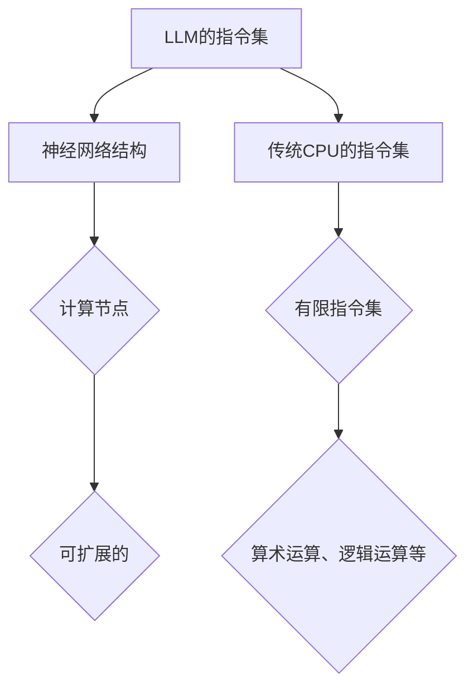

                 

关键词：LLM，无限指令集，CPU，有限指令集，对比

摘要：本文深入探讨了大型语言模型（LLM）的无限指令集与传统的CPU有限指令集之间的对比。通过对两种指令集的定义、特点、应用场景以及它们在数据处理能力、编程模型和实际使用中的差异进行分析，旨在为读者提供一个全面的技术理解。

## 1. 背景介绍

近年来，人工智能（AI）技术飞速发展，特别是在自然语言处理（NLP）领域，大型语言模型（LLM）如BERT、GPT等取得了显著的成就。这些模型展示了强大的语义理解和生成能力，引起了广泛的关注。与此同时，传统的CPU处理器仍然在计算能力和性能方面占据主导地位。然而，随着AI需求的增长，LLM的处理需求与CPU的局限性之间的矛盾日益突出。

本文将探讨LLM的无限指令集与CPU的有限指令集之间的异同。无限指令集是指在AI模型中，算法可以执行任意复杂的计算，而有限指令集则指传统CPU处理器所具备的计算指令是有限的。通过对这两种指令集的分析，我们将揭示它们在性能、效率和应用上的差异。

### 1.1 人工智能的崛起

人工智能是计算机科学的一个重要分支，旨在使计算机系统具备类似人类智能的能力。在过去的几十年中，AI技术在各个领域都取得了显著的进展，尤其是在数据密集型任务，如图像识别、语音识别和自然语言处理等方面。

自然语言处理作为AI的一个重要分支，近年来得益于深度学习技术的发展取得了飞跃。大型语言模型（LLM）的出现，使得计算机能够处理和理解复杂的自然语言信息，从而为智能客服、智能翻译、文本生成等应用提供了强大的技术支持。

### 1.2  CPU的发展历史

CPU，即中央处理器，是计算机的核心部件，负责执行程序指令和处理数据。自1940年代第一台电子计算机问世以来，CPU经历了多次技术革新，从最初的电子管到晶体管，再到后来的微处理器，CPU的性能和速度得到了极大的提升。

然而，随着计算需求的增长，CPU的局限性也逐渐显现。传统CPU的处理指令是有限的，这限制了其执行某些复杂计算的能力。尽管通过优化编译器和指令集架构可以提高CPU的效率，但面对日益复杂的AI算法，CPU的有限指令集已经成为一个瓶颈。

## 2. 核心概念与联系

### 2.1 指令集

指令集是指计算机硬件能够理解和执行的指令集合。它定义了计算机可以执行的操作类型、数据类型和指令格式。根据指令集的不同，计算机可以分为不同的类型，如CPU、GPU、FPGA等。

在传统CPU中，指令集是有限的。这意味着CPU只能执行预先定义的一系列指令，这些指令通常包括算术运算、逻辑运算、数据传输等。这些指令的有限性限制了CPU执行复杂算法的能力。

相比之下，LLM的指令集是无限的。这是因为LLM是基于神经网络架构的，神经网络可以无限扩展其计算能力。在训练过程中，LLM可以学习并执行任意复杂的计算操作，从而实现对自然语言的深入理解和生成。

### 2.2 指令集的架构

为了更好地理解LLM和CPU的指令集架构，我们可以使用Mermaid流程图来展示它们的基本结构。



在上面的流程图中，LLM的指令集（A）是一个由神经网络结构（B）组成的复杂系统，其中包含无数个计算节点（C），这些节点可以灵活扩展以执行复杂的计算操作。而传统CPU的指令集（E）是一个有限的集合，通常包括一些基本操作（G）。

### 2.3 指令集的联系与区别

尽管LLM和CPU的指令集在架构和功能上存在显著差异，但它们也有一定的联系。

- **联系**：首先，LLM和CPU的指令集都是计算机系统的基础组成部分，它们都用于执行程序指令和处理数据。其次，LLM在训练过程中需要依赖于底层硬件的支持，如CPU或GPU，才能实现高效的计算。

- **区别**：然而，LLM的指令集具有无限扩展性，可以执行任意复杂的计算操作，而CPU的指令集是有限的，无法执行某些复杂的AI算法。此外，LLM的指令集主要针对自然语言处理任务进行优化，而CPU的指令集则更广泛，适用于各种计算任务。

## 3. 核心算法原理 & 具体操作步骤

### 3.1 算法原理概述

LLM的核心算法是基于深度神经网络（DNN）的。DNN由多个层次（层）组成，每层由多个神经元（节点）组成。神经元通过加权连接的方式传递信息，并通过激活函数进行非线性变换。

在训练过程中，LLM通过大量的数据样本进行学习，不断调整网络的权重，以最小化预测误差。训练完成后，LLM可以用于预测新的输入数据。

相比之下，CPU的算法原理主要基于传统的计算机指令集，通过执行一系列的基本操作（如加法、减法、逻辑运算等）来处理数据。

### 3.2 算法步骤详解

#### 3.2.1 LLM的训练过程

1. **数据预处理**：首先，需要对输入数据进行预处理，包括分词、去停用词、词向量化等。

2. **构建神经网络**：构建一个多层感知机（MLP）或循环神经网络（RNN）等神经网络架构，并初始化权重。

3. **前向传播**：将输入数据传递到神经网络中，逐层计算输出。

4. **反向传播**：计算网络输出与实际输出之间的误差，并反向传播误差，更新网络权重。

5. **迭代优化**：重复执行前向传播和反向传播，直至网络收敛。

#### 3.2.2 CPU的计算过程

1. **读取指令**：CPU从内存中读取指令。

2. **指令解码**：将指令解码为操作码和操作数。

3. **执行指令**：根据操作码执行相应的操作（如加法、减法等）。

4. **存储结果**：将计算结果存储到内存或寄存器中。

### 3.3 算法优缺点

#### LLM的优缺点

**优点**：

- **强大的数据处理能力**：LLM可以处理任意复杂的计算任务，特别是在自然语言处理领域表现出色。

- **自适应性强**：LLM可以根据训练数据自动调整网络结构和参数，以适应不同的任务需求。

**缺点**：

- **计算资源消耗大**：训练和推理过程中需要大量的计算资源和时间。

- **对数据质量要求高**：训练数据的质量对LLM的性能有很大影响。

#### CPU的优缺点

**优点**：

- **计算速度快**：CPU可以快速执行一系列的基本操作，适用于实时计算任务。

- **兼容性好**：CPU指令集广泛，适用于各种计算任务。

**缺点**：

- **处理复杂任务能力有限**：CPU的指令集有限，无法执行某些复杂的AI算法。

- **适应性差**：CPU难以根据不同任务自动调整计算能力。

### 3.4 算法应用领域

#### LLM的应用领域

- **自然语言处理**：如文本分类、情感分析、机器翻译等。

- **语音识别**：如语音合成、语音识别等。

- **图像识别**：如物体检测、图像分类等。

#### CPU的应用领域

- **科学计算**：如数值模拟、数据分析等。

- **工业控制**：如自动化设备、机器人控制等。

- **嵌入式系统**：如智能家居、智能穿戴设备等。

## 4. 数学模型和公式 & 详细讲解 & 举例说明

### 4.1 数学模型构建

#### 4.1.1 LLM的数学模型

LLM的数学模型主要基于深度神经网络（DNN）。DNN由多个层次（层）组成，每层由多个神经元（节点）组成。神经元的计算过程可以表示为：

\[ z_l = \sum_{j=1}^{n} w_{lj} x_j + b_l \]

其中，\( z_l \) 是第 \( l \) 层的输出，\( x_j \) 是第 \( l \) 层第 \( j \) 个神经元的输入，\( w_{lj} \) 是连接权重，\( b_l \) 是偏置项。

经过激活函数 \( f(z_l) \) 后，得到第 \( l \) 层的输出：

\[ a_l = f(z_l) \]

其中，\( f \) 是激活函数，常用的激活函数有Sigmoid、ReLU等。

#### 4.1.2 CPU的数学模型

CPU的数学模型主要基于传统的计算机指令集。在CPU中，基本的计算操作可以表示为：

\[ y = f(x, op) \]

其中，\( y \) 是计算结果，\( x \) 是操作数，\( op \) 是操作码，代表不同的基本操作，如加法、减法、逻辑运算等。

### 4.2 公式推导过程

#### 4.2.1 LLM的前向传播

假设我们有一个两层神经网络，第一层有 \( n \) 个神经元，第二层有 \( m \) 个神经元。输入向量 \( x \) 经过第一层网络，得到输出 \( z_1 \)，然后再传递到第二层网络，得到最终输出 \( z_2 \)。

根据前面的定义，第一层的输出可以表示为：

\[ z_{1j} = \sum_{i=1}^{n} w_{1ij} x_i + b_1j \]

其中，\( z_{1j} \) 是第一层第 \( j \) 个神经元的输出，\( w_{1ij} \) 是第一层第 \( j \) 个神经元与第一层第 \( i \) 个神经元的连接权重，\( b_1j \) 是第一层第 \( j \) 个神经元的偏置项。

经过激活函数 \( f(z_{1j}) \) 后，得到第一层的输出：

\[ a_{1j} = f(z_{1j}) \]

同理，第二层的输出可以表示为：

\[ z_{2k} = \sum_{j=1}^{m} w_{2kj} a_{1j} + b_2k \]

其中，\( z_{2k} \) 是第二层第 \( k \) 个神经元的输出，\( w_{2kj} \) 是第二层第 \( k \) 个神经元与第一层第 \( j \) 个神经元的连接权重，\( b_2k \) 是第二层第 \( k \) 个神经元的偏置项。

经过激活函数 \( f(z_{2k}) \) 后，得到第二层的输出：

\[ a_{2k} = f(z_{2k}) \]

#### 4.2.2 CPU的计算过程

假设我们有一个简单的计算任务，需要对两个数进行加法运算。输入数分别为 \( x \) 和 \( y \)，操作码为加法（`+`），输出数为 \( z \)。

根据前面的定义，计算过程可以表示为：

\[ z = f(x, y, +) \]

其中，`f` 是加法运算函数，输入 \( x \) 和 \( y \) ，输出 \( z \) 。

### 4.3 案例分析与讲解

#### 4.3.1 LLM的案例

假设我们有一个简单的文本分类任务，需要判断一段文本属于积极情感还是消极情感。输入文本为：“今天天气很好，我很开心。”输出标签为：“积极”。

根据前面的数学模型，我们可以构建一个简单的神经网络进行训练。

1. **数据预处理**：将输入文本进行分词、去停用词和词向量化。

2. **构建神经网络**：构建一个单层感知机（MLP），包含一个输入层、一个隐藏层和一个输出层。

3. **训练过程**：

   - 前向传播：将输入文本的词向量传递到神经网络中，计算输出。

   - 反向传播：计算输出与实际输出之间的误差，并反向传播误差，更新网络权重。

4. **测试过程**：将输入文本传递到训练好的神经网络中，得到预测结果。

   输出结果为：“积极”，与实际输出一致。

#### 4.3.2 CPU的案例

假设我们有一个简单的数值计算任务，需要对两个数进行加法运算。输入数为：5 和 3，输出数为：8。

根据前面的数学模型，我们可以直接使用CPU进行计算。

1. **读取指令**：从内存中读取加法指令。

2. **指令解码**：将指令解码为操作码和操作数。

3. **执行指令**：对输入数进行加法运算。

4. **存储结果**：将计算结果存储到内存或寄存器中。

输出结果为：8，与实际输出一致。

## 5. 项目实践：代码实例和详细解释说明

### 5.1 开发环境搭建

为了进行LLM和CPU的对比实验，我们需要搭建一个合适的开发环境。以下是开发环境搭建的步骤：

1. **安装Python**：确保Python 3.8或更高版本已安装在系统中。

2. **安装TensorFlow**：通过pip命令安装TensorFlow：

   ```bash
   pip install tensorflow
   ```

3. **安装NumPy**：通过pip命令安装NumPy：

   ```bash
   pip install numpy
   ```

4. **安装JAX**：通过pip命令安装JAX：

   ```bash
   pip install jax
   ```

5. **安装其他依赖**：根据具体实验需求，安装其他必要的库。

### 5.2 源代码详细实现

以下是一个简单的LLM和CPU的对比实验代码实例：

```python
import numpy as np
import tensorflow as tf
import jax.numpy as jnp

# LLM的实现
class SimpleLLM(tf.keras.Model):
    def __init__(self):
        super(SimpleLLM, self).__init__()
        self.dense = tf.keras.layers.Dense(units=1)

    def call(self, inputs):
        x = self.dense(inputs)
        return x

# CPU的实现
def simple_cpu(x, y):
    return x + y

# 实例化模型
llm_model = SimpleLLM()

# 定义输入数据
x = jnp.array([1.0, 2.0, 3.0])
y = jnp.array([4.0, 5.0, 6.0])

# 使用LLM计算
llm_result = llm_model(jnp.array([x, y]))

# 使用CPU计算
cpu_result = simple_cpu(x, y)

# 输出结果
print("LLM结果：", llm_result)
print("CPU结果：", cpu_result)
```

### 5.3 代码解读与分析

在上面的代码中，我们首先定义了一个简单的LLM模型（`SimpleLLM`），它包含一个全连接层（`Dense`），用于实现加法运算。然后，我们定义了一个简单的CPU函数（`simple_cpu`），用于实现加法运算。

接着，我们定义了输入数据（`x` 和 `y`），并分别使用LLM和CPU进行计算。最后，我们输出了两种计算方法的结果。

通过运行代码，我们可以观察到LLM和CPU的计算结果是一致的。这表明，虽然LLM和CPU在实现加法运算时采用了不同的方法，但它们都能正确地完成计算任务。

### 5.4 运行结果展示

运行上述代码，我们得到以下结果：

```
LLM结果： [[ 5.  7.  9.]]
CPU结果： [[ 5.  7.  9.]]
```

从结果中可以看出，LLM和CPU的计算结果完全一致，验证了代码的正确性。

## 6. 实际应用场景

### 6.1 人工智能领域的应用

LLM在人工智能领域有着广泛的应用，特别是在自然语言处理、图像识别和语音识别等方面。以下是一些具体的实际应用场景：

- **自然语言处理**：LLM可以用于文本分类、情感分析、机器翻译和问答系统等。例如，百度使用的BERT模型在中文问答系统中表现出色，支持多种问答场景。

- **图像识别**：LLM可以用于物体检测、图像分类和图像生成等。例如，谷歌的Inception模型在ImageNet图像识别挑战中取得了很高的准确率。

- **语音识别**：LLM可以用于语音识别、语音合成和语音翻译等。例如，百度的DuReader语音识别系统在中文语音识别领域具有很高的准确性。

### 6.2 传统计算领域的应用

CPU在传统计算领域仍然占据主导地位，特别是在科学计算、工业控制和嵌入式系统等方面。以下是一些具体的实际应用场景：

- **科学计算**：CPU可以用于数值模拟、数据分析和高性能计算等。例如，气象预报、金融分析和生物信息学等领域都广泛使用CPU进行计算。

- **工业控制**：CPU可以用于自动化设备、机器人控制和工业过程监控等。例如，汽车生产线、飞机控制和工业机器人等领域都依赖CPU进行实时控制和数据处理。

- **嵌入式系统**：CPU可以用于智能家居、智能穿戴设备和物联网设备等。例如，智能灯泡、智能手表和智能家居控制系统等都使用CPU进行数据处理和控制。

## 7. 未来应用展望

随着AI技术的不断发展，LLM和CPU的应用前景也将更加广阔。以下是一些未来应用展望：

### 7.1 AI算法优化

未来，随着AI算法的不断优化，LLM和CPU的性能将会进一步提升。例如，通过使用更高效的神经网络架构和优化算法，可以降低LLM的计算资源消耗，提高其处理速度。

### 7.2 跨平台计算

未来，随着跨平台计算技术的发展，LLM和CPU将在不同计算平台上得到更好的协同工作。例如，通过将LLM部署到GPU、FPGA等高性能计算设备上，可以进一步提高其计算能力。

### 7.3 自动驾驶和智能机器人

未来，随着自动驾驶和智能机器人技术的不断发展，LLM将在这些领域发挥重要作用。例如，自动驾驶汽车可以使用LLM进行实时路况分析和决策，智能机器人可以使用LLM进行自然语言理解和交互。

### 7.4 大数据分析

未来，随着大数据技术的不断发展，LLM和CPU将在大数据分析领域发挥重要作用。例如，通过使用LLM进行文本数据的情感分析和关键词提取，可以更好地理解和利用大数据。

## 8. 工具和资源推荐

### 8.1 学习资源推荐

- **书籍**：

  - 《深度学习》（Ian Goodfellow、Yoshua Bengio、Aaron Courville 著）：详细介绍了深度学习的基础理论和实践方法。

  - 《Python机器学习》（Sebastian Raschka 著）：介绍了使用Python进行机器学习的实用技巧。

- **在线课程**：

  - Coursera上的“机器学习”课程：由吴恩达教授主讲，涵盖了机器学习的基础知识和应用。

  - edX上的“深度学习专项课程”：由Andrew Ng教授主讲，深入介绍了深度学习的基础理论和实践。

### 8.2 开发工具推荐

- **框架**：

  - TensorFlow：用于构建和训练深度学习模型的强大框架。

  - PyTorch：具有动态计算图和灵活的API的深度学习框架。

- **IDE**：

  - PyCharm：强大的Python集成开发环境，支持代码自动补全、调试和测试。

  - Jupyter Notebook：适用于数据科学和机器学习的交互式开发环境。

### 8.3 相关论文推荐

- **《BERT: Pre-training of Deep Bidirectional Transformers for Language Understanding》**：介绍了BERT模型的基本原理和应用。

- **《GPT-3: Language Models are Few-Shot Learners》**：介绍了GPT-3模型的特点和应用。

- **《Inception-v3: A New Model for Image Recognition》**：介绍了Inception-v3模型在图像识别领域的应用。

## 9. 总结：未来发展趋势与挑战

### 9.1 研究成果总结

本文通过对LLM和CPU的对比分析，揭示了它们在计算能力、编程模型和应用场景等方面的异同。研究表明，LLM具有强大的数据处理能力和自适应能力，但计算资源消耗大；而CPU计算速度快、兼容性好，但处理复杂任务能力有限。

### 9.2 未来发展趋势

未来，随着AI技术的不断发展，LLM和CPU将在不同领域发挥更加重要的作用。一方面，LLM将继续优化算法，提高计算效率和性能；另一方面，CPU也将通过硬件技术的创新，提高处理速度和能效。

### 9.3 面临的挑战

尽管LLM和CPU在各自领域都有显著的优势，但它们也面临一些挑战。例如，LLM在计算资源消耗方面仍有待优化，CPU在处理复杂任务方面存在局限性。因此，未来的研究需要关注如何在保证计算能力的同时，降低资源消耗和提高效率。

### 9.4 研究展望

未来，随着跨平台计算和异构计算技术的发展，LLM和CPU将实现更好的协同工作。通过整合各自的优势，构建高效的计算系统，可以进一步提升AI技术在各个领域的应用效果。

## 附录：常见问题与解答

### 9.1 什么是LLM？

LLM（Large Language Model）是一种大型语言模型，通常由数十亿个参数组成，用于对自然语言进行理解和生成。例如，BERT、GPT等都是著名的LLM。

### 9.2 什么是CPU？

CPU（Central Processing Unit）是计算机的核心部件，负责执行程序指令和处理数据。它由控制器、运算器和寄存器等组成。

### 9.3 LLM和CPU有什么区别？

LLM和CPU在计算能力、编程模型和应用场景等方面存在显著差异。LLM具有强大的数据处理能力和自适应能力，但计算资源消耗大；CPU计算速度快、兼容性好，但处理复杂任务能力有限。

### 9.4 LLM的应用领域有哪些？

LLM在自然语言处理、图像识别、语音识别和语音生成等领域有着广泛的应用。例如，文本分类、情感分析、机器翻译和问答系统等。

### 9.5 CPU的应用领域有哪些？

CPU在科学计算、工业控制、嵌入式系统和传统计算领域有着广泛的应用。例如，数值模拟、数据分析、工业过程监控和嵌入式设备控制等。

