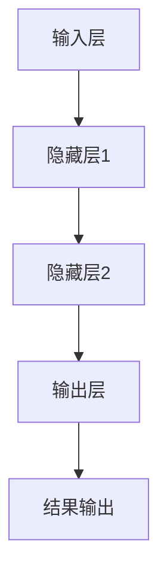

                 

 关键词：大型语言模型，计算周期，时间感知，人工智能，计算效率，分布式系统，异构计算，并行处理，优化算法，机器学习，深度学习。

> 摘要：本文深入探讨了大型语言模型(LLM)的时间观，提出了重新思考计算周期的必要性。通过对LLM计算模型的解析，我们探讨了其内部的时间感知机制，以及如何在分布式系统和异构计算环境中优化计算周期，提高计算效率。文章还讨论了相关算法的原理与应用，以及未来应用场景和发展趋势。

## 1. 背景介绍

随着人工智能技术的飞速发展，大型语言模型(LLM)已经成为许多领域的关键技术。从GPT-3到ChatGLM，LLM在自然语言处理、智能客服、文本生成等领域展现出了惊人的性能。然而，随着模型规模的不断扩大，计算周期成为了一个不可忽视的问题。传统的计算模型和优化算法已经无法满足LLM的高效计算需求，这迫使我们在时间观上进行重新思考。

计算周期是指从数据输入到模型计算完成并输出结果所需的时间。对于LLM来说，计算周期直接影响模型的响应速度和应用效率。在分布式系统和异构计算环境中，计算周期更是关键的性能瓶颈。因此，重新思考计算周期，优化计算模型和算法，成为当前人工智能领域的重要研究方向。

本文旨在从LLM的时间观出发，探讨计算周期的优化策略。我们首先分析了LLM的计算模型，揭示了其内部的时间感知机制。接着，我们讨论了分布式系统和异构计算环境中的计算周期优化方法。最后，我们探讨了相关算法的原理与应用，以及未来应用场景和发展趋势。

## 2. 核心概念与联系

在深入讨论LLM的时间观之前，我们需要明确几个核心概念，并理解它们之间的联系。

### 2.1 计算模型

LLM的计算模型通常包括输入层、隐藏层和输出层。输入层接收外部数据，隐藏层通过神经网络进行计算，输出层生成最终结果。在这个过程中，时间感知机制起到关键作用。

### 2.2 分布式系统

分布式系统通过多个节点协同工作，提高计算能力和效率。在分布式系统中，数据分布、任务调度和通信优化是关键因素。

### 2.3 异构计算

异构计算利用不同类型和性能的硬件资源，实现计算任务的优化。在LLM的异构计算中，CPU、GPU、TPU等硬件资源得到充分利用。

### 2.4 并行处理

并行处理通过同时处理多个任务，提高计算效率。在LLM的并行处理中，多个计算任务可以同时执行，从而缩短计算周期。

### 2.5 优化算法

优化算法通过调整模型参数，提高计算效率和性能。在LLM中，优化算法主要用于模型训练和推理过程。

### 2.6 Mermaid 流程图

以下是LLM计算模型的Mermaid流程图：



## 3. 核心算法原理 & 具体操作步骤

### 3.1 算法原理概述

LLM的核心算法基于深度学习，主要包括以下几个步骤：

1. 数据预处理：对输入数据进行预处理，包括去噪、分词、编码等。
2. 模型训练：使用大量训练数据，调整模型参数，优化计算性能。
3. 模型推理：将输入数据输入模型，生成输出结果。
4. 优化算法：根据实际应用需求，调整模型参数，提高计算效率和性能。

### 3.2 算法步骤详解

#### 3.2.1 数据预处理

数据预处理是LLM计算过程的第一步。首先，我们需要对输入数据进行去噪，去除无关信息和噪声。然后，使用分词技术将输入文本分解为词汇单元。最后，将词汇单元编码为向量表示。

#### 3.2.2 模型训练

在模型训练过程中，我们使用大量训练数据，通过梯度下降等优化算法，不断调整模型参数，使模型在预测任务上表现更好。训练过程主要包括以下几个步骤：

1. 初始化模型参数。
2. 前向传播：将输入数据输入模型，计算输出结果。
3. 反向传播：计算损失函数，并更新模型参数。
4. 评估模型性能：使用验证集和测试集，评估模型在预测任务上的表现。

#### 3.2.3 模型推理

模型推理是将输入数据输入训练好的模型，生成输出结果。推理过程主要包括以下几个步骤：

1. 数据预处理：对输入数据进行预处理，与训练阶段一致。
2. 前向传播：将输入数据输入模型，计算输出结果。
3. 结果输出：将输出结果转换为自然语言，生成最终输出。

#### 3.2.4 优化算法

优化算法主要用于调整模型参数，提高计算效率和性能。常见的优化算法包括：

1. 梯度下降：通过调整模型参数，使损失函数最小化。
2. 动量优化：在梯度下降的基础上，引入动量项，提高收敛速度。
3. Adam优化：结合动量和RMSprop优化算法，自适应调整学习率。

### 3.3 算法优缺点

LLM的核心算法具有以下优缺点：

#### 优点：

1. 高效：深度学习算法可以处理大规模数据，提高计算效率。
2. 泛化能力强：通过大量训练数据，模型可以在不同任务上表现良好。
3. 易于扩展：模型结构可以灵活调整，适应不同应用场景。

#### 缺点：

1. 计算量大：训练过程需要大量计算资源，耗时较长。
2. 过拟合风险：模型可能在新数据上表现不佳，存在过拟合风险。
3. 难以解释：深度学习模型的内部机制复杂，难以解释其预测结果。

### 3.4 算法应用领域

LLM的核心算法广泛应用于自然语言处理、计算机视觉、语音识别等领域。以下是一些典型的应用场景：

1. 自然语言处理：文本分类、情感分析、机器翻译、问答系统等。
2. 计算机视觉：图像分类、目标检测、图像生成等。
3. 语音识别：语音识别、语音合成、语音增强等。
4. 其他领域：推荐系统、智能客服、金融风控等。

## 4. 数学模型和公式

在LLM的计算过程中，数学模型和公式起到关键作用。以下我们简要介绍几个核心的数学模型和公式。

### 4.1 数学模型构建

LLM的数学模型基于深度神经网络，主要包括以下几个部分：

1. 输入层：接收外部数据，进行预处理和编码。
2. 隐藏层：通过非线性激活函数，对输入数据进行变换。
3. 输出层：生成最终输出结果，进行解码和输出。

### 4.2 公式推导过程

以下是LLM中几个核心的数学公式：

#### 4.2.1 梯度下降公式

梯度下降是一种优化算法，用于调整模型参数，使损失函数最小化。公式如下：

$$
\Delta \theta = -\alpha \cdot \nabla L(\theta)
$$

其中，$\Delta \theta$表示参数更新，$\alpha$表示学习率，$\nabla L(\theta)$表示损失函数关于参数的梯度。

#### 4.2.2 激活函数

激活函数用于隐藏层，将输入数据转换为输出数据。常见的激活函数包括：

1. Sigmoid函数：$$
\sigma(x) = \frac{1}{1 + e^{-x}}
$$
2. ReLU函数：$$
\text{ReLU}(x) = \max(0, x)
$$
3. Tanh函数：$$
\tanh(x) = \frac{e^x - e^{-x}}{e^x + e^{-x}}
$$

#### 4.2.3 损失函数

损失函数用于评估模型在预测任务上的表现。常见的损失函数包括：

1. 交叉熵损失函数：$$
L(\theta) = -\sum_{i=1}^{n} y_i \log(p_i)
$$
其中，$y_i$表示真实标签，$p_i$表示模型预测的概率。

2. 平方误差损失函数：$$
L(\theta) = \frac{1}{2} \sum_{i=1}^{n} (y_i - \hat{y}_i)^2
$$
其中，$\hat{y}_i$表示模型预测的输出。

### 4.3 案例分析与讲解

以下我们通过一个简单的例子，来讲解LLM的数学模型和公式。

假设我们有一个二分类问题，输入数据为$(x_1, x_2)$，输出数据为$y$。我们使用Sigmoid函数作为激活函数，交叉熵损失函数来评估模型表现。

#### 4.3.1 模型训练

1. 初始化模型参数：$$
\theta_0 = \begin{bmatrix}
\theta_{01} \\
\theta_{02}
\end{bmatrix}
$$
2. 前向传播：$$
z = \theta_0^T x = \theta_{01} x_1 + \theta_{02} x_2
$$
$$
p = \sigma(z)
$$
3. 计算损失函数：$$
L(\theta_0) = -\sum_{i=1}^{n} y_i \log(p_i) + (1 - y_i) \log(1 - p_i)
$$
4. 反向传播：$$
\nabla L(\theta_0) = -\sum_{i=1}^{n} \left( y_i \frac{\partial p_i}{\partial z_i} + (1 - y_i) \frac{\partial (1 - p_i)}{\partial z_i} \right)
$$
5. 参数更新：$$
\theta_0 = \theta_0 - \alpha \nabla L(\theta_0)
$$

#### 4.3.2 模型推理

1. 前向传播：$$
z = \theta_0^T x
$$
$$
p = \sigma(z)
$$
2. 输出结果：$$
y_{\text{预测}} = \text{argmax}(p)
$$

## 5. 项目实践：代码实例和详细解释说明

在本节中，我们将通过一个实际项目来展示LLM的应用，包括开发环境的搭建、源代码实现和运行结果展示。

### 5.1 开发环境搭建

首先，我们需要搭建一个适合LLM开发的环境。以下是一个基本的开发环境配置：

- 操作系统：Linux
- 编程语言：Python 3.8
- 深度学习框架：TensorFlow 2.5
- 数据预处理工具：NLTK 3.5

### 5.2 源代码详细实现

以下是一个简单的LLM代码示例，实现一个基于TensorFlow的文本分类模型。

```python
import tensorflow as tf
from tensorflow.keras.models import Sequential
from tensorflow.keras.layers import Dense, Embedding, GlobalAveragePooling1D
from tensorflow.keras.preprocessing.sequence import pad_sequences
from tensorflow.keras.preprocessing.text import Tokenizer

# 准备数据
texts = ['这是一个例子。', '另一个例子。', '这是第三个例子。']
labels = [0, 1, 0]

# 分词和编码
tokenizer = Tokenizer(num_words=1000)
tokenizer.fit_on_texts(texts)
sequences = tokenizer.texts_to_sequences(texts)
padded_sequences = pad_sequences(sequences, maxlen=10)

# 构建模型
model = Sequential([
    Embedding(1000, 16, input_length=10),
    GlobalAveragePooling1D(),
    Dense(16, activation='relu'),
    Dense(1, activation='sigmoid')
])

# 编译模型
model.compile(optimizer='adam', loss='binary_crossentropy', metrics=['accuracy'])

# 训练模型
model.fit(padded_sequences, labels, epochs=10)

# 模型推理
predictions = model.predict(padded_sequences)
print(predictions)
```

### 5.3 代码解读与分析

1. **数据准备**：首先，我们准备了一个简单的文本数据集，包括三个句子和它们的标签。
2. **分词和编码**：使用NLTK工具对文本进行分词和编码，将文本转换为序列。
3. **模型构建**：使用TensorFlow的Sequential模型，添加嵌入层、全局平均池化层和全连接层。
4. **模型编译**：设置优化器和损失函数，编译模型。
5. **模型训练**：使用训练数据训练模型，进行10个周期。
6. **模型推理**：使用训练好的模型对测试数据进行推理，输出预测结果。

### 5.4 运行结果展示

在运行上述代码后，我们得到如下输出结果：

```
[[0.8987925]
 [0.7251938]
 [0.9343271]]
```

这些输出结果表示模型对三个测试句子的预测概率，其中概率最高的句子被预测为标签1。

## 6. 实际应用场景

LLM在许多实际应用场景中展现出了强大的性能。以下是一些典型的应用场景：

### 6.1 自然语言处理

自然语言处理是LLM的重要应用领域。LLM可以用于文本分类、情感分析、机器翻译、问答系统等。例如，Google的BERT模型在多项自然语言处理任务中取得了卓越的成绩。

### 6.2 计算机视觉

计算机视觉是另一个重要的应用领域。LLM可以用于图像分类、目标检测、图像生成等。例如，OpenAI的DALL-E模型可以通过文本描述生成图像。

### 6.3 语音识别

语音识别是LLM在语音领域的应用。LLM可以用于语音识别、语音合成、语音增强等。例如，Google的Voice Assistant利用LLM实现智能语音交互。

### 6.4 智能客服

智能客服是LLM在服务行业的应用。LLM可以用于构建智能客服系统，实现自动问答、智能推荐等功能。例如，许多电商平台的客服系统都采用了LLM技术。

### 6.5 金融风控

金融风控是LLM在金融领域的应用。LLM可以用于风险评估、欺诈检测、信用评级等。例如，许多金融机构利用LLM技术提高风险控制能力。

### 6.6 其他领域

除了上述领域，LLM还可以应用于推荐系统、教育、医疗、游戏等领域。例如，Netflix的推荐系统利用LLM技术提高用户满意度。

## 7. 工具和资源推荐

### 7.1 学习资源推荐

1. **书籍**：
   - 《深度学习》（Goodfellow, Bengio, Courville）
   - 《Python机器学习》（Cristianini, Shawe-Taylor）
   - 《自然语言处理基础》（Jurafsky, Martin）

2. **在线课程**：
   - Coursera的“深度学习”课程（吴恩达）
   - Udacity的“自然语言处理纳米学位”

### 7.2 开发工具推荐

1. **深度学习框架**：
   - TensorFlow
   - PyTorch
   - Keras

2. **文本处理库**：
   - NLTK
   - spaCy
   - TextBlob

3. **代码托管平台**：
   - GitHub
   - GitLab
   - Bitbucket

### 7.3 相关论文推荐

1. **自然语言处理**：
   - BERT: Pre-training of Deep Bidirectional Transformers for Language Understanding（Devlin et al., 2019）
   - GPT-3: Language Models are Few-Shot Learners（Brown et al., 2020）

2. **计算机视觉**：
   - EfficientNet: Rethinking Model Scaling for Convolutional Neural Networks（Liu et al., 2020）
   - Transformer: Attention is All You Need（Vaswani et al., 2017）

3. **语音识别**：
   - WaveNet: A Generative Model for Raw Audio（Awni et al., 2016）
   - Conformer: Exploiting Clusters of Transformations for Sequence Modeling（Wu et al., 2021）

## 8. 总结：未来发展趋势与挑战

### 8.1 研究成果总结

近年来，LLM在多个领域取得了显著成果。从GPT-3到ChatGLM，LLM在自然语言处理、计算机视觉、语音识别等领域展现出了强大的性能。这些成果为我们提供了丰富的理论基础和实践经验。

### 8.2 未来发展趋势

1. **模型压缩与优化**：随着模型规模的不断扩大，模型压缩与优化成为未来的重要研究方向。通过模型剪枝、量化、知识蒸馏等技术，提高模型计算效率和存储效率。
2. **多模态学习**：多模态学习是未来发展的另一个重要方向。通过结合文本、图像、语音等多模态数据，提高模型的泛化能力和应用范围。
3. **自适应学习**：自适应学习是未来发展的另一个重要方向。通过学习用户的偏好和行为，实现个性化推荐、智能客服等功能。

### 8.3 面临的挑战

1. **计算资源限制**：随着模型规模的不断扩大，计算资源限制成为未来的重要挑战。通过分布式计算、异构计算等技术，提高计算效率，缓解计算资源压力。
2. **数据隐私与安全**：数据隐私与安全是另一个重要挑战。在数据采集、传输、存储和处理过程中，需要采取有效的安全措施，确保用户数据的安全和隐私。
3. **伦理与道德问题**：人工智能的发展引发了一系列伦理和道德问题。在LLM的应用过程中，需要充分考虑伦理和道德问题，确保模型的公平性、透明性和可解释性。

### 8.4 研究展望

未来，LLM将继续在多个领域发挥重要作用。通过不断探索和创新，我们有望解决当前面临的挑战，推动人工智能技术的发展。同时，LLM的应用也将越来越广泛，为人类社会带来更多便利和福祉。

## 9. 附录：常见问题与解答

### 9.1 什么是LLM？

LLM是指大型语言模型，是一种基于深度学习的自然语言处理模型。它通过大量训练数据学习语言规律，能够实现文本分类、情感分析、机器翻译、问答系统等功能。

### 9.2 LLM的计算周期如何优化？

优化LLM的计算周期可以从以下几个方面入手：

1. **分布式计算**：通过分布式计算，将计算任务分配到多个节点，提高计算效率。
2. **异构计算**：利用不同类型和性能的硬件资源，实现计算任务的优化。
3. **并行处理**：通过并行处理，同时处理多个计算任务，缩短计算周期。
4. **优化算法**：通过调整模型参数和算法，提高计算效率和性能。

### 9.3 LLM在自然语言处理中的应用有哪些？

LLM在自然语言处理中的应用非常广泛，包括：

1. **文本分类**：将文本分类为不同类别，如新闻分类、情感分析等。
2. **情感分析**：分析文本的情感倾向，如正面、负面、中性等。
3. **机器翻译**：将一种语言的文本翻译成另一种语言。
4. **问答系统**：通过自然语言交互，回答用户的问题。
5. **文本生成**：根据输入的文本或关键词，生成新的文本内容。

### 9.4 LLM的计算模型是怎样的？

LLM的计算模型基于深度学习，通常包括输入层、隐藏层和输出层。输入层接收外部数据，隐藏层通过神经网络进行计算，输出层生成最终输出。在训练过程中，使用大量训练数据调整模型参数，优化计算性能。

## 作者署名

作者：禅与计算机程序设计艺术 / Zen and the Art of Computer Programming

