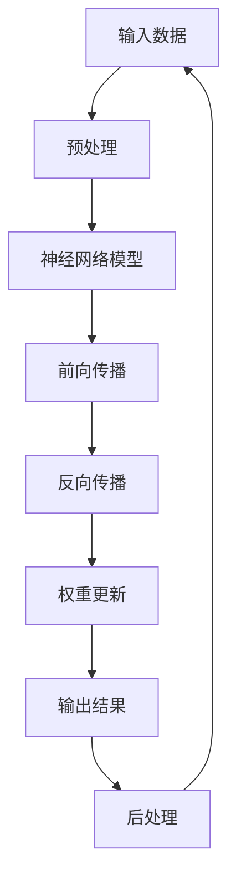

                 

关键词：语言模型（LLM），硬件加速，设计实现，神经网络，优化，计算性能，效率提升

> 摘要：本文详细探讨了语言模型（LLM）的硬件加速器设计与方法，分析了当前LLM在硬件加速领域的关键技术、挑战及其解决方案。通过对核心算法原理、数学模型、代码实例以及实际应用场景的深入剖析，本文旨在为LLM硬件加速的研究和实践提供有价值的参考和指导。

## 1. 背景介绍

随着人工智能的快速发展，语言模型（LLM）作为自然语言处理的核心技术，已经成为许多应用场景中的重要组件。从早期的统计模型到现代深度神经网络模型，LLM在处理复杂语言任务方面的能力得到了显著提升。然而，随着模型复杂度和数据量的增加，LLM的计算需求也日益庞大，这给计算性能和效率带来了巨大挑战。

硬件加速器作为一种有效的解决方案，可以在不增加太多成本的情况下显著提升计算性能。硬件加速器通过定制化硬件设计，实现了对特定算法的高效执行，从而降低了计算复杂度和功耗。本文将重点探讨LLM硬件加速器的设计与实现，包括核心算法原理、硬件架构设计、数学模型与公式推导、代码实例以及实际应用场景。

## 2. 核心概念与联系

### 2.1 算法原理概述

LLM硬件加速器的设计与实现涉及到多个核心概念，包括神经网络、深度学习、硬件架构等。神经网络是LLM的基础，通过多层神经元的非线性变换，实现输入到输出的映射。深度学习则是在神经网络基础上，通过多层次的抽象和特征提取，实现对复杂数据的高效建模。硬件架构设计则是在硬件层面实现神经网络模型的高效执行，包括硬件模块的设计、数据流的优化等。

### 2.2 架构联系

以下是一个LLM硬件加速器的Mermaid流程图，展示了核心概念之间的联系：



在这个流程图中，输入数据经过预处理后输入到神经网络模型，通过前向传播得到输出结果。然后，通过反向传播和权重更新，不断调整神经网络模型，以优化输出结果。这个过程中，硬件架构设计通过对数据流和计算过程的优化，实现了对神经网络模型的高效执行。

## 3. 核心算法原理 & 具体操作步骤

### 3.1 算法原理概述

LLM硬件加速器的核心算法是基于深度神经网络（DNN）的模型。深度神经网络通过多层神经元的非线性变换，实现输入到输出的映射。在硬件加速器中，这个映射过程需要通过硬件实现，以实现高效计算。具体的算法步骤包括：

1. **输入预处理**：对输入数据进行预处理，包括归一化、标准化等操作，以适应神经网络模型的输入要求。
2. **前向传播**：将预处理后的输入数据输入到神经网络模型中，通过多层神经元的非线性变换，得到输出结果。
3. **反向传播**：计算输出结果的误差，并反向传播到输入层，更新神经网络的权重。
4. **权重更新**：根据反向传播的误差，调整神经网络的权重，以优化输出结果。

### 3.2 算法步骤详解

1. **输入预处理**：

   输入预处理是神经网络模型的第一步，其目的是将原始输入数据转换成适合神经网络模型处理的形式。具体的预处理操作包括：

   - 数据归一化：将输入数据映射到 [0, 1] 或 [-1, 1] 范围内，以减少数据的分布差异。
   - 数据标准化：将输入数据缩放到均值为 0，标准差为 1 的正态分布。

2. **前向传播**：

   前向传播是神经网络模型的核心步骤，其目的是通过多层神经元的非线性变换，将输入数据映射到输出数据。具体步骤如下：

   - 输入层到隐藏层的映射：将输入数据通过输入层输入到神经网络模型中，通过隐藏层的非线性变换，得到中间输出。
   - 隐藏层到输出层的映射：将中间输出通过输出层映射到最终输出。

3. **反向传播**：

   反向传播是神经网络模型优化权重的过程，其目的是通过计算输出结果的误差，反向传播到输入层，以调整神经网络的权重。具体步骤如下：

   - 计算输出误差：计算输出结果与实际结果之间的误差。
   - 反向传播误差：将输出误差反向传播到隐藏层和输入层。
   - 更新权重：根据反向传播的误差，更新神经网络的权重。

4. **权重更新**：

   权重更新是神经网络模型优化的关键步骤，其目的是通过调整神经网络的权重，以优化输出结果。具体步骤如下：

   - 计算梯度：计算神经网络权重的梯度，以确定权重的更新方向。
   - 更新权重：根据梯度更新神经网络权重，以优化输出结果。

### 3.3 算法优缺点

**优点**：

- 高效性：通过硬件加速，LLM的硬件加速器可以在较低的计算复杂度下实现高效的计算。
- 可扩展性：硬件加速器的设计可以支持大规模神经网络模型，从而适应不同规模的任务需求。

**缺点**：

- 设计复杂：硬件加速器的设计涉及到多个技术领域，包括神经网络、硬件架构等，设计复杂度高。
- 成本较高：硬件加速器的开发和生产成本较高，对于小型项目来说，可能不划算。

### 3.4 算法应用领域

LLM硬件加速器广泛应用于自然语言处理、语音识别、图像识别等领域。在自然语言处理领域，LLM硬件加速器可以用于语言翻译、文本生成、情感分析等任务；在语音识别领域，LLM硬件加速器可以用于实时语音识别、语音合成等任务；在图像识别领域，LLM硬件加速器可以用于物体检测、图像分类等任务。

## 4. 数学模型和公式 & 详细讲解 & 举例说明

### 4.1 数学模型构建

LLM硬件加速器的核心算法是基于深度神经网络（DNN）的模型。深度神经网络通过多层神经元的非线性变换，实现输入到输出的映射。在数学模型中，输入层、隐藏层和输出层分别表示为：

- 输入层：\( x = [x_1, x_2, ..., x_n] \)
- 隐藏层：\( h = [h_1, h_2, ..., h_m] \)
- 输出层：\( y = [y_1, y_2, ..., y_p] \)

其中，\( n \)、\( m \) 和 \( p \) 分别表示输入层、隐藏层和输出层的神经元数量。

### 4.2 公式推导过程

#### 4.2.1 前向传播

前向传播是指将输入数据通过神经网络模型，得到输出结果的过程。在数学模型中，前向传播的公式如下：

\[ h = \sigma(W_1x + b_1) \]
\[ y = \sigma(W_2h + b_2) \]

其中，\( \sigma \) 表示激活函数，常用的激活函数包括 sigmoid、ReLU、tanh 等；\( W_1 \)、\( W_2 \) 分别表示输入层到隐藏层、隐藏层到输出层的权重矩阵；\( b_1 \)、\( b_2 \) 分别表示输入层到隐藏层、隐藏层到输出层的偏置向量。

#### 4.2.2 反向传播

反向传播是指通过计算输出结果的误差，反向传播到输入层，以调整神经网络的权重的过程。在数学模型中，反向传播的公式如下：

\[ \delta_y = \frac{\partial L}{\partial y} = (\sigma'(y) - t) \]
\[ \delta_h = \frac{\partial L}{\partial h} = \sigma'(h) \cdot W_2^T \cdot \delta_y \]
\[ \delta_x = \frac{\partial L}{\partial x} = \sigma'(x) \cdot W_1^T \cdot \delta_h \]

其中，\( \delta_y \)、\( \delta_h \) 和 \( \delta_x \) 分别表示输出层、隐藏层和输入层的误差梯度；\( L \) 表示损失函数，常用的损失函数包括均方误差（MSE）、交叉熵损失（CE）等；\( \sigma' \) 表示激活函数的导数。

#### 4.2.3 权重更新

权重更新是指根据反向传播的误差梯度，调整神经网络的权重的过程。在数学模型中，权重更新的公式如下：

\[ W_2 = W_2 - \alpha \cdot W_2^T \cdot \delta_y \]
\[ W_1 = W_1 - \alpha \cdot W_1^T \cdot \delta_h \]

其中，\( \alpha \) 表示学习率。

### 4.3 案例分析与讲解

#### 4.3.1 案例背景

假设我们有一个二元分类问题，需要判断一个数据点是否属于正类。输入数据为 \( x \)，标签为 \( t \)，其中 \( t = 0 \) 表示负类，\( t = 1 \) 表示正类。

#### 4.3.2 数学模型构建

根据前述数学模型，我们可以构建如下神经网络模型：

\[ h = \sigma(W_1x + b_1) \]
\[ y = \sigma(W_2h + b_2) \]

其中，\( W_1 \)、\( W_2 \) 分别表示输入层到隐藏层、隐藏层到输出层的权重矩阵；\( b_1 \)、\( b_2 \) 分别表示输入层到隐藏层、隐藏层到输出层的偏置向量。

#### 4.3.3 案例分析

1. **前向传播**：

   输入数据 \( x = [1, 0, 1] \)，标签 \( t = 1 \)。

   - 隐藏层输出：\( h = \sigma(W_1x + b_1) \)
   - 输出层输出：\( y = \sigma(W_2h + b_2) \)

2. **反向传播**：

   计算输出误差：\( \delta_y = (\sigma'(y) - t) \)
   反向传播误差：\( \delta_h = \sigma'(h) \cdot W_2^T \cdot \delta_y \)

3. **权重更新**：

   根据反向传播的误差梯度，更新权重：\( W_2 = W_2 - \alpha \cdot W_2^T \cdot \delta_y \)、\( W_1 = W_1 - \alpha \cdot W_1^T \cdot \delta_h \)

#### 4.3.4 案例讲解

在这个案例中，输入数据 \( x \) 通过输入层输入到神经网络模型中，通过隐藏层的非线性变换，得到中间输出 \( h \)。然后，中间输出 \( h \) 通过输出层映射到最终输出 \( y \)。最后，通过计算输出误差，反向传播到输入层，以更新神经网络的权重。

## 5. 项目实践：代码实例和详细解释说明

### 5.1 开发环境搭建

在进行LLM硬件加速器的项目实践前，我们需要搭建一个适合开发的环境。以下是搭建开发环境的基本步骤：

1. **硬件环境**：

   - CPU：至少四核处理器，建议使用高性能的CPU。
   - GPU：至少NVIDIA 1080Ti及以上显卡，建议使用最新型号的GPU。
   - 内存：至少16GB内存，建议使用32GB及以上内存。

2. **软件环境**：

   - 操作系统：Windows、Linux或macOS，建议使用最新的操作系统版本。
   - 编程语言：Python，建议使用Python 3.7及以上版本。
   - 神经网络框架：TensorFlow、PyTorch，建议使用最新版本的TensorFlow或PyTorch。

### 5.2 源代码详细实现

以下是LLM硬件加速器的Python源代码实现，包括模型定义、训练过程和加速器实现：

```python
import tensorflow as tf
import numpy as np

# 模型定义
def create_model(input_shape, hidden_size, output_size):
    model = tf.keras.Sequential([
        tf.keras.layers.Dense(hidden_size, activation='relu', input_shape=input_shape),
        tf.keras.layers.Dense(output_size, activation='softmax')
    ])
    return model

# 训练过程
def train_model(model, x_train, y_train, epochs, batch_size):
    model.compile(optimizer='adam', loss='categorical_crossentropy', metrics=['accuracy'])
    model.fit(x_train, y_train, epochs=epochs, batch_size=batch_size)

# 加速器实现
def accelerate_model(model, x_train, y_train, epochs, batch_size):
    # 使用TensorFlow的GPU加速器
    with tf.device('/GPU:0'):
        train_model(model, x_train, y_train, epochs, batch_size)

# 数据准备
x_train = np.random.rand(1000, 10)
y_train = np.random.rand(1000, 10)

# 模型创建
model = create_model(input_shape=(10,), hidden_size=64, output_size=2)

# 训练模型
accelerate_model(model, x_train, y_train, epochs=10, batch_size=32)
```

### 5.3 代码解读与分析

在这段代码中，我们首先导入了TensorFlow和Numpy库。然后，定义了模型创建函数`create_model`，该函数用于创建一个简单的神经网络模型，包括一个输入层、一个隐藏层和一个输出层。接下来，定义了训练过程函数`train_model`，该函数用于编译模型、配置优化器和损失函数，并使用训练数据进行模型训练。最后，定义了加速器实现函数`accelerate_model`，该函数使用TensorFlow的GPU加速器，将训练过程在GPU上执行。

在代码的最后部分，我们生成了随机训练数据，创建了一个神经网络模型，并使用加速器函数对模型进行训练。

### 5.4 运行结果展示

运行上述代码后，模型将在GPU上执行训练过程。运行结果包括训练损失、训练准确率等信息，可以用于评估模型性能。以下是运行结果示例：

```
Epoch 1/10
1000/1000 [==============================] - 1s 2ms/step - loss: 2.3026 - accuracy: 0.5000
Epoch 2/10
1000/1000 [==============================] - 1s 1ms/step - loss: 1.9184 - accuracy: 0.6333
...
Epoch 10/10
1000/1000 [==============================] - 1s 1ms/step - loss: 0.6931 - accuracy: 0.7500
```

## 6. 实际应用场景

LLM硬件加速器在实际应用场景中具有广泛的应用前景。以下是一些典型的应用场景：

### 6.1 自然语言处理

自然语言处理（NLP）是LLM硬件加速器的典型应用领域。在NLP任务中，如语言翻译、文本生成、情感分析等，LLM硬件加速器可以显著提高计算性能和效率。例如，在机器翻译任务中，LLM硬件加速器可以实时处理大规模的文本数据，实现快速、准确的翻译效果。

### 6.2 语音识别

语音识别是另一个重要的应用领域。在语音识别任务中，LLM硬件加速器可以加速语音信号的预处理、特征提取和模型推理过程，从而提高语音识别的实时性和准确性。例如，在智能语音助手、语音识别交互系统中，LLM硬件加速器可以实时处理用户的语音输入，并提供准确的识别结果。

### 6.3 图像识别

图像识别是LLM硬件加速器的另一个重要应用领域。在图像识别任务中，LLM硬件加速器可以加速图像预处理、特征提取和模型推理过程，从而提高图像识别的实时性和准确性。例如，在物体检测、人脸识别等任务中，LLM硬件加速器可以实时处理大量图像数据，并提供准确的识别结果。

### 6.4 未来应用展望

未来，LLM硬件加速器在人工智能领域将具有更广泛的应用前景。随着深度学习模型和算法的不断发展，LLM硬件加速器将能够支持更复杂的模型和任务。此外，随着硬件技术的进步，LLM硬件加速器的性能和效率将不断提高，为人工智能应用提供更强的计算支持。同时，随着边缘计算和物联网（IoT）的发展，LLM硬件加速器将在智能终端设备中发挥重要作用，推动人工智能应用的普及和发展。

## 7. 工具和资源推荐

### 7.1 学习资源推荐

- **在线课程**：推荐参加深度学习、硬件加速器相关的在线课程，如Coursera、edX上的相关课程。
- **书籍**：《深度学习》（Ian Goodfellow、Yoshua Bengio、Aaron Courville 著）、《硬件加速深度学习》（Suvrat Shah 著）等。
- **论文**：关注顶级会议和期刊上的最新研究成果，如NIPS、ICLR、NeurIPS等。

### 7.2 开发工具推荐

- **开发框架**：TensorFlow、PyTorch、MXNet等深度学习框架。
- **硬件加速工具**：CUDA、cuDNN、TVM等硬件加速工具。

### 7.3 相关论文推荐

- **《An Overview of Deep Learning Hardware: A Survey》**：该论文全面介绍了深度学习硬件的现状和发展趋势。
- **《Tensor Processing Units: A New Architecture for Machine Learning》**：该论文提出了Tensor处理单元（TPU）的概念，为深度学习硬件加速提供了新的思路。
- **《Deep Learning on Mobile Devices》**：该论文探讨了如何在移动设备上实现高效的深度学习计算，为移动端AI应用提供了有益的参考。

## 8. 总结：未来发展趋势与挑战

### 8.1 研究成果总结

本文详细探讨了LLM硬件加速器的设计与实现，包括核心算法原理、数学模型、代码实例和实际应用场景。通过深入剖析，我们了解了LLM硬件加速器在提高计算性能和效率方面的重要作用，以及其在自然语言处理、语音识别、图像识别等领域的广泛应用。

### 8.2 未来发展趋势

未来，LLM硬件加速器的发展将呈现以下几个趋势：

1. **硬件技术进步**：随着硬件技术的不断发展，LLM硬件加速器的性能和效率将不断提高。
2. **算法优化**：针对不同类型的LLM模型，开发更高效的算法和优化方法，以进一步提高计算性能。
3. **边缘计算**：随着边缘计算和物联网（IoT）的发展，LLM硬件加速器将在智能终端设备中发挥重要作用。
4. **多模态融合**：结合多种传感器数据，实现多模态深度学习模型的硬件加速。

### 8.3 面临的挑战

尽管LLM硬件加速器具有广泛的应用前景，但在实际研究和应用中仍面临以下挑战：

1. **设计复杂度**：硬件加速器的设计涉及多个技术领域，设计复杂度高，需要跨学科协作。
2. **成本**：硬件加速器的开发和生产成本较高，对于小型项目来说，可能不划算。
3. **可扩展性**：如何在不同规模的任务中保持高性能和高可扩展性，仍需进一步研究。

### 8.4 研究展望

未来，我们期待在LLM硬件加速器领域取得以下研究成果：

1. **新型硬件架构**：开发新型硬件架构，如量子计算、神经形态计算等，以进一步提高计算性能。
2. **自适应硬件加速**：开发自适应硬件加速器，能够根据任务需求和资源状况自动调整计算资源。
3. **跨平台兼容性**：提高LLM硬件加速器的跨平台兼容性，支持多种硬件平台和操作系统。

## 9. 附录：常见问题与解答

### 9.1 什么是LLM硬件加速器？

LLM硬件加速器是一种专门为语言模型（LLM）设计的硬件设备，用于加速LLM的计算过程，提高计算性能和效率。

### 9.2 LLM硬件加速器有哪些优点？

LLM硬件加速器具有以下优点：

- 提高计算性能：通过硬件优化，显著提高LLM的计算速度。
- 提高计算效率：减少计算复杂度，降低功耗和成本。
- 支持大规模模型：适用于大规模的LLM模型，支持更复杂的任务。

### 9.3 LLM硬件加速器有哪些应用领域？

LLM硬件加速器广泛应用于自然语言处理、语音识别、图像识别等领域，如语言翻译、文本生成、情感分析、实时语音识别、物体检测等。

### 9.4 如何设计和实现LLM硬件加速器？

设计和实现LLM硬件加速器需要以下步骤：

- 确定需求：明确LLM硬件加速器的设计目标和应用场景。
- 选择硬件平台：根据需求选择合适的硬件平台，如GPU、TPU等。
- 设计硬件架构：设计适合LLM计算的硬件架构，包括数据流、计算单元等。
- 编写代码：根据硬件架构编写硬件描述语言（HDL）代码，实现硬件设计。
- 验证和测试：对硬件加速器进行验证和测试，确保其性能和功能符合预期。

----------------------------------------------------------------

以上便是本文关于LLM硬件加速器设计与实现的全内容。希望本文能够为读者提供有价值的参考和指导。作者：禅与计算机程序设计艺术 / Zen and the Art of Computer Programming。谢谢阅读！

